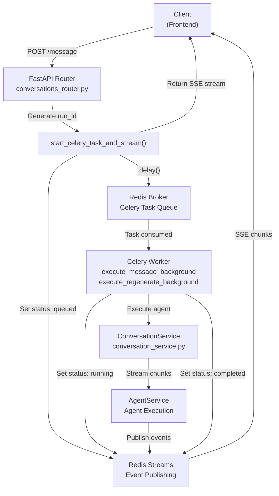
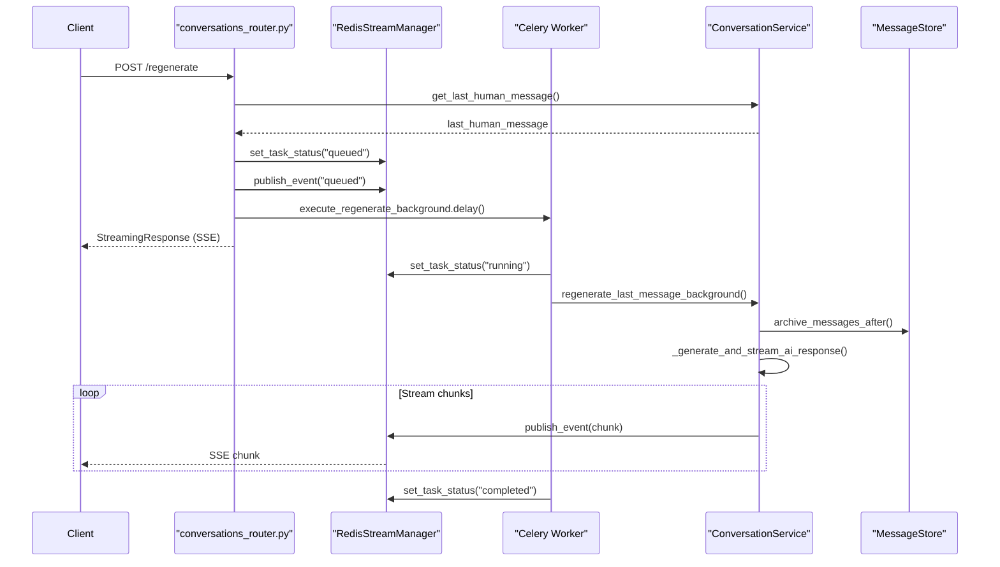
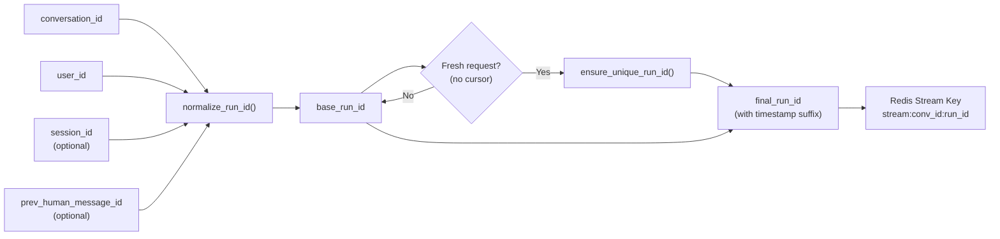
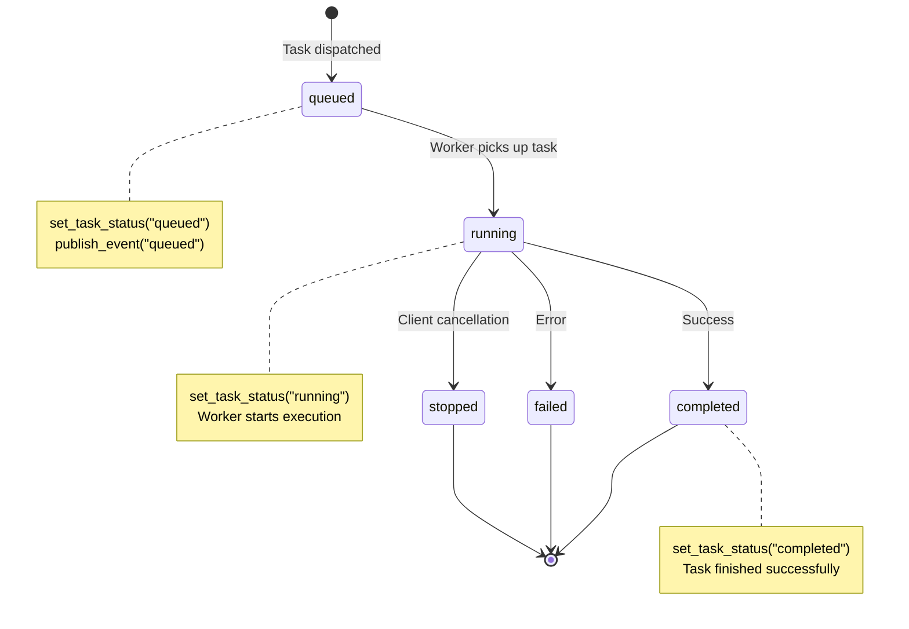
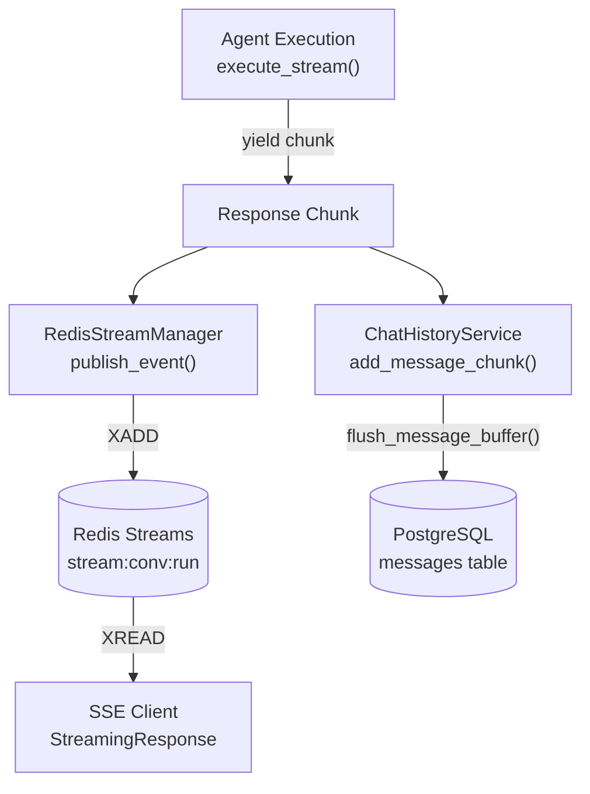
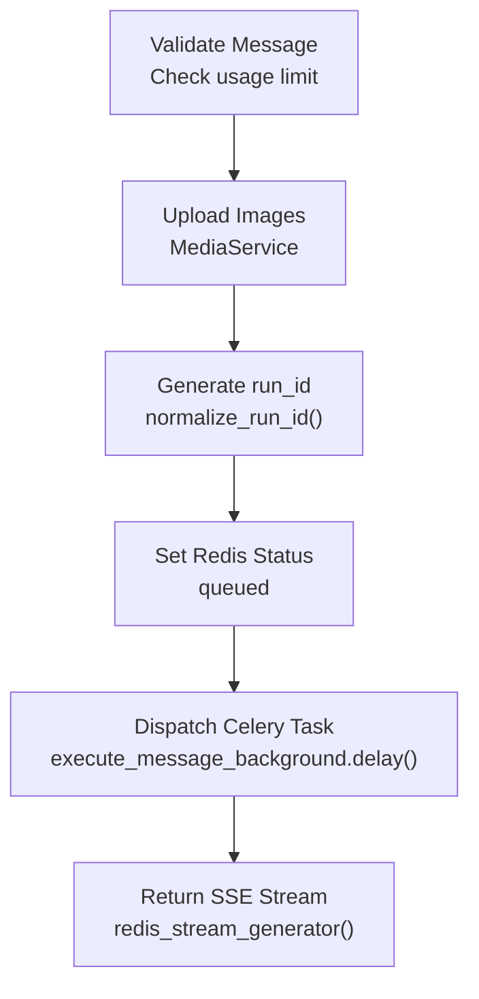
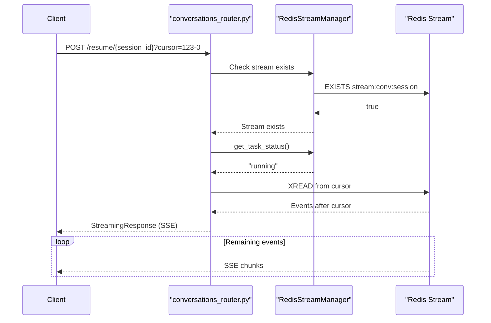
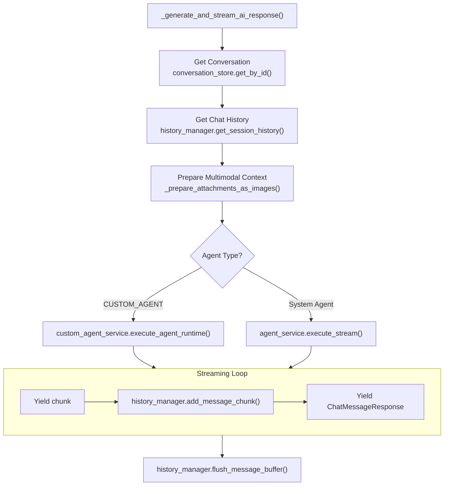
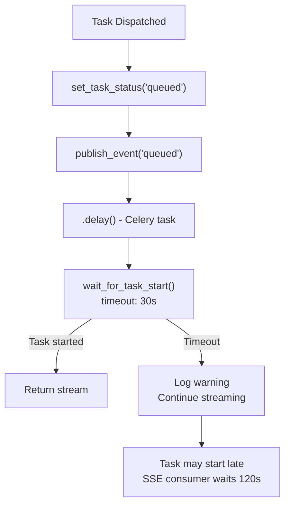
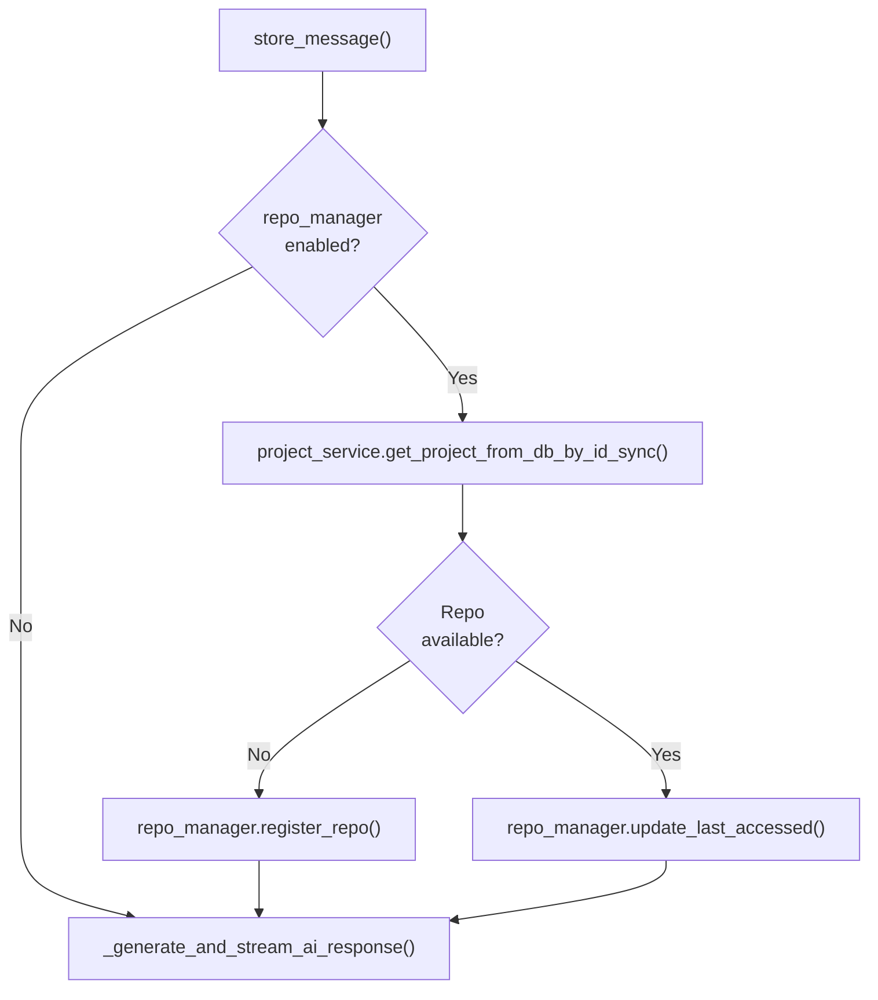

9.3-Agent Background Execution

# Page: Agent Background Execution

# Agent Background Execution

<details>
<summary>Relevant source files</summary>

The following files were used as context for generating this wiki page:

- [app/modules/conversations/conversation/conversation_controller.py](app/modules/conversations/conversation/conversation_controller.py)
- [app/modules/conversations/conversation/conversation_schema.py](app/modules/conversations/conversation/conversation_schema.py)
- [app/modules/conversations/conversation/conversation_service.py](app/modules/conversations/conversation/conversation_service.py)
- [app/modules/conversations/conversations_router.py](app/modules/conversations/conversations_router.py)

</details>


## Purpose and Scope

Agent Background Execution provides asynchronous processing of AI agent responses using Celery workers. This system allows the API to immediately return a streaming response while offloading the computationally expensive agent execution to background tasks. The system supports two primary operations: executing new messages (`execute_message_background`) and regenerating previous responses (`execute_regenerate_background`).

For information about the Celery task system configuration, see [Celery Task System](#9.1). For details about repository parsing tasks, see [Parsing Tasks](#9.2). For information about the conversation streaming architecture, see [Message Streaming and Redis Streams](#3.2).

---

## Architecture Overview

The background execution system follows a three-tier architecture: API layer, task queue, and worker execution layer, with Redis Streams serving as the communication bridge between background workers and streaming clients.

**Background Execution Flow**



Sources: [app/modules/conversations/conversations_router.py:161-286](), [app/modules/conversations/conversations_router.py:289-417]()

The API layer immediately returns HTTP 202 and starts streaming events from Redis, while the Celery worker processes the request asynchronously. This design prevents API timeouts and enables client reconnection.

---

## Task Types

The system supports two background task types, each implementing specific agent execution semantics.

### Message Execution Task

The `execute_message_background` task processes new user messages by executing the configured agent and streaming responses through Redis.

**Message Execution Components**

| Component | Location | Responsibility |
|-----------|----------|----------------|
| `start_celery_task_and_stream()` | `app.modules.conversations.utils.conversation_routing` | Task dispatcher and SSE initiator |
| `execute_message_background` | `app.celery.tasks.agent_tasks` | Celery task wrapper |
| `ConversationService.store_message()` | [conversation_service.py:544-652]() | Message storage and agent orchestration |
| `_generate_and_stream_ai_response()` | [conversation_service.py:891-1028]() | Agent execution and streaming |

Sources: [app/modules/conversations/conversations_router.py:161-286](), [app/modules/conversations/conversation/conversation_service.py:544-652]()

The message execution flow stores the human message, validates conversation access, prepares multimodal context (images), and executes either a system agent or custom agent based on the conversation configuration.

### Regeneration Task

The `execute_regenerate_background` task re-executes the last AI response, archiving subsequent messages and creating a new response stream.

**Regeneration Task Workflow**



Sources: [app/modules/conversations/conversations_router.py:289-417](), [app/modules/conversations/conversation/conversation_service.py:785-847]()

The regeneration task reuses the existing `_generate_and_stream_ai_response()` logic but adds message archival and attachment extraction from the previous human message.

---

## Session Management and Run IDs

The system uses deterministic `run_id` generation to enable client reconnection and session resumability. Each execution session is identified by a unique `run_id` that combines conversation context with optional session identifiers.

**Run ID Generation Strategy**



Sources: [app/modules/conversations/conversations_router.py:265-271](), [app/modules/conversations/conversations_router.py:335-341]()

The `normalize_run_id()` function creates a deterministic identifier from conversation context, while `ensure_unique_run_id()` adds a timestamp suffix for fresh requests to prevent stream collision. Clients can resume from a specific cursor position by providing the same `run_id`.

**Run ID Components**

| Parameter | Purpose | Example |
|-----------|---------|---------|
| `conversation_id` | Base conversation identifier | `01234567-89ab-cdef-0123-456789abcdef` |
| `user_id` | User context for multi-tenant isolation | `user_abc123` |
| `session_id` | Optional explicit session identifier | `session_xyz789` |
| `prev_human_message_id` | Links to specific message for regeneration | `msg_previous_123` |
| `cursor` | Stream position for resumption | `1234567890123-0` |

Sources: [app/modules/conversations/conversations_router.py:168-174](), [app/modules/conversations/conversations_router.py:294-299]()

---

## Redis Integration

The background execution system uses Redis for two distinct purposes: Celery task brokering and event streaming to clients.

### Task Status Management

Task status tracking enables clients to query execution progress and implement UI loading states.

**Status Lifecycle**



Sources: [app/modules/conversations/conversations_router.py:373-385](), [app/modules/conversations/conversations_router.py:387-396]()

The `RedisStreamManager` maintains task status in Redis with keys like `task_status:{conversation_id}:{run_id}` and stores the Celery task ID for potential revocation at `task_id:{conversation_id}:{run_id}`.

### Event Streaming

Redis Streams serve as the pub/sub mechanism for streaming AI responses to clients. Each event represents a chunk of the agent's response, including text, citations, and tool calls.

**Event Publishing Flow**



Sources: [app/modules/conversations/conversation/conversation_service.py:996-1015](), [app/modules/conversations/conversation/conversation_service.py:963-980]()

Events are published to Redis Streams with automatic TTL (default 1 hour) to balance resumability with resource usage. Clients consume events via Server-Sent Events (SSE) using the `redis_stream_generator()` function.

---

## API Endpoints for Background Execution

The conversation router exposes two endpoints that leverage background execution, both supporting streaming responses with session management.

### POST /conversations/{conversation_id}/message/

Submits a new message to a conversation with optional multimodal attachments and node context.

**Request Parameters**

| Parameter | Type | Required | Description |
|-----------|------|----------|-------------|
| `content` | Form | Yes | Message text content |
| `node_ids` | Form (JSON string) | No | Code graph node IDs for context |
| `images` | File (multipart) | No | Image attachments for multimodal context |
| `stream` | Query | No (default: true) | Enable streaming response |
| `session_id` | Query | No | Explicit session identifier for reconnection |
| `prev_human_message_id` | Query | No | Previous message ID for deterministic session |
| `cursor` | Query | No | Stream cursor for resuming from specific position |

Sources: [app/modules/conversations/conversations_router.py:161-286]()

The endpoint validates message content, uploads images to storage (via `MediaService`), generates a `run_id`, dispatches the Celery task, and returns a streaming SSE response immediately.

**Background Task Dispatch**



Sources: [app/modules/conversations/conversations_router.py:189-286]()

### POST /conversations/{conversation_id}/regenerate/

Re-generates the last AI response in a conversation, with support for additional node context.

**Request Parameters**

| Parameter | Type | Required | Description |
|-----------|------|----------|-------------|
| `node_ids` | Body (JSON array) | No | Additional code node context |
| `stream` | Query | No (default: true) | Enable streaming response |
| `session_id` | Query | No | Session identifier for reconnection |
| `prev_human_message_id` | Query | No | Previous message ID for deterministic session |
| `cursor` | Query | No | Stream cursor for resuming |
| `background` | Query | No (default: true) | Use background execution |

Sources: [app/modules/conversations/conversations_router.py:289-417]()

The regenerate endpoint extracts attachments from the last human message, archives subsequent messages, and dispatches `execute_regenerate_background.delay()` with the same streaming infrastructure as message execution.

---

## Task Status and Active Session Queries

Clients can query task status and active session information to implement reconnection logic and UI state management.

### GET /conversations/{conversation_id}/active-session

Returns the currently active session for a conversation, including session ID, status, cursor position, and timing information.

**Response Schema: ActiveSessionResponse**

```json
{
  "sessionId": "conv_123_user_456_1234567890",
  "status": "active",
  "cursor": "1234567890123-5",
  "conversationId": "01234567-89ab-cdef-0123-456789abcdef",
  "startedAt": 1234567890000,
  "lastActivity": 1234567891000
}
```

Sources: [app/modules/conversations/conversations_router.py:461-488](), [app/modules/conversations/conversation/conversation_schema.py:69-80]()

The endpoint uses `SessionService.get_active_session()` to retrieve session metadata from Redis. If no active session exists, it returns `ActiveSessionErrorResponse` with HTTP 404.

### GET /conversations/{conversation_id}/task-status

Queries the background task status for a conversation, providing information about whether a task is actively running and its estimated completion time.

**Response Schema: TaskStatusResponse**

```json
{
  "isActive": true,
  "sessionId": "conv_123_user_456_1234567890",
  "estimatedCompletion": 1234567892000,
  "conversationId": "01234567-89ab-cdef-0123-456789abcdef"
}
```

Sources: [app/modules/conversations/conversations_router.py:491-518](), [app/modules/conversations/conversation/conversation_schema.py:83-92]()

### POST /conversations/{conversation_id}/resume/{session_id}

Resumes streaming from an existing session by connecting to the Redis Stream at a specific cursor position.

**Resume Workflow**



Sources: [app/modules/conversations/conversations_router.py:521-566]()

The resume endpoint validates stream existence, checks task status, and returns a streaming response starting from the specified cursor position. This enables fault-tolerant client reconnection without losing any response data.

---

## Background Service Methods

The `ConversationService` class implements the core logic for background agent execution, with specialized methods for streaming responses through Redis.

### regenerate_last_message_background()

Dedicated method for background regeneration that bypasses direct streaming and publishes events to Redis Streams.

**Method Signature and Flow**

```python
async def regenerate_last_message_background(
    self,
    conversation_id: str,
    node_ids: Optional[List[str]] = None,
    attachment_ids: List[str] = [],
) -> AsyncGenerator[ChatMessageResponse, None]
```

Sources: [app/modules/conversations/conversation/conversation_service.py:785-847]()

The method performs access control validation, retrieves the last human message, archives subsequent messages, and delegates to `_generate_and_stream_ai_response()` for actual agent execution. This design reuses the streaming infrastructure while adding regeneration-specific logic like message archival.

**Regeneration Steps**

| Step | Method | Purpose |
|------|--------|---------|
| 1. Access Control | `check_conversation_access()` | Verify WRITE permission |
| 2. Message Retrieval | `_get_last_human_message()` | Get message to regenerate from |
| 3. Message Archival | `_archive_subsequent_messages()` | Remove messages after timestamp |
| 4. Analytics | `PostHogClient().send_event()` | Track regeneration event |
| 5. Agent Execution | `_generate_and_stream_ai_response()` | Generate new response |

Sources: [app/modules/conversations/conversation/conversation_service.py:792-832]()

### _generate_and_stream_ai_response()

Core method that executes agents and streams responses, used by both direct and background execution paths.

**Agent Execution Logic**



Sources: [app/modules/conversations/conversation/conversation_service.py:891-1028]()

The method retrieves conversation metadata, validates the agent ID, prepares chat history (last 8-12 messages), handles multimodal attachments, executes the appropriate agent type, and streams chunks through both the history manager (for persistence) and the response generator (for client delivery).

**Multimodal Context Preparation**

The service supports two types of image context:
1. **Current message attachments** - Images directly attached to the user's message via `_prepare_attachments_as_images()`
2. **Context images** - Recent images from conversation history via `_prepare_conversation_context_images()`

Sources: [app/modules/conversations/conversation/conversation_service.py:927-946]()

Both image sources are passed to the `ChatContext` object, which agents can use for vision-based analysis through multimodal LLM providers.

---

## Error Handling and Fault Tolerance

The background execution system implements multiple layers of error handling to ensure robustness and recoverability.

### Task Health Checks

The system implements a health check mechanism to detect stalled tasks and provide feedback to clients.

**Health Check Flow**



Sources: [app/modules/conversations/conversations_router.py:401-411]()

The `wait_for_task_start()` method polls Redis for status changes with a 30-second timeout. If the task doesn't start within this window, a warning is logged but the stream is still returned, as the SSE consumer has a longer 120-second timeout to accommodate queued tasks.

### Client Reconnection

Clients can reconnect to an existing session by providing the `run_id` and `cursor` position, enabling fault-tolerant streaming.

**Reconnection Scenarios**

| Scenario | Client Action | System Response |
|----------|---------------|-----------------|
| Network interruption | Reconnect with same `session_id` and `cursor` | Resume from cursor position |
| Tab refresh | Reconnect with `prev_human_message_id` | Deterministic `run_id` reconstruction |
| Intentional pause | Stop, then resume with `cursor` | Continue from last read position |
| Task completion | Reconnect after completion | Return cached completed stream |

Sources: [app/modules/conversations/conversations_router.py:521-566]()

The Redis Stream TTL (default 1 hour) defines the maximum window for reconnection. After TTL expiration, the stream is deleted and reconnection is no longer possible.

### Stop Generation

Clients can request early termination of agent execution by calling the stop endpoint.

**Stop Mechanism**

```python
@router.post("/conversations/{conversation_id}/stop/")
async def stop_generation(
    conversation_id: str,
    session_id: Optional[str] = Query(None),
    ...
):
    controller.stop_generation(conversation_id, session_id)
```

Sources: [app/modules/conversations/conversations_router.py:433-444]()

The stop operation revokes the Celery task (if task ID is available) and publishes a "stopped" event to the Redis Stream, signaling the client to close the SSE connection.

---

## Integration with Conversation Service

The background execution system integrates tightly with the `ConversationService` to provide a unified interface for both synchronous and asynchronous execution paths.

### Service Method Comparison

| Method | Execution Mode | Use Case |
|--------|----------------|----------|
| `store_message()` | Direct streaming | Legacy API, non-background mode |
| `regenerate_last_message()` | Direct streaming | Legacy regeneration, non-background mode |
| `regenerate_last_message_background()` | Background (Celery) | New default for regeneration |
| `_generate_and_stream_ai_response()` | Shared streaming logic | Used by all execution paths |

Sources: [app/modules/conversations/conversation/conversation_service.py:544-652](), [app/modules/conversations/conversation/conversation_service.py:688-783](), [app/modules/conversations/conversation/conversation_service.py:785-847]()

The `_generate_and_stream_ai_response()` method serves as the common implementation for agent execution, ensuring consistent behavior across direct and background execution modes. The background-specific methods add task orchestration, status management, and Redis event publishing layers.

### Repository Manager Integration

The service optionally integrates with the `RepoManager` to ensure code repositories are available for agent tool execution.

**Repository Availability Check**



Sources: [app/modules/conversations/conversation/conversation_service.py:309-518]()

The `_ensure_repo_in_repo_manager()` method runs in a thread pool (5-second timeout) to avoid blocking async execution with filesystem operations. This ensures the repository is registered and accessible before agent tools attempt to read code files.

---

## Performance Considerations

The background execution architecture enables several performance optimizations:

1. **Non-blocking API responses** - The API returns immediately (HTTP 202) without waiting for agent completion
2. **Worker scaling** - Multiple Celery workers can process tasks concurrently
3. **Connection pooling** - Redis connections are reused across requests
4. **Stream caching** - Completed streams remain available for replay within TTL window
5. **Cursor-based resumption** - Clients can skip already-consumed events when reconnecting

**Typical Latency Breakdown**

| Phase | Duration | Notes |
|-------|----------|-------|
| API validation & task dispatch | 10-50ms | Synchronous FastAPI processing |
| Celery queue wait | 0-5s | Depends on worker availability |
| Agent execution | 5-60s | Varies by query complexity and LLM latency |
| Event publishing | <1ms per chunk | Redis XADD operation |
| Client SSE delivery | Network-dependent | Streamed as generated |

Sources: [app/modules/conversations/conversations_router.py:161-286]()

The background architecture is particularly beneficial for conversations with complex agent workflows (multiple tool calls, long reasoning chains) where execution time exceeds typical HTTP timeout thresholds.