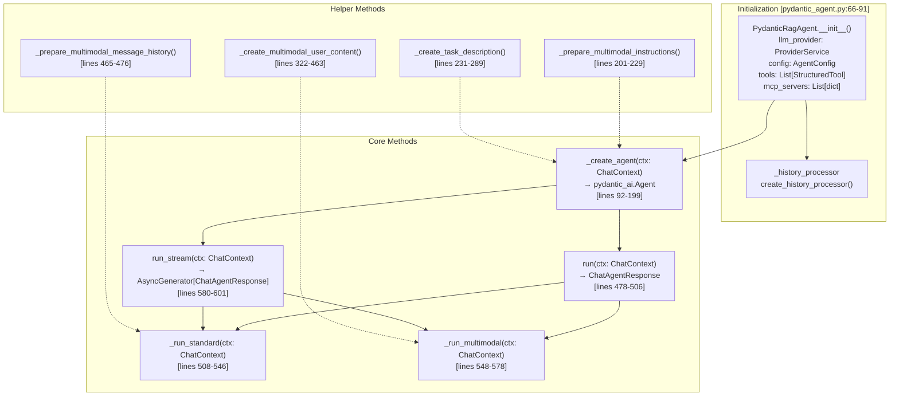
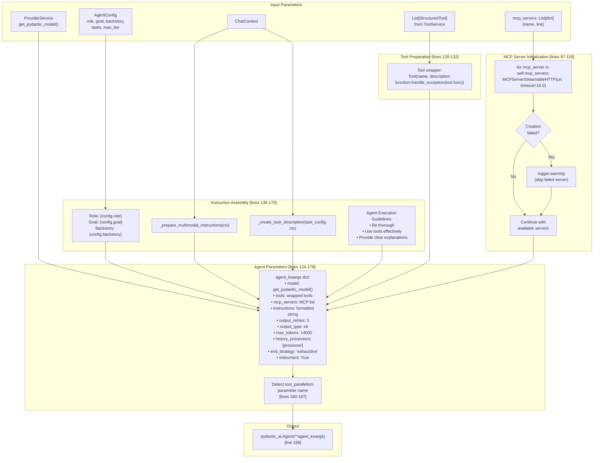
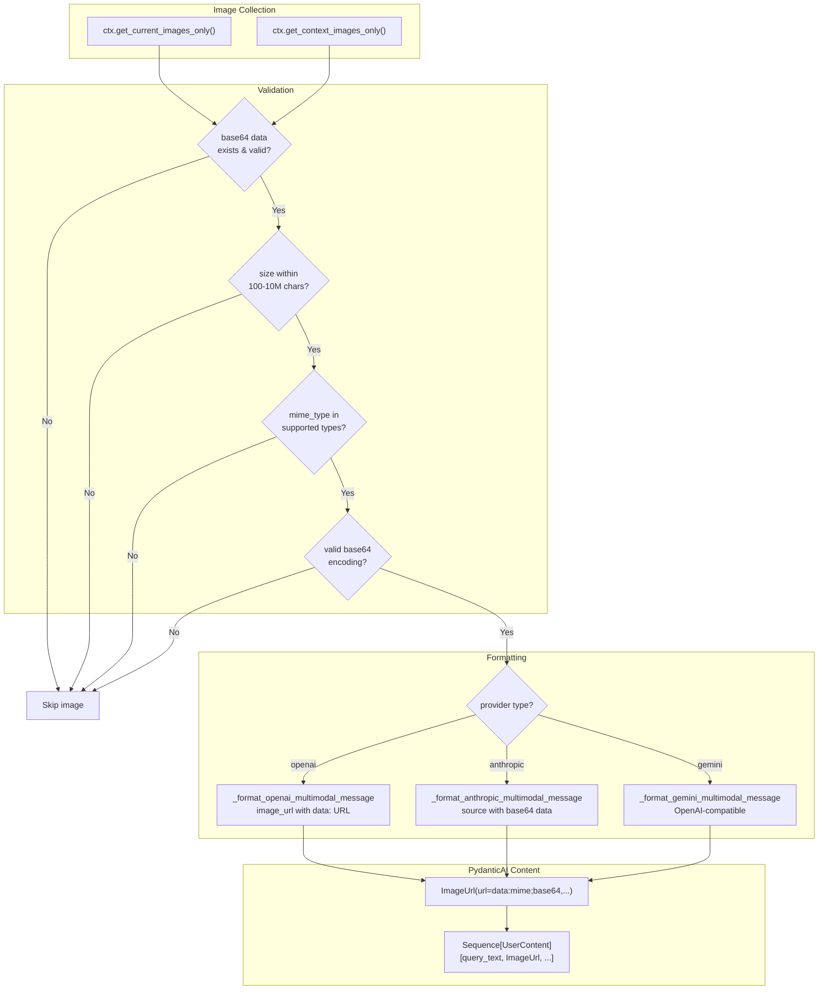
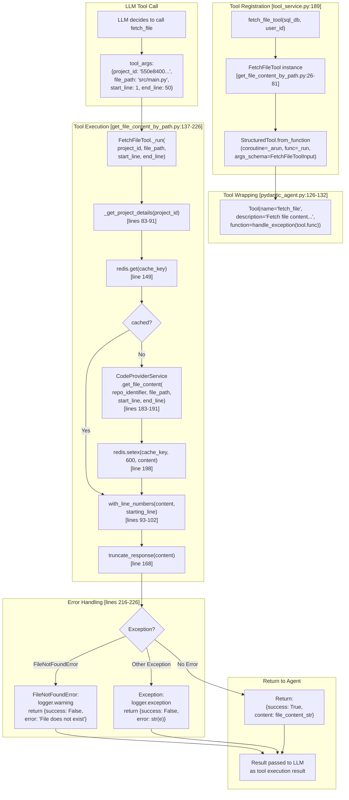
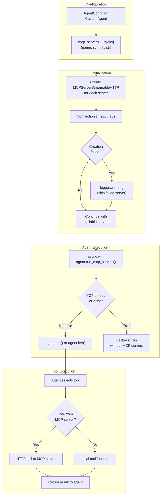

2.5-Agent Execution Pipeline

# Page: Agent Execution Pipeline

# Agent Execution Pipeline

<details>
<summary>Relevant source files</summary>

The following files were used as context for generating this wiki page:

- [app/modules/intelligence/agents/chat_agents/pydantic_agent.py](app/modules/intelligence/agents/chat_agents/pydantic_agent.py)
- [app/modules/intelligence/agents/chat_agents/tool_helpers.py](app/modules/intelligence/agents/chat_agents/tool_helpers.py)
- [app/modules/intelligence/tools/change_detection/change_detection_tool.py](app/modules/intelligence/tools/change_detection/change_detection_tool.py)
- [app/modules/intelligence/tools/code_query_tools/code_analysis.py](app/modules/intelligence/tools/code_query_tools/code_analysis.py)
- [app/modules/intelligence/tools/code_query_tools/get_file_content_by_path.py](app/modules/intelligence/tools/code_query_tools/get_file_content_by_path.py)
- [app/modules/intelligence/tools/tool_service.py](app/modules/intelligence/tools/tool_service.py)

</details>


## Purpose and Scope

This document details the agent execution pipeline implementation in Potpie, focusing on:
- `PydanticRagAgent` class architecture and execution flow
- Multimodal image processing with vision-capable LLMs
- Streaming response generation via Server-Sent Events (SSE)
- Tool integration through `ToolService` and exception handling
- MCP (Model Context Protocol) server integration

The pipeline processes user queries through pydantic-ai `Agent` instances, coordinating tool calls, LLM interactions, and response streaming.

For information about agent types and configuration, see [System Agents](#2.3) and [Custom Agents](#2.4). For agent routing and selection, see [Agent System Architecture](#2.2). For tool implementation details, see [Tool System](#5). For conversation management and message persistence, see [Conversation Service and Lifecycle](#3.1).

## PydanticRagAgent Architecture

The `PydanticRagAgent` class ([app/modules/intelligence/agents/chat_agents/pydantic_agent.py:66-91]()) is the primary execution engine for both system agents and custom agents. It wraps the pydantic-ai library's `Agent` class to provide:

**Title: PydanticRagAgent Class Structure**


**Key Components:**

| Component | File Location | Purpose |
|-----------|---------------|---------|
| `PydanticRagAgent` | [pydantic_agent.py:66]() | Main agent executor class |
| `AgentConfig` | [agent_config.py:19]() | Agent role, goal, backstory, tasks |
| `ChatContext` | [chat_agent.py:26]() | Query, history, images, project context |
| `ChatAgentResponse` | [chat_agent.py:28]() | Response text, tool calls, citations |
| `ProviderService` | [provider_service.py]() | LLM provider abstraction |
| `ToolService` | [tool_service.py:99]() | Tool registry and management |

**Sources:** [app/modules/intelligence/agents/chat_agents/pydantic_agent.py:66-91](), [app/modules/intelligence/agents/chat_agents/agent_config.py](), [app/modules/intelligence/agents/chat_agent.py]()

## Tool Integration

The `PydanticRagAgent` integrates tools through the `ToolService` class, which provides a centralized registry of all available tools. Each tool is a `StructuredTool` instance wrapped with exception handling.

### Tool Service Architecture

**Title: ToolService Initialization and Tool Registry**

```mermaid
graph TB
    subgraph "ToolService Class [tool_service.py:99-124]"
        INIT["ToolService.__init__(db, user_id)"]
        TOOLS_DICT["self.tools: Dict[str, StructuredTool]"]
        INITIALIZE["_initialize_tools()<br/>[lines 134-242]"]
    end
    
    subgraph "Code Query Tools"
        FETCH_FILE["fetch_file<br/>FetchFileTool<br/>[get_file_content_by_path.py:26]"]
        ANALYZE["analyze_code_structure<br/>UniversalAnalyzeCodeTool<br/>[code_analysis.py:417]"]
        ASK_KG["ask_knowledge_graph_queries<br/>[ask_knowledge_graph_queries_tool.py]"]
        GET_STRUCTURE["get_code_file_structure<br/>GetCodeFileStructureTool<br/>[get_code_file_structure.py]"]
    end
    
    subgraph "Change Detection"
        CHANGE_DETECT["change_detection<br/>ChangeDetectionTool<br/>[change_detection_tool.py:50]"]
    end
    
    subgraph "Integration Tools"
        JIRA_TOOLS["get_jira_issue, create_jira_issue,<br/>update_jira_issue, search_jira_issues<br/>[jira_tools.py]"]
        CONFLUENCE["get_confluence_page,<br/>create_confluence_page<br/>[confluence_tools.py]"]
        LINEAR["get_linear_issue,<br/>update_linear_issue<br/>[linear_tools.py]"]
    end
    
    subgraph "Web Tools"
        WEB_SEARCH["web_search_tool<br/>[web_search_tool.py]"]
        WEBPAGE["webpage_extractor<br/>[webpage_extractor_tool.py]"]
        CODE_PROVIDER["code_provider_tool,<br/>code_provider_create_branch<br/>[code_provider_tool.py]"]
    end
    
    subgraph "Execution Tools"
        BASH["bash_command<br/>bash_command_tool<br/>[bash_command_tool.py]"]
    end
    
    subgraph "Management Tools"
        TODO["create_todo, list_todos,<br/>update_todo_status<br/>[todo_management_tool.py]"]
        CODE_CHANGES["add_file_to_changes,<br/>update_file_in_changes<br/>[code_changes_manager.py]"]
        REQUIREMENTS["add_requirements,<br/>get_requirements<br/>[requirement_verification_tool.py]"]
    end
    
    INIT --> INITIALIZE
    INITIALIZE --> TOOLS_DICT
    
    TOOLS_DICT --> FETCH_FILE
    TOOLS_DICT --> ANALYZE
    TOOLS_DICT --> ASK_KG
    TOOLS_DICT --> GET_STRUCTURE
    TOOLS_DICT --> CHANGE_DETECT
    TOOLS_DICT --> JIRA_TOOLS
    TOOLS_DICT --> CONFLUENCE
    TOOLS_DICT --> LINEAR
    TOOLS_DICT --> WEB_SEARCH
    TOOLS_DICT --> WEBPAGE
    TOOLS_DICT --> CODE_PROVIDER
    TOOLS_DICT --> BASH
    TOOLS_DICT --> TODO
    TOOLS_DICT --> CODE_CHANGES
    TOOLS_DICT --> REQUIREMENTS
```


**Tool Categories:**

| Category | Tools | Example Use Cases |
|----------|-------|-------------------|
| **Code Query** | `fetch_file`, `analyze_code_structure`, `ask_knowledge_graph_queries` | Retrieve file content, analyze code structure, semantic search |
| **Change Detection** | `change_detection` | Git diff analysis, function-level changes, blast radius |
| **Integration** | Jira (9 tools), Confluence (7 tools), Linear (2 tools) | Issue management, documentation, project tracking |
| **Web** | `web_search_tool`, `webpage_extractor`, GitHub tools | Web search, content extraction, repository operations |
| **Execution** | `bash_command` | Execute shell commands with gVisor sandboxing |
| **Management** | Todo tools, code changes tools, requirements tools | Track todos, manage code changes, verify requirements |

**Sources:** [app/modules/intelligence/tools/tool_service.py:99-242]()

### Tool Exception Handling

All tools are wrapped with the `handle_exception` decorator to prevent crashes during execution:

```python
# From pydantic_agent.py:53-63
def handle_exception(tool_func):
    @functools.wraps(tool_func)
    def wrapper(*args, **kwargs):
        try:
            return tool_func(*args, **kwargs)
        except Exception:
            logger.exception("Exception in tool function", tool_name=tool_func.__name__)
            return "An internal error occurred. Please try again later."
    return wrapper
```

This wrapper ensures that tool failures return graceful error messages to the LLM instead of crashing the agent execution.

**Sources:** [app/modules/intelligence/agents/chat_agents/pydantic_agent.py:53-63]()

## Agent Execution Pipeline

The agent execution pipeline orchestrates the flow from context preparation through tool execution and response generation.

### Pipeline Phases

**Title: Complete PydanticRagAgent Execution Flow**
```mermaid
graph TB
    subgraph "Phase 1: Context Preparation [pydantic_agent.py:201-289]"
        CTX["ChatContext<br/>query, history, images,<br/>project_id, node_ids"]
        PREP_MULTI["_prepare_multimodal_instructions()<br/>[lines 201-229]"]
        PREP_TASK["_create_task_description()<br/>[lines 231-289]"]
        TASK_STR["Task description string<br/>CONTEXT, TASK HANDLING,<br/>INSTRUCTIONS"]
    end
    
    subgraph "Phase 2: Agent Creation [pydantic_agent.py:92-199]"
        CREATE["_create_agent(ctx)"]
        WRAP_TOOLS["Wrap tools with<br/>handle_exception<br/>[lines 126-132]"]
        INIT_MCP["Initialize MCP servers<br/>MCPServerStreamableHTTP<br/>[lines 97-118]"]
        BUILD_KWARGS["agent_kwargs dict:<br/>model, tools, mcp_servers,<br/>instructions, max_tokens=14000"]
        AGENT_INST["pydantic_ai.Agent(**agent_kwargs)<br/>[line 199]"]
    end
    
    subgraph "Phase 3: Execution Mode Selection [pydantic_agent.py:478-506]"
        RUN_METHOD["run(ctx: ChatContext)"]
        HAS_IMAGES{ctx.has_images() and<br/>is_vision_model()?}
        RUN_STANDARD["_run_standard(ctx)<br/>[lines 508-546]"]
        RUN_MULTIMODAL["_run_multimodal(ctx)<br/>[lines 548-578]"]
    end
    
    subgraph "Phase 4: Agent Execution"
        MCP_CTX["async with<br/>agent.run_mcp_servers()"]
        AGENT_RUN["agent.run(user_prompt,<br/>message_history)"]
        ITER_LOOP["Pydantic-AI iteration loop<br/>(max_iter from AgentConfig)"]
        TOOL_CALL["Tool execution<br/>via handle_exception wrapper"]
        LLM_CALL["LLM inference<br/>ProviderService.call_llm()"]
    end
    
    subgraph "Phase 5: Response"
        RESP["ChatAgentResponse<br/>response, tool_calls, citations"]
    end
    
    CTX --> PREP_MULTI
    CTX --> PREP_TASK
    PREP_MULTI --> TASK_STR
    PREP_TASK --> TASK_STR
    
    TASK_STR --> CREATE
    CREATE --> WRAP_TOOLS
    CREATE --> INIT_MCP
    WRAP_TOOLS --> BUILD_KWARGS
    INIT_MCP --> BUILD_KWARGS
    BUILD_KWARGS --> AGENT_INST
    
    AGENT_INST --> RUN_METHOD
    RUN_METHOD --> HAS_IMAGES
    
    HAS_IMAGES -->|No| RUN_STANDARD
    HAS_IMAGES -->|Yes| RUN_MULTIMODAL
    
    RUN_STANDARD --> MCP_CTX
    RUN_MULTIMODAL --> AGENT_RUN
    
    MCP_CTX --> AGENT_RUN
    AGENT_RUN --> ITER_LOOP
    ITER_LOOP --> TOOL_CALL
    ITER_LOOP --> LLM_CALL
    TOOL_CALL --> ITER_LOOP
    LLM_CALL --> ITER_LOOP
    ITER_LOOP --> RESP
```

**Key Execution Paths:**

| Path | Entry Point | File Location | Description |
|------|-------------|---------------|-------------|
| Standard (text-only) | `_run_standard()` | [pydantic_agent.py:508-546]() | Text-only queries with MCP server support |
| Multimodal (with images) | `_run_multimodal()` | [pydantic_agent.py:548-578]() | Vision-capable LLM with image processing |
| Streaming | `run_stream()` | [pydantic_agent.py:580-601]() | Real-time response via `agent.iter()` |

**Sources:** [app/modules/intelligence/agents/chat_agents/pydantic_agent.py:92-199](), [app/modules/intelligence/agents/chat_agents/pydantic_agent.py:478-578]()

## Agent Creation and Configuration

The `_create_agent()` method ([pydantic_agent.py:92-199]()) constructs a pydantic-ai `Agent` instance with tools, instructions, and LLM configuration.

### Agent Configuration Parameters

**Title: pydantic_ai.Agent Initialization in _create_agent()**


**Agent Configuration:**

| Parameter | Value | Purpose |
|-----------|-------|---------|
| `model` | `llm_provider.get_pydantic_model()` | Pydantic-compatible LLM wrapper |
| `tools` | Wrapped `StructuredTool` list | All tools with exception handling |
| `mcp_servers` | List of `MCPServerStreamableHTTP` | External HTTP tool servers |
| `instructions` | Formatted prompt string | Role, goal, task, context, guidelines |
| `output_retries` | `3` | Retry attempts for malformed outputs |
| `output_type` | `str` | Expected response type |
| `max_tokens` | `14000` | Maximum tokens in LLM response |
| `end_strategy` | `'exhaustive'` | Complete all tool calls before responding |
| `instrument` | `True` | Enable tracing/observability |
| `history_processors` | Token-aware processor | Limit message history to prevent overflow |

**Sources:** [app/modules/intelligence/agents/chat_agents/pydantic_agent.py:92-199]()

## Streaming Execution

The `run_stream()` method ([pydantic_agent.py:580-601]()) uses pydantic-ai's `agent.iter()` to stream responses in real-time via Server-Sent Events.

### Streaming Architecture

**Title: run_stream() Execution with agent.iter()**
```mermaid
graph TB
    subgraph "Stream Initialization [pydantic_agent.py:580-601]"
        RUN_STREAM["run_stream(ctx: ChatContext)"]
        CHECK_VISION{ctx.has_images() and<br/>is_vision_model()?}
        STANDARD_STREAM["_run_standard_stream(ctx)<br/>[lines 722-843]"]
        MULTIMODAL_STREAM["_run_multimodal_stream(ctx)<br/>[lines 603-720]"]
    end
    
    subgraph "Agent Iteration [lines 625-629, 737-743]"
        CREATE_AGENT["agent = self._create_agent(ctx)"]
        AGENT_ITER["async with agent.iter(<br/>user_prompt, message_history)<br/>as run:"]
        NODE_LOOP["async for node in run:"]
    end
    
    subgraph "Node Type Detection [lines 630, 744, 806]"
        IS_MODEL_REQ["Agent.is_model_request_node(node)"]
        IS_CALL_TOOLS["Agent.is_call_tools_node(node)"]
        IS_END["Agent.is_end_node(node)"]
    end
    
    subgraph "Model Request Events [lines 631-655]"
        NODE_STREAM["async with node.stream(run.ctx)<br/>as request_stream:"]
        EVENT_LOOP["async for event in request_stream:"]
        PART_START["PartStartEvent<br/>isinstance(event.part, TextPart)"]
        PART_DELTA["PartDeltaEvent<br/>isinstance(event.delta, TextPartDelta)"]
        REASONING_APPEND["reasoning_manager.append_content<br/>(event.part.content)"]
        YIELD_TEXT["yield ChatAgentResponse<br/>(response=text_chunk,<br/>tool_calls=[], citations=[])"]
    end
    
    subgraph "Tool Call Events [lines 657-705]"
        TOOL_STREAM["async with node.stream(run.ctx)<br/>as handle_stream:"]
        TOOL_EVENT_LOOP["async for event in handle_stream:"]
        FUNC_CALL["FunctionToolCallEvent<br/>event.part.tool_call_id,<br/>event.part.tool_name,<br/>event.part.args_as_dict()"]
        FUNC_RESULT["FunctionToolResultEvent<br/>event.result.tool_call_id,<br/>event.result.tool_name,<br/>event.result.content"]
        TOOL_HELPERS["get_tool_run_message(),<br/>get_tool_response_message(),<br/>get_tool_call_info_content()<br/>[tool_helpers.py]"]
        YIELD_TOOL["yield ChatAgentResponse<br/>(response='',<br/>tool_calls=[ToolCallResponse],<br/>citations=[])"]
    end
    
    subgraph "Stream Completion [lines 707-714]"
        FINALIZE["reasoning_manager<br/>.finalize_and_save()"]
        LOG_HASH["logger.info<br/>('Reasoning content saved')"]
    end
    
    RUN_STREAM --> CHECK_VISION
    CHECK_VISION -->|No| STANDARD_STREAM
    CHECK_VISION -->|Yes| MULTIMODAL_STREAM
    
    STANDARD_STREAM --> CREATE_AGENT
    MULTIMODAL_STREAM --> CREATE_AGENT
    
    CREATE_AGENT --> AGENT_ITER
    AGENT_ITER --> NODE_LOOP
    
    NODE_LOOP --> IS_MODEL_REQ
    NODE_LOOP --> IS_CALL_TOOLS
    NODE_LOOP --> IS_END
    
    IS_MODEL_REQ --> NODE_STREAM
    NODE_STREAM --> EVENT_LOOP
    EVENT_LOOP --> PART_START
    EVENT_LOOP --> PART_DELTA
    PART_START --> REASONING_APPEND
    PART_DELTA --> REASONING_APPEND
    REASONING_APPEND --> YIELD_TEXT
    
    IS_CALL_TOOLS --> TOOL_STREAM
    TOOL_STREAM --> TOOL_EVENT_LOOP
    TOOL_EVENT_LOOP --> FUNC_CALL
    TOOL_EVENT_LOOP --> FUNC_RESULT
    FUNC_CALL --> TOOL_HELPERS
    FUNC_RESULT --> TOOL_HELPERS
    TOOL_HELPERS --> YIELD_TOOL
    
    IS_END --> FINALIZE
    FINALIZE --> LOG_HASH
    
    YIELD_TEXT --> NODE_LOOP
    YIELD_TOOL --> NODE_LOOP
```

**Node Types and Events:**

| Node Type | Detection Method | Events Yielded | Purpose |
|-----------|------------------|----------------|---------|
| `model_request_node` | `Agent.is_model_request_node(node)` | `PartStartEvent`, `PartDeltaEvent` | LLM streaming text chunks |
| `call_tools_node` | `Agent.is_call_tools_node(node)` | `FunctionToolCallEvent`, `FunctionToolResultEvent` | Tool execution status |
| `end_node` | `Agent.is_end_node(node)` | None (finalization only) | Stream completion |

**Sources:** [app/modules/intelligence/agents/chat_agents/pydantic_agent.py:580-843](), [app/modules/intelligence/agents/chat_agents/tool_helpers.py]()

### Tool Call Event Processing

Tool call events are formatted with user-friendly messages via the `tool_helpers` module:

```python
# Tool call event (lines 660-681)
if isinstance(event, FunctionToolCallEvent):
    tool_args = event.part.args_as_dict()
    yield ChatAgentResponse(
        response="",
        tool_calls=[
            ToolCallResponse(
                call_id=event.part.tool_call_id or "",
                event_type=ToolCallEventType.CALL,
                tool_name=event.part.tool_name,
                tool_response=get_tool_run_message(event.part.tool_name, tool_args),
                tool_call_details={
                    "summary": get_tool_call_info_content(event.part.tool_name, tool_args)
                },
            )
        ],
        citations=[],
    )
```

The `get_tool_run_message()` and `get_tool_call_info_content()` functions provide human-readable descriptions of tool execution, such as `"Fetching file: src/main.py"` or `"Running: npm test"`.

**Sources:** [app/modules/intelligence/agents/chat_agents/pydantic_agent.py:660-681](), [app/modules/intelligence/agents/chat_agents/tool_helpers.py:19-215]()

## Context Preparation

Before agent execution, the system enriches the `ChatContext` with project information, multimodal instructions, and task descriptions through the `_create_task_description()` method.

### Task Description Assembly

**Title: _create_task_description() Context Assembly**
```mermaid
graph TB
    subgraph "Input [pydantic_agent.py:231-234]"
        TASK_CONFIG["TaskConfig<br/>description, expected_output"]
        CHAT_CTX["ChatContext<br/>project_id, node_ids,<br/>project_name, images,<br/>additional_context"]
    end
    
    subgraph "Context Components [lines 262-271]"
        PROJ_INFO["Project Context:<br/>Project ID: {ctx.project_id}<br/>Node IDs: {ctx.node_ids}<br/>Project Name: {ctx.project_name}"]
    end
    
    subgraph "Image Context [lines 242-260]"
        HAS_IMAGES{ctx.has_images()?}
        IMAGE_LIST["for attachment_id, image_data in<br/>ctx.get_all_images().items():<br/>file_name, file_size"]
        IMAGE_NOTES["Image Analysis Notes:<br/>- Reference specific details<br/>- Correlate visual evidence"]
    end
    
    subgraph "Additional Context [lines 270-271]"
        ADDL_CTX["Additional Context:<br/>{ctx.additional_context if<br/>ctx.additional_context != ''<br/>else 'no additional context'}"]
    end
    
    subgraph "Task Instructions [lines 273-288]"
        TASK_HANDLING["TASK HANDLING:<br/>{task_config.description}"]
        INSTRUCTIONS["INSTRUCTIONS:<br/>1. Use available tools<br/>2. Analyze images if present<br/>3. Format response in markdown<br/>4. Include code snippets<br/>5. Reference image details<br/>6. Verify output"]
    end
    
    subgraph "Output [line 262]"
        TASK_STR["Task description string<br/>injected into agent instructions"]
    end
    
    TASK_CONFIG --> TASK_HANDLING
    CHAT_CTX --> PROJ_INFO
    CHAT_CTX --> HAS_IMAGES
    CHAT_CTX --> ADDL_CTX
    
    HAS_IMAGES -->|Yes| IMAGE_LIST
    HAS_IMAGES -->|No| ADDL_CTX
    IMAGE_LIST --> IMAGE_NOTES
    
    PROJ_INFO --> TASK_STR
    IMAGE_NOTES --> TASK_STR
    ADDL_CTX --> TASK_STR
    TASK_HANDLING --> TASK_STR
    INSTRUCTIONS --> TASK_STR
```

**Context Components:**

| Component | Source Method | Content Example |
|-----------|---------------|-----------------|
| Project ID | `ctx.project_id` | `"550e8400-e29b-41d4-a716-446655440000"` |
| Node IDs | `ctx.node_ids` | `["node_123", "node_456"]` |
| Project Name | `ctx.project_name` | `"potpie-ai/potpie"` |
| Image Details | `ctx.get_all_images()` | `{attachment_id: {file_name, file_size, mime_type}}` |
| Additional Context | `ctx.additional_context` | User-provided context string |
| Task Description | `task_config.description` | `"Analyze information, extract key insights..."` |

**Sources:** [app/modules/intelligence/agents/chat_agents/pydantic_agent.py:231-289]()

### Multimodal Instructions

When `ctx.has_images()` returns `True`, the `_prepare_multimodal_instructions()` method adds specialized guidelines:

```python
# From pydantic_agent.py:201-229
MULTIMODAL ANALYSIS INSTRUCTIONS:
You have access to {len(all_images)} image(s) - {len(current_images)} from the current message 
and {len(context_images)} from conversation history.

CRITICAL GUIDELINES FOR ACCURATE ANALYSIS:
1. **ONLY analyze what you can clearly see** - Do not infer or guess about unclear details
2. **Distinguish between current and historical images** - Focus primarily on current message images
3. **State uncertainty** - If you cannot clearly see something, say "I cannot clearly see..."
4. **Be specific** - Reference exact text, colors, shapes, or elements you observe
5. **Avoid assumptions** - Do not assume context beyond what's explicitly visible
```

These instructions are prepended to the agent's instructions to prevent hallucination and improve accuracy when processing visual content.

**Sources:** [app/modules/intelligence/agents/chat_agents/pydantic_agent.py:201-229]()

## Multimodal Processing

The system supports image attachments through a vision-capable LLM pipeline. Images are validated, converted to base64, and formatted according to provider-specific requirements. This applies to both single-agent and multi-agent execution modes.

### Image Validation and Formatting

**Diagram: Multimodal content preparation pipeline**


**Sources:** [app/modules/intelligence/agents/chat_agents/pydantic_agent.py:322-463](), [app/modules/intelligence/provider/provider_service.py:949-999]()

The validation process enforces strict limits:

| Check | Requirement | Reason |
|-------|-------------|--------|
| Base64 existence | Must have non-empty base64 field | Prevents null pointer errors |
| Size minimum | ≥100 characters | Too small to be valid image |
| Size maximum | ≤10,000,000 characters (~7MB) | API payload limits |
| MIME type | Must be in `["image/jpeg", "image/png", "image/webp", "image/gif"]` | Provider support |
| Base64 format | Valid base64 encoding | Ensures decodability |

### Provider-Specific Image Formats

```python
# OpenAI format (from provider_service.py:894-914)
{
    "role": "user",
    "content": [
        {"type": "text", "text": "Analyze this image"},
        {
            "type": "image_url",
            "image_url": {
                "url": "data:image/jpeg;base64,<base64_data>",
                "detail": "high"
            }
        }
    ]
}

# Anthropic format (from provider_service.py:916-941)
{
    "role": "user", 
    "content": [
        {
            "type": "image",
            "source": {
                "type": "base64",
                "media_type": "image/jpeg",
                "data": "<base64_data>"
            }
        },
        {"type": "text", "text": "Analyze this image"}
    ]
}
```

**Sources:** [app/modules/intelligence/provider/provider_service.py:894-947]()

## Streaming Response Generation

Potpie uses Server-Sent Events (SSE) for real-time agent response streaming. Both `PydanticRagAgent` and `PydanticMultiAgent` use the same streaming mechanism via `agent.iter()`.

### Streaming Event Types

The streaming system publishes multiple event types to provide transparency into agent reasoning and tool execution:

| Event Type | Purpose | Example Content |
|------------|---------|-----------------|
| `text_chunk` | Incremental response text | `{"content": "The function"}` |
| `tool_call` | Tool invocation notification | `{"tool_name": "get_code_from_node_id", "event_type": "CALL"}` |
| `tool_result` | Tool execution result | `{"tool_name": "get_code_from_node_id", "event_type": "RESULT", "content": "..."}` |
| `complete` | Stream completion | `{"status": "complete", "message_id": "..."}` |
| `error` | Error occurrence | `{"error": "Rate limit exceeded"}` |

**Sources:** [app/modules/intelligence/agents/chat_agent.py]()

### Reasoning Manager Integration

During streaming, text chunks are accumulated by the `reasoning_manager` for debugging and analysis purposes.

```python
# From pydantic_agent.py:607-655
async for event in request_stream:
    if isinstance(event, PartStartEvent) and isinstance(event.part, TextPart):
        reasoning_manager.append_content(event.part.content)
        yield ChatAgentResponse(
            response=event.part.content,
            tool_calls=[],
            citations=[],
        )
    if isinstance(event, PartDeltaEvent) and isinstance(event.delta, TextPartDelta):
        reasoning_manager.append_content(event.delta.content_delta)
        yield ChatAgentResponse(
            response=event.delta.content_delta,
            tool_calls=[],
            citations=[],
        )
```

At stream completion (`is_end_node`), the reasoning manager finalizes and saves the accumulated content for later analysis.

**Sources:** [app/modules/intelligence/agents/chat_agents/pydantic_agent.py:607-715](), [app/modules/intelligence/tools/reasoning_manager.py]()

## Tool Execution Example: fetch_file

To illustrate tool integration, here's how the `fetch_file` tool executes within the pipeline:

### FetchFileTool Implementation

**Title: fetch_file Tool Execution Flow**


**Tool Execution Phases:**

| Phase | Code Location | Description |
|-------|---------------|-------------|
| Tool Creation | [tool_service.py:189]() | Factory creates `FetchFileTool` instance |
| Registration | [pydantic_agent.py:126-132]() | Wrapped with `handle_exception` decorator |
| LLM Selection | Pydantic-AI runtime | LLM decides which tool to call based on query |
| Argument Parsing | Pydantic-AI runtime | Parse tool arguments from LLM output |
| Cache Check | [get_file_content_by_path.py:149]() | Check Redis for cached file content |
| Content Retrieval | [get_file_content_by_path.py:183-191]() | Fetch from `CodeProviderService` |
| Line Numbering | [get_file_content_by_path.py:199-201]() | Add line numbers if requested |
| Truncation | [get_file_content_by_path.py:205]() | Limit to 80,000 characters |
| Caching | [get_file_content_by_path.py:198]() | Store in Redis with 10-minute TTL |
| Error Handling | [get_file_content_by_path.py:216-226]() | Catch and format exceptions |

**Sources:** [app/modules/intelligence/tools/code_query_tools/get_file_content_by_path.py:26-249](), [app/modules/intelligence/tools/tool_service.py:189](), [app/modules/intelligence/agents/chat_agents/pydantic_agent.py:126-132]()


## MCP Server Integration

Model Context Protocol (MCP) servers provide additional tools beyond the built-in tool registry. These are HTTP-based tool servers that the agent can call during execution. MCP servers are supported in both single-agent and multi-agent modes.

### MCP Server Lifecycle

**Diagram: MCP server initialization and fallback handling**


**Sources:** [app/modules/intelligence/agents/chat_agents/pydantic_agent.py:97-118](), [app/modules/intelligence/agents/chat_agents/pydantic_agent.py:517-533](), [app/modules/intelligence/agents/chat_agents/pydantic_agent.py:734-743]()

MCP servers are created with a 10-second timeout and continue execution if some servers fail to initialize. During agent runs, the system attempts to use the `agent.run_mcp_servers()` context manager but falls back to running without MCP servers if initialization fails.

### MCP Fallback Mechanism

```python
# From pydantic_agent.py:517-533
try:
    async with agent.run_mcp_servers():
        resp = await agent.run(
            user_prompt=ctx.query,
            message_history=message_history,
        )
except (TimeoutError, anyio.WouldBlock, Exception) as mcp_error:
    logger.warning(f"MCP server initialization failed: {mcp_error}")
    logger.info("Continuing without MCP servers...")
    
    # Fallback: run without MCP servers
    resp = await agent.run(
        user_prompt=ctx.query,
        message_history=message_history,
    )
```

This ensures that MCP server failures don't block agent execution. The agent continues with only the built-in tools from `ToolService`.

**Sources:** [app/modules/intelligence/agents/chat_agents/pydantic_agent.py:517-533]()

## Performance Considerations

### Message History Optimization

```python
# From pydantic_agent.py:431-442
async def _prepare_multimodal_message_history(ctx: ChatContext) -> List[ModelMessage]:
    """Prepare message history with multimodal support"""
    history_messages = []
    
    for msg in ctx.history:
        # For now, keep history as text-only to avoid token bloat
        # Images are only added to the current query
        history_messages.append(ModelResponse([TextPart(content=str(msg))]))
    
    return history_messages
```

To prevent excessive token consumption, conversation history is kept text-only. Only the current user message includes attached images. This design reduces costs while maintaining context continuity.

**Sources:** [app/modules/intelligence/agents/chat_agents/pydantic_agent.py:431-442]()

### Image Validation Limits

| Validation | Limit | Rationale |
|------------|-------|-----------|
| Minimum size | 100 base64 chars | Filters invalid/corrupt images |
| Maximum size | 10,000,000 chars (~7MB) | API payload limits |
| Supported formats | JPEG, PNG, WebP, GIF | Provider compatibility |
| History inclusion | Text-only | Token optimization |

**Sources:** [app/modules/intelligence/provider/provider_service.py:949-999]()

### Caching Strategy

The system does not cache agent responses directly, but it does cache:
- File content via `fetch_file` tool (10-minute Redis TTL)
- Code analysis results via `analyze_code_structure` tool (5-minute Redis TTL)
- LLM inference results via `InferenceCacheService` (content-hash based)

**Sources:** [app/modules/intelligence/tools/code_query_tools/get_file_content_by_path.py:78-79](), [app/modules/intelligence/tools/code_query_tools/code_analysis.py:445-446]()