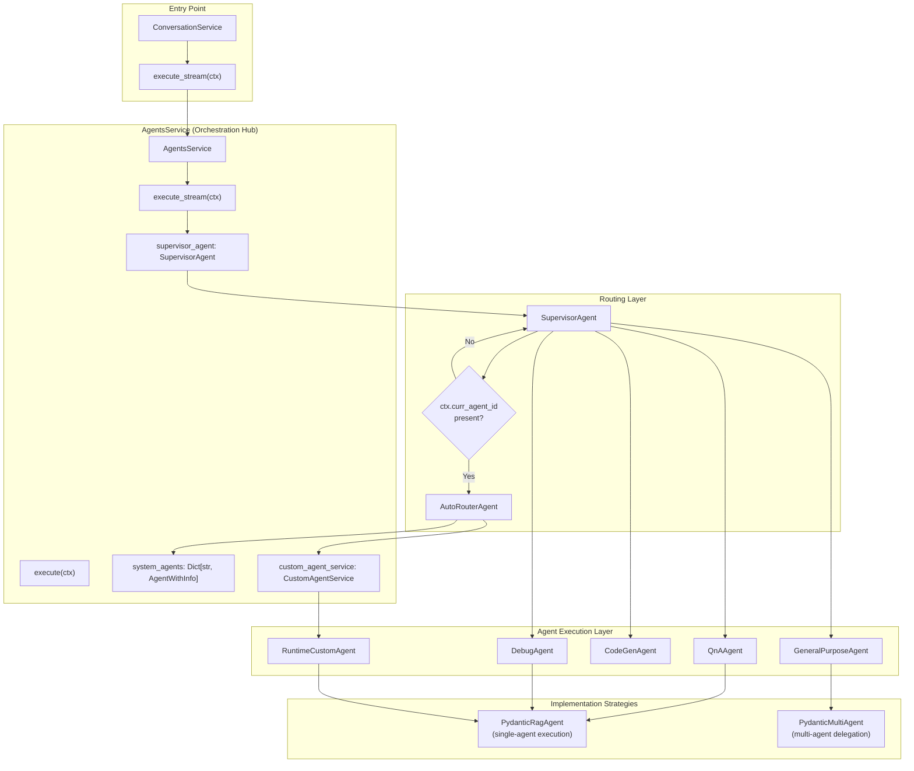
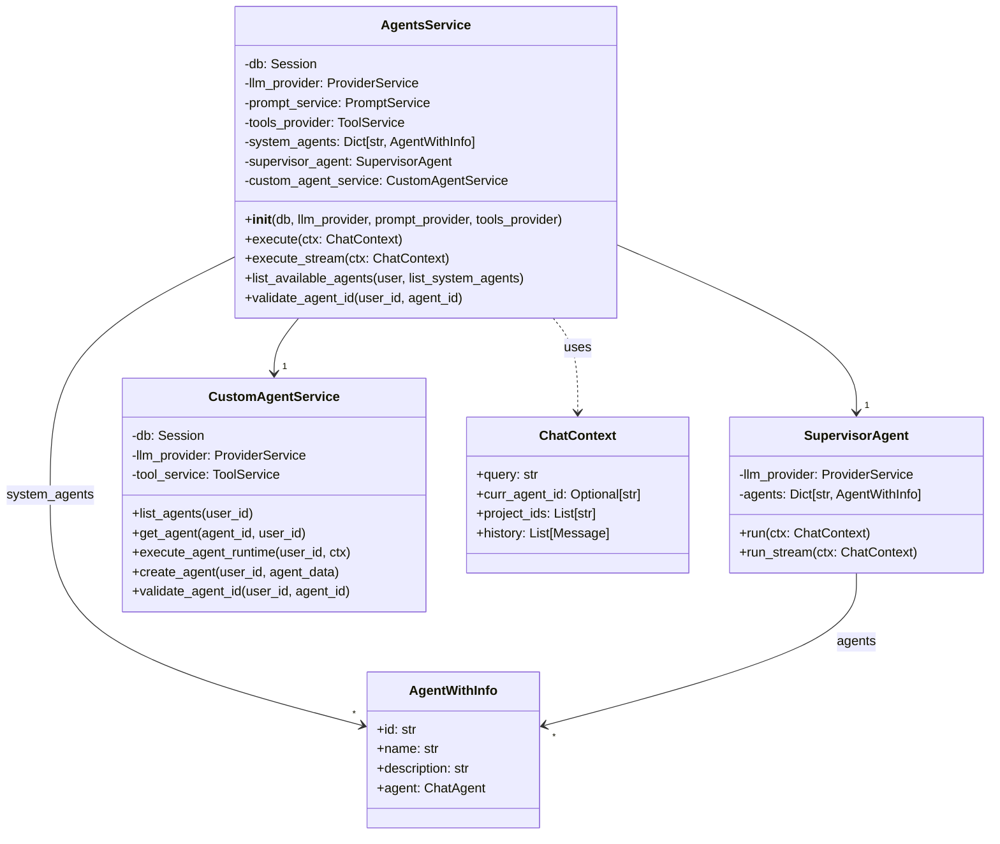
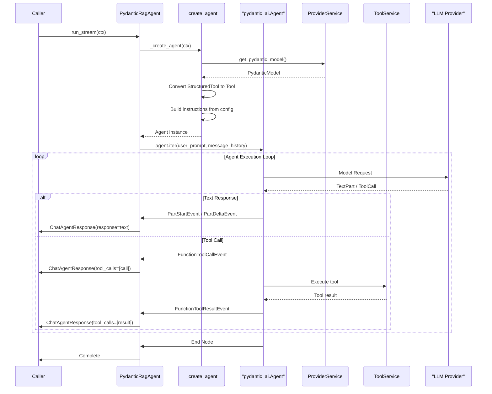
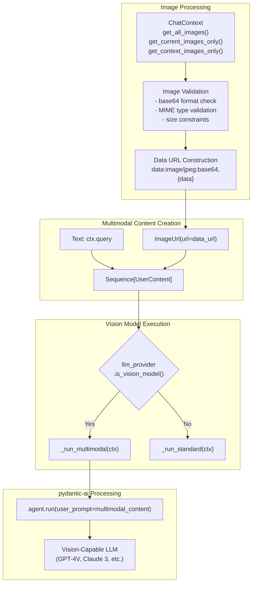
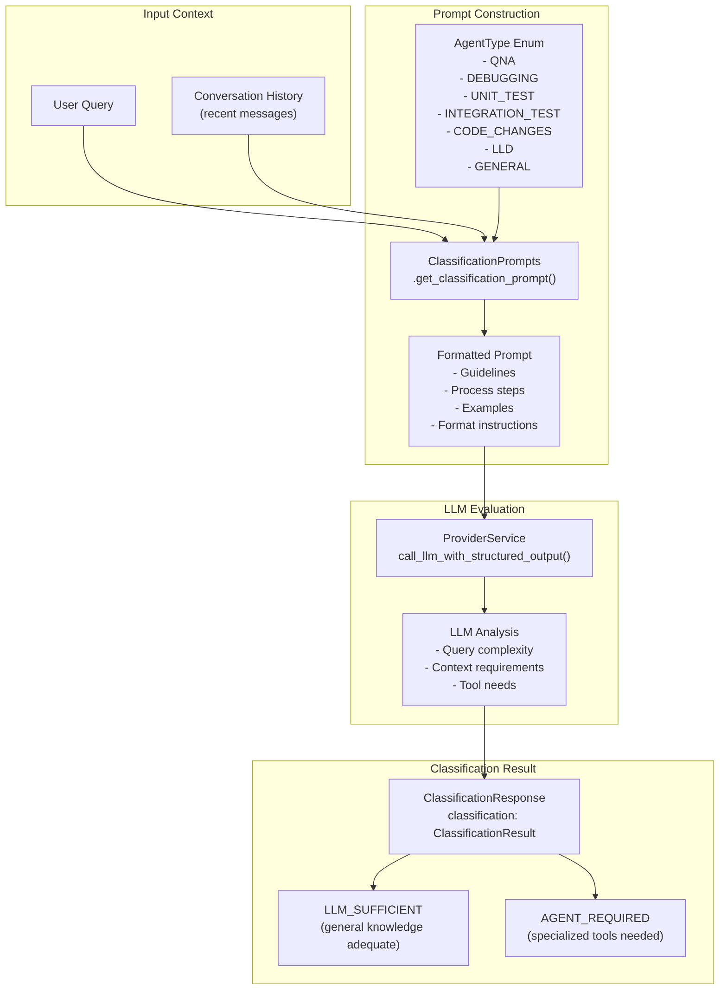
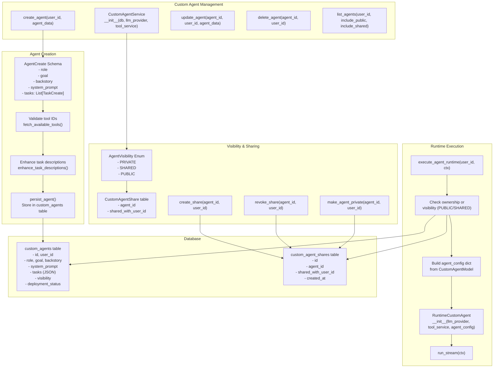
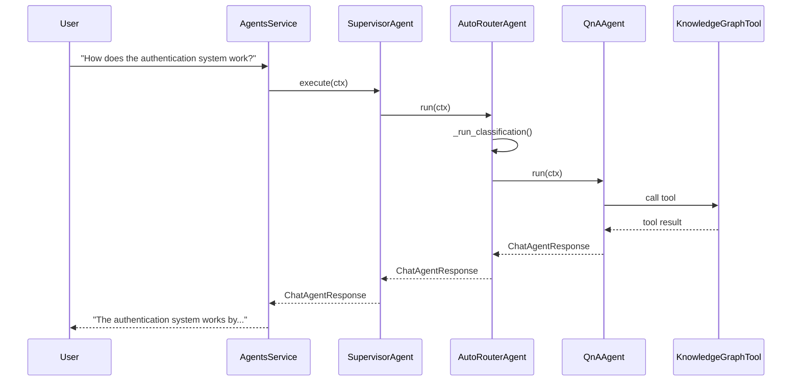

2.2-Agent System Architecture

# Page: Agent System Architecture

# Agent System Architecture

<details>
<summary>Relevant source files</summary>

The following files were used as context for generating this wiki page:

- [app/modules/intelligence/agents/agents_service.py](app/modules/intelligence/agents/agents_service.py)
- [app/modules/intelligence/agents/chat_agents/auto_router_agent.py](app/modules/intelligence/agents/chat_agents/auto_router_agent.py)
- [app/modules/intelligence/agents/chat_agents/pydantic_agent.py](app/modules/intelligence/agents/chat_agents/pydantic_agent.py)
- [app/modules/intelligence/agents/chat_agents/system_agents/general_purpose_agent.py](app/modules/intelligence/agents/chat_agents/system_agents/general_purpose_agent.py)
- [app/modules/intelligence/agents/chat_agents/tool_helpers.py](app/modules/intelligence/agents/chat_agents/tool_helpers.py)
- [app/modules/intelligence/tools/change_detection/change_detection_tool.py](app/modules/intelligence/tools/change_detection/change_detection_tool.py)
- [app/modules/intelligence/tools/code_query_tools/code_analysis.py](app/modules/intelligence/tools/code_query_tools/code_analysis.py)
- [app/modules/intelligence/tools/code_query_tools/get_file_content_by_path.py](app/modules/intelligence/tools/code_query_tools/get_file_content_by_path.py)
- [app/modules/intelligence/tools/tool_service.py](app/modules/intelligence/tools/tool_service.py)

</details>


The Agent System Architecture provides the orchestration layer that manages agent routing and execution in Potpie. The system uses `AgentsService` as the central hub, which maintains a registry of system agents and delegates queries through two routing strategies: intelligent routing via `SupervisorAgent` (when no agent is specified) and direct execution via `AutoRouterAgent` (when an `agent_id` is provided in the context).

For details about specific system agents (QnA, Debug, CodeGen, etc.), see [System Agents](#2.3). For custom user-defined agents, see [Custom Agents](#2.4). For the execution pipeline details, see [Agent Execution Pipeline](#2.5). For LLM provider integration, see [Provider Service](#2.1).

## Overview

The agent system consists of three layers: the orchestration layer (`AgentsService`), routing layer (`SupervisorAgent` and `AutoRouterAgent`), and execution layer (agent implementations like `PydanticRagAgent` and `PydanticMultiAgent`).

Agent Orchestration Flow


Sources:
- [app/modules/intelligence/agents/agents_service.py:47-67]()
- [app/modules/intelligence/agents/agents_service.py:151-157]()
- [app/modules/intelligence/agents/chat_agents/supervisor_agent.py:1-100]()
- [app/modules/intelligence/agents/chat_agents/auto_router_agent.py:13-37]()

The orchestration flow operates in three stages:

**1. Entry via AgentsService**: The `ConversationService` calls `AgentsService.execute_stream(ctx)`, which immediately delegates to `self.supervisor_agent.run_stream(ctx)`. The `AgentsService` acts as a registry holder and provides agent discovery methods, but routing logic is handled by `SupervisorAgent`.

**2. Routing Decision**: The `SupervisorAgent` checks if `ctx.curr_agent_id` is present. If yes, it uses `AutoRouterAgent` to directly execute the specified agent. If no, it performs classification to select the best agent for the query.

**3. Agent Execution**: Selected agents use implementation strategies:
- **PydanticRagAgent**: Single-agent execution with tool calls (used by QnA, Debug, Unit Test, etc.)
- **PydanticMultiAgent**: Multi-agent orchestration with delegation (used by GeneralPurposeAgent when configured)
- **RuntimeCustomAgent**: User-defined agents loaded from database, typically using PydanticRagAgent

## AgentsService: Central Orchestration Hub

The `AgentsService` class serves as the central orchestration hub for all agent operations in Potpie. It maintains the system agent registry, coordinates routing decisions, and integrates with custom agents.

AgentsService Class Structure


Sources:
- [app/modules/intelligence/agents/agents_service.py:47-67]()
- [app/modules/intelligence/agents/agents_service.py:68-149]()

### Initialization and Agent Registry

The `AgentsService.__init__()` method (lines 48-66) initializes the orchestration infrastructure:

```python
def __init__(
    self,
    db,
    llm_provider: ProviderService,
    prompt_provider: PromptService,
    tools_provider: ToolService,
):
    self.project_path = str(Path(os.getenv("PROJECT_PATH", "projects/")).absolute())
    self.db = db
    self.prompt_service = PromptService(db)
    self.system_agents = self._system_agents(
        llm_provider, prompt_provider, tools_provider
    )
    self.supervisor_agent = SupervisorAgent(llm_provider, self.system_agents)
    self.llm_provider = llm_provider
    self.tools_provider = tools_provider
    self.custom_agent_service = CustomAgentService(
        self.db, llm_provider, tools_provider
    )
```

**System Agent Registry** (lines 68-149): The `_system_agents()` method returns a dictionary mapping agent IDs to `AgentWithInfo` wrappers:

| Agent ID | Name | Agent Class | Description |
|----------|------|-------------|-------------|
| `codebase_qna_agent` | Codebase Q&A Agent | `QnAAgent` | Answers questions about codebase using knowledge graph |
| `debugging_agent` | Debugging with Knowledge Graph Agent | `DebugAgent` | Debugs issues using knowledge graph context |
| `unit_test_agent` | Unit Test Agent | `UnitTestAgent` | Generates unit tests for functions |
| `integration_test_agent` | Integration Test Agent | `IntegrationTestAgent` | Generates integration tests based on entry points |
| `LLD_agent` | Low-Level Design Agent | `LowLevelDesignAgent` | Generates low-level design plans for features |
| `code_changes_agent` | Code Changes Agent | `BlastRadiusAgent` | Analyzes blast radius of code changes |
| `code_generation_agent` | Code Generation Agent | `CodeGenAgent` | Generates code for new features or bug fixes |
| `general_purpose_agent` | General Purpose Agent | `GeneralPurposeAgent` | Handles queries not requiring code repository access |
| `sweb_debug_agent` | SWEB Debug Agent | `SWEBDebugAgent` | Specialized debugging for SWE-Bench tasks |

Each agent is wrapped in an `AgentWithInfo` object containing:
- `id`: Unique agent identifier (used for routing)
- `name`: Human-readable agent name (displayed in UI)
- `description`: Agent's capabilities and use cases
- `agent`: The actual agent implementation (e.g., `QnAAgent` instance)

Sources:
- [app/modules/intelligence/agents/agents_service.py:47-67]()
- [app/modules/intelligence/agents/agents_service.py:68-149]()

### Execution Methods

The `AgentsService` provides two execution methods that delegate to the `SupervisorAgent`:

**Synchronous Execution** (lines 151-152):
```python
async def execute(self, ctx: ChatContext):
    return await self.supervisor_agent.run(ctx)
```

**Streaming Execution** (lines 154-156):
```python
async def execute_stream(self, ctx: ChatContext):
    async for chunk in self.supervisor_agent.run_stream(ctx):
        yield chunk
```

Both methods pass the `ChatContext` directly to the `SupervisorAgent`, which handles agent selection and execution.

Sources:
- [app/modules/intelligence/agents/agents_service.py:151-157]()

### Agent Discovery and Validation

**Listing Available Agents** (lines 158-194): The `list_available_agents()` method returns both system and custom agents:

```python
async def list_available_agents(
    self, current_user: dict, list_system_agents: bool
) -> List[AgentInfo]:
    system_agents = [
        AgentInfo(
            id=id,
            name=self.system_agents[id].name,
            description=self.system_agents[id].description,
            status="SYSTEM",
        )
        for (id) in self.system_agents
    ]
    
    custom_agents = await CustomAgentService(
        self.db, self.llm_provider, self.tools_provider
    ).list_agents(current_user["user_id"])
    
    agent_info_list = [
        AgentInfo(
            id=agent.id,
            name=agent.role,
            description=agent.goal,
            status=agent.deployment_status or "STOPPED",
            visibility=agent.visibility,
        )
        for agent in custom_agents
    ]
    
    if list_system_agents:
        return system_agents + agent_info_list
    else:
        return agent_info_list
```

**Agent Validation** (lines 196-202): The `validate_agent_id()` method checks if an agent ID is valid:

```python
async def validate_agent_id(self, user_id: str, agent_id: str) -> str | None:
    """Validate if an agent ID is valid"""
    if agent_id in self.system_agents:
        return "SYSTEM_AGENT"
    if await self.custom_agent_service.get_custom_agent(self.db, user_id, agent_id):
        return "CUSTOM_AGENT"
    return None
```

This validation is used by the conversation service to ensure agent IDs in requests are valid before execution.

Sources:
- [app/modules/intelligence/agents/agents_service.py:158-194]()
- [app/modules/intelligence/agents/agents_service.py:196-202]()

## PydanticRagAgent: Single-Agent Execution

The `PydanticRagAgent` class implements direct agent execution using the `pydantic-ai` library. It handles single-agent tasks with tool integration, streaming responses, and multimodal content processing.

PydanticRagAgent Execution Flow


Sources:
- [app/modules/intelligence/agents/chat_agents/pydantic_agent.py:536-558]()
- [app/modules/intelligence/agents/chat_agents/pydantic_agent.py:661-814]()
- [app/modules/intelligence/agents/chat_agents/pydantic_agent.py:84-165]()

### Agent Creation Process

The `_create_agent()` method constructs the Pydantic AI agent with full configuration:

**1. MCP Server Integration** (lines 89-110):
```python
mcp_toolsets: List[MCPServerStreamableHTTP] = []
for mcp_server in self.mcp_servers:
    try:
        mcp_server_instance = MCPServerStreamableHTTP(
            url=mcp_server["link"],
            timeout=10.0,
        )
        mcp_toolsets.append(mcp_server_instance)
    except Exception as e:
        logger.warning(f"Failed to create MCP server: {e}")
```

**2. Tool Preparation** (lines 118-125):
```python
tools=[
    Tool(
        name=tool.name,
        description=tool.description,
        function=handle_exception(tool.func),
    )
    for tool in self.tools
]
```

**3. Instructions Construction** (lines 127-137):
The agent instructions combine:
- Role: Agent's identity and expertise
- Goal: Primary objective
- Backstory: Additional context
- Multimodal instructions (if images present)
- Task description with project context

**4. Model Settings** (lines 139-143):
```python
{
    "output_retries": 3,
    "output_type": str,
    "model_settings": {"max_tokens": 14000},
    "end_strategy": "exhaustive",
}
```

**5. Parallel Tool Execution Control** (lines 146-164):
The agent checks LLM capabilities and disables parallel tool execution if not supported by dynamically inspecting the `Agent.__init__` signature.

Sources:
- [app/modules/intelligence/agents/chat_agents/pydantic_agent.py:84-165]()

### Streaming Execution

The `run_stream()` method provides real-time response streaming through async generators:

**Standard Text Streaming** (lines 684-702):
```python
if Agent.is_model_request_node(node):
    async with node.stream(run.ctx) as request_stream:
        async for event in request_stream:
            if isinstance(event, PartStartEvent) and isinstance(event.part, TextPart):
                yield ChatAgentResponse(response=event.part.content)
            if isinstance(event, PartDeltaEvent) and isinstance(event.delta, TextPartDelta):
                yield ChatAgentResponse(response=event.delta.content_delta)
```

**Tool Execution Streaming** (lines 733-786):
```python
elif Agent.is_call_tools_node(node):
    async with node.stream(run.ctx) as handle_stream:
        async for event in handle_stream:
            if isinstance(event, FunctionToolCallEvent):
                yield ChatAgentResponse(
                    tool_calls=[ToolCallResponse(
                        call_id=event.part.tool_call_id,
                        event_type=ToolCallEventType.CALL,
                        tool_name=event.part.tool_name,
                        tool_response=get_tool_run_message(event.part.tool_name),
                    )]
                )
            if isinstance(event, FunctionToolResultEvent):
                yield ChatAgentResponse(
                    tool_calls=[ToolCallResponse(
                        call_id=event.result.tool_call_id,
                        event_type=ToolCallEventType.RESULT,
                        tool_name=event.result.tool_name,
                        tool_response=get_tool_response_message(event.result.tool_name),
                    )]
                )
```

The streaming system provides transparency by emitting events for:
- Text chunks as they're generated
- Tool calls when initiated
- Tool results when completed

Sources:
- [app/modules/intelligence/agents/chat_agents/pydantic_agent.py:661-814]()

## Multimodal Support

The `PydanticRagAgent` supports multimodal interactions by processing images alongside text queries. The system validates image formats, constructs multimodal content, and provides specialized instructions for vision-capable models.

Multimodal Processing Pipeline


Sources:
- [app/modules/intelligence/agents/chat_agents/pydantic_agent.py:444-462]()
- [app/modules/intelligence/agents/chat_agents/pydantic_agent.py:288-429]()
- [app/modules/intelligence/agents/chat_agents/pydantic_agent.py:167-195]()

### Image Context Management

The `ChatContext` provides three methods for image access:

| Method | Purpose | Use Case |
|--------|---------|----------|
| `get_all_images()` | Returns all images (current + historical) | Full conversation context |
| `get_current_images_only()` | Returns images from current message | Primary analysis target |
| `get_context_images_only()` | Returns images from previous messages | Historical reference |

### Multimodal Content Construction

The `_create_multimodal_user_content()` method (lines 288-429) builds multimodal content:

**1. Image Validation** (lines 301-330):
```python
if not isinstance(image_data, dict):
    logger.error(f"Invalid image data structure: {type(image_data)}")
    continue

if "base64" not in image_data:
    logger.error(f"Missing base64 data")
    continue

# Validate base64 format
import base64
base64.b64decode(base64_data)
```

**2. MIME Type Handling** (lines 333-343):
```python
mime_type = image_data.get("mime_type", "image/jpeg")
if not mime_type or not mime_type.startswith("image/"):
    mime_type = "image/jpeg"

data_url = f"data:{mime_type};base64,{base64_data}"
```

**3. Content Assembly** (lines 292-354):
```python
content: List[UserContent] = [ctx.query]

for attachment_id, image_data in current_images.items():
    # ... validation ...
    content.append(ImageUrl(url=data_url))
```

### Multimodal Instructions

The `_prepare_multimodal_instructions()` method (lines 167-195) provides vision-specific guidance:

```python
"""
MULTIMODAL ANALYSIS INSTRUCTIONS:
You have access to {len(all_images)} image(s) - {len(current_images)} from the current message 
and {len(context_images)} from conversation history.

CRITICAL GUIDELINES FOR ACCURATE ANALYSIS:
1. **ONLY analyze what you can clearly see** - Do not infer or guess about unclear details
2. **Distinguish between current and historical images** - Focus primarily on current message images
3. **State uncertainty** - If you cannot clearly see something, say "I cannot clearly see..."
4. **Be specific** - Reference exact text, colors, shapes, or elements you observe
5. **Avoid assumptions** - Do not assume context beyond what's explicitly visible
"""
```

The system automatically falls back to text-only execution if:
- Images are provided but the model doesn't support vision
- Image validation fails
- Multimodal execution encounters errors

Sources:
- [app/modules/intelligence/agents/chat_agents/pydantic_agent.py:504-534]()
- [app/modules/intelligence/agents/chat_agents/pydantic_agent.py:559-660]()

## Classification System

The classification system provides intelligent agent selection through agent-specific prompts that guide LLM reasoning. Each agent type has a specialized prompt that evaluates whether the agent is needed based on query characteristics and conversation history.

Classification Prompt Structure


Sources:
- [app/modules/intelligence/prompts/classification_prompts.py:26-538]()

### Classification Prompt Types

The `ClassificationPrompts` class (lines 26-538) defines specialized prompts for each agent type:

**QnA Agent Classification** (lines 27-73):
- **LLM_SUFFICIENT**: General programming concepts, widely known information, or content in chat history
- **AGENT_REQUIRED**: Specific functions/files not in history, current code implementation, recent changes, debugging without full context
- **Example Query (LLM_SUFFICIENT)**: "What is a decorator in Python?"
- **Example Query (AGENT_REQUIRED)**: "Why is the login function in auth.py returning a 404 error?"

**Debugging Agent Classification** (lines 74-140):
- Uses three "expert personas": Error Analyst, Code Detective, Context Evaluator
- **LLM_SUFFICIENT**: General debugging concepts, common errors, directly relevant history
- **AGENT_REQUIRED**: Specific project files/functions, actual code analysis, unique project errors, complex codebase interactions
- **Example Query (LLM_SUFFICIENT)**: "What are common causes of NullPointerException in Java?"
- **Example Query (AGENT_REQUIRED)**: "Why is the getUserData() method throwing a NullPointerException in line 42 of UserService.java?"

**Unit Test Agent Classification** (lines 141-252):
- Uses four personas: Test Architect, Code Analyzer, Debugging Guru, Framework Specialist
- **LLM_SUFFICIENT**: Improving existing tests in history, editing provided code, regenerating tests from existing plans
- **AGENT_REQUIRED**: Generating tests for code not in history, creating new test plans
- **Example Query (LLM_SUFFICIENT)**: "Can you help me improve the unit tests we discussed earlier?" (with tests in history)
- **Example Query (AGENT_REQUIRED)**: "Please generate unit tests for the new PaymentProcessor class."

**Integration Test Agent Classification** (lines 254-363):
- **LLM_SUFFICIENT**: Fixing errors in existing tests, explaining best practices, modifying provided test code
- **AGENT_REQUIRED**: New test plans for undiscussed components, fetching current code state, generating tests for new modules
- **Special Rule**: Always classify as `AGENT_REQUIRED` when user mentions hallucinated context or requests to fetch actual code
- **Example Query (LLM_SUFFICIENT)**: "Can you help me fix the error in the integration test you wrote earlier for the UserService?"
- **Example Query (AGENT_REQUIRED)**: "I need integration tests for the new OrderService module."

**Code Changes Agent Classification** (lines 365-431):
- Uses three personas: Version Control Expert, Code Reviewer, Project Architect
- **LLM_SUFFICIENT**: General version control concepts, best practices
- **AGENT_REQUIRED**: Specific commits/branches/modifications, actual code change analysis, impact on functionality
- **Example Query (LLM_SUFFICIENT)**: "What are the best practices for writing commit messages?"
- **Example Query (AGENT_REQUIRED)**: "Why is the code change in commit 1234567890 causing the login function in auth.py to return a 404 error?"

**LLD Agent Classification** (lines 432-488):
- **LLM_SUFFICIENT**: General design patterns, theoretical approaches, new designs without dependencies, all context in conversation
- **AGENT_REQUIRED**: References to specific files/classes/functions, existing codebase structure, modifying/extending existing designs, compatibility analysis
- **Example Query (LLM_SUFFICIENT)**: "What pattern should we use for cache invalidation?" (in context of new system design)
- **Example Query (AGENT_REQUIRED)**: "How should we add password reset?" (in context of existing UserService)

**General Purpose Agent Classification** (lines 489-527):
- **LLM_SUFFICIENT**: Queries answerable with just query and history
- **AGENT_REQUIRED**: Requires internet access and deep thinking
- **Example Query (LLM_SUFFICIENT)**: "Can you refactor above code to accommodate dependency injection?" (with code in history)
- **Example Query (AGENT_REQUIRED)**: "How can I implement retry mechanism in pydanticai agents?" (requires fetching documentation)

Sources:
- [app/modules/intelligence/prompts/classification_prompts.py:26-538]()

### Classification Workflow

**Prompt Retrieval** (lines 532-537):
```python
@classmethod
def get_classification_prompt(cls, agent_type: AgentType) -> str:
    return (
        cls.CLASSIFICATION_PROMPTS.get(agent_type, "")
        + cls.REDUNDANT_INHIBITION_TAIL
    )
```

The `REDUNDANT_INHIBITION_TAIL` (line 530) ensures clean JSON output:
```python
"\n\nReturn ONLY JSON content, and nothing else. Don't provide reason or any other text in the response."
```

**Integration with ProviderService**:
The classification prompt is passed to `ProviderService.call_llm_with_structured_output()` with the `ClassificationResponse` schema, ensuring the LLM returns structured JSON with the `classification` field containing either `LLM_SUFFICIENT` or `AGENT_REQUIRED`.

Sources:
- [app/modules/intelligence/prompts/classification_prompts.py:530-538]()
- [app/modules/intelligence/prompts/classification_prompts.py:17-24]()

## Custom Agent Integration

Custom agents allow users to define specialized agents with custom roles, goals, tasks, and tool configurations. The `CustomAgentService` manages custom agent lifecycle, visibility, sharing, and runtime execution.

Custom Agent Architecture


Sources:
- [app/modules/intelligence/agents/custom_agents/custom_agents_service.py:37-44]()
- [app/modules/intelligence/agents/custom_agents/custom_agents_service.py:367-413]()
- [app/modules/intelligence/agents/custom_agents/custom_agents_service.py:598-694]()

### Custom Agent Creation

**Agent Creation Flow** (lines 367-413):

```python
async def create_agent(self, user_id: str, agent_data: AgentCreate) -> Agent:
    """Create a new custom agent with enhanced task descriptions"""
    try:
        # Extract tool IDs from tasks
        tool_ids = []
        for task in agent_data.tasks:
            tool_ids.extend(task.tools)

        # Validate tools
        available_tools = await self.fetch_available_tools(user_id)
        invalid_tools = [
            tool_id for tool_id in tool_ids if tool_id not in available_tools
        ]
        if invalid_tools:
            raise HTTPException(
                status_code=400,
                detail=f"The following tool IDs are invalid: {', '.join(invalid_tools)}",
            )

        # Enhance task descriptions
        tasks_dict = [task.dict() for task in agent_data.tasks]
        enhanced_tasks = await self.enhance_task_descriptions(
            tasks_dict, agent_data.goal, available_tools, user_id
        )

        return self.persist_agent(user_id, agent_data, enhanced_tasks)
    except HTTPException:
        raise
    except SQLAlchemyError as err:
        self.db.rollback()
        logger.exception("Database error while creating agent", user_id=user_id)
        raise HTTPException(status_code=500, detail="Failed to create agent") from err
```

**Task Enhancement** (lines 799-822): The system enhances task descriptions using LLM to provide more detailed instructions:

```python
async def enhance_task_descriptions(
    self,
    tasks: List[Dict[str, Any]],
    goal: str,
    available_tools: List[str],
    user_id: str,
) -> List[Dict[str, Any]]:
    enhanced_tasks = []

    for task in tasks:
        task_tools = [
            tool_id
            for tool_id in task.get("tools", [])
            if tool_id in available_tools
        ]

        enhanced_description = await self.enhance_task_description(
            user_id, task["description"], goal, task_tools
        )
        enhanced_task = task.copy()
        enhanced_task["description"] = enhanced_description
        enhanced_tasks.append(enhanced_task)

    return enhanced_tasks
```

**Creation from Natural Language Prompt** (lines 721-797): Users can create agents from natural language using `create_agent_from_prompt()`:

1. Fetch available tools via `ToolService.list_tools()`
2. Call `create_agent_plan()` with prompt and tool IDs
3. LLM generates structured agent configuration (role, goal, backstory, system_prompt, tasks)
4. Parse and validate JSON response
5. Persist agent with `persist_agent()`

Sources:
- [app/modules/intelligence/agents/custom_agents/custom_agents_service.py:367-413]()
- [app/modules/intelligence/agents/custom_agents/custom_agents_service.py:721-797]()
- [app/modules/intelligence/agents/custom_agents/custom_agents_service.py:799-822]()

### Visibility and Sharing System

Custom agents support three visibility levels:

| Visibility | Description | Access Control |
|------------|-------------|----------------|
| `PRIVATE` | Only visible to owner | Owner only |
| `SHARED` | Shared with specific users | Owner + users in `custom_agent_shares` |
| `PUBLIC` | Visible to all users | All authenticated users |

**Creating Shares** (lines 94-145):
```python
async def create_share(
    self, agent_id: str, shared_with_user_id: str
) -> CustomAgentShareModel:
    """Create a share for an agent with another user"""
    # Check if share already exists
    existing_share = (
        self.db.query(CustomAgentShareModel)
        .filter(
            CustomAgentShareModel.agent_id == agent_id,
            CustomAgentShareModel.shared_with_user_id == shared_with_user_id,
        )
        .first()
    )
    if existing_share:
        return existing_share

    # Create new share
    share = CustomAgentShareModel(
        id=str(uuid4()),
        agent_id=agent_id,
        shared_with_user_id=shared_with_user_id,
    )
    self.db.add(share)
    self.db.commit()
    return share
```

**Revoking Shares** (lines 147-201): When the last share is revoked, the agent automatically reverts to `PRIVATE`:

```python
async def revoke_share(self, agent_id: str, shared_with_user_id: str) -> bool:
    """Revoke access to an agent for a specific user"""
    # ... find and delete share ...
    
    # Check if there are any remaining shares
    remaining_shares = (
        self.db.query(CustomAgentShareModel)
        .filter(CustomAgentShareModel.agent_id == agent_id)
        .count()
    )

    # If no more shares and visibility is SHARED, update to PRIVATE
    if remaining_shares == 0 and agent.visibility == AgentVisibility.SHARED:
        agent.visibility = AgentVisibility.PRIVATE.value
        self.db.commit()

    return True
```

**Listing Accessible Agents** (lines 266-296): The `list_agents()` method returns agents based on visibility:

```python
async def list_agents(
    self, user_id: str, include_public: bool = False, include_shared: bool = True
) -> List[Agent]:
    """List all agents accessible to the user"""
    query = self.db.query(CustomAgentModel)

    # Base query for user's own agents
    filters = [CustomAgentModel.user_id == user_id]

    # Add public agents
    if include_public:
        filters.append(CustomAgentModel.visibility == AgentVisibility.PUBLIC)

    # Add shared agents
    if include_shared:
        shared_subquery = (
            select(CustomAgentShareModel.agent_id)
            .where(CustomAgentShareModel.shared_with_user_id == user_id)
            .scalar_subquery()
        )
        filters.append(CustomAgentModel.id.in_(shared_subquery))

    # Combine all filters with OR
    query = query.filter(or_(*filters))

    agents = query.all()
    return [self._convert_to_agent_schema(agent) for agent in agents]
```

Sources:
- [app/modules/intelligence/agents/custom_agents/custom_agents_service.py:94-145]()
- [app/modules/intelligence/agents/custom_agents/custom_agents_service.py:147-201]()
- [app/modules/intelligence/agents/custom_agents/custom_agents_service.py:266-296]()

### Runtime Execution

**Permission Checking and Execution** (lines 598-694): The `execute_agent_runtime()` method enforces visibility rules:

```python
async def execute_agent_runtime(
    self,
    user_id: str,
    ctx: ChatContext,
) -> AsyncGenerator[ChatAgentResponse, None]:
    """Execute an agent at runtime without deployment"""
    
    # First check if user is the owner
    agent_model = (
        self.db.query(CustomAgentModel)
        .filter(
            CustomAgentModel.id == ctx.curr_agent_id,
            CustomAgentModel.user_id == user_id,
        )
        .first()
    )

    # If not owner, check if agent is public or shared with user
    if not agent_model:
        agent_model = (
            self.db.query(CustomAgentModel)
            .filter(CustomAgentModel.id == ctx.curr_agent_id)
            .first()
        )
        if agent_model:
            # Check if agent is public
            if agent_model.visibility == AgentVisibility.PUBLIC:
                pass  # Access granted
            # Check if agent is shared with this user
            elif agent_model.visibility == AgentVisibility.SHARED:
                share = (
                    self.db.query(CustomAgentShareModel)
                    .filter(
                        CustomAgentShareModel.agent_id == ctx.curr_agent_id,
                        CustomAgentShareModel.shared_with_user_id == user_id,
                    )
                    .first()
                )
                if not share:
                    raise HTTPException(status_code=404, detail="Agent not found")
            else:
                raise HTTPException(status_code=404, detail="Agent not found")
        else:
            raise HTTPException(status_code=404, detail="Agent not found")

    # Build agent config
    agent_config = {
        "user_id": agent_model.user_id,
        "role": agent_model.role,
        "goal": agent_model.goal,
        "backstory": agent_model.backstory,
        "system_prompt": agent_model.system_prompt,
        "tasks": agent_model.tasks,
    }
    runtime_agent = RuntimeCustomAgent(
        self.llm_provider, self.tool_service, agent_config
    )
    return runtime_agent.run_stream(ctx)
```

The execution flow:
1. Check if user is the agent owner
2. If not owner, verify the agent is `PUBLIC` or user has a share record
3. Build `agent_config` dictionary from `CustomAgentModel` fields
4. Instantiate `RuntimeCustomAgent` with config
5. Execute via `run_stream(ctx)` for streaming response

Sources:
- [app/modules/intelligence/agents/custom_agents/custom_agents_service.py:598-694]()

## Error Handling and Recovery

The agent system implements comprehensive error handling at multiple levels to ensure robust execution and graceful degradation.

Error Handling Architecture

```mermaid
graph TB
    subgraph "Tool-Level Error Handling"
        ToolCall["Tool Function Call"]
        HandleException["handle_exception decorator"]
        ToolException["Exception Caught"]
        ErrorLog["logger.exception()"]
        ErrorMessage["Return: 'An internal error occurred'"]
    end
    
    subgraph "Streaming Error Handling"
        StreamNode["Stream Event Processing"]
        PydanticError["ModelRetry / AgentRunError / UserError"]
        AnyioError["anyio.WouldBlock"]
        GeneralError["General Exception"]
        RecoveryMessage["Yield recovery message"]
        Continue["Continue execution"]
    end
    
    subgraph "MCP Server Error Handling"
        MCPInit["MCP Server Initialization"]
        MCPTimeout["Timeout / Connection Error"]
        MCPWarning["Log warning"]
        SkipServer["Skip failed server"]
        ContinueWithout["Continue with available servers"]
    end
    
    subgraph "Multimodal Error Handling"
        MultimodalRun["Multimodal Execution"]
        ImageError["Image Processing Error"]
        FallbackStandard["Fallback to _run_standard()"]
    end
    
    ToolCall --> HandleException
    HandleException --> ToolException
    ToolException --> ErrorLog
    ErrorLog --> ErrorMessage
    
    StreamNode --> PydanticError
    StreamNode --> AnyioError
    StreamNode --> GeneralError
    PydanticError --> RecoveryMessage
    AnyioError --> Continue
    GeneralError --> RecoveryMessage
    RecoveryMessage --> Continue
    
    MCPInit --> MCPTimeout
    MCPTimeout --> MCPWarning
    MCPWarning --> SkipServer
    SkipServer --> ContinueWithout
    
    MultimodalRun --> ImageError
    ImageError --> FallbackStandard
```


Sources:
- [app/modules/intelligence/agents/chat_agents/pydantic_agent.py:49-60]()
- [app/modules/intelligence/agents/chat_agents/pydantic_agent.py:703-731]()
- [app/modules/intelligence/agents/chat_agents/pydantic_agent.py:89-110]()
- [app/modules/intelligence/agents/chat_agents/pydantic_agent.py:655-660]()

### Tool Exception Handling

The `handle_exception` decorator (lines 49-60) wraps all tool functions:

```python
def handle_exception(tool_func):
    @functools.wraps(tool_func)
    def wrapper(*args, **kwargs):
        try:
            return tool_func(*args, **kwargs)
        except Exception:
            logger.exception("Exception in tool function", tool_name=tool_func.__name__)
            return "An internal error occurred. Please try again later."
    return wrapper
```

This ensures:
- All tool exceptions are logged with full stack traces
- Generic error message returned to prevent execution halt
- Agent can continue with other tools or reasoning

### Streaming Error Recovery

The streaming execution (lines 703-731, 786-814) handles multiple error types:

**Pydantic AI Errors** (lines 703-716):
```python
except (ModelRetry, AgentRunError, UserError) as pydantic_error:
    logger.warning(f"Pydantic-ai error in model request stream: {pydantic_error}")
    yield ChatAgentResponse(
        response="\n\n*Encountered an issue while processing your request. Trying to recover...*\n\n",
    )
    continue
```

**Async I/O Errors** (lines 717-721):
```python
except anyio.WouldBlock:
    logger.warning("Model request stream would block - continuing...")
    continue
```

**General Errors** (lines 722-731):
```python
except Exception:
    logger.exception("Unexpected error in model request stream")
    yield ChatAgentResponse(
        response="\n\n*An unexpected error occurred. Continuing...*\n\n",
    )
    continue
```

### MCP Server Resilience

MCP server initialization (lines 89-110) uses try-except to handle failures:

```python
for mcp_server in self.mcp_servers:
    try:
        mcp_server_instance = MCPServerStreamableHTTP(
            url=mcp_server["link"],
            timeout=10.0,
        )
        mcp_toolsets.append(mcp_server_instance)
        logger.info(f"Successfully created MCP server: {mcp_server.get('name')}")
    except Exception as e:
        logger.warning(f"Failed to create MCP server {mcp_server.get('name')}: {e}")
        continue
```

Fallback behavior for MCP failures (lines 474-488, 669-688):
```python
try:
    async with agent.run_mcp_servers():
        # Execute with MCP servers
        resp = await agent.run(...)
except (TimeoutError, anyio.WouldBlock, Exception) as mcp_error:
    logger.warning(f"MCP server initialization failed: {mcp_error}")
    logger.info("Continuing without MCP servers...")
    # Execute without MCP servers
    resp = await agent.run(...)
```

### Multimodal Fallback

Multimodal execution (lines 655-660) falls back to standard execution on error:

```python
except Exception:
    logger.exception("Error in multimodal stream")
    # Fallback to standard streaming
    async for chunk in self._run_standard_stream(ctx):
        yield chunk
```

This ensures:
- Image processing errors don't halt execution
- Users receive text-only responses as fallback
- Execution continues despite vision model issues

Sources:
- [app/modules/intelligence/agents/chat_agents/pydantic_agent.py:49-60]()
- [app/modules/intelligence/agents/chat_agents/pydantic_agent.py:703-814]()
- [app/modules/intelligence/agents/chat_agents/pydantic_agent.py:89-110]()
- [app/modules/intelligence/agents/chat_agents/pydantic_agent.py:474-488]()
- [app/modules/intelligence/agents/chat_agents/pydantic_agent.py:655-660]()

## Workflow Example

Here's a typical workflow for a user query:



Sources:
- [app/modules/intelligence/agents/agents_service.py:133-138]()
- [app/modules/intelligence/agents/chat_agents/auto_router_agent.py:74-83]()

This workflow demonstrates how a user query flows through the system:
1. User submits a query to the `AgentsService`
2. The service passes it to the `SupervisorAgent`
3. The supervisor delegates to the `AutoRouterAgent`
4. The router classifies the query and selects an appropriate agent (e.g., `QnAAgent`)
5. The selected agent executes the query, potentially using tools
6. The response flows back through the chain to the user

## Conclusion

The Agent Router and Orchestration system enables Potpie to efficiently handle diverse user queries by intelligently routing them to specialized agents. By leveraging classification prompts and confidence scoring, the system can determine the most appropriate agent for each query, ensuring users receive the most helpful and relevant responses.