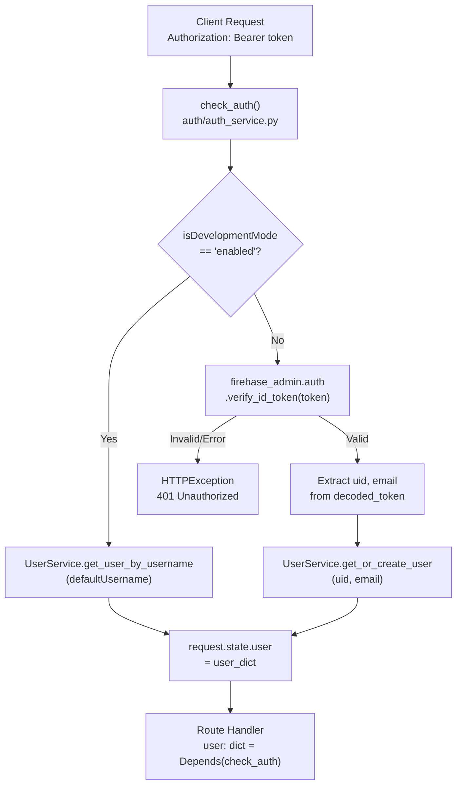
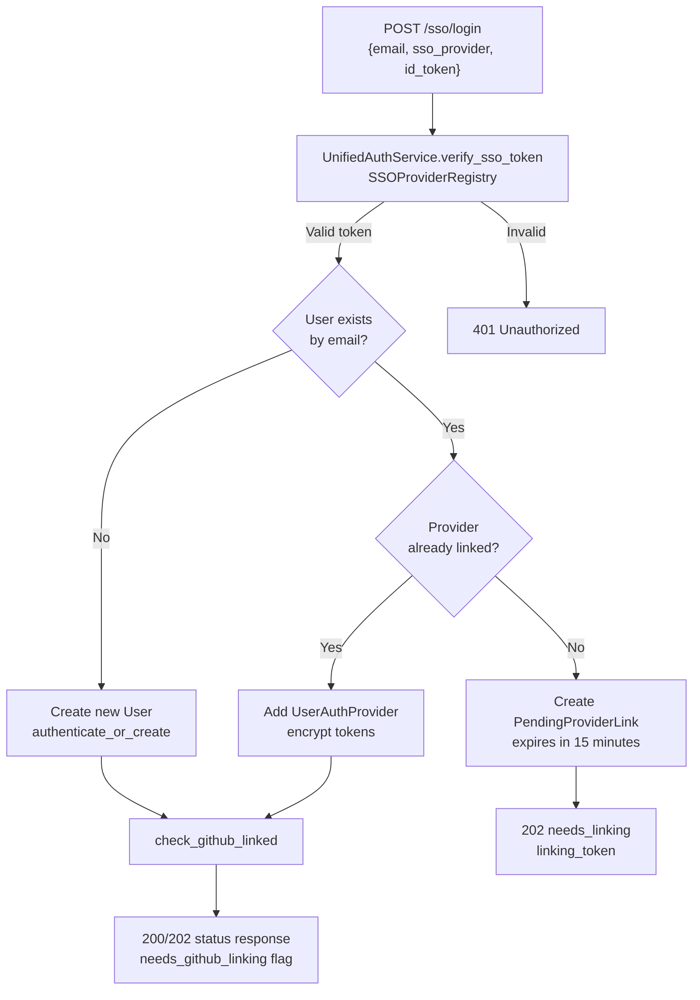
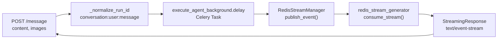
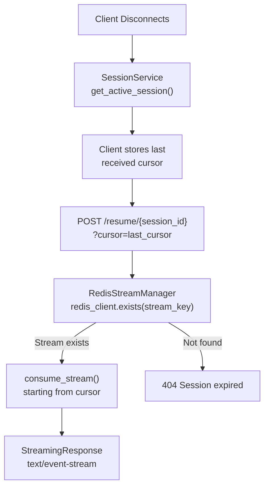
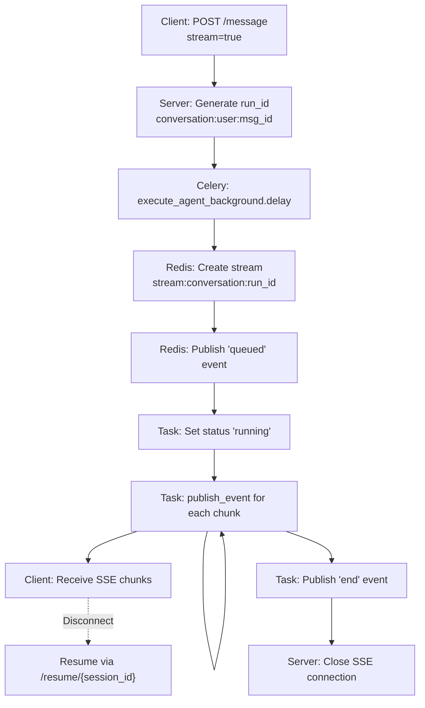
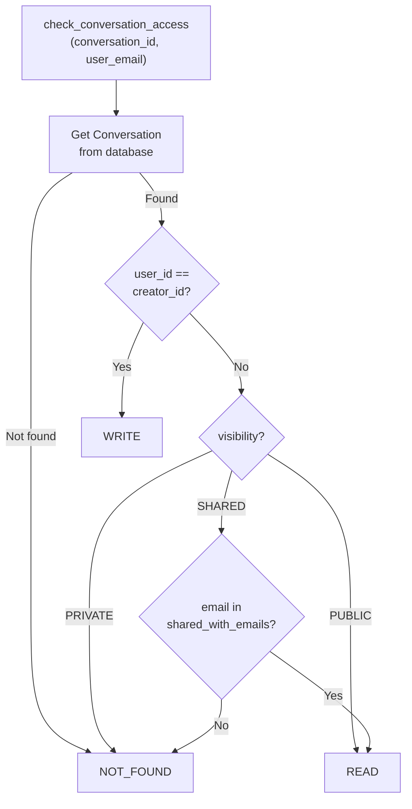
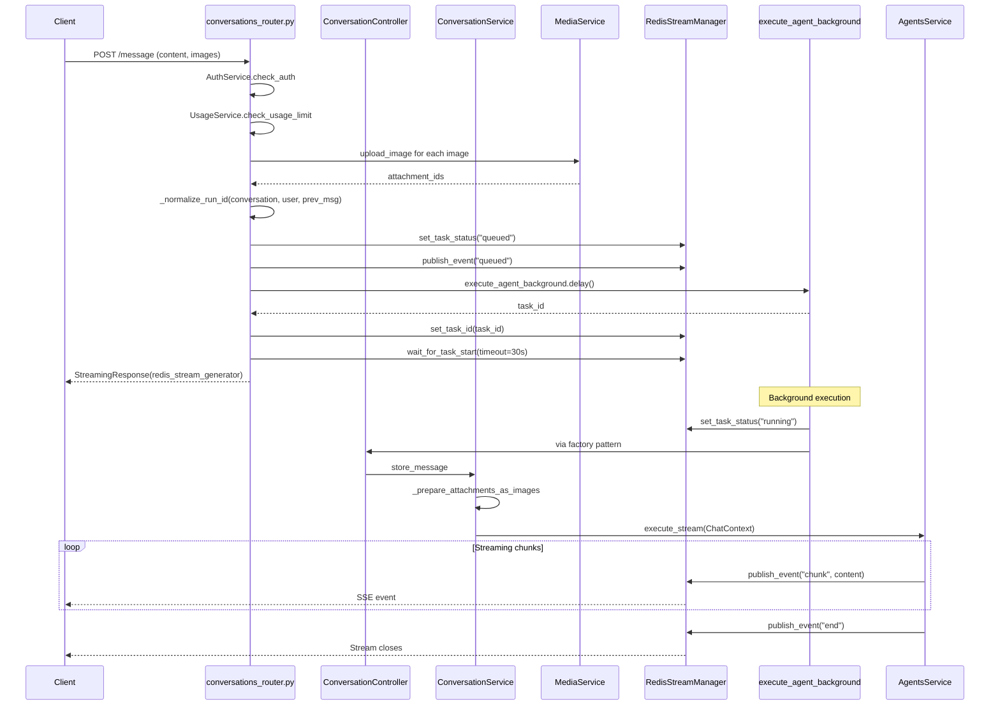

1.3-API Reference

# Page: API Reference

# API Reference

<details>
<summary>Relevant source files</summary>

The following files were used as context for generating this wiki page:

- [.env.template](.env.template)
- [app/main.py](app/main.py)
- [requirements.txt](requirements.txt)

</details>


This document provides a comprehensive reference for all REST API endpoints exposed by the Potpie backend. The API is organized into 16 modular routers, each handling a specific domain. All endpoints return JSON responses and use Bearer token authentication via Firebase ID tokens (except in development mode).

For information about the high-level system architecture, see [Architecture Overview](#1.2). For configuration details including environment variables and API keys, see [System Configuration](#1.4).

## API Router Overview

The Potpie API consists of 16 routers mounted on a FastAPI application, organized by functional domain:

| Router | Prefix | Purpose | Key Endpoints |
|--------|--------|---------|---------------|
| `auth_router` | `/api/v1` | Multi-provider authentication, SSO, provider linking | `/login`, `/signup`, `/sso/login`, `/providers/*` |
| `user_router` | `/api/v1` | User profile management, onboarding | `/user/{id}/public-profile`, `/user/onboarding` |
| `conversations_router` | `/api/v1` | Chat conversations, message streaming, sharing | `/conversations/`, `/conversations/{id}/message/` |
| `projects_router` | `/api/v1` | Repository management, project lifecycle | `/projects/`, `/projects/{id}` |
| `parsing_router` | `/api/v1` | Code parsing, graph construction | `/parsing/status/{id}`, `/parsing/start` |
| `search_router` | `/api/v1` | Semantic code search, node queries | `/search/nodes`, `/search/semantic` |
| `github_router` | `/api/v1` | GitHub integration, OAuth, repository access | `/github/authenticate`, `/github/repos` |
| `agent_router` | `/api/v1` | Agent management, custom agents | `/agents/`, `/agents/custom` |
| `prompt_router` | `/api/v1` | Prompt CRUD, system prompt management | `/prompts/`, `/prompts/system` |
| `provider_router` | `/api/v1` | LLM provider configuration | `/providers/`, `/providers/test` |
| `tool_router` | `/api/v1` | Tool listing, tool schemas | `/tools/`, `/tools/{name}` |
| `usage_router` | `/api/v1/usage` | Usage tracking, subscription limits | `/usage/check`, `/usage/stats` |
| `secret_manager_router` | `/api/v1` | API key management, token encryption | `/secrets/`, `/secrets/{key}` |
| `media_router` | `/api/v1` | Image upload, multimodal content | `/media/upload`, `/media/{id}` |
| `integrations_router` | `/api/v1` | External integrations (Jira, Linear, GitHub) | `/integrations/jira`, `/integrations/linear` |
| `potpie_api_router` | `/api/v2` | Next-gen API endpoints (MCP protocol) | `/api/v2/*` |

**Sources:** [app/main.py:147-171]()

## API Architecture Diagram

```mermaid
graph TB
    subgraph FastAPI["FastAPI Application (app/main.py)"]
        MainApp["FastAPI()<br/>CORS, Middleware, Health Check"]
    end
    
    subgraph V1_Routers["API v1 Routers (/api/v1)"]
        auth_router["auth_router<br/>auth/auth_router.py"]
        user_router["user_router<br/>users/user_router.py"]
        conversations_router["conversations_router<br/>conversations/conversations_router.py"]
        projects_router["projects_router<br/>projects/projects_router.py"]
        parsing_router["parsing_router<br/>parsing/parsing_router.py"]
        search_router["search_router<br/>search/search_router.py"]
        github_router["github_router<br/>code_provider/github_router.py"]
        agent_router["agent_router<br/>intelligence/agents/agents_router.py"]
        prompt_router["prompt_router<br/>intelligence/prompts/prompt_router.py"]
        provider_router["provider_router<br/>intelligence/provider/provider_router.py"]
        tool_router["tool_router<br/>intelligence/tools/tool_router.py"]
        usage_router["usage_router<br/>usage/usage_router.py"]
        secret_manager_router["secret_manager_router<br/>key_management/secret_manager.py"]
        media_router["media_router<br/>media/media_router.py"]
        integrations_router["integrations_router<br/>integrations/integrations_router.py"]
    end
    
    subgraph V2_Router["API v2 Router (/api/v2)"]
        potpie_api_router["potpie_api_router<br/>api/router.py"]
    end
    
    subgraph Services["Core Services"]
        UnifiedAuthService["UnifiedAuthService<br/>auth/unified_auth_service.py"]
        ConversationService["ConversationService<br/>conversations/conversation_service.py"]
        ProjectService["ProjectService<br/>projects/project_service.py"]
        AgentService["AgentService<br/>intelligence/agents/agent_service.py"]
        ProviderService["ProviderService<br/>intelligence/provider/provider_service.py"]
    end
    
    MainApp --> auth_router
    MainApp --> user_router
    MainApp --> conversations_router
    MainApp --> projects_router
    MainApp --> parsing_router
    MainApp --> search_router
    MainApp --> github_router
    MainApp --> agent_router
    MainApp --> prompt_router
    MainApp --> provider_router
    MainApp --> tool_router
    MainApp --> usage_router
    MainApp --> secret_manager_router
    MainApp --> media_router
    MainApp --> integrations_router
    MainApp --> potpie_api_router
    
    auth_router --> UnifiedAuthService
    conversations_router --> ConversationService
    projects_router --> ProjectService
    agent_router --> AgentService
    provider_router --> ProviderService
```



**Sources:** [app/main.py:1-217](), [app/modules/auth/auth_router.py](), [app/modules/conversations/conversations_router.py](), [app/modules/projects/projects_router.py]()

## Base Configuration

| Property | Value |
|----------|-------|
| **Base URL** | `http://localhost:8080` (development)<br/>`https://your-domain.com` (production) |
| **API Versions** | `/api/v1` (primary), `/api/v2` (MCP-based) |
| **Content-Type** | `application/json` (default)<br/>`multipart/form-data` (image uploads)<br/>`text/event-stream` (streaming responses) |
| **Authentication** | Bearer token in `Authorization` header<br/>Development mode: bypassed when `isDevelopmentMode=enabled` |
| **CORS Origins** | Configurable via `CORS_ALLOWED_ORIGINS` environment variable |

**Sources:** [app/main.py:101-114](), [.env.template:1-116]()

## Authentication Mechanism

All protected endpoints require a Firebase ID token passed in the `Authorization` header:

```
Authorization: Bearer <firebase_id_token>
```

The `check_auth` dependency function validates tokens and injects user information into request handlers.

### Authentication Flow



**User Dictionary Structure:**
```python
{
  "user_id": str,      # Unique user identifier
  "email": str,        # User email address
  "username": str      # Optional username
}
```

**Development Mode Bypass:**
When `isDevelopmentMode=enabled`, authentication is bypassed and a default user (specified by `defaultUsername`) is used for all requests. This is useful for local development without Firebase setup.

**Sources:** [app/modules/auth/auth_service.py](), [app/main.py:131-142](), [.env.template:1-2]()

---

## Authentication Endpoints

### POST /login

Legacy email/password authentication via Firebase Auth.

**Request:**
```json
{
  "email": "user@example.com",
  "password": "securepassword"
}
```

**Response (200 OK):**
```json
{
  "token": "eyJhbGciOiJSUzI1NiIsInR5cCI6IkpXVCJ9..."
}
```

**Error Responses:**
- `401`: Invalid email or password
- `400`: General authentication error

**Sources:** [app/modules/auth/auth_router.py:52-69](), [app/modules/auth/auth_schema.py:10-12]()

---

### POST /signup

User registration endpoint supporting both GitHub OAuth and email/password authentication. Handles three distinct flows: GitHub linking to existing SSO accounts, GitHub sign-in, and email/password registration.

**Request:**
```json
{
  "uid": "firebase_user_id",
  "email": "user@example.com",
  "displayName": "John Doe",
  "emailVerified": true,
  "linkToUserId": "existing_user_uid",
  "githubFirebaseUid": "github_firebase_uid",
  "accessToken": "github_oauth_token",
  "providerUsername": "github_username",
  "providerData": [
    {
      "providerId": "github.com",
      "uid": "github_user_id"
    }
  ]
}
```

**Response (200 OK - Existing User):**
```json
{
  "uid": "user_unique_id",
  "exists": true,
  "needs_github_linking": false
}
```

**Response (201 Created - New User):**
```json
{
  "uid": "new_user_unique_id",
  "exists": false,
  "needs_github_linking": false
}
```

**Flow 1 - GitHub Linking (linkToUserId provided):**
- Links GitHub OAuth provider to existing SSO user
- Validates SSO user exists in database
- Checks for duplicate GitHub account conflicts
- Creates `UserAuthProvider` record with `provider_type=firebase_github`

**Flow 2 - GitHub Sign-In (no linkToUserId):**
- Checks if GitHub UID already linked to user
- Returns existing user if found
- Creates new user if GitHub account not linked

**Flow 3 - Email/Password:**
- Legacy flow for email/password authentication
- Always requires GitHub linking post-signup

**Sources:** [app/modules/auth/auth_router.py:71-418](), [app/modules/auth/unified_auth_service.py:387-725]()

---

### POST /sso/login

Multi-provider SSO authentication supporting Google, Azure, Okta, and SAML.

**Request:**
```json
{
  "email": "user@company.com",
  "sso_provider": "google",
  "id_token": "eyJhbGciOiJSUzI1NiIsInR5cCI6IkpXVCJ9...",
  "provider_data": {
    "sub": "google_user_id",
    "name": "John Doe"
  }
}
```

**Response (200 OK - Success):**
```json
{
  "status": "success",
  "user_id": "user_unique_id",
  "email": "user@company.com",
  "display_name": "John Doe",
  "message": "Authentication successful",
  "needs_github_linking": true
}
```

**Response (202 Accepted - Needs Linking):**
```json
{
  "status": "needs_linking",
  "email": "user@company.com",
  "message": "Account already exists with different provider",
  "linking_token": "secure_random_token",
  "existing_providers": ["firebase_github"]
}
```

**Response (202 Accepted - New User):**
```json
{
  "status": "new_user",
  "user_id": "new_user_id",
  "email": "user@company.com",
  "display_name": "John Doe",
  "message": "New account created",
  "needs_github_linking": true
}
```

**Authentication Flow:**



**Supported SSO Providers:**
- `google`: Google Workspace / Gmail
- `azure`: Microsoft Azure AD
- `okta`: Okta identity platform
- `saml`: Generic SAML 2.0 providers

**Sources:** [app/modules/auth/auth_router.py:422-528](), [app/modules/auth/unified_auth_service.py:82-101](), [app/modules/auth/auth_schema.py:66-89]()

---

### POST /providers/confirm-linking

Confirms pending provider linkage after user approval.

**Request:**
```json
{
  "linking_token": "secure_random_token_from_sso_login"
}
```

**Response (200 OK):**
```json
{
  "message": "Provider linked successfully",
  "provider": {
    "id": "uuid",
    "user_id": "user_uid",
    "provider_type": "sso_google",
    "provider_uid": "google_sub",
    "is_primary": false,
    "linked_at": "2024-01-15T10:30:00Z"
  }
}
```

**Error Responses:**
- `400`: Invalid or expired linking token
- `500`: Failed to link provider

**Sources:** [app/modules/auth/auth_router.py:530-575](), [app/modules/auth/unified_auth_service.py:726-793]()

---

### DELETE /providers/cancel-linking/{linking_token}

Cancels a pending provider link before confirmation.

**Response (200 OK):**
```json
{
  "message": "Linking cancelled"
}
```

**Response (404 Not Found):**
```json
{
  "error": "Linking token not found"
}
```

**Sources:** [app/modules/auth/auth_router.py:577-602]()

---

### GET /providers/me

Retrieves all authentication providers linked to the current user.

**Headers:**
```
Authorization: Bearer <firebase_id_token>
```

**Response (200 OK):**
```json
{
  "providers": [
    {
      "id": "uuid-1",
      "user_id": "user_uid",
      "provider_type": "sso_google",
      "provider_uid": "google_sub",
      "is_primary": true,
      "linked_at": "2024-01-10T08:00:00Z",
      "last_used_at": "2024-01-15T14:30:00Z"
    },
    {
      "id": "uuid-2",
      "user_id": "user_uid",
      "provider_type": "firebase_github",
      "provider_uid": "github_firebase_uid",
      "is_primary": false,
      "linked_at": "2024-01-11T09:15:00Z",
      "last_used_at": "2024-01-14T16:45:00Z"
    }
  ],
  "primary_provider": {
    "id": "uuid-1",
    "user_id": "user_uid",
    "provider_type": "sso_google",
    "provider_uid": "google_sub",
    "is_primary": true,
    "linked_at": "2024-01-10T08:00:00Z",
    "last_used_at": "2024-01-15T14:30:00Z"
  }
}
```

**Sources:** [app/modules/auth/auth_router.py:604-646](), [app/modules/auth/auth_schema.py:56-61]()

---

### POST /providers/set-primary

Sets a specific provider as the primary authentication method.

**Headers:**
```
Authorization: Bearer <firebase_id_token>
```

**Request:**
```json
{
  "provider_type": "sso_google"
}
```

**Response (200 OK):**
```json
{
  "message": "Primary provider updated"
}
```

**Error Responses:**
- `401`: Authentication required
- `404`: Provider not found

**Sources:** [app/modules/auth/auth_router.py:648-687](), [app/modules/auth/unified_auth_service.py:313-330]()

---

### DELETE /providers/unlink

Unlinks a provider from the user's account. Cannot unlink the last remaining provider.

**Headers:**
```
Authorization: Bearer <firebase_id_token>
```

**Request:**
```json
{
  "provider_type": "firebase_github"
}
```

**Response (200 OK):**
```json
{
  "message": "Provider unlinked"
}
```

**Error Responses:**
- `400`: Cannot unlink last provider
- `401`: Authentication required
- `404`: Provider not found

**Sources:** [app/modules/auth/auth_router.py:689-737](), [app/modules/auth/unified_auth_service.py:332-376]()

---

### GET /account/me

Retrieves complete account information including all linked providers.

**Headers:**
```
Authorization: Bearer <firebase_id_token>
```

**Response (200 OK):**
```json
{
  "user_id": "user_uid",
  "email": "user@company.com",
  "display_name": "John Doe",
  "organization": "acme",
  "organization_name": "ACME Corp",
  "email_verified": true,
  "created_at": "2024-01-10T08:00:00Z",
  "providers": [
    {
      "id": "uuid-1",
      "user_id": "user_uid",
      "provider_type": "sso_google",
      "provider_uid": "google_sub",
      "is_primary": true,
      "linked_at": "2024-01-10T08:00:00Z"
    }
  ],
  "primary_provider": "sso_google"
}
```

**Sources:** [app/modules/auth/auth_router.py:739-793](), [app/modules/auth/auth_schema.py:157-169]()

---

## Conversation Endpoints

### GET /conversations/

Retrieves a paginated list of conversations for the authenticated user with sorting options.

**Headers:**
```
Authorization: Bearer <firebase_id_token>
```

**Query Parameters:**
| Parameter | Type | Default | Description |
|-----------|------|---------|-------------|
| `start` | int | 0 | Starting index for pagination |
| `limit` | int | 10 | Number of conversations to return |
| `sort` | string | "updated_at" | Field to sort by (`updated_at` or `created_at`) |
| `order` | string | "desc" | Sort direction (`asc` or `desc`) |

**Response (200 OK):**
```json
[
  {
    "id": "conversation_uuid",
    "title": "Debug authentication flow",
    "status": "ACTIVE",
    "project_ids": ["project_uuid"],
    "agent_id": "Debug",
    "repository": "potpie-ai/potpie",
    "branch": "main",
    "created_at": "2024-01-15T10:00:00Z",
    "updated_at": "2024-01-15T14:30:00Z"
  }
]
```

**Sources:** [app/modules/conversations/conversations_router.py:121-141](), [app/modules/users/user_schema.py:13-23]()

---

### POST /conversations/

Creates a new conversation associated with a project and agent.

**Headers:**
```
Authorization: Bearer <firebase_id_token>
```

**Query Parameters:**
| Parameter | Type | Default | Description |
|-----------|------|---------|-------------|
| `hidden` | bool | false | Whether to hide from web UI (for API-only conversations) |

**Request:**
```json
{
  "user_id": "user_uid",
  "title": "Untitled",
  "status": "ACTIVE",
  "project_ids": ["project_uuid"],
  "agent_ids": ["Debug"]
}
```

**Response (200 OK):**
```json
{
  "message": "Conversation created successfully.",
  "conversation_id": "new_conversation_uuid"
}
```

**Error Responses:**
- `402`: Subscription required (usage limit exceeded)
- `500`: Conversation creation failed

**Sources:** [app/modules/conversations/conversations_router.py:143-163](), [app/modules/conversations/conversation/conversation_schema.py:13-19]()

---

### GET /conversations/{conversation_id}/info/

Retrieves detailed information about a specific conversation.

**Headers:**
```
Authorization: Bearer <firebase_id_token>
```

**Response (200 OK):**
```json
{
  "id": "conversation_uuid",
  "title": "Debug authentication flow",
  "status": "ACTIVE",
  "project_ids": ["project_uuid"],
  "created_at": "2024-01-15T10:00:00Z",
  "updated_at": "2024-01-15T14:30:00Z",
  "total_messages": 12,
  "agent_ids": ["Debug"],
  "access_type": "write",
  "is_creator": true,
  "creator_id": "user_uid",
  "visibility": "PRIVATE"
}
```

**Access Types:**
- `write`: User is the creator (full access)
- `read`: User has read-only access (shared or public)
- `not_found`: User has no access or conversation doesn't exist

**Sources:** [app/modules/conversations/conversations_router.py:166-189](), [app/modules/conversations/conversation/conversation_schema.py:36-62]()

---

### GET /conversations/{conversation_id}/messages/

Retrieves paginated messages from a conversation.

**Headers:**
```
Authorization: Bearer <firebase_id_token>
```

**Query Parameters:**
| Parameter | Type | Default | Description |
|-----------|------|---------|-------------|
| `start` | int | 0 | Starting index for pagination |
| `limit` | int | 10 | Number of messages to return |

**Response (200 OK):**
```json
[
  {
    "id": "message_uuid",
    "conversation_id": "conversation_uuid",
    "content": "How does authentication work?",
    "role": "HUMAN",
    "created_at": "2024-01-15T14:25:00Z",
    "has_attachments": false
  },
  {
    "id": "message_uuid_2",
    "conversation_id": "conversation_uuid",
    "content": "The authentication system uses Firebase...",
    "role": "AI_GENERATED",
    "created_at": "2024-01-15T14:25:30Z",
    "has_attachments": false
  }
]
```

**Sources:** [app/modules/conversations/conversations_router.py:191-219]()

---

### POST /conversations/{conversation_id}/message/

Sends a message to a conversation and receives an AI-generated response. Supports both streaming (Server-Sent Events) and non-streaming modes, with multimodal image inputs.

**Headers:**
```
Authorization: Bearer <firebase_id_token>
```

**Query Parameters:**
| Parameter | Type | Default | Description |
|-----------|------|---------|-------------|
| `stream` | bool | true | Whether to stream response via SSE |
| `session_id` | string | null | Optional session ID for reconnection |
| `prev_human_message_id` | string | null | Previous message ID for deterministic session generation |
| `cursor` | string | null | Stream cursor for replay/resume |

**Request (multipart/form-data):**
```
content: "How does the authentication system work?"
node_ids: [{"node_id": "node_uuid"}]  // Optional code context
images: [<file1.png>, <file2.jpg>]     // Optional image attachments
```

**Response - Streaming (text/event-stream):**
```json
{"message": "The ", "citations": [], "tool_calls": []}
{"message": "authentication ", "citations": [], "tool_calls": []}
{"message": "system uses ", "citations": ["auth_service.py"], "tool_calls": [{"tool": "get_code_from_node", "status": "running"}]}
```

**Response - Non-Streaming (200 OK):**
```json
{
  "message": "The authentication system uses Firebase ID tokens validated by AuthService.check_auth...",
  "citations": ["auth_service.py:123-145", "auth_router.py:52-69"],
  "tool_calls": []
}
```

**Session Management:**
The endpoint generates a deterministic `run_id` for each request using the format: `conversation:{user_id}:{prev_human_message_id}`. This enables:
- Session resumption after disconnects
- Stream replay from specific cursor positions
- Background task tracking via Redis

**Streaming Architecture:**



**Error Responses:**
- `400`: Empty message content or invalid node_ids format
- `402`: Subscription required (usage limit exceeded)
- `403`: Access denied (read-only access)

**Sources:** [app/modules/conversations/conversations_router.py:222-402](), [app/modules/conversations/conversation/conversation_service.py:296-399]()

---

### POST /conversations/{conversation_id}/regenerate/

Regenerates the last AI response in a conversation. Archives subsequent messages and generates a new response based on the last human message.

**Headers:**
```
Authorization: Bearer <firebase_id_token>
```

**Query Parameters:**
| Parameter | Type | Default | Description |
|-----------|------|---------|-------------|
| `stream` | bool | true | Whether to stream response via SSE |
| `session_id` | string | null | Optional session ID for reconnection |
| `prev_human_message_id` | string | null | Previous message ID for deterministic session generation |
| `cursor` | string | null | Stream cursor for replay/resume |
| `background` | bool | true | Use background Celery execution (recommended) |

**Request:**
```json
{
  "node_ids": [
    {"node_id": "node_uuid_1"},
    {"node_id": "node_uuid_2"}
  ]
}
```

**Response - Streaming (text/event-stream):**
Same format as POST /message streaming response.

**Response - Non-Streaming (200 OK):**
```json
{
  "message": "Regenerated AI response content...",
  "citations": ["file.py:10-20"],
  "tool_calls": []
}
```

**Regeneration Flow:**
1. Retrieves last human message from conversation
2. Extracts attachment IDs if the message had images
3. Archives all subsequent messages (sets `archived=true`)
4. Generates new AI response with optional node context
5. Returns response via streaming or complete message

**Error Responses:**
- `402`: Subscription required
- `403`: Access denied (only creators can regenerate)
- `404`: No human message found to regenerate from

**Sources:** [app/modules/conversations/conversations_router.py:404-535](), [app/modules/conversations/conversation/conversation_service.py:434-529]()

---

### DELETE /conversations/{conversation_id}/

Permanently deletes a conversation and all its messages.

**Headers:**
```
Authorization: Bearer <firebase_id_token>
```

**Response (200 OK):**
```json
{
  "status": "success",
  "message": "Conversation {conversation_id} and its messages have been permanently deleted.",
  "deleted_messages_count": 24
}
```

**Error Responses:**
- `401`: Access denied (read-only access)
- `404`: Conversation not found
- `500`: Database error

**Sources:** [app/modules/conversations/conversations_router.py:538-548](), [app/modules/conversations/conversation/conversation_service.py:888-938]()

---

### POST /conversations/{conversation_id}/stop/

Stops an active AI response generation for a conversation.

**Headers:**
```
Authorization: Bearer <firebase_id_token>
```

**Query Parameters:**
| Parameter | Type | Default | Description |
|-----------|------|---------|-------------|
| `session_id` | string | null | Optional specific session to stop |

**Response (200 OK):**
```json
{
  "status": "success",
  "message": "Generation stopped successfully"
}
```

**Implementation Details:**
- Sets cancellation flag in Redis: `cancellation:{conversation_id}:{run_id}`
- Revokes background Celery task if task ID is tracked
- Allows agents to gracefully terminate mid-execution

**Sources:** [app/modules/conversations/conversations_router.py:551-562]()

---

### PATCH /conversations/{conversation_id}/rename/

Renames a conversation.

**Headers:**
```
Authorization: Bearer <firebase_id_token>
```

**Request:**
```json
{
  "title": "New conversation title"
}
```

**Response (200 OK):**
```json
{
  "status": "success",
  "message": "Conversation renamed successfully"
}
```

**Error Responses:**
- `403`: Access denied (only creators can rename)
- `404`: Conversation not found

**Sources:** [app/modules/conversations/conversations_router.py:565-576](), [app/modules/conversations/conversation/conversation_schema.py:64-65]()

---

### GET /conversations/{conversation_id}/active-session

Retrieves information about the active streaming session for a conversation.

**Headers:**
```
Authorization: Bearer <firebase_id_token>
```

**Response (200 OK):**
```json
{
  "sessionId": "conversation:user_uid:message_id",
  "status": "active",
  "cursor": "1705324800000-0",
  "conversationId": "conversation_uuid",
  "startedAt": 1705324800000,
  "lastActivity": 1705324830000
}
```

**Possible Status Values:**
- `active`: Session currently streaming
- `idle`: Session exists but no recent activity
- `completed`: Session finished streaming

**Error Response (404 Not Found):**
```json
{
  "error": "No active session found",
  "conversationId": "conversation_uuid"
}
```

**Sources:** [app/modules/conversations/conversations_router.py:578-606](), [app/modules/conversations/conversation/conversation_schema.py:69-81]()

---

### GET /conversations/{conversation_id}/task-status

Retrieves background task status for a conversation's agent execution.

**Headers:**
```
Authorization: Bearer <firebase_id_token>
```

**Response (200 OK):**
```json
{
  "isActive": true,
  "sessionId": "conversation:user_uid:message_id",
  "estimatedCompletion": 1705324860000,
  "conversationId": "conversation_uuid"
}
```

**Error Response (404 Not Found):**
```json
{
  "error": "No active task found",
  "conversationId": "conversation_uuid"
}
```

**Sources:** [app/modules/conversations/conversations_router.py:608-636](), [app/modules/conversations/conversation/conversation_schema.py:83-93]()

---

### POST /conversations/{conversation_id}/resume/{session_id}

Resumes streaming from an existing session, starting from a specific cursor position. Enables clients to reconnect after network interruptions.

**Headers:**
```
Authorization: Bearer <firebase_id_token>
```

**Query Parameters:**
| Parameter | Type | Default | Description |
|-----------|------|---------|-------------|
| `cursor` | string | "0-0" | Stream cursor position to resume from |

**Response (text/event-stream):**
Streams events from the specified cursor position onward. Format identical to POST /message streaming response.

**Resume Workflow:**



**Error Responses:**
- `403`: Access denied to conversation
- `404`: Session not found or expired

**Sources:** [app/modules/conversations/conversations_router.py:638-684]()

---

### POST /conversations/share

Shares a conversation with other users by email or makes it public.

**Headers:**
```
Authorization: Bearer <firebase_id_token>
```

**Request:**
```json
{
  "conversation_id": "conversation_uuid",
  "recipientEmails": ["colleague@company.com"],
  "visibility": "SHARED"
}
```

**Visibility Options:**
- `PRIVATE`: Only creator can access
- `SHARED`: Creator + specified emails can access (read-only)
- `PUBLIC`: Anyone with link can access (read-only)

**Response (201 Created):**
```json
{
  "message": "Chat shared successfully!",
  "sharedID": "conversation_uuid"
}
```

**Error Responses:**
- `400`: Invalid request or conversation not found

**Sources:** [app/modules/conversations/conversations_router.py:687-706]()

---

### GET /conversations/{conversation_id}/shared-emails

Retrieves the list of emails with whom the conversation is shared.

**Headers:**
```
Authorization: Bearer <firebase_id_token>
```

**Response (200 OK):**
```json
{
  "shared_with_emails": ["colleague@company.com", "teammate@company.com"]
}
```

**Sources:** [app/modules/conversations/conversations_router.py:709]()

---

## User Endpoints

### GET /user/{user_id}/public-profile

Retrieves the public profile information for a user, including their profile picture URL from Firebase.

**Headers:**
```
Authorization: Bearer <firebase_id_token>
```

**Response (200 OK):**
```json
{
  "user_id": "user_uid",
  "profile_pic_url": "https://firebasestorage.googleapis.com/..."
}
```

**Response (200 OK - No Profile Picture):**
```json
{
  "user_id": "user_uid",
  "profile_pic_url": null
}
```

**Sources:** [app/modules/users/user_router.py:20-27](), [app/modules/users/user_service.py:169-176]()

---

### POST /user/onboarding

Saves user onboarding data to Firestore using Firebase Admin SDK. This endpoint bypasses client-side permission issues by using admin privileges.

**Headers:**
```
Authorization: Bearer <firebase_id_token>
```

**Request:**
```json
{
  "uid": "user_uid",
  "email": "user@company.com",
  "name": "John Doe",
  "source": "Product Hunt",
  "industry": "Technology",
  "jobTitle": "Software Engineer",
  "companyName": "ACME Corp"
}
```

**Response (200 OK):**
```json
{
  "success": true,
  "message": "Onboarding information saved successfully"
}
```

**Security:**
- Validates that authenticated user matches the request UID
- Writes directly to Firestore `users` collection

**Error Responses:**
- `403`: UID mismatch (cannot save data for another user)
- `500`: Failed to save onboarding data

**Sources:** [app/modules/users/user_router.py:29-90](), [app/modules/users/user_schema.py:41-53]()

---

## Additional Routers

### Projects Router

The `projects_router` manages repository lifecycle and project metadata.

**Key Endpoints:**
- `GET /projects/` - List user's projects with pagination
- `POST /projects/` - Create/import new project from repository URL
- `GET /projects/{id}` - Get project details and parsing status
- `DELETE /projects/{id}` - Delete project and associated graph data
- `POST /projects/{id}/reparse` - Trigger re-parsing of repository

**Project Status Flow:** `SUBMITTED` → `CLONED` → `PARSED` → `READY`

**Sources:** [app/modules/projects/projects_router.py](), [app/modules/projects/project_service.py]()

---

### Parsing Router

The `parsing_router` handles repository code analysis and knowledge graph construction.

**Key Endpoints:**
- `POST /parsing/start` - Initiate parsing for a project (queues Celery task)
- `GET /parsing/status/{project_id}` - Get parsing progress and status
- `POST /parsing/cancel/{project_id}` - Cancel active parsing operation

**Background Processing:**
Parsing operations are executed asynchronously via Celery workers. See [Background Processing](#9) for details.

**Sources:** [app/modules/parsing/graph_construction/parsing_router.py](), [app/modules/parsing/graph_construction/parsing_controller.py]()

---

### Search Router

The `search_router` provides semantic and structural code search capabilities.

**Key Endpoints:**
- `GET /search/nodes` - Search code entities (files, classes, functions) by name
- `POST /search/semantic` - Vector similarity search using embeddings
- `GET /search/related/{node_id}` - Find related code nodes via relationships

**Search Capabilities:**
- Full-text search on node names and docstrings
- Vector similarity search using 384-dimensional embeddings
- Graph traversal for finding related entities (CALLS, REFERENCES relationships)

**Sources:** [app/modules/search/search_router.py](), [app/modules/search/search_service.py]()

---

### Agent Router

The `agent_router` manages AI agents and custom agent definitions.

**Key Endpoints:**
- `GET /agents/` - List available system agents
- `GET /agents/custom` - List user's custom agents
- `POST /agents/custom` - Create new custom agent from natural language description
- `PUT /agents/custom/{id}` - Update custom agent configuration
- `DELETE /agents/custom/{id}` - Delete custom agent
- `POST /agents/custom/{id}/share` - Share custom agent with other users

**Agent Types:**
- **System Agents:** Pre-built (QnA, Debug, Unit Test, Integration Test, Code Generation, LLD, Code Changes, General)
- **Custom Agents:** User-defined agents created via natural language specifications

**Sources:** [app/modules/intelligence/agents/agents_router.py](), [app/modules/intelligence/agents/agent_service.py](), [app/modules/intelligence/agents/custom_agents/custom_agent_service.py]()

---

### Prompt Router

The `prompt_router` manages prompts and system instructions for AI agents.

**Key Endpoints:**
- `GET /prompts/` - List user's custom prompts
- `POST /prompts/` - Create new prompt
- `GET /prompts/{id}` - Get prompt details
- `PUT /prompts/{id}` - Update prompt
- `DELETE /prompts/{id}` - Delete prompt
- `GET /prompts/system` - Get system prompts (admin only)

**Prompt Types:**
- User prompts: Custom instructions for conversations
- System prompts: Framework-level instructions for agent behavior

**Sources:** [app/modules/intelligence/prompts/prompt_router.py](), [app/modules/intelligence/prompts/prompt_service.py]()

---

### Provider Router

The `provider_router` manages LLM provider configurations and API keys.

**Key Endpoints:**
- `GET /providers/` - List available LLM providers
- `POST /providers/test` - Test provider configuration
- `GET /providers/models` - List models for a provider
- `POST /providers/configure` - Update provider API keys

**Supported Providers:**
- OpenAI, Anthropic, Google (Gemini), Cohere, Groq
- OpenRouter (meta-provider)
- Ollama (local models)
- Azure OpenAI (with custom endpoint configuration)

**Sources:** [app/modules/intelligence/provider/provider_router.py](), [app/modules/intelligence/provider/provider_service.py]()

---

### Tool Router

The `tool_router` provides information about available tools for AI agents.

**Key Endpoints:**
- `GET /tools/` - List all available tools
- `GET /tools/{name}` - Get tool schema and documentation

**Tool Categories:**
- **Code Query:** `fetch_file_tool`, `analyze_code_tool`, `get_code_from_node`
- **Search:** `web_search_tool`, `webpage_extract_tool`
- **Change Detection:** `changes_tool`, `git_diff_tool`
- **Execution:** `bash_command_tool` (sandboxed)
- **Integrations:** Jira, GitHub, Linear tools

**Sources:** [app/modules/intelligence/tools/tool_router.py](), [app/modules/intelligence/tools/tool_service.py]()

---

### Usage Router

The `usage_router` tracks API usage and enforces subscription limits.

**Key Endpoints:**
- `GET /usage/check` - Check current usage against limits
- `GET /usage/stats` - Get usage statistics for current billing period
- `POST /usage/record` - Record usage event (internal)

**Usage Tracking:**
- Message count limits
- LLM token consumption
- API request quotas
- Storage usage

**Sources:** [app/modules/usage/usage_router.py](), [app/modules/usage/usage_service.py]()

---

### Secret Manager Router

The `secret_manager_router` manages encrypted API keys and tokens.

**Key Endpoints:**
- `POST /secrets/` - Store encrypted secret
- `GET /secrets/{key}` - Retrieve decrypted secret
- `DELETE /secrets/{key}` - Delete secret

**Security:**
- Secrets encrypted using Google Cloud Secret Manager or local encryption
- User-scoped secrets (each user has isolated key namespace)
- Automatic token rotation support

**Sources:** [app/modules/key_management/secret_manager.py]()

---

### Media Router

The `media_router` handles multimodal content uploads (images, files).

**Key Endpoints:**
- `POST /media/upload` - Upload image or file to object storage
- `GET /media/{id}` - Retrieve media metadata
- `GET /media/{id}/url` - Get signed URL for media access

**Supported Storage Backends:**
- Google Cloud Storage (GCS)
- Amazon S3
- Azure Blob Storage
- Auto-detection based on configuration

**Sources:** [app/modules/media/media_router.py](), [app/modules/media/media_service.py]()

---

### Integrations Router

The `integrations_router` connects to external services.

**Key Endpoints:**
- `POST /integrations/jira/authenticate` - OAuth flow for Jira
- `GET /integrations/jira/issues` - Fetch Jira issues
- `POST /integrations/linear/authenticate` - OAuth flow for Linear
- `GET /integrations/linear/issues` - Fetch Linear issues
- `POST /integrations/github/webhooks` - GitHub webhook receiver

**Supported Integrations:**
- **Jira:** Issue tracking, project management
- **Linear:** Issue tracking
- **GitHub:** Webhooks, repository events

**Sources:** [app/modules/integrations/integrations_router.py]()

---

### Potpie API Router (v2)

The `potpie_api_router` implements the next-generation API based on the Model Context Protocol (MCP).

**Key Endpoints:**
- `POST /api/v2/mcp/tools/list` - List available MCP tools
- `POST /api/v2/mcp/tools/call` - Execute MCP tool
- `POST /api/v2/mcp/resources/list` - List available resources
- `GET /api/v2/mcp/prompts/list` - List available prompts

**Protocol:**
The v2 API follows the MCP specification, enabling standardized interaction with AI systems and tool ecosystems.

**Sources:** [app/api/router.py]()

---

## Common Patterns and Conventions

### Pagination

Endpoints that return lists support pagination via `start` and `limit` query parameters:

```
GET /conversations/?start=0&limit=10
```

| Parameter | Type | Default | Description |
|-----------|------|---------|-------------|
| `start` | int | 0 | Zero-based starting index |
| `limit` | int | 10 | Maximum number of items to return |

### Error Response Format

All error responses follow a consistent structure:

```json
{
  "error": "Human-readable error message",
  "details": "Optional detailed error information",
  "status_code": 400
}
```

### HTTP Status Codes

| Code | Meaning | Usage |
|------|---------|-------|
| 200 | OK | Successful GET, PATCH, DELETE |
| 201 | Created | Successful POST (resource creation) |
| 202 | Accepted | Request accepted for async processing |
| 400 | Bad Request | Invalid request format or parameters |
| 401 | Unauthorized | Missing or invalid authentication token |
| 402 | Payment Required | Usage limit exceeded, subscription required |
| 403 | Forbidden | Valid auth but insufficient permissions |
| 404 | Not Found | Resource doesn't exist or user has no access |
| 409 | Conflict | Resource conflict (e.g., duplicate provider) |
| 500 | Internal Server Error | Unexpected server error |
| 503 | Service Unavailable | External service (GitHub, Firebase) unreachable |

**Sources:** [app/modules/conversations/conversations_router.py:240-256](), [app/modules/auth/auth_router.py:207-219]()

### Streaming Responses (Server-Sent Events)

Endpoints that support streaming use `text/event-stream` media type. Each event is a JSON object:

```json
{"message": "chunk", "citations": [], "tool_calls": []}
```

**Stream Control:**
- Clients can disconnect and reconnect using session IDs
- Cursor-based resume from last received position
- Background tasks continue execution even if client disconnects

**Stream Lifecycle:**



**Sources:** [app/modules/conversations/conversations_router.py:64-117](), [app/modules/conversations/utils/redis_streaming.py]()

### Multimodal Support

Endpoints that accept images use `multipart/form-data` encoding:

```bash
curl -X POST /conversations/{id}/message/ \
  -H "Authorization: Bearer <token>" \
  -F "content=What's in this screenshot?" \
  -F "images=@screenshot.png" \
  -F "images=@diagram.jpg"
```

**Supported Formats:**
- PNG (image/png)
- JPEG (image/jpeg)
- WebP (image/webp)
- GIF (image/gif)

**Processing:**
1. Images uploaded to object storage (S3/GCS/Azure)
2. `MessageAttachment` records created in PostgreSQL
3. Images converted to base64 for LLM context
4. Vision-capable models receive image data

**Sources:** [app/modules/conversations/conversations_router.py:258-296](), [app/modules/conversations/conversation/conversation_service.py:790-841]()

### Access Control

Conversations have three access levels determined by `ConversationService.check_conversation_access`:



**Access Types:**
- `WRITE`: Full access (creator only)
- `READ`: Read-only access (public or shared users)
- `NOT_FOUND`: No access or conversation doesn't exist

**Sources:** [app/modules/conversations/conversation/conversation_service.py:149-197](), [app/modules/conversations/conversation/conversation_schema.py:21-28]()

---

## Request/Response Flow

### End-to-End Message Posting Flow



**Sources:** [app/modules/conversations/conversations_router.py:222-402](), [app/celery/tasks/agent_tasks.py:execute_agent_background]()

---

## Development and Testing

### Development Mode

Set `isDevelopmentMode=true` in environment variables to bypass authentication:

```bash
isDevelopmentMode=true
defaultUsername=dev_user
```

In development mode:
- `AuthService.check_auth` returns default user without token validation
- Useful for local testing without Firebase setup

**Sources:** [app/modules/auth/auth_service.py]()

### Testing Endpoints

Example using `curl`:

```bash
# Login
curl -X POST http://localhost:8080/api/v1/login \
  -H "Content-Type: application/json" \
  -d '{"email": "user@example.com", "password": "password"}'

# Create conversation
curl -X POST http://localhost:8080/api/v1/conversations/ \
  -H "Authorization: Bearer <token>" \
  -H "Content-Type: application/json" \
  -d '{
    "user_id": "user_uid",
    "title": "Test Conversation",
    "status": "ACTIVE",
    "project_ids": ["project_uuid"],
    "agent_ids": ["QnA"]
  }'

# Post message with streaming
curl -X POST http://localhost:8080/api/v1/conversations/{id}/message/ \
  -H "Authorization: Bearer <token>" \
  -F "content=How does this work?" \
  -F "stream=true" \
  --no-buffer

# Get conversations
curl -X GET "http://localhost:8080/api/v1/conversations/?start=0&limit=10" \
  -H "Authorization: Bearer <token>"
```

**Sources:** [app/modules/conversations/conversations_router.py:1-709]()