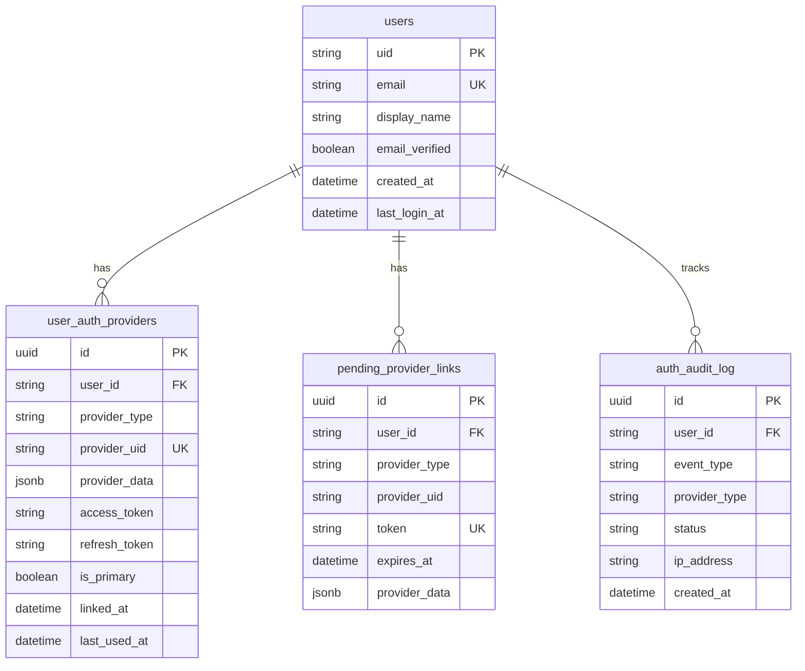
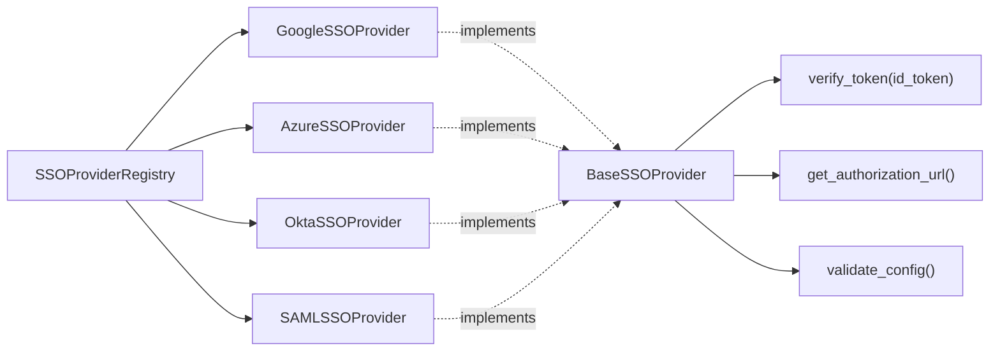
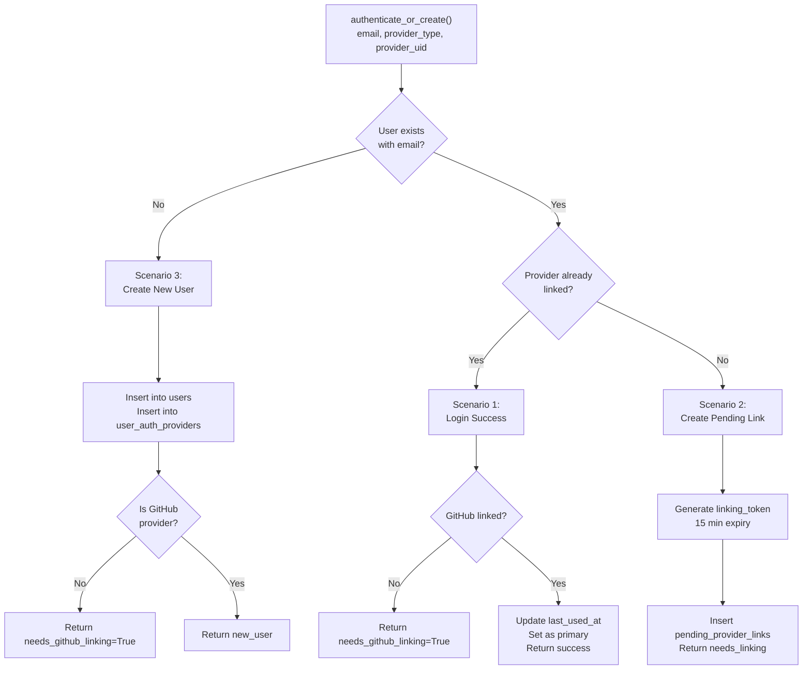
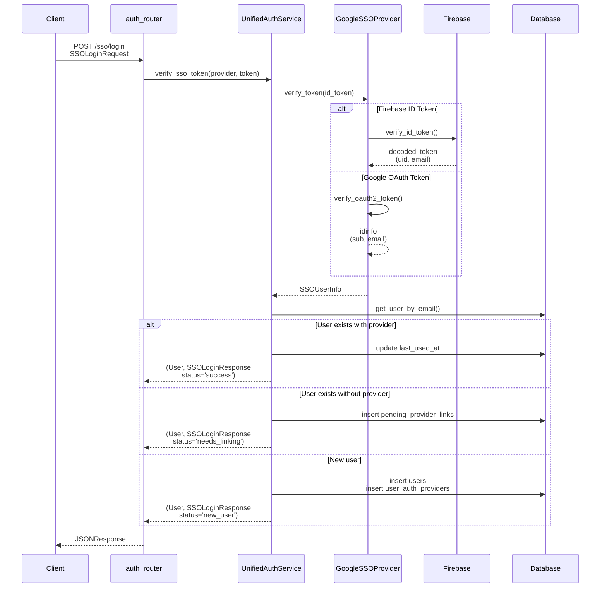
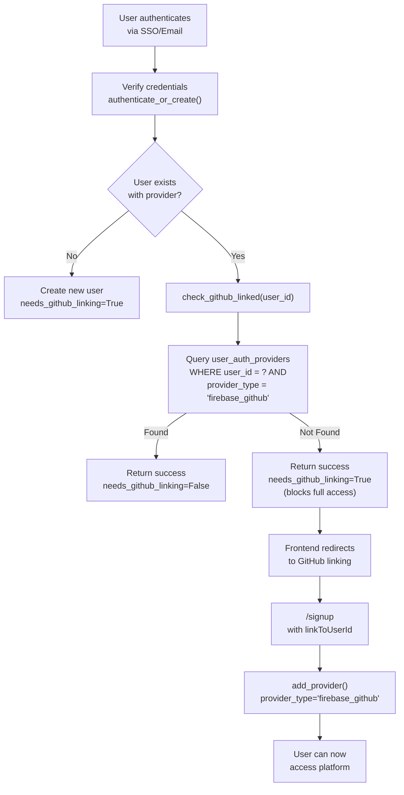
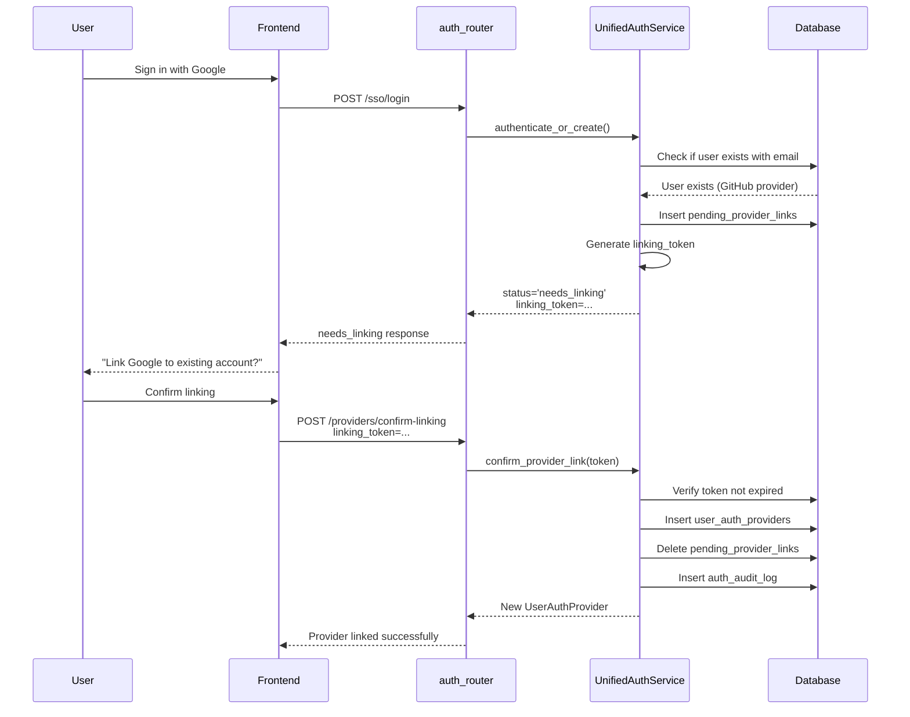
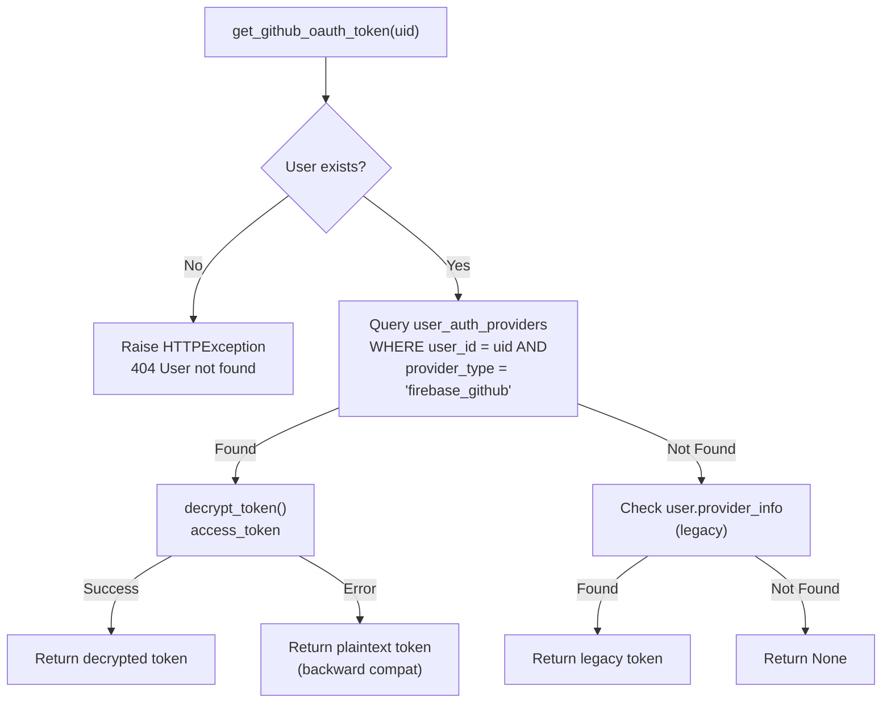

7-Authentication and User Management

# Page: Authentication and User Management

# Authentication and User Management

<details>
<summary>Relevant source files</summary>

The following files were used as context for generating this wiki page:

- [app/modules/auth/auth_router.py](app/modules/auth/auth_router.py)
- [app/modules/auth/auth_schema.py](app/modules/auth/auth_schema.py)
- [app/modules/auth/sso_providers/google_provider.py](app/modules/auth/sso_providers/google_provider.py)
- [app/modules/auth/unified_auth_service.py](app/modules/auth/unified_auth_service.py)
- [app/modules/code_provider/github/github_service.py](app/modules/code_provider/github/github_service.py)
- [app/modules/users/user_schema.py](app/modules/users/user_schema.py)

</details>


## Purpose and Scope

This document describes the multi-provider authentication system that enables users to sign in through multiple identity providers while maintaining a single user account. The system supports Firebase GitHub OAuth, Google SSO, Azure AD, Okta, Email/Password, and SAML authentication. It handles provider linking, account consolidation, token management, and security auditing.

For information about user profile management and preferences, see [User Service](#7.5). For GitHub integration with code repositories, see [GitHub Integration](#6.2).

---

## Multi-Provider Authentication Architecture

The authentication system implements a unified identity model where users can link multiple authentication providers to a single account. The `UnifiedAuthService` orchestrates authentication across all providers while maintaining email as the unique identifier.

### System Architecture Diagram

```mermaid
graph TB
    subgraph "Authentication Providers"
        FIREBASE_GH["Firebase GitHub OAuth<br/>PROVIDER_TYPE_FIREBASE_GITHUB"]
        SSO_GOOGLE["Google SSO<br/>PROVIDER_TYPE_SSO_GOOGLE"]
        SSO_AZURE["Azure AD SSO<br/>PROVIDER_TYPE_SSO_AZURE"]
        SSO_OKTA["Okta SSO<br/>PROVIDER_TYPE_SSO_OKTA"]
        EMAIL_PASS["Email/Password<br/>PROVIDER_TYPE_FIREBASE_EMAIL"]
    end
    
    subgraph "Unified Authentication Service"
        UNIFIED_AUTH["UnifiedAuthService"]
        VERIFY["verify_sso_token()"]
        AUTH_CREATE["authenticate_or_create()"]
        PROVIDER_REGISTRY["SSOProviderRegistry"]
        GOOGLE_PROVIDER["GoogleSSOProvider"]
        AZURE_PROVIDER["AzureSSOProvider"]
    end
    
    subgraph "User Identity Management"
        USERS_TABLE[("users table<br/>uid, email, display_name")]
        AUTH_PROVIDERS[("user_auth_providers<br/>provider_type, provider_uid")]
        PENDING_LINKS[("pending_provider_links<br/>token, expires_at")]
        AUDIT_LOG[("auth_audit_log<br/>event_type, status")]
    end
    
    subgraph "API Layer"
        SIGNUP["/signup<br/>AuthAPI.signup()"]
        SSO_LOGIN["/sso/login<br/>AuthAPI.sso_login()"]
        CONFIRM_LINK["/providers/confirm-linking"]
        GET_PROVIDERS["/providers/me"]
    end
    
    FIREBASE_GH --> UNIFIED_AUTH
    SSO_GOOGLE --> VERIFY
    SSO_AZURE --> VERIFY
    SSO_OKTA --> VERIFY
    EMAIL_PASS --> UNIFIED_AUTH
    
    VERIFY --> PROVIDER_REGISTRY
    PROVIDER_REGISTRY --> GOOGLE_PROVIDER
    PROVIDER_REGISTRY --> AZURE_PROVIDER
    
    SIGNUP --> UNIFIED_AUTH
    SSO_LOGIN --> VERIFY
    SSO_LOGIN --> AUTH_CREATE
    CONFIRM_LINK --> UNIFIED_AUTH
    GET_PROVIDERS --> UNIFIED_AUTH
    
    AUTH_CREATE --> USERS_TABLE
    AUTH_CREATE --> AUTH_PROVIDERS
    AUTH_CREATE --> PENDING_LINKS
    UNIFIED_AUTH --> AUDIT_LOG
```



**Sources:** [app/modules/auth/unified_auth_service.py:1-100](), [app/modules/auth/auth_router.py:1-50]()

---

## User Identity Model

### Single Identity Based on Email

The system maintains a **single user identity** per email address in the `users` table. Multiple authentication providers can be linked to this identity through the `user_auth_providers` table.

| Table | Primary Key | Purpose |
|-------|-------------|---------|
| `users` | `uid` | Single user identity |
| `user_auth_providers` | `id` (UUID) | Multiple providers per user |
| `pending_provider_links` | `id` (UUID) | Temporary linking tokens (15 min TTL) |
| `auth_audit_log` | `id` (UUID) | Security event tracking |

### Database Schema



**Sources:** [app/modules/auth/auth_provider_model.py](), [app/modules/users/user_model.py]()

### Primary Provider Concept

Each user has exactly one **primary provider** (`is_primary=True` in `user_auth_providers`). This determines which email is displayed in the UI when a user has linked providers with different emails (e.g., personal Gmail and work Google Workspace account).

**Sources:** [app/modules/auth/unified_auth_service.py:313-330]()

---

## Provider Types and Configuration

### Supported Provider Types

The system defines provider types as string constants:

```
PROVIDER_TYPE_FIREBASE_GITHUB = "firebase_github"
PROVIDER_TYPE_FIREBASE_EMAIL = "firebase_email_password"
PROVIDER_TYPE_SSO_GOOGLE = "sso_google"
PROVIDER_TYPE_SSO_AZURE = "sso_azure"
PROVIDER_TYPE_SSO_OKTA = "sso_okta"
PROVIDER_TYPE_SSO_SAML = "sso_saml"
```

**Sources:** [app/modules/auth/unified_auth_service.py:21-27]()

### SSO Provider Registry

The `SSOProviderRegistry` manages singleton instances of SSO providers. Each provider implements the `BaseSSOProvider` interface with a `verify_token()` method.



**Sources:** [app/modules/auth/sso_providers/provider_registry.py](), [app/modules/auth/sso_providers/base_provider.py]()

### Google SSO Provider Implementation

The `GoogleSSOProvider` supports both Firebase ID tokens and Google OAuth tokens through a two-stage verification process:

1. **Firebase ID token verification** (issuer: `securetoken.google.com/{project_id}`)
   - Uses Firebase Admin SDK
   - Returns Firebase UID as `provider_uid`

2. **Google OAuth token verification** (issuer: `accounts.google.com`)
   - Uses Google's library
   - Returns Google `sub` as `provider_uid`

**Sources:** [app/modules/auth/sso_providers/google_provider.py:64-181]()

---

## Authentication Flow

### Three Authentication Scenarios

The `authenticate_or_create()` method in `UnifiedAuthService` handles three scenarios:



**Sources:** [app/modules/auth/unified_auth_service.py:387-805]()

### Request Flow: SSO Login



**Sources:** [app/modules/auth/auth_router.py:441-570](), [app/modules/auth/unified_auth_service.py:82-100]()

---

## GitHub Linking Requirement

### Business Logic

The system enforces a **business requirement** that all users must link a GitHub account before they can fully use the platform. This is implemented through the `needs_github_linking` flag in authentication responses.

### GitHub Linking Check

The `check_github_linked()` method verifies GitHub linking:

```python
# Flow:
# 1. Find user in users table by user_id
# 2. Query user_auth_providers for provider_type = 'firebase_github'
# 3. Return (True, provider) if found, (False, None) if not
```

**Sources:** [app/modules/auth/unified_auth_service.py:130-174]()

### Authentication Flow with GitHub Check



**Sources:** [app/modules/auth/unified_auth_service.py:551-609](), [app/modules/auth/auth_router.py:146-279]()

### GitHub Signup Restrictions

The system **blocks new GitHub signups** (users who have never used the platform before) but allows existing users to continue signing in with GitHub:

```python
# In /signup endpoint:
if is_github_flow:
    existing_provider = db.query(UserAuthProvider).filter(
        UserAuthProvider.provider_type == PROVIDER_TYPE_FIREBASE_GITHUB,
        UserAuthProvider.provider_uid == provider_uid,
    ).first()
    
    if not existing_provider:
        # Block new GitHub signup
        return Response(
            content=json.dumps({
                "error": "GitHub sign-up is no longer supported. 
                          Please use 'Continue with Google' with your work email."
            }),
            status_code=403
        )
```

**Sources:** [app/modules/auth/auth_router.py:286-314]()

---

## Provider Linking and Account Consolidation

### Pending Provider Links

When a user attempts to sign in with a new provider but already has an account with a different provider, the system creates a **pending provider link** with a 15-minute expiration:

| Field | Type | Purpose |
|-------|------|---------|
| `token` | `string` (32 bytes, URL-safe) | Unique linking token |
| `user_id` | `string` | User to link to |
| `provider_type` | `string` | Provider being linked |
| `provider_uid` | `string` | Provider's unique ID |
| `expires_at` | `datetime` | 15 minutes from creation |
| `provider_data` | `jsonb` | Provider-specific data |

**Sources:** [app/modules/auth/unified_auth_service.py:809-860]()

### Linking Confirmation Flow



**Sources:** [app/modules/auth/auth_router.py:572-617](), [app/modules/auth/unified_auth_service.py:862-929]()

### Security Considerations

1. **Time-Limited Tokens**: Pending links expire after 15 minutes to prevent token reuse attacks
2. **Single-Use Tokens**: Tokens are deleted after successful confirmation
3. **IP and User-Agent Logging**: All linking events record IP address and user agent for forensics
4. **Audit Trail**: All linking attempts logged to `auth_audit_log`

**Sources:** [app/modules/auth/unified_auth_service.py:18-19]()

---

## Token Management and Security

### Token Encryption

All OAuth access tokens and refresh tokens are **encrypted at rest** using the `encrypt_token()` function before storage in the database:

```python
# In add_provider():
encrypted_access_token = (
    encrypt_token(provider_create.access_token)
    if provider_create.access_token
    else None
)
encrypted_refresh_token = (
    encrypt_token(provider_create.refresh_token)
    if provider_create.refresh_token
    else None
)
```

**Sources:** [app/modules/auth/unified_auth_service.py:254-264]()

### Token Retrieval

The `get_decrypted_access_token()` method handles both encrypted tokens (new system) and plaintext tokens (legacy) for backward compatibility:

```python
def get_decrypted_access_token(self, user_id: str, provider_type: str) -> Optional[str]:
    provider = self.get_provider(user_id, provider_type)
    if not provider or not provider.access_token:
        return None
    
    try:
        # Try to decrypt (token is encrypted)
        return decrypt_token(provider.access_token)
    except Exception:
        # Token might be plaintext (backward compatibility)
        logger.warning("Failed to decrypt token, assuming plaintext")
        return provider.access_token
```

**Sources:** [app/modules/auth/unified_auth_service.py:176-199]()

### GitHub OAuth Token Retrieval

The `GithubService.get_github_oauth_token()` method retrieves GitHub tokens with fallback to legacy storage:



**Sources:** [app/modules/code_provider/github/github_service.py:184-247]()

---

## Audit Logging

### Event Types

The `auth_audit_log` table tracks all authentication events:

| Event Type | Trigger | Status Values |
|------------|---------|---------------|
| `login` | Successful authentication | `success` |
| `login_blocked_github` | Login blocked due to missing GitHub | `pending` |
| `signup` | New user creation | `success` |
| `link_provider` | Provider added to account | `success` |
| `unlink_provider` | Provider removed from account | `success` |
| `needs_linking` | Pending link created | `pending` |

### Audit Log Record

```python
def _log_auth_event(
    self,
    user_id: str,
    event_type: str,
    provider_type: str,
    status: str,
    ip_address: Optional[str] = None,
    user_agent: Optional[str] = None,
    error_message: Optional[str] = None,
):
    audit_entry = AuthAuditLog(
        user_id=user_id,
        event_type=event_type,
        provider_type=provider_type,
        status=status,
        ip_address=ip_address,
        user_agent=user_agent,
        error_message=error_message,
    )
    self.db.add(audit_entry)
    self.db.commit()
```

**Sources:** [app/modules/auth/unified_auth_service.py:931-956]()

---

## API Endpoints

### Authentication Endpoints

| Endpoint | Method | Purpose | Auth Required |
|----------|--------|---------|---------------|
| `/signup` | POST | Firebase signup/login with GitHub linking | No |
| `/sso/login` | POST | SSO authentication (Google/Azure/Okta) | No |
| `/providers/confirm-linking` | POST | Confirm pending provider link | No |
| `/providers/cancel-linking/{token}` | DELETE | Cancel pending provider link | No |
| `/providers/me` | GET | Get all linked providers | Yes |
| `/providers/set-primary` | POST | Set primary provider | Yes |
| `/providers/unlink` | DELETE | Unlink a provider | Yes |
| `/account/me` | GET | Get complete account info | Yes |

### Endpoint: POST /signup

Handles Firebase GitHub OAuth signup/login with two main flows:

1. **GitHub Linking Flow** (`linkToUserId` provided):
   - Find SSO user by `linkToUserId`
   - Add GitHub provider to existing user
   - Validate GitHub account not already linked elsewhere

2. **GitHub Sign-in Flow** (no `linkToUserId`):
   - Check if GitHub UID already linked
   - **Block new GitHub signups** (return 403)
   - Allow existing users to sign in

**Sources:** [app/modules/auth/auth_router.py:72-437]()

### Endpoint: POST /sso/login

Handles SSO authentication with token verification:

```python
async def sso_login(
    request: Request,
    sso_request: SSOLoginRequest,
    db: Session = Depends(get_db),
):
    # Verify ID token with SSO provider
    verified_user_info = await unified_auth.verify_sso_token(
        sso_request.sso_provider,
        sso_request.id_token,
    )
    
    # Block new users with personal emails
    if is_personal_email_domain(verified_email):
        if not existing_user:
            return JSONResponse({
                "error": "Personal email addresses are not allowed. 
                          Use work email."
            }, status_code=403)
    
    # Authenticate or create user
    user, response = await unified_auth.authenticate_or_create(...)
    
    return JSONResponse(response.model_dump())
```

**Sources:** [app/modules/auth/auth_router.py:441-570]()

### Endpoint: POST /providers/confirm-linking

Confirms a pending provider link using the linking token:

**Sources:** [app/modules/auth/auth_router.py:572-617]()

### Endpoint: GET /providers/me

Returns all authentication providers for the authenticated user:

```json
{
  "providers": [
    {
      "id": "uuid",
      "user_id": "user_uid",
      "provider_type": "sso_google",
      "provider_uid": "google_sub",
      "is_primary": true,
      "linked_at": "2024-01-01T00:00:00Z",
      "last_used_at": "2024-01-15T00:00:00Z"
    },
    {
      "id": "uuid",
      "user_id": "user_uid",
      "provider_type": "firebase_github",
      "provider_uid": "github_firebase_uid",
      "is_primary": false,
      "linked_at": "2024-01-02T00:00:00Z"
    }
  ],
  "primary_provider": { ... }
}
```

**Sources:** [app/modules/auth/auth_router.py:646-690]()

---

## Development Mode Authentication

### Mock Authentication

When `isDevelopmentMode=true`, the system bypasses Firebase verification to enable local development without Firebase credentials:

```python
# In UnifiedAuthService.authenticate_or_create():
if firebase_based_providers or uid_looks_like_firebase:
    try:
        firebase_admin.get_app()
        firebase_initialized = True
    except (ValueError, Exception):
        # Firebase not initialized (development mode)
        firebase_initialized = False
        logger.warning("Firebase not initialized. 
                       Skipping Firebase verification. 
                       This is normal in development mode.")
        firebase_user_exists = True  # Assume user exists
```

**Sources:** [app/modules/auth/unified_auth_service.py:446-462]()

### Dummy User Creation

For development, the `UserService` provides methods to create test users without Firebase:

```python
def create_dummy_user(self, email: str) -> User:
    """Create a dummy user for development/testing"""
    dummy_user = User(
        uid=f"dev_{email}",
        email=email,
        display_name=email.split("@")[0],
        email_verified=True,
        created_at=datetime.now(timezone.utc),
        last_login_at=datetime.now(timezone.utc),
    )
    self.db.add(dummy_user)
    self.db.commit()
    return dummy_user
```

**Sources:** [app/modules/users/user_service.py]()

---

## Provider Management Operations

### Setting Primary Provider

Users can change their primary provider to control which email is displayed:

```python
def set_primary_provider(self, user_id: str, provider_type: str) -> bool:
    # Unset all other primary providers
    self.db.query(UserAuthProvider).filter(
        UserAuthProvider.user_id == user_id
    ).update({"is_primary": False})
    
    # Set this as primary
    provider.is_primary = True
    self.db.commit()
```

**Sources:** [app/modules/auth/unified_auth_service.py:313-330]()

### Unlinking Providers

Users can unlink providers, but cannot unlink their only provider (would lock them out):

```python
def unlink_provider(self, user_id: str, provider_type: str) -> bool:
    # Check if this is the only provider
    all_providers = self.get_user_providers(user_id)
    if len(all_providers) <= 1:
        raise ValueError("Cannot unlink the only authentication provider")
    
    # If it was primary, set another as primary
    if was_primary:
        remaining = self.get_user_providers(user_id)
        if remaining:
            remaining[0].is_primary = True
```

**Sources:** [app/modules/auth/unified_auth_service.py:332-376]()

---

## Email Domain Validation

### Personal Email Blocking

The system blocks new user signups with personal email domains (Gmail, Yahoo, Outlook, etc.) but allows existing users with grandfathered personal emails:

```python
# In /sso/login endpoint:
if is_personal_email_domain(verified_email):
    if not existing_user:
        # Block new user with personal email
        return JSONResponse({
            "error": "Personal email addresses are not allowed. 
                      Please use your work/corporate email."
        }, status_code=403)
    # Allow existing user (legacy policy)
    logger.info(f"Allowing legacy user with generic email: {verified_email}")
```

**Sources:** [app/modules/auth/auth_router.py:500-516]()

### Email Domain Helper

The `is_personal_email_domain()` function checks against a list of generic email providers:

**Sources:** [app/modules/utils/email_helper.py]()