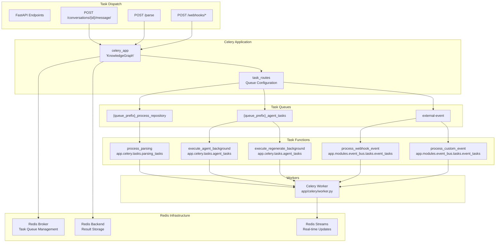
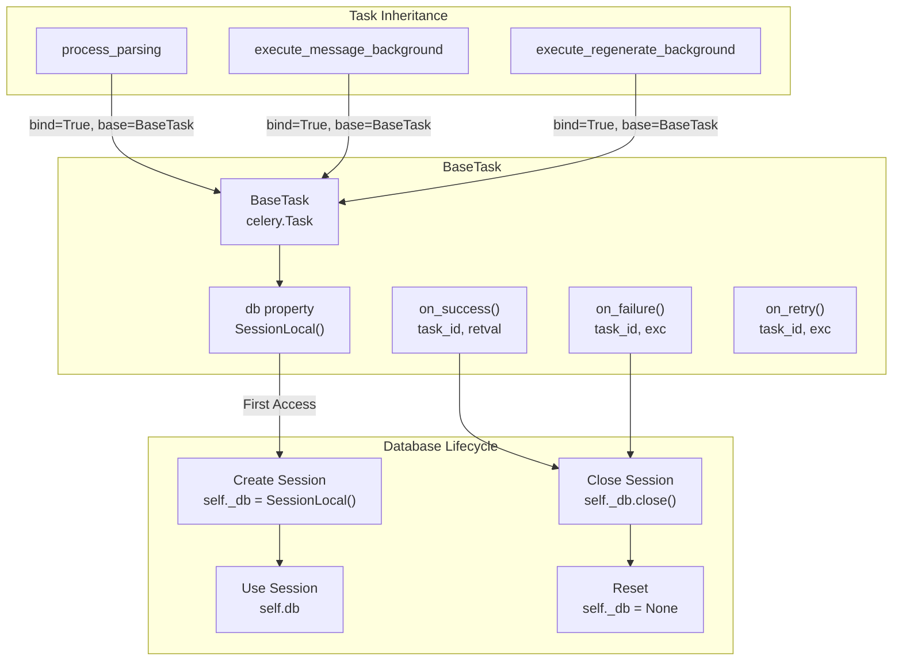
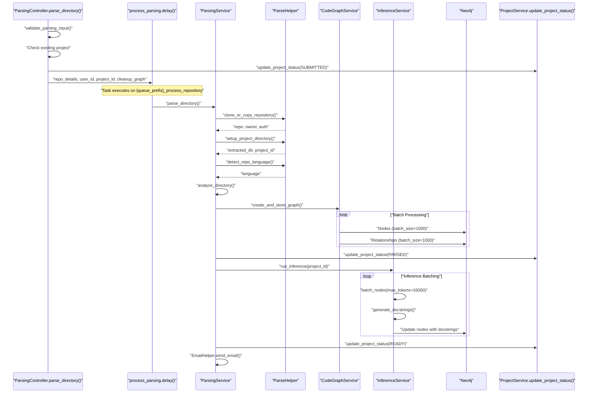
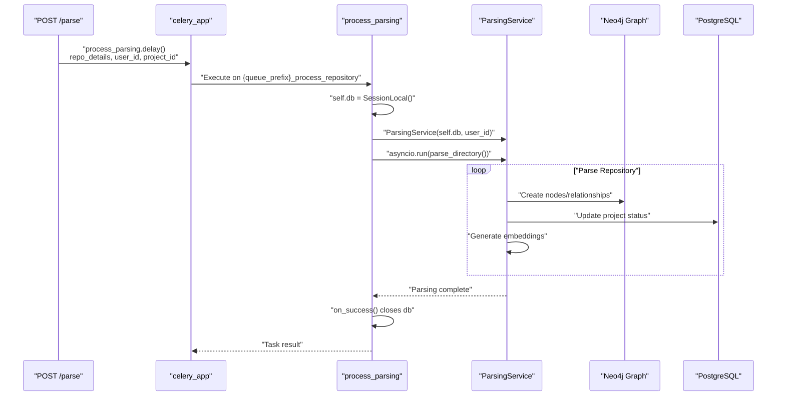
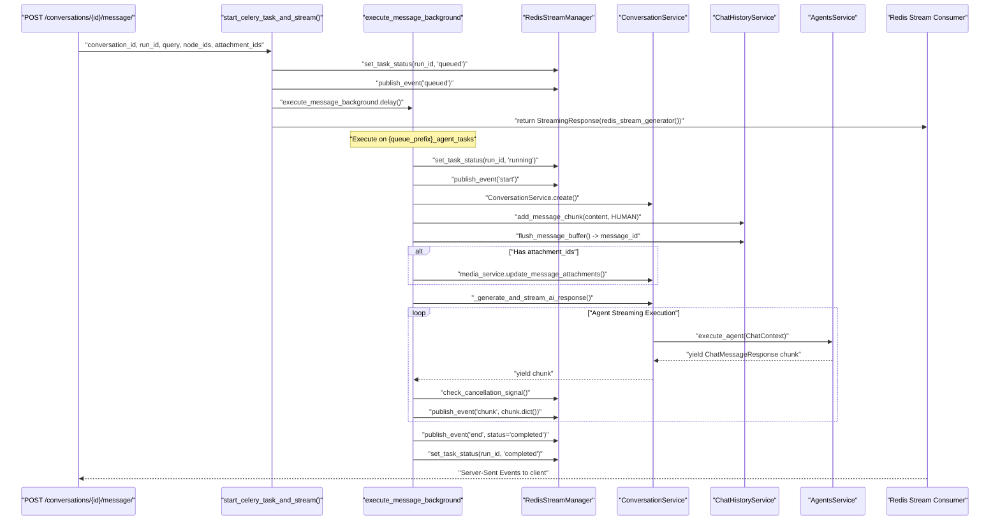
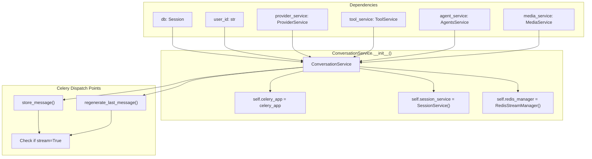
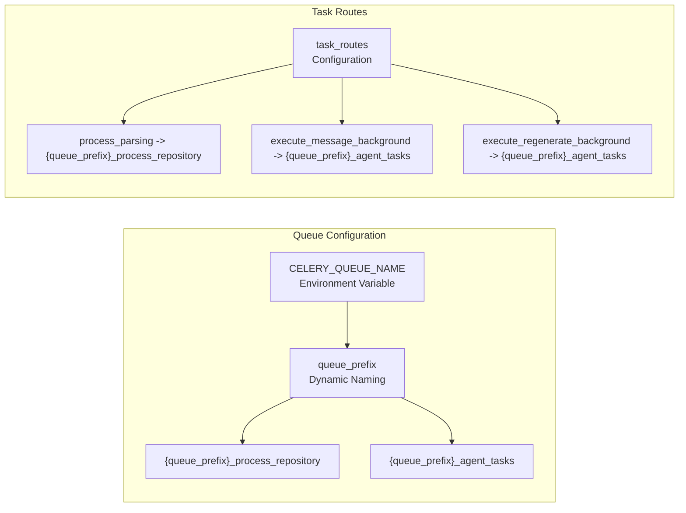
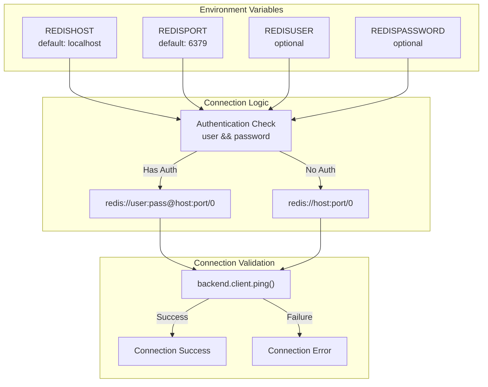

9-Background Processing

# Page: Background Processing

# Background Processing

<details>
<summary>Relevant source files</summary>

The following files were used as context for generating this wiki page:

- [app/modules/conversations/conversation/conversation_controller.py](app/modules/conversations/conversation/conversation_controller.py)
- [app/modules/conversations/conversation/conversation_schema.py](app/modules/conversations/conversation/conversation_schema.py)
- [app/modules/conversations/conversation/conversation_service.py](app/modules/conversations/conversation/conversation_service.py)
- [app/modules/conversations/conversations_router.py](app/modules/conversations/conversations_router.py)
- [app/modules/parsing/graph_construction/code_graph_service.py](app/modules/parsing/graph_construction/code_graph_service.py)
- [app/modules/parsing/graph_construction/parsing_helper.py](app/modules/parsing/graph_construction/parsing_helper.py)
- [app/modules/parsing/graph_construction/parsing_service.py](app/modules/parsing/graph_construction/parsing_service.py)
- [app/modules/parsing/knowledge_graph/inference_service.py](app/modules/parsing/knowledge_graph/inference_service.py)
- [app/modules/projects/projects_service.py](app/modules/projects/projects_service.py)

</details>


## Purpose and Scope

The Background Processing system manages asynchronous, long-running operations using Celery with Redis as the message broker. This system (importance: 28.66) handles three primary categories of background tasks:

1. **Repository Processing** - Parsing operations that transform code repositories into knowledge graphs
2. **Agent Execution** - Long-running AI agent tasks that require streaming responses to clients
3. **External Events** - Webhook processing from integrations like Sentry and Linear

The system provides robust task execution with retry logic, fair task distribution, automatic worker restarts, and memory management. Tasks are executed asynchronously while real-time updates are streamed to clients via Redis Streams (covered in page 9.3).

For detailed Celery configuration, see page 9.1. For task execution patterns, see page 9.2. For Redis Streams implementation, see page 9.3.

## System Architecture Overview

The background processing system uses Celery with three specialized task queues, each handling different types of operations. The `celery_app` is initialized in [app/celery/celery_app.py:25]() with Redis serving dual roles as both the message broker and result backend.

**Three-Queue Architecture**



**Background Processing Architecture with Task Routing**

Sources: [app/celery/celery_app.py:47-64](), [app/celery/worker.py:16-30]()

### Queue Routing Configuration

The `task_routes` dictionary in [app/celery/celery_app.py:47-64]() maps task functions to specific queues:

| Task Function | Queue Name | Purpose |
|--------------|------------|---------|
| `process_parsing` | `{queue_prefix}_process_repository` | Repository parsing and knowledge graph construction |
| `execute_agent_background` | `{queue_prefix}_agent_tasks` | AI agent execution with streaming responses |
| `execute_regenerate_background` | `{queue_prefix}_agent_tasks` | Message regeneration with streaming |
| `process_webhook_event` | `external-event` | Webhook processing from external services |
| `process_custom_event` | `external-event` | Custom event handling |

The `queue_prefix` is determined by the `CELERY_QUEUE_NAME` environment variable (default: `"staging"`), enabling environment-specific queue isolation.

Sources: [app/celery/celery_app.py:16](), [app/celery/celery_app.py:47-64]()

### Worker Configuration

The Celery worker is configured with resource limits and optimization settings:

| Configuration | Value | Purpose |
|---------------|-------|---------|
| `worker_prefetch_multiplier` | `1` | Fair task distribution across workers |
| `task_acks_late` | `True` | Task acknowledged only after completion |
| `task_time_limit` | `5400` seconds | 90-minute timeout for long-running tasks |
| `worker_max_tasks_per_child` | `200` | Worker restart after 200 tasks (prevents memory leaks) |
| `worker_max_memory_per_child` | `2000000` KB | Restart worker if memory exceeds 2GB |
| `task_default_rate_limit` | `10/m` | Rate limit of 10 tasks per minute per worker |
| `broker_transport_options.visibility_timeout` | `5400` seconds | Message visibility timeout (90 minutes) |

Sources: [app/celery/celery_app.py:66-78]()

These settings ensure workers automatically restart to prevent memory leaks, distribute tasks fairly, and handle long-running operations without timeouts.

## Task Execution Lifecycle

All Celery tasks inherit from `BaseTask`, which manages database connections and provides lifecycle hooks:

**BaseTask Lifecycle Management**



**Task Database Lifecycle**

Sources: [app/celery/tasks/base_task.py:8-34]()

The `BaseTask` class provides:
- **Lazy Database Connection**: The `db` property creates a `SessionLocal()` instance on first access
- **Automatic Cleanup**: `on_success()` and `on_failure()` hooks close the database session and reset `_db` to `None`
- **Retry Support**: `on_retry()` logs retry attempts without closing the session
- **Thread Safety**: Each task instance gets its own database session

Sources: [app/celery/tasks/base_task.py:8-34]()
</thinking>

## Parsing Task Implementation Details

The `process_parsing` task orchestrates the complete repository parsing pipeline through the `ParsingService` class:

**Parsing Pipeline with Background Execution**



**Repository Parsing Pipeline**

Sources: [app/modules/parsing/graph_construction/parsing_controller.py:42-305](), [app/modules/parsing/graph_construction/parsing_service.py:102-273](), [app/modules/parsing/graph_construction/parsing_helper.py:63-107]()

### Task Dispatch from ParsingController

The `ParsingController.parse_directory()` method handles task submission with several key checks:

1. **Project Existence Check**: Queries `ProjectService` to determine if the project already exists for the user
2. **Commit Status Validation**: For existing projects, checks if the requested commit is already parsed via `ParseHelper.check_commit_status()`
3. **Demo Project Optimization**: For demo repositories (like `Portkey-AI/gateway`, `crewAIInc/crewAI`), duplicates existing graphs instead of re-parsing
4. **Status Updates**: Updates project status to `SUBMITTED` before task dispatch

The task is dispatched in [app/modules/parsing/graph_construction/parsing_controller.py:216-222]():

```python
process_parsing.delay(
    repo_details.model_dump(),
    user_id,
    user_email,
    project_id,
    cleanup_graph,
)
```

Sources: [app/modules/parsing/graph_construction/parsing_controller.py:216-222](), [app/modules/parsing/graph_construction/parsing_controller.py:112-255]()

### Repository Cloning and Preparation

The `ParseHelper.clone_or_copy_repository()` method handles three repository source types:

| Repository Type | Detection | Access Method |
|----------------|-----------|---------------|
| Local Path | `repo_details.repo_path` exists | Direct `Repo()` instantiation |
| GitHub Repository | PyGithub `GithubService.get_repo()` | GitHub API with authentication |
| GitBucket Repository | PyGithub with custom base URL | GitBucket API with token/basic auth fallback |

For remote repositories, the method extracts authentication from the GitHub client's `_Github__requester.auth` attribute to use for tarball downloads.

Sources: [app/modules/parsing/graph_construction/parsing_helper.py:63-107]()

### Tarball Download with Authentication

The `ParseHelper.download_and_extract_tarball()` method (lines 203-485) handles authenticated archive downloads with multiple fallback strategies:

1. **GitBucket Authentication**: Tries token header authentication first, then falls back to Basic Auth using `requests.auth.HTTPBasicAuth`
2. **Archive Download Fallback**: If tarball download fails with 401, falls back to `_clone_repository_with_auth()` for git clone
3. **Text File Filtering**: Only copies text files (detected by `is_text_file()`) to the final directory to prevent binary file parsing errors

Sources: [app/modules/parsing/graph_construction/parsing_helper.py:203-485]()

### Graph Construction Batching

The `CodeGraphService.create_and_store_graph()` method creates Neo4j nodes and relationships in batches:

**Node Creation**: Processes nodes in batches of 1000 using the APOC procedure `apoc.create.node()` to dynamically set labels (FILE, CLASS, FUNCTION, INTERFACE). See [app/modules/parsing/graph_construction/code_graph_service.py:62-109]().

**Relationship Creation**: Groups relationships by type (CONTAINS, REFERENCES) and creates them in type-specific batches of 1000, avoiding dynamic relationship creation for better performance. See [app/modules/parsing/graph_construction/code_graph_service.py:111-159]().

Sources: [app/modules/parsing/graph_construction/code_graph_service.py:37-164]()

### Inference Service Execution

The `InferenceService.run_inference()` method generates AI-powered documentation with cache-first optimization:

1. **Node Fetching**: Retrieves all nodes for the project via `fetch_graph()` in batches of 500
2. **Cache Checking**: Uses `InferenceCacheService` to check for previously generated docstrings based on content hash
3. **Intelligent Batching**: Groups nodes by token count (default 16,000 tokens per batch) via `batch_nodes()`
4. **Large Node Splitting**: Splits nodes exceeding token limits into chunks with `split_large_node()`
5. **LLM Generation**: Calls `ProviderService` with structured output schema (`DocstringResponse`)
6. **Embedding Generation**: Uses `SentenceTransformer` (all-MiniLM-L6-v2) to create embeddings for semantic search

Sources: [app/modules/parsing/knowledge_graph/inference_service.py:112-133](), [app/modules/parsing/knowledge_graph/inference_service.py:352-587]()

### Project Status Transitions

The parsing pipeline transitions through four status states:

| Status | Set By | Code Location | Meaning |
|--------|--------|---------------|---------|
| `SUBMITTED` | `ParsingController` | [parsing_controller.py:225]() | Task queued for background processing |
| `PARSED` | `ParsingService` | [parsing_service.py:354-356]() | Graph construction complete, inference starting |
| `READY` | `ParsingService` | [parsing_service.py:361-363]() | All processing complete, available for queries |
| `ERROR` | `ParsingService` (exception handler) | [parsing_service.py:217-218]() | Parsing failed, error logged |

Sources: [app/modules/parsing/graph_construction/parsing_service.py:354-363](), [app/modules/projects/projects_service.py:189-198]()

## Task Types Overview

The system provides three categories of background tasks, each optimized for different execution patterns.

### 1. Repository Parsing Tasks

**process_parsing Task Flow**



**process_parsing Execution**

Sources: [app/celery/tasks/parsing_tasks.py:13-54]()

The `process_parsing` task in [app/celery/tasks/parsing_tasks.py:18-25]() accepts:
- `repo_details`: Dictionary containing repository configuration
- `user_id`: User identifier
- `user_email`: User email address  
- `project_id`: Project identifier
- `cleanup_graph`: Boolean flag for cleaning existing graph data

The task wraps `ParsingService.parse_directory()` in an async context using `asyncio.run()` and tracks execution time for monitoring.

Sources: [app/celery/tasks/parsing_tasks.py:13-54]()

### 2. Agent Execution Tasks

**execute_message_background Task Flow**



**Agent Background Execution with Streaming**

Sources: [app/celery/tasks/agent_tasks.py:12-158](), [app/modules/conversations/conversation/conversation_service.py:544-653]()

The agent execution flow involves three key components:

#### 1. Task Dispatch from Router

The `ConversationAPI.post_message()` endpoint in [app/modules/conversations/conversations_router.py:160-286]() handles message submission:

- **Image Upload Processing**: Processes uploaded images via `MediaService.upload_image()` and collects `attachment_ids`
- **Run ID Generation**: Creates deterministic session identifiers using `normalize_run_id()` based on `conversation_id`, `user_id`, and optional `session_id`
- **Unique Stream Creation**: Calls `ensure_unique_run_id()` for fresh requests to prevent stream conflicts
- **Background Task Dispatch**: Invokes `start_celery_task_and_stream()` which queues the Celery task and returns a `StreamingResponse`

Sources: [app/modules/conversations/conversations_router.py:160-286](), [app/modules/conversations/utils/conversation_routing.py]()

#### 2. Message Storage and Attachment Linking

The `ConversationService.store_message()` method in [app/modules/conversations/conversation/conversation_service.py:544-653]() manages message persistence:

1. **Access Control**: Validates user access with `check_conversation_access()`
2. **Message Buffering**: Uses `ChatHistoryService.add_message_chunk()` and `flush_message_buffer()` to store human messages
3. **Attachment Association**: If `attachment_ids` are present, calls `MediaService.update_message_attachments()` to link images to the message
4. **Title Generation**: For the first human message, generates a conversation title via LLM using `_generate_title()`
5. **Repository Registration**: Ensures the repository is registered in `RepoManager` with `_ensure_repo_in_repo_manager()`

Sources: [app/modules/conversations/conversation/conversation_service.py:544-653]()

#### 3. Agent Execution and Streaming

The `ConversationService._generate_and_stream_ai_response()` method in [app/modules/conversations/conversation/conversation_service.py:891-1009]() orchestrates agent execution:

**ChatContext Construction**: Builds a `ChatContext` object containing:
- Query text and conversation history
- Project IDs and node IDs (for code context)
- Attachment IDs (for multimodal processing)
- Agent configuration

**Multimodal Processing**: If `attachment_ids` are present:
1. Fetches images via `MediaService.get_image_as_base64()`
2. Includes base64-encoded images in the chat history
3. Enables vision model processing (GPT-4 Vision, Claude 3)

**Agent Selection and Execution**: 
- Retrieves agent configuration from `agent_ids[0]`
- Delegates to `AgentsService.execute_agent()` for streaming execution
- Processes tool calls and citations from agent responses

**Message Buffering**: Accumulates response chunks via `ChatHistoryService.add_message_chunk()` and flushes on completion with `flush_message_buffer()`

Sources: [app/modules/conversations/conversation/conversation_service.py:891-1009]()

#### 4. Regenerate Task Variant

The `execute_regenerate_background` task follows a similar pattern but calls `ConversationService.regenerate_last_message_background()` in [app/modules/conversations/conversation/conversation_service.py:785-847]():

1. **Last Message Retrieval**: Fetches the most recent human message via `_get_last_human_message()`
2. **Attachment Extraction**: Retrieves attachment IDs from the last human message if present
3. **Message Archival**: Archives all AI messages after the last human message with `_archive_subsequent_messages()`
4. **NodeContext Conversion**: Transforms string `node_ids` to `NodeContext` objects for agent execution
5. **Response Generation**: Executes `_generate_and_stream_ai_response()` with the last human message content

Sources: [app/modules/conversations/conversation/conversation_service.py:785-847](), [app/modules/conversations/conversations_router.py:289-417]()

### 3. Event Processing Tasks

Event bus tasks handle webhooks from external integrations:

| Task Function | Module | Purpose |
|--------------|--------|---------|
| `process_webhook_event` | `app.modules.event_bus.tasks.event_tasks` | Process incoming webhooks from Sentry/Linear |
| `process_custom_event` | `app.modules.event_bus.tasks.event_tasks` | Handle custom event types |

Both tasks are routed to the `external-event` queue and are registered in [app/celery/worker.py:27-29]().

Sources: [app/celery/celery_app.py:58-63](), [app/celery/worker.py:10-13](), [app/celery/worker.py:27-29]()

## ConversationService Integration with Celery

The `ConversationService` class serves as the bridge between HTTP requests and background task execution. It initializes the Celery app reference in its constructor:

**ConversationService Celery Integration**



**ConversationService Celery Reference**

Sources: [app/modules/conversations/conversation/conversation_service.py:73-124]()

The `celery_app` reference is imported from `app.celery.celery_app` at [app/modules/conversations/conversation/conversation_service.py:46]() and stored as an instance variable for potential future background task dispatch. Currently, background execution is handled at the router level via `start_celery_task_and_stream()`.

Sources: [app/modules/conversations/conversation/conversation_service.py:46](), [app/modules/conversations/conversation/conversation_service.py:108]()

## Queue Configuration

### Queue Routing

The system uses dynamic queue naming based on environment configuration:



**Queue Routing Configuration**

Sources: [app/celery/celery_app.py:47-64]()

The queue name is constructed using the format `{queue_prefix}_process_repository` or `{queue_prefix}_agent_tasks`, where the prefix comes from the `CELERY_QUEUE_NAME` environment variable (defaulting to `staging`). This enables environment-specific queue isolation for development, staging, and production.

## Connection Management

### Redis Connection

The system builds Redis connection URLs dynamically based on environment variables:



**Redis Connection Management**

Sources: [app/celery/celery_app.py:11-37]()

The system tests the Redis connection at startup and logs the connection status for debugging purposes.

## Task Registration

Tasks are automatically registered when the Celery application starts by importing the task modules:

Sources: [app/celery/celery_app.py:76-77]()

The import of `app.celery.tasks.parsing_tasks` ensures that all tasks defined in that module are registered with the Celery application.