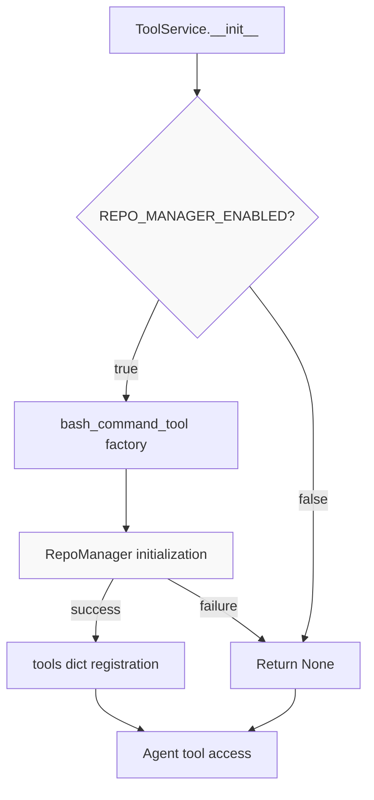
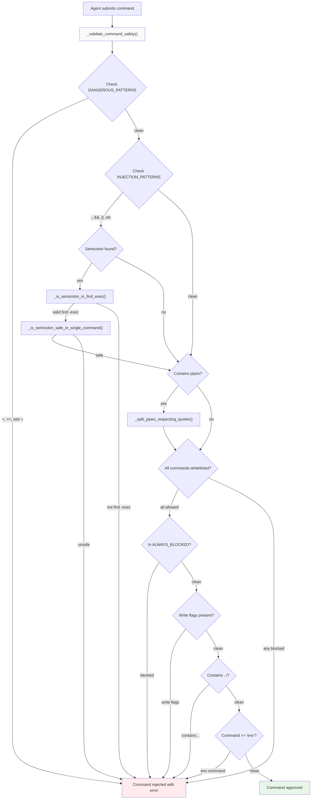
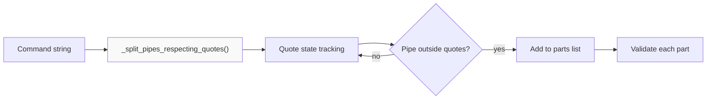
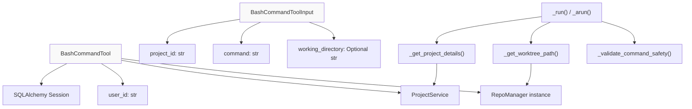
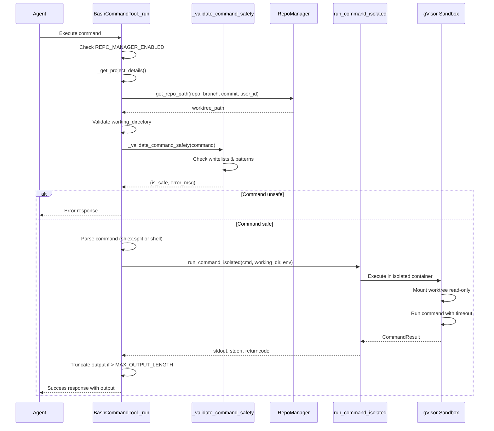
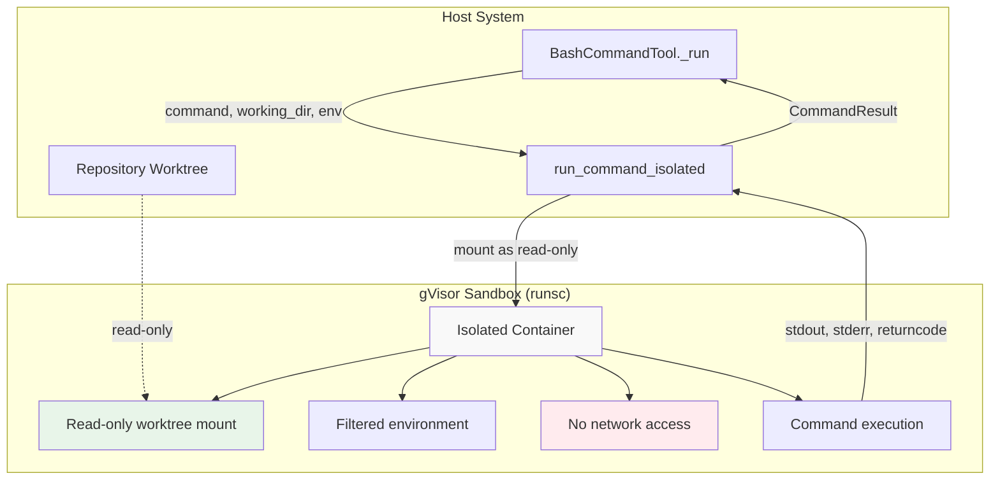
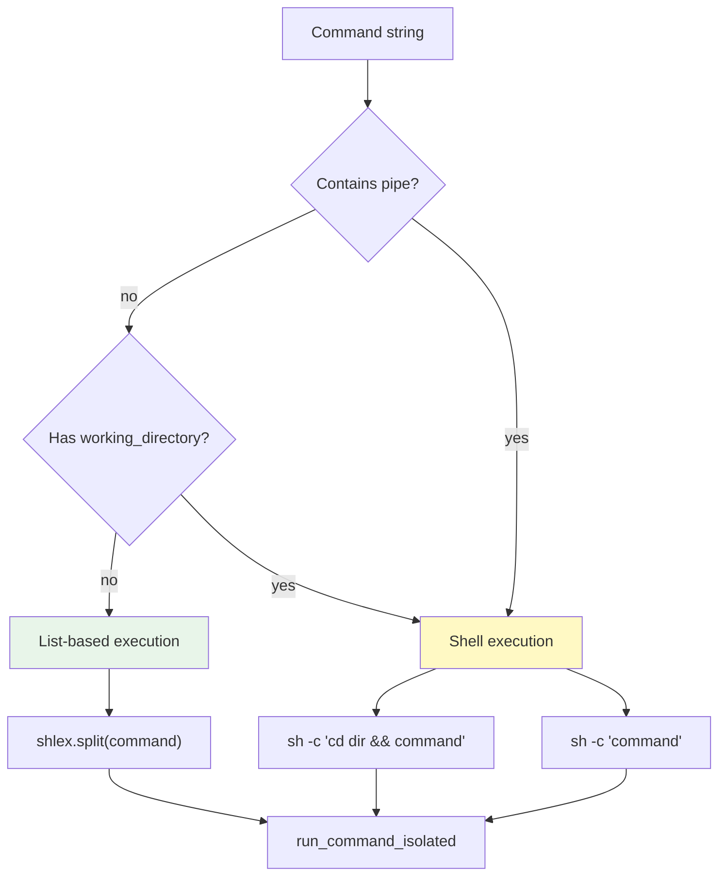
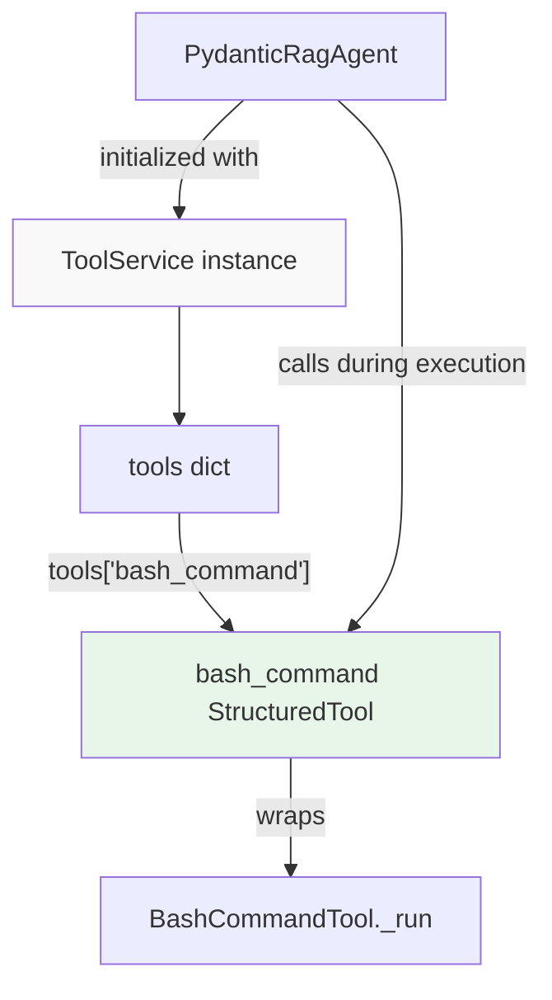

5.5-Bash Command Tool and Sandboxing

# Page: Bash Command Tool and Sandboxing

# Bash Command Tool and Sandboxing

<details>
<summary>Relevant source files</summary>

The following files were used as context for generating this wiki page:

- [app/modules/conversations/conversation/conversation_store.py](app/modules/conversations/conversation/conversation_store.py)
- [app/modules/intelligence/agents/custom_agents/custom_agents_service.py](app/modules/intelligence/agents/custom_agents/custom_agents_service.py)
- [app/modules/intelligence/prompts/classification_prompts.py](app/modules/intelligence/prompts/classification_prompts.py)
- [app/modules/intelligence/prompts/prompt_controller.py](app/modules/intelligence/prompts/prompt_controller.py)
- [app/modules/intelligence/prompts/prompt_router.py](app/modules/intelligence/prompts/prompt_router.py)
- [app/modules/intelligence/prompts/prompt_service.py](app/modules/intelligence/prompts/prompt_service.py)
- [app/modules/intelligence/tools/code_query_tools/bash_command_tool.py](app/modules/intelligence/tools/code_query_tools/bash_command_tool.py)

</details>


This document describes the bash command execution system that allows AI agents to run read-only shell commands on repository codebases. The system implements multi-layer security through command whitelisting, validation, and gVisor sandbox isolation to prevent unauthorized filesystem modifications and system access.

For information about other code analysis tools (file fetching, code structure analysis), see [5.3](#5.3). For knowledge graph query tools, see [5.2](#5.2).

## Purpose and Architecture

The `bash_command` tool enables agents to execute common Unix commands (grep, find, awk, etc.) directly on parsed repository files. The tool only operates when `REPO_MANAGER_ENABLED=true` and the repository has been parsed into a local worktree managed by `RepoManager`. All commands execute in a gVisor-isolated sandbox with read-only filesystem mounts.

**Key Design Principles:**
- **Whitelist-only execution**: Only explicitly allowed commands can run
- **Read-only operations**: Write operations blocked at validation and filesystem levels
- **gVisor isolation**: Commands run in isolated containers with no network access
- **Per-project worktrees**: Each project executes in its own worktree directory
- **Output truncation**: Responses limited to prevent token overflow

Sources: [app/modules/intelligence/tools/code_query_tools/bash_command_tool.py:1-877]()

## Tool Registration and Availability



**Tool Registration Flow**

The bash command tool is conditionally registered in `ToolService._initialize_tools()` based on environment configuration:

1. **Environment Check**: [app/modules/intelligence/tools/tool_service.py:195-198]() checks `REPO_MANAGER_ENABLED` environment variable
2. **Factory Function**: [app/modules/intelligence/tools/code_query_tools/bash_command_tool.py:854-876]() creates tool instance
3. **RepoManager Initialization**: [app/modules/intelligence/tools/code_query_tools/bash_command_tool.py:526-535]() attempts to initialize `RepoManager`
4. **Conditional Registration**: Tool only added to registry if initialization succeeds

Sources: [app/modules/intelligence/tools/tool_service.py:195-198](), [app/modules/intelligence/tools/code_query_tools/bash_command_tool.py:854-876]()

## Security Model

### Command Whitelisting

The tool implements a strict whitelist approach where only explicitly allowed commands can execute. Three security lists control command execution:

| Security List | Purpose | Example Commands |
|--------------|---------|------------------|
| `ALLOWED_COMMANDS` | Whitelisted read-only commands | `grep`, `find`, `cat`, `awk`, `head`, `tail` |
| `ALWAYS_BLOCKED_COMMANDS` | Explicitly banned commands | `rm`, `git`, `npm`, `curl`, `docker`, `sudo` |
| `WRITE_BLOCKED_COMMANDS` | Commands blocked with specific flags | `sed -i`, `awk -i` |

**Allowed Commands** (read-only operations only):
```python
# File search and listing
grep, find, locate, ls, which

# File content viewing
cat, head, tail, less, more, wc

# Text processing
awk, sed, cut, sort, uniq, tr

# File information
file, stat, readlink, realpath

# Search tools
ag (Silver Searcher), rg (ripgrep), ack
```

**Blocked Commands** (write/dangerous operations):
```python
# File modification
rm, rmdir, touch, mkdir, mv, cp, chmod

# Version control
git (all operations)

# Package managers
npm, pip, yarn, pnpm

# Network operations
curl, wget, ssh, scp, nc

# Execution
docker, kubectl, sudo, su
```

Sources: [app/modules/intelligence/tools/code_query_tools/bash_command_tool.py:28-114]()

### Command Validation Pipeline



**Validation Pipeline**

The [app/modules/intelligence/tools/code_query_tools/bash_command_tool.py:326-428]() `_validate_command_safety()` function implements six validation stages:

1. **Dangerous Pattern Detection**: Blocks output redirection (`>`, `>>`), in-place editing (`sed -i`, `awk -i`)
2. **Injection Pattern Detection**: Blocks command chaining (`;`, `&&`, `||`), substitution (`` ` ``, `$()`), input redirection (`<`)
3. **Semicolon Context Analysis**: Special handling for `find -exec` syntax which legitimately uses semicolons
4. **Pipe Chain Validation**: Splits piped commands on `|` and validates each command in chain
5. **Whitelist Verification**: Ensures all commands are in `ALLOWED_COMMANDS` set
6. **Write Operation Blocking**: Blocks commands with flags that enable write operations

**Special Case: Semicolon Handling**

The validation system distinguishes between legitimate semicolon usage (e.g., `find -exec`) and command chaining:

- [app/modules/intelligence/tools/code_query_tools/bash_command_tool.py:221-247]() `_is_semicolon_in_find_exec()`: Detects valid `find -exec ... \;` syntax
- [app/modules/intelligence/tools/code_query_tools/bash_command_tool.py:250-323]() `_is_semicolon_safe_in_single_command()`: Analyzes semicolon context to prevent command chaining attacks

Sources: [app/modules/intelligence/tools/code_query_tools/bash_command_tool.py:326-428](), [app/modules/intelligence/tools/code_query_tools/bash_command_tool.py:221-323]()

### Pipe Handling with Quote Awareness



**Quote-Aware Pipe Splitting**

The [app/modules/intelligence/tools/code_query_tools/bash_command_tool.py:141-181]() `_split_pipes_respecting_quotes()` function handles complex cases like:

```bash
grep "pattern|with|pipes" file.txt | head -20
```

The function tracks quote state (`in_single_quote`, `in_double_quote`) to ensure pipes inside quoted strings are not treated as command separators. This enables safe filtering operations while preventing injection attacks.

Sources: [app/modules/intelligence/tools/code_query_tools/bash_command_tool.py:141-181]()

## BashCommandTool Implementation

### Class Structure and Dependencies



**Tool Class Structure**

The [app/modules/intelligence/tools/code_query_tools/bash_command_tool.py:445-518]() `BashCommandTool` class encapsulates:

- **Dependencies**: `Session` (database), `user_id`, `ProjectService`, `RepoManager`
- **Input Schema**: [app/modules/intelligence/tools/code_query_tools/bash_command_tool.py:431-442]() `BashCommandToolInput` with `project_id`, `command`, `working_directory`
- **Methods**: `_get_project_details()`, `_get_worktree_path()`, `_run()`, `_arun()`

Sources: [app/modules/intelligence/tools/code_query_tools/bash_command_tool.py:445-518](), [app/modules/intelligence/tools/code_query_tools/bash_command_tool.py:431-442]()

### Execution Flow



**Execution Pipeline**

The [app/modules/intelligence/tools/code_query_tools/bash_command_tool.py:585-838]() `_run()` method implements:

1. **Environment Check**: Verify `REPO_MANAGER_ENABLED` and `RepoManager` initialization
2. **Project Validation**: [app/modules/intelligence/tools/code_query_tools/bash_command_tool.py:537-547]() `_get_project_details()` validates user access
3. **Worktree Resolution**: [app/modules/intelligence/tools/code_query_tools/bash_command_tool.py:549-583]() `_get_worktree_path()` locates repository worktree
4. **Directory Validation**: Ensures `working_directory` is within worktree bounds (prevents directory traversal)
5. **Command Validation**: Calls `_validate_command_safety()` before execution
6. **Command Parsing**: Uses `shlex.split()` for list-based execution or shell for pipes
7. **Sandbox Execution**: Invokes `run_command_isolated()` with gVisor isolation
8. **Output Processing**: Truncates output to character limits and adds truncation notices

Sources: [app/modules/intelligence/tools/code_query_tools/bash_command_tool.py:585-838]()

## gVisor Sandbox Isolation

### Sandbox Architecture



**gVisor Integration**

The [app/modules/intelligence/tools/code_query_tools/bash_command_tool.py:742-750]() command execution uses `run_command_isolated()` from `app.modules.utils.gvisor_runner` with these security parameters:

| Parameter | Value | Purpose |
|-----------|-------|---------|
| `command` | Parsed command list or shell invocation | Command to execute |
| `working_dir` | `worktree_path` | Mounted as read-only root |
| `repo_path` | `None` | Not separately mounted (included in working_dir) |
| `env` | Filtered safe environment | Minimal environment without secrets |
| `timeout` | 30 seconds | Prevents runaway processes |
| `use_gvisor` | `True` | Enables gVisor isolation |

**Environment Filtering**

The [app/modules/intelligence/tools/code_query_tools/bash_command_tool.py:731-738]() safe environment contains only:

```python
safe_env = {
    "PATH": "/usr/local/bin:/usr/bin:/bin",
    "HOME": "/tmp",
    "USER": "sandbox",
    "SHELL": "/bin/sh",
    "LANG": "C",
    "TERM": "dumb",
}
```

This prevents exposure of:
- Database credentials
- API keys
- GitHub tokens
- LLM provider keys
- Any other sensitive environment variables

Sources: [app/modules/intelligence/tools/code_query_tools/bash_command_tool.py:742-750](), [app/modules/intelligence/tools/code_query_tools/bash_command_tool.py:731-738]()

### Read-Only Filesystem Mount

The gVisor sandbox mounts the project's worktree directory as read-only at the container root. This provides:

1. **Write Protection**: Filesystem-level prevention of file modifications
2. **Isolation**: Only the specific project's files are accessible
3. **No Escape**: Commands cannot access parent directories or other repositories
4. **Subdirectory Support**: `working_directory` parameter enables running commands in subdirectories while maintaining read-only constraints

**Directory Traversal Prevention**

The [app/modules/intelligence/tools/code_query_tools/bash_command_tool.py:637-671]() working directory validation:
1. Normalizes paths with `os.path.normpath()`
2. Blocks absolute paths and `..` traversal attempts
3. Verifies resolved path is within worktree bounds using `cmd_dir.startswith(worktree_path + os.sep)`

Sources: [app/modules/intelligence/tools/code_query_tools/bash_command_tool.py:637-671]()

## Output Handling and Limits

### Character Limits

```python
MAX_OUTPUT_LENGTH = 80000  # 80k characters for stdout
MAX_ERROR_LENGTH = 10000   # 10k characters for stderr
```

The [app/modules/intelligence/tools/code_query_tools/bash_command_tool.py:758-802]() output processing:

1. **Truncation Check**: Compares output length to `MAX_OUTPUT_LENGTH` and `MAX_ERROR_LENGTH`
2. **Content Truncation**: Truncates to limit if exceeded
3. **Notice Injection**: Prepends truncation notices to output:
   ```
   ⚠️ Output truncated: showing first 80,000 characters of 250,000 total
   ⚠️ Error output truncated: showing first 10,000 characters of 15,000 total
   ```
4. **Logging**: Logs truncation events with original and truncated lengths

**Response Structure**

The [app/modules/intelligence/tools/code_query_tools/bash_command_tool.py:780-803]() response dictionary contains:

```python
{
    "success": bool,           # True if exit_code == 0
    "output": str,             # stdout (may include truncation notice)
    "error": str,              # stderr
    "exit_code": int           # Command exit code
}
```

Sources: [app/modules/intelligence/tools/code_query_tools/bash_command_tool.py:23-25](), [app/modules/intelligence/tools/code_query_tools/bash_command_tool.py:758-803]()

## Command Parsing and Shell Execution

### List vs Shell Execution



**Execution Strategy Selection**

The [app/modules/intelligence/tools/code_query_tools/bash_command_tool.py:700-727]() execution logic:

**List-Based Execution** (more secure):
- Used when: No pipes AND no subdirectory
- Implementation: `shlex.split(command)` parses command into list
- Advantage: Avoids shell interpretation, prevents injection

**Shell Execution** (necessary for pipes):
- Used when: Command contains pipes OR requires subdirectory change
- Implementation: Wraps command in `sh -c "..."`
- Subdirectory handling: `sh -c "cd {dir} && {command}"`
- Necessary for: Pipe chains like `grep pattern | head -20`

Sources: [app/modules/intelligence/tools/code_query_tools/bash_command_tool.py:700-727]()

## Integration with Agent System

### Tool Access from Agents



**Agent Tool Usage**

Agents receive the bash command tool through the standard tool provisioning flow:

1. **Tool Service Initialization**: [app/modules/intelligence/tools/tool_service.py:99-124]() `ToolService.__init__()` creates tool registry
2. **Tool Registration**: [app/modules/intelligence/tools/tool_service.py:195-198]() conditionally adds bash tool
3. **StructuredTool Wrapper**: [app/modules/intelligence/tools/code_query_tools/bash_command_tool.py:870-876]() wraps `BashCommandTool` in LangChain `StructuredTool`
4. **Agent Access**: [app/modules/intelligence/agents/chat_agents/pydantic_agent.py:126-133]() agent receives tools list and converts to `pydantic_ai.Tool` format

**Tool Description for LLM**

The [app/modules/intelligence/tools/code_query_tools/bash_command_tool.py:447-517]() tool description informs the LLM about:
- Allowed commands (grep, find, awk, etc.)
- Security restrictions (read-only, no python/node/interpreters)
- Usage patterns (pipes for filtering, subdirectory navigation)
- Output limits (80k characters)
- Error scenarios (worktree not found, command blocked)

Sources: [app/modules/intelligence/tools/tool_service.py:195-198](), [app/modules/intelligence/tools/code_query_tools/bash_command_tool.py:854-876](), [app/modules/intelligence/agents/chat_agents/pydantic_agent.py:126-133]()

## Error Handling and Edge Cases

### Error Response Patterns

The tool returns structured error responses for various failure scenarios:

| Scenario | Error Message | Exit Code |
|----------|---------------|-----------|
| Repo manager disabled | "Repo manager is not enabled. Bash commands require a local worktree." | -1 |
| Worktree not found | "Worktree not found for project {id}. The repository must be parsed..." | -1 |
| Invalid working directory | "Working directory '{dir}' does not exist in the repository" | -1 |
| Directory traversal attempt | "Accessing parent directories is not allowed for security reasons." | -1 |
| Unsafe command | "Command '{cmd}' is not in the whitelist of allowed read-only commands..." | -1 |
| Write operation detected | "Command contains write operation pattern '{pattern}'..." | -1 |
| Command injection pattern | "Command contains injection pattern '{pattern}'..." | -1 |

**User Access Validation**

The [app/modules/intelligence/tools/code_query_tools/bash_command_tool.py:537-547]() `_get_project_details()` method:
1. Fetches project from database
2. Validates `user_id` matches current user
3. Raises `ValueError` if user doesn't own project

This prevents users from executing commands on other users' repositories.

Sources: [app/modules/intelligence/tools/code_query_tools/bash_command_tool.py:585-838](), [app/modules/intelligence/tools/code_query_tools/bash_command_tool.py:537-547]()

## Usage Tracking

The tool updates repository access timestamps to support worktree cleanup policies:

```python
self.repo_manager.update_last_accessed(
    repo_name, branch=branch, commit_id=commit_id, user_id=user_id
)
```

This [app/modules/intelligence/tools/code_query_tools/bash_command_tool.py:622-629]() call enables `RepoManager` to:
- Track which worktrees are actively used
- Implement LRU eviction for disk space management
- Preserve frequently accessed repositories

The call is wrapped in try-except to prevent execution failures if timestamp update fails.

Sources: [app/modules/intelligence/tools/code_query_tools/bash_command_tool.py:622-629]()

## Common Use Cases

The bash command tool enables several read-only code analysis patterns:

**Pattern Search**
```bash
grep -r "function handleError" . --include="*.ts"
```

**File Discovery**
```bash
find . -name "*.py" -type f | grep -v "__pycache__"
```

**Text Processing**
```bash
awk '/class.*:/ {print $2}' module.py
```

**Code Statistics**
```bash
find . -name "*.java" -exec wc -l {} \; | awk '{sum+=$1} END {print sum}'
```

**Structure Analysis**
```bash
ls -R src/ | grep -E "\.py$" | head -50
```

These patterns leverage the tool's support for pipes (read-only filtering), subdirectory navigation, and comprehensive text utilities while maintaining strict security boundaries.

Sources: [app/modules/intelligence/tools/code_query_tools/bash_command_tool.py:447-517]()