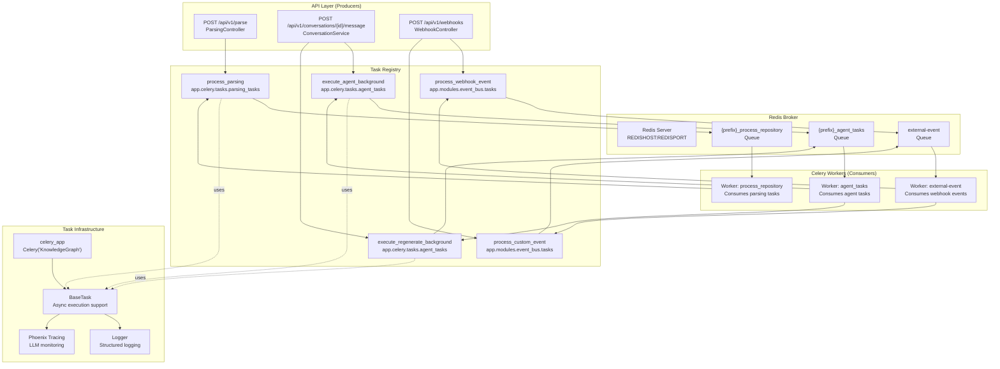
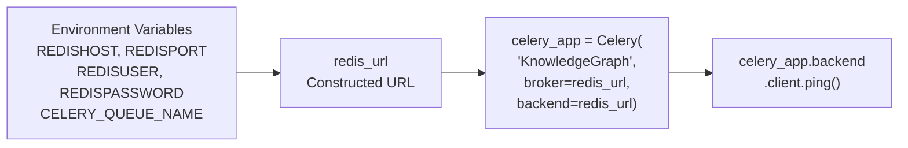
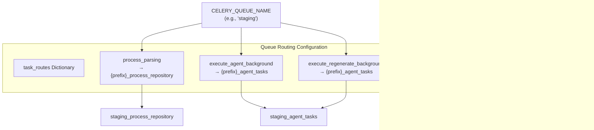
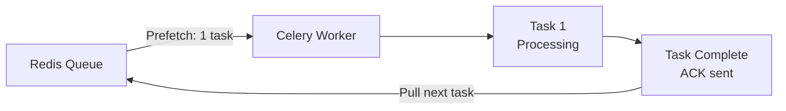
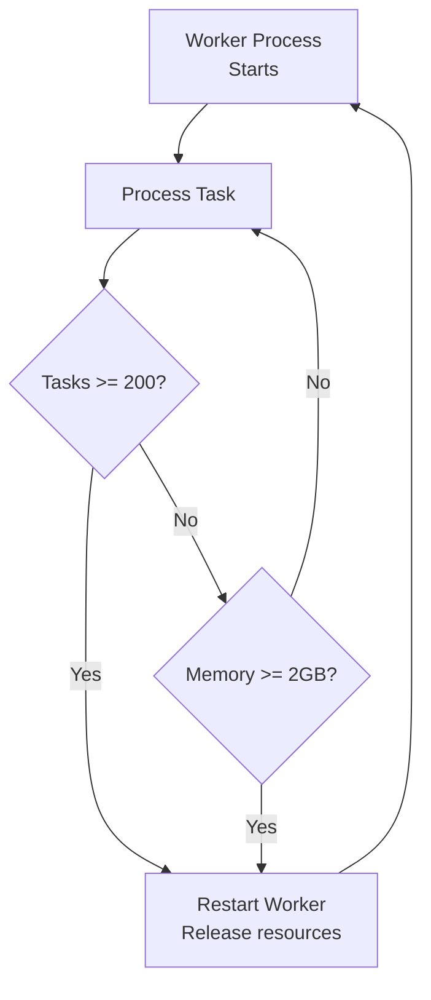
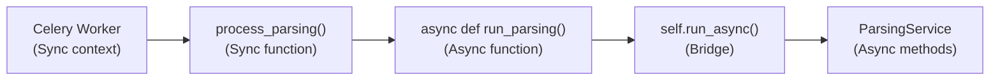
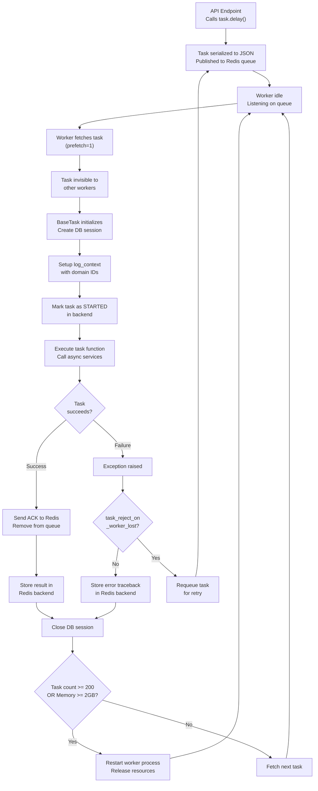

9.1-Celery Task System

# Page: Celery Task System

# Celery Task System

<details>
<summary>Relevant source files</summary>

The following files were used as context for generating this wiki page:

- [app/modules/conversations/conversation/conversation_controller.py](app/modules/conversations/conversation/conversation_controller.py)
- [app/modules/conversations/conversation/conversation_schema.py](app/modules/conversations/conversation/conversation_schema.py)
- [app/modules/conversations/conversation/conversation_service.py](app/modules/conversations/conversation/conversation_service.py)
- [app/modules/conversations/conversations_router.py](app/modules/conversations/conversations_router.py)

</details>


## Purpose and Scope

This document explains the Celery-based asynchronous task processing system that handles long-running operations in Potpie. The Celery task system enables repository parsing and AI agent execution to run in the background, preventing API request timeouts and allowing for scalable workload distribution.

For documentation on specific task implementations, see [Parsing Tasks](#9.2) and [Agent Background Execution](#9.3). For details on the Redis infrastructure used as the Celery broker, see [Redis Architecture](#10.3).

## System Architecture

The Celery task system follows a producer-consumer pattern where FastAPI endpoints act as producers, queueing tasks to Redis, and Celery workers act as consumers, processing tasks from specialized queues.



Sources: [app/celery/celery_app.py:1-144](), [app/celery/tasks/parsing_tasks.py:1-58]()

## Celery Application Configuration

### Initialization and Connection

The Celery application is initialized in `celery_app.py` with the name `"KnowledgeGraph"`. Both broker and backend use the same Redis instance configured via environment variables.



**Redis URL Construction** [app/celery/celery_app.py:17-28]():

| Environment Variable | Default | Purpose |
|---------------------|---------|---------|
| `REDISHOST` | `localhost` | Redis server hostname |
| `REDISPORT` | `6379` | Redis server port |
| `REDISUSER` | `""` | Redis username (optional) |
| `REDISPASSWORD` | `""` | Redis password (optional) |
| `CELERY_QUEUE_NAME` | `staging` | Queue prefix for task routing |

The system constructs authentication-aware Redis URLs and includes a `sanitize_redis_url()` function [app/celery/celery_app.py:31-58]() that masks credentials in logs to prevent credential exposure.

**Connection Validation** [app/celery/celery_app.py:63-71]():
- The system attempts a `ping()` to verify Redis connectivity at startup
- Connection failures are logged with sanitized URLs but do not prevent worker startup
- This allows workers to start even if Redis is temporarily unavailable

Sources: [app/celery/celery_app.py:17-71]()

### Task Routing Configuration

The `configure_celery()` function [app/celery/celery_app.py:74-114]() establishes queue-based task routing. Tasks are routed to specialized queues based on their fully qualified names.



**Queue Naming Strategy**:
- **Parsing tasks**: Use prefix-based queue name `{prefix}_process_repository` to isolate environments
- **Agent tasks**: Share queue `{prefix}_agent_tasks` for both execution and regeneration
- **Event tasks**: Use fixed queue name `external-event` without prefix for cross-environment webhooks

Sources: [app/celery/celery_app.py:83-100]()

### Serialization and Time Configuration

The system enforces JSON serialization for task payloads and results [app/celery/celery_app.py:76-80]():

```python
task_serializer="json"
accept_content=["json"]
result_serializer="json"
timezone="UTC"
enable_utc=True
```

This ensures:
- **Cross-language compatibility**: JSON is language-agnostic
- **Security**: Prevents pickle-based code injection attacks
- **Debuggability**: JSON payloads are human-readable in Redis
- **Timezone consistency**: All timestamps use UTC

Sources: [app/celery/celery_app.py:76-80]()

## Worker Optimization Settings

The Celery configuration includes sophisticated worker optimization to prevent resource exhaustion, ensure fair task distribution, and handle long-running operations.

### Task Acknowledgment and Prefetch



**Configuration** [app/celery/celery_app.py:102-104]():

| Setting | Value | Purpose |
|---------|-------|---------|
| `worker_prefetch_multiplier` | `1` | Worker fetches only 1 task at a time |
| `task_acks_late` | `True` | Acknowledge task only after completion |
| `task_track_started` | `True` | Track when task execution begins |

**Rationale**:
- **Prefetch = 1**: Prevents a single worker from hoarding tasks when multiple workers are available. Ensures fair distribution across workers.
- **Late acknowledgment**: If a worker crashes during task execution, the task is not lost—it remains in the queue for another worker to pick up.
- **Track started**: Enables monitoring of task execution vs. queueing time.

Sources: [app/celery/celery_app.py:102-104]()

### Time Limits and Visibility

**Task Time Limit** [app/celery/celery_app.py:105]():
```python
task_time_limit=5400  # 90 minutes in seconds
```

Parsing large repositories and executing complex multi-agent workflows can take significant time. The 90-minute limit provides a safety boundary while accommodating legitimate long-running tasks.

**Broker Visibility Timeout** [app/celery/celery_app.py:111-113]():
```python
broker_transport_options={
    "visibility_timeout": 5400  # 45 minutes
}
```

This defines how long a task remains invisible to other workers after being fetched. If a worker crashes without acknowledging, the task becomes visible again after 45 minutes.

Sources: [app/celery/celery_app.py:105-113]()

### Worker Lifecycle Management

The configuration implements automatic worker recycling to prevent resource leaks [app/celery/celery_app.py:107-110]():

| Setting | Value | Purpose |
|---------|-------|---------|
| `worker_max_tasks_per_child` | `200` | Restart worker process after 200 tasks |
| `worker_max_memory_per_child` | `2000000` KB | Restart worker if memory exceeds ~2GB |
| `task_default_rate_limit` | `"10/m"` | Limit each worker to 10 tasks per minute |
| `task_reject_on_worker_lost` | `True` | Requeue tasks if worker dies unexpectedly |

**Worker Recycling Strategy**:


This prevents memory leaks from accumulating across many task executions, particularly important for tasks that load large codebases into memory.

Sources: [app/celery/celery_app.py:107-110]()

## Task Infrastructure

### BaseTask Class

All Potpie tasks inherit from `BaseTask` (referenced in [app/celery/tasks/parsing_tasks.py:14]()), which provides:
- **Database session management**: Each task gets a fresh database session
- **Async execution support**: `run_async()` method for running async code within Celery tasks
- **Logging context**: Structured logging with task metadata

**Task Definition Pattern**:
```python
@celery_app.task(
    bind=True,
    base=BaseTask,
    name="app.celery.tasks.parsing_tasks.process_parsing"
)
def process_parsing(self, repo_details, user_id, user_email, project_id, cleanup_graph):
    # self is bound to task instance
    # self.db provides database session
    # self.run_async() runs async code
```

The `bind=True` parameter ensures the task instance is passed as `self`, enabling access to `BaseTask` methods.

Sources: [app/celery/tasks/parsing_tasks.py:12-15]()

### Async Execution Pattern

Celery tasks are synchronous by default, but Potpie's services use `async/await`. The `BaseTask` provides a `run_async()` method that bridges this gap [app/celery/tasks/parsing_tasks.py:51]():



**Implementation Example** [app/celery/tasks/parsing_tasks.py:31-51]():
```python
async def run_parsing():
    await parsing_service.parse_directory(...)

self.run_async(run_parsing())  # Execute async function in sync context
```

This pattern:
- Maintains a long-lived event loop in `BaseTask` for consistency
- Avoids event loop creation overhead on every task
- Enables clean async service method calls

Sources: [app/celery/tasks/parsing_tasks.py:31-51]()

### Logging Configuration

The Celery application disables Celery's default logging hijacking [app/celery/celery_app.py:82]() to preserve Potpie's structured logging:

```python
worker_hijack_root_logger=False
```

**Logging Setup** [app/celery/celery_app.py:8-15]():
1. Configure logging via `configure_logging()`
2. Create task-specific logger with `setup_logger(__name__)`
3. Use `log_context()` to add domain IDs to log entries

**Task Logging Pattern** [app/celery/tasks/parsing_tasks.py:26-27]():
```python
with log_context(project_id=project_id, user_id=user_id):
    logger.info("Task received: Starting parsing process")
```

This ensures all log entries within the context automatically include `project_id` and `user_id` fields for correlation.

Sources: [app/celery/celery_app.py:8-15,82](), [app/celery/tasks/parsing_tasks.py:7,26-27]()

## Monitoring and Tracing

### Phoenix Tracing Integration

The Celery workers initialize Phoenix tracing for LLM call monitoring [app/celery/celery_app.py:120-135]():

```mermaid
graph TB
    WorkerStartup["Celery Worker<br/>Startup"]
    SetupFunc["setup_phoenix_tracing()"]
    Initialize["initialize_phoenix_tracing()"]
    PhoenixServer["Phoenix Tracing Server<br/>LLM call tracking"]
    ContinueStartup["Worker starts<br/>processing tasks"]
    
    WorkerStartup --> SetupFunc
    SetupFunc --> Initialize
    Initialize -->|Success| PhoenixServer
    Initialize -->|Failure (non-fatal)| ContinueStartup
    PhoenixServer --> ContinueStartup
```

**Failure Handling**:
- Phoenix tracing failures are non-fatal and logged as warnings
- Workers continue startup even if tracing cannot be initialized
- This prevents tracing infrastructure issues from blocking task processing

Sources: [app/celery/celery_app.py:120-135]()

### Model Import and Registration

The Celery application imports all database models at startup [app/celery/celery_app.py:7]():

```python
from app.core.models import *  # Import and initialize all models
```

This ensures SQLAlchemy models are registered before any tasks execute, preventing "table not found" errors.

**Task Module Registration** [app/celery/celery_app.py:141-143]():
```python
import app.celery.tasks.parsing_tasks
import app.celery.tasks.agent_tasks
import app.modules.event_bus.tasks.event_tasks
```

Importing task modules ensures:
- Tasks are registered with Celery's task registry
- Task names are available for routing
- Task decorators execute and bind tasks to `celery_app`

Sources: [app/celery/celery_app.py:7,141-143]()

## Task Execution Lifecycle

The following diagram illustrates the complete lifecycle of a task from submission to completion:



**Key Lifecycle Stages**:

1. **Task Submission**: API endpoint calls `task.delay()` or `task.apply_async()`, serializing arguments to JSON
2. **Queue Storage**: Task stored in Redis with routing key determining target queue
3. **Worker Fetch**: Worker pulls task from queue (prefetch=1 ensures fair distribution)
4. **Initialization**: `BaseTask` creates database session and logging context
5. **Execution**: Task function executes, potentially running async services via `run_async()`
6. **Acknowledgment**: On success, worker sends ACK to remove task from queue
7. **Result Storage**: Task result or error stored in Redis backend for retrieval
8. **Cleanup**: Database session closed, worker checks recycling thresholds
9. **Recycling**: If thresholds exceeded, worker process restarts to prevent memory leaks

Sources: [app/celery/celery_app.py:74-114](), [app/celery/tasks/parsing_tasks.py:12-54]()

## Task Registration Summary

The Celery application currently registers five task types across three queues:

| Task Name | Queue | Module | Purpose |
|-----------|-------|--------|---------|
| `process_parsing` | `{prefix}_process_repository` | `app.celery.tasks.parsing_tasks` | Repository parsing and graph construction |
| `execute_agent_background` | `{prefix}_agent_tasks` | `app.celery.tasks.agent_tasks` | Background AI agent execution |
| `execute_regenerate_background` | `{prefix}_agent_tasks` | `app.celery.tasks.agent_tasks` | Regenerate AI responses in background |
| `process_webhook_event` | `external-event` | `app.modules.event_bus.tasks.event_tasks` | Process external webhook events |
| `process_custom_event` | `external-event` | `app.modules.event_bus.tasks.event_tasks` | Process custom event types |

Workers can be started with queue-specific routing to scale different workload types independently:

```bash
# Start worker for parsing tasks only
celery -A app.celery.celery_app worker --queues=staging_process_repository

# Start worker for agent tasks only
celery -A app.celery.celery_app worker --queues=staging_agent_tasks

# Start worker for all queues
celery -A app.celery.celery_app worker --queues=staging_process_repository,staging_agent_tasks,external-event
```

Sources: [app/celery/celery_app.py:83-100,141-143]()