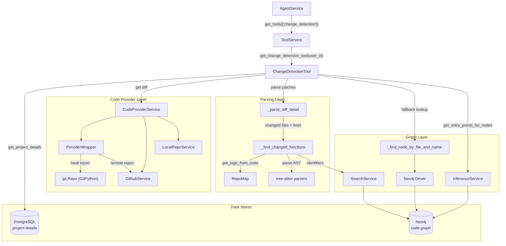
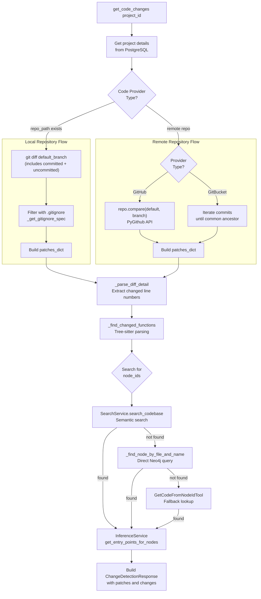
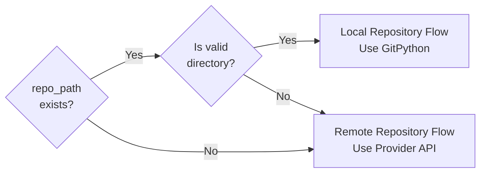
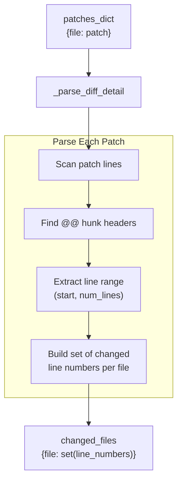
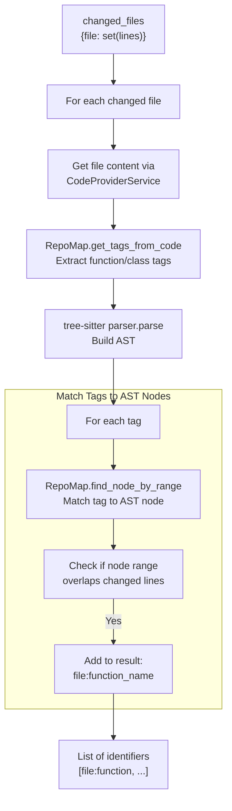
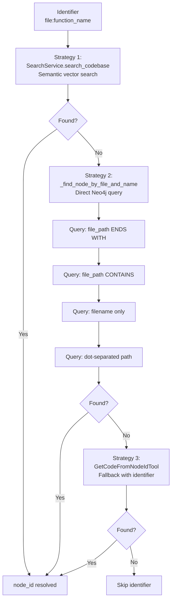
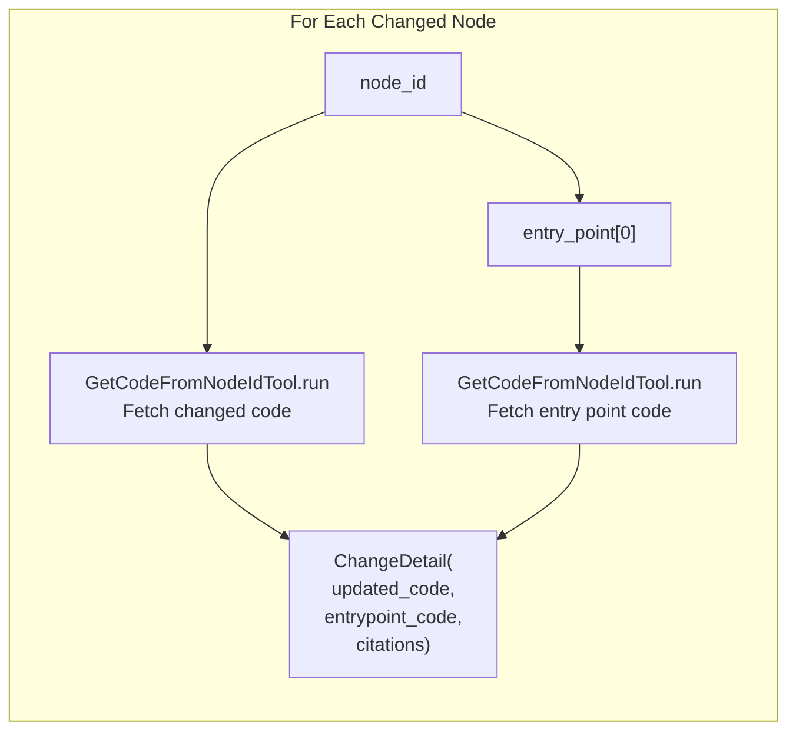
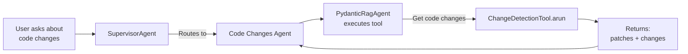

5.4-Change Detection Tool

# Page: Change Detection Tool

# Change Detection Tool

<details>
<summary>Relevant source files</summary>

The following files were used as context for generating this wiki page:

- [app/modules/intelligence/agents/chat_agents/pydantic_agent.py](app/modules/intelligence/agents/chat_agents/pydantic_agent.py)
- [app/modules/intelligence/agents/chat_agents/tool_helpers.py](app/modules/intelligence/agents/chat_agents/tool_helpers.py)
- [app/modules/intelligence/tools/change_detection/change_detection_tool.py](app/modules/intelligence/tools/change_detection/change_detection_tool.py)
- [app/modules/intelligence/tools/code_query_tools/code_analysis.py](app/modules/intelligence/tools/code_query_tools/code_analysis.py)
- [app/modules/intelligence/tools/code_query_tools/get_file_content_by_path.py](app/modules/intelligence/tools/code_query_tools/get_file_content_by_path.py)
- [app/modules/intelligence/tools/tool_service.py](app/modules/intelligence/tools/tool_service.py)

</details>


## Purpose and Scope

The Change Detection Tool analyzes git differences between branches to identify code changes at the function and class level. It goes beyond simple file-level diffs by parsing the changed code with tree-sitter to pinpoint exactly which functions, methods, and classes were modified, then uses the Neo4j knowledge graph to identify entry points and analyze the blast radius of changes.

This tool is used by AI agents (particularly the Code Changes Agent) to understand what code has been modified in a branch and which other parts of the codebase might be affected. For general code analysis and structure extraction, see [Code Analysis Tools](#5.3). For knowledge graph querying, see [Code Query Tools](#5.2).

**Sources:** [app/modules/intelligence/tools/change_detection/change_detection_tool.py:1-856]()

---

## Architecture Overview



**Sources:** [app/modules/intelligence/tools/change_detection/change_detection_tool.py:50-856](), [app/modules/intelligence/tools/tool_service.py:5-7,148]()

---

## Input and Output Schemas

### Input Schema

The tool accepts a single parameter via the `ChangeDetectionInput` Pydantic model:

| Parameter | Type | Description |
|-----------|------|-------------|
| `project_id` | `str` | UUID of the project being evaluated |

**Sources:** [app/modules/intelligence/tools/change_detection/change_detection_tool.py:29-33]()

### Output Schema

The tool returns a `ChangeDetectionResponse` containing:

| Field | Type | Description |
|-------|------|-------------|
| `patches` | `Dict[str, str]` | Dictionary mapping file paths to their git diff patches |
| `changes` | `List[ChangeDetail]` | List of structured change details for each modified function/class |

Each `ChangeDetail` contains:

| Field | Type | Description |
|-------|------|-------------|
| `updated_code` | `str` | The full code of the modified function/class |
| `entrypoint_code` | `str` | The code of the entry point that calls this function |
| `citations` | `List[str]` | File paths referenced (both modified and entry point files) |

For repositories with more than 50 changed files, the `patches` dictionary is reduced to just file names with line counts to avoid context length issues.

**Sources:** [app/modules/intelligence/tools/change_detection/change_detection_tool.py:35-48,797-814]()

---

## Change Detection Pipeline



**Sources:** [app/modules/intelligence/tools/change_detection/change_detection_tool.py:358-818]()

---

## Multi-Provider Support

The Change Detection Tool supports three different repository providers through intelligent provider detection and fallback mechanisms.

### Provider Detection Strategy



**Sources:** [app/modules/intelligence/tools/change_detection/change_detection_tool.py:396-547]()

### Local Repository Handling

For local repositories, the tool uses GitPython to access the git repository directly:

1. **Default Branch Detection**: Attempts to identify the default branch using `git symbolic-ref refs/remotes/origin/HEAD`, with fallbacks to `main`, `master`, or the active branch
2. **Diff Generation**: Executes `git diff <default_branch>` to capture all changes from the default branch (includes both committed changes on current branch AND uncommitted working directory changes)
3. **GitIgnore Filtering**: Uses the `pathspec` library to parse `.gitignore` and filter out ignored files from the diff results

```python
# From change_detection_tool.py:459-516
gitignore_spec = self._get_gitignore_spec(actual_repo_name)
diff_output = git_repo.git.diff(default_branch, unified=3)

# Parse diff output and filter with gitignore
if not gitignore_spec or not gitignore_spec.match_file(current_file):
    patches_dict[current_file] = "\n".join(current_patch)
```

**Sources:** [app/modules/intelligence/tools/change_detection/change_detection_tool.py:429-516,182-208]()

### Remote Repository Providers

#### GitHub (PyGithub)

For GitHub repositories, the tool uses the PyGithub library's `compare` API:

```python
# From change_detection_tool.py:639-651
repo = github.get_repo(actual_repo_name)
default_branch = repo.default_branch
git_diff = repo.compare(default_branch, branch_name)
patches_dict = {
    file.filename: file.patch
    for file in git_diff.files
    if file.patch
}
```

**Sources:** [app/modules/intelligence/tools/change_detection/change_detection_tool.py:548-651]()

#### GitBucket

GitBucket doesn't support the `compare` API, so the tool iterates through commits:

```python
# From change_detection_tool.py:577-637
commits = repo.get_commits(sha=branch_name)
for commit in commits:
    # Check if commit is on default branch
    if commit.sha in default_commit_shas:
        break
    
    # Add patches from this commit
    for file in commit.files:
        if file.patch and file.filename not in patches_dict:
            patches_dict[file.filename] = file.patch
```

Limits iteration to 50 commits to prevent excessive API calls.

**Sources:** [app/modules/intelligence/tools/change_detection/change_detection_tool.py:577-637]()

---

## Function-Level Change Identification

The tool uses tree-sitter parsing to identify which specific functions and classes contain the changed lines, going beyond simple file-level diff reporting.

### Diff Parsing Algorithm



The `_parse_diff_detail` method extracts line ranges from git diff hunk headers:

```python
# From change_detection_tool.py:210-227
for line in lines:
    if line.startswith("@@"):
        parts = line.split()
        add_start_line, add_num_lines = (
            map(int, parts[2][1:].split(","))
            if "," in parts[2]
            else (int(parts[2][1:]), 1)
        )
        for i in range(add_start_line, add_start_line + add_num_lines):
            changed_files[current_file].add(i)
```

**Sources:** [app/modules/intelligence/tools/change_detection/change_detection_tool.py:210-227]()

### Tree-Sitter Function Detection

Once changed line numbers are identified, the tool uses tree-sitter to find which functions/classes contain those lines:



**Sources:** [app/modules/intelligence/tools/change_detection/change_detection_tool.py:229-297]()

The function uses `RepoMap.get_tags_from_code` to extract semantic tags (functions, classes, methods) and then checks if the AST node's line range overlaps with any changed lines:

```python
# From change_detection_tool.py:290-294
for node_name, node in nodes.items():
    start_line = node.start_point[0]
    end_line = node.end_point[0]
    if any(start_line < line < end_line for line in lines):
        result.append(node_name)
```

**Sources:** [app/modules/intelligence/tools/change_detection/change_detection_tool.py:262-297]()

---

## Node Resolution and Neo4j Queries

After identifying changed functions by file path and name, the tool must resolve these to Neo4j `node_id` values for entry point analysis.

### Multi-Strategy Node Search



**Sources:** [app/modules/intelligence/tools/change_detection/change_detection_tool.py:676-721]()

### Direct Neo4j Query Strategies

The `_find_node_by_file_and_name` method implements four increasingly permissive query strategies:

| Strategy | Cypher Query | Use Case |
|----------|--------------|----------|
| 1. Ends With | `WHERE n.file_path ENDS WITH $file_path` | Handles full or relative paths |
| 2. Contains | `WHERE n.file_path CONTAINS $file_path` | Handles both relative and full paths |
| 3. Filename Only | `WHERE n.file_path ENDS WITH $filename` | Matches just the filename component |
| 4. Dot-Separated | `WHERE n.file_path ENDS WITH $dot_path` | Handles dot-separated format (.tests.test_sdk.py) |

Each query also filters by `repoId`, `name` (function name), and node type (`FUNCTION OR CLASS`).

**Sources:** [app/modules/intelligence/tools/change_detection/change_detection_tool.py:76-180]()

Example query structure:

```cypher
MATCH (n:NODE {repoId: $project_id})
WHERE n.file_path ENDS WITH $file_path
AND n.name = $function_name
AND (n:FUNCTION OR n:CLASS)
RETURN n.node_id AS node_id, n.file_path AS file_path, n.name AS name
LIMIT 5
```

**Sources:** [app/modules/intelligence/tools/change_detection/change_detection_tool.py:97-103]()

---

## Entry Point Analysis and Blast Radius

Once changed functions are identified by their `node_id`, the tool uses the Neo4j knowledge graph to find their entry points—functions that are not called by any other function and thus represent the top of the call chain.

### Entry Point Identification

The `InferenceService.get_entry_points_for_nodes` method performs graph traversal to find entry points:

```python
# From change_detection_tool.py:752-755
entry_points = InferenceService(
    self.sql_db, "dummy"
).get_entry_points_for_nodes(node_ids, project_id)
```

This returns a dictionary mapping each changed `node_id` to a list of entry point `node_id` values.

**Sources:** [app/modules/intelligence/tools/change_detection/change_detection_tool.py:752-755]()

### Building Change Details

For each changed node and its entry point, the tool retrieves the full code content:



**Sources:** [app/modules/intelligence/tools/change_detection/change_detection_tool.py:757-795]()

Example `ChangeDetail` construction:

```python
# From change_detection_tool.py:786-795
changes_list.append(
    ChangeDetail(
        updated_code=node_code_dict[node]["code_content"],
        entrypoint_code=entry_point_code["code_content"],
        citations=[
            node_code_dict[node]["file_path"],
            entry_point_code["file_path"],
        ],
    )
)
```

**Sources:** [app/modules/intelligence/tools/change_detection/change_detection_tool.py:786-795]()

---

## Tool Registration and Integration

The Change Detection Tool is registered in the `ToolService` as part of the agent tool ecosystem.

### Registration in ToolService

```python
# From tool_service.py:5-7, 148
from app.modules.intelligence.tools.change_detection.change_detection_tool import (
    get_change_detection_tool,
)

# In ToolService._initialize_tools():
"change_detection": get_change_detection_tool(self.user_id),
```

**Sources:** [app/modules/intelligence/tools/tool_service.py:5-7,148]()

### Tool Factory Function

The `get_change_detection_tool` function creates a LangChain `StructuredTool`:

```python
# From change_detection_tool.py:838-856
def get_change_detection_tool(user_id: str) -> StructuredTool:
    change_detection_tool = ChangeDetectionTool(next(get_db()), user_id)
    return StructuredTool.from_function(
        coroutine=change_detection_tool.arun,
        func=change_detection_tool.run,
        name="Get code changes",
        description="""
            Get the changes in the codebase.
            This tool analyzes the differences between branches in a Git repository 
            and retrieves updated function details, including their entry points and citations.
            Inputs for the get_code_changes method:
            - project_id (str): The ID of the project being evaluated, this is a UUID.
            The output includes a dictionary of file patches and a list of changes 
            with updated code and entry point code.
            """,
        args_schema=ChangeDetectionInput,
    )
```

**Sources:** [app/modules/intelligence/tools/change_detection/change_detection_tool.py:838-856]()

### User-Friendly Messaging

The tool has custom user-facing messages defined in `tool_helpers.py`:

| Event | Message |
|-------|---------|
| Tool Call | "Fetching code changes from your repo" |
| Tool Response | "Code changes fetched successfully" |
| Tool Call Details | Empty (no additional details shown) |
| Tool Result | "successfull" |

**Sources:** [app/modules/intelligence/agents/chat_agents/tool_helpers.py:38-39,264-265,574-575,843-844]()

---

## Usage in Agent Workflows

The Change Detection Tool is primarily used by the Code Changes Agent and other agents that need to understand the scope of modifications in a branch.

### Typical Invocation Pattern

```python
# Agent invokes the tool via PydanticRagAgent
{
    "project_id": "550e8400-e29b-41d4-a716-446655440000"
}
```

The tool is accessed through the standard agent tool execution flow:



**Sources:** [app/modules/intelligence/agents/chat_agents/pydantic_agent.py:126-133](), [app/modules/intelligence/tools/change_detection/change_detection_tool.py:831-835]()

### Response Streaming

When the tool executes, status messages are streamed to the user via the `FunctionToolCallEvent` and `FunctionToolResultEvent` mechanisms:

```python
# From pydantic_agent.py:660-681
if isinstance(event, FunctionToolCallEvent):
    tool_args = event.part.args_as_dict()
    yield ChatAgentResponse(
        response="",
        tool_calls=[
            ToolCallResponse(
                call_id=event.part.tool_call_id or "",
                event_type=ToolCallEventType.CALL,
                tool_name=event.part.tool_name,
                tool_response=get_tool_run_message(
                    event.part.tool_name, tool_args
                ),
                # ... details
            )
        ],
        citations=[],
    )
```

**Sources:** [app/modules/intelligence/agents/chat_agents/pydantic_agent.py:660-681,682-706]()

---

## Performance Optimizations and Limits

### Large Repository Handling

For repositories with many changes (> 50 files), the tool truncates patch details to prevent context overflow:

```python
# From change_detection_tool.py:799-810
if len(patches_dict) > 50:
    logger.warning(
        f"[CHANGE_DETECTION] Too many patches ({len(patches_dict)}), returning file names only"
    )
    patches_summary = {
        filename: f"Changed ({len(patch.splitlines())} lines)"
        for filename, patch in patches_dict.items()
    }
    result = ChangeDetectionResponse(
        patches=patches_summary, changes=changes_list
    )
```

**Sources:** [app/modules/intelligence/tools/change_detection/change_detection_tool.py:799-810]()

### GitBucket Commit Limits

When using the GitBucket provider's commit iteration strategy, the tool limits processing to 50 commits:

```python
# From change_detection_tool.py:623-627
if commit_count >= 50:
    logger.warning(
        "[CHANGE_DETECTION] Reached commit limit of 50, stopping"
    )
    break
```

**Sources:** [app/modules/intelligence/tools/change_detection/change_detection_tool.py:623-627]()

### Error Handling and Validation

The tool includes extensive error handling at each stage:

| Check | Validation | Error Message |
|-------|-----------|---------------|
| Project Ownership | `project_details["user_id"] != self.user_id` | `"Project id {project_id} not found for user {self.user_id}"` |
| Node Code Retrieval | `"error" in node_code` | Warning logged, node skipped |
| Entry Point Code | `"error" in entry_point_code` | Warning logged, entry point skipped |
| Required Fields | Missing `code_content` or `file_path` | Warning logged, node skipped |

**Sources:** [app/modules/intelligence/tools/change_detection/change_detection_tool.py:374-380,730-746,770-784]()

---

## Dependencies and External Services

### Required Services

| Service | Purpose | Usage |
|---------|---------|-------|
| PostgreSQL | Project metadata storage | Project details lookup via `ProjectService` |
| Neo4j | Code knowledge graph | Node resolution, entry point analysis via `InferenceService` |
| Git/GitHub API | Repository access | Diff generation via `CodeProviderService` |

### Python Libraries

| Library | Purpose | Key Usage |
|---------|---------|-----------|
| `tree-sitter-language-pack` | Multi-language parsing | `get_parser(language.name)` for AST parsing |
| `GitPython` (git) | Local git operations | `git_repo.git.diff(default_branch)` |
| `PyGithub` | GitHub API access | `repo.compare(default_branch, branch_name)` |
| `pathspec` | Gitignore pattern matching | `PathSpec.from_lines()` for filtering |
| `neo4j` | Graph database driver | Direct Cypher queries for node resolution |

**Sources:** [app/modules/intelligence/tools/change_detection/change_detection_tool.py:10-26]()