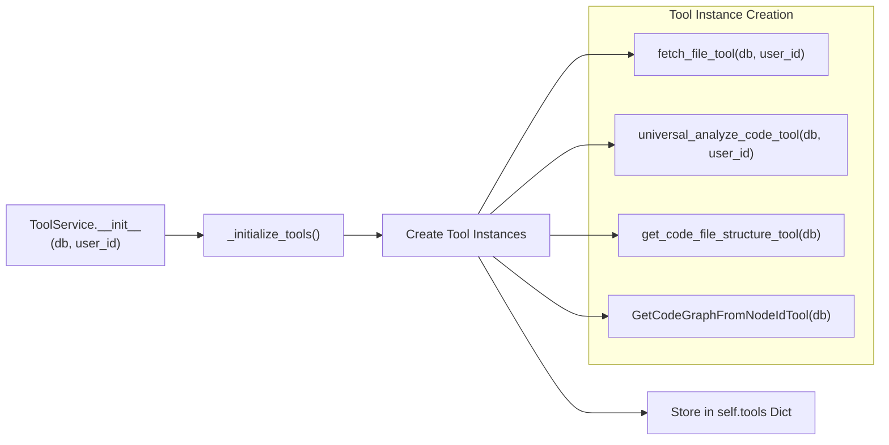
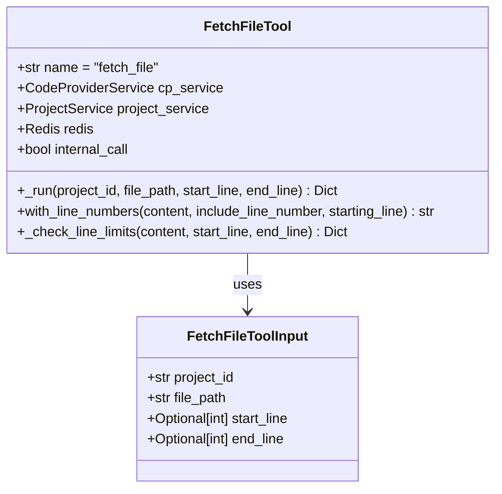
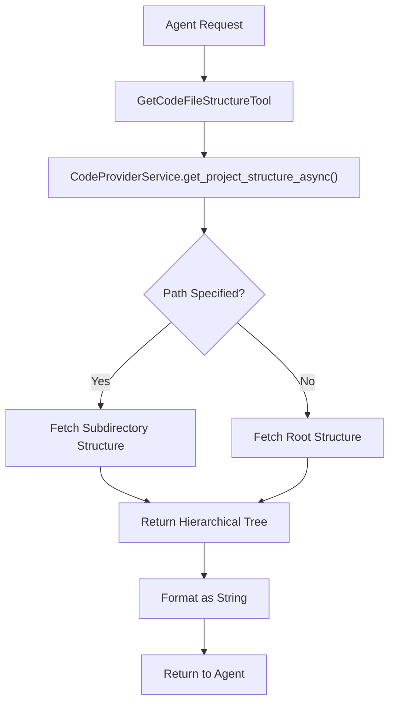
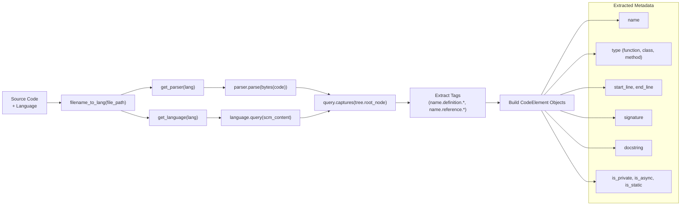
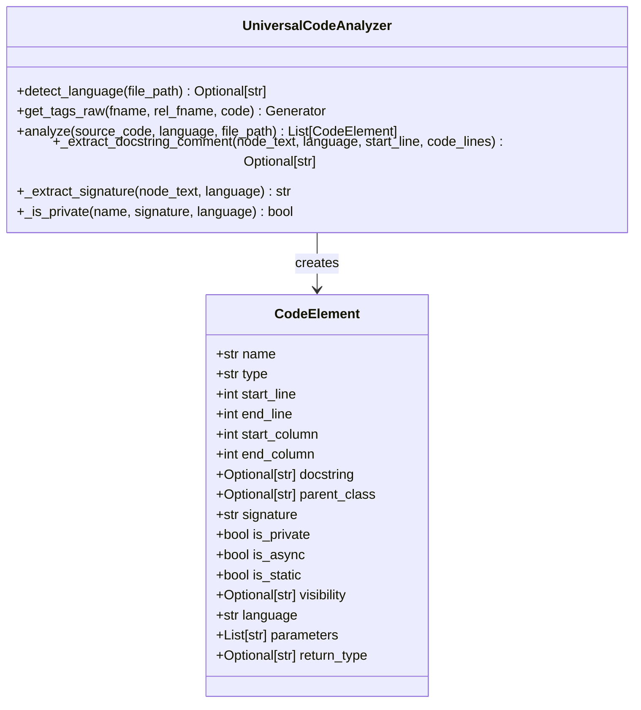
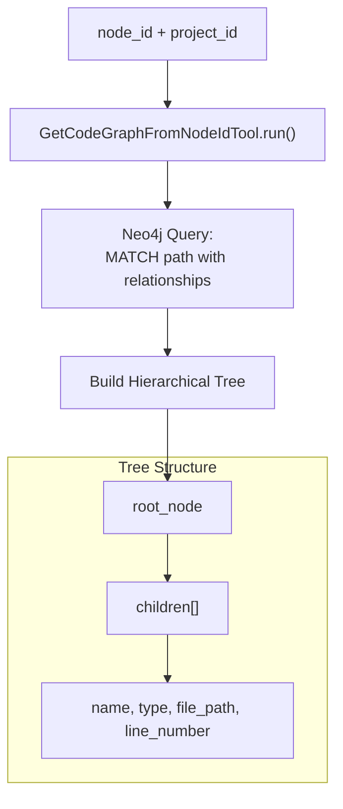
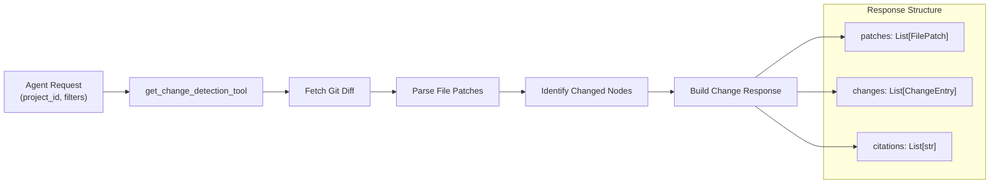
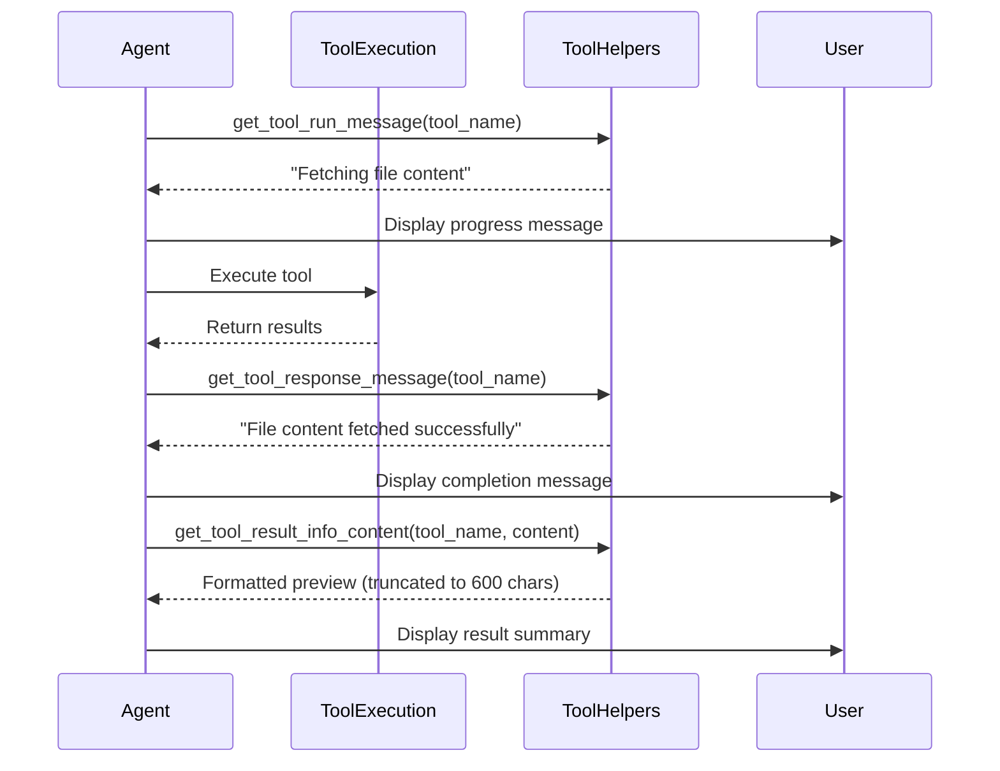
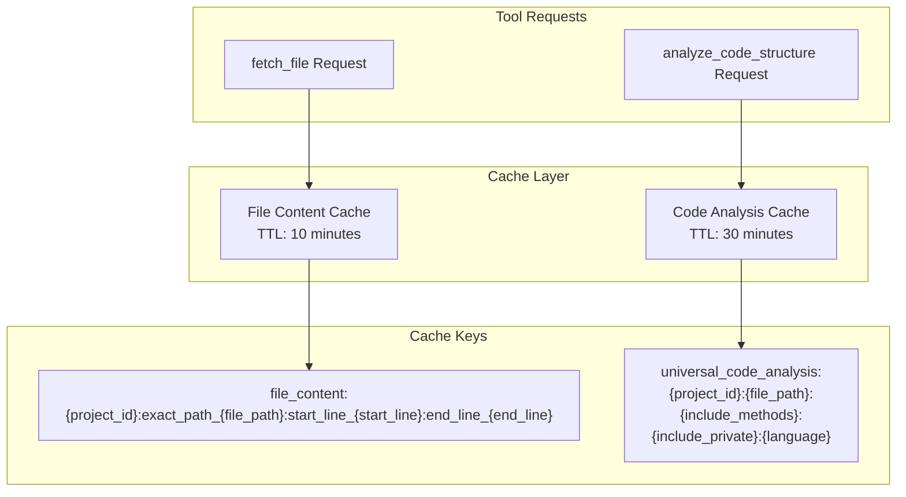

5.3-Code Analysis Tools

# Page: Code Analysis Tools

# Code Analysis Tools

<details>
<summary>Relevant source files</summary>

The following files were used as context for generating this wiki page:

- [app/modules/intelligence/agents/chat_agents/pydantic_agent.py](app/modules/intelligence/agents/chat_agents/pydantic_agent.py)
- [app/modules/intelligence/agents/chat_agents/tool_helpers.py](app/modules/intelligence/agents/chat_agents/tool_helpers.py)
- [app/modules/intelligence/tools/change_detection/change_detection_tool.py](app/modules/intelligence/tools/change_detection/change_detection_tool.py)
- [app/modules/intelligence/tools/code_query_tools/code_analysis.py](app/modules/intelligence/tools/code_query_tools/code_analysis.py)
- [app/modules/intelligence/tools/code_query_tools/get_file_content_by_path.py](app/modules/intelligence/tools/code_query_tools/get_file_content_by_path.py)
- [app/modules/intelligence/tools/tool_service.py](app/modules/intelligence/tools/tool_service.py)

</details>


This document details the code query tools that provide direct file system access and static code analysis capabilities. Unlike Knowledge Graph Tools (see page 5.2) which query the Neo4j graph database, code analysis tools work directly with repository files to fetch content, analyze structure, and track changes.

## Overview

Code analysis tools provide six primary capabilities:

1. **File Content Retrieval** - Direct file access with line range support (`fetch_file`)
2. **Directory Structure** - Hierarchical file organization (`get_code_file_structure`)
3. **Static Code Parsing** - Tree-sitter based structure extraction (`analyze_code_structure`)
4. **Code Graph Visualization** - Node relationship trees (`get_code_graph_from_node_id`)
5. **Neighbor Analysis** - Referenced and referencing code (`get_node_neighbours_from_node_id`)
6. **Change Detection** - Repository diff analysis (`change_detection`)

All code analysis tools are registered in `ToolService` and exposed to agents through the LangChain `StructuredTool` interface. The `ToolService` manages tool initialization, access control, and execution.

**System Architecture: Code Analysis Tools Data Flow**

```mermaid
graph TB
    subgraph "System Agents"
        QnAAgent["QnAAgent"]
        DebugAgent["DebugAgent"] 
        CodeGenAgent["CodeGenAgent"]
        UnitTestAgent["UnitTestAgent"]
        IntegrationTestAgent["IntegrationTestAgent"]
        LLDAgent["LowLevelDesignAgent"]
        BlastRadiusAgent["BlastRadiusAgent"]
    end
    
    subgraph "ToolService"
        ToolService["ToolService<br/>_initialize_tools()"]
        GetTools["get_tools(tool_names)"]
    end
    
    subgraph "Code Analysis Tools"
        FetchFile["fetch_file_tool"]
        AnalyzeCode["universal_analyze_code_tool"]
        FileStructure["get_code_file_structure_tool"]
        CodeGraph["get_code_graph_from_node_id_tool"]
        NodeNeighbours["get_node_neighbours_from_node_id_tool"]
        ChangeDetection["get_change_detection_tool"]
    end
    
    subgraph "Data Sources"
        CodeProviderService["CodeProviderService<br/>get_file_content()"]
        Neo4jGraph["Neo4j<br/>Knowledge Graph"]
        FileSystem["PROJECT_PATH<br/>Repository Files"]
        Redis["Redis<br/>Cache Layer"]
    end
    
    QnAAgent --> GetTools
    DebugAgent --> GetTools
    CodeGenAgent --> GetTools
    UnitTestAgent --> GetTools
    
    GetTools --> ToolService
    ToolService --> FetchFile
    ToolService --> AnalyzeCode
    ToolService --> FileStructure
    ToolService --> CodeGraph
    ToolService --> NodeNeighbours
    ToolService --> ChangeDetection
    
    FetchFile --> CodeProviderService
    AnalyzeCode --> CodeProviderService
    FileStructure --> CodeProviderService
    CodeGraph --> Neo4jGraph
    NodeNeighbours --> Neo4jGraph
    
    CodeProviderService --> FileSystem
    CodeProviderService --> Redis
    FetchFile --> Redis
    AnalyzeCode --> Redis
```

Sources: [app/modules/intelligence/tools/tool_service.py:59-122](), [app/modules/intelligence/agents/chat_agents/system_agents/qna_agent.py:45-60](), [app/modules/intelligence/agents/chat_agents/system_agents/debug_agent.py:45-60]()

## Tool Registration in ToolService

The `ToolService` class manages all tool instances and provides a unified interface for agents to access tools. Tools are initialized once per service instance and cached in a dictionary.

**ToolService Initialization Pattern**



Sources: [app/modules/intelligence/tools/tool_service.py:59-122]()

### Tool Registration Table

| Tool Name | Factory Function | Key Dependencies | Line Reference |
|-----------|-----------------|------------------|----------------|
| `fetch_file` | `fetch_file_tool()` | `CodeProviderService`, `ProjectService`, `Redis` | [tool_service.py:107]() |
| `analyze_code_structure` | `universal_analyze_code_tool()` | `UniversalCodeAnalyzer`, `CodeProviderService` | [tool_service.py:108-110]() |
| `get_code_file_structure` | `get_code_file_structure_tool()` | `CodeProviderService` | [tool_service.py:97]() |
| `get_code_graph_from_node_id` | `GetCodeGraphFromNodeIdTool()` | Neo4j connection | [tool_service.py:95]() |
| `get_node_neighbours_from_node_id` | `get_node_neighbours_from_node_id_tool()` | Neo4j connection | [tool_service.py:98-100]() |
| `change_detection` | `get_change_detection_tool()` | `user_id` | [tool_service.py:96]() |

Sources: [app/modules/intelligence/tools/tool_service.py:82-111]()

## File Content Tools

### fetch_file Tool

The `FetchFileTool` provides direct file system access to repository contents with line-range support and caching. This is the primary tool for agents to read source code files.

### Core Functionality

| Feature | Description | Implementation |
|---------|-------------|----------------|
| **Line Range Support** | Fetch specific line ranges from files | `start_line` and `end_line` parameters |
| **Line Limit Protection** | Maximum 1200 lines per request | [get_file_content_by_path.py:102-134]() |
| **Caching** | 10-minute Redis cache for performance | [get_file_content_by_path.py:146-166]() |
| **Line Numbering** | Optional line number formatting | [get_file_content_by_path.py:91-100]() |

### Tool Schema



Sources: [app/modules/intelligence/tools/code_query_tools/get_file_content_by_path.py:12-21](), [app/modules/intelligence/tools/code_query_tools/get_file_content_by_path.py:23-80]()

### Usage Examples

The tool accepts requests in the following format:

```json
{
  "project_id": "550e8400-e29b-41d4-a716-446655440000",
  "file_path": "src/main.py",
  "start_line": 1,
  "end_line": 50
}
```

Response format includes success status and formatted content:

```json
{
  "success": true,
  "content": "1:def hello_world():\n2:    print('Hello, world!')\n3:\n4:hello_world()"
}
```

Sources: [app/modules/intelligence/tools/code_query_tools/get_file_content_by_path.py:47-68]()

## File Structure Analysis Tool

The `GetCodeFileStructureTool` provides hierarchical directory listings for repositories, enabling agents to understand project organization and locate relevant files.

### Implementation Details



Sources: [app/modules/intelligence/tools/code_query_tools/get_code_file_structure.py:32-47]()

### get_code_file_structure Tool

The `GetCodeFileStructureTool` retrieves hierarchical directory structures for repositories, allowing agents to understand project organization and locate files.

**Tool Interface**

| Method | Purpose | Implementation |
|--------|---------|----------------|
| `arun()` | Async execution for non-blocking operations | [get_code_file_structure.py:37-41]() |
| `run()` | Sync execution using `asyncio.run()` | [get_code_file_structure.py:43-47]() |
| `fetch_repo_structure()` | Core structure retrieval logic | [get_code_file_structure.py:32-35]() |

The tool calls `CodeProviderService.get_project_structure_async()` to retrieve cached directory trees from Redis, falling back to file system scanning if cache misses occur.

Sources: [app/modules/intelligence/tools/code_query_tools/get_code_file_structure.py:16-48]()

## Code Structure Analysis

### analyze_code_structure Tool

The `UniversalAnalyzeCodeTool` performs static analysis on source files using Tree-sitter parsers. It extracts functions, classes, methods, interfaces, and other code constructs with detailed metadata including line numbers, signatures, and docstrings.

**Tree-sitter Analysis Pipeline**



**Supported Languages**: Python, JavaScript, TypeScript, Java, C++, C, Rust, Go, PHP, Ruby (via `tree_sitter_languages` and `grep_ast`)

Sources: [app/modules/intelligence/tools/code_query_tools/code_analysis.py:83-131](), [app/modules/intelligence/tools/code_query_tools/code_analysis.py:327-412]()

### Code Element Extraction

The tool extracts comprehensive metadata for each code element:



Sources: [app/modules/intelligence/tools/code_query_tools/code_analysis.py:45-62](), [app/modules/intelligence/tools/code_query_tools/code_analysis.py:64-413]()

### Analysis Results Structure

The tool returns structured analysis results with comprehensive summaries:

| Field | Type | Description |
|-------|------|-------------|
| `success` | boolean | Whether analysis completed successfully |
| `file_path` | string | Path to analyzed file |
| `language` | string | Detected programming language |
| `total_elements` | integer | Count of extracted code elements |
| `elements` | array | Detailed list of `CodeElement` objects |
| `summary` | object | Breakdown by element type and attributes |

The summary object provides counts for:
- Classes, functions, methods, interfaces, structs, enums
- Private elements, async functions, static functions

Sources: [app/modules/intelligence/tools/code_query_tools/code_analysis.py:514-539]()

## Graph-Based Code Tools

These tools query the Neo4j knowledge graph to retrieve code with relationship context.

### get_code_graph_from_node_id Tool

The `GetCodeGraphFromNodeIdTool` constructs a hierarchical tree representation of code relationships starting from a specific node. It traverses `CALLS`, `IMPORTS`, and `CONTAINS` edges to build a complete dependency graph.

**Tool Implementation**



Sources: [app/modules/intelligence/tools/code_query_tools/get_code_graph_from_node_id_tool.py:15-18]()

### get_node_neighbours_from_node_id Tool

Retrieves nodes that reference the target node (incoming edges) and nodes referenced by the target node (outgoing edges). This helps agents understand code dependencies and usage patterns.

Sources: [app/modules/intelligence/tools/code_query_tools/get_node_neighbours_from_node_id_tool.py:19-21]()

### intelligent_code_graph Tool

An LLM-powered tool that intelligently selects relevant code graph nodes based on natural language queries. It combines knowledge graph traversal with LLM reasoning to identify the most relevant code snippets.

Sources: [app/modules/intelligence/tools/code_query_tools/intelligent_code_graph_tool.py:22-24]()

## Change Detection Tool

### change_detection Tool

The `get_change_detection_tool` analyzes repository changes by comparing commits, branches, or working directory states. It returns structured diff information including file patches and affected code elements.

**Change Detection Workflow**



Sources: [app/modules/intelligence/tools/change_detection/change_detection_tool.py:5-7]()

## Tool Usage by Agents

Different agent types use specific subsets of code analysis tools based on their responsibilities.

**Agent Tool Selection Matrix**

| Agent Type | Code Analysis Tools Used |
|------------|-------------------------|
| **QnAAgent** | `fetch_file`, `analyze_code_structure`, `get_code_file_structure` |
| **DebugAgent** | `fetch_file`, `analyze_code_structure`, `get_code_file_structure` |
| **CodeGenAgent** | `fetch_file`, `analyze_code_structure`, `get_code_file_structure` |
| **UnitTestAgent** | `fetch_file`, `analyze_code_structure` |
| **IntegrationTestAgent** | `fetch_file`, `analyze_code_structure` |
| **LowLevelDesignAgent** | `fetch_file`, `analyze_code_structure`, `get_code_file_structure` |
| **BlastRadiusAgent** | `fetch_file`, `analyze_code_structure`, `change_detection` |

Sources: [app/modules/intelligence/agents/chat_agents/system_agents/qna_agent.py:45-60](), [app/modules/intelligence/agents/chat_agents/system_agents/debug_agent.py:45-60](), [app/modules/intelligence/agents/chat_agents/system_agents/code_gen_agent.py:52-67](), [app/modules/intelligence/agents/chat_agents/system_agents/unit_test_agent.py:40-50](), [app/modules/intelligence/agents/chat_agents/system_agents/integration_test_agent.py:46-56](), [app/modules/intelligence/agents/chat_agents/system_agents/low_level_design_agent.py:41-56](), [app/modules/intelligence/agents/chat_agents/system_agents/blast_radius_agent.py:37-49]()

## Tool Messaging and User Feedback

The `tool_helpers` module provides standardized user-facing messages for tool execution. This creates a consistent user experience across all agents by displaying progress indicators and result summaries during tool execution.

**Message Generation Flow**



Sources: [app/modules/intelligence/agents/chat_agents/tool_helpers.py:4-108]()

**Message Mappings for Code Analysis Tools**

| Tool Name | Run Message | Response Message | Result Preview |
|-----------|-------------|------------------|----------------|
| `fetch_file` | "Fetching file content" | "File content fetched successfully" | Code snippet (600 char limit) |
| `get_code_file_structure` | "Loading the dir structure" | "Project file structure loaded successfully" | Directory tree (600 char limit) |
| `analyze_code_structure` | "Analyzing code structure" | "Code structure analyzed successfully" | Element list with types |

Sources: [app/modules/intelligence/agents/chat_agents/tool_helpers.py:26-27](), [app/modules/intelligence/agents/chat_agents/tool_helpers.py:56-59](), [app/modules/intelligence/agents/chat_agents/tool_helpers.py:30-31](), [app/modules/intelligence/agents/chat_agents/tool_helpers.py:58-59](), [app/modules/intelligence/agents/chat_agents/tool_helpers.py:100-108](), [app/modules/intelligence/agents/chat_agents/tool_helpers.py:201-209]()

## Caching and Performance Optimization

The code analysis tools implement comprehensive caching strategies to optimize performance for repeated operations.

### Caching Architecture



Sources: [app/modules/intelligence/tools/code_query_tools/get_file_content_by_path.py:146-183](), [app/modules/intelligence/tools/code_query_tools/code_analysis.py:478-544]()

### Performance Characteristics

| Tool | Cache Duration | Cache Key Factors | Performance Impact |
|------|----------------|-------------------|-------------------|
| `fetch_file` | 10 minutes | project_id, file_path, line_range | High - Avoids file system access |
| `analyze_code_structure` | 30 minutes | project_id, file_path, analysis_options, language | Very High - Avoids Tree-sitter parsing |
| `get_code_file_structure` | None | N/A | Moderate - Lightweight directory traversal |

Sources: [app/modules/intelligence/tools/code_query_tools/get_file_content_by_path.py:183](), [app/modules/intelligence/tools/code_query_tools/code_analysis.py:544]()