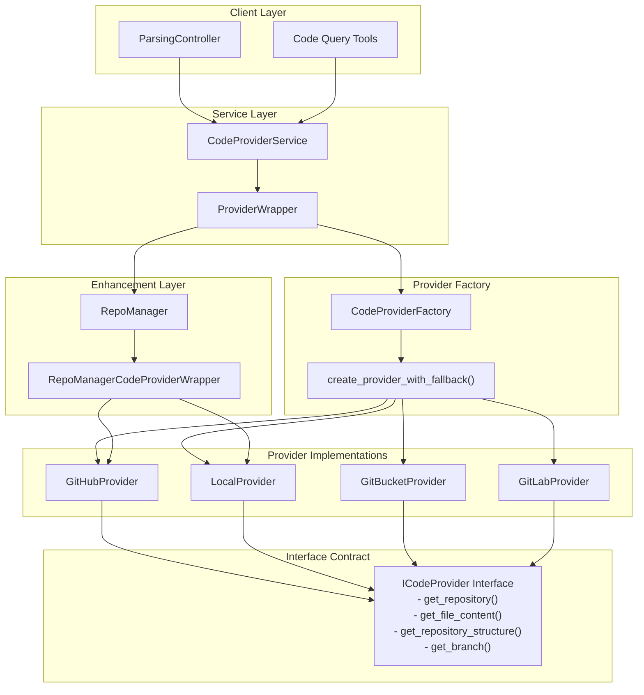
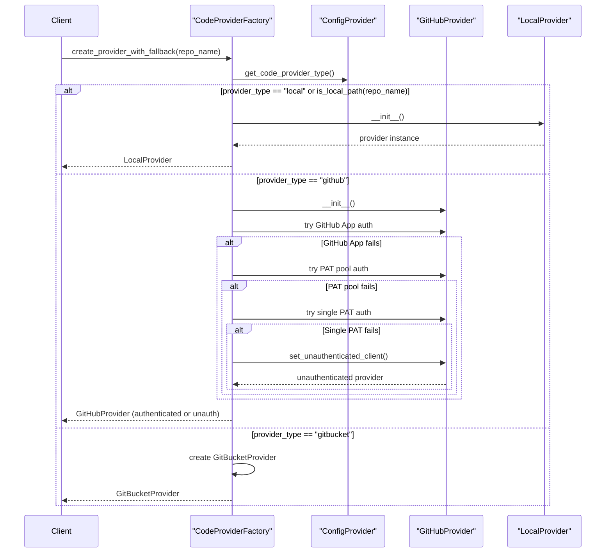
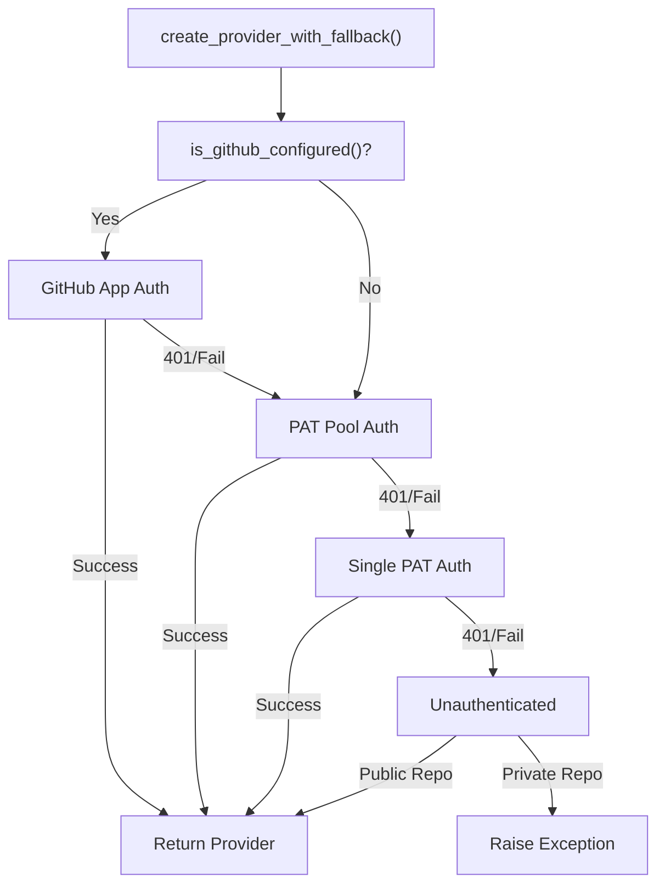
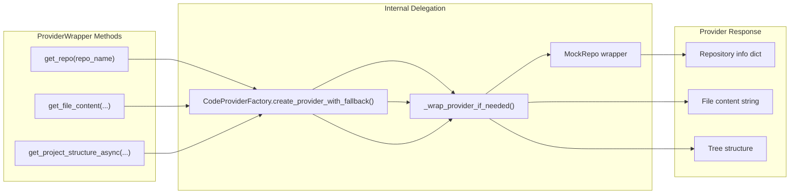
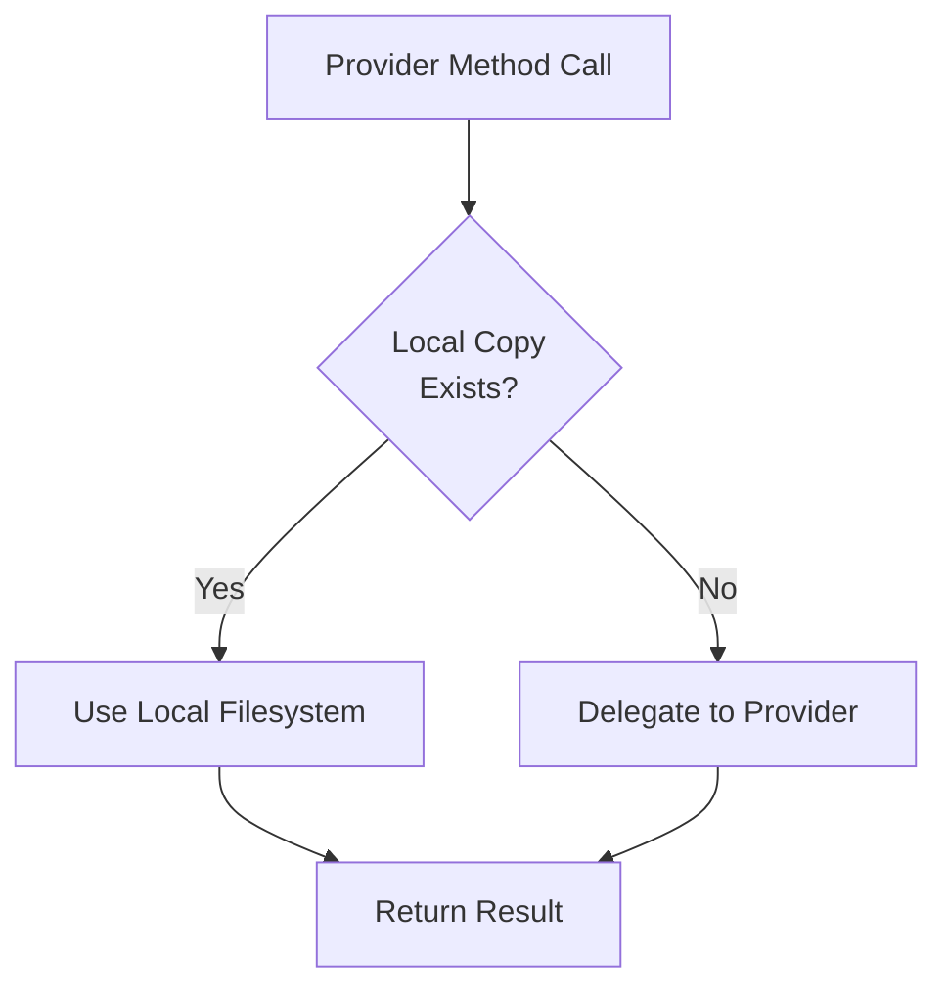
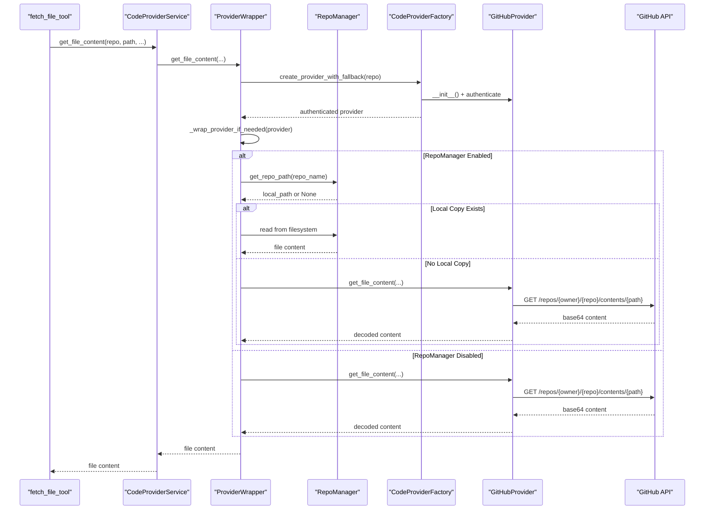

4.4-Code Provider System

# Page: Code Provider System

# Code Provider System

<details>
<summary>Relevant source files</summary>

The following files were used as context for generating this wiki page:

- [app/core/config_provider.py](app/core/config_provider.py)
- [app/modules/code_provider/code_provider_service.py](app/modules/code_provider/code_provider_service.py)
- [app/modules/code_provider/local_repo/local_repo_service.py](app/modules/code_provider/local_repo/local_repo_service.py)
- [app/modules/intelligence/tools/code_query_tools/get_code_file_structure.py](app/modules/intelligence/tools/code_query_tools/get_code_file_structure.py)
- [app/modules/parsing/graph_construction/parsing_controller.py](app/modules/parsing/graph_construction/parsing_controller.py)

</details>


## Purpose and Scope

The Code Provider System implements a multi-provider abstraction layer for accessing source code repositories from different platforms. It provides a unified interface for retrieving repository metadata, file contents, and directory structures from GitHub, GitBucket, GitLab, and local filesystems. The system includes sophisticated authentication fallback chains, local repository caching through RepoManager integration, and automatic provider detection.

For GitHub-specific authentication details (GitHub App, OAuth flows), see [GitHub Integration](#6.2). For higher-level repository access patterns and integration with other services, see [Multi-Provider Repository Access](#6.3).

---

## Architecture Overview

The Code Provider System is organized into three main layers:

1. **Provider Abstraction Layer**: `ICodeProvider` interface and factory pattern
2. **Provider Implementations**: Concrete providers for each supported platform
3. **Service Integration Layer**: Compatibility wrappers and service facade



**Sources:** [app/modules/code_provider/code_provider_service.py:1-467](), [app/modules/parsing/graph_construction/parsing_controller.py:14-24]()

---

## Provider Abstraction Layer

### ICodeProvider Interface

The `ICodeProvider` interface defines the contract that all code providers must implement. While not shown in the provided files, it is referenced extensively and defines these core methods:

| Method | Purpose | Returns |
|--------|---------|---------|
| `get_repository(repo_name)` | Fetch repository metadata | Repository info dict |
| `get_file_content(repo_name, file_path, ref, start_line, end_line)` | Retrieve file content with optional line range | String content |
| `get_repository_structure(repo_name, path, ref, max_depth)` | Get directory tree structure | Formatted tree structure |
| `get_branch(repo_name, branch_name)` | Fetch branch information | Branch metadata dict |
| `get_archive_link(repo_name, format_type, ref)` | Generate archive download URL | Download URL string |

**Sources:** [app/modules/code_provider/code_provider_service.py:14-141]()

### CodeProviderFactory

The `CodeProviderFactory` class implements factory pattern with sophisticated fallback logic. The primary entry point is `create_provider_with_fallback(repo_name)`, which:

1. Detects provider type from configuration or auto-detects from `repo_name`
2. Attempts authentication in order: GitHub App → PAT pool → single PAT → unauthenticated
3. Returns first successfully authenticated provider
4. Raises exception if all authentication methods fail



**Sources:** [app/modules/code_provider/code_provider_service.py:200-238]()

### Authentication Fallback Chain

For GitHub repositories, the system implements a multi-tier fallback chain to maximize reliability:

**Tier 1: GitHub App Authentication**
- Checks for `GITHUB_APP_ID` and `GITHUB_PRIVATE_KEY` in configuration
- Uses JWT-based authentication for enhanced security
- Highest rate limits (5,000 requests/hour per installation)

**Tier 2: PAT Pool Authentication**
- Reads `CODE_PROVIDER_TOKEN_POOL` environment variable (comma-separated tokens)
- Distributes requests across multiple Personal Access Tokens
- Mitigates rate limiting through token rotation

**Tier 3: Single PAT Authentication**
- Falls back to `CODE_PROVIDER_TOKEN` for simple single-token auth
- Standard rate limits (5,000 requests/hour)

**Tier 4: Unauthenticated Access**
- Last resort for public repositories only
- Lowest rate limits (60 requests/hour)
- Only triggered on 401 errors from configured authentication



**Sources:** [app/modules/code_provider/code_provider_service.py:200-229](), [app/core/config_provider.py:78-80]()

---

## Provider Implementations

### GitHubProvider

The `GitHubProvider` implements GitHub API access with multiple authentication strategies. Key features:

- Uses PyGithub library for API interactions
- Supports GitHub App, PAT, and unauthenticated modes
- Implements archive link generation for tarball/zipball downloads
- Handles branch information and commit SHA retrieval

**Configuration Environment Variables:**
- `GITHUB_APP_ID` - GitHub App installation ID
- `GITHUB_PRIVATE_KEY` - GitHub App private key (PEM format)
- `CODE_PROVIDER_TOKEN` - Single Personal Access Token
- `CODE_PROVIDER_TOKEN_POOL` - Comma-separated list of PATs

**Sources:** [app/modules/code_provider/code_provider_service.py:7-8](), [app/core/config_provider.py:28]()

### LocalProvider

The `LocalProvider` handles local filesystem repositories. It auto-detects local paths based on:

1. Absolute paths (e.g., `/home/user/repo`)
2. Tilde expansion paths (e.g., `~/projects/repo`)
3. Relative paths (e.g., `./repo`, `../repo`)
4. Valid directory paths verified with `os.path.isdir()`

The provider uses GitPython for Git operations and native Python filesystem APIs for file access.

**Auto-Detection Logic:**
```python
is_local_path = (
    os.path.isabs(repo_name) or
    repo_name.startswith(("~", "./", "../")) or
    os.path.isdir(os.path.expanduser(repo_name))
)
```

**Sources:** [app/modules/parsing/graph_construction/parsing_controller.py:56-68](), [app/modules/code_provider/code_provider_service.py:345-349]()

### GitBucket and GitLab Providers

These providers support self-hosted Git platforms with GitHub-compatible APIs:

**GitBucket Provider:**
- Supports self-hosted GitBucket instances
- Different URL format for archives: `{base_url}/{owner}/{repo}/archive/{ref}.tar.gz`
- Requires `CODE_PROVIDER_BASE_URL` for custom instances
- Uses Basic Auth or token authentication

**GitLab Provider:**
- Supports GitLab.com and self-hosted GitLab
- Similar API structure to GitHub with provider-specific endpoints

**Configuration:**
- `CODE_PROVIDER` - Set to `"gitbucket"` or `"gitlab"`
- `CODE_PROVIDER_BASE_URL` - Custom instance URL (e.g., `"http://gitbucket.local"`)
- `CODE_PROVIDER_USERNAME` - Username for Basic Auth
- `CODE_PROVIDER_PASSWORD` - Password for Basic Auth
- `CODE_PROVIDER_TOKEN` - API token

**Sources:** [app/core/config_provider.py:219-242](), [app/modules/code_provider/code_provider_service.py:84-113]()

---

## Service Integration Layer

### ProviderWrapper Class

The `ProviderWrapper` serves as an adapter that makes the provider system compatible with legacy service interfaces. It provides backward compatibility while delegating to the factory pattern internally.

**Key Responsibilities:**
1. Wraps provider responses in `MockRepo` objects for PyGithub compatibility
2. Integrates RepoManager for local repository caching
3. Handles 401 authentication errors with fallback retry logic
4. Provides synchronous and asynchronous method variants



**Sources:** [app/modules/code_provider/code_provider_service.py:143-429]()

### MockRepo Class

The `MockRepo` class wraps provider responses to maintain compatibility with code expecting PyGithub's `Repository` objects:

**Simulated Properties:**
- `full_name`, `owner`, `default_branch`, `private`, `description`
- `language`, `html_url`, `size`, `stargazers_count`, `forks_count`
- `created_at`, `updated_at`

**Simulated Methods:**
- `get_languages()` - Returns empty dict
- `get_commits()` - Returns mock commits object with `totalCount = 0`
- `get_contributors()` - Returns mock contributors object
- `get_topics()` - Returns empty list
- `get_archive_link(format_type, ref)` - Delegates to provider
- `get_branch(branch_name)` - Returns `MockBranch` object

The `get_archive_link()` method is particularly important as it handles platform-specific URL generation:

| Provider | Archive URL Format |
|----------|-------------------|
| GitHub | `{base_url}/repos/{owner}/{repo}/{format}/{ref}` |
| GitBucket | `{base_url}/{owner}/{repo}/archive/{ref}.{ext}` |
| GitLab | Provider-specific implementation |

**Sources:** [app/modules/code_provider/code_provider_service.py:14-141]()

### CodeProviderService Facade

The `CodeProviderService` class provides the primary service facade for the entire system:

```python
class CodeProviderService:
    def __init__(self, sql_db):
        self.sql_db = sql_db
        self.service_instance = ProviderWrapper(sql_db)
    
    def get_repo(self, repo_name)
    async def get_project_structure_async(self, project_id, path)
    def get_file_content(repo_name, file_path, start_line, end_line, 
                         branch_name, project_id, commit_id)
```

**Usage Pattern:**
```python
# In parsing controller
code_provider = CodeProviderService(db)
await code_provider.get_project_structure_async(project_id)

# In tools
cp_service = CodeProviderService(db)
content = cp_service.get_file_content(
    repo_name="owner/repo",
    file_path="src/main.py",
    start_line=10,
    end_line=20,
    branch_name="main",
    project_id=project_id,
    commit_id=None
)
```

**Sources:** [app/modules/code_provider/code_provider_service.py:431-467](), [app/modules/intelligence/tools/code_query_tools/get_code_file_structure.py:9-46]()

---

## RepoManager Integration

The RepoManager provides local caching of remote repositories to reduce API calls and improve performance. When enabled, it stores repository clones in a `.repos` directory.

### RepoManagerCodeProviderWrapper

This wrapper intercepts provider calls and redirects them to local copies when available:



**Enabling RepoManager:**
```bash
# In environment configuration
REPO_MANAGER_ENABLED=true
```

**How It Works:**
1. `ProviderWrapper._wrap_provider_if_needed()` checks if RepoManager is enabled
2. If enabled, wraps provider in `RepoManagerCodeProviderWrapper`
3. Wrapper checks `repo_manager.get_repo_path(repo_name)` before each call
4. If local copy exists, uses filesystem access instead of API calls
5. If no local copy, delegates to underlying provider

**Benefits:**
- Zero API calls for cached repositories
- Faster file access from local filesystem
- Supports multiple worktrees for different branches/commits
- Transparent to calling code (no API changes)

**Sources:** [app/modules/code_provider/code_provider_service.py:159-186](), [app/modules/code_provider/code_provider_service.py:356-373]()

---

## Configuration

The `ConfigProvider` class centralizes all code provider configuration:

### Environment Variables Reference

| Variable | Purpose | Default | Example |
|----------|---------|---------|---------|
| `CODE_PROVIDER` | Provider type selection | `"github"` | `"github"`, `"gitbucket"`, `"local"` |
| `CODE_PROVIDER_BASE_URL` | Self-hosted instance URL | None | `"https://git.company.com"` |
| `CODE_PROVIDER_TOKEN` | Single PAT | None | `"ghp_xxxxxxxxxxxx"` |
| `CODE_PROVIDER_TOKEN_POOL` | Comma-separated PATs | `""` | `"token1,token2,token3"` |
| `CODE_PROVIDER_USERNAME` | Basic Auth username | None | `"admin"` |
| `CODE_PROVIDER_PASSWORD` | Basic Auth password | None | `"password123"` |
| `GITHUB_APP_ID` | GitHub App ID | None | `"123456"` |
| `GITHUB_PRIVATE_KEY` | GitHub App private key | None | PEM-formatted key |
| `REPO_MANAGER_ENABLED` | Enable local caching | `"false"` | `"true"` |

### Configuration Methods

```python
# Provider type configuration
provider_type = config_provider.get_code_provider_type()

# Provider-specific URLs and tokens
base_url = config_provider.get_code_provider_base_url()
token = config_provider.get_code_provider_token()
token_pool = config_provider.get_code_provider_token_pool()

# Basic authentication
username = config_provider.get_code_provider_username()
password = config_provider.get_code_provider_password()

# GitHub-specific
is_github_configured = config_provider.is_github_configured()
github_key = config_provider.get_github_key()
```

**Sources:** [app/core/config_provider.py:219-243]()

---

## File Access Flow

The complete flow from a file content request to the actual file retrieval demonstrates the layered architecture:



**Sources:** [app/modules/code_provider/code_provider_service.py:240-306]()

---

## Development Mode Considerations

In development mode (`isDevelopmentMode=enabled`), the system prioritizes local repositories:

### Local Repository Auto-Detection

The parsing controller automatically detects local paths and switches to `LocalProvider`:

```python
# Auto-detect if repo_name is actually a filesystem path
is_path = (
    os.path.isabs(repo_details.repo_name) or
    repo_details.repo_name.startswith(("~", "./", "../")) or
    os.path.isdir(os.path.expanduser(repo_details.repo_name))
)
if is_path:
    repo_details.repo_path = repo_details.repo_name
    repo_details.repo_name = repo_details.repo_path.split("/")[-1]
```

### Development vs Production Behavior

| Feature | Development Mode | Production Mode |
|---------|-----------------|----------------|
| Local repositories | Supported | Blocked (HTTP 400) |
| Provider priority | Local > Remote | Remote only |
| Path auto-detection | Enabled | Disabled |
| Validation | Relaxed | Strict |

**Enforcement:**
```python
if repo_path:
    if os.getenv("isDevelopmentMode") != "enabled":
        raise HTTPException(
            status_code=400,
            detail="Parsing local repositories is only supported in development mode"
        )
```

**Sources:** [app/modules/parsing/graph_construction/parsing_controller.py:56-100]()

---

## Legacy Compatibility

### Deprecated LocalRepoService

The `LocalRepoService` class is deprecated and maintained only for backward compatibility:

```python
def __init__(self, db: Session):
    warnings.warn(
        "LocalRepoService is deprecated. Use LocalProvider via "
        "CodeProviderFactory.create_provider_with_fallback() instead.",
        DeprecationWarning,
        stacklevel=2
    )
```

**Migration Path:**
- Old: `LocalRepoService(db).get_file_content(...)`
- New: `CodeProviderFactory.create_provider_with_fallback(repo_path).get_file_content(...)`

The deprecated class provides:
- `get_file_content()` - File retrieval with line range support
- `get_project_structure_async()` - Directory tree with `.gitignore` filtering
- `get_local_repo_diff()` - Git diff computation
- `_get_gitignore_spec()` - PathSpec-based ignore pattern matching

**Sources:** [app/modules/code_provider/local_repo/local_repo_service.py:1-424]()

---

## Error Handling and Fallback

The system implements comprehensive error handling with automatic fallback:

### 401 Authentication Error Handling

When a configured authentication method returns 401 (Bad Credentials), the system automatically falls back to unauthenticated access for public GitHub repositories:

```python
# Check if this is a 401 error
is_401_error = (
    isinstance(e, BadCredentialsException) or
    "401" in str(e) or
    "Bad credentials" in str(e) or
    (hasattr(e, "status") and e.status == 401)
)

if provider_type == "github" and is_401_error:
    logger.warning("Configured authentication failed (401). "
                   "Falling back to unauthenticated access for public repo")
    unauth_provider = GitHubProvider()
    unauth_provider.set_unauthenticated_client()
    repo_info = unauth_provider.get_repository(repo_name)
```

### HTTPException Propagation

HTTP exceptions from lower layers (like `GithubService`) are re-raised without modification to preserve status codes and error messages:

```python
try:
    return await github_service.get_project_structure_async(project_id, path)
except HTTPException:
    # Re-raise HTTP exceptions from GithubService
    raise
except Exception as e:
    logger.error(f"Failed to get project structure: {e}")
    return []
```

**Sources:** [app/modules/code_provider/code_provider_service.py:204-229](), [app/modules/code_provider/code_provider_service.py:423-428]()

---

## Integration Points

### Used By

| Component | Purpose | Method Called |
|-----------|---------|---------------|
| `ParsingController` | Repository cloning and parsing | `get_project_structure_async()` |
| `fetch_file_tool` | Agent file content retrieval | `get_file_content()` |
| `get_code_file_structure` tool | Directory tree for agents | `get_project_structure_async()` |
| `ParsingService` | Repository metadata access | `get_repo()` |
| `GithubService` | Direct GitHub operations | Provider methods |

### Dependencies

| Dependency | Purpose |
|-----------|---------|
| PyGithub | GitHub API client library |
| GitPython | Git repository operations |
| pathspec | `.gitignore` pattern matching |
| ConfigProvider | Configuration management |
| ProjectService | Project metadata lookup |
| RepoManager | Local repository caching |

**Sources:** [app/modules/parsing/graph_construction/parsing_controller.py:14](), [app/modules/intelligence/tools/code_query_tools/get_code_file_structure.py:9](), [app/modules/code_provider/code_provider_service.py:7-11]()