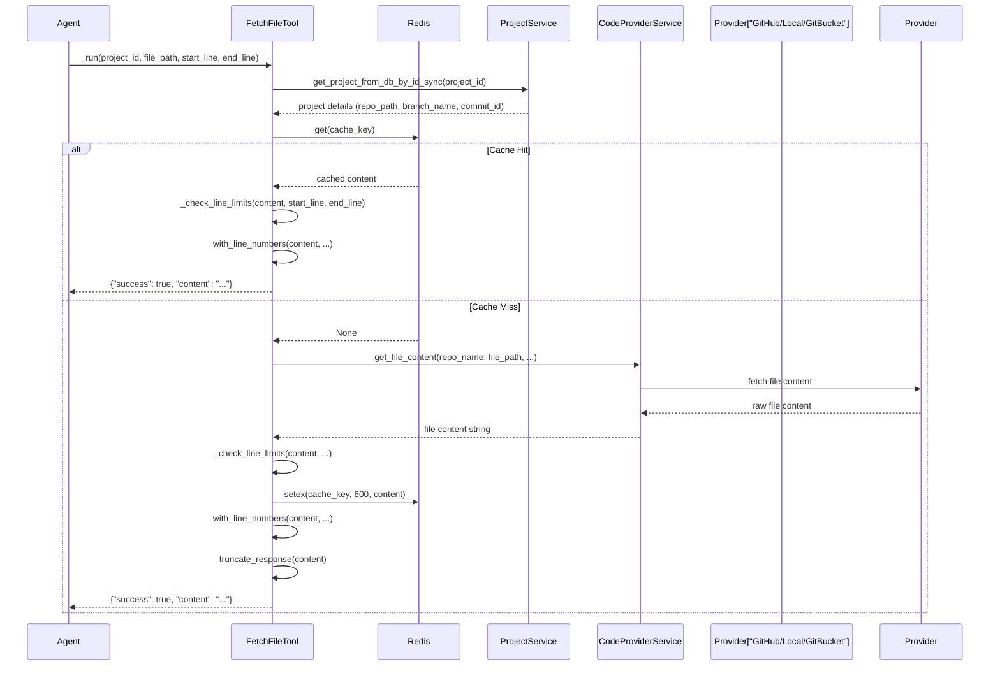
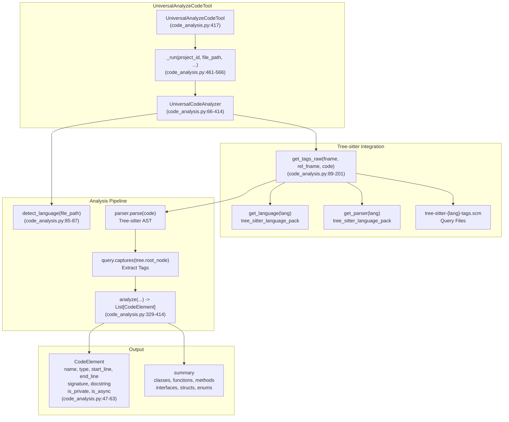
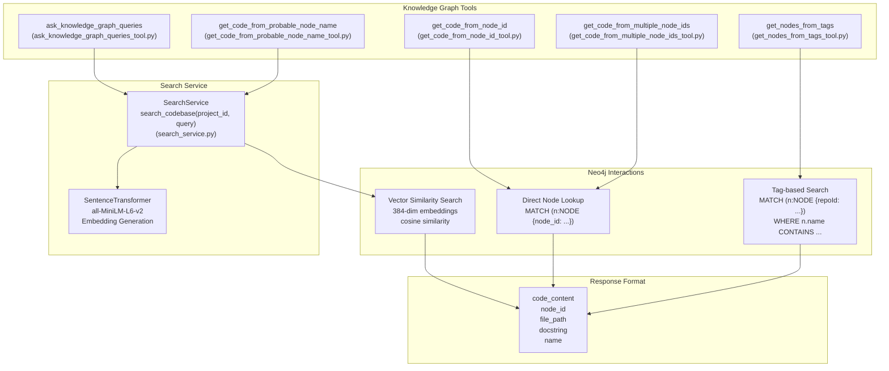
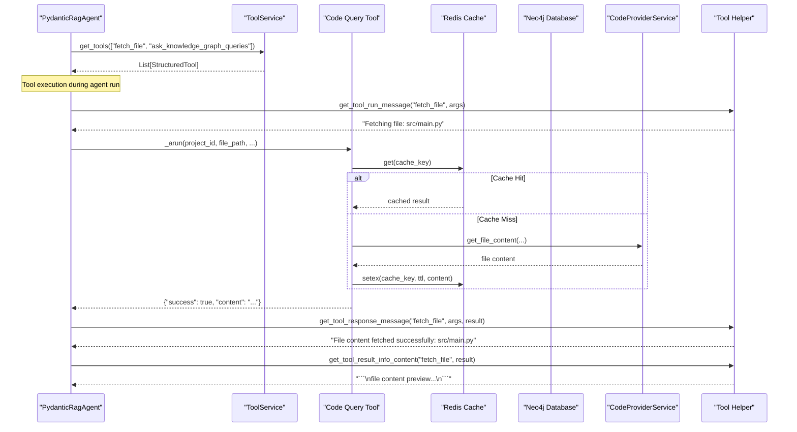
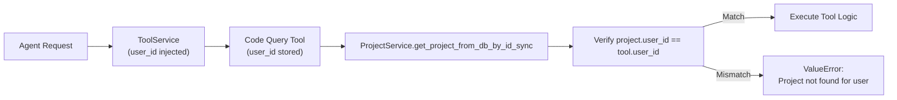
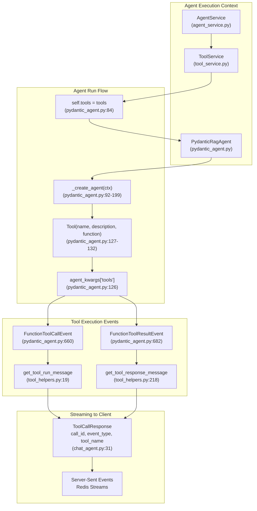

5.2-Code Query Tools

# Page: Code Query Tools

# Code Query Tools

<details>
<summary>Relevant source files</summary>

The following files were used as context for generating this wiki page:

- [app/modules/intelligence/agents/chat_agents/pydantic_agent.py](app/modules/intelligence/agents/chat_agents/pydantic_agent.py)
- [app/modules/intelligence/agents/chat_agents/tool_helpers.py](app/modules/intelligence/agents/chat_agents/tool_helpers.py)
- [app/modules/intelligence/tools/change_detection/change_detection_tool.py](app/modules/intelligence/tools/change_detection/change_detection_tool.py)
- [app/modules/intelligence/tools/code_query_tools/code_analysis.py](app/modules/intelligence/tools/code_query_tools/code_analysis.py)
- [app/modules/intelligence/tools/code_query_tools/get_file_content_by_path.py](app/modules/intelligence/tools/code_query_tools/get_file_content_by_path.py)
- [app/modules/intelligence/tools/tool_service.py](app/modules/intelligence/tools/tool_service.py)

</details>


## Overview

Code Query Tools are the primary mechanism through which AI agents interact with the codebase knowledge graph and file system. These tools enable agents to fetch file content, analyze code structure, traverse the Neo4j knowledge graph, and query repository metadata. The tool system provides a unified abstraction over heterogeneous data sources (Neo4j, file providers, Redis cache) while enforcing access control and caching policies.

For information about tool execution sandboxing and security, see [Bash Command Tool and Sandboxing](#5.5). For integration tools that interact with external services, see [Integration Tools](#5.6). For change detection capabilities, see [Change Detection Tool](#5.4).

## Tool Service Architecture

The `ToolService` class ([app/modules/intelligence/tools/tool_service.py:99-263]()) serves as the central registry and factory for all code query tools. It manages tool initialization, dependency injection, and tool lookup for agent execution.

```mermaid
graph TB
    subgraph "Tool Service Layer"
        ToolService["ToolService<br/>(tool_service.py:99)"]
        ToolRegistry["self.tools Dict<br/>(tool_service.py:134-242)"]
        GetTools["get_tools(tool_names)<br/>(tool_service.py:126-132)"]
    end
    
    subgraph "Code Query Tools"
        FetchFile["fetch_file<br/>FetchFileTool<br/>(get_file_content_by_path.py:26)"]
        AnalyzeCode["analyze_code_structure<br/>UniversalAnalyzeCodeTool<br/>(code_analysis.py:417)"]
        FileStructure["get_code_file_structure<br/>GetCodeFileStructureTool<br/>(get_code_file_structure.py)"]
    end
    
    subgraph "Knowledge Graph Tools"
        AskKG["ask_knowledge_graph_queries<br/>(kg_based_tools/)"]
        GetNode["get_code_from_node_id<br/>(kg_based_tools/)"]
        GetMultiple["get_code_from_multiple_node_ids<br/>(kg_based_tools/)"]
        GetProbable["get_code_from_probable_node_name<br/>(kg_based_tools/)"]
        GetTags["get_nodes_from_tags<br/>(kg_based_tools/)"]
    end
    
    subgraph "Graph Navigation Tools"
        GraphFromNode["get_code_graph_from_node_id<br/>GetCodeGraphFromNodeIdTool<br/>(get_code_graph_from_node_id_tool.py)"]
        NodeNeighbours["get_node_neighbours_from_node_id<br/>(get_node_neighbours_from_node_id_tool.py)"]
        IntelligentGraph["intelligent_code_graph<br/>(intelligent_code_graph_tool.py)"]
    end
    
    subgraph "Dependencies"
        DB[(PostgreSQL<br/>Session)]
        UserID["user_id<br/>Access Control"]
        CodeProvider["CodeProviderService<br/>File Access"]
        ProviderSvc["ProviderService<br/>LLM Access"]
    end
    
    ToolService --> ToolRegistry
    ToolService --> GetTools
    GetTools --> FetchFile
    GetTools --> AnalyzeCode
    GetTools --> FileStructure
    GetTools --> AskKG
    GetTools --> GetNode
    GetTools --> GetMultiple
    GetTools --> GetProbable
    GetTools --> GetTags
    GetTools --> GraphFromNode
    GetTools --> NodeNeighbours
    GetTools --> IntelligentGraph
    
    DB --> ToolService
    UserID --> ToolService
    CodeProvider --> ToolService
    ProviderSvc --> ToolService
```



**Tool Service Initialization**

Sources: [app/modules/intelligence/tools/tool_service.py:99-124]()

The `ToolService` constructor accepts a database session and user ID, then initializes all tool instances with proper dependency injection. Tools are stored in the `self.tools` dictionary keyed by their canonical names. The `_initialize_tools` method ([app/modules/intelligence/tools/tool_service.py:134-242]()) creates and registers all available tools, including:

| Tool Category | Tool Count | Examples |
|--------------|------------|----------|
| Code Query | 5 | `fetch_file`, `analyze_code_structure`, `get_code_file_structure` |
| Knowledge Graph | 5 | `ask_knowledge_graph_queries`, `get_code_from_node_id`, `get_nodes_from_tags` |
| Graph Navigation | 3 | `get_code_graph_from_node_id`, `get_node_neighbours_from_node_id`, `intelligent_code_graph` |
| Integration | 18 | Jira, Linear, Confluence, GitHub tools |
| Change Detection | 1 | `change_detection` |
| State Management | 8+ | Todo tools, code changes tools, requirements tools |

## File Content Fetching

The `FetchFileTool` ([app/modules/intelligence/tools/code_query_tools/get_file_content_by_path.py:26-237]()) provides efficient file content retrieval with line number support, Redis caching, and content size limits.



**Content Limits and Line Numbering**

Sources: [app/modules/intelligence/tools/code_query_tools/get_file_content_by_path.py:104-136](), [app/modules/intelligence/tools/code_query_tools/get_file_content_by_path.py:93-102]()

The tool enforces a maximum of 1200 lines per request to prevent context overflow. The `_check_line_limits` method validates:
- If `start_line` and `end_line` are specified, the range must not exceed 1200 lines
- If fetching an entire file without line range, the file must have ≤1200 lines
- Returns error response with `total_lines` count if limits are exceeded

Line numbers are optionally added via the `with_line_numbers` method, which formats content as:
```
1:def hello_world():
2:    print("Hello, world!")
3:
4:hello_world()
```

**Caching Strategy**

Sources: [app/modules/intelligence/tools/code_query_tools/get_file_content_by_path.py:148-178]()

Cache keys incorporate the exact file path and line range: `file_content:{project_id}:exact_path_{file_path}:start_line_{start_line}:end_line_{end_line}`. Cache TTL is 10 minutes (600 seconds). This per-range caching enables efficient repeated queries for specific file sections while avoiding cache bloat from full file content.

## Code Structure Analysis

The `UniversalAnalyzeCodeTool` ([app/modules/intelligence/tools/code_query_tools/code_analysis.py:417-579]()) provides language-agnostic code structure analysis using Tree-sitter parsers. It extracts detailed information about classes, functions, methods, and other code elements across multiple programming languages.



**Language Detection and Tag Extraction**

Sources: [app/modules/intelligence/tools/code_query_tools/code_analysis.py:85-87](), [app/modules/intelligence/tools/code_query_tools/code_analysis.py:89-201]()

The analyzer uses `grep_ast.filename_to_lang` to detect programming languages from file extensions. The `get_tags_raw` method then:
1. Obtains the appropriate Tree-sitter parser for the detected language
2. Loads the language-specific query file from `modules/parsing/graph_construction/queries/tree-sitter-{lang}-tags.scm`
3. Parses the code into an AST using Tree-sitter
4. Runs tag queries to extract `name.definition.*` and `name.reference.*` captures
5. Falls back to Pygments lexer for reference tokens if only definitions are found

**Code Element Extraction**

Sources: [app/modules/intelligence/tools/code_query_tools/code_analysis.py:329-414]()

The `analyze` method processes Tree-sitter tags and constructs `CodeElement` objects with:

| Field | Description | Source |
|-------|-------------|--------|
| `name` | Element identifier | Tree-sitter node text |
| `type` | Element type (function, class, method, etc.) | Tag type mapping |
| `start_line`, `end_line` | 1-indexed line ranges | Tree-sitter node positions |
| `signature` | Function/method signature | `_extract_signature` method |
| `docstring` | Documentation string | `_extract_docstring_comment` method |
| `is_private` | Privacy detection | `_is_private` method (checks `_` prefix, `private` keyword) |
| `is_async` | Async function detection | Checks for `async` keyword in signature |
| `is_static` | Static method detection | Checks for `static` keyword in signature |
| `parent_class` | Parent class for methods | Tracked via `current_class` state |

**Caching and Output Limits**

Sources: [app/modules/intelligence/tools/code_query_tools/code_analysis.py:481-560]()

Analysis results are cached in Redis with a 30-minute TTL using the key: `universal_code_analysis:{project_id}:{file_path}:{include_methods}:{include_private}:{language}`. The output is truncated to 80,000 characters maximum if the serialized JSON exceeds this limit ([app/modules/intelligence/tools/code_query_tools/code_analysis.py:552-560]()).

## Knowledge Graph Querying

Knowledge graph tools provide semantic search and traversal capabilities over the Neo4j code graph. These tools enable agents to find code nodes by semantic similarity, node IDs, or tag-based queries.



**Semantic Search with Vector Embeddings**

Sources: [app/modules/intelligence/tools/kg_based_tools/ask_knowledge_graph_queries_tool.py]()

The `ask_knowledge_graph_queries` tool accepts a list of natural language queries and performs vector similarity search against the Neo4j knowledge graph. Each query is:
1. Embedded using `SentenceTransformer` with the `all-MiniLM-L6-v2` model (384 dimensions)
2. Compared against node embeddings stored in Neo4j using cosine similarity
3. Returns top-k matching nodes with their code content, docstrings, and metadata

This enables semantic queries like "authentication logic" or "database connection handling" to retrieve relevant code nodes even when exact keyword matches don't exist.

**Direct Node ID Retrieval**

Sources: [app/modules/intelligence/tools/kg_based_tools/get_code_from_node_id_tool.py](), [app/modules/intelligence/tools/kg_based_tools/get_code_from_multiple_node_ids_tool.py]()

The `GetCodeFromNodeIdTool` performs direct Neo4j lookups using node IDs. It queries:
```cypher
MATCH (n:NODE {node_id: $node_id, repoId: $project_id})
RETURN n.code_content, n.file_path, n.docstring, n.name
```

The `GetCodeFromMultipleNodeIdsTool` extends this to batch queries, accepting a list of node IDs and returning a dictionary keyed by node ID. Both tools enforce user access control by verifying the project belongs to the requesting user.

**Probable Node Name Search**

Sources: [app/modules/intelligence/tools/kg_based_tools/get_code_from_probable_node_name_tool.py]()

The `get_code_from_probable_node_name` tool handles fuzzy name matching. Given a list of probable node names (e.g., `["UserService", "authenticate"]`), it:
1. Performs semantic search via `SearchService.search_codebase` for each name
2. Returns the top matching node for each probable name
3. Consolidates results into a list of code snippets with metadata

This tool is particularly useful when agents have partial or uncertain information about code entity names.

## Graph Navigation Tools

Graph navigation tools enable traversal of code relationships and dependencies stored in Neo4j. These tools follow CALLS, REFERENCES, and CONTAINS relationships to build contextual understanding of code structure.

```mermaid
graph TB
    subgraph "Graph Navigation Tools"
        GraphFromNode["get_code_graph_from_node_id<br/>GetCodeGraphFromNodeIdTool<br/>(get_code_graph_from_node_id_tool.py)"]
        NodeNeighbours["get_node_neighbours_from_node_id<br/>(get_node_neighbours_from_node_id_tool.py)"]
        IntelligentGraph["intelligent_code_graph<br/>(intelligent_code_graph_tool.py)"]
    end
    
    subgraph "Neo4j Relationship Types"
        Calls["CALLS<br/>(function -> function)"]
        References["REFERENCES<br/>(code -> code)"]
        Contains["CONTAINS<br/>(file -> class/function)"]
    end
    
    subgraph "Traversal Patterns"
        Outbound["Outbound<br/>MATCH (n)-[r]->(m)"]
        Inbound["Inbound<br/>MATCH (n)<-[r]-(m)"]
        Bidirectional["Bidirectional<br/>MATCH (n)-[r]-(m)"]
        MultiHop["Multi-hop<br/>MATCH (n)-[*1..depth]-(m)"]
    end
    
    subgraph "Node Types"
        FileNode["FILE nodes<br/>Contains classes/functions"]
        ClassNode["CLASS nodes<br/>Contains methods"]
        FunctionNode["FUNCTION nodes<br/>Callable units"]
    end
    
    GraphFromNode --> Outbound
    GraphFromNode --> Calls
    GraphFromNode --> References
    
    NodeNeighbours --> Bidirectional
    NodeNeighbours --> MultiHop
    
    IntelligentGraph --> FileNode
    IntelligentGraph --> ClassNode
    IntelligentGraph --> FunctionNode
    IntelligentGraph --> Calls
```



**Code Graph Extraction**

Sources: [app/modules/intelligence/tools/code_query_tools/get_code_graph_from_node_id_tool.py]()

The `GetCodeGraphFromNodeIdTool` builds a subgraph centered on a given node ID by:
1. Fetching the root node from Neo4j using `node_id` and `repoId`
2. Traversing outbound CALLS and REFERENCES relationships to specified depth
3. Collecting all reachable nodes with their code content and metadata
4. Returning a structured graph representation with nodes and edges

This is useful for understanding the call graph and dependency structure around a specific code entity.

**Neighbor Retrieval**

Sources: [app/modules/intelligence/tools/code_query_tools/get_node_neighbours_from_node_id_tool.py]()

The `get_node_neighbours_from_node_id` tool fetches immediate neighbors (1-hop traversal) of a node in both directions. It returns:
- **Inbound neighbors**: Nodes that call or reference the target node
- **Outbound neighbors**: Nodes that the target node calls or references
- **Relationship types**: The type of connection (CALLS, REFERENCES, CONTAINS)

This enables agents to expand context incrementally without fetching entire subgraphs.

**Intelligent Code Graph**

Sources: [app/modules/intelligence/tools/code_query_tools/intelligent_code_graph_tool.py]()

The `intelligent_code_graph` tool uses an LLM to generate Neo4j Cypher queries dynamically based on natural language descriptions. It:
1. Accepts a free-form query description from the agent
2. Constructs a prompt with available node properties and relationship types
3. Calls the `ProviderService` to generate a Cypher query via LLM
4. Executes the generated query against Neo4j
5. Returns structured results with code content

This tool bridges natural language to graph database queries, enabling complex traversals without hardcoded query templates.

## Tool Execution Flow



**Tool Invocation Pattern**

Sources: [app/modules/intelligence/agents/chat_agents/pydantic_agent.py:126-133](), [app/modules/intelligence/tools/tool_service.py:126-132]()

Agents interact with tools through the LangChain `StructuredTool` interface. The `PydanticRagAgent` receives tools during initialization ([app/modules/intelligence/agents/chat_agents/pydantic_agent.py:66-91]()) and wraps each tool's function with exception handling ([app/modules/intelligence/agents/chat_agents/pydantic_agent.py:53-63]()). Tools are registered with PydanticAI's `Agent` as `Tool` objects with name, description, and function attributes.

**Tool Helper Messaging**

Sources: [app/modules/intelligence/agents/chat_agents/tool_helpers.py:19-215](), [app/modules/intelligence/agents/chat_agents/tool_helpers.py:218-564]()

The tool helper system provides three types of messages:

1. **Tool Run Messages** (`get_tool_run_message`): Displayed when a tool starts execution
   - Example: `"Fetching file: src/main.py"` for `fetch_file` tool
   - Example: `"Traversing the knowledge graph"` for `ask_knowledge_graph_queries` tool

2. **Tool Response Messages** (`get_tool_response_message`): Displayed when a tool completes
   - Example: `"File content fetched successfully: src/main.py"` for successful `fetch_file`
   - Example: `"Project file structure loaded successfully for /src"` for `get_code_file_structure`

3. **Tool Result Info** (`get_tool_result_info_content`): Provides preview of tool output
   - Truncates large responses to ~600 characters
   - Formats code snippets in markdown code blocks
   - Includes error messages for failed executions

These messages are streamed to users via Server-Sent Events during agent execution ([app/modules/intelligence/agents/chat_agents/pydantic_agent.py:658-706]()), providing real-time visibility into tool calls.

## Tool Parameter Schemas

All code query tools use Pydantic models to define their input parameters. This enables automatic validation, type checking, and documentation generation.

**Common Parameter Patterns**

| Parameter | Type | Description | Usage |
|-----------|------|-------------|-------|
| `project_id` | `str` | UUID of the project/repository | Required for all tools, enforces access control |
| `file_path` | `str` | Relative path to file within repo | Used by `fetch_file`, `analyze_code_structure` |
| `node_id` | `str` | Neo4j node identifier | Used by graph navigation tools |
| `start_line` | `Optional[int]` | 1-based line number for range queries | Used by `fetch_file` |
| `end_line` | `Optional[int]` | Inclusive end line for range queries | Used by `fetch_file` |
| `include_methods` | `bool` | Whether to include class methods | Used by `analyze_code_structure` (default: True) |
| `include_private` | `bool` | Whether to include private elements | Used by `analyze_code_structure` (default: False) |

**Tool Schema Inspection**

Sources: [app/modules/intelligence/tools/tool_service.py:254-262]()

The `ToolService.list_tools_with_parameters` method returns a dictionary mapping tool IDs to `ToolInfoWithParameters` objects, which include:
- `name`: Tool name as registered
- `description`: Tool description for LLM context
- `args_schema`: Pydantic schema dictionary for parameters

This enables dynamic tool discovery and parameter validation at runtime.

## Access Control and Multi-Tenancy

All code query tools enforce user-level access control to ensure data isolation in the multi-tenant system.

**User ID Verification Pattern**



Sources: [app/modules/intelligence/tools/code_query_tools/get_file_content_by_path.py:83-91](), [app/modules/intelligence/tools/code_query_tools/code_analysis.py:451-459]()

Every tool:
1. Stores the `user_id` passed during initialization
2. Validates project ownership by querying PostgreSQL via `ProjectService`
3. Checks `details["user_id"] != self.user_id` and raises `ValueError` if mismatch
4. Proceeds with Neo4j queries or file operations only after verification

This pattern appears consistently across `FetchFileTool._get_project_details`, `UniversalAnalyzeCodeTool._get_project_details`, and all knowledge graph tools.

## Caching Strategies

Code query tools implement sophisticated caching to reduce database queries and API calls.

**Cache Key Patterns**

Sources: [app/modules/intelligence/tools/code_query_tools/get_file_content_by_path.py:148](), [app/modules/intelligence/tools/code_query_tools/code_analysis.py:481]()

| Tool | Cache Key Format | TTL | Rationale |
|------|------------------|-----|-----------|
| `fetch_file` | `file_content:{project_id}:exact_path_{file_path}:start_line_{start_line}:end_line_{end_line}` | 10 min | Per-range caching for targeted file section queries |
| `analyze_code_structure` | `universal_code_analysis:{project_id}:{file_path}:{include_methods}:{include_private}:{language}` | 30 min | Analysis is compute-intensive, longer TTL justified |

**Cache Invalidation**

The system does not implement proactive cache invalidation. Instead, it relies on TTL expiration and cache key specificity:
- File content changes are reflected after 10-minute TTL expiry
- Different line ranges for the same file create separate cache entries
- Project-level changes (branch switches, new commits) use different `project_id` cache namespaces

## Error Handling and Response Formats

Code query tools follow a consistent error handling and response format pattern.

**Success Response Structure**

```python
{
    "success": true,
    "content": "...",  # or other result fields
    "additional_metadata": "..."
}
```

**Error Response Structure**

```python
{
    "success": false,
    "error": "Error message explaining what went wrong",
    "content": None  # or other null result fields
}
```

**Common Error Scenarios**

Sources: [app/modules/intelligence/tools/code_query_tools/get_file_content_by_path.py:216-226](), [app/modules/intelligence/tools/code_query_tools/code_analysis.py:562-566]()

| Error Type | HTTP Status | Tool Response | Example |
|------------|-------------|---------------|---------|
| `FileNotFoundError` | N/A (tool-level) | `{"success": false, "error": "File 'X' does not exist..."}` | Invalid file path |
| `ValueError` (access control) | N/A (tool-level) | `{"success": false, "error": "Cannot find repo details..."}` | User doesn't own project |
| Line limit exceeded | N/A (tool-level) | `{"success": false, "error": "Too much content requested..."}` | Requesting >1200 lines |
| Parse error | N/A (tool-level) | `{"success": false, "error": "Failed to parse {lang} file..."}` | Invalid source code |

Tools use `logger.exception` for unexpected errors and `logger.warning` for expected error conditions like file not found, ensuring appropriate log verbosity.

## Integration with Agent Execution



**Tool Registration in Agents**

Sources: [app/modules/intelligence/agents/chat_agents/pydantic_agent.py:66-91](), [app/modules/intelligence/agents/chat_agents/pydantic_agent.py:92-199]()

When a `PydanticRagAgent` is initialized, it:
1. Receives a list of `StructuredTool` objects from the `AgentService`
2. Stores them in `self.tools` after sanitizing tool names (removing spaces)
3. During `_create_agent`, wraps each tool's function with `handle_exception` decorator
4. Creates PydanticAI `Tool` objects with name, description, and wrapped function
5. Registers tools in the `agent_kwargs["tools"]` list

**Tool Call Streaming**

Sources: [app/modules/intelligence/agents/chat_agents/pydantic_agent.py:656-706]()

During streaming execution, the agent emits tool events:
- `FunctionToolCallEvent`: Emitted when tool execution begins
  - Triggers `get_tool_run_message` to generate user-friendly message
  - Creates `ToolCallResponse` with `event_type=ToolCallEventType.CALL`
- `FunctionToolResultEvent`: Emitted when tool execution completes
  - Triggers `get_tool_response_message` to generate completion message
  - Creates `ToolCallResponse` with `event_type=ToolCallEventType.RESULT`

These events are yielded as `ChatAgentResponse` objects and published to Redis Streams for real-time client updates via SSE.

**Tool Result Processing**

Sources: [app/modules/intelligence/agents/chat_agents/tool_helpers.py:825-1092]()

The `get_tool_result_info_content` function formats tool results for LLM consumption:
- Truncates large outputs to ~600 characters maximum
- Wraps code content in markdown code blocks
- Formats structured data (dicts, lists) for readability
- Includes error messages prominently for failed tool calls

This ensures tool results remain within LLM context windows while preserving essential information.

---

Sources: 
- [app/modules/intelligence/tools/tool_service.py:1-263]()
- [app/modules/intelligence/tools/code_query_tools/get_file_content_by_path.py:1-250]()
- [app/modules/intelligence/tools/code_query_tools/code_analysis.py:1-593]()
- [app/modules/intelligence/agents/chat_agents/pydantic_agent.py:1-1652]()
- [app/modules/intelligence/agents/chat_agents/tool_helpers.py:1-1092]()