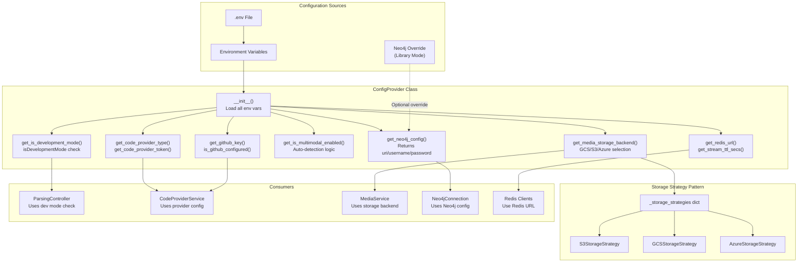
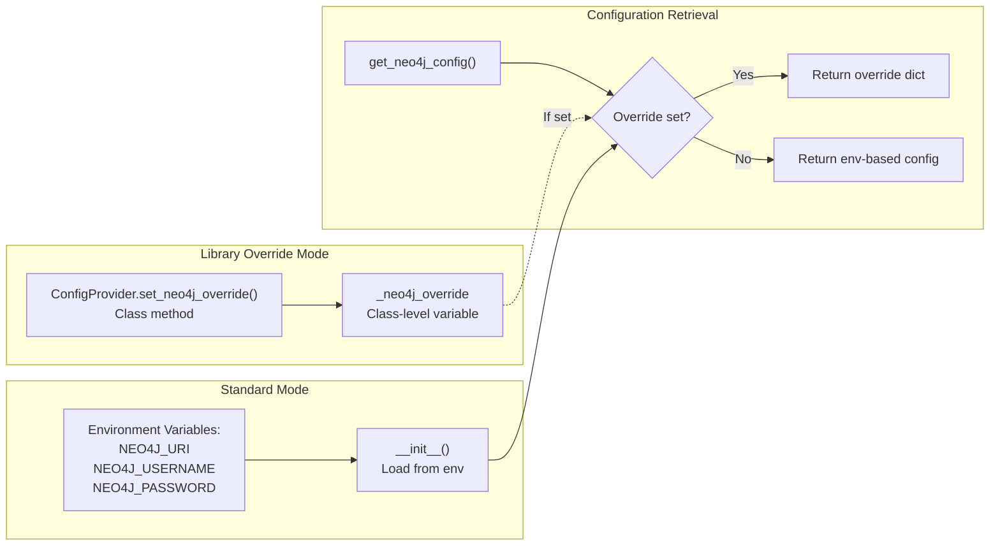
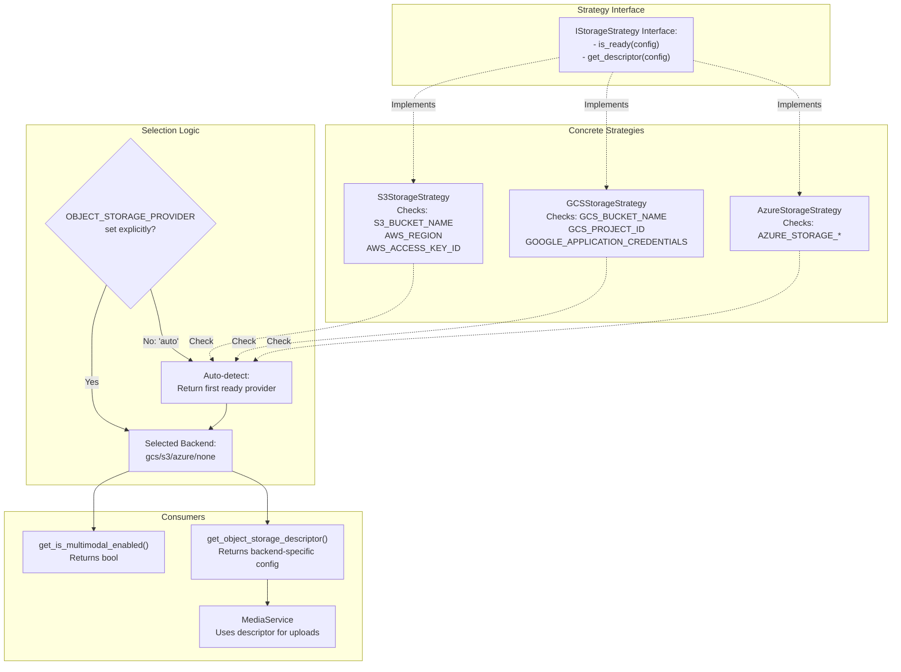

8-Configuration and Infrastructure

# Page: Configuration and Infrastructure

# Configuration and Infrastructure

<details>
<summary>Relevant source files</summary>

The following files were used as context for generating this wiki page:

- [GETTING_STARTED.md](GETTING_STARTED.md)
- [LICENSE](LICENSE)
- [app/core/config_provider.py](app/core/config_provider.py)
- [app/modules/code_provider/code_provider_service.py](app/modules/code_provider/code_provider_service.py)
- [app/modules/code_provider/local_repo/local_repo_service.py](app/modules/code_provider/local_repo/local_repo_service.py)
- [app/modules/intelligence/tools/code_query_tools/get_code_file_structure.py](app/modules/intelligence/tools/code_query_tools/get_code_file_structure.py)
- [app/modules/parsing/graph_construction/parsing_controller.py](app/modules/parsing/graph_construction/parsing_controller.py)
- [contributing.md](contributing.md)

</details>


This page documents Potpie's configuration management system, environment variable structure, and external service integrations. It covers the centralized `ConfigProvider` class, operational modes (development vs production), storage backend selection, and the integration points for external services like Firebase, GitHub, Neo4j, Redis, and Google Cloud Secret Manager.

For authentication configuration details, see [Authentication and User Management](#7). For database schemas and connection details, see [Data Layer](#10). For specific service implementations (media upload, secret storage), see the subsections: [Configuration Provider](#8.1), [Media Service and Storage](#8.2), [Environment Configuration](#8.3), [Secret Management](#8.4), and [External Service Integrations](#8.5).

---

## Configuration Provider Architecture

The system uses a centralized `ConfigProvider` class to manage all configuration settings. This class loads environment variables on initialization and provides getter methods for different subsystems.



**Sources:** [app/core/config_provider.py:1-246]()

The `ConfigProvider` class is instantiated as a singleton at module level: `config_provider = ConfigProvider()` [app/core/config_provider.py:245](). It is imported throughout the codebase to access configuration settings.

---

## Operational Modes

Potpie supports two distinct operational modes controlled by environment variables. Understanding these modes is critical for deployment and development.

### Development Mode vs Production Mode

| Aspect | Development Mode | Production Mode |
|--------|-----------------|-----------------|
| Environment Variable | `isDevelopmentMode=enabled` | `isDevelopmentMode=disabled` or unset |
| Purpose | Run without external dependencies | Full production deployment |
| Firebase Auth | Mock authentication, bypasses token verification | Real Firebase authentication required |
| GitHub Integration | Optional, can parse local repositories | GitHub App or PAT required |
| Secret Management | Not required | Google Secret Manager integration |
| Local Repository Parsing | Supported via `repo_path` parameter | Disabled (raises HTTPException) |
| LLM Models | Can use local Ollama models | Typically uses cloud LLM providers |

**Sources:** [app/core/config_provider.py:154-155](), [GETTING_STARTED.md:1-61](), [contributing.md:116-126]()

The `ENV` variable (development/staging/production) is separate from `isDevelopmentMode`. `ENV` controls environment-specific configuration loading, while `isDevelopmentMode` enables dependency-free operation:

```python
# Check development mode
if config_provider.get_is_development_mode():
    # Allows local repository parsing
    if repo_details.repo_path and repo_details.repo_name:
        repo_details.repo_name = None
```

**Sources:** [app/modules/parsing/graph_construction/parsing_controller.py:70-74]()

Local repository parsing is explicitly blocked in production mode:

```python
if repo_path:
    if os.getenv("isDevelopmentMode") != "enabled":
        raise HTTPException(
            status_code=400,
            detail="Parsing local repositories is only supported in development mode",
        )
```

**Sources:** [app/modules/parsing/graph_construction/parsing_controller.py:85-90]()

---

## Configuration Loading and Access Patterns

### Neo4j Configuration with Override Mechanism

The `ConfigProvider` supports a special override mechanism for Neo4j configuration, enabling library usage without environment variables:



**Sources:** [app/core/config_provider.py:52-73]()

The override mechanism uses a class-level variable `_neo4j_override` that takes precedence over instance-level configuration:

```python
@classmethod
def set_neo4j_override(cls, config: dict | None) -> None:
    """Set a global Neo4j config override for library usage."""
    cls._neo4j_override = config

def get_neo4j_config(self) -> dict:
    """Get Neo4j config, preferring override if set."""
    if ConfigProvider._neo4j_override is not None:
        return ConfigProvider._neo4j_override
    return self.neo4j_config
```

**Sources:** [app/core/config_provider.py:52-73]()

---

## Storage Backend Selection

Potpie supports multiple cloud storage providers (GCS, S3, Azure) using a strategy pattern. The system auto-detects available backends based on environment variables.

### Storage Strategy Pattern



**Sources:** [app/core/config_provider.py:6-10](), [app/core/config_provider.py:36-50](), [app/core/config_provider.py:190-206]()

### Multimodal Enablement Logic

Multimodal features (image attachments) require object storage. The enablement logic follows three modes:

| `isMultimodalEnabled` Value | Behavior |
|------------------------------|----------|
| `disabled` | Always disabled, regardless of storage availability |
| `enabled` | Force enabled, will fail if storage not configured |
| `auto` (default) | Auto-detect based on storage backend availability |

```python
def get_is_multimodal_enabled(self) -> bool:
    if self.is_multimodal_enabled.lower() == "disabled":
        return False
    if self.is_multimodal_enabled.lower() == "enabled":
        return True
    else:  # "auto" mode
        return self._detect_object_storage_dependencies()[0]
```

**Sources:** [app/core/config_provider.py:157-173]()

The auto-detection checks if any storage provider has all required credentials configured:

```python
def _detect_object_storage_dependencies(self) -> tuple[bool, str]:
    # Check explicit provider selection first
    if (
        self.object_storage_provider != "auto"
        and self.object_storage_provider in self._storage_strategies
    ):
        strategy = self._storage_strategies[self.object_storage_provider]
        is_ready = strategy.is_ready(self)
        return is_ready, self.object_storage_provider

    # Auto-detection: return first ready provider
    for provider, strategy in self._storage_strategies.items():
        if strategy.is_ready(self):
            return True, provider

    return False, "none"
```

**Sources:** [app/core/config_provider.py:190-206]()

---

## Code Provider Configuration

The system supports multiple code providers (GitHub, GitBucket, GitLab, local filesystem) with configurable authentication.

### Code Provider Environment Variables

| Variable | Purpose | Example |
|----------|---------|---------|
| `CODE_PROVIDER` | Provider type selection | `github`, `gitbucket`, `gitlab`, `local` |
| `CODE_PROVIDER_BASE_URL` | Self-hosted instance URL | `https://git.company.com/api/v3` |
| `CODE_PROVIDER_TOKEN` | Primary personal access token | `ghp_xxxxxxxxxxxx` |
| `CODE_PROVIDER_TOKEN_POOL` | Comma-separated PAT pool for rate limiting | `token1,token2,token3` |
| `CODE_PROVIDER_USERNAME` | Basic Auth username (GitBucket) | `admin` |
| `CODE_PROVIDER_PASSWORD` | Basic Auth password (GitBucket) | `password` |

**Sources:** [app/core/config_provider.py:219-243]()

The `ConfigProvider` provides methods to access these settings:

```python
def get_code_provider_type(self) -> str:
    """Get configured code provider type (default: github)."""
    return os.getenv("CODE_PROVIDER", "github").lower()

def get_code_provider_token_pool(self) -> List[str]:
    """Get code provider token pool for rate limit distribution."""
    token_pool_str = os.getenv("CODE_PROVIDER_TOKEN_POOL", "")
    return [t.strip() for t in token_pool_str.split(",") if t.strip()]
```

**Sources:** [app/core/config_provider.py:219-235]()

---

## Redis Configuration

Redis is used for three purposes: session caching, stream event publishing (SSE), and Celery message brokering.

### Redis Connection URL Construction

```python
def get_redis_url(self):
    redishost = os.getenv("REDISHOST", "localhost")
    redisport = int(os.getenv("REDISPORT", 6379))
    redisuser = os.getenv("REDISUSER", "")
    redispassword = os.getenv("REDISPASSWORD", "")
    # Construct the Redis URL
    if redisuser and redispassword:
        redis_url = f"redis://{redisuser}:{redispassword}@{redishost}:{redisport}/0"
    else:
        redis_url = f"redis://{redishost}:{redisport}/0"
    return redis_url
```

**Sources:** [app/core/config_provider.py:142-152]()

### Stream Configuration Parameters

| Method | Environment Variable | Default | Purpose |
|--------|---------------------|---------|---------|
| `get_stream_ttl_secs()` | `REDIS_STREAM_TTL_SECS` | 900 (15 min) | Time before stream auto-expires |
| `get_stream_maxlen()` | `REDIS_STREAM_MAX_LEN` | 1000 | Maximum events per stream |
| `get_stream_prefix()` | `REDIS_STREAM_PREFIX` | `chat:stream` | Redis key prefix for streams |

**Sources:** [app/core/config_provider.py:207-218]()

These settings control the Redis Streams used for real-time message delivery. The TTL ensures streams don't persist indefinitely, while maxlen prevents unbounded memory growth.

---

## GitHub Configuration

GitHub integration requires either a GitHub App or personal access tokens. The configuration includes:

### GitHub App Configuration

| Variable | Purpose | Location |
|----------|---------|----------|
| `GITHUB_APP_ID` | GitHub App ID | Environment variable |
| `GITHUB_PRIVATE_KEY` | Private key (formatted) | Environment variable |
| `GH_TOKEN_LIST` | Comma-separated PAT list (deprecated) | Environment variable |

**Sources:** [GETTING_STARTED.md:92-120](), [app/core/config_provider.py:28](), [app/core/config_provider.py:75-80]()

The private key must be formatted without newlines. The repository includes a `format_pem.sh` script for this:

```bash
chmod +x format_pem.sh
./format_pem.sh your-key.pem
```

**Sources:** [GETTING_STARTED.md:110-117]()

GitHub App permissions required:
- Repository Permissions: Contents (Read), Metadata (Read), Pull Requests (Read/Write), Secrets (Read), Webhook (Read)
- Organization Permissions: Members (Read)
- Account Permissions: Email Address (Read)

**Sources:** [GETTING_STARTED.md:98-106]()

---

## Demo Repository Configuration

The system maintains a hardcoded list of demo repositories that can be duplicated for new users without re-parsing:

```python
def get_demo_repo_list(self):
    return [
        {
            "id": "demo8",
            "name": "langchain",
            "full_name": "langchain-ai/langchain",
            "private": False,
            "url": "https://github.com/langchain-ai/langchain",
            "owner": "langchain-ai",
        },
        # ... 6 more demo repos
    ]
```

**Sources:** [app/core/config_provider.py:82-141]()

These repositories are checked in the parsing pipeline. If a user requests one of these repos and a global copy exists, the system duplicates the Neo4j graph instead of re-parsing:

```python
demo_repos = [
    "Portkey-AI/gateway",
    "crewAIInc/crewAI",
    "AgentOps-AI/agentops",
    "calcom/cal.com",
    "langchain-ai/langchain",
    "AgentOps-AI/AgentStack",
    "formbricks/formbricks",
]

if not project and repo_details.repo_name in demo_repos:
    existing_project = await project_manager.get_global_project_from_db(
        normalized_repo_name,
        repo_details.branch_name,
        repo_details.commit_id,
    )
    # ... duplicate logic
```

**Sources:** [app/modules/parsing/graph_construction/parsing_controller.py:102-187]()

---

## External Service Integration Points

```mermaid
graph TB
    subgraph "Potpie Backend"
        CONFIG["ConfigProvider"]
    end
    
    subgraph "Authentication Services"
        FIREBASE["Firebase<br/>- Authentication<br/>- Firestore onboarding data"]
        GH_OAUTH["GitHub OAuth<br/>- App authentication<br/>- User login"]
    end
    
    subgraph "Data Storage"
        NEO4J["Neo4j<br/>- Code graph<br/>- Vector embeddings"]
        POSTGRES["PostgreSQL<br/>- Relational data<br/>- Users/projects/messages"]
        REDIS["Redis<br/>- Caching<br/>- Streams<br/>- Celery broker"]
        OBJECT_STORAGE["Object Storage<br/>- GCS/S3/Azure<br/>- Image attachments"]
    end
    
    subgraph "Secret Management"
        SECRET_MGR["Google Secret Manager<br/>- API keys<br/>- Encrypted tokens"]
        ADC["Application Default Credentials<br/>- gcloud auth"]
    end
    
    subgraph "Observability"
        POSTHOG["PostHog<br/>- User analytics<br/>- Event tracking"]
        SENTRY["Sentry<br/>- Error tracking"]
        PHOENIX["Phoenix<br/>- LLM tracing"]
    end
    
    subgraph "LLM Providers"
        OPENAI["OpenAI"]
        ANTHROPIC["Anthropic"]
        OLLAMA["Ollama (local)"]
        OTHER["Others via LiteLLM"]
    end
    
    CONFIG -->|NEO4J_URI<br/>NEO4J_USERNAME<br/>NEO4J_PASSWORD| NEO4J
    CONFIG -->|POSTGRES_*| POSTGRES
    CONFIG -->|REDIS_*| REDIS
    CONFIG -->|FIREBASE_*| FIREBASE
    CONFIG -->|GITHUB_APP_ID<br/>GITHUB_PRIVATE_KEY| GH_OAUTH
    CONFIG -->|OBJECT_STORAGE_PROVIDER<br/>GCS_*/S3_*/AZURE_*| OBJECT_STORAGE
    CONFIG -->|GCS_PROJECT_ID| SECRET_MGR
    CONFIG -->|POSTHOG_API_KEY| POSTHOG
    CONFIG -->|SENTRY_DSN| SENTRY
    
    ADC -.->|Authenticates| SECRET_MGR
    SECRET_MGR -.->|Stores| CONFIG
    
    CONFIG -->|OPENAI_API_KEY| OPENAI
    CONFIG -->|ANTHROPIC_API_KEY| ANTHROPIC
    CONFIG -->|INFERENCE_MODEL<br/>CHAT_MODEL| OLLAMA
    CONFIG -->|Provider-specific keys| OTHER
```



**Sources:** [GETTING_STARTED.md:64-172](), [app/core/config_provider.py:1-246]()

---

## Environment Variable Reference

### Core Configuration

| Variable | Required | Default | Purpose |
|----------|----------|---------|---------|
| `isDevelopmentMode` | No | `disabled` | Enable development mode (no external deps) |
| `ENV` | No | - | Environment name (development/staging/production) |

### Neo4j

| Variable | Required | Default | Purpose |
|----------|----------|---------|---------|
| `NEO4J_URI` | Yes | - | Neo4j connection URI |
| `NEO4J_USERNAME` | Yes | - | Neo4j username |
| `NEO4J_PASSWORD` | Yes | - | Neo4j password |

### Redis

| Variable | Required | Default | Purpose |
|----------|----------|---------|---------|
| `REDISHOST` | No | `localhost` | Redis hostname |
| `REDISPORT` | No | `6379` | Redis port |
| `REDISUSER` | No | - | Redis username (optional) |
| `REDISPASSWORD` | No | - | Redis password (optional) |
| `REDIS_STREAM_TTL_SECS` | No | `900` | Stream expiration time (15 min) |
| `REDIS_STREAM_MAX_LEN` | No | `1000` | Max events per stream |
| `REDIS_STREAM_PREFIX` | No | `chat:stream` | Stream key prefix |

### GitHub

| Variable | Required | Default | Purpose |
|----------|----------|---------|---------|
| `GITHUB_APP_ID` | Production | - | GitHub App ID |
| `GITHUB_PRIVATE_KEY` | Production | - | GitHub App private key (formatted) |
| `GH_TOKEN_LIST` | No | - | Comma-separated PAT list (legacy) |

### Code Provider

| Variable | Required | Default | Purpose |
|----------|----------|---------|---------|
| `CODE_PROVIDER` | No | `github` | Provider type (github/gitbucket/local) |
| `CODE_PROVIDER_BASE_URL` | No | - | Self-hosted instance URL |
| `CODE_PROVIDER_TOKEN` | No | - | Primary PAT |
| `CODE_PROVIDER_TOKEN_POOL` | No | - | Comma-separated PAT pool |
| `CODE_PROVIDER_USERNAME` | No | - | Basic Auth username |
| `CODE_PROVIDER_PASSWORD` | No | - | Basic Auth password |

### Object Storage

| Variable | Required | Default | Purpose |
|----------|----------|---------|---------|
| `OBJECT_STORAGE_PROVIDER` | No | `auto` | Storage backend (gcs/s3/azure/auto) |
| `isMultimodalEnabled` | No | `auto` | Enable image attachments (auto/enabled/disabled) |
| `GCS_BUCKET_NAME` | GCS | - | Google Cloud Storage bucket |
| `GCS_PROJECT_ID` | GCS | - | GCP project ID |
| `GOOGLE_APPLICATION_CREDENTIALS` | GCS | - | Path to service account JSON |
| `S3_BUCKET_NAME` | S3 | - | AWS S3 bucket |
| `AWS_REGION` | S3 | - | AWS region |
| `AWS_ACCESS_KEY_ID` | S3 | - | AWS access key |
| `AWS_SECRET_ACCESS_KEY` | S3 | - | AWS secret key |

### LLM Configuration

| Variable | Required | Default | Purpose |
|----------|----------|---------|---------|
| `INFERENCE_MODEL` | Yes | - | Model for knowledge graph generation |
| `CHAT_MODEL` | Yes | - | Model for agent reasoning |
| `OPENAI_API_KEY` | Provider-specific | - | OpenAI API key |
| `ANTHROPIC_API_KEY` | Provider-specific | - | Anthropic API key |
| Other provider keys | Provider-specific | - | Various LLM provider keys |

### Observability

| Variable | Required | Default | Purpose |
|----------|----------|---------|---------|
| `POSTHOG_API_KEY` | No | - | PostHog API key |
| `POSTHOG_HOST` | No | - | PostHog instance URL |
| `SENTRY_DSN` | No | - | Sentry error tracking DSN |

**Sources:** [app/core/config_provider.py:1-246](), [GETTING_STARTED.md:14-46]()

---

## Configuration Usage Patterns

### Checking Development Mode

```python
from app.core.config_provider import config_provider

if config_provider.get_is_development_mode():
    # Development-only logic
    if repo_details.repo_path and repo_details.repo_name:
        repo_details.repo_name = None
```

**Sources:** [app/modules/parsing/graph_construction/parsing_controller.py:70-74]()

### Accessing Redis Configuration

```python
redis_url = config_provider.get_redis_url()
stream_ttl = ConfigProvider.get_stream_ttl_secs()
stream_maxlen = ConfigProvider.get_stream_maxlen()
```

**Sources:** [app/core/config_provider.py:142-218]()

### Getting Storage Backend

```python
backend = config_provider.get_media_storage_backend()  # Returns "gcs", "s3", "azure", or "none"
descriptor = config_provider.get_object_storage_descriptor()  # Returns backend-specific config dict
```

**Sources:** [app/core/config_provider.py:174-189]()

### Checking GitHub Configuration

```python
if config_provider.is_github_configured():
    github_key = config_provider.get_github_key()
    # Use GitHub App authentication
```

**Sources:** [app/core/config_provider.py:78-80]()