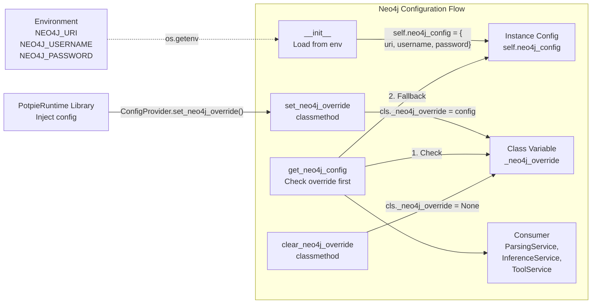
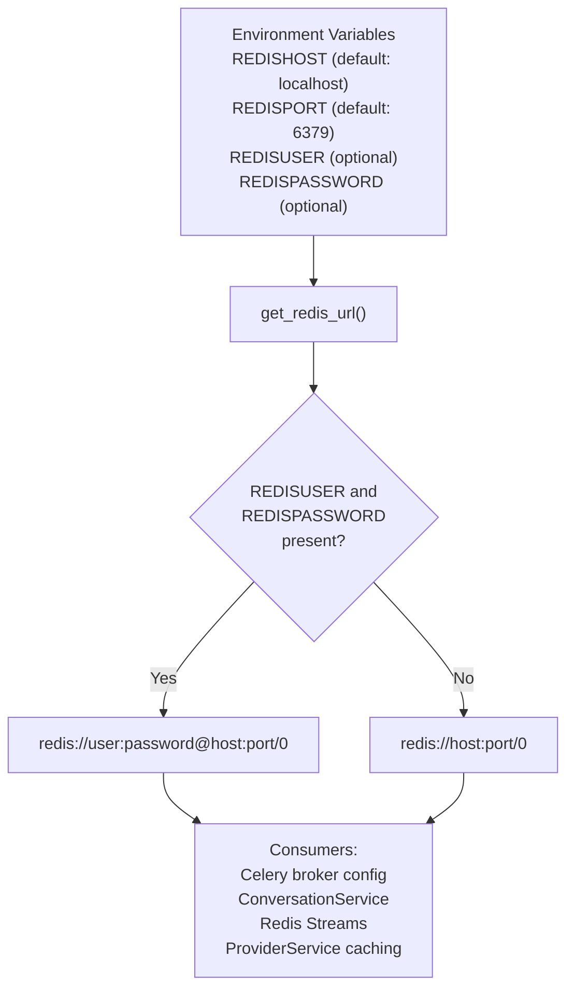
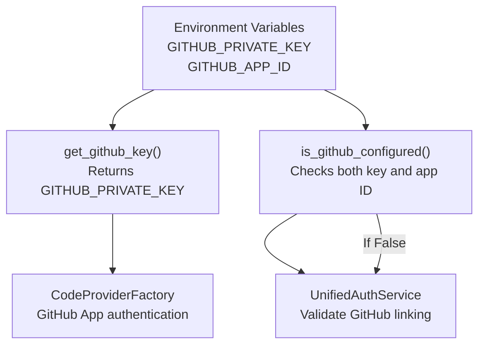
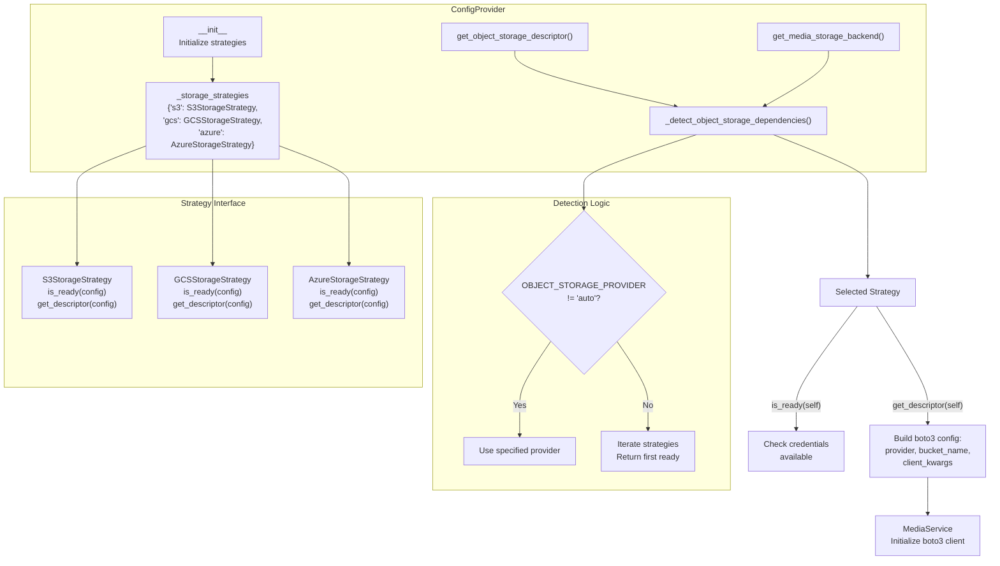
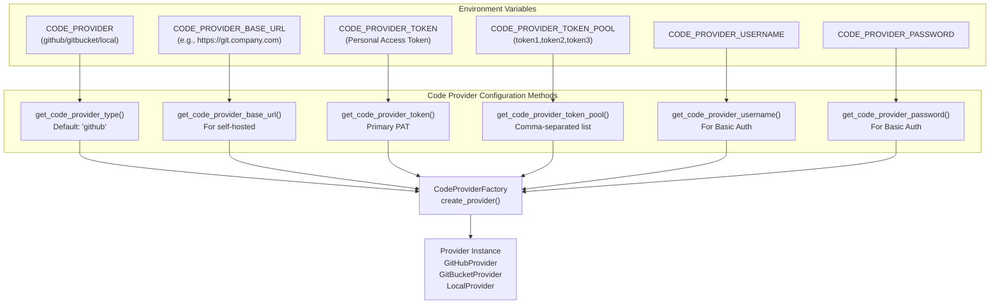
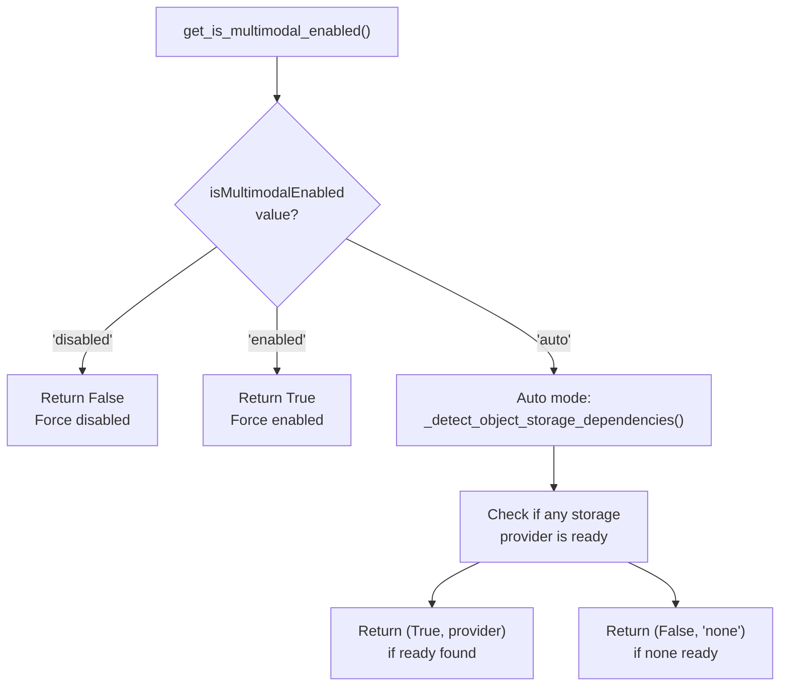
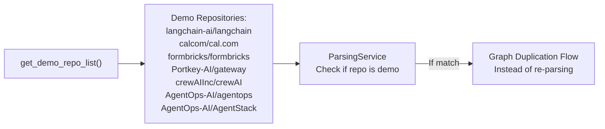
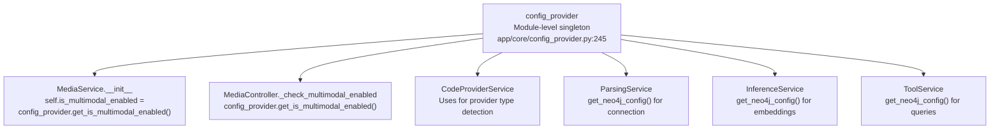
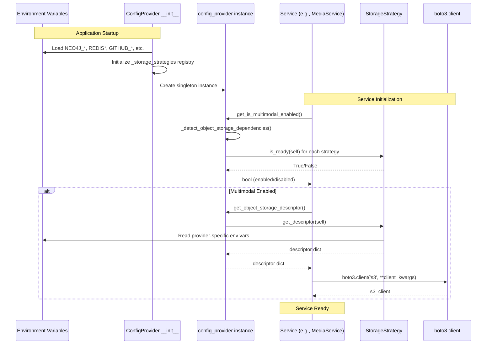

8.1-Configuration Provider

# Page: Configuration Provider

# Configuration Provider

<details>
<summary>Relevant source files</summary>

The following files were used as context for generating this wiki page:

- [app/core/config_provider.py](app/core/config_provider.py)
- [app/modules/code_provider/code_provider_service.py](app/modules/code_provider/code_provider_service.py)
- [app/modules/code_provider/local_repo/local_repo_service.py](app/modules/code_provider/local_repo/local_repo_service.py)
- [app/modules/intelligence/tools/code_query_tools/get_code_file_structure.py](app/modules/intelligence/tools/code_query_tools/get_code_file_structure.py)
- [app/modules/parsing/graph_construction/parsing_controller.py](app/modules/parsing/graph_construction/parsing_controller.py)

</details>


## Purpose and Scope

The `ConfigProvider` class serves as the central singleton for all environment-based configuration in Potpie. It reads environment variables at startup and provides structured access to configuration across six domains: Neo4j graph database, Redis cache/streams, GitHub authentication, object storage (S3/GCS/Azure), code provider settings, and feature flags. This document covers configuration loading, the storage strategy pattern for multi-cloud object storage, and the Neo4j override mechanism for library usage.

For information about how configuration is used in specific subsystems, see:
- Media storage implementation: [Media Service and Storage](#8.2)
- Environment variable reference: [Environment Configuration](#8.3)
- Secret management: [Secret Management](#8.4)

---

## Configuration Architecture

The `ConfigProvider` class is instantiated once as a module-level singleton (`config_provider` at [app/core/config_provider.py:245]()) and accessed throughout the application via direct import. It loads all environment variables on initialization and exposes them through typed accessor methods.

### Configuration Domains and Consumers

```mermaid
graph TB
    subgraph "ConfigProvider Singleton"
        CP[ConfigProvider<br/>config_provider]
        
        Neo4jConf["Neo4j Config<br/>get_neo4j_config()"]
        RedisConf["Redis Config<br/>get_redis_url()"]
        GitHubConf["GitHub Config<br/>get_github_key()<br/>is_github_configured()"]
        StorageConf["Object Storage Config<br/>get_object_storage_descriptor()<br/>get_media_storage_backend()"]
        CodeProvConf["Code Provider Config<br/>get_code_provider_type()<br/>get_code_provider_token()"]
        FeatureFlags["Feature Flags<br/>get_is_development_mode()<br/>get_is_multimodal_enabled()"]
        
        CP --> Neo4jConf
        CP --> RedisConf
        CP --> GitHubConf
        CP --> StorageConf
        CP --> CodeProvConf
        CP --> FeatureFlags
    end
    
    subgraph "Environment Variables"
        EnvNeo4j["NEO4J_URI<br/>NEO4J_USERNAME<br/>NEO4J_PASSWORD"]
        EnvRedis["REDISHOST<br/>REDISPORT<br/>REDISUSER<br/>REDISPASSWORD"]
        EnvGitHub["GITHUB_PRIVATE_KEY<br/>GITHUB_APP_ID"]
        EnvStorage["GCS_PROJECT_ID<br/>GCS_BUCKET_NAME<br/>S3_BUCKET_NAME<br/>AWS_REGION<br/>AZURE_*"]
        EnvCodeProv["CODE_PROVIDER<br/>CODE_PROVIDER_BASE_URL<br/>CODE_PROVIDER_TOKEN<br/>CODE_PROVIDER_TOKEN_POOL"]
        EnvFlags["isDevelopmentMode<br/>isMultimodalEnabled<br/>OBJECT_STORAGE_PROVIDER"]
    end
    
    subgraph "Service Consumers"
        ParsingService["ParsingService<br/>Neo4j connection"]
        InferenceService["InferenceService<br/>Neo4j + embeddings"]
        ToolService["ToolService<br/>Neo4j queries"]
        ConvService["ConversationService<br/>Redis streams"]
        CeleryWorkers["Celery Workers<br/>Redis broker"]
        MediaService["MediaService<br/>Object storage"]
        CodeProviderFactory["CodeProviderFactory<br/>Provider selection"]
        AuthService["UnifiedAuthService<br/>GitHub validation"]
        MediaController["MediaController<br/>Feature flag checks"]
    end
    
    EnvNeo4j -.loads.-> Neo4jConf
    EnvRedis -.loads.-> RedisConf
    EnvGitHub -.loads.-> GitHubConf
    EnvStorage -.loads.-> StorageConf
    EnvCodeProv -.loads.-> CodeProvConf
    EnvFlags -.loads.-> FeatureFlags
    
    Neo4jConf --> ParsingService
    Neo4jConf --> InferenceService
    Neo4jConf --> ToolService
    
    RedisConf --> ConvService
    RedisConf --> CeleryWorkers
    
    GitHubConf --> AuthService
    GitHubConf --> CodeProviderFactory
    
    StorageConf --> MediaService
    
    CodeProvConf --> CodeProviderFactory
    
    FeatureFlags --> MediaController
    FeatureFlags --> MediaService
```



**Sources:** [app/core/config_provider.py:19-245]()

---

## Configuration Categories

### Neo4j Graph Database Configuration

The `ConfigProvider` stores Neo4j connection parameters and provides a class-level override mechanism for library usage where environment variables may not be available.



| Method | Purpose | Return Type |
|--------|---------|-------------|
| `__init__()` | Loads `NEO4J_URI`, `NEO4J_USERNAME`, `NEO4J_PASSWORD` from environment | N/A |
| `get_neo4j_config()` | Returns override if set, otherwise instance config | `dict` |
| `set_neo4j_override(config)` | Class method to inject Neo4j config without env vars | `None` |
| `clear_neo4j_override()` | Clears the class-level override | `None` |

The override mechanism exists for the PotpieRuntime library, which can be used as a Python package where environment variables are not appropriate. When `set_neo4j_override()` is called with a config dict, all subsequent calls to `get_neo4j_config()` return the override instead of the environment-based config.

**Sources:** [app/core/config_provider.py:20-73]()

---

### Redis Configuration

Redis is used for both Celery task queue (broker) and conversation streaming. The `get_redis_url()` method constructs a Redis connection URL from component environment variables.



Additional static methods provide Redis Stream-specific configuration:

| Method | Environment Variable | Default | Purpose |
|--------|---------------------|---------|---------|
| `get_stream_ttl_secs()` | `REDIS_STREAM_TTL_SECS` | `900` (15 min) | TTL for conversation streams |
| `get_stream_maxlen()` | `REDIS_STREAM_MAX_LEN` | `1000` | Max messages per stream |
| `get_stream_prefix()` | `REDIS_STREAM_PREFIX` | `"chat:stream"` | Stream key prefix |

**Sources:** [app/core/config_provider.py:142-217]()

---

### GitHub Authentication Configuration

GitHub integration requires both a GitHub App private key and App ID. The configuration is used by authentication services and code providers.



The `is_github_configured()` method returns `True` only if both `GITHUB_PRIVATE_KEY` and `GITHUB_APP_ID` are present, ensuring complete GitHub App configuration before allowing GitHub-dependent features.

**Sources:** [app/core/config_provider.py:28-80](), [app/core/config_provider.py:75-80]()

---

### Object Storage Configuration

Object storage configuration uses a **strategy pattern** to support multiple cloud providers (S3, GCS, Azure) with automatic detection. The configuration can be explicitly set via `OBJECT_STORAGE_PROVIDER` or auto-detected based on available credentials.

#### Storage Strategy Pattern



**Strategy Implementations** (from `app/core/storage_strategies.py`):

| Strategy | Required Environment Variables | Descriptor Output |
|----------|-------------------------------|-------------------|
| `S3StorageStrategy` | `S3_BUCKET_NAME`, `AWS_REGION`, `AWS_ACCESS_KEY_ID`, `AWS_SECRET_ACCESS_KEY` | `{'provider': 's3', 'bucket_name': ..., 'client_kwargs': {'region_name': ..., 'aws_access_key_id': ..., 'aws_secret_access_key': ...}}` |
| `GCSStorageStrategy` | `GCS_BUCKET_NAME`, `GCS_PROJECT_ID`, `GOOGLE_APPLICATION_CREDENTIALS` | `{'provider': 'gcs', 'bucket_name': ..., 'client_kwargs': {'endpoint_url': 'https://storage.googleapis.com', 'region_name': 'auto', ...}}` |
| `AzureStorageStrategy` | `AZURE_STORAGE_BUCKET_NAME`, `AZURE_STORAGE_ACCOUNT_NAME`, `AZURE_STORAGE_ACCOUNT_KEY` | `{'provider': 'azure', 'bucket_name': ..., 'client_kwargs': {'endpoint_url': 'https://<account>.blob.core.windows.net', ...}}` |

Each strategy implements two methods:
- `is_ready(config)`: Returns `True` if all required environment variables are present
- `get_descriptor(config)`: Builds a descriptor dict for boto3 client initialization

**Sources:** [app/core/config_provider.py:36-206](), [app/modules/media/media_service.py:47-90]()

---

### Code Provider Configuration

Code provider settings determine which repository access backend to use (GitHub, GitBucket, Local) and how to authenticate.



The token pool mechanism allows distributing API requests across multiple tokens to avoid rate limiting. When `CODE_PROVIDER_TOKEN_POOL` is set, the factory cycles through tokens on each request.

**Sources:** [app/core/config_provider.py:219-242](), [app/modules/code_provider/code_provider_service.py:200-262]()

---

### Feature Flags

Feature flags control optional functionality that may require additional configuration or resources.

| Flag Method | Environment Variable | Values | Purpose |
|-------------|---------------------|--------|---------|
| `get_is_development_mode()` | `isDevelopmentMode` | `"enabled"` / `"disabled"` | Bypasses auth, uses default user |
| `get_is_multimodal_enabled()` | `isMultimodalEnabled` | `"enabled"` / `"disabled"` / `"auto"` | Controls image upload/vision features |

#### Multimodal Enable Logic



In auto mode, multimodal is enabled if at least one object storage provider has complete credentials configured. This allows multimodal features to automatically activate when storage is available without requiring explicit configuration.

**Sources:** [app/core/config_provider.py:29-30](), [app/core/config_provider.py:154-206](), [app/modules/media/media_controller.py:32-41]()

---

## Demo Repository List

The `get_demo_repo_list()` method returns a hardcoded list of popular repositories used for demonstration and testing. These repositories have pre-built knowledge graphs that can be duplicated rather than re-parsed.



Each demo repo includes:
- `id`: Demo identifier (e.g., `"demo8"`)
- `name`: Repository name
- `full_name`: Owner/repo format
- `owner`: Repository owner
- `url`: GitHub URL
- `private`: Always `False`

**Sources:** [app/core/config_provider.py:82-140]()

---

## Singleton Instance and Usage

The `ConfigProvider` is instantiated as a module-level singleton at the bottom of the config file:

```python
config_provider = ConfigProvider()
```

This instance is imported throughout the codebase:



**Usage Pattern:**

```python
from app.core.config_provider import config_provider

# Direct method calls
neo4j_config = config_provider.get_neo4j_config()
redis_url = config_provider.get_redis_url()
is_dev = config_provider.get_is_development_mode()
```

**Sources:** [app/core/config_provider.py:245](), [app/modules/media/media_service.py:13](), [app/modules/media/media_controller.py:8]()

---

## Configuration Loading Flow

The complete configuration initialization and access flow:



**Sources:** [app/core/config_provider.py:22-50](), [app/modules/media/media_service.py:47-90]()

---

## Error Handling

The `ConfigProvider` defines `MediaServiceConfigError` for configuration-related errors:

| Error Condition | Raised By | Message |
|----------------|-----------|---------|
| Unsupported storage provider | `get_object_storage_descriptor()` | `"Unsupported storage provider: {backend}"` |
| Missing required env vars | `StorageStrategy.get_descriptor()` | `"Missing required environment variable: {var}"` |
| Invalid provider value | `MediaService.__init__()` | `"Unsupported storage provider configured: {provider}"` |

**Sources:** [app/core/config_provider.py:15-16](), [app/core/config_provider.py:178-188](), [app/modules/media/media_service.py:59-65]()

---

## Configuration Table Reference

### Complete Environment Variable Mapping

| Domain | Environment Variable | Config Method | Type | Default |
|--------|---------------------|---------------|------|---------|
| **Neo4j** | `NEO4J_URI` | `get_neo4j_config()['uri']` | string | None |
| | `NEO4J_USERNAME` | `get_neo4j_config()['username']` | string | None |
| | `NEO4J_PASSWORD` | `get_neo4j_config()['password']` | string | None |
| **Redis** | `REDISHOST` | `get_redis_url()` | string | `"localhost"` |
| | `REDISPORT` | `get_redis_url()` | int | `6379` |
| | `REDISUSER` | `get_redis_url()` | string | `""` |
| | `REDISPASSWORD` | `get_redis_url()` | string | `""` |
| | `REDIS_STREAM_TTL_SECS` | `get_stream_ttl_secs()` | int | `900` |
| | `REDIS_STREAM_MAX_LEN` | `get_stream_maxlen()` | int | `1000` |
| | `REDIS_STREAM_PREFIX` | `get_stream_prefix()` | string | `"chat:stream"` |
| **GitHub** | `GITHUB_PRIVATE_KEY` | `get_github_key()` | string | None |
| | `GITHUB_APP_ID` | `is_github_configured()` | string | None |
| **S3** | `S3_BUCKET_NAME` | `get_object_storage_descriptor()` | string | None |
| | `AWS_REGION` | `get_object_storage_descriptor()` | string | None |
| | `AWS_ACCESS_KEY_ID` | `get_object_storage_descriptor()` | string | None |
| | `AWS_SECRET_ACCESS_KEY` | `get_object_storage_descriptor()` | string | None |
| **GCS** | `GCS_BUCKET_NAME` | `get_object_storage_descriptor()` | string | None |
| | `GCS_PROJECT_ID` | `get_object_storage_descriptor()` | string | None |
| | `GOOGLE_APPLICATION_CREDENTIALS` | `get_object_storage_descriptor()` | string | None |
| **Azure** | `AZURE_STORAGE_BUCKET_NAME` | `get_object_storage_descriptor()` | string | None |
| | `AZURE_STORAGE_ACCOUNT_NAME` | `get_object_storage_descriptor()` | string | None |
| | `AZURE_STORAGE_ACCOUNT_KEY` | `get_object_storage_descriptor()` | string | None |
| **Code Provider** | `CODE_PROVIDER` | `get_code_provider_type()` | string | `"github"` |
| | `CODE_PROVIDER_BASE_URL` | `get_code_provider_base_url()` | string | None |
| | `CODE_PROVIDER_TOKEN` | `get_code_provider_token()` | string | None |
| | `CODE_PROVIDER_TOKEN_POOL` | `get_code_provider_token_pool()` | list | `[]` |
| | `CODE_PROVIDER_USERNAME` | `get_code_provider_username()` | string | None |
| | `CODE_PROVIDER_PASSWORD` | `get_code_provider_password()` | string | None |
| **Feature Flags** | `isDevelopmentMode` | `get_is_development_mode()` | bool | `False` |
| | `isMultimodalEnabled` | `get_is_multimodal_enabled()` | bool | Auto |
| | `OBJECT_STORAGE_PROVIDER` | `get_media_storage_backend()` | string | `"auto"` |

**Sources:** [app/core/config_provider.py:22-242]()