3.1-Conversation Service and Lifecycle

# Page: Conversation Service and Lifecycle

# Conversation Service and Lifecycle

<details>
<summary>Relevant source files</summary>

The following files were used as context for generating this wiki page:

- [app/modules/conversations/conversation/conversation_controller.py](app/modules/conversations/conversation/conversation_controller.py)
- [app/modules/conversations/conversation/conversation_schema.py](app/modules/conversations/conversation/conversation_schema.py)
- [app/modules/conversations/conversation/conversation_service.py](app/modules/conversations/conversation/conversation_service.py)
- [app/modules/conversations/conversations_router.py](app/modules/conversations/conversations_router.py)

</details>


The `ConversationService` is the central component that manages the complete lifecycle of user interactions with AI agents. It orchestrates conversation creation, message storage, AI response generation, access control, and status management. The service coordinates between multiple subsystems including the Agent System, Background Processing (Celery), and Real-time Streaming (Redis).

For information about message streaming and real-time updates, see [Message Streaming and Real-time Updates](#3.2). For multimodal image support, see [Multimodal Support](#3.3). For sharing and access control, see [Sharing and Access Control](#3.4).

## Architecture Overview

The Conversation Service integrates with multiple components to provide a complete conversation experience. It uses a layered architecture with synchronous API handling for CRUD operations and asynchronous background processing for AI response generation.

### Component Architecture

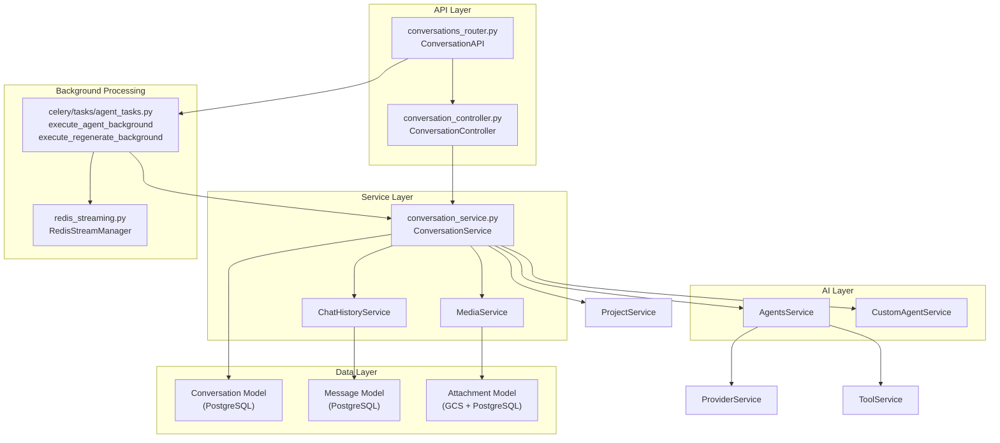

Sources:
- [app/modules/conversations/conversation/conversation_service.py:75-126](). Service architecture and dependencies.
- [app/modules/conversations/conversations_router.py:108-333](). API layer and background task integration.

## Execution Modes

The Conversation Service supports two execution modes for AI response generation:

### Direct Execution (Legacy)

Used for non-streaming requests or when `background=False` is specified. The API request blocks until the complete AI response is generated.

### Background Execution (Default)

The primary execution mode that uses Celery for asynchronous processing and Redis Streams for real-time delivery. This pattern is documented in detail in [Message Streaming and Real-time Updates](#3.2).

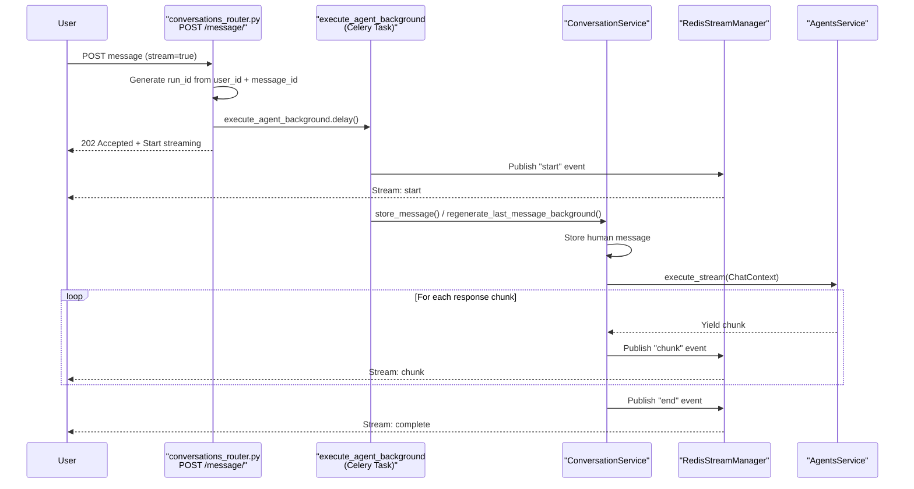

Sources:
- [app/modules/conversations/conversations_router.py:185-333](). Background execution pattern for message posting.
- [app/modules/conversations/conversations_router.py:336-445](). Background execution for message regeneration.
- [app/modules/conversations/conversation/conversation_service.py:531-590](). Background regeneration implementation.

## Core Components

### ConversationService

The `ConversationService` class is the main workhorse of the conversation system, providing methods for:

1. Creating and managing conversations
2. Storing and retrieving messages
3. Generating AI responses to user messages
4. Handling access control
5. Supporting conversation modifications (renaming, deleting)

The service uses a dependency injection pattern with a factory method `create()` that automatically instantiates all required dependencies including `ProjectService`, `ChatHistoryService`, `ProviderService`, `ToolService`, `PromptService`, `AgentsService`, and `CustomAgentService`.

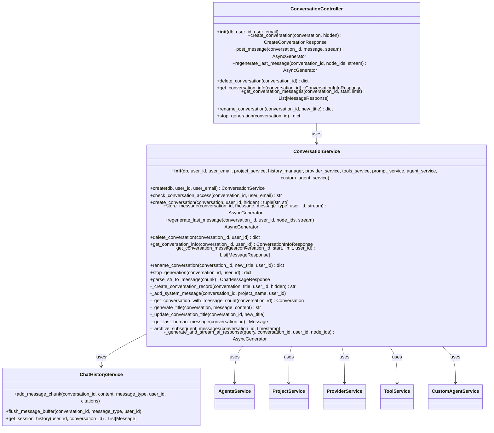

Sources:
- [app/modules/conversations/conversation/conversation_service.py:74-121](). Class definition, constructor and factory method.
- [app/modules/conversations/conversation/conversation_controller.py:27-136](). Controller implementation.

### Data Models

The conversation system uses several key data models with status management:

| Model | Description | Key Fields |
|-------|-------------|------------|
| `Conversation` | Conversation record in PostgreSQL | id (UUID7), user_id, title, status, project_ids, agent_ids, visibility, shared_with_emails, created_at, updated_at |
| `Message` | Message record in PostgreSQL | id, conversation_id, content, type, status, sender_id, citations, has_attachments, created_at |
| `ConversationStatus` | Enum for conversation lifecycle | ACTIVE, ARCHIVED |
| `MessageStatus` | Enum for message lifecycle | ACTIVE, ARCHIVED |
| `MessageType` | Enum for message origin | HUMAN, AI_GENERATED, SYSTEM_GENERATED |
| `Visibility` | Enum for sharing control | PRIVATE, PUBLIC |

**Conversation Status Lifecycle:**
- `ACTIVE`: Default state for user-visible conversations
- `ARCHIVED`: Hidden from UI (used for `hidden=True` parameter during creation or soft deletion)

**Message Status Lifecycle:**
- `ACTIVE`: Default state for visible messages
- `ARCHIVED`: Messages archived during regeneration (subsequent messages after the regenerated human message)

Sources:
- [app/modules/conversations/conversation/conversation_model.py:13-62](). Model definitions and enums.
- [app/modules/conversations/conversation/conversation_schema.py:1-93](). Pydantic schemas.
- [app/modules/conversations/message/message_model.py:1-50](). Message model and enums.

## Conversation Lifecycle

### Conversation Creation

The `create_conversation()` method initializes a new conversation with validation, status setup, and asynchronous project structure loading.

**Creation Flow:**

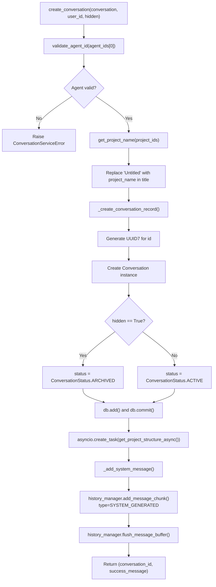

**Hidden Conversations**: When `hidden=True` is passed (common for VSCode extension), the conversation is created with `ConversationStatus.ARCHIVED` to hide it from the web UI while maintaining full functionality.

Sources:
- [app/modules/conversations/conversation/conversation_service.py:182-230](). Conversation creation implementation.
- [app/modules/conversations/conversation/conversation_service.py:232-255](). Record creation with status handling.
- [app/modules/conversations/conversation/conversation_service.py:257-278](). System message addition.

### Conversation Status Management

Conversations transition through status states based on user actions and system operations.

**Status Transition Diagram:**

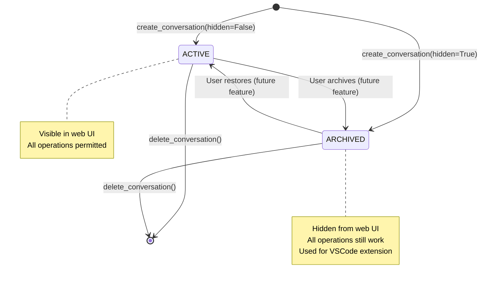

**Delete Operation**: The `delete_conversation()` method performs a hard delete, removing both the conversation record and all associated messages. There is no soft-delete to `DELETED` status.

Sources:
- [app/modules/conversations/conversation/conversation_model.py:13-30](). ConversationStatus enum definition.
- [app/modules/conversations/conversation/conversation_service.py:895-959](). Delete implementation.
- [app/modules/conversations/conversations_router.py:110-128](). Creation endpoint with hidden parameter.

### Title Generation

For new conversations, the service automatically generates a descriptive title after the first human message using the LLM.

**Title Generation Flow:**

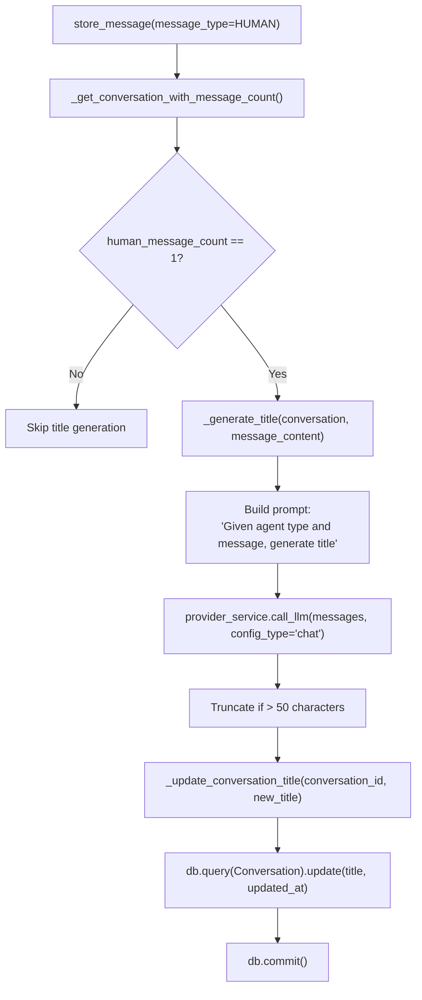

Sources:
- [app/modules/conversations/conversation/conversation_service.py:321-334](). Title generation trigger.
- [app/modules/conversations/conversation/conversation_service.py:403-427](). Title generation implementation.
- [app/modules/conversations/conversation/conversation_service.py:429-433](). Title update.

## Message Processing

### Message Storage Flow

The `store_message()` method handles user message storage, access control, attachment linking, and triggers AI response generation.

**Message Storage Sequence:**

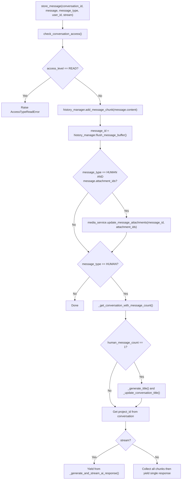

**Attachment Handling**: When `message.attachment_ids` is provided, the service links uploaded media attachments to the message. This enables multimodal processing as documented in [Multimodal Support](#3.3).

Sources:
- [app/modules/conversations/conversation/conversation_service.py:280-379](). Message storage implementation.
- [app/modules/conversations/conversation/conversation_service.py:306-318](). Attachment linking.

### AI Response Generation

The `_generate_and_stream_ai_response()` method orchestrates AI response generation by routing to the appropriate agent type and managing multimodal context.

**Response Generation Flow:**

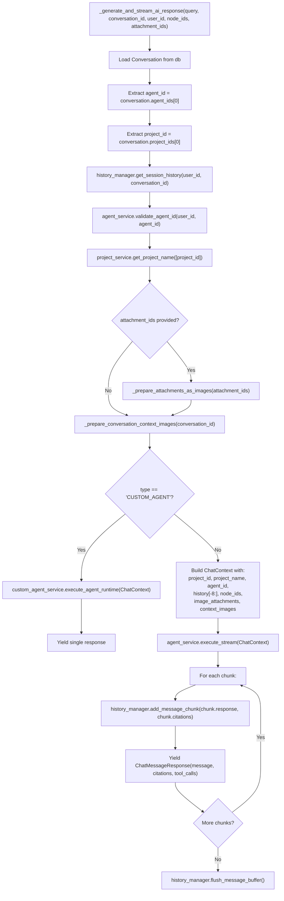

**History Window**: System agents use the last 8 messages (`history[-8:]`) while custom agents use the last 12 messages (`history[-12:]`) for context.

**Multimodal Processing**: When `attachment_ids` is provided, the service prepares base64-encoded images for vision model processing. See [Multimodal Support](#3.3) for details.

Sources:
- [app/modules/conversations/conversation/conversation_service.py:643-780](). AI response generation implementation.
- [app/modules/conversations/conversation/conversation_service.py:681-700](). Multimodal context preparation.
- [app/modules/conversations/conversation/conversation_service.py:702-734](). Custom agent execution path.
- [app/modules/conversations/conversation/conversation_service.py:736-768](). System agent execution path.

### Message Regeneration

The `regenerate_last_message()` and `regenerate_last_message_background()` methods allow users to get alternative AI responses to their last message.

**Regeneration Flow:**

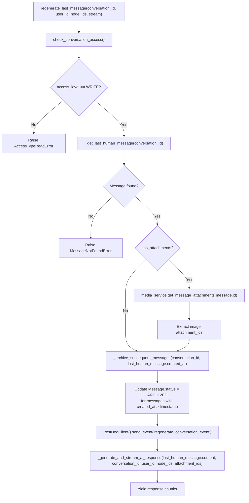

**Background Variant**: `regenerate_last_message_background()` is used by Celery tasks and follows the same logic but without the stream parameter (always streams via Redis).

**Message Archiving**: All messages created after the last human message are set to `MessageStatus.ARCHIVED`, effectively replacing the previous AI response(s) without deleting them.

Sources:
- [app/modules/conversations/conversation/conversation_service.py:435-529](). Public regeneration method.
- [app/modules/conversations/conversation/conversation_service.py:531-590](). Background regeneration variant.
- [app/modules/conversations/conversation/conversation_service.py:603-625](). Message archiving implementation.

## Access Control

The Conversation Service implements a comprehensive access control system that determines what actions users can perform on a conversation.

Access levels include:
- `WRITE`: The user can send messages and modify the conversation (creator only)
- `READ`: The user can view but not modify the conversation (shared users)
- `NOT_FOUND`: The user has no access to the conversation

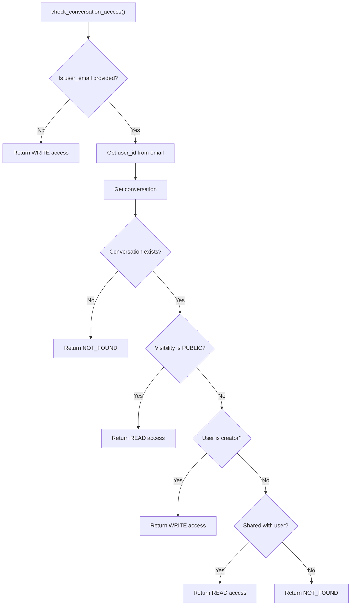

Sources:
- [app/modules/conversations/conversation/conversation_service.py:123-158](). Access control implementation.
- [app/modules/conversations/conversation/conversation_schema.py:21-29](). Access type enum definition.

## API Integration

The conversation system exposes RESTful endpoints through `conversations_router.py` with authentication and usage limit enforcement.

### Core Endpoints

| Endpoint | Method | Description | Usage Limit | Background Execution |
|----------|--------|-------------|-------------|----------------------|
| `POST /conversations/` | POST | Create conversation | ✓ | No |
| `POST /conversations/{id}/message/` | POST | Send message | ✓ | Yes (default) |
| `POST /conversations/{id}/regenerate/` | POST | Regenerate response | ✓ | Yes (default) |
| `GET /conversations/{id}/info/` | GET | Get conversation info | ✗ | No |
| `GET /conversations/{id}/messages/` | GET | Get messages with pagination | ✗ | No |
| `PATCH /conversations/{id}/rename/` | PATCH | Rename conversation | ✗ | No |
| `DELETE /conversations/{id}/` | DELETE | Delete conversation | ✗ | No |
| `POST /conversations/{id}/stop/` | POST | Stop generation | ✗ | No |

### Session Management Endpoints

For reconnection and status checking with background tasks:

| Endpoint | Method | Description |
|----------|--------|-------------|
| `GET /conversations/{id}/active-session` | GET | Get active session info |
| `GET /conversations/{id}/task-status` | GET | Get background task status |
| `POST /conversations/{id}/resume/{session_id}` | POST | Resume streaming from cursor |

### Sharing Endpoints

| Endpoint | Method | Description |
|----------|--------|-------------|
| `POST /conversations/share` | POST | Share with emails |
| `GET /conversations/{id}/shared-emails` | GET | Get shared emails |
| `DELETE /conversations/{id}/access` | DELETE | Remove access |

Sources:
- [app/modules/conversations/conversations_router.py:108-128](). Conversation creation.
- [app/modules/conversations/conversations_router.py:185-333](). Message posting with background execution.
- [app/modules/conversations/conversations_router.py:336-445](). Regeneration with background execution.
- [app/modules/conversations/conversations_router.py:486-541](). Session management endpoints.
- [app/modules/conversations/conversations_router.py:591-643](). Sharing endpoints.

### Run ID Generation

Background tasks use deterministic run IDs for session management and reconnection support:

```python
def _normalize_run_id(conversation_id, user_id, session_id, prev_human_message_id):
    """
    Format: conversation:{user_id}:{prev_human_message_id}
    Defaults to 'new' if no prev_human_message_id provided
    """
    if session_id:
        return session_id
    message_id = prev_human_message_id if prev_human_message_id else "new"
    return f"conversation:{user_id}:{message_id}"
```

This enables clients to reconnect to the same stream if disconnected. See [Message Streaming and Real-time Updates](#3.2) for details.

Sources:
- [app/modules/conversations/conversations_router.py:44-60](). Run ID normalization.
- [app/modules/conversations/conversations_router.py:273-293](). Run ID uniqueness check.

## Service Dependencies

The `ConversationService` coordinates between multiple subsystems through dependency injection.

### Dependency Initialization

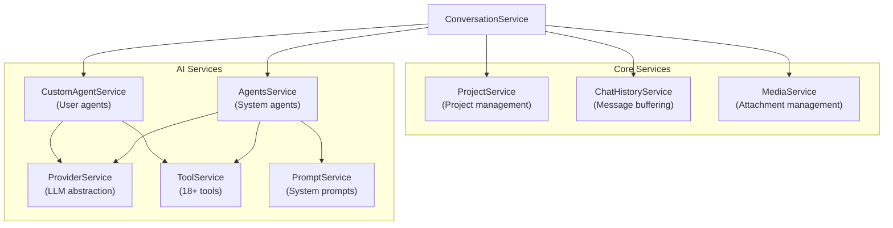

**Factory Pattern**: The `ConversationService.create()` class method instantiates all dependencies automatically:

```python
@classmethod
def create(cls, db: Session, user_id: str, user_email: str):
    project_service = ProjectService(db)
    history_manager = ChatHistoryService(db)
    provider_service = ProviderService(db, user_id)
    tool_service = ToolService(db, user_id)
    prompt_service = PromptService(db)
    agent_service = AgentsService(db, provider_service, prompt_service, tool_service)
    custom_agent_service = CustomAgentService(db, provider_service, tool_service)
    media_service = MediaService(db)
    return cls(db, user_id, user_email, project_service, history_manager, 
               provider_service, tool_service, prompt_service, agent_service, 
               custom_agent_service, media_service)
```

Sources:
- [app/modules/conversations/conversation/conversation_service.py:76-100](). Constructor with all dependencies.
- [app/modules/conversations/conversation/conversation_service.py:102-126](). Factory method implementation.

## Error Handling

The Conversation Service implements a comprehensive error handling strategy with custom exception types:

| Exception | Purpose |
|-----------|---------|
| `ConversationServiceError` | Base exception for conversation-related errors |
| `ConversationNotFoundError` | Raised when a requested conversation doesn't exist |
| `MessageNotFoundError` | Raised when a requested message doesn't exist |
| `AccessTypeNotFoundError` | Raised when access level can't be determined |
| `AccessTypeReadError` | Raised when a user has read-only access but attempts to modify |
| `ShareChatServiceError` | Raised for errors related to sharing conversations |

Sources:
- [app/modules/conversations/conversation/conversation_service.py:54-71](). Exception definitions.
- [app/modules/conversations/access/access_service.py:13-16](). Sharing exception definition.

## Summary

The Conversation Service is a critical component that enables user interaction with AI agents through persistent conversations. It manages the entire lifecycle of conversations, from creation to deletion, handles message processing, enables AI response generation, and implements access control for shared conversations.

The service is designed to be robust, with comprehensive error handling, and efficient, supporting streaming responses for better user experience. It integrates tightly with other parts of the Potpie system, particularly the Agent System for generating intelligent responses and the Project System for context about the codebase being discussed.