3-Conversation System

# Page: Conversation System

# Conversation System

<details>
<summary>Relevant source files</summary>

The following files were used as context for generating this wiki page:

- [app/modules/conversations/conversation/conversation_controller.py](app/modules/conversations/conversation/conversation_controller.py)
- [app/modules/conversations/conversation/conversation_schema.py](app/modules/conversations/conversation/conversation_schema.py)
- [app/modules/conversations/conversation/conversation_service.py](app/modules/conversations/conversation/conversation_service.py)
- [app/modules/conversations/conversations_router.py](app/modules/conversations/conversations_router.py)

</details>


## Purpose and Scope

The Conversation System manages chat-based interactions between users and AI agents for codebase analysis. It orchestrates the complete lifecycle of conversations, from creation through message exchange to deletion, while providing real-time streaming responses via Server-Sent Events (SSE). The system integrates with the Agent System (see [2.2](#2.2)) for AI execution, PostgreSQL for persistence, and Redis Streams for resumable real-time communication.

This document covers conversation management, message handling, and streaming architecture. For AI agent execution details, see [Agent System Architecture](#2.2). For authentication and access control foundations, see [Authentication and User Management](#7).

**Sources:** [app/modules/conversations/conversation/conversation_service.py:1-109](), [Diagram 1, Diagram 2]()

## Architecture Overview

The Conversation System implements a three-layer architecture separating API routing, business logic, and data persistence.

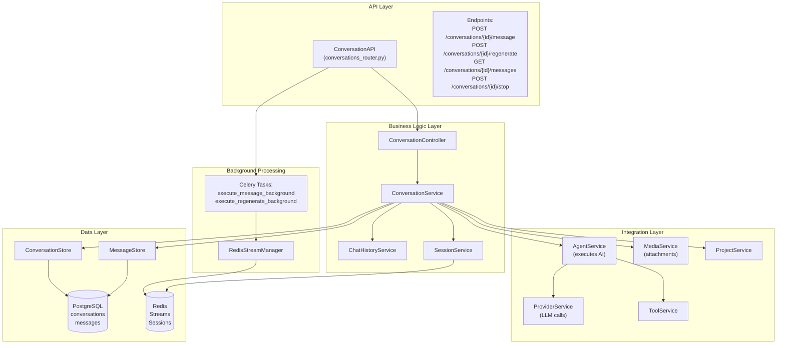

**Component Responsibilities:**

| Component | Responsibility | File Path |
|-----------|---------------|-----------|
| `ConversationAPI` | FastAPI route handlers, request validation | [conversations_router.py:58-622]() |
| `ConversationController` | HTTP-to-service translation, error mapping | [conversation_controller.py:33-224]() |
| `ConversationService` | Core business logic, orchestration | [conversation_service.py:73-165]() |
| `ConversationStore` | Conversation CRUD operations | [conversation_store.py]() |
| `MessageStore` | Message CRUD operations | [message_store.py]() |
| `SessionService` | Active session tracking | [session/session_service.py]() |
| `RedisStreamManager` | Redis Streams pub/sub | [utils/redis_streaming.py]() |

**Sources:** [app/modules/conversations/conversations_router.py:1-50](), [app/modules/conversations/conversation/conversation_controller.py:33-51](), [app/modules/conversations/conversation/conversation_service.py:73-165]()

## Conversation Lifecycle

### Conversation Creation

Conversations are created with a project context and assigned agent. The creation flow includes automatic title generation and system message insertion.

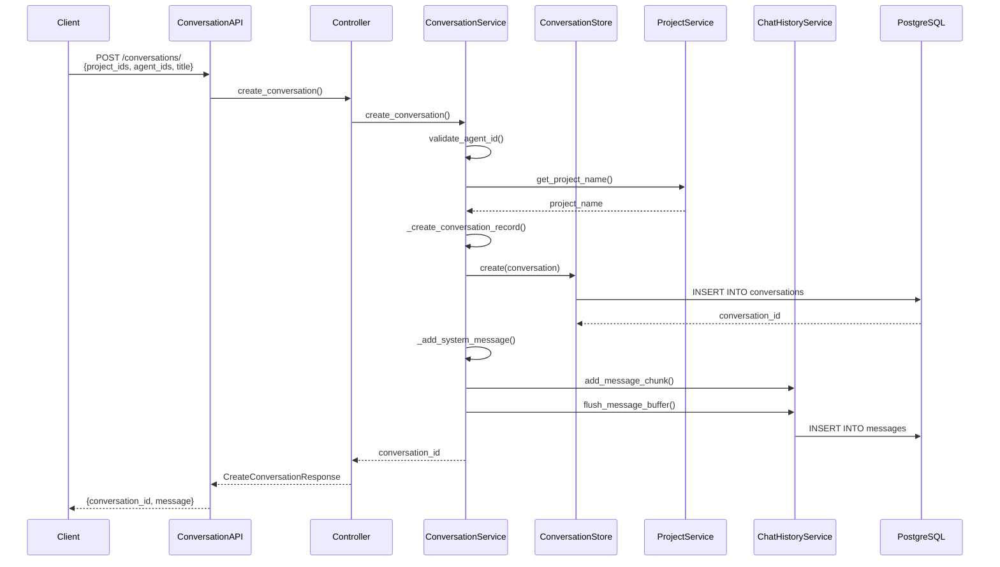

**Key Implementation Details:**

- Conversations are assigned a UUID7 identifier for time-ordered sorting: [conversation_service.py:291]()
- Default status is `ACTIVE` unless `hidden=True` (for background/API conversations): [conversation_service.py:296]()
- System message provides initial context: `"You can now ask questions about the {project_name} repository."`: [conversation_service.py:523]()
- Project structure is fetched asynchronously in the background with 30-second timeout: [conversation_service.py:246-268]()

**Sources:** [app/modules/conversations/conversation/conversation_service.py:216-283](), [app/modules/conversations/conversations_router.py:83-102](), [app/modules/conversations/conversation/conversation_schema.py:13-33]()

### Message Handling and Title Generation

When the first human message arrives, the conversation title is automatically generated via LLM.

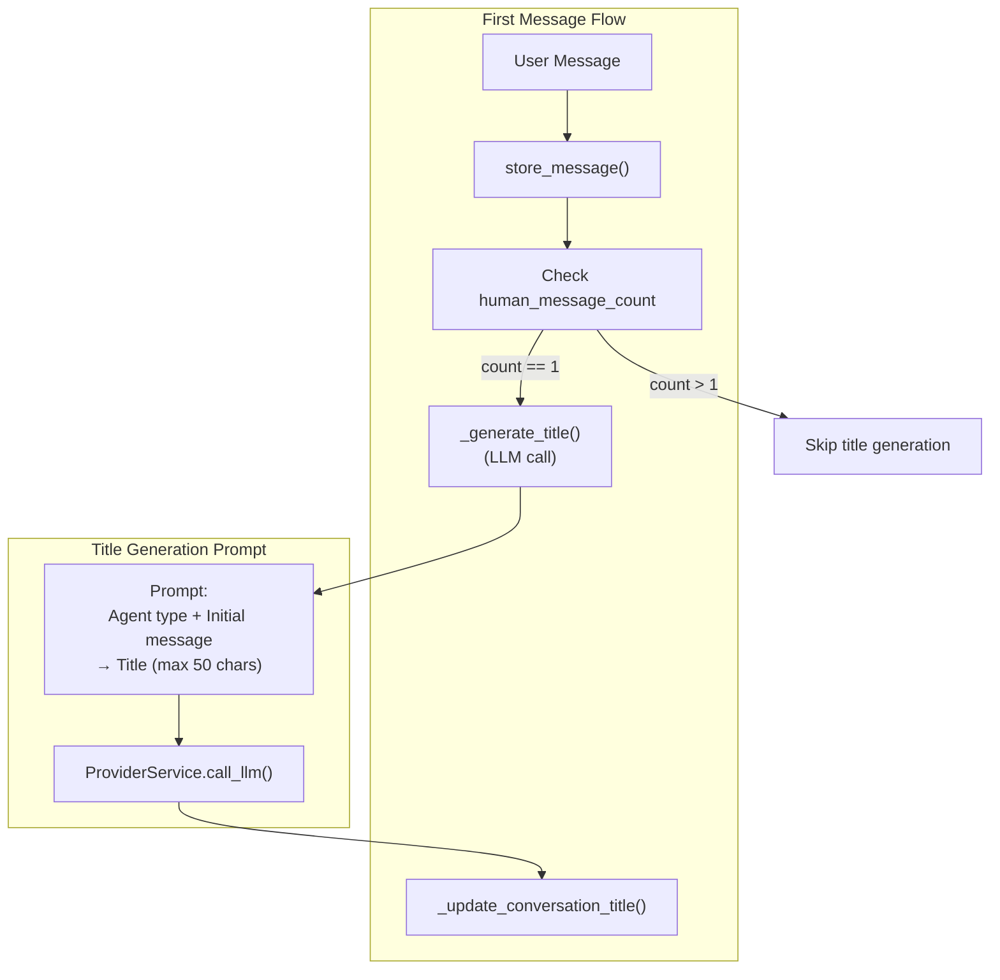

**Title Generation Logic:**

The system generates concise titles on the first message exchange: [conversation_service.py:587-600]()

- Prompt template: `"Given an agent type '{agent_type}' and an initial message '{message}', generate a concise and relevant title for a conversation. The title should be no longer than 50 characters."`: [conversation_service.py:664-668]()
- Titles exceeding 50 characters are truncated with ellipsis: [conversation_service.py:681-682]()
- Uses `config_type="chat"` for faster response: [conversation_service.py:677-679]()

**Sources:** [app/modules/conversations/conversation/conversation_service.py:587-686](), [app/modules/conversations/conversation/conversation_store.py]()

### Message Storage and AI Response

The core message flow integrates with the Agent System to generate AI responses.

```mermaid
graph LR
    subgraph "Message Input"
        USER_MSG["User Message<br/>(content, node_ids, attachments)"]
        VALIDATE["Access Control Check"]
    end
    
    subgraph "Storage Phase"
        ADD_CHUNK["history_manager.add_message_chunk()"]
        FLUSH["history_manager.flush_message_buffer()"]
        LINK_ATT["media_service.update_message_attachments()"]
    end
    
    subgraph "AI Generation Phase"
        PREPARE_CTX["Prepare ChatContext:<br/>- History (last 8 messages)<br/>- Node IDs<br/>- Image attachments<br/>- Project context"]
        EXEC_AGENT["agent_service.execute_stream()"]
        STREAM_RESP["Stream AI Response Chunks"]
    end
    
    USER_MSG --> VALIDATE
    VALIDATE --> ADD_CHUNK
    ADD_CHUNK --> FLUSH
    FLUSH --> LINK_ATT
    LINK_ATT --> PREPARE_CTX
    PREPARE_CTX --> EXEC_AGENT
    EXEC_AGENT --> STREAM_RESP
```

**Implementation Notes:**

- Messages are buffered in `ChatHistoryService` before database flush: [conversation_service.py:561-566]()
- Attachment linking occurs after message creation to ensure message ID exists: [conversation_service.py:570-584]()
- History context is limited to last 8 messages for system agents, 12 for custom agents: [conversation_service.py:956, 988]()
- AI responses are streamed chunk-by-chunk via async generators: [conversation_service.py:998-1012]()

**Sources:** [app/modules/conversations/conversation/conversation_service.py:544-653](), [app/modules/conversations/conversation/conversation_service.py:891-1028]()

## Real-Time Streaming Architecture

The system implements Redis Streams-based architecture for resumable, real-time message streaming.

### Redis Streams and Session Management

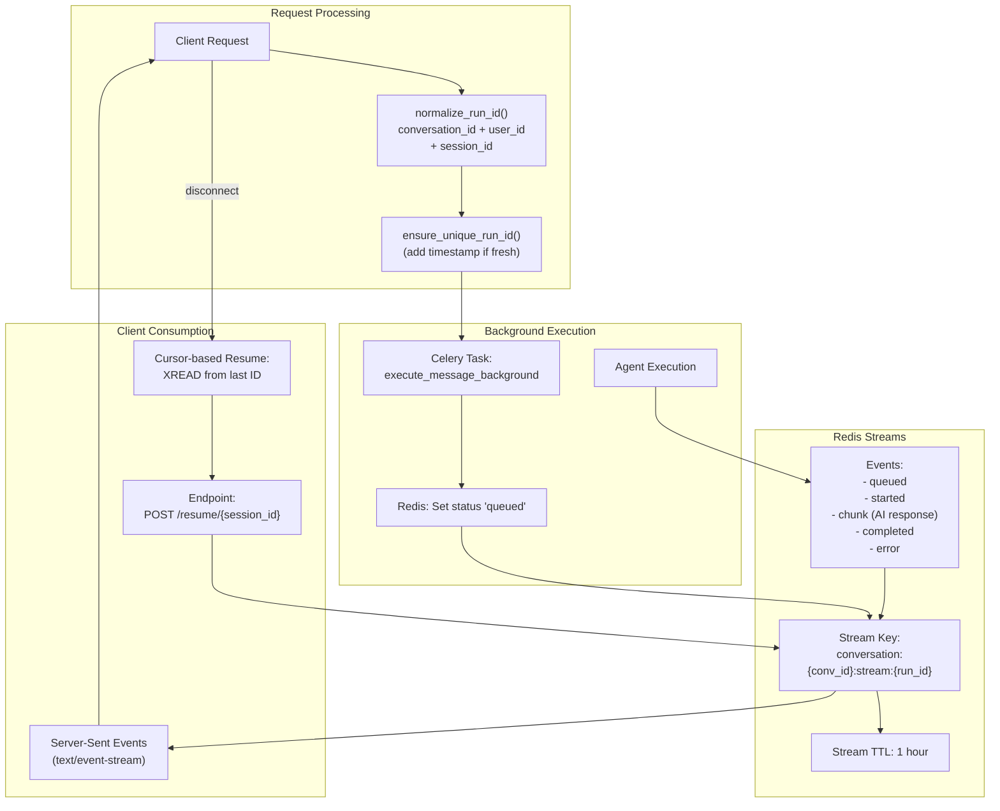

**Run ID Generation:**

The deterministic `run_id` enables multiple clients to share the same stream:

```
run_id = f"{conversation_id}:{user_id}:{session_id or prev_human_message_id or 'default'}"
```

For fresh requests (no cursor), a timestamp suffix ensures uniqueness: [utils/conversation_routing.py]()

**Session Service API:**

| Method | Purpose | Redis Key Pattern |
|--------|---------|------------------|
| `set_task_status()` | Track task lifecycle | `conversation:{conv_id}:status:{run_id}` |
| `set_task_id()` | Store Celery task ID for revocation | `conversation:{conv_id}:task:{run_id}` |
| `get_active_session()` | Retrieve current session metadata | Queries status + stream keys |
| `wait_for_task_start()` | Health check before streaming | Polls status key (30s timeout) |

**Sources:** [app/modules/conversations/utils/conversation_routing.py](), [app/modules/conversations/session/session_service.py](), [app/modules/conversations/utils/redis_streaming.py]()

### Streaming Flow with Background Tasks

The system dispatches long-running AI generation to Celery workers while immediately returning a streaming response.

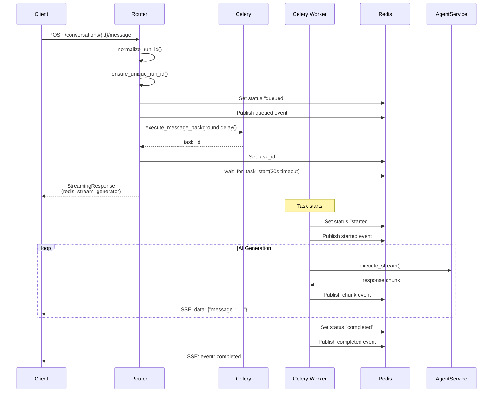

**Stream Event Types:**

| Event Type | Data Structure | Purpose |
|------------|---------------|---------|
| `queued` | `{status: "queued", message: "..."}` | Task accepted by broker |
| `started` | `{status: "started", timestamp: ...}` | Worker began execution |
| `chunk` | `{message: "...", citations: [...], tool_calls: [...]}` | AI response fragment |
| `completed` | `{status: "completed"}` | Generation finished |
| `error` | `{error: "...", details: "..."}` | Execution failure |

**Sources:** [app/modules/conversations/conversations_router.py:161-286](), [app/celery/tasks/agent_tasks.py](), [app/modules/conversations/utils/redis_streaming.py]()

### Resumability and Cursor-Based Replay

Clients can reconnect and resume streaming from their last received event using cursors.

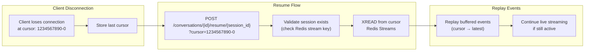

**Resume Endpoint Implementation:**

[app/modules/conversations/conversations_router.py:520-566]()

Key features:
- Validates session exists via Redis stream key: [conversations_router.py:551]()
- Checks task status to determine if generation is still active: [conversations_router.py:557-560]()
- Uses `redis_stream_generator()` with cursor to replay from specific position
- Streams continue to deliver new events if task is still running

**Cursor Format:**

Redis Stream cursors follow the format `{timestamp}-{sequence}`, e.g., `1234567890123-0`. The special cursor `0-0` starts from the beginning of the stream.

**Sources:** [app/modules/conversations/conversations_router.py:520-566](), [app/modules/conversations/utils/conversation_routing.py]()

## Access Control and Sharing

The Conversation System implements three-level access control: WRITE (creator), READ (shared/public), and NOT_FOUND (no access).

### Access Type Determination

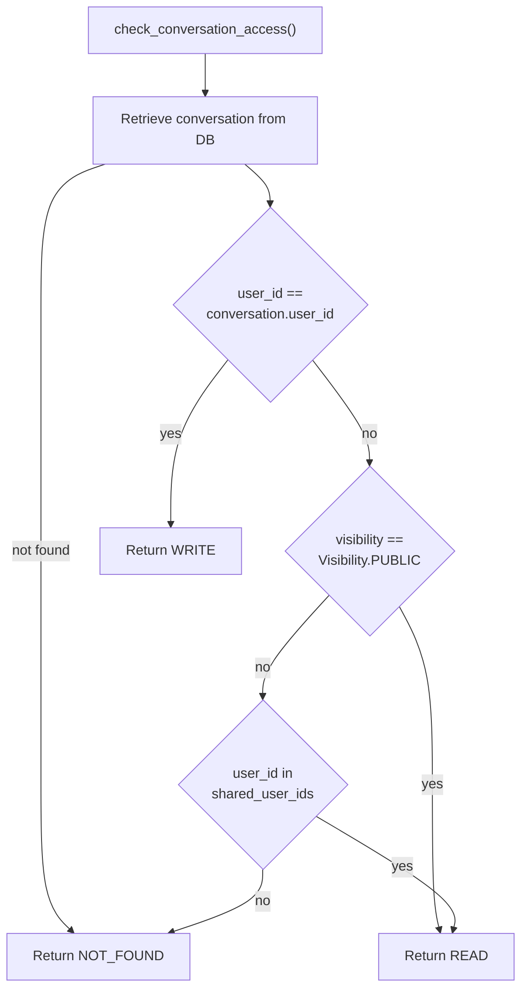

**Access Type Enum:**

[app/modules/conversations/conversation/conversation_schema.py:21-28]()

```python
class ConversationAccessType(str, Enum):
    READ = "read"         # Can view messages, cannot post
    WRITE = "write"       # Full access (creator only)
    NOT_FOUND = "not_found"  # No access
```

**Visibility Levels:**

| Visibility | Access Rules | Use Case |
|-----------|-------------|----------|
| `PRIVATE` | Creator only (WRITE) | Default for new conversations |
| `SHARED` | Creator (WRITE) + shared emails (READ) | Team collaboration |
| `PUBLIC` | Creator (WRITE) + all users (READ) | Public knowledge sharing |

**Access Enforcement:**

- Write operations (post_message, regenerate) require `WRITE` access: [conversation_service.py:559-560, 699-702]()
- Read operations (get_messages) allow `READ` or `WRITE`: [conversation_service.py]()
- Access checks occur before any data modification: [conversation_service.py:166-214]()

**Sources:** [app/modules/conversations/conversation/conversation_service.py:166-214](), [app/modules/conversations/conversation/conversation_schema.py:21-28](), [app/modules/conversations/conversation/conversation_model.py]()

### Sharing Implementation

Conversations can be shared with specific users or made public.

**Sharing Endpoint:**

[app/modules/conversations/conversations_router.py:569-588]()

- Requires creator authentication
- Supports batch email sharing: `POST /conversations/share` with `{conversation_id, recipientEmails[], visibility}`
- Updates `shared_with_emails` array in conversation record
- Also supports access removal: `DELETE /conversations/{id}/access` with `{emails: []}`

**Database Schema:**

The `conversations` table stores shared access:
- `visibility`: Enum (PRIVATE, SHARED, PUBLIC)
- `shared_with_emails`: Array of email addresses

**Sources:** [app/modules/conversations/conversations_router.py:569-621](), [app/modules/conversations/access/access_service.py]()

## Multimodal Support

The system supports image attachments for vision-based code analysis.

### Image Attachment Flow

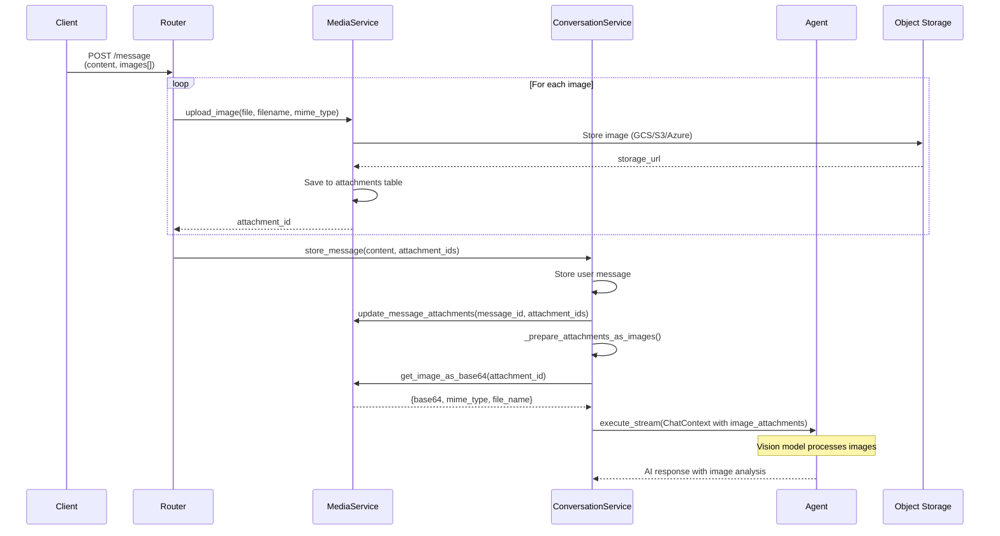

**Attachment Processing:**

1. **Upload Phase**: Images are uploaded before message creation: [conversations_router.py:198-235]()
   - Each image receives a unique `attachment_id`
   - Stored in object storage (GCS/S3/Azure) based on configuration
   - Metadata saved to `attachments` table with `AttachmentType.IMAGE`

2. **Linking Phase**: Attachments are linked to message after storage: [conversation_service.py:570-584]()
   - Updates `message_id` foreign key in attachments table
   - Enables attachment retrieval via message queries

3. **Context Preparation**: Images converted to base64 for AI processing: [conversation_service.py:1046-1096]()
   - Only `AttachmentType.IMAGE` attachments processed
   - Creates dictionary: `{attachment_id: {base64, mime_type, file_name, file_size}}`
   - Passed to agent via `ChatContext.image_attachments`

**Context Images:**

The system also retrieves recent conversation images for context: [conversation_service.py:1126-1138]()
- Fetches images from last 3 messages
- Provides historical visual context to AI
- Separate from current message attachments

**Sources:** [app/modules/conversations/conversation/conversation_service.py:1046-1138](), [app/modules/conversations/conversations_router.py:198-235](), [app/modules/media/media_service.py]()

## Message Regeneration

Users can regenerate the last AI response, useful for exploring alternative explanations or when unsatisfied with the initial response.

### Regeneration Flow

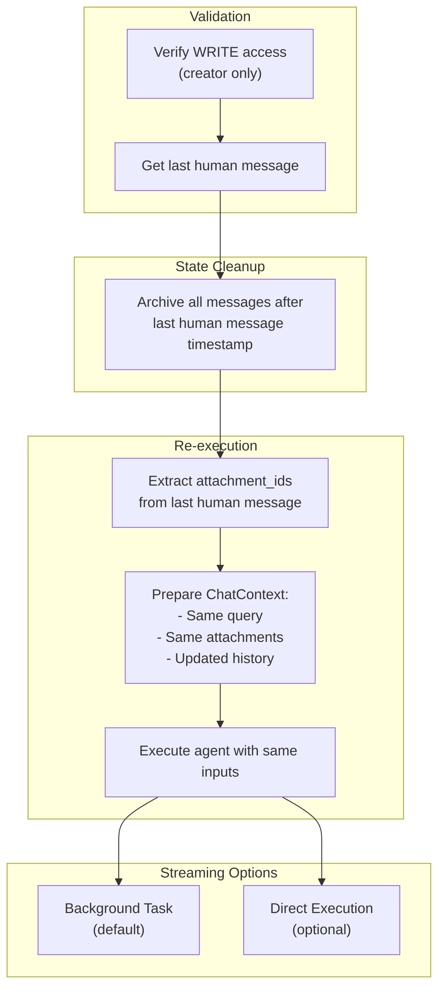

**Key Implementation Details:**

- Only creators have regenerate permission: [conversation_service.py:696-702]()
- Archives subsequent messages to maintain conversation consistency: [conversation_service.py:734-736, 856-873]()
- Extracts attachments from original message for multimodal context: [conversations_router.py:344-366]()
- Uses same agent and project context as original execution
- Supports both direct and background execution modes: [conversations_router.py:317-329]()

**Background Regeneration:**

[app/modules/conversations/conversations_router.py:289-417]()

- Default mode for production use
- Follows same Celery + Redis Streams pattern as message posting
- Task: `execute_regenerate_background.delay(conversation_id, run_id, user_id, node_ids, attachment_ids)`
- Enables resumability if client disconnects during regeneration

**Sources:** [app/modules/conversations/conversation/conversation_service.py:688-783, 785-847](), [app/modules/conversations/conversations_router.py:289-417]()

## Stop Generation

Users can halt ongoing AI generation, useful for long-running queries or incorrect tool invocations.

### Stop Mechanism

```mermaid
graph LR
    subgraph "Client Initiated"
        STOP_REQ["POST /conversations/{id}/stop<br/>?session_id={run_id}"]
        SESSION_SVC["SessionService.stop_session()"]
    end
    
    subgraph "Redis Signaling"
        GET_TASK_ID["Get Celery task_id from Redis"]
        REVOKE["celery_app.control.revoke(task_id)"]
        SET_STATUS["Set status = 'stopped'"]
        PUBLISH["Publish 'stopped' event"]
    end
    
    subgraph "Worker Response"
        TERMINATE["Celery worker terminates task"]
        CLEANUP["Cleanup Redis keys<br/>(with TTL)"]
    end
    
    STOP_REQ --> SESSION_SVC
    SESSION_SVC --> GET_TASK_ID
    GET_TASK_ID --> REVOKE
    REVOKE --> SET_STATUS
    SET_STATUS --> PUBLISH
    PUBLISH --> TERMINATE
    TERMINATE --> CLEANUP
```

**Implementation:**

[app/modules/conversations/conversation/conversation_service.py]()

- Validates creator access before stopping
- Revokes Celery task using stored `task_id`: [session/session_service.py]()
- Publishes `stopped` event to Redis stream for client notification
- Task termination is graceful (worker finishes current operation)

**Session ID Resolution:**

If `session_id` not provided, stops the most recently active session: [session/session_service.py]()

**Sources:** [app/modules/conversations/conversation/conversation_service.py](), [app/modules/conversations/conversations_router.py:433-444](), [app/modules/conversations/session/session_service.py]()

## Background Task Integration

The Conversation System uses Celery for asynchronous message processing, preventing API timeouts during long AI generation.

### Task Dispatch Flow

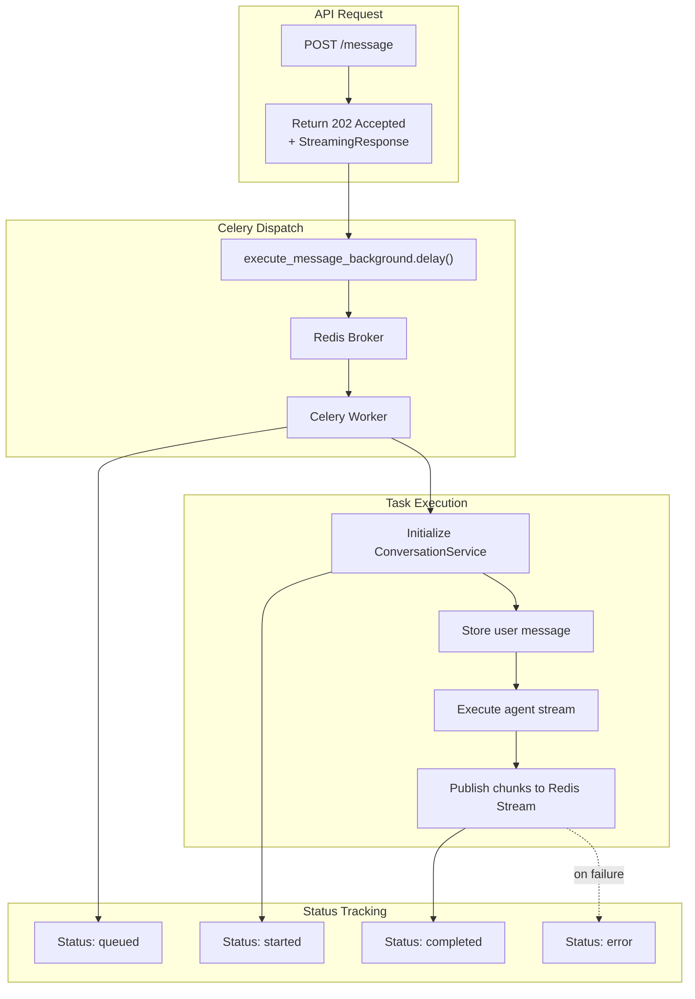

**Celery Tasks:**

| Task Name | Purpose | Arguments |
|-----------|---------|-----------|
| `execute_message_background` | Process new user message | conversation_id, run_id, user_id, query, node_ids, attachment_ids |
| `execute_regenerate_background` | Regenerate last AI response | conversation_id, run_id, user_id, node_ids, attachment_ids |

**Task Status Lifecycle:**

1. **queued**: Task accepted by Celery broker, waiting for worker
2. **started**: Worker began execution, service initialized
3. **streaming**: Agent generating response (implicit during chunk events)
4. **completed**: Generation finished successfully
5. **error**: Execution failed, error details in event data
6. **stopped**: User-initiated cancellation via stop endpoint

**Health Checks:**

The router waits for task startup before returning streaming response: [conversations_router.py:402-411]()
- Timeout: 30 seconds (accommodates queued tasks)
- Polls Redis status key every 100ms
- Warning logged if task doesn't start, but stream consumer waits up to 120s

**Sources:** [app/modules/conversations/conversations_router.py:277-286, 387-399](), [app/celery/tasks/agent_tasks.py](), [app/modules/conversations/utils/redis_streaming.py]()

## Data Model

### Conversation Schema

**Database Table: `conversations`**

| Column | Type | Description |
|--------|------|-------------|
| `id` | UUID (String) | Primary key, UUID7 for time-ordering |
| `user_id` | String | Foreign key to users table (creator) |
| `title` | String | Auto-generated or user-provided title |
| `status` | Enum | ACTIVE, ARCHIVED |
| `project_ids` | Array[String] | Associated project IDs |
| `agent_ids` | Array[String] | Agent IDs (typically single agent) |
| `visibility` | Enum | PRIVATE, SHARED, PUBLIC |
| `shared_with_emails` | Array[String] | Email addresses for SHARED visibility |
| `created_at` | Timestamp | Creation timestamp (UTC) |
| `updated_at` | Timestamp | Last modification timestamp (UTC) |

**Sources:** [app/modules/conversations/conversation/conversation_model.py]()

### Message Schema

**Database Table: `messages`**

| Column | Type | Description |
|--------|------|-------------|
| `id` | UUID (String) | Primary key |
| `conversation_id` | String | Foreign key to conversations |
| `content` | Text | Message text content |
| `type` | Enum | HUMAN, AI_GENERATED, SYSTEM_GENERATED |
| `user_id` | String | Message author |
| `has_attachments` | Boolean | Flag for attachment presence |
| `created_at` | Timestamp | Message timestamp |
| `updated_at` | Timestamp | Last update timestamp |
| `status` | Enum | ACTIVE, ARCHIVED |

**Message Types:**

- `HUMAN`: User-submitted messages
- `AI_GENERATED`: Agent responses
- `SYSTEM_GENERATED`: System notifications (e.g., "You can now ask questions...")

**Sources:** [app/modules/conversations/message/message_model.py]()

### Redis Data Structures

**Stream Keys:**

```
conversation:{conversation_id}:stream:{run_id}
```

Stores event sequence with automatic expiration (1 hour TTL).

**Status Keys:**

```
conversation:{conversation_id}:status:{run_id}
```

Tracks task lifecycle state (queued → started → completed).

**Task ID Keys:**

```
conversation:{conversation_id}:task:{run_id}
```

Stores Celery task ID for revocation support.

**Sources:** [app/modules/conversations/utils/redis_streaming.py](), [app/modules/conversations/session/session_service.py]()

## API Endpoints Reference

| Endpoint | Method | Purpose | Streaming |
|----------|--------|---------|-----------|
| `/conversations/` | POST | Create new conversation | No |
| `/conversations/` | GET | List user's conversations | No |
| `/conversations/{id}/info/` | GET | Get conversation metadata | No |
| `/conversations/{id}/messages/` | GET | Retrieve message history (paginated) | No |
| `/conversations/{id}/message/` | POST | Post new message and get AI response | Yes (SSE) |
| `/conversations/{id}/regenerate/` | POST | Regenerate last AI response | Yes (SSE) |
| `/conversations/{id}/stop/` | POST | Stop active AI generation | No |
| `/conversations/{id}/rename/` | PATCH | Update conversation title | No |
| `/conversations/{id}/` | DELETE | Delete conversation | No |
| `/conversations/{id}/active-session` | GET | Get current session info | No |
| `/conversations/{id}/task-status` | GET | Check background task status | No |
| `/conversations/{id}/resume/{session_id}` | POST | Resume streaming from cursor | Yes (SSE) |
| `/conversations/share` | POST | Share conversation with users | No |
| `/conversations/{id}/shared-emails` | GET | List shared user emails | No |
| `/conversations/{id}/access` | DELETE | Remove user access | No |

**Query Parameters (Streaming Endpoints):**

- `stream`: Boolean, enable/disable streaming (default: true)
- `session_id`: Optional, explicit session identifier
- `prev_human_message_id`: Optional, for deterministic run_id generation
- `cursor`: Optional, Redis stream cursor for resumption (format: `{timestamp}-{sequence}`)
- `background`: Boolean, use Celery background execution (default: true)

**Sources:** [app/modules/conversations/conversations_router.py:60-621]()

## Error Handling

The system defines custom exception hierarchy for precise error reporting:

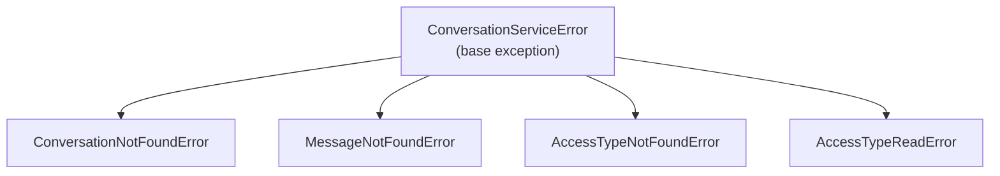

**Exception to HTTP Status Mapping:**

| Exception | HTTP Status | Use Case |
|-----------|-------------|----------|
| `ConversationNotFoundError` | 404 | Conversation ID doesn't exist |
| `MessageNotFoundError` | 404 | No messages available for operation |
| `AccessTypeNotFoundError` | 401 | User has no access to conversation |
| `AccessTypeReadError` | 403 | User has READ access but attempted WRITE operation |
| `ConversationServiceError` | 500 | Generic service failure |

**Controller Error Translation:**

[app/modules/conversations/conversation/conversation_controller.py:66-173]()

The controller translates service exceptions to HTTP responses, ensuring consistent API error contracts.

**Sources:** [app/modules/conversations/conversation/conversation_service.py:53-70](), [app/modules/conversations/conversation/conversation_controller.py:66-173]()

## Integration Points

### Agent System Integration

The Conversation System delegates all AI execution to the Agent System:

- System agents: [conversation_service.py:996]() calls `agent_service.execute_stream(chat_context)`
- Custom agents: [conversation_service.py:950-961]() calls `custom_agent_service.execute_agent_runtime()`
- Receives streaming response chunks with citations and tool calls
- History context automatically prepared with last 8-12 messages

For details on agent orchestration, see [Agent System Architecture](#2.2).

### Provider Service Integration

LLM calls for title generation use the Provider Service abstraction:

- Title generation: [conversation_service.py:677-679]() calls `provider_service.call_llm(messages, config_type="chat")`
- Enables multi-provider support (OpenAI, Anthropic, etc.)
- Automatic retry logic and rate limiting

For LLM provider configuration, see [Provider Service](#2.1).

### Media Service Integration

Image attachments are managed through the Media Service:

- Upload: [conversations_router.py:207]() calls `media_service.upload_image()`
- Retrieval: [conversation_service.py:1058]() calls `media_service.get_attachment()`
- Base64 conversion: [conversation_service.py:1066]() calls `media_service.get_image_as_base64()`
- Storage backend abstraction (GCS/S3/Azure)

For object storage configuration, see [Media Service and Storage](#8.2).

**Sources:** [app/modules/conversations/conversation/conversation_service.py:34-44, 996, 950-961, 677-679, 1058-1068](), [app/modules/conversations/conversations_router.py:200-213]()