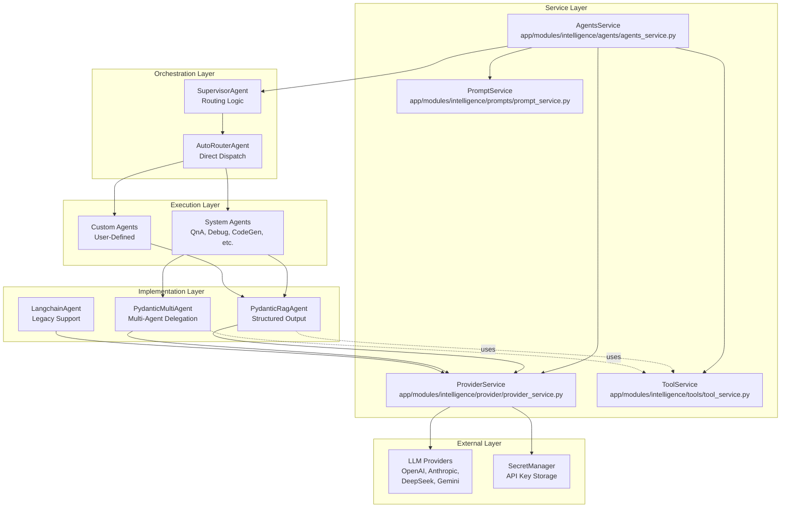
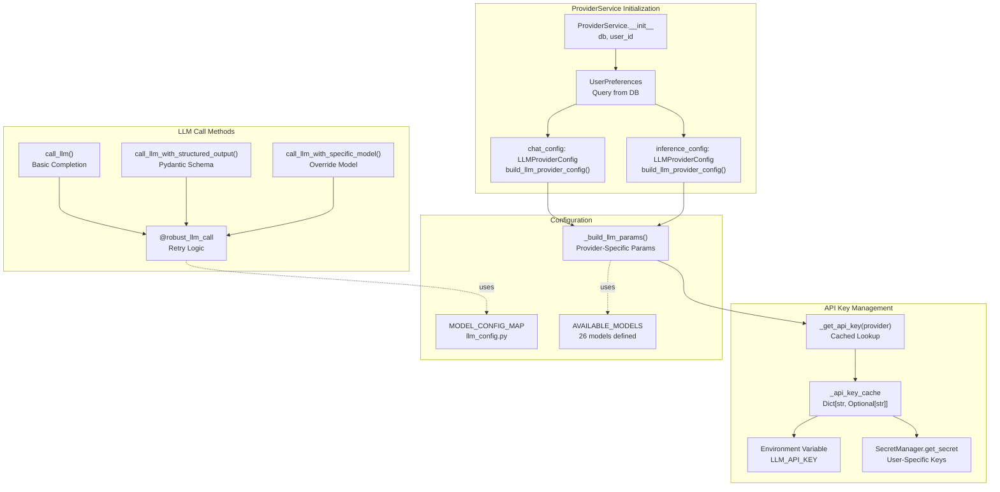
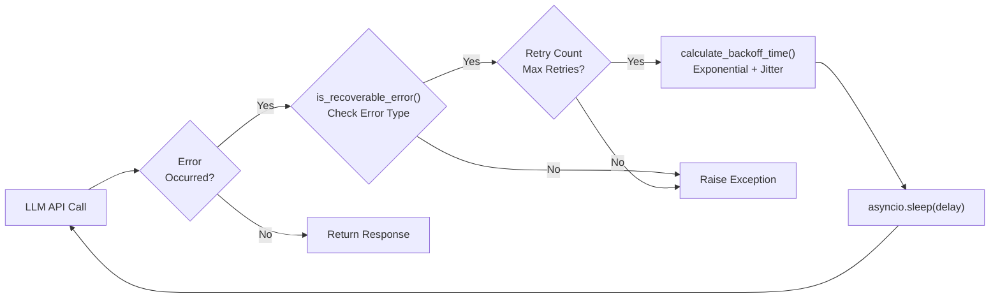
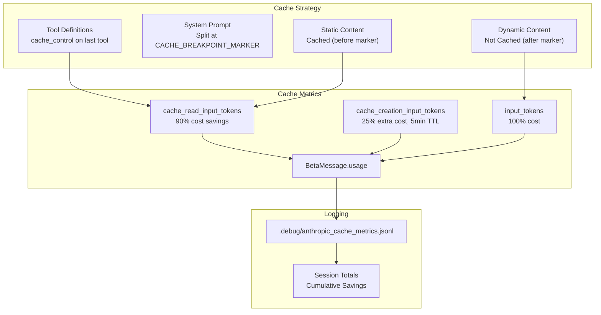
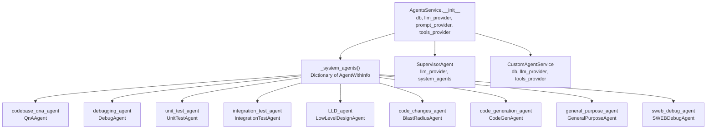
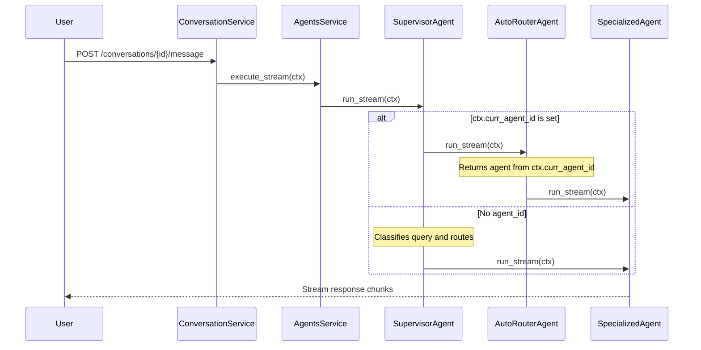
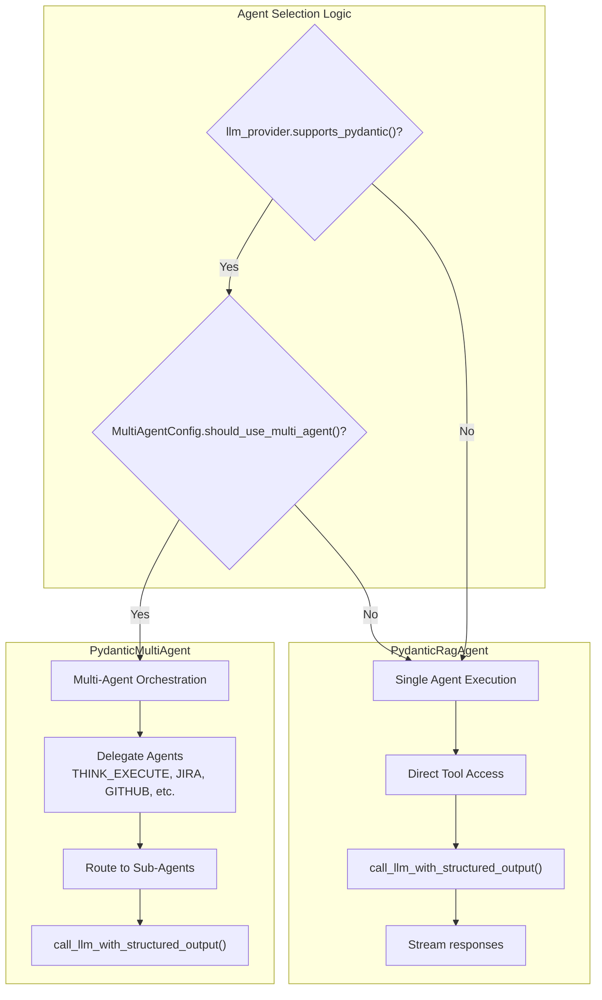
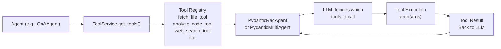
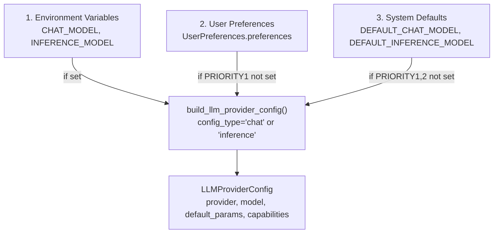

2-Core Intelligence System

# Page: Core Intelligence System

# Core Intelligence System

Relevant source files

The following files were used as context for generating this wiki page:

- [app/modules/intelligence/agents/agents_service.py](app/modules/intelligence/agents/agents_service.py)
- [app/modules/intelligence/agents/chat_agents/auto_router_agent.py](app/modules/intelligence/agents/chat_agents/auto_router_agent.py)
- [app/modules/intelligence/agents/chat_agents/system_agents/general_purpose_agent.py](app/modules/intelligence/agents/chat_agents/system_agents/general_purpose_agent.py)
- [app/modules/intelligence/provider/anthropic_caching_model.py](app/modules/intelligence/provider/anthropic_caching_model.py)
- [app/modules/intelligence/provider/llm_config.py](app/modules/intelligence/provider/llm_config.py)
- [app/modules/intelligence/provider/provider_service.py](app/modules/intelligence/provider/provider_service.py)

## Purpose and Scope

The Core Intelligence System is the AI/LLM integration layer that powers all intelligent interactions in Potpie. This system provides unified abstractions for multiple LLM providers, orchestrates specialized agents, and manages the execution pipeline for AI-powered code analysis tasks. 

This document covers the architecture, components, and orchestration mechanisms of the intelligence layer. For detailed information on specific topics, see:
- Provider implementation details: [Provider Service (LLM Abstraction)](#2.1)
- Agent routing and execution: [Agent System Architecture](#2.2)
- Pre-built agents: [System Agents](#2.3)
- User-defined agents: [Custom Agents](#2.4)
- Execution strategies: [Agent Execution Pipeline](#2.5)
- Prompt handling: [Prompt Management](#2.6)

---

## System Architecture

The Core Intelligence System is organized into four primary service layers that work together to provide AI-powered functionality:

### High-Level Component Diagram

**Sources:**
- [app/modules/intelligence/provider/provider_service.py:1-1600]()
- [app/modules/intelligence/agents/agents_service.py:1-203]()
- [app/modules/intelligence/agents/chat_agents/auto_router_agent.py:1-38]()

---

## Provider Service: Multi-LLM Abstraction

The `ProviderService` class provides a unified interface for interacting with multiple LLM providers. It handles API key management, retry logic, model configuration, and provider-specific adaptations.

### ProviderService Architecture

**Sources:**
- [app/modules/intelligence/provider/provider_service.py:472-580]()
- [app/modules/intelligence/provider/provider_service.py:645-681]()
- [app/modules/intelligence/provider/llm_config.py:1-359]()

### Supported Models and Providers

The system supports 26 LLM models across multiple providers, defined in `AVAILABLE_MODELS`:

| Provider | Models | Capabilities |
|----------|--------|--------------|
| **OpenAI** | `gpt-5.2`, `gpt-5.1`, `gpt-5-mini` | Pydantic, Streaming, Vision, Tool Parallelism |
| **Anthropic** | `claude-sonnet-4-5`, `claude-haiku-4-5`, `claude-opus-4-1`, `claude-sonnet-4`, `claude-3-7-sonnet`, `claude-3-5-haiku`, `claude-opus-4-5` | Pydantic, Streaming, Vision, Tool Parallelism, Prompt Caching |
| **DeepSeek** | `deepseek-chat-v3-0324` | Pydantic, Streaming, Tool Parallelism |
| **Meta-Llama** | `llama-3.3-70b-instruct` | Pydantic, Streaming, Tool Parallelism |
| **Gemini** | `gemini-2.0-flash-001`, `gemini-2.5-pro-preview`, `gemini-3-pro-preview` | Pydantic, Streaming, Vision, Tool Parallelism |
| **Z-AI** | `glm-4.7` | Pydantic, Streaming, Vision |

**Sources:**
- [app/modules/intelligence/provider/provider_service.py:330-460]()
- [app/modules/intelligence/provider/llm_config.py:9-214]()

### Retry Logic and Error Handling

The `ProviderService` implements sophisticated retry logic with exponential backoff to handle transient errors:

The `RetrySettings` class configures retry behavior:

| Setting | Default | Description |
|---------|---------|-------------|
| `max_retries` | 8 | Maximum retry attempts |
| `base_delay` | 2.0s | Base delay for exponential backoff |
| `max_delay` | 120.0s | Maximum delay between retries |
| `step_increase` | 1.8 | Exponential growth factor |
| `jitter_factor` | 0.2 | Random variance to prevent thundering herd |

**Sources:**
- [app/modules/intelligence/provider/provider_service.py:75-259]()
- [app/modules/intelligence/provider/provider_service.py:116-161]()
- [app/modules/intelligence/provider/provider_service.py:163-177]()

### Anthropic Prompt Caching

For Anthropic models, the `CachingAnthropicModel` class automatically enables prompt caching to reduce costs and latency:

Cache hit rates can achieve up to 90% cost reduction and 85% latency improvement for repeated requests with the same tools/prompts.

**Sources:**
- [app/modules/intelligence/provider/anthropic_caching_model.py:1-693]()
- [app/modules/intelligence/provider/anthropic_caching_model.py:419-474]()
- [app/modules/intelligence/provider/anthropic_caching_model.py:544-568]()

---

## Agent Service: Orchestration and Routing

The `AgentsService` class manages the lifecycle of AI agents, routing user queries to the appropriate specialized agent.

### AgentsService Initialization

**Sources:**
- [app/modules/intelligence/agents/agents_service.py:47-66]()
- [app/modules/intelligence/agents/agents_service.py:68-149]()

### Request Routing Flow

The routing flow determines which agent handles a user query:

**Sources:**
- [app/modules/intelligence/agents/agents_service.py:151-156]()
- [app/modules/intelligence/agents/chat_agents/auto_router_agent.py:13-37]()

### ChatContext Structure

Agents receive a `ChatContext` object containing all information needed for execution:

| Field | Type | Description |
|-------|------|-------------|
| `user_id` | `str` | User identifier |
| `project_id` | `str` | Project identifier for knowledge graph |
| `conversation_id` | `str` | Conversation identifier |
| `query` | `str` | User's current query |
| `chat_history` | `List[Message]` | Previous conversation turns |
| `curr_agent_id` | `Optional[str]` | Pre-selected agent ID (bypasses routing) |
| `run_id` | `str` | Unique run identifier for streaming |
| `image_urls` | `Optional[List[str]]` | Image attachments for multimodal context |

**Sources:**
- Implementation references in agent execution files

---

## Agent Execution Strategies

Agents implement the `ChatAgent` interface and use one of several execution strategies:

### PydanticRagAgent vs PydanticMultiAgent

**Sources:**
- [app/modules/intelligence/agents/chat_agents/system_agents/general_purpose_agent.py:37-110]()

### Tool Integration

Agents access tools through the `ToolService`:

For detailed information on available tools and their implementations, see [Tool System](#5).

**Sources:**
- [app/modules/intelligence/agents/chat_agents/system_agents/general_purpose_agent.py:57-62]()

---

## Configuration and Model Selection

Model selection follows a priority hierarchy:

### Configuration Priority Order

**Sources:**
- [app/modules/intelligence/provider/llm_config.py:320-359]()
- [app/modules/intelligence/provider/provider_service.py:482-492]()

### Model Capability Detection

Each model's capabilities are defined in `MODEL_CONFIG_MAP`:

| Capability | Description | Models |
|------------|-------------|--------|
| `supports_pydantic` | Structured output via Pydantic schemas | OpenAI, Anthropic, DeepSeek, Meta-Llama, Gemini |
| `supports_streaming` | Server-Sent Events streaming | All models |
| `supports_vision` | Multimodal image inputs | OpenAI, Anthropic, Gemini, Z-AI |
| `supports_tool_parallelism` | Parallel tool execution | OpenAI, Anthropic, DeepSeek, Meta-Llama, Gemini |

Capabilities can be overridden via environment variables:

- `LLM_SUPPORTS_PYDANTIC`
- `LLM_SUPPORTS_STREAMING`
- `LLM_SUPPORTS_VISION`
- `LLM_SUPPORTS_TOOL_PARALLELISM`

**Sources:**
- [app/modules/intelligence/provider/llm_config.py:217-251]()
- [app/modules/intelligence/provider/llm_config.py:240-250]()

---

## Code Entity Mapping

The following table maps system concepts to concrete code entities:

| System Concept | Code Entity | File Location |
|----------------|-------------|---------------|
| Provider abstraction | `ProviderService` | [app/modules/intelligence/provider/provider_service.py:472]() |
| Model configuration | `LLMProviderConfig` | [app/modules/intelligence/provider/llm_config.py:217]() |
| Model registry | `MODEL_CONFIG_MAP` | [app/modules/intelligence/provider/llm_config.py:9]() |
| Available models | `AVAILABLE_MODELS` | [app/modules/intelligence/provider/provider_service.py:331]() |
| Retry logic | `@robust_llm_call` decorator | [app/modules/intelligence/provider/provider_service.py:206]() |
| Retry settings | `RetrySettings` | [app/modules/intelligence/provider/provider_service.py:75]() |
| Error recovery | `is_recoverable_error()` | [app/modules/intelligence/provider/provider_service.py:116]() |
| Backoff calculation | `calculate_backoff_time()` | [app/modules/intelligence/provider/provider_service.py:163]() |
| Anthropic caching | `CachingAnthropicModel` | [app/modules/intelligence/provider/anthropic_caching_model.py:420]() |
| Agent orchestration | `AgentsService` | [app/modules/intelligence/agents/agents_service.py:47]() |
| System agents | `_system_agents()` | [app/modules/intelligence/agents/agents_service.py:68]() |
| Agent routing | `SupervisorAgent` | Referenced in [app/modules/intelligence/agents/agents_service.py:61]() |
| Direct dispatch | `AutoRouterAgent` | [app/modules/intelligence/agents/chat_agents/auto_router_agent.py:13]() |
| Single-agent execution | `PydanticRagAgent` | Referenced in [app/modules/intelligence/agents/chat_agents/system_agents/general_purpose_agent.py:105]() |
| Multi-agent orchestration | `PydanticMultiAgent` | Referenced in [app/modules/intelligence/agents/chat_agents/system_agents/general_purpose_agent.py:95]() |
| General purpose agent | `GeneralPurposeAgent` | [app/modules/intelligence/agents/chat_agents/system_agents/general_purpose_agent.py:26]() |

---

## Summary

The Core Intelligence System provides a robust, multi-provider AI integration layer with the following key characteristics:

1. **Provider Abstraction**: Unified interface across 26 models from 6 providers via `ProviderService`
2. **Resilient Execution**: Exponential backoff retry logic with configurable settings
3. **Cost Optimization**: Automatic prompt caching for Anthropic models (up to 90% cost reduction)
4. **Agent Orchestration**: Hierarchical routing through `SupervisorAgent` and `AutoRouterAgent`
5. **Flexible Execution**: Support for single-agent (`PydanticRagAgent`) and multi-agent (`PydanticMultiAgent`) strategies
6. **Configuration Priority**: Environment variables → User preferences → System defaults
7. **Tool Integration**: Agents access specialized tools through `ToolService`

For implementation details on specific components, refer to the child pages of this section.