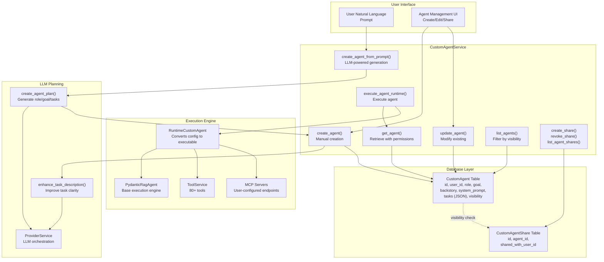
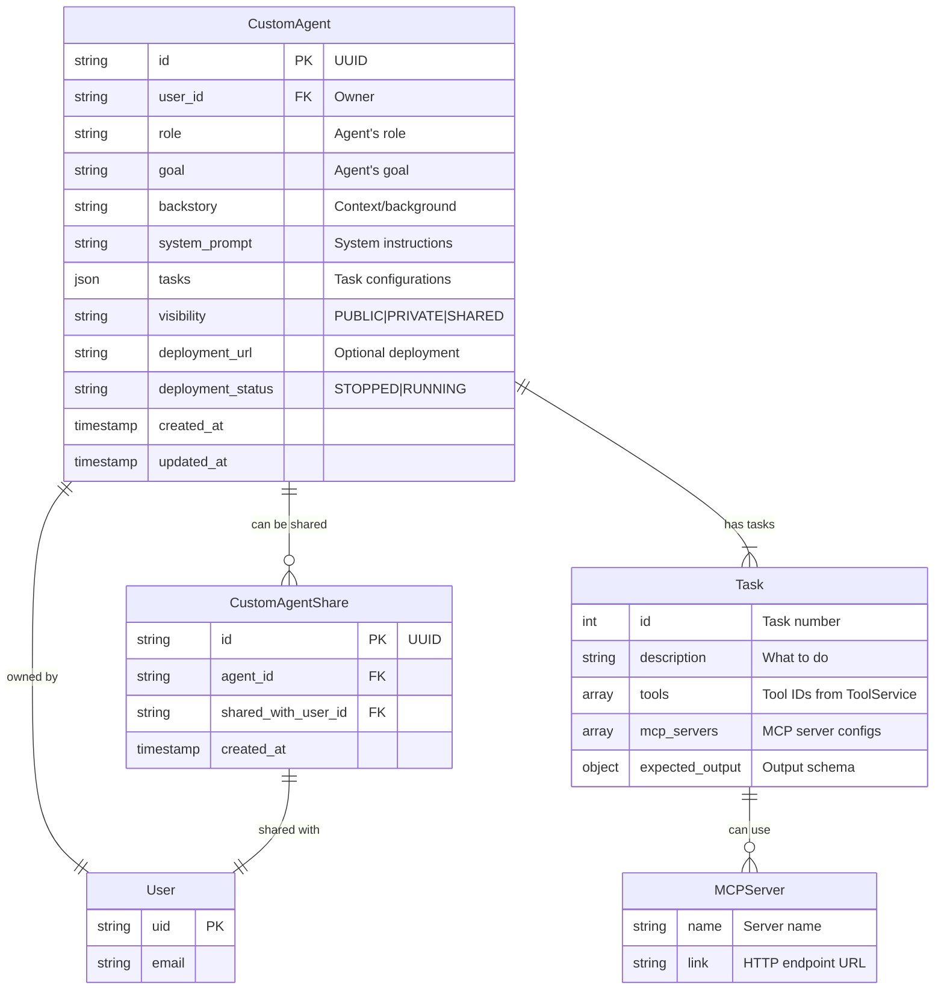
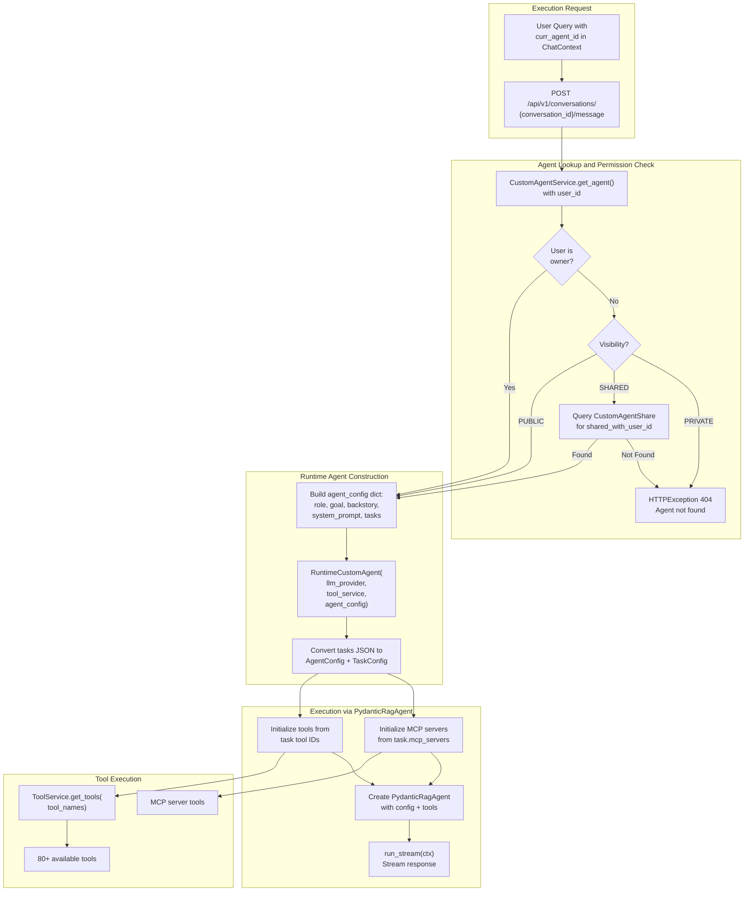
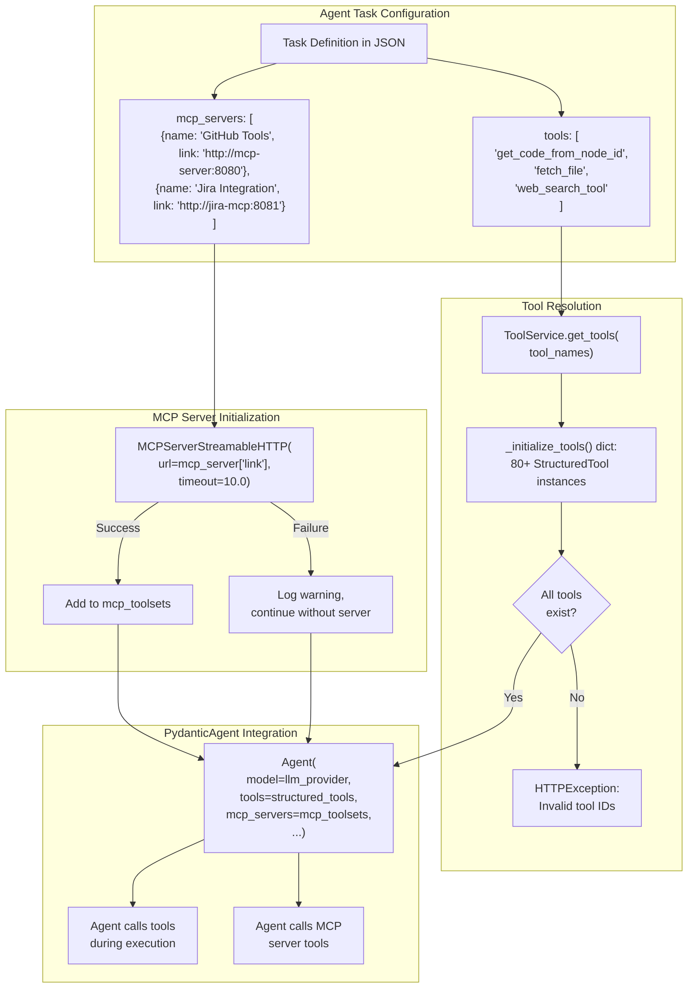
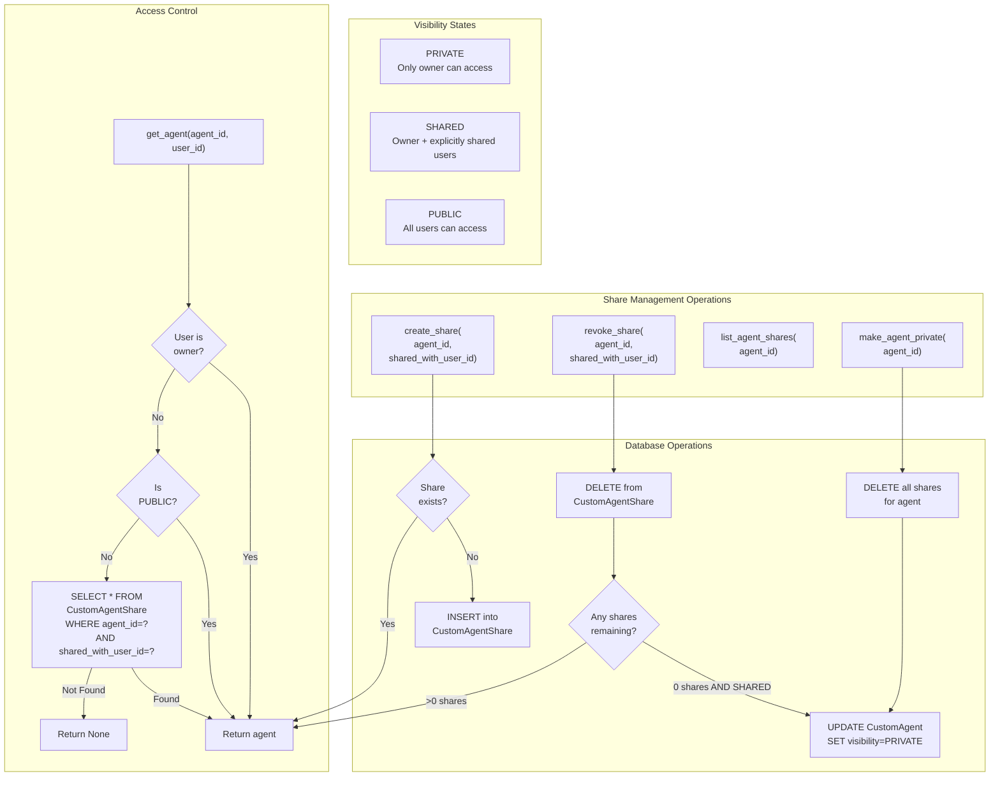

2.4-Custom Agents

# Page: Custom Agents

# Custom Agents

<details>
<summary>Relevant source files</summary>

The following files were used as context for generating this wiki page:

- [app/modules/conversations/conversation/conversation_store.py](app/modules/conversations/conversation/conversation_store.py)
- [app/modules/intelligence/agents/custom_agents/custom_agents_service.py](app/modules/intelligence/agents/custom_agents/custom_agents_service.py)
- [app/modules/intelligence/prompts/classification_prompts.py](app/modules/intelligence/prompts/classification_prompts.py)
- [app/modules/intelligence/prompts/prompt_controller.py](app/modules/intelligence/prompts/prompt_controller.py)
- [app/modules/intelligence/prompts/prompt_router.py](app/modules/intelligence/prompts/prompt_router.py)
- [app/modules/intelligence/prompts/prompt_service.py](app/modules/intelligence/prompts/prompt_service.py)
- [app/modules/intelligence/tools/code_query_tools/bash_command_tool.py](app/modules/intelligence/tools/code_query_tools/bash_command_tool.py)

</details>


Custom Agents allow users to create specialized AI agents tailored to specific tasks by defining role, goal, backstory, and task configurations in natural language. These user-defined agents complement the system's prebuilt agents (see [System Agents](#2.3)) and execute with the same tool ecosystem and execution framework.

For information about the base agent execution engine, see [Agent System Architecture](#2.2). For system-provided prebuilt agents, see [System Agents](#2.3). For agent execution and streaming, see [Agent Execution and Streaming](#2.5).

---

## Architecture Overview

The Custom Agents system enables users to create, manage, and execute personalized AI agents without writing code. Users describe their desired agent behavior in natural language, and the system generates a complete agent configuration using LLM-powered planning. Each custom agent can have multiple tasks, each with its own tool set and MCP server connections.



**Key Components:**

| Component | Purpose | Location |
|-----------|---------|----------|
| `CustomAgentService` | CRUD operations, LLM-powered creation, execution orchestration | [app/modules/intelligence/agents/custom_agents/custom_agents_service.py:37-795]() |
| `CustomAgentModel` | PostgreSQL table storing agent configurations | [app/modules/intelligence/agents/custom_agents/custom_agent_model.py]() |
| `CustomAgentShareModel` | Many-to-many table for agent sharing | [app/modules/intelligence/agents/custom_agents/custom_agent_model.py]() |
| `RuntimeCustomAgent` | Runtime wrapper that converts config to executable agent | [app/modules/intelligence/agents/custom_agents/runtime_agent.py:24-26]() |
| `AgentVisibility` | Enum: PUBLIC, PRIVATE, SHARED | [app/modules/intelligence/agents/custom_agents/custom_agent_schema.py]() |

Sources: [app/modules/intelligence/agents/custom_agents/custom_agents_service.py:1-1283]()

---

## Agent Data Model

Custom agents are stored in PostgreSQL with a flexible JSON-based task configuration. Each agent has visibility controls and can be shared with specific users.



**Task Structure:**

Each task in the `tasks` JSON array contains:
- `description`: Detailed instructions for what the agent should do
- `tools`: Array of tool IDs from `ToolService.list_tools()` (e.g., `["get_code_from_node_id", "fetch_file"]`)
- `mcp_servers`: Array of MCP server configurations for external tool providers
- `expected_output`: JSON schema defining the expected output format

**Visibility Modes:**

| Visibility | Access Rules | Sharing Mechanism |
|------------|-------------|-------------------|
| `PRIVATE` | Only owner can view/execute | Not shareable |
| `SHARED` | Owner + explicitly shared users | Via `CustomAgentShare` table |
| `PUBLIC` | All users can view/execute | Global discovery |

Sources: [app/modules/intelligence/agents/custom_agents/custom_agents_service.py:298-365](), [app/modules/intelligence/agents/custom_agents/custom_agent_schema.py]()

---

## Agent Creation from Natural Language

Users can create agents by providing a natural language description. The system uses LLM planning to generate a complete agent configuration with role, goal, backstory, system prompt, and tasks with appropriate tool selections.

```mermaid
sequenceDiagram
    participant User
    participant API["POST /api/v1/custom-agents/from-prompt"]
    participant CustomAgentService
    participant ToolService
    participant ProviderService["ProviderService<br/>(LLM)"]
    participant PostgreSQL
    
    User->>API: Natural language prompt
    API->>CustomAgentService: create_agent_from_prompt(prompt, user_id)
    
    CustomAgentService->>ToolService: list_tools()
    ToolService-->>CustomAgentService: Available tool IDs
    
    CustomAgentService->>CustomAgentService: create_agent_plan(prompt, tool_ids)
    CustomAgentService->>ProviderService: call_llm(CREATE_AGENT_FROM_PROMPT)
    
    Note over ProviderService: LLM analyzes prompt and<br/>generates agent config:<br/>- Role<br/>- Goal<br/>- Backstory<br/>- System prompt<br/>- Tasks with tool selections
    
    ProviderService-->>CustomAgentService: JSON config
    
    CustomAgentService->>CustomAgentService: Parse and validate JSON
    
    loop For each task
        CustomAgentService->>CustomAgentService: enhance_task_description(description, goal, tools)
        CustomAgentService->>ProviderService: call_llm(TASK_ENHANCEMENT_PROMPT)
        ProviderService-->>CustomAgentService: Enhanced description
    end
    
    CustomAgentService->>CustomAgentService: persist_agent(user_id, agent_data, tasks)
    CustomAgentService->>PostgreSQL: INSERT into CustomAgent
    PostgreSQL-->>CustomAgentService: agent_id
    
    CustomAgentService-->>API: Agent schema
    API-->>User: Created agent
```

**LLM Prompt Templates:**

The system uses two main prompts for agent generation:

1. **`CREATE_AGENT_FROM_PROMPT`** [app/modules/intelligence/agents/custom_agents/custom_agents_service.py:898-1250](): A comprehensive 350+ line prompt that guides the LLM through agent design. It includes:
   - Input analysis phase to assess prompt detail level
   - Tool analysis and matching (identifying optimal tools for requirements)
   - Single comprehensive task design (consolidating operations into one robust task)
   - Explicit reasoning prompts to ensure thorough agent planning
   - Output format specification for valid JSON structure

2. **`TASK_ENHANCEMENT_PROMPT`** [app/modules/intelligence/agents/custom_agents/custom_agents_service.py:1252-1283](): Refines individual task descriptions by adding specificity about tool usage, step-by-step instructions, and concrete examples based on the agent's goal and available tools.

**Validation Steps:**

- Required fields: `role`, `goal`, `backstory`, `system_prompt`, `tasks` [app/modules/intelligence/agents/custom_agents/custom_agents_service.py:755-762]()
- Each task must have: `description`, `tools` (array), `expected_output` [app/modules/intelligence/agents/custom_agents/custom_agents_service.py:768-776]()
- All tool IDs must exist in `ToolService.list_tools()` [app/modules/intelligence/agents/custom_agents/custom_agents_service.py:376-384]()
- JSON parsing with fallback extraction between curly braces if direct parsing fails [app/modules/intelligence/agents/custom_agents/custom_agents_service.py:741-752]()
- Default `expected_output` to `{"result": "string"}` if not provided [app/modules/intelligence/agents/custom_agents/custom_agents_service.py:775-776]()

Sources: [app/modules/intelligence/agents/custom_agents/custom_agents_service.py:721-797](), [app/modules/intelligence/agents/custom_agents/custom_agents_service.py:367-413]()

---

## Agent Execution Pipeline

Custom agents execute using the same `PydanticRagAgent` framework as system agents, but with runtime configuration from the database.



**Permission Logic:**

The execution flow checks permissions in this order [app/modules/intelligence/agents/custom_agents/custom_agents_service.py:598-666]():

1. **Owner check**: Direct match on `agent.user_id == user_id`
2. **Public check**: If `agent.visibility == PUBLIC`, grant access
3. **Shared check**: Query `CustomAgentShare` for matching `agent_id` and `shared_with_user_id`
4. **Deny**: Return 404 if none of the above match

**Runtime Agent Wrapper:**

`RuntimeCustomAgent` [app/modules/intelligence/agents/custom_agents/runtime_agent.py:24-26]() converts the database JSON configuration into `AgentConfig` and `TaskConfig` objects that `PydanticRagAgent` expects. The agent configuration dictionary is built in `execute_agent_runtime()` [app/modules/intelligence/agents/custom_agents/custom_agents_service.py:670-678]():

```python
agent_config = {
    "user_id": agent_model.user_id,
    "role": agent_model.role,
    "goal": agent_model.goal,
    "backstory": agent_model.backstory,
    "system_prompt": agent_model.system_prompt,
    "tasks": agent_model.tasks  # JSON array from database
}
runtime_agent = RuntimeCustomAgent(
    self.llm_provider, self.tool_service, agent_config
)
return runtime_agent.run_stream(ctx)
```

The `RuntimeCustomAgent` wrapper initializes the base `PydanticRagAgent` with the converted configuration, selected tools from the task definitions, and any configured MCP servers.

Sources: [app/modules/intelligence/agents/custom_agents/custom_agents_service.py:598-694](), [app/modules/intelligence/agents/custom_agents/custom_agents_service.py:670-683](), [app/modules/intelligence/agents/custom_agents/runtime_agent.py:24-26]()

---

## Tool and MCP Server Integration

Custom agents can use both system tools and external MCP servers. Each task in an agent specifies which tools it needs and which MCP servers to connect to.



**Tool Selection Process:**

When creating or updating an agent [app/modules/intelligence/agents/custom_agents/custom_agents_service.py:367-413]():

1. Extract all tool IDs from all tasks: `tool_ids = [tool_id for task in agent_data.tasks for tool_id in task.tools]`
2. Fetch available tools: `available_tools = ToolService(db, user_id).list_tools()`
3. Validate: Check each tool_id exists in available_tools
4. Reject if any invalid tool IDs found: `HTTPException(400, "Invalid tool IDs: ...")`

**MCP Server Integration:**

MCP (Model Context Protocol) servers provide external tools via HTTP endpoints. Each task can specify multiple MCP servers [app/modules/intelligence/agents/chat_agents/pydantic_agent.py:89-110]():

```python
for mcp_server in self.mcp_servers:
    try:
        mcp_server_instance = MCPServerStreamableHTTP(
            url=mcp_server["link"],
            timeout=10.0,
        )
        mcp_toolsets.append(mcp_server_instance)
    except Exception as e:
        logger.warning(f"Failed to create MCP server: {e}")
        continue  # Continue even if some servers fail
```

The agent continues execution even if some MCP servers fail to initialize, logging warnings but not blocking the workflow.

**Tool Execution in Agent Context:**

During agent execution, `PydanticRagAgent` wraps each tool with exception handling [app/modules/intelligence/agents/chat_agents/pydantic_agent.py:49-60]() and passes them to pydantic-ai's `Agent` constructor. The agent can then call any tool or MCP server tool as needed during its reasoning process.

Sources: [app/modules/intelligence/tools/tool_service.py:99-259](), [app/modules/intelligence/agents/chat_agents/pydantic_agent.py:84-165](), [app/modules/intelligence/agents/custom_agents/custom_agents_service.py:367-413]()

---

## Visibility and Sharing System

Custom agents support three visibility modes: PRIVATE (owner only), PUBLIC (all users), and SHARED (specific users). The sharing system uses a many-to-many relationship through `CustomAgentShare`.



**Share Creation Flow:**

[app/modules/intelligence/agents/custom_agents/custom_agents_service.py:94-145]()

1. Check if share already exists for `(agent_id, shared_with_user_id)` pair
2. If exists, return existing share (idempotent operation)
3. If not exists, create new `CustomAgentShareModel` with UUID
4. Insert into database and commit
5. No automatic visibility update - agent visibility is independent of shares

**Share Revocation with Auto-Cleanup:**

[app/modules/intelligence/agents/custom_agents/custom_agents_service.py:147-201]()

1. Find and delete the specific share record
2. Count remaining shares for this agent
3. If zero shares remaining AND visibility is SHARED, automatically update visibility to PRIVATE
4. This prevents orphaned SHARED agents with no actual shares

**Make Agent Private Operation:**

[app/modules/intelligence/agents/custom_agents/custom_agents_service.py:235-264]()

1. Delete ALL shares for the agent: `DELETE FROM CustomAgentShare WHERE agent_id=?`
2. Update agent visibility to PRIVATE
3. Atomic operation - both deletes and visibility update in one transaction

**List Agent Shares:**

[app/modules/intelligence/agents/custom_agents/custom_agents_service.py:203-233]()

Returns list of email addresses for all users the agent is shared with:
1. Query all `CustomAgentShare` records for agent_id
2. Extract `shared_with_user_id` values
3. Join with `User` table to get email addresses
4. Return list of email strings

**Access Control Implementation:**

The `get_agent()` method [app/modules/intelligence/agents/custom_agents/custom_agents_service.py:524-596]() implements a waterfall permission check:

```python
# 1. Check ownership
agent_model = await self._get_agent_by_id_and_user(agent_id, user_id)
if agent_model:
    return agent_model

# 2. Check public visibility
agent_model = await self.get_agent_model(agent_id)
if agent_model.visibility == AgentVisibility.PUBLIC:
    return agent_model

# 3. Check shared access
if agent_model.visibility == AgentVisibility.SHARED:
    share = db.query(CustomAgentShareModel).filter(
        CustomAgentShareModel.agent_id == agent_id,
        CustomAgentShareModel.shared_with_user_id == user_id
    ).first()
    if share:
        return agent_model

# 4. Deny access
return None
```

Sources: [app/modules/intelligence/agents/custom_agents/custom_agents_service.py:94-264](), [app/modules/intelligence/agents/custom_agents/custom_agents_service.py:524-596]()

---

## Agent CRUD Operations

The `CustomAgentService` provides complete CRUD functionality with permission checks and validation.

| Operation | Method | Permission Required | Key Validation |
|-----------|--------|--------------------|--------------------|
| Create | `create_agent()` | Authenticated user | Tool IDs must exist |
| Create from prompt | `create_agent_from_prompt()` | Authenticated user | LLM generates valid JSON |
| Read | `get_agent()` | Owner, PUBLIC, or SHARED | Visibility check |
| List | `list_agents()` | Authenticated user | Filters by ownership + PUBLIC + SHARED |
| Update | `update_agent()` | Owner only | Tool IDs must exist if tasks updated |
| Delete | `delete_agent()` | Owner only | Cascades to shares automatically |

**Create Agent:**

[app/modules/intelligence/agents/custom_agents/custom_agents_service.py:367-413]()

```python
async def create_agent(self, user_id: str, agent_data: AgentCreate) -> Agent:
    # 1. Extract and validate tool IDs
    tool_ids = [tool_id for task in agent_data.tasks for tool_id in task.tools]
    available_tools = await self.fetch_available_tools(user_id)
    invalid_tools = [tid for tid in tool_ids if tid not in available_tools]
    if invalid_tools:
        raise HTTPException(400, f"Invalid tool IDs: {invalid_tools}")
    
    # 2. Enhance task descriptions using LLM
    enhanced_tasks = await self.enhance_task_descriptions(...)
    
    # 3. Persist to database
    return self.persist_agent(user_id, agent_data, enhanced_tasks)
```

**List Agents with Filtering:**

[app/modules/intelligence/agents/custom_agents/custom_agents_service.py:266-296]()

```python
async def list_agents(
    self, user_id: str, 
    include_public: bool = False,
    include_shared: bool = True
) -> List[Agent]:
    filters = [CustomAgentModel.user_id == user_id]  # Own agents
    
    if include_public:
        filters.append(CustomAgentModel.visibility == AgentVisibility.PUBLIC)
    
    if include_shared:
        shared_subquery = select(CustomAgentShareModel.agent_id).where(
            CustomAgentShareModel.shared_with_user_id == user_id
        )
        filters.append(CustomAgentModel.id.in_(shared_subquery))
    
    query = query.filter(or_(*filters))
    return [self._convert_to_agent_schema(agent) for agent in query.all()]
```

**Update Agent:**

[app/modules/intelligence/agents/custom_agents/custom_agents_service.py:434-500]()

Only the owner can update an agent. The update process:
1. Verify ownership: `agent = await self._get_agent_by_id_and_user(agent_id, user_id)`
2. Handle special fields like `tasks` (convert to dict) and `visibility` (enum to string)
3. Apply updates: `setattr(agent, key, value)` for each field
4. Commit and refresh from database
5. Return updated schema

**Delete Agent:**

[app/modules/intelligence/agents/custom_agents/custom_agents_service.py:502-522]()

Deletion is owner-only and cascades to shares (assuming database foreign key constraints):
```python
async def delete_agent(self, agent_id: str, user_id: str) -> Dict[str, Any]:
    agent = await self._get_agent_by_id_and_user(agent_id, user_id)
    if not agent:
        return {"success": False, "message": f"Agent {agent_id} not found"}
    
    self.db.delete(agent)
    self.db.commit()
    return {"success": True, "message": f"Agent {agent_id} deleted"}
```

Sources: [app/modules/intelligence/agents/custom_agents/custom_agents_service.py:266-522]()

---

## Task Enhancement

Task descriptions are automatically enhanced using LLM to improve clarity and actionability based on the agent's goal and selected tools.

**Enhancement Process:**

[app/modules/intelligence/agents/custom_agents/custom_agents_service.py:799-822]()

For each task during agent creation:

1. **Input**: Original task description, agent goal, list of selected tools for that task
2. **Tool Filtering**: Filter to only tools available in the system [app/modules/intelligence/agents/custom_agents/custom_agents_service.py:809-813]()
3. **LLM Prompt**: `TASK_ENHANCEMENT_PROMPT` template formatted with description, goal, and tools [app/modules/intelligence/agents/custom_agents/custom_agents_service.py:715-718]()
4. **Processing**: `ProviderService.call_llm()` with `config_type="chat"` generates enhanced description [app/modules/intelligence/agents/custom_agents/custom_agents_service.py:718]()
5. **Output**: Enhanced task description that references specific available tools

The enhancement happens during `create_agent()` after tool validation:

```python
# Extract tool IDs from all tasks
tool_ids = []
for task in agent_data.tasks:
    tool_ids.extend(task.tools)

# Validate tools exist
available_tools = await self.fetch_available_tools(user_id)
invalid_tools = [tool_id for tool_id in tool_ids if tool_id not in available_tools]
if invalid_tools:
    raise HTTPException(400, f"Invalid tool IDs: {', '.join(invalid_tools)}")

# Enhance task descriptions
tasks_dict = [task.dict() for task in agent_data.tasks]
enhanced_tasks = await self.enhance_task_descriptions(
    tasks_dict, agent_data.goal, available_tools, user_id
)

# Persist with enhanced descriptions
return self.persist_agent(user_id, agent_data, enhanced_tasks)
```

The `enhance_task_description()` method [app/modules/intelligence/agents/custom_agents/custom_agents_service.py:708-719]() uses the `TASK_ENHANCEMENT_PROMPT` which asks the LLM to add step-by-step instructions, specific tool usage guidance, and concrete examples.

Sources: [app/modules/intelligence/agents/custom_agents/custom_agents_service.py:367-432](), [app/modules/intelligence/agents/custom_agents/custom_agents_service.py:708-719](), [app/modules/intelligence/agents/custom_agents/custom_agents_service.py:799-822](), [app/modules/intelligence/agents/custom_agents/custom_agents_service.py:1252-1283]()

---

## Schema Conversion

Custom agents are stored in PostgreSQL as JSON but converted to strongly-typed Pydantic schemas for API responses.

**Database to Schema Conversion:**

[app/modules/intelligence/agents/custom_agents/custom_agents_service.py:298-365]()

```python
def _convert_to_agent_schema(self, custom_agent: CustomAgentModel) -> Agent:
    # Convert tasks JSON to Task objects
    task_schemas = []
    for i, task in enumerate(custom_agent.tasks, start=1):
        # Parse expected_output if stored as string
        expected_output = task.get("expected_output", {})
        if isinstance(expected_output, str):
            expected_output = json.loads(expected_output)
        
        # Convert MCP servers from dict to MCPServer objects
        mcp_servers = []
        if task.get("mcp_servers"):
            mcp_servers = [MCPServer(**server) for server in task.get("mcp_servers", [])]
        
        task_schemas.append(Task(
            id=i,
            description=task["description"],
            tools=task.get("tools", []),
            mcp_servers=mcp_servers,
            expected_output=expected_output,
        ))
    
    # Convert visibility string to enum with fallback
    visibility = custom_agent.visibility
    try:
        visibility_enum = AgentVisibility(visibility.lower()) if visibility else AgentVisibility.PRIVATE
    except ValueError:
        visibility_enum = AgentVisibility.PRIVATE
    
    return Agent(
        id=custom_agent.id,
        user_id=custom_agent.user_id,
        role=custom_agent.role,
        goal=custom_agent.goal,
        backstory=custom_agent.backstory,
        system_prompt=custom_agent.system_prompt,
        tasks=task_schemas,
        deployment_url=custom_agent.deployment_url,
        created_at=custom_agent.created_at,
        updated_at=custom_agent.updated_at,
        deployment_status=custom_agent.deployment_status or "STOPPED",
        visibility=visibility_enum,
    )
```

This conversion handles:
- JSON task array → typed `Task` objects
- String `expected_output` → parsed JSON object
- Dict MCP servers → `MCPServer` objects
- String visibility → `AgentVisibility` enum with error handling

Sources: [app/modules/intelligence/agents/custom_agents/custom_agents_service.py:298-365]()

---

## Configuration Schema

Custom agents use a hierarchical configuration schema defined in Pydantic models.

**Agent Schema:**

```python
class Agent(BaseModel):
    id: str  # UUID
    user_id: str
    role: str  # e.g., "Senior Python Developer"
    goal: str  # e.g., "Help debug Python applications"
    backstory: str  # Context about the agent
    system_prompt: str  # System-level instructions
    tasks: List[Task]
    deployment_url: Optional[str]
    deployment_status: str  # "STOPPED" | "RUNNING"
    visibility: AgentVisibility  # PUBLIC | PRIVATE | SHARED
    created_at: datetime
    updated_at: datetime
```

**Task Schema:**

```python
class Task(BaseModel):
    id: int  # Sequential number starting from 1
    description: str  # What the agent should do
    tools: List[str]  # Tool IDs from ToolService
    mcp_servers: List[MCPServer] = []  # Optional MCP servers
    expected_output: Dict[str, Any]  # Output schema
```

**MCP Server Schema:**

```python
class MCPServer(BaseModel):
    name: str  # Human-readable name
    link: str  # HTTP endpoint URL
```

**Create/Update Schemas:**

```python
class AgentCreate(BaseModel):
    role: str
    goal: str
    backstory: str
    system_prompt: str
    tasks: List[TaskCreate]

class AgentUpdate(BaseModel):
    role: Optional[str]
    goal: Optional[str]
    backstory: Optional[str]
    system_prompt: Optional[str]
    tasks: Optional[List[TaskCreate]]
    visibility: Optional[AgentVisibility]

class TaskCreate(BaseModel):
    description: str
    tools: List[str]
    mcp_servers: List[MCPServer] = []
    expected_output: Dict[str, Any] = {"result": "string"}
```

Sources: [app/modules/intelligence/agents/custom_agents/custom_agent_schema.py]()