10-Data Layer

# Page: Data Layer

# Data Layer

<details>
<summary>Relevant source files</summary>

The following files were used as context for generating this wiki page:

- [.env.template](.env.template)
- [app/main.py](app/main.py)
- [requirements.txt](requirements.txt)

</details>


## Purpose and Scope

The Data Layer provides persistent storage and caching infrastructure for the potpie system through a three-database architecture. This page covers the overall data architecture, connection patterns, and how the three databases work together. For detailed schema information, see [PostgreSQL Schema](#10.1), [Neo4j Knowledge Graph](#10.2), and [Redis Architecture](#10.3).

The data layer consists of:
- **PostgreSQL**: Relational data including users, conversations, messages, projects, and integrations
- **Neo4j**: Knowledge graph storing code structure, relationships, embeddings, and AI-generated docstrings
- **Redis**: Caching layer, Celery message broker, and real-time streaming

## Three-Database Architecture

```mermaid
graph TB
    subgraph "Application Layer"
        FastAPI[FastAPI Application]
        Celery[Celery Workers]
    end
    
    subgraph "PostgreSQL - Relational Data"
        UsersTable["users table"]
        ConversationsTable["conversations table"]
        MessagesTable["messages table"]
        ProjectsTable["projects table"]
        IntegrationsTable["integrations table"]
        UserPreferencesTable["user_preferences table"]
    end
    
    subgraph "Neo4j - Knowledge Graph"
        CodeNodes["NODE label<br/>Classes, Functions, Methods"]
        Relationships["CALLS, IMPORTS, CONTAINS"]
        Embeddings["embedding property<br/>384-dim vectors"]
        Docstrings["docstring property<br/>AI-generated"]
    end
    
    subgraph "Redis - Cache & Streaming"
        CacheLayer["Cache Layer<br/>project_structure keys<br/>1 hour TTL"]
        BrokerLayer["Celery Broker<br/>Queue management"]
        StreamsLayer["Redis Streams<br/>conversation:run_id streams<br/>15 min TTL"]
    end
    
    FastAPI --> UsersTable
    FastAPI --> ConversationsTable
    FastAPI --> MessagesTable
    FastAPI --> ProjectsTable
    
    Celery --> ProjectsTable
    Celery --> IntegrationsTable
    
    FastAPI --> CodeNodes
    Celery --> CodeNodes
    Celery --> Relationships
    Celery --> Embeddings
    Celery --> Docstrings
    
    FastAPI --> CacheLayer
    FastAPI --> StreamsLayer
    Celery --> BrokerLayer
    Celery --> CacheLayer
```

**Three-Database Architecture**: PostgreSQL stores relational entities and relationships, Neo4j stores the code knowledge graph with semantic embeddings, and Redis provides caching and real-time streaming capabilities.

Sources: [app/modules/parsing/graph_construction/parsing_controller.py](), [app/modules/parsing/knowledge_graph/inference_service.py](), [app/celery/celery_app.py]()

## Database Configuration and Connections

### Configuration Provider Pattern

All database connections are centrally managed through `ConfigProvider` which loads configuration from environment variables and GCP Secret Manager.

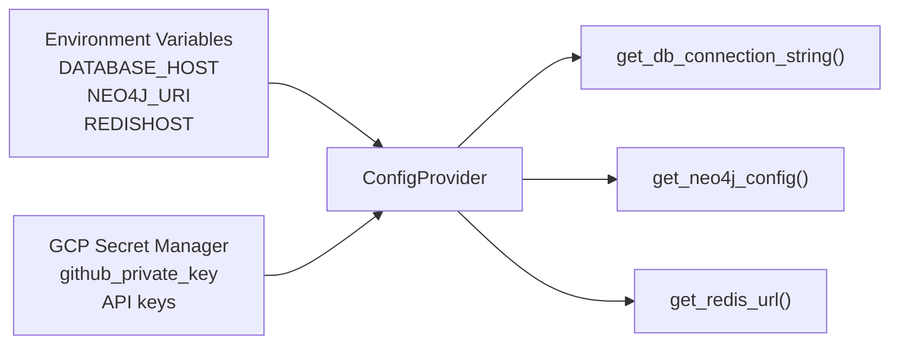

**Configuration Provider Pattern**: The `ConfigProvider` centralizes all database configuration, loading from environment variables and Secret Manager.

### PostgreSQL Connection Management

The `SessionLocal` factory creates database sessions using SQLAlchemy's async session support:

| Component | Pattern | Location |
|-----------|---------|----------|
| Session Factory | `SessionLocal = sessionmaker(engine)` | [app/core/database.py]() |
| Dependency Injection | `get_db()` yields sessions | [app/core/database.py]() |
| Service Layer | Services receive `Session` via constructor | [app/modules/users/user_service.py:26]() |
| Celery Tasks | `BaseTask.db` property manages sessions | [app/celery/tasks/base_task.py:8-15]() |

Sources: [app/modules/users/user_service.py:26](), [app/celery/tasks/base_task.py:8-15]()

### Neo4j Connection Management

Neo4j connections are established through the `GraphDatabase.driver()` from the `neo4j` library:

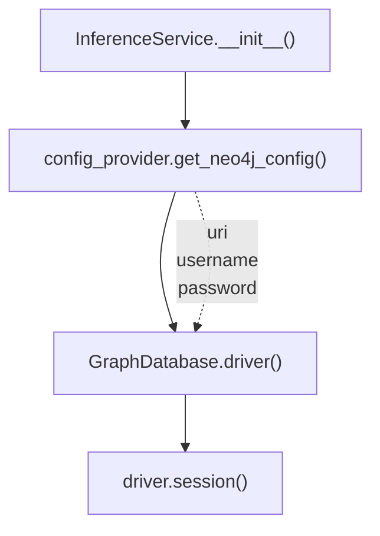

**Neo4j Connection Pattern**: Services create drivers in `__init__()` and manage sessions using context managers.

The driver is created in service initialization and closed explicitly:

- **Driver Creation**: [app/modules/parsing/knowledge_graph/inference_service.py:28-32]()
- **Session Management**: Context managers (`with self.driver.session()`) ensure proper cleanup
- **Cleanup**: [app/modules/parsing/knowledge_graph/inference_service.py:40-41]()

Sources: [app/modules/parsing/knowledge_graph/inference_service.py:28-41]()

### Redis Connection Management

Redis connections are established through the `Redis.from_url()` factory:

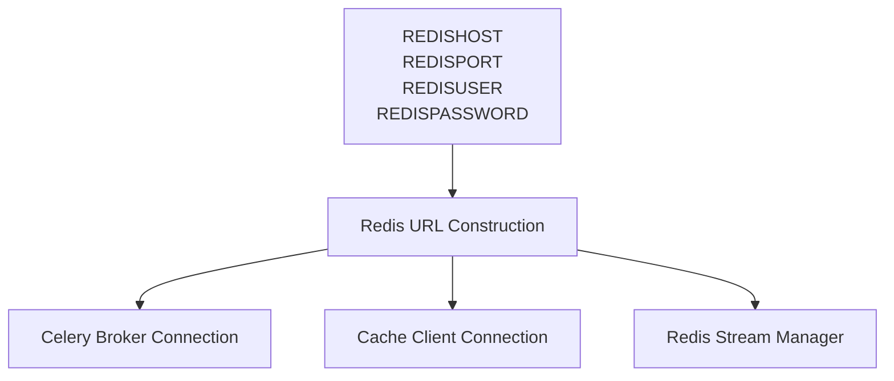

**Redis Connection Patterns**: Different components establish Redis connections for specific purposes (broker, cache, streams).

Redis connection patterns by use case:

| Use Case | Connection Pattern | Location |
|----------|-------------------|----------|
| Celery Broker | URL in `Celery()` constructor | [app/celery/celery_app.py:18-25]() |
| Caching | `Redis.from_url()` in service | [app/modules/code_provider/github/github_service.py:48]() |
| Streaming | `Redis.from_url()` in `RedisStreamManager` | [app/modules/conversations/utils/redis_streaming.py]() |

Sources: [app/celery/celery_app.py:11-25](), [app/modules/code_provider/github/github_service.py:48]()

## PostgreSQL: Relational Data Store

PostgreSQL stores all structured relational data with foreign key relationships, cascading deletes, and transaction support.

### Core Tables

```mermaid
erDiagram
    users ||--o{ conversations : "creates"
    users ||--o{ projects : "owns"
    conversations ||--o{ messages : "contains"
    conversations }o--o{ projects : "references"
    users ||--o{ integrations : "configures"
    users ||--o{ user_preferences : "has"
    
    users {
        string uid PK
        string email
        string display_name
        json provider_info
        timestamp created_at
        timestamp last_login_at
    }
    
    conversations {
        string id PK
        string user_id FK
        string title
        string status
        array project_ids
        array agent_ids
        enum visibility
        array shared_with_emails
        timestamp created_at
    }
    
    messages {
        string id PK
        string conversation_id FK
        string content
        enum type
        string sender_id FK
        enum status
        timestamp created_at
    }
    
    projects {
        string id PK
        string user_id FK
        string repo_name
        string branch_name
        string commit_id
        enum status
        json properties
        timestamp created_at
    }
```

**PostgreSQL Schema**: Core relational entities with foreign key relationships and cascade behavior.

Key patterns:

- **User-Centric Design**: Most tables reference `users.uid` with `CASCADE` delete behavior [app/alembic/versions/20240820182032_d3f532773223_changes_for_implementation_of_.py:38-41]()
- **UUID Primary Keys**: All tables use UUID7 for distributed ID generation
- **Status Enums**: `ProjectStatusEnum` (SUBMITTED, CLONED, PARSED, READY, ERROR), `MessageStatus` (ACTIVE, ARCHIVED, DELETED)
- **JSON Properties**: `projects.properties` stores repository metadata, `users.provider_info` stores OAuth tokens

For detailed schema documentation, see [PostgreSQL Schema](#10.1).

Sources: [app/modules/users/user_service.py](), [app/modules/projects/projects_service.py](), [app/alembic/versions/20240820182032_d3f532773223_changes_for_implementation_of_.py]()

## Neo4j: Knowledge Graph Store

Neo4j stores the code knowledge graph with nodes representing code entities and relationships representing code dependencies.

### Graph Structure

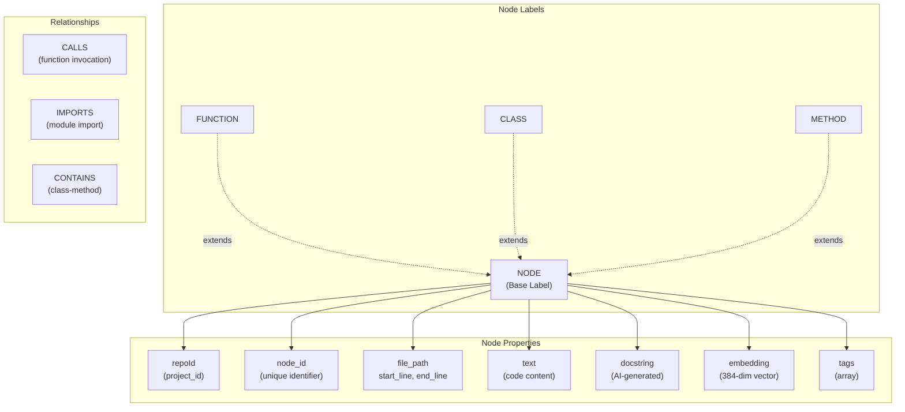

**Neo4j Node Structure**: All nodes have the `NODE` base label with specific labels (FUNCTION, CLASS, METHOD) and properties including AI-generated docstrings and embeddings.

### Indices and Query Optimization

The knowledge graph uses multiple indices for efficient querying:

| Index Type | Purpose | Creation |
|------------|---------|----------|
| Composite Index | `(repoId, node_id)` lookup | [app/modules/parsing/graph_construction/parsing_service.py:159-162]() |
| Composite Index | `(name, repoId)` lookup | [app/modules/parsing/graph_construction/parsing_service.py:164-168]() |
| Vector Index | `docstring_embedding` similarity search | [app/modules/parsing/knowledge_graph/inference_service.py:626-638]() |
| Lookup Index | Relationship type lookup | [app/modules/parsing/graph_construction/parsing_service.py:170-174]() |

The vector index uses cosine similarity with 384 dimensions for semantic code search [app/modules/parsing/knowledge_graph/inference_service.py:633-636]().

Sources: [app/modules/parsing/graph_construction/parsing_service.py:151-175](), [app/modules/parsing/knowledge_graph/inference_service.py:626-638]()

### Graph Construction Pipeline

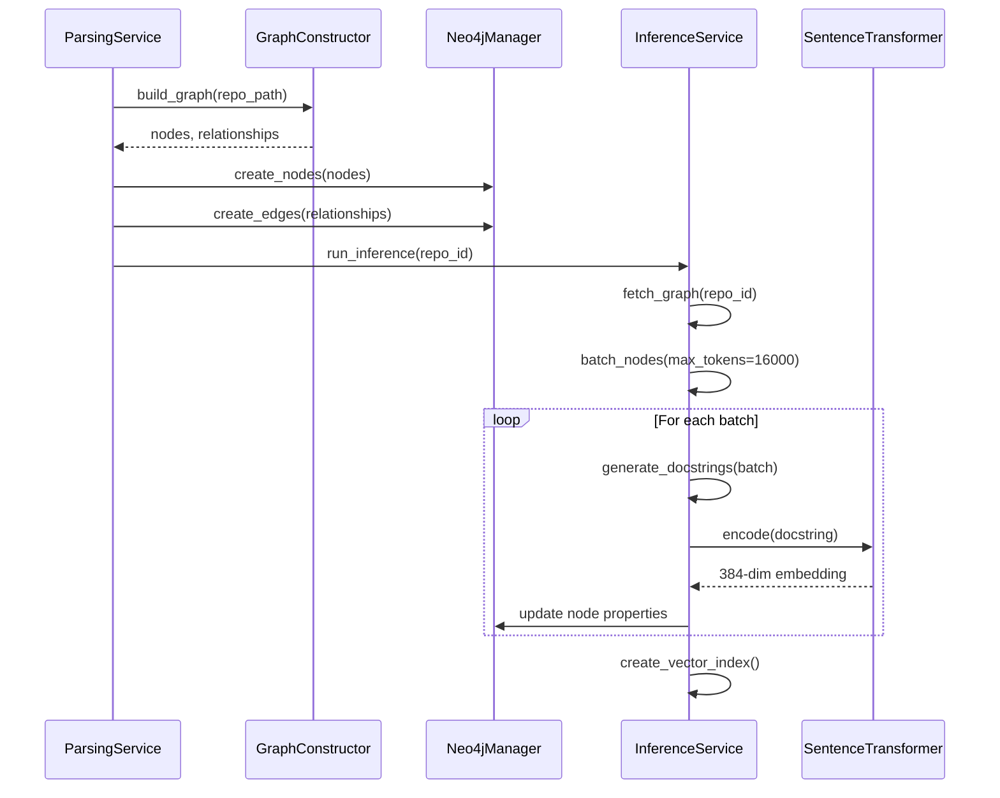

**Graph Construction Pipeline**: Code is parsed, nodes/edges created, then enriched with AI docstrings and embeddings.

The pipeline stages:
1. **Parsing**: `GraphConstructor` from `blar_graph` library extracts code structure
2. **Storage**: `Neo4jManager` creates nodes and relationships
3. **Batching**: Nodes batched by token count (16K limit) [app/modules/parsing/knowledge_graph/inference_service.py:193-253]()
4. **Inference**: LLM generates docstrings and tags in parallel (50 concurrent requests by default) [app/modules/parsing/knowledge_graph/inference_service.py:38]()
5. **Embeddings**: `SentenceTransformer("all-MiniLM-L6-v2")` generates 384-dim vectors [app/modules/parsing/knowledge_graph/inference_service.py:35]()
6. **Update**: Properties written back to Neo4j in batches of 300 [app/modules/parsing/knowledge_graph/inference_service.py:596-624]()

For detailed graph schema and query patterns, see [Neo4j Knowledge Graph](#10.2).

Sources: [app/modules/parsing/graph_construction/parsing_service.py:176-287](), [app/modules/parsing/knowledge_graph/inference_service.py:26-647]()

## Redis: Caching and Streaming

Redis serves three distinct purposes in the system: caching frequently accessed data, message broker for Celery, and real-time streaming for conversation updates.

### Redis Usage Patterns

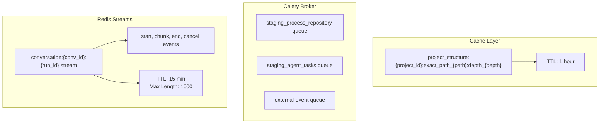

**Redis Usage Patterns**: Three distinct use cases with different data structures and TTL policies.

### Cache Layer Implementation

GitHub service uses Redis to cache repository structures:

```python
# Cache key pattern from github_service.py:578-580
cache_key = f"project_structure:{project_id}:exact_path_{path}:depth_{self.max_depth}"
cached_structure = self.redis.get(cache_key)
```

Cache characteristics:
- **TTL**: 1 hour (3600 seconds)
- **Data Format**: Encoded string (UTF-8)
- **Invalidation**: None (time-based expiration only)

Sources: [app/modules/code_provider/github/github_service.py:570-587]()

### Celery Broker Configuration

Celery uses Redis as the message broker with task routing:

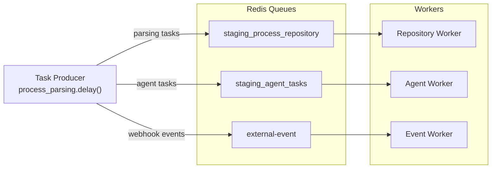

**Celery Queue Routing**: Tasks are routed to specific queues based on task type for workload isolation.

Task routing configuration [app/celery/celery_app.py:47-64]():

| Task | Queue | Purpose |
|------|-------|---------|
| `process_parsing` | `{prefix}_process_repository` | Long-running parsing operations |
| `execute_agent_background` | `{prefix}_agent_tasks` | Agent execution |
| `execute_regenerate_background` | `{prefix}_agent_tasks` | Message regeneration |
| `process_webhook_event` | `external-event` | Webhook processing |
| `process_custom_event` | `external-event` | Custom event handling |

Worker configuration [app/celery/celery_app.py:66-78]():
- **Prefetch**: 1 (fair distribution)
- **Acks Late**: True (requeue on failure)
- **Time Limit**: 5400 seconds (90 minutes)
- **Max Tasks Per Child**: 200 (restart to prevent memory leaks)
- **Max Memory Per Child**: 2GB

Sources: [app/celery/celery_app.py:40-78]()

### Redis Streams for Real-time Updates

Redis Streams enable real-time conversation updates with cursor-based replay:

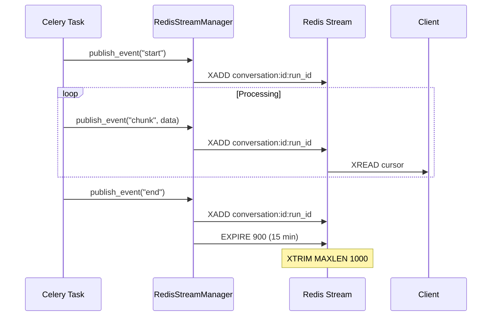

**Redis Streams Lifecycle**: Events are published to streams with automatic expiration and length limiting.

Stream characteristics:
- **Stream Key**: `conversation:{conversation_id}:{run_id}`
- **Event Types**: `start`, `chunk`, `end`, `cancel`
- **TTL**: 15 minutes (900 seconds)
- **Max Length**: 1000 events (automatic trimming)
- **Cursor**: Clients can replay from any event ID

For detailed streaming architecture, see [Redis Architecture](#10.3).

Sources: [app/modules/conversations/utils/redis_streaming.py](), [app/celery/tasks/agent_tasks.py:28-157]()

## Cross-Database Data Flow

### Repository Parsing Flow

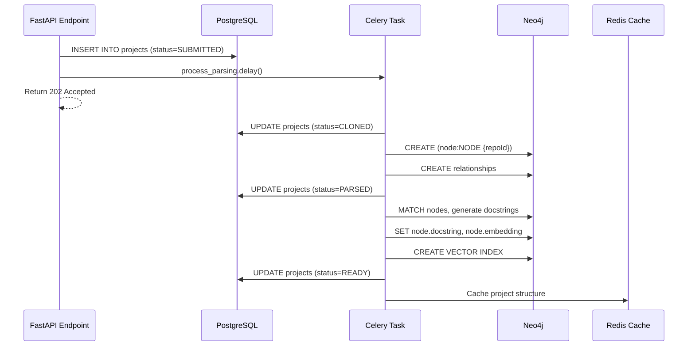

**Repository Parsing Data Flow**: Status tracked in PostgreSQL, graph built in Neo4j, structure cached in Redis.

Status transitions in `projects` table [app/modules/projects/projects_schema.py]():
- `SUBMITTED` → `CLONED` → `PARSED` → `READY`
- Error cases → `ERROR`

Sources: [app/modules/parsing/graph_construction/parsing_controller.py:36-259](), [app/modules/parsing/graph_construction/parsing_service.py:53-287]()

### Conversation Query Flow

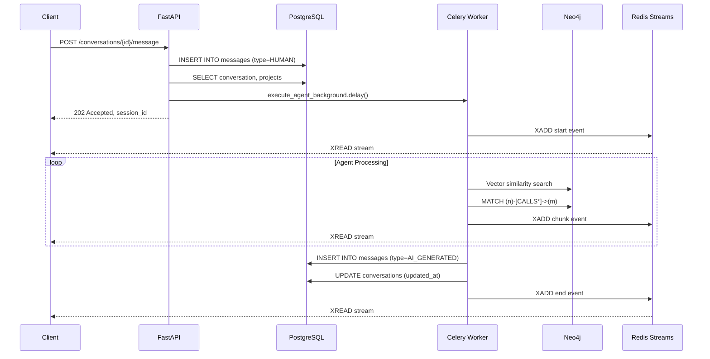

**Conversation Query Flow**: User message stored in PostgreSQL, agent queries Neo4j knowledge graph, responses streamed via Redis.

The flow demonstrates coordination across all three databases:
1. **PostgreSQL**: Stores conversation history and maintains conversation state
2. **Neo4j**: Provides code context through vector search and relationship traversal
3. **Redis**: Enables real-time streaming of agent responses to the client

Sources: [app/celery/tasks/agent_tasks.py:12-158](), [app/modules/conversations/conversation/conversation_service.py]()

## Data Consistency and Transaction Patterns

### PostgreSQL Transactions

SQLAlchemy sessions provide ACID transaction guarantees:

```python
# Pattern from user_service.py:72-74
self.db.add(new_user)
self.db.commit()
self.db.refresh(new_user)
```

Error handling with rollback:
```python
# Pattern from message_service.py:88-95
try:
    self.db.add(new_message)
    self.db.commit()
    self.db.refresh(new_message)
except SQLAlchemyError:
    self.db.rollback()
    raise
```

Sources: [app/modules/users/user_service.py:54-85](), [app/modules/conversations/message/message_service.py:88-95]()

### Neo4j Transaction Behavior

Neo4j operations use implicit transactions within session context:

```python
# Pattern from inference_service.py:596-624
with self.driver.session() as session:
    for i in range(0, len(docstring_list), batch_size):
        batch = docstring_list[i : i + batch_size]
        session.run("""
            UNWIND $batch AS item
            MATCH (n:NODE {repoId: $repo_id, node_id: item.node_id})
            SET n.docstring = item.docstring,
                n.embedding = item.embedding,
                n.tags = item.tags
        """, batch=batch, repo_id=repo_id)
```

Each `session.run()` executes in its own transaction, committing automatically on success.

Sources: [app/modules/parsing/knowledge_graph/inference_service.py:596-624]()

### Cross-Database Consistency Strategies

The system uses **eventual consistency** across databases:

| Pattern | Implementation | Location |
|---------|---------------|----------|
| Status Tracking | PostgreSQL `projects.status` reflects Neo4j graph state | [app/modules/projects/projects_schema.py]() |
| Graph Cleanup | Neo4j cleanup before re-parsing if `cleanup_graph=True` | [app/modules/parsing/graph_construction/parsing_service.py:64-78]() |
| Cache Invalidation | No explicit invalidation; TTL-based expiration | [app/modules/code_provider/github/github_service.py]() |

**No distributed transactions** are used; instead, the system relies on:
- Status enums to track multi-database operations
- Idempotent operations where possible
- Error status tracking for failed operations

Sources: [app/modules/parsing/graph_construction/parsing_service.py:53-150](), [app/modules/projects/projects_service.py:117-121]()

## Database Access Patterns Summary

### Service Layer Pattern

All database access follows a consistent service layer pattern:

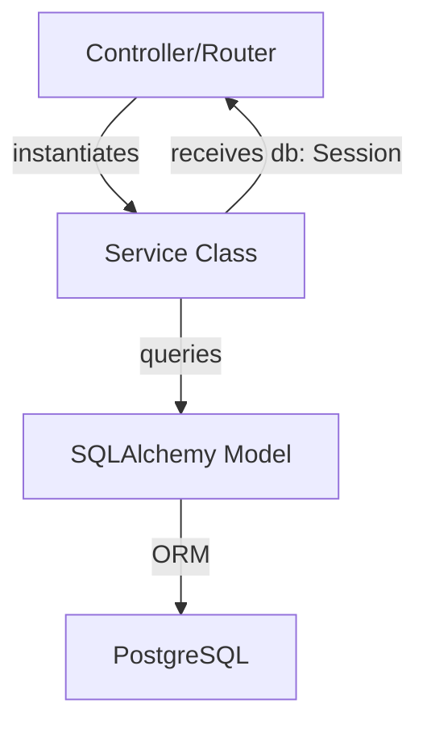

**Service Layer Pattern**: Controllers instantiate services with database sessions, services encapsulate all database logic.

Services by database:

| Service | Database | Responsibility |
|---------|----------|---------------|
| `UserService` | PostgreSQL | User CRUD, authentication state |
| `ConversationService` | PostgreSQL | Conversation and message management |
| `ProjectService` | PostgreSQL | Project lifecycle and status |
| `ParsingService` | Neo4j | Graph construction and duplication |
| `InferenceService` | Neo4j | Docstring generation and embeddings |
| `GithubService` | Redis | Repository structure caching |
| `RedisStreamManager` | Redis | Event streaming and session management |

Sources: [app/modules/users/user_service.py:25-27](), [app/modules/conversations/conversation/conversation_service.py](), [app/modules/projects/projects_service.py:23-25]()

### Bulk Operation Optimization

The system employs several bulk operation strategies for performance:

**Neo4j Batch Operations** [app/modules/parsing/knowledge_graph/inference_service.py:611-624]():
- Docstring updates in batches of 300
- Uses `UNWIND` for batch processing

**PostgreSQL Batch Queries** [app/modules/parsing/knowledge_graph/inference_service.py:419-434]():
- Search index bulk creation
- Uses `bulk_create_search_indices()` for efficiency

**Neo4j Pagination** [app/modules/parsing/knowledge_graph/inference_service.py:84-104]():
- Fetches nodes in batches of 500
- Uses `SKIP` and `LIMIT` for memory efficiency

Sources: [app/modules/parsing/knowledge_graph/inference_service.py:84-104](), [app/modules/parsing/knowledge_graph/inference_service.py:419-434](), [app/modules/parsing/knowledge_graph/inference_service.py:611-624]()