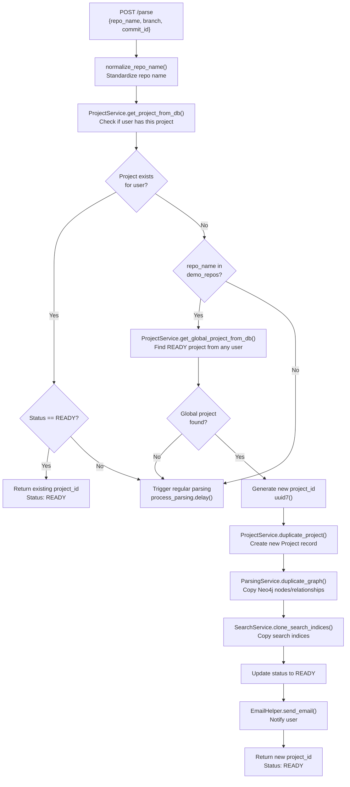
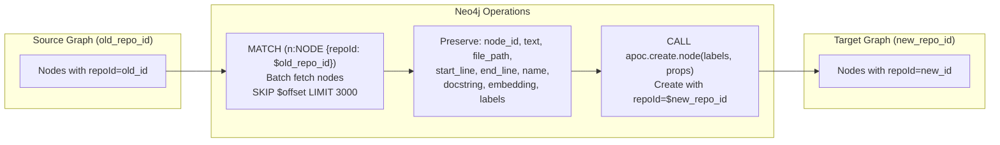
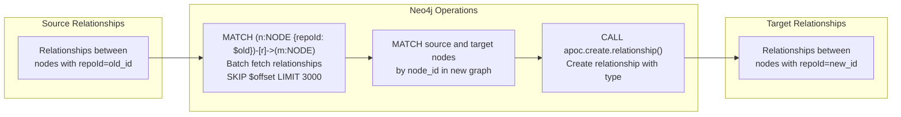
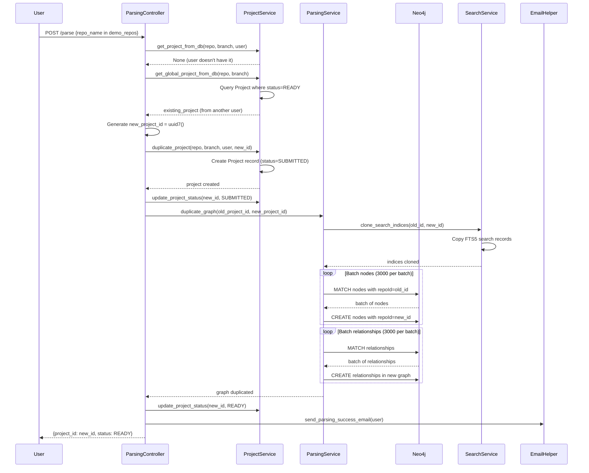

4.5-Demo Project Duplication

# Page: Demo Project Duplication

# Demo Project Duplication

<details>
<summary>Relevant source files</summary>

The following files were used as context for generating this wiki page:

- [app/core/config_provider.py](app/core/config_provider.py)
- [app/modules/code_provider/code_provider_service.py](app/modules/code_provider/code_provider_service.py)
- [app/modules/code_provider/local_repo/local_repo_service.py](app/modules/code_provider/local_repo/local_repo_service.py)
- [app/modules/intelligence/tools/code_query_tools/get_code_file_structure.py](app/modules/intelligence/tools/code_query_tools/get_code_file_structure.py)
- [app/modules/parsing/graph_construction/parsing_controller.py](app/modules/parsing/graph_construction/parsing_controller.py)

</details>


## Purpose and Scope

This document describes the demo project duplication optimization that enables instant knowledge graph availability for popular repositories. When a user requests to parse a repository that has already been parsed by another user, the system duplicates the existing knowledge graph instead of re-parsing the codebase. This dramatically reduces setup time from minutes/hours to seconds for demo repositories.

For information about the full repository parsing pipeline, see [4.1](#4.1). For details about the Neo4j graph structure that gets duplicated, see [4.3](#4.3).

## Overview

Demo project duplication is implemented as an optimization path in the parsing workflow. Instead of executing the full parsing pipeline (cloning → Tree-sitter AST extraction → Neo4j persistence → LLM inference → embedding generation), the system performs a graph copy operation when certain conditions are met.

**Sources:** [app/modules/parsing/graph_construction/parsing_controller.py:102-186]()

## Demo Repository List

The system maintains a hardcoded list of popular repositories eligible for duplication optimization:

```python
demo_repos = [
    "Portkey-AI/gateway",
    "crewAIInc/crewAI",
    "AgentOps-AI/agentops",
    "calcom/cal.com",
    "langchain-ai/langchain",
    "AgentOps-AI/AgentStack",
    "formbricks/formbricks",
]
```

Only repositories in this list can trigger the duplication logic. This ensures the optimization applies to well-known projects where multiple users are likely to request the same repository.

**Sources:** [app/modules/parsing/graph_construction/parsing_controller.py:102-110]()

## Duplication Decision Flow



**Sources:** [app/modules/parsing/graph_construction/parsing_controller.py:112-186](), [app/modules/projects/projects_service.py:256-297]()

## Database Operations

### Finding Global Projects

The `get_global_project_from_db` method searches for existing parsed projects across all users:

| Parameter | Type | Purpose |
|-----------|------|---------|
| `repo_name` | str | Normalized repository name |
| `branch_name` | str | Target branch (fallback if commit_id absent) |
| `commit_id` | str | Optional commit hash (prioritized over branch) |
| `repo_path` | str | Optional local path filter |

Query logic:
1. Filter by `repo_name` and `status == READY`
2. If `commit_id` provided, match exact commit first
3. Fall back to `branch_name` if no commit match
4. Order by `created_at ASC` to get oldest (most stable) copy
5. Return first match

This ensures that duplication uses a known-good reference project rather than one that might be mid-update.

**Sources:** [app/modules/projects/projects_service.py:256-297]()

### Creating Duplicate Project Record

The `duplicate_project` method creates a new `Project` record for the current user:

```python
project = Project(
    id=project_id,           # New UUID
    repo_name=repo_name,
    branch_name=branch_name,
    user_id=user_id,         # Current user
    properties=properties,    # Copied from source
    commit_id=commit_id,
    status=ProjectStatusEnum.SUBMITTED.value
)
```

The new project initially has `SUBMITTED` status and transitions to `READY` after graph duplication completes.

**Sources:** [app/modules/projects/projects_service.py:154-175]()

## Graph Duplication Process

### Node Duplication



The node duplication query processes nodes in batches of 3000:

```cypher
MATCH (n:NODE {repoId: $old_repo_id})
RETURN n.node_id AS node_id, n.text AS text, n.file_path AS file_path,
       n.start_line AS start_line, n.end_line AS end_line, n.name AS name,
       COALESCE(n.docstring, '') AS docstring,
       COALESCE(n.embedding, []) AS embedding,
       labels(n) AS labels
SKIP $offset LIMIT 3000
```

Critical properties preserved:
- **`node_id`**: Unique identifier for the code entity
- **`text`**: Source code text
- **`docstring`**: AI-generated documentation (cached from inference)
- **`embedding`**: Vector representation (384 dimensions from SentenceTransformer)
- **`labels`**: Node type labels (NODE, FILE, CLASS, FUNCTION, INTERFACE)
- **Position metadata**: `file_path`, `start_line`, `end_line`, `name`

By preserving `docstring` and `embedding`, the duplicate graph is immediately usable without re-running the expensive inference process.

**Sources:** [app/modules/parsing/graph_construction/parsing_service.py:392-433]()

### Relationship Duplication



Relationship duplication maintains graph structure:

```cypher
MATCH (n:NODE {repoId: $old_repo_id})-[r]->(m:NODE)
RETURN n.node_id AS start_node_id, 
       type(r) AS relationship_type, 
       m.node_id AS end_node_id
SKIP $offset LIMIT 3000
```

Then recreates relationships in the target graph:

```cypher
UNWIND $batch AS relationship
MATCH (a:NODE {repoId: $new_repo_id, node_id: relationship.start_node_id}),
      (b:NODE {repoId: $new_repo_id, node_id: relationship.end_node_id})
CALL apoc.create.relationship(a, relationship.relationship_type, {}, b)
YIELD rel
RETURN rel
```

Relationship types preserved:
- **CONTAINS**: Structural containment (file contains class, class contains method)
- **REFERENCES**: Code references (method calls, class usage)

**Sources:** [app/modules/parsing/graph_construction/parsing_service.py:435-465]()

## Search Index Cloning

The `SearchService.clone_search_indices` method duplicates the FTS5 search indices used for code search:

```python
await self.search_service.clone_search_indices(old_repo_id, new_repo_id)
```

This operation copies records from the `search_indices` table where `project_id = old_repo_id` to new records with `project_id = new_repo_id`. The FTS5 indices enable fast name-based and content-based search across code entities.

Search index fields duplicated:
- `node_id`: Links to Neo4j node
- `name`: Entity name (function, class, file)
- `file_path`: Source file location
- `content`: Searchable text combining name and file path

**Sources:** [app/modules/parsing/graph_construction/parsing_service.py:388](), [app/modules/search/search_service.py]() (referenced)

## End-to-End Duplication Flow



**Sources:** [app/modules/parsing/graph_construction/parsing_controller.py:128-177](), [app/modules/parsing/graph_construction/parsing_service.py:387-477]()

## Performance Comparison

| Operation | Regular Parsing | Duplication |
|-----------|----------------|-------------|
| **Repository cloning** | Required (GitHub API/tarball download) | Not required |
| **Tree-sitter parsing** | Required (all files) | Not required |
| **NetworkX graph construction** | Required | Not required |
| **Neo4j node creation** | 3-10 minutes (large repos) | 30-60 seconds (batch copy) |
| **LLM inference** | 10-30 minutes (batched docstring generation) | Not required (preserved) |
| **Embedding generation** | 2-5 minutes (SentenceTransformer) | Not required (preserved) |
| **Search index creation** | 1-2 minutes | 5-10 seconds (copy) |
| **Total time** | 15-50 minutes | 1-2 minutes |
| **LLM API costs** | $1-5 per repo | $0 (no LLM calls) |

The primary benefit is preserving the expensive inference results (`docstring` and `embedding` properties) that required multiple LLM API calls during the original parsing.

**Sources:** [app/modules/parsing/knowledge_graph/inference_service.py:741-836]() (original inference flow)

## Implementation Details

### Concurrent Project Structure Fetching

During duplication, the system also triggers an async task to fetch the project structure:

```python
asyncio.create_task(
    CodeProviderService(db).get_project_structure_async(new_project_id)
)
```

This populates the file tree structure in parallel with graph duplication, ensuring the UI can display the repository structure immediately.

**Sources:** [app/modules/parsing/graph_construction/parsing_controller.py:154-158]()

### Batch Size Configuration

Both node and relationship duplication use fixed batch sizes:

- **Node batch size**: 3000 nodes per query
- **Relationship batch size**: 3000 relationships per query

These batch sizes balance memory usage against query overhead. Larger batches reduce round-trips to Neo4j but consume more memory during processing.

**Sources:** [app/modules/parsing/graph_construction/parsing_service.py:389-390]()

### Transaction Boundaries

Each batch is processed in a separate Neo4j transaction within a session:

```python
with self.inference_service.driver.session() as session:
    offset = 0
    while True:
        # Fetch batch
        nodes_result = session.run(nodes_query, old_repo_id, offset, limit)
        nodes = [dict(record) for record in nodes_result]
        
        if not nodes:
            break
        
        # Create batch (single transaction)
        session.run(create_query, new_repo_id=new_repo_id, batch=nodes)
        offset += node_batch_size
```

This ensures partial progress is committed even if later batches fail.

**Sources:** [app/modules/parsing/graph_construction/parsing_service.py:393-433]()

## Limitations and Considerations

### Commit Exactness

The duplication logic prioritizes `commit_id` over `branch_name` when searching for global projects:

```python
if commit_id:
    project = query.filter(Project.commit_id == commit_id).first()
    if project:
        return project
```

If no exact commit match is found, the system falls back to regular parsing rather than duplicating a potentially stale graph. This ensures users get accurate code analysis for their specific commit.

**Sources:** [app/modules/projects/projects_service.py:281-290]()

### Demo Repository Maintenance

The demo repository list must be manually maintained. Adding new popular repositories requires code changes to `parsing_controller.py`. There is no automatic detection of frequently-parsed repositories.

**Sources:** [app/modules/parsing/graph_construction/parsing_controller.py:102-110]()

### Node ID Preservation

The `node_id` field is preserved during duplication, which means that if multiple users duplicate from the same source project, they will have identical node IDs. This is intentional and enables future optimizations like shared caching layers. However, it means `node_id` alone cannot uniquely identify a node globally—the combination of (`node_id`, `repoId`) is required.

**Sources:** [app/modules/parsing/graph_construction/parsing_service.py:399](), [app/modules/parsing/graph_construction/code_graph_service.py:21-32]()

### APOC Dependency

The duplication logic relies on Neo4j APOC procedures:

- `apoc.create.node()`: Creates nodes with dynamic labels
- `apoc.create.relationship()`: Creates relationships with dynamic types

These procedures must be installed and enabled in the Neo4j instance. Without APOC, duplication will fail.

**Sources:** [app/modules/parsing/graph_construction/parsing_service.py:419, 459]()

### Status Transitions

The duplicate project transitions through these states:

1. **SUBMITTED**: Project record created, duplication in progress
2. **READY**: Graph duplication complete, project usable

Unlike regular parsing (which has intermediate states like CLONED and PARSED), duplication skips directly from SUBMITTED to READY since no actual parsing occurs.

**Sources:** [app/modules/parsing/graph_construction/parsing_controller.py:147, 165-166]()