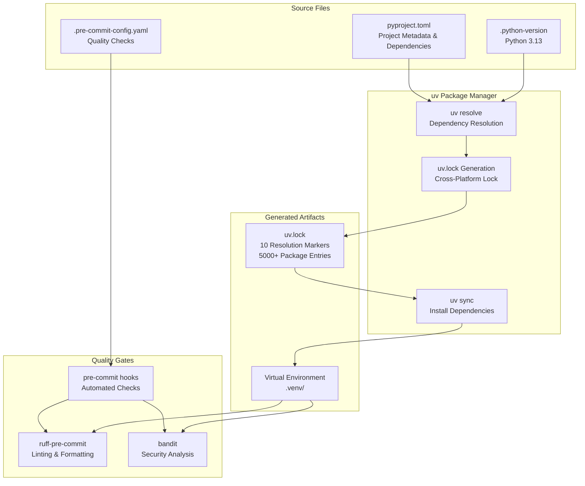
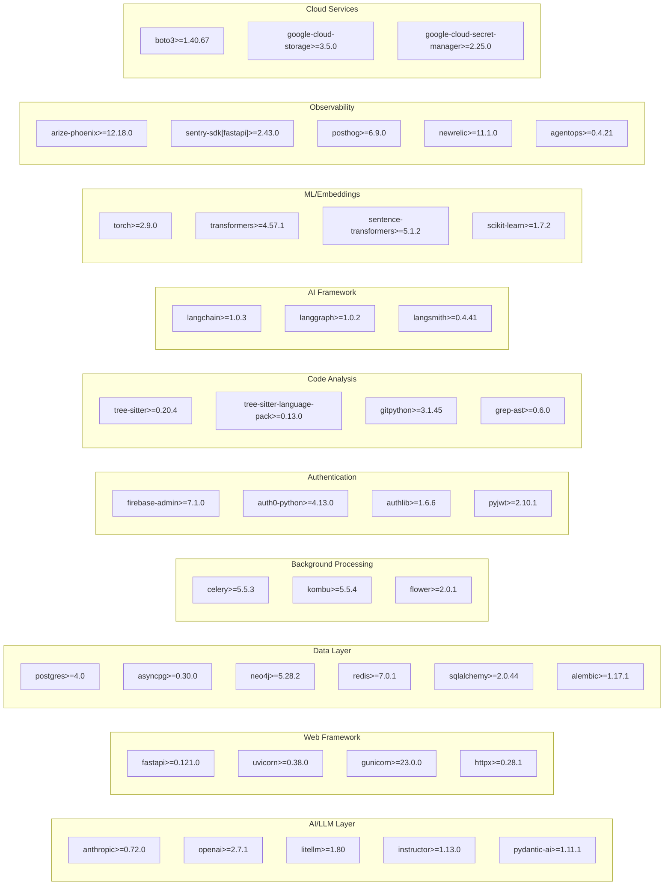
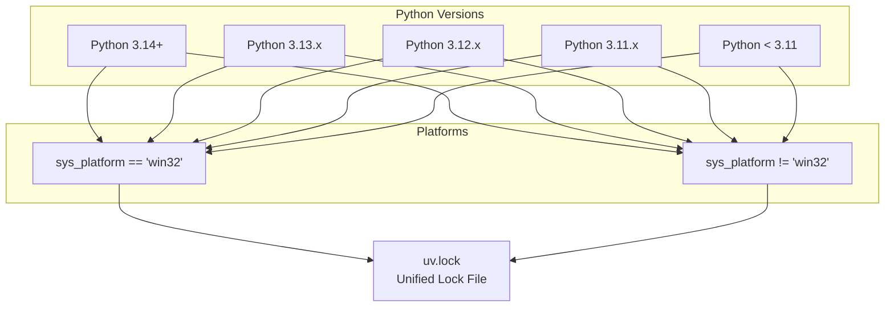
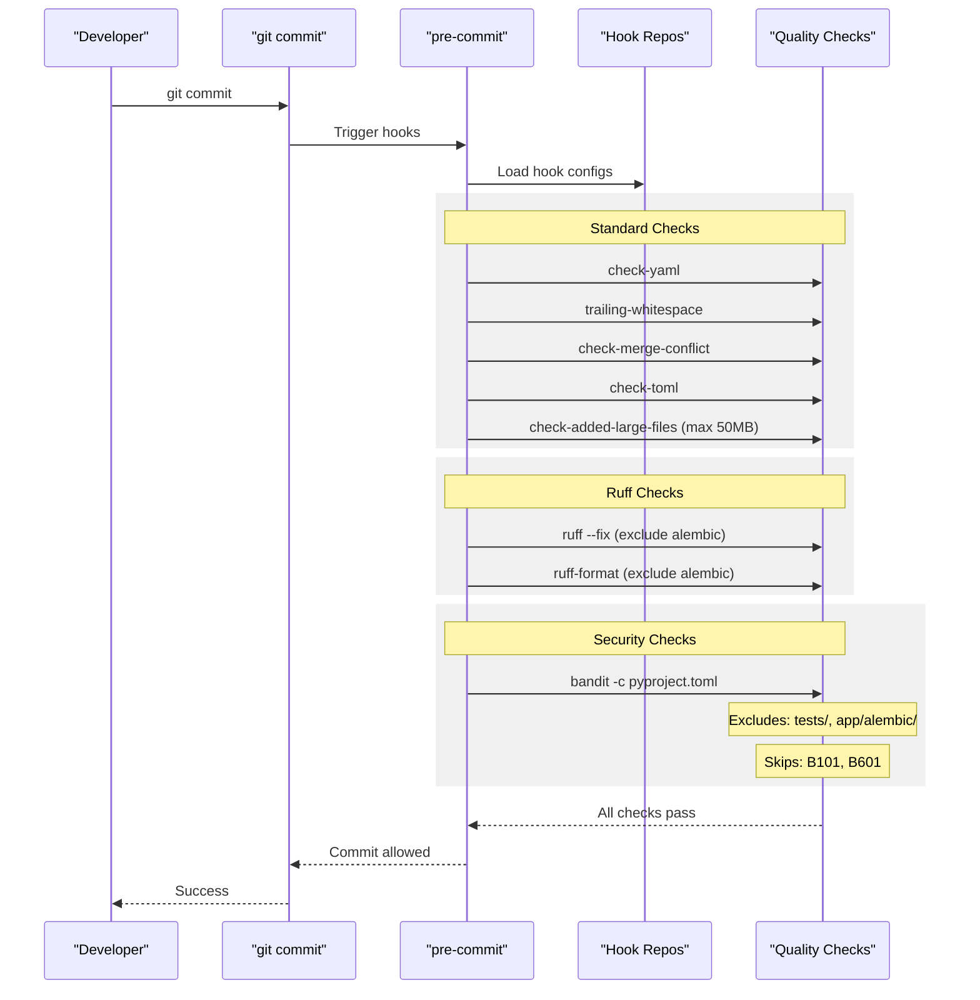

11.4-Dependency Management

# Page: Dependency Management

# Dependency Management

<details>
<summary>Relevant source files</summary>

The following files were used as context for generating this wiki page:

- [.pre-commit-config.yaml](.pre-commit-config.yaml)
- [.python-version](.python-version)
- [app/modules/auth/auth_service.py](app/modules/auth/auth_service.py)
- [app/modules/auth/tests/auth_service_test.py](app/modules/auth/tests/auth_service_test.py)
- [pyproject.toml](pyproject.toml)
- [uv.lock](uv.lock)

</details>


## Purpose and Scope

This document covers the dependency management system for the Potpie codebase, including the `uv` package manager, project configuration via `pyproject.toml`, dependency locking with `uv.lock`, and Python version management. For information about environment configuration and operational settings, see [System Configuration](#1.4). For production deployment specifics, see [Production Deployment](#11.2).

## Package Manager: uv

The codebase uses `uv` as its primary package manager, a fast Python package installer and resolver written in Rust. Unlike traditional tools like `pip` or `poetry`, `uv` provides deterministic dependency resolution with cross-platform lock files and significantly faster installation times.

### Key Characteristics

| Feature | Implementation |
|---------|----------------|
| **Lock File Format** | Universal lock file with platform-specific resolution markers |
| **Python Version** | Specified in `.python-version` and enforced via `requires-python` in `pyproject.toml` |
| **Dependency Groups** | Separate production and development dependency groups |
| **Resolution Strategy** | Multi-platform resolution with 10 different marker combinations |

The lock file [uv.lock:1-5]() declares:
- Lock version: `1`
- Revision: `3` 
- Python requirement: `>=3.10`
- 10 resolution markers for different Python versions and platforms (Windows vs non-Windows)

**Diagram 1: Dependency Management Workflow**



**Sources:** [pyproject.toml:1-112](), [uv.lock:1-15](), [.python-version:1-2](), [.pre-commit-config.yaml:1-30]()

## Project Configuration: pyproject.toml

The `pyproject.toml` file defines all project metadata, dependencies, and tool configurations using PEP 621 standards.

### Project Metadata

```toml
[project]
name = "potpie"
version = "0.1.0"
requires-python = ">=3.10"
```

The project requires Python 3.10 or higher [pyproject.toml:6](), though the actual development version is Python 3.13 [.python-version:1]().

### Production Dependencies

The codebase declares 82 production dependencies [pyproject.toml:7-89](), organized into functional categories:

**Diagram 2: Dependency Categories in pyproject.toml**



**Sources:** [pyproject.toml:7-89]()

### Development Dependencies

Development dependencies are isolated in a separate `[dependency-groups]` section [pyproject.toml:91-101]():

| Tool | Version | Purpose |
|------|---------|---------|
| `black` | >=25.9.0 | Code formatting |
| `isort` | >=7.0.0 | Import sorting |
| `ruff` | >=0.14.3 | Linting and formatting |
| `pylint` | >=4.0.2 | Static analysis |
| `bandit` | >=1.8.6 | Security vulnerability scanning |
| `pre-commit` | >=4.3.0 | Git hook management |
| `pytest` | >=8.4.2 | Testing framework |
| `pytest-asyncio` | >=1.2.0 | Async test support |

Note that `pytest` and `pytest-asyncio` appear in both production [pyproject.toml:67-68]() and development dependencies [pyproject.toml:98-99](). This duplication ensures test capabilities are available in both environments.

**Sources:** [pyproject.toml:91-101]()

### Tool Configuration

The `pyproject.toml` file includes inline tool configurations:

**Bandit Security Scanner Configuration**

```toml
[tool.bandit]
exclude_dirs = ["tests", "app/alembic"]
skips = ["B101", "B601"]
```

[pyproject.toml:106-108]() configures Bandit to:
- Exclude `tests/` and `app/alembic/` directories from scanning
- Skip rule `B101` (assert_used) - allows assert statements
- Skip rule `B601` (shell injection warnings) - necessary for bash command tool

**Ruff Configuration**

```toml
[tool.ruff]
exclude = ["tests", "app/alembic"]
```

[pyproject.toml:110-111]() excludes the same directories from Ruff linting, ensuring database migration files and test files don't trigger unnecessary warnings.

**Sources:** [pyproject.toml:106-112]()

## Lock File: uv.lock

The `uv.lock` file provides deterministic, cross-platform dependency resolution. Unlike traditional lock files that are platform-specific, `uv.lock` uses resolution markers to support multiple Python versions and operating systems in a single file.

### Resolution Markers

The lock file declares 10 resolution marker combinations [uv.lock:4-15]():

**Diagram 3: uv.lock Resolution Marker Matrix**



**Sources:** [uv.lock:4-15]()

### Package Entry Structure

Each package in `uv.lock` includes:

```toml
[[package]]
name = "aiohttp"
version = "3.13.3"
source = { registry = "https://pypi.org/simple" }
dependencies = [
    { name = "aiohappyeyeballs" },
    { name = "aiosignal" },
    { name = "async-timeout", marker = "python_full_version < '3.11'" },
    ...
]
sdist = { url = "...", hash = "sha256:...", size = 7844556 }
wheels = [
    { url = "...", hash = "sha256:...", size = 738950 },
    ...
]
```

The example shows `aiohttp` [uv.lock:73-190]() with:
- **Conditional dependencies**: `async-timeout` only for Python < 3.11
- **Source distribution**: Single tarball with SHA-256 hash
- **Multiple wheels**: Platform-specific wheels for macOS, Linux (various architectures), Windows, and musllinux variants

The `wheels` array contains entries for all supported platforms:
- macOS: `macosx_10_9_universal2`, `macosx_10_9_x86_64`, `macosx_11_0_arm64`
- Linux: `manylinux2014_aarch64`, `manylinux2014_x86_64`, etc.
- Windows: `win32`, `win_amd64`
- musllinux: For Alpine Linux and similar distributions

**Sources:** [uv.lock:73-190]()

### Lock File Size and Scope

The `uv.lock` file is substantial:
- Total size: Truncated in the provided excerpt at 1,310,651 characters
- Package count: Contains entries for all 82 production dependencies plus their transitive dependencies
- Typical entry count: 500+ packages when fully resolved

**Sources:** [uv.lock:1-218]()

## Python Version Management

The codebase uses a `.python-version` file to specify the target Python version:

```
3.13
```

[.python-version:1]() declares Python 3.13 as the development version. This file is recognized by:
- `pyenv` - Automatically switches to Python 3.13 when entering the directory
- `uv` - Uses this version for virtual environment creation
- IDEs - Configure Python interpreter automatically

The `pyproject.toml` specifies a broader compatibility range [pyproject.toml:6]():
```toml
requires-python = ">=3.10"
```

This means:
- **Development version**: Python 3.13 (exact)
- **Minimum supported version**: Python 3.10
- **Maximum tested version**: Python 3.14+ (via resolution markers)

**Sources:** [.python-version:1](), [pyproject.toml:6](), [uv.lock:4-15]()

## Pre-commit Integration

The `.pre-commit-config.yaml` file integrates dependency management with code quality checks [.pre-commit-config.yaml:1-30]().

**Diagram 4: Pre-commit Hook Execution Flow**



**Sources:** [.pre-commit-config.yaml:1-30]()

### Hook Configuration

The pre-commit hooks are organized into three repositories:

**1. Standard Python Hooks** [.pre-commit-config.yaml:2-13]()

Repository: `https://github.com/pre-commit/pre-commit-hooks` (v5.0.0)

| Hook | Purpose |
|------|---------|
| `check-yaml` | Validates YAML syntax |
| `trailing-whitespace` | Removes trailing spaces |
| `end-of-file-fixer` | Ensures files end with newline |
| `check-merge-conflict` | Detects merge conflict markers |
| `check-added-large-files` | Blocks files >50MB (`--maxkb=51200`) |
| `debug-statements` | Detects leftover debug code |
| `check-toml` | Validates TOML syntax (validates `pyproject.toml`) |

**2. Ruff Linting and Formatting** [.pre-commit-config.yaml:14-22]()

Repository: `https://github.com/astral-sh/ruff-pre-commit` (v0.8.2)

```yaml
- id: ruff
  args: ["--fix"]
  exclude: ^app/alembic/
- id: ruff-format
  exclude: ^app/alembic/
```

Automatically fixes linting issues and formats code, excluding database migration files.

**3. Security Analysis** [.pre-commit-config.yaml:23-30]()

Repository: `https://github.com/PyCQA/bandit` (1.7.10)

```yaml
- id: bandit
  args: ["-c", "pyproject.toml"]
  additional_dependencies: ["bandit[toml]"]
  exclude: ^(tests|app/alembic)/
```

Loads configuration from `pyproject.toml` and requires the `bandit[toml]` extra for TOML parsing support.

**Sources:** [.pre-commit-config.yaml:1-30]()

## Dependency Loading at Runtime

The codebase uses `python-dotenv` for environment variable management, which is loaded early in the authentication service [app/modules/auth/auth_service.py:5,11]():

```python
from dotenv import load_dotenv

load_dotenv(override=True)
```

The `override=True` parameter ensures that environment variables from `.env` files override system environment variables, which is critical for development mode configuration [app/modules/auth/auth_service.py:60]():

```python
if os.getenv("isDevelopmentMode") == "enabled" and credential is None:
```

This pattern allows the same codebase to run in both development and production modes based on environment configuration, which is covered in detail in [Development Mode](#11.1).

**Sources:** [app/modules/auth/auth_service.py:5,11,60]()

## Installation and Usage

### Installing Dependencies

```bash
# Install production dependencies
uv sync

# Install with development dependencies
uv sync --group dev

# Update lock file
uv lock

# Add a new dependency
uv add package-name

# Add a development dependency
uv add --dev package-name
```

### Pre-commit Setup

```bash
# Install pre-commit hooks
pre-commit install

# Run hooks manually on all files
pre-commit run --all-files

# Update hook versions
pre-commit autoupdate
```

### Version Requirements

| Component | Required Version | Specified In |
|-----------|------------------|--------------|
| Python | 3.13 (dev), >=3.10 (prod) | `.python-version`, `pyproject.toml` |
| uv | Latest stable | Not pinned |
| pre-commit | >=4.3.0 | `pyproject.toml` dev dependencies |

**Sources:** [pyproject.toml:1-112](), [.python-version:1]()