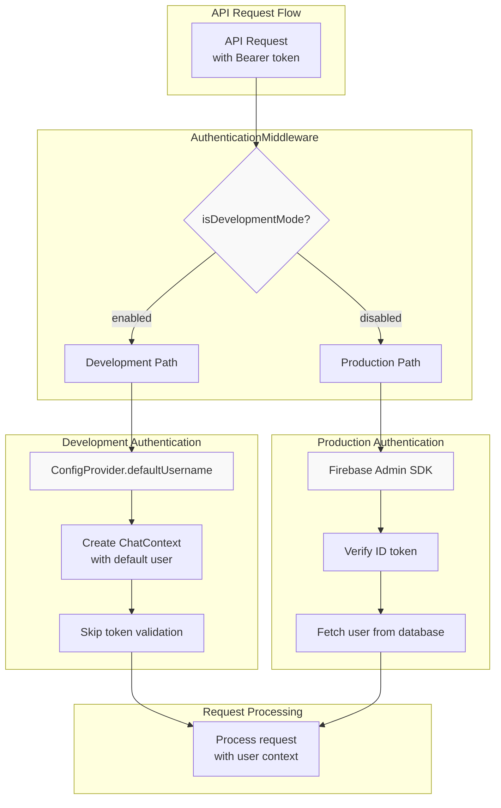
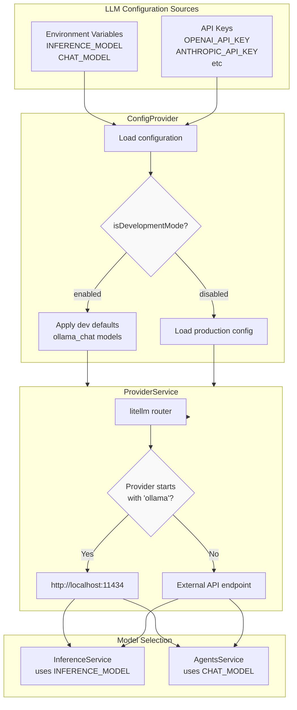
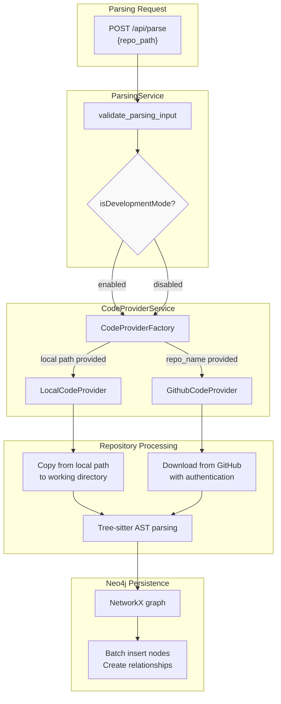

11.1-Development Mode

# Page: Development Mode

# Development Mode

<details>
<summary>Relevant source files</summary>

The following files were used as context for generating this wiki page:

- [.pre-commit-config.yaml](.pre-commit-config.yaml)
- [.python-version](.python-version)
- [GETTING_STARTED.md](GETTING_STARTED.md)
- [LICENSE](LICENSE)
- [app/modules/auth/auth_service.py](app/modules/auth/auth_service.py)
- [app/modules/auth/tests/auth_service_test.py](app/modules/auth/tests/auth_service_test.py)
- [contributing.md](contributing.md)
- [pyproject.toml](pyproject.toml)
- [uv.lock](uv.lock)

</details>


## Purpose and Scope

This document explains how to configure and use Potpie in development mode, which allows running the application without most production dependencies. Development mode is designed for local development, testing, and contribution workflows where full Firebase authentication, GitHub App integration, and cloud services are not required.

For production deployment configuration, see [Production Deployment](#11.2). For general environment configuration, see [Environment Configuration](#8.3).

---

## Overview

Development mode is a special operating configuration that bypasses production dependencies to enable rapid local development. When enabled, Potpie operates with minimal external service requirements, making it suitable for:

- Local development and testing
- Contributing to the codebase without production credentials
- Running Potpie with local LLM models (Ollama)
- Parsing local repositories without GitHub authentication
- Testing core functionality without Firebase, PostHog, or cloud storage

**Key Distinction**: Development mode (`isDevelopmentMode=enabled`) differs from the environment setting (`ENV=development`). The `ENV` variable controls which configuration profile to load (development/staging/production), while `isDevelopmentMode` fundamentally changes application behavior to disable dependency checks and enable fallback mechanisms.

Sources: [GETTING_STARTED.md:1-62](), [contributing.md:117-126]()

---

## Configuration Requirements

### Minimal Environment Setup

Development mode requires only three essential environment variables:

| Variable | Value | Purpose |
|----------|-------|---------|
| `isDevelopmentMode` | `enabled` | Activates development mode features |
| `ENV` | `development` | Loads development configuration profile |
| `OPENAI_API_KEY` or local model | API key or `ollama_chat/*` | Enables LLM functionality |

```bash
# Minimal .env configuration
isDevelopmentMode=enabled
ENV=development
OPENAI_API_KEY=sk-your-key-here
```

### Optional Docker Services

Development mode still requires Docker for running Neo4j and Redis containers, which are launched via `start.sh`:

```bash
# Install uv package manager
curl -LsSf https://astral.sh/uv/install.sh | sh

# Install dependencies
uv sync

# Start Docker services and application
./start.sh
```

The `start.sh` script automatically starts Neo4j and Redis containers, then launches the FastAPI application with hot-reload enabled.

Sources: [GETTING_STARTED.md:5-61]()

---

## Authentication Bypass Mechanism

### Default Username System

When `isDevelopmentMode` is enabled, the authentication system bypasses Firebase validation and uses a `defaultUsername` from the environment configuration. This eliminates the need for Firebase project setup, service account keys, or OAuth provider configuration.



**Development Mode Authentication Flow**

The authentication middleware checks `isDevelopmentMode` at the entry point of every authenticated request. When enabled, it:

1. Retrieves `defaultUsername` from `ConfigProvider`
2. Creates a user context without Firebase token validation
3. Bypasses all OAuth provider checks
4. Skips GitHub linking requirements (see [GitHub Linking Requirement](#7.2))

This allows API requests to proceed with a consistent test user identity without requiring:
- Firebase project configuration
- Service account JSON files
- OAuth client secrets
- Identity provider setup

### Database User Creation

In development mode, the default user must exist in the PostgreSQL `users` table. The system automatically creates this user on first run if it doesn't exist, using the `defaultUsername` as both the `uid` and `name` fields.

Sources: [GETTING_STARTED.md:18-19](), [contributing.md:122-125]()

---

## LLM Provider Configuration

### Local Model Support (Ollama)

Development mode provides first-class support for local LLM execution via Ollama, eliminating API costs and external dependencies during development:

```bash
# Local model configuration
INFERENCE_MODEL=ollama_chat/qwen2.5-coder:7b
CHAT_MODEL=ollama_chat/qwen2.5-coder:7b
```

The `ollama_chat/` prefix indicates the provider, followed by the model identifier. Popular development models include:

| Model | Use Case | Memory Requirement |
|-------|----------|-------------------|
| `qwen2.5-coder:7b` | Code generation, Q&A | ~8GB RAM |
| `codellama:7b` | Code understanding | ~8GB RAM |
| `mistral:7b` | General chat | ~8GB RAM |

**Model Selection Strategy**:
- `INFERENCE_MODEL`: Used for knowledge graph docstring generation during repository parsing
- `CHAT_MODEL`: Used for agent reasoning and conversation responses

These models are accessed through `ProviderService` via litellm, which provides a unified interface regardless of provider.

### Cloud Provider Fallback

Development mode also supports cloud providers for developers who prefer API-based models:

```bash
# OpenAI configuration
OPENAI_API_KEY=sk-your-key
INFERENCE_MODEL=gpt-4o-mini
CHAT_MODEL=gpt-4o

# Anthropic configuration
ANTHROPIC_API_KEY=sk-ant-your-key
INFERENCE_MODEL=claude-3-5-sonnet-20241022
CHAT_MODEL=claude-3-5-sonnet-20241022

# OpenRouter configuration
OPENROUTER_API_KEY=sk-or-your-key
INFERENCE_MODEL=openrouter/deepseek/deepseek-chat
CHAT_MODEL=openrouter/deepseek/deepseek-chat
```

Model names follow litellm's convention: `provider/model-name` or direct model identifiers for well-known providers.



**LLM Provider Configuration Flow**

Sources: [GETTING_STARTED.md:31-46]()

---

## Feature Differences from Production

### Disabled Services

When `isDevelopmentMode` is enabled, the following production services are disabled or bypassed:

#### Authentication & Identity
- **Firebase Authentication**: No Firebase project, service account, or ID token validation required
- **OAuth Providers**: Google, Azure, Okta, SAML SSO providers disabled
- **GitHub Linking**: GitHub account linking requirement bypassed
- **Multi-Provider Support**: Account consolidation via `PendingProviderLink` disabled

#### Cloud Services
- **Google Cloud Secret Manager**: Secrets read from environment variables only
- **Object Storage**: S3/GCS/Azure storage disabled; multimodal features unavailable unless configured
- **PostHog Analytics**: Event tracking disabled
- **Sentry Error Tracking**: Error reporting disabled

#### Integration Services
- **Slack Notifications**: Parsing completion webhooks disabled
- **Email Notifications**: Success/failure emails not sent
- **GitHub App**: Private repository access falls back to public access only

### Simplified Services

Some services operate with reduced functionality:

| Service | Production Behavior | Development Mode Behavior |
|---------|---------------------|---------------------------|
| `MediaService` | Uploads to cloud storage | Disabled unless storage configured |
| `GithubService` | Uses GitHub App + PAT pool | Public repository access only |
| `CodeProviderService` | Multi-provider support | Local file system preferred |
| `SecretManager` | Fetches from GCP Secret Manager | Reads from environment variables |
| `EmailHelper` | Sends SMTP emails | Logs email content only |

### Fully Functional Services

These core services operate identically in both modes:

- **Repository Parsing**: Full AST analysis with Tree-sitter
- **Knowledge Graph**: Complete Neo4j graph construction
- **Agent System**: All agents (QnA, Debug, CodeGen, Test, LLD) functional
- **Tool System**: 70+ tools available (except cloud integrations)
- **Conversation System**: Full chat functionality with streaming
- **Background Processing**: Celery workers for async tasks

Sources: [GETTING_STARTED.md:1-62](), [contributing.md:122-125]()

---

## Local Development Workflow

### Complete Setup Process

```bash
# 1. Clone repository
git clone https://github.com/potpie-ai/potpie.git
cd potpie

# 2. Install uv package manager
curl -LsSf https://astral.sh/uv/install.sh | sh

# 3. Create .env from template
cp .env.template .env

# 4. Configure minimal environment
cat > .env << EOF
isDevelopmentMode=enabled
ENV=development
OPENAI_API_KEY=sk-your-key-here
# OR use local models:
# INFERENCE_MODEL=ollama_chat/qwen2.5-coder:7b
# CHAT_MODEL=ollama_chat/qwen2.5-coder:7b
EOF

# 5. Install dependencies
uv sync

# 6. Make start script executable
chmod +x start.sh

# 7. Start services
./start.sh
```

The `start.sh` script performs the following operations:

1. Starts Neo4j container (port 7687 for Bolt, 7474 for HTTP)
2. Starts Redis container (port 6379)
3. Waits for database readiness
4. Launches FastAPI application with uvicorn hot-reload
5. Starts Celery worker for background tasks

### Service Access Points

Once running, the following services are available:

| Service | URL | Purpose |
|---------|-----|---------|
| API Server | `http://localhost:8001` | REST API endpoints |
| API Documentation | `http://localhost:8001/docs` | Interactive Swagger UI |
| Neo4j Browser | `http://localhost:7474` | Graph database UI |
| Redis | `localhost:6379` | Cache and streams (CLI access) |

### Local Repository Parsing

In development mode, you can parse local repositories without GitHub authentication:

```bash
# API request to parse local repository
curl -X POST http://localhost:8001/api/parse \
  -H "Content-Type: application/json" \
  -H "Authorization: Bearer dev-token" \
  -d '{
    "repo_name": "local",
    "repo_path": "/absolute/path/to/repository",
    "branch": "main"
  }'
```

The `CodeProviderService` detects `isDevelopmentMode` and automatically uses the `LocalCodeProvider` for local file system access, bypassing GitHub API calls entirely.



**Local Repository Parsing Flow**

Sources: [GETTING_STARTED.md:49-61]()

---

## Development Mode vs ENV Variable

### Conceptual Distinction

The codebase uses two related but distinct configuration concepts:

**`ENV` Variable** (Environment Profile):
- Controls which configuration profile to load
- Values: `development`, `staging`, `production`
- Affects logging levels, database connection pooling, debug modes
- Does NOT disable dependencies

**`isDevelopmentMode` Flag** (Dependency Bypass):
- Controls whether production dependencies are required
- Values: `enabled`, `disabled` (or unset)
- Disables Firebase, GitHub App, cloud services, analytics
- Enables authentication bypass and local-first operation

### Configuration Matrix

| Scenario | ENV | isDevelopmentMode | Use Case |
|----------|-----|-------------------|----------|
| **Local Development (minimal)** | `development` | `enabled` | Contributing without credentials |
| **Local Development (full)** | `development` | `disabled` | Testing with production services locally |
| **Staging Deployment** | `staging` | `disabled` | Pre-production testing environment |
| **Production Deployment** | `production` | `disabled` | Live application |

### Code Implementation Pattern

Throughout the codebase, services check `isDevelopmentMode` to determine behavior:

```python
# Typical pattern in services
def some_service_method(self):
    config = ConfigProvider()
    
    if config.is_development_mode():
        # Use simplified/local implementation
        return self._local_fallback()
    else:
        # Use full production implementation
        return self._production_implementation()
```

Common locations for these checks:
- [app/modules/auth/unified_auth_service.py]() - Authentication bypass
- [app/modules/code_provider/code_provider_factory.py]() - Provider selection
- [app/modules/utils/config_provider.py]() - Configuration loading
- [app/modules/intelligence/provider/provider_service.py]() - LLM provider setup

### Environment Variable Precedence

Configuration loading follows this precedence (highest to lowest):

1. Runtime overrides (for library usage)
2. Environment variables from `.env` file
3. System environment variables
4. Default values in `ConfigProvider`

When `isDevelopmentMode=enabled`, defaults are automatically adjusted to minimize required configuration.

Sources: [contributing.md:117-126](), [GETTING_STARTED.md:14-21]()

---

## Troubleshooting Development Mode

### Common Issues

**Issue: "Firebase credentials not found"**
- **Cause**: `isDevelopmentMode` not set to `enabled`
- **Solution**: Add `isDevelopmentMode=enabled` to `.env` file

**Issue: "Neo4j connection failed"**
- **Cause**: Docker containers not running
- **Solution**: Verify Docker is running, execute `./start.sh`

**Issue: "LLM model not responding"**
- **Cause**: Ollama not running or incorrect model name
- **Solution**: Start Ollama (`ollama serve`) and pull model (`ollama pull qwen2.5-coder:7b`)

**Issue: "Authentication token invalid"**
- **Cause**: Token validation still enabled
- **Solution**: Confirm `isDevelopmentMode=enabled` in environment

### Debug Configuration

Enable verbose logging for troubleshooting:

```bash
# Add to .env
LOG_LEVEL=DEBUG
isDevelopmentMode=enabled
ENV=development
```

This provides detailed logs showing:
- Configuration values loaded
- Authentication bypass activation
- Provider selection decisions
- Service initialization sequence

Sources: [GETTING_STARTED.md:1-62](), [contributing.md:117-126]()