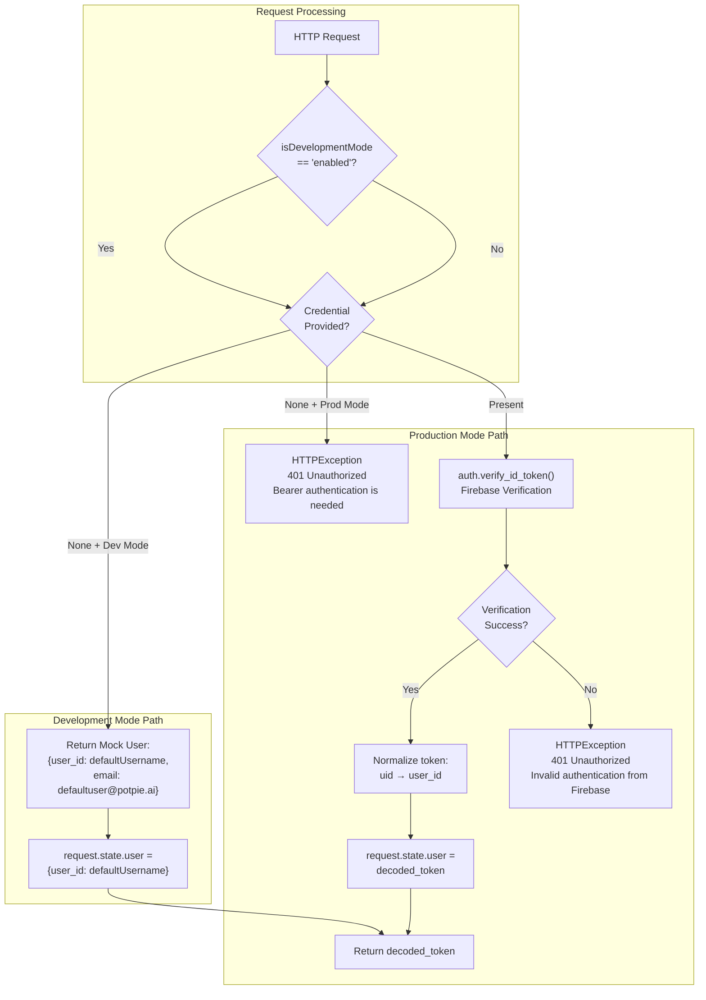
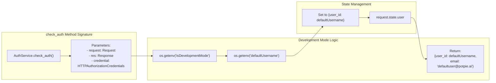
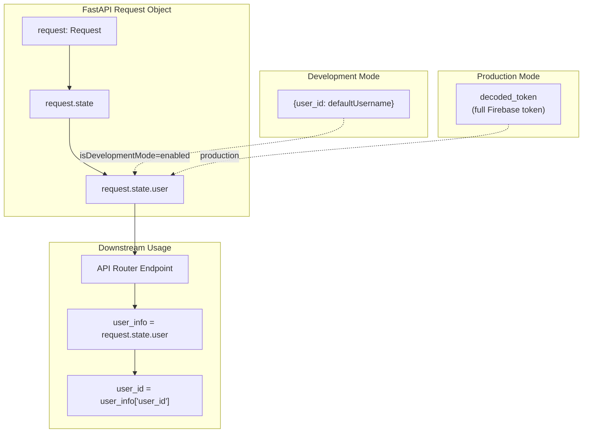
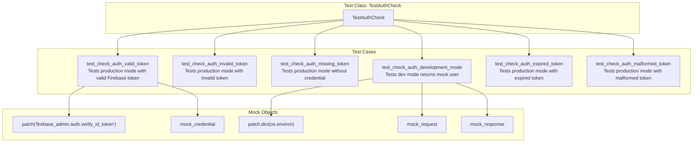
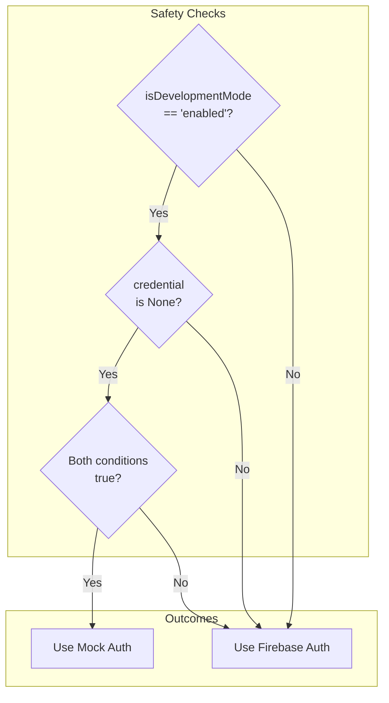
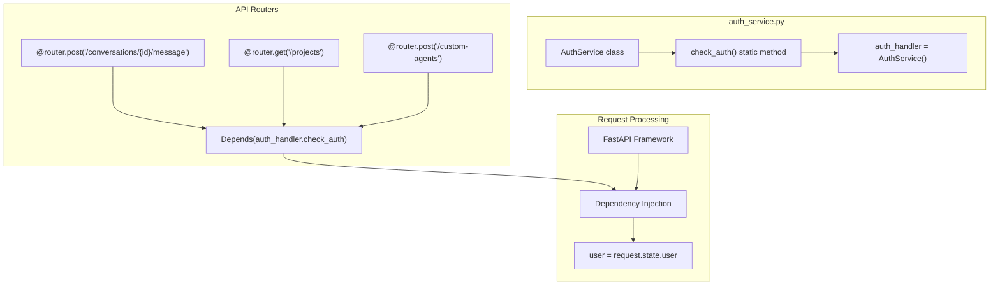

7.6-Development Mode Authentication

# Page: Development Mode Authentication

# Development Mode Authentication

<details>
<summary>Relevant source files</summary>

The following files were used as context for generating this wiki page:

- [.pre-commit-config.yaml](.pre-commit-config.yaml)
- [.python-version](.python-version)
- [app/modules/auth/auth_service.py](app/modules/auth/auth_service.py)
- [app/modules/auth/tests/auth_service_test.py](app/modules/auth/tests/auth_service_test.py)
- [pyproject.toml](pyproject.toml)
- [uv.lock](uv.lock)

</details>


## Purpose and Scope

This document describes the development mode authentication mechanism that allows developers to bypass Firebase authentication during local development. This feature enables rapid development and testing without requiring valid Firebase credentials or internet connectivity.

For production authentication flows, see [Multi-Provider Authentication](#7.1). For general development mode configuration, see [Development Mode](#11.1). For environment variable setup, see [Environment Configuration](#8.3).

---

## Overview

Development mode authentication is a mock authentication system that bypasses Firebase token verification when the application is running in development mode. When enabled, it automatically authenticates requests with a pre-configured default user instead of requiring valid Firebase ID tokens.

**Key characteristics:**
- Bypasses Firebase `auth.verify_id_token()` calls
- Returns a hardcoded user identity
- Only activates when specific environment variables are set
- Disabled automatically in production environments
- Requires no Bearer token when enabled

---

## Configuration

### Environment Variables

Development mode authentication requires two environment variables to be configured:

| Variable | Value | Purpose |
|----------|-------|---------|
| `isDevelopmentMode` | `"enabled"` | Activates development mode authentication |
| `defaultUsername` | String (e.g., `"dev_user"`) | User ID returned for all authenticated requests |

**Example `.env` configuration:**

```env
isDevelopmentMode=enabled
defaultUsername=test-user-123
```

**Sources:** [app/modules/auth/auth_service.py:60-66](), [app/modules/auth/tests/auth_service_test.py:244-246]()

---

## Authentication Flow Comparison

### Development Mode vs Production Mode



**Sources:** [app/modules/auth/auth_service.py:48-104]()

---

## Implementation Details

### AuthService.check_auth Method

The `check_auth` static method in `AuthService` implements the development mode authentication logic. This method is used as a FastAPI dependency via `Depends()` throughout the application.



**Code location:** [app/modules/auth/auth_service.py:48-66]()

### Authentication Response Structure

In development mode, the `check_auth` method returns a dictionary with the following structure:

| Field | Value | Type |
|-------|-------|------|
| `user_id` | Value of `defaultUsername` environment variable | `str` |
| `email` | Hardcoded: `"defaultuser@potpie.ai"` | `str` |

**Contrast with production mode:**

In production, Firebase token verification returns additional fields from the decoded JWT token, including:
- `uid` (normalized to `user_id` for consistency)
- `email` (actual user email from Firebase)
- Additional Firebase claims (aud, iat, exp, etc.)

**Sources:** [app/modules/auth/auth_service.py:61-66](), [app/modules/auth/auth_service.py:82-90]()

---

## Request State Population

Both development and production modes populate `request.state.user` to maintain consistency across the application. This allows downstream code to access user information identically regardless of authentication mode.



**Sources:** [app/modules/auth/auth_service.py:61](), [app/modules/auth/auth_service.py:95]()

---

## Testing with Development Mode

### Test Suite Structure

The test suite in [app/modules/auth/tests/auth_service_test.py]() includes comprehensive coverage of development mode authentication:



### Development Mode Test Example

The test at [app/modules/auth/tests/auth_service_test.py:236-252]() demonstrates the expected behavior:

**Test steps:**
1. Patch environment variables: `isDevelopmentMode="enabled"`, `defaultUsername="dev_user"`
2. Call `check_auth()` with `credential=None`
3. Assert returned user_id matches `defaultUsername`
4. Assert email is `"defaultuser@potpie.ai"`
5. Assert `request.state.user` is populated correctly

**Sources:** [app/modules/auth/tests/auth_service_test.py:236-252]()

---

## Security Considerations

### Production Safety Mechanisms

Development mode authentication includes several safety mechanisms to prevent accidental use in production:



**Critical security points:**

1. **Dual-condition requirement**: Development mode only activates when BOTH `isDevelopmentMode="enabled"` AND no credential is provided
2. **If a Bearer token is sent**: Even with development mode enabled, the presence of a credential triggers normal Firebase verification
3. **Environment-based**: The mode is controlled by environment variables, which should never be set to "enabled" in production deployments
4. **No backdoor access**: There is no secret token or bypass mechanism; production environments must have `isDevelopmentMode` unset or set to any value other than "enabled"

**Sources:** [app/modules/auth/auth_service.py:60-76]()

### Recommended Deployment Practices

| Environment | `isDevelopmentMode` | `defaultUsername` | Notes |
|-------------|---------------------|-------------------|-------|
| Local Development | `"enabled"` | Any string (e.g., `"dev_user"`) | Enables rapid development |
| CI/CD Testing | `"enabled"` | `"test_user"` | Allows automated tests without Firebase |
| Staging | Unset or `"disabled"` | Unset | Should use real Firebase auth |
| Production | **Must be unset** | **Must be unset** | Never enable in production |

**Sources:** [app/modules/auth/auth_service.py:60]()

---

## Logging and Debugging

The `check_auth` method includes extensive debug logging to help developers understand which authentication path is being used:

**Log statements in development mode:**
- `"DEBUG: AuthService.check_auth called"`
- `"DEBUG: Development mode: <value>"`
- `"DEBUG: Credential provided: <boolean>"`
- `"DEBUG: Development mode enabled. Using Mock Authentication."`

**Log statements in production mode:**
- `"DEBUG: Verifying Firebase token: <token_prefix>..."`
- `"DEBUG: Successfully verified token for user: <user_id>"`
- `"DEBUG: Token email: <email>"`
- `"DEBUG: Firebase token verification failed: <error>"`

These logs appear when the application is run with appropriate logging configuration.

**Sources:** [app/modules/auth/auth_service.py:55-62](), [app/modules/auth/auth_service.py:78-97]()

---

## Integration with FastAPI Dependency Injection

### Usage Pattern Across Routers

The `auth_handler.check_auth` method is used as a FastAPI dependency throughout the application's router endpoints:



**Sources:** [app/modules/auth/auth_service.py:107]()

### Dependency Declaration

Endpoints typically declare the authentication dependency like this:

```python
async def endpoint(
    user=Depends(auth_handler.check_auth),
    # other parameters...
):
    user_id = user["user_id"]
    # endpoint logic...
```

In development mode, `user` will contain the mock user dictionary. In production, it will contain the decoded Firebase token.

**Sources:** [app/modules/auth/auth_service.py:107]()

---

## Comparison Table: Development vs Production Authentication

| Aspect | Development Mode | Production Mode |
|--------|------------------|-----------------|
| **Activation** | `isDevelopmentMode="enabled"` | `isDevelopmentMode` unset or any value != "enabled" |
| **Token Required** | No (unless explicitly provided) | Yes (Bearer token mandatory) |
| **Verification Method** | No verification | Firebase `auth.verify_id_token()` |
| **User ID Source** | `defaultUsername` environment variable | Firebase JWT `uid` field |
| **Email Source** | Hardcoded `"defaultuser@potpie.ai"` | Firebase JWT `email` field |
| **Request Time** | Near-instant (no network call) | Network latency to Firebase API |
| **Error Handling** | Always succeeds (when conditions met) | Can fail with 401 if token invalid |
| **User Claims** | Minimal (user_id, email only) | Full Firebase token claims |
| **State Population** | `request.state.user = {user_id: ...}` | `request.state.user = decoded_token` |
| **Security Risk** | High if enabled in production | Standard Firebase security model |

**Sources:** [app/modules/auth/auth_service.py:60-104]()

---

## Related Configuration Files

### Environment Template

The repository includes environment variable templates that developers should use to configure development mode. While not directly shown in the provided files, the standard practice is to have a `.env.template` or `.env.example` file.

### Python Version

The application requires Python 3.10 or higher, as specified in:
- [.python-version:1]() - specifies `3.13`
- [pyproject.toml:6]() - specifies `requires-python = ">=3.10"`

**Sources:** [.python-version:1](), [pyproject.toml:6]()

---

## Summary

Development mode authentication provides a streamlined authentication bypass for local development by:

1. Checking the `isDevelopmentMode` environment variable
2. Returning a mock user when enabled and no credential is provided
3. Maintaining the same `request.state.user` interface as production
4. Including dual-condition safety to prevent accidental production use
5. Supporting the same dependency injection pattern across all endpoints

This feature enables developers to work on the application without requiring Firebase connectivity or credentials, while maintaining a consistent authentication interface throughout the codebase.

**Sources:** [app/modules/auth/auth_service.py:48-104](), [app/modules/auth/tests/auth_service_test.py:236-252]()