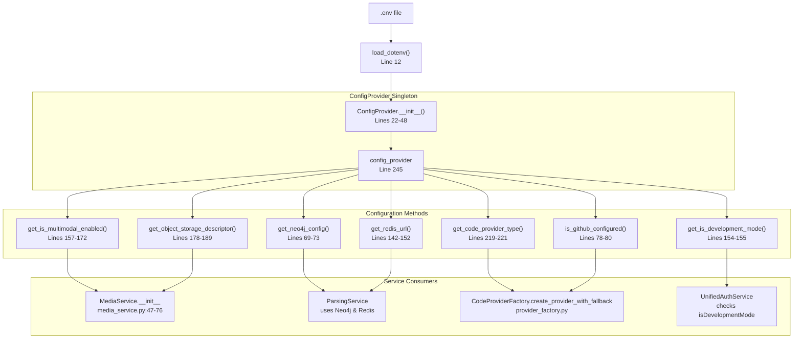
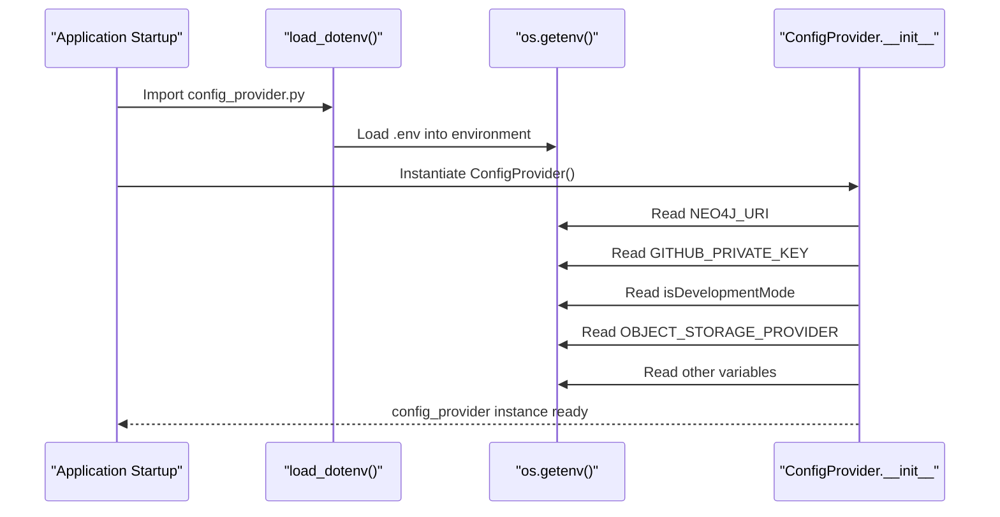
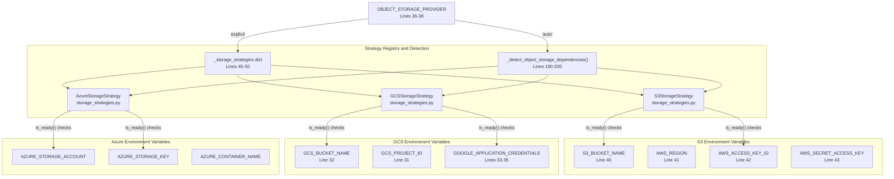
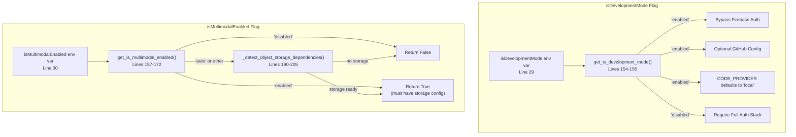
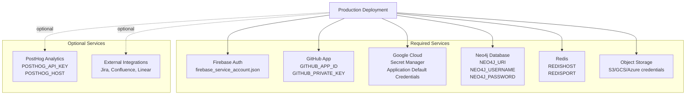
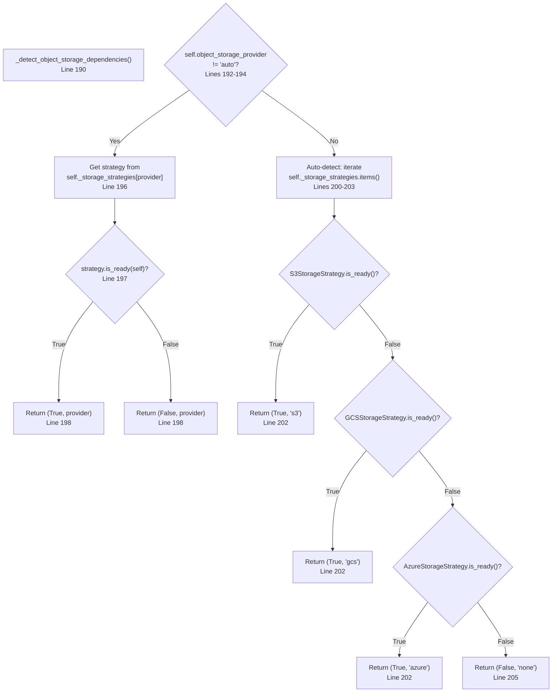
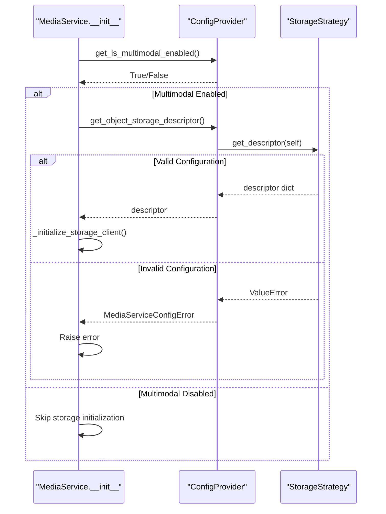
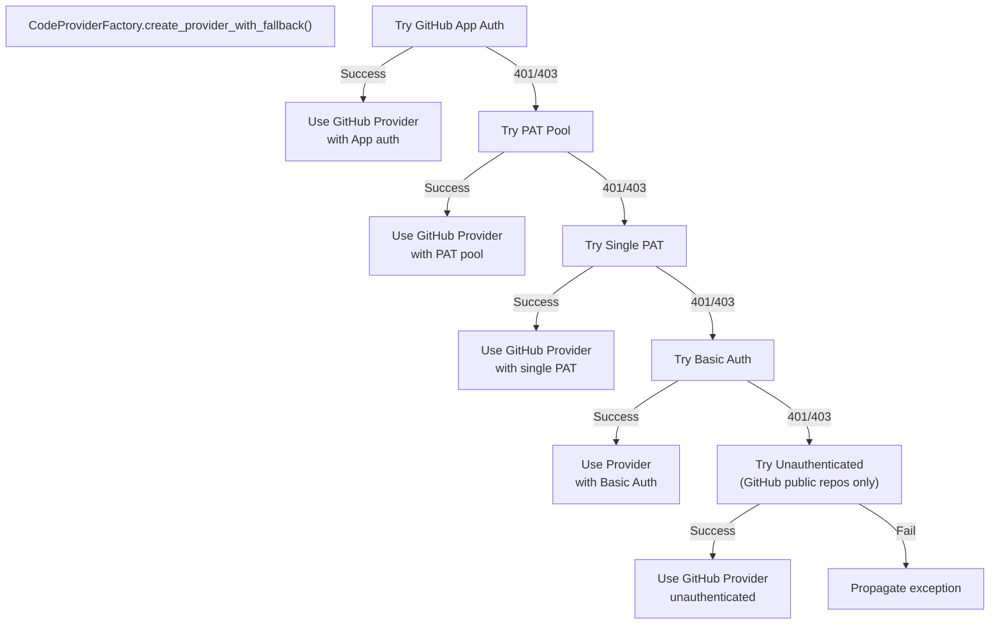
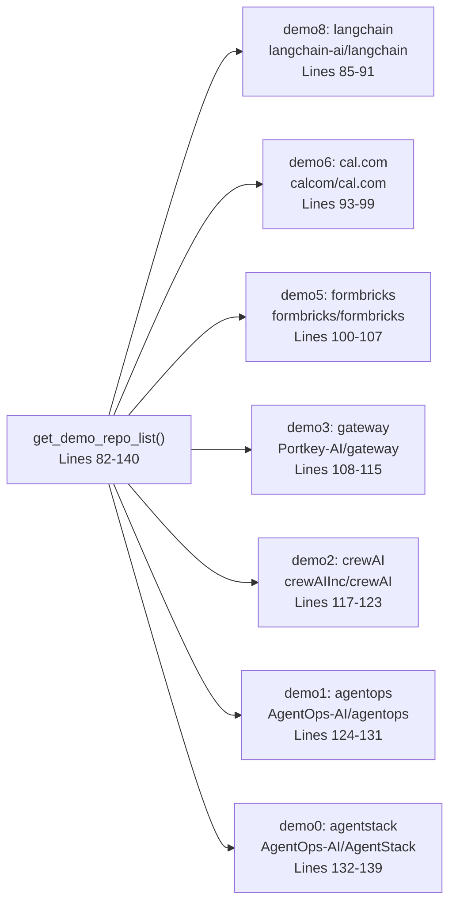

8.3-Environment Configuration

# Page: Environment Configuration

# Environment Configuration

<details>
<summary>Relevant source files</summary>

The following files were used as context for generating this wiki page:

- [GETTING_STARTED.md](GETTING_STARTED.md)
- [LICENSE](LICENSE)
- [contributing.md](contributing.md)

</details>


## Purpose and Scope

This document details the environment configuration system in Potpie, including all environment variables, their purposes, default values, and configuration requirements for different deployment scenarios. The configuration system controls database connections, authentication providers, LLM models, object storage, feature flags, and code provider settings.

For information about the central configuration management class, see [Configuration Provider](#8.1). For media storage configuration specifically, see [Media Service and Storage](#8.2).

## Configuration Architecture

Potpie uses a centralized configuration system that loads environment variables from a `.env` file and provides typed access through the `ConfigProvider` class. This singleton pattern ensures consistent configuration access across all services.



**Sources:** [app/core/config_provider.py:12](), [app/core/config_provider.py:22-48](), [app/core/config_provider.py:69-73](), [app/core/config_provider.py:142-152](), [app/core/config_provider.py:157-172](), [app/core/config_provider.py:154-155](), [app/core/config_provider.py:219-221](), [app/core/config_provider.py:178-189](), [app/core/config_provider.py:78-80](), [app/core/config_provider.py:245](), [app/modules/media/media_service.py:47-76]()

The `ConfigProvider` class instantiates once at module load time [app/core/config_provider.py:245]() and provides methods for accessing configuration values with type conversion and validation.

## Environment Variable Loading

Environment variables are loaded using the `python-dotenv` library at module initialization:



**Sources:** [app/core/config_provider.py:4](), [app/core/config_provider.py:12](), [app/core/config_provider.py:22-48]()

## Environment Variable Categories

### Database Configuration

| Variable | Type | Required | Default | Description |
|----------|------|----------|---------|-------------|
| `NEO4J_URI` | string | Yes | - | Neo4j connection URI (e.g., `bolt://localhost:7687`) |
| `NEO4J_USERNAME` | string | Yes | - | Neo4j database username |
| `NEO4J_PASSWORD` | string | Yes | - | Neo4j database password |
| `REDISHOST` | string | No | `localhost` | Redis server hostname |
| `REDISPORT` | integer | No | `6379` | Redis server port |
| `REDISUSER` | string | No | - | Redis username (if authentication required) |
| `REDISPASSWORD` | string | No | - | Redis password (if authentication required) |

**Sources:** [app/core/config_provider.py:23-26](), [app/core/config_provider.py:143-152]()

The Neo4j configuration is accessed via `get_neo4j_config()` [app/core/config_provider.py:69-73]() which returns a dictionary containing all three Neo4j parameters. The system supports runtime Neo4j override via class-level `set_neo4j_override()` [app/core/config_provider.py:52-62]() for library usage scenarios. Redis URL construction handles both authenticated and unauthenticated configurations [app/core/config_provider.py:148-151]().

### Authentication Configuration

| Variable | Type | Required | Default | Description |
|----------|------|----------|---------|-------------|
| `GITHUB_PRIVATE_KEY` | string | Conditional | - | GitHub App private key (PEM format, newlines as `\n`) |
| `GITHUB_APP_ID` | string | Conditional | - | GitHub App ID for authentication |
| `ENCRYPTION_KEY` | string | Yes | - | Key for encrypting OAuth tokens in database |

**Sources:** [app/core/config_provider.py:28](), [app/core/config_provider.py:78-80](), [GETTING_STARTED.md:109-117]()

GitHub authentication is optional in development mode but required for production. The private key must be formatted with escaped newlines. The helper script `format_pem.sh` converts standard PEM files to the required format [GETTING_STARTED.md:110-117]().

### LLM and AI Model Configuration

| Variable | Type | Required | Default | Description |
|----------|------|----------|---------|-------------|
| `INFERENCE_MODEL` | string | Yes | - | Model for knowledge graph generation (litellm format) |
| `CHAT_MODEL` | string | Yes | - | Model for agent reasoning (litellm format) |
| `OPENAI_API_KEY` | string | Conditional | - | OpenAI API key (if using OpenAI models) |
| `{PROVIDER}_API_KEY` | string | Conditional | - | API key for specific LLM provider |

**Sources:** [GETTING_STARTED.md:20](), [GETTING_STARTED.md:31-46]()

Model names must follow litellm's provider/model format (e.g., `openrouter/deepseek/deepseek-chat` or `ollama_chat/qwen2.5-coder:7b`). For local models, the `ollama_chat/` prefix indicates Ollama provider [GETTING_STARTED.md:34-36]().

### Object Storage Configuration



**Sources:** [app/core/config_provider.py:36-38](), [app/core/config_provider.py:40-43](), [app/core/config_provider.py:31-35](), [app/core/config_provider.py:45-50](), [app/core/config_provider.py:190-205](), [app/core/config_provider.py:6-10]()

| Variable | Type | Required | Default | Description |
|----------|------|----------|---------|-------------|
| `OBJECT_STORAGE_PROVIDER` | string | No | `auto` | Storage provider selection: `auto`, `s3`, `gcs`, `azure` |
| `S3_BUCKET_NAME` | string | For S3 | - | AWS S3 bucket name |
| `AWS_REGION` | string | For S3 | - | AWS region (e.g., `us-east-1`) |
| `AWS_ACCESS_KEY_ID` | string | For S3 | - | AWS access key |
| `AWS_SECRET_ACCESS_KEY` | string | For S3 | - | AWS secret key |
| `GCS_BUCKET_NAME` | string | For GCS | - | Google Cloud Storage bucket name |
| `GCS_PROJECT_ID` | string | For GCS | - | GCP project ID |
| `GOOGLE_APPLICATION_CREDENTIALS` | string | For GCS | - | Path to GCP service account JSON |
| `AZURE_STORAGE_ACCOUNT` | string | For Azure | - | Azure storage account name |
| `AZURE_STORAGE_KEY` | string | For Azure | - | Azure storage account key |
| `AZURE_CONTAINER_NAME` | string | For Azure | - | Azure blob container name |

The auto-detection mechanism iterates through storage strategies and returns the first provider with complete configuration [app/core/config_provider.py:200-203](). Storage strategies implement the Strategy pattern [app/core/config_provider.py:45-50]() with separate classes for each provider imported from `storage_strategies.py` [app/core/config_provider.py:6-10]().

### Code Provider Configuration

| Variable | Type | Required | Default | Description |
|----------|------|----------|---------|-------------|
| `CODE_PROVIDER` | string | No | `github` | Code provider type: `github`, `gitbucket`, `gitlab`, `local` |
| `CODE_PROVIDER_BASE_URL` | string | For self-hosted | - | Base URL for self-hosted Git server |
| `CODE_PROVIDER_TOKEN` | string | Conditional | - | Primary Personal Access Token (PAT) |
| `CODE_PROVIDER_TOKEN_POOL` | string | No | - | Comma-separated list of PATs for rate limit distribution |
| `CODE_PROVIDER_USERNAME` | string | For Basic Auth | - | Username for Basic Authentication |
| `CODE_PROVIDER_PASSWORD` | string | For Basic Auth | - | Password for Basic Authentication |
| `GH_TOKEN_LIST` | string | Legacy | - | Legacy GitHub token pool (comma-separated) |

**Sources:** [app/core/config_provider.py:219-242](), [app/modules/code_provider/code_provider_service.py:162-169](), [GETTING_STARTED.md:119]()

The code provider system supports multiple authentication fallback strategies. When `CODE_PROVIDER` is set to a provider other than GitHub, authentication follows this priority: GitHub App → PAT pool → Single PAT → Basic Auth → Unauthenticated [app/modules/code_provider/code_provider_service.py:200-229]().

### Feature Flags



**Sources:** [app/core/config_provider.py:29](), [app/core/config_provider.py:154-155](), [app/core/config_provider.py:30](), [app/core/config_provider.py:157-172](), [app/core/config_provider.py:190-205](), [contributing.md:117-125]()

| Variable | Type | Required | Default | Description |
|----------|------|----------|---------|-------------|
| `isDevelopmentMode` | string | No | `disabled` | Development mode: `enabled` or `disabled` |
| `isMultimodalEnabled` | string | No | `auto` | Multimodal functionality: `auto`, `enabled`, or `disabled` |
| `ENV` | string | No | - | Environment identifier: `development`, `staging`, `production` |

**Important distinction:** `isDevelopmentMode=enabled` bypasses authentication and external dependencies, allowing local-only operation. `ENV=development` indicates the deployment environment but still requires full configuration (Firebase, GCP, GitHub) [contributing.md:117-125]().

The multimodal feature flag has three modes [app/core/config_provider.py:135-150]():
- `disabled`: Always disabled regardless of storage configuration
- `enabled`: Force enabled (raises error if storage not configured)
- `auto` (default): Automatically enables if object storage dependencies are present

### Redis Streaming Configuration

| Variable | Type | Required | Default | Description |
|----------|------|----------|---------|-------------|
| `REDIS_STREAM_TTL_SECS` | integer | No | `900` | Stream TTL in seconds (15 minutes) |
| `REDIS_STREAM_MAX_LEN` | integer | No | `1000` | Maximum stream length |
| `REDIS_STREAM_PREFIX` | string | No | `chat:stream` | Prefix for stream keys |

**Sources:** [app/core/config_provider.py:207-217]()

These static methods provide default values for Redis stream configuration used by the streaming response system. The TTL determines how long stream data persists after session completion [app/core/config_provider.py:209]().

## Deployment Mode Comparison

### Development Mode Configuration

Development mode (`isDevelopmentMode=enabled`) is designed for local development without external service dependencies:

| Component | Development Mode | Production Mode |
|-----------|-----------------|-----------------|
| **Authentication** | Bypassed - uses default user | Required - Firebase Auth |
| **GitHub Configuration** | Optional | Required for repo access |
| **GCP/Firebase** | Not required | Required for auth & storage |
| **Code Provider** | Defaults to `local` | Configured provider |
| **Multimodal** | Optional | Requires object storage |
| **Database** | Local Neo4j/Redis | Managed databases |

**Sources:** [GETTING_STARTED.md:1-61](), [app/core/config_provider.py:154-155]()

Minimal `.env` for development mode:
```bash
isDevelopmentMode=enabled
ENV=development
OPENAI_API_KEY=sk-...
NEO4J_URI=bolt://localhost:7687
NEO4J_USERNAME=neo4j
NEO4J_PASSWORD=password
```

### Production Mode Configuration

Production mode requires comprehensive configuration for all external services:



**Sources:** [GETTING_STARTED.md:63-172]()

## Auto-Detection Mechanisms

### Object Storage Auto-Detection

The `_detect_object_storage_dependencies()` method at [app/core/config_provider.py:190-205]() implements intelligent storage provider detection:



**Sources:** [app/core/config_provider.py:190-205]()

Each storage strategy implements an `is_ready()` method that checks for required environment variables [app/core/config_provider.py:6-10](). The first ready provider is selected in iteration order: S3 → GCS → Azure [app/core/config_provider.py:45-50]().

### GitHub Configuration Detection

GitHub App configuration is checked via `is_github_configured()`:

```python
def is_github_configured(self):
    """Check if GitHub credentials are configured."""
    return bool(self.github_key and os.getenv("GITHUB_APP_ID"))
```

**Sources:** [app/core/config_provider.py:78-80]()

This method verifies both the private key and App ID are present, enabling conditional GitHub App authentication in the code provider factory.

## Configuration Validation and Error Handling

### Media Service Configuration Validation

The `MediaService` validates object storage configuration on initialization:



**Sources:** [app/modules/media/media_service.py:47-91](), [app/core/config_provider.py:156-166]()

The media service raises `MediaServiceConfigError` when:
- Multimodal is force-enabled but storage is not configured [app/modules/media/media_service.py:63-65]()
- Storage provider is unsupported [app/core/config_provider.py:161]()
- Required storage credentials are missing [app/core/config_provider.py:165]()

### Code Provider Configuration Fallback

The code provider system implements a comprehensive fallback chain for authentication failures:



**Sources:** [app/modules/code_provider/code_provider_service.py:165-195]()

The fallback logic only activates on 401 (Bad Credentials) errors. For GitHub provider specifically, unauthenticated access is attempted as a last resort for public repositories [app/modules/code_provider/code_provider_service.py:180-194]().

### Configuration Error Messages

Common configuration errors and their causes:

| Error | Cause | Resolution |
|-------|-------|------------|
| `MediaServiceConfigError: Unsupported storage provider` | Invalid `OBJECT_STORAGE_PROVIDER` value | Set to `s3`, `gcs`, `azure`, or `auto` |
| `MediaServiceConfigError: Failed to initialize object storage` | Missing storage credentials | Provide required credentials for selected provider |
| `Multimodal functionality is disabled` | `isMultimodalEnabled=disabled` or no storage config | Enable multimodal and configure storage |
| `Project has no associated local repository` | Local path not found | Verify local repository path exists |
| `Attachment not found in storage` | Storage bucket misconfigured | Check bucket name and credentials |

**Sources:** [app/core/config_provider.py:15-16](), [app/modules/media/media_service.py:25-28](), [app/modules/code_provider/local_repo/local_repo_service.py:47-50]()

## Demo Repository Configuration

The system includes hardcoded demo repositories for quick onboarding:



**Sources:** [app/core/config_provider.py:82-140]()

Demo repositories are pre-parsed and stored in Neo4j. On first access, the system duplicates the existing knowledge graph rather than re-parsing, providing instant project setup [as referenced in Diagram 2 of the high-level architecture]().

## Configuration Access Patterns

### Service-Level Configuration Access

Services access configuration through the singleton `config_provider` instance:

```python
# MediaService initialization
from app.core.config_provider import config_provider

class MediaService:
    def __init__(self, db: Session):
        self.is_multimodal_enabled = config_provider.get_is_multimodal_enabled()
        if self.is_multimodal_enabled:
            descriptor = config_provider.get_object_storage_descriptor()
            self.bucket_name = descriptor["bucket_name"]
```

**Sources:** [app/modules/media/media_service.py:13](), [app/modules/media/media_service.py:49](), [app/modules/media/media_service.py:56-76]()

### Controller-Level Feature Checks

Controllers verify feature flags before processing requests:

```python
class MediaController:
    def _check_multimodal_enabled(self):
        if not config_provider.get_is_multimodal_enabled():
            raise HTTPException(
                status_code=501,
                detail={"error": "Multimodal functionality is currently disabled"}
            )
```

**Sources:** [app/modules/media/media_controller.py:8](), [app/modules/media/media_controller.py:32-41]()

This pattern prevents execution of disabled features at the API boundary, providing clear error messages to clients.

### Tool-Level Configuration Usage

Tools access configuration indirectly through service dependencies:

```python
class GetCodeFileStructureTool:
    def __init__(self, db: Session):
        self.cp_service = CodeProviderService(db)
        # CodeProviderService internally uses ConfigProvider
        # to determine CODE_PROVIDER type and credentials
```

**Sources:** [app/modules/intelligence/tools/code_query_tools/get_code_file_structure.py:9](), [app/modules/intelligence/tools/code_query_tools/get_code_file_structure.py:40]()

This layered approach maintains separation of concerns, with tools unaware of configuration details.

## Configuration Best Practices

### Security Considerations

1. **Never commit `.env` files** - Use `.env.template` as a reference [GETTING_STARTED.md:14]()
2. **Encrypt OAuth tokens** - Set `ENCRYPTION_KEY` for production deployments (used by token encryption system)
3. **Use service accounts** - Prefer service account keys over personal credentials for GCP [GETTING_STARTED.md:160]()
4. **Rotate PAT pools** - Regularly rotate tokens in `CODE_PROVIDER_TOKEN_POOL` [app/core/config_provider.py:231-234]()
5. **Restrict storage access** - Use bucket-specific credentials with minimal permissions

### Performance Optimization

1. **Enable PAT pool** - Use `CODE_PROVIDER_TOKEN_POOL` to distribute API rate limits across multiple tokens [app/core/config_provider.py:231-234]()
2. **Configure Redis caching** - Set appropriate `REDIS_STREAM_TTL_SECS` based on usage patterns [app/core/config_provider.py:209]()
3. **Use local provider** - For local development, set `CODE_PROVIDER=local` to avoid API calls
4. **Enable auto-detection** - Use `OBJECT_STORAGE_PROVIDER=auto` to simplify configuration [app/core/config_provider.py:36-38]()
5. **Enable RepoManager** - Set `REPO_MANAGER_ENABLED=true` to cache repository clones locally [app/modules/code_provider/code_provider_service.py:162-169]()

**Sources:** [app/core/config_provider.py:231-234](), [app/core/config_provider.py:209](), [app/core/config_provider.py:36-38](), [app/modules/code_provider/code_provider_service.py:162-169]()

### Development Workflow

For rapid local development:

```bash
# Minimal configuration
isDevelopmentMode=enabled
ENV=development
INFERENCE_MODEL=ollama_chat/qwen2.5-coder:7b
CHAT_MODEL=ollama_chat/qwen2.5-coder:7b
NEO4J_URI=bolt://localhost:7687
NEO4J_USERNAME=neo4j
NEO4J_PASSWORD=password
```

This configuration enables:
- Local code parsing without GitHub authentication
- Ollama-based LLM inference without external API keys
- Bypassed authentication for quick testing
- No Firebase/GCP dependencies

**Sources:** [GETTING_STARTED.md:17-21](), [GETTING_STARTED.md:31-36]()