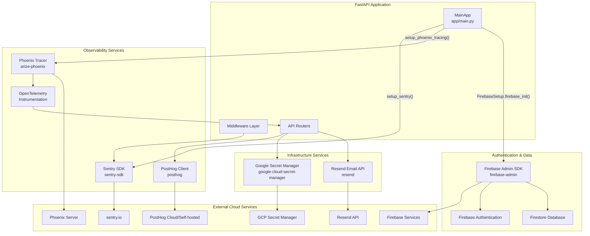
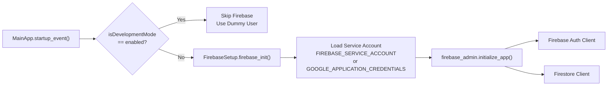
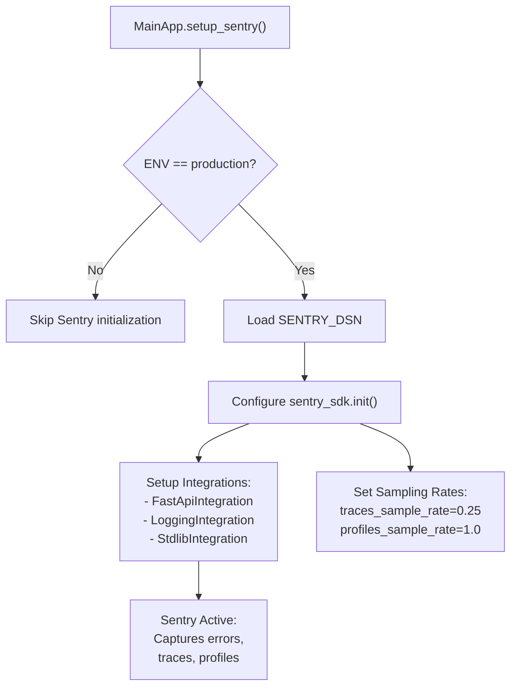
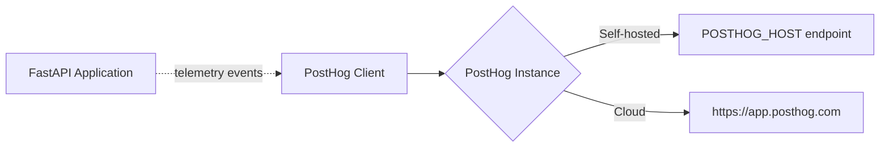
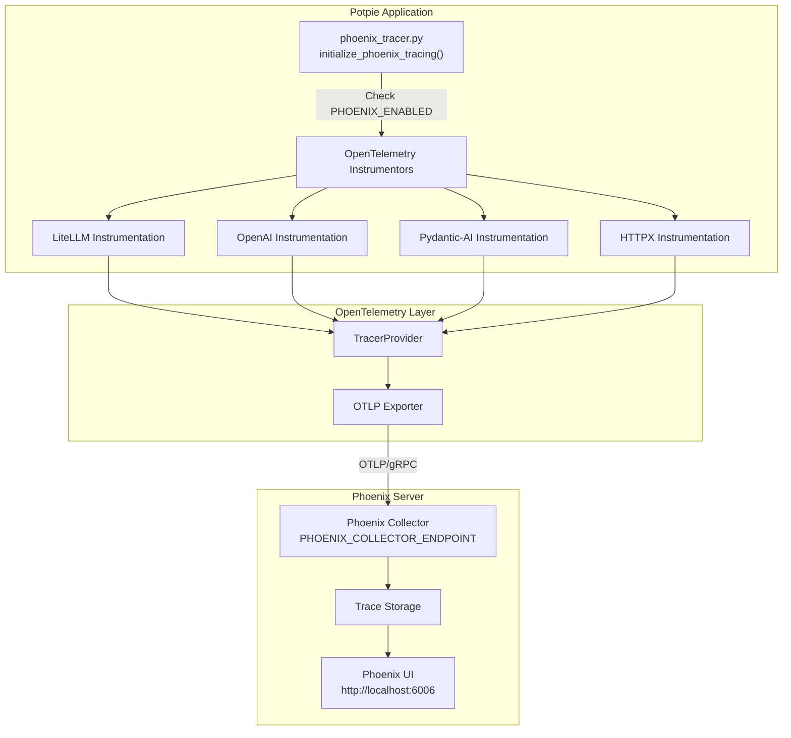
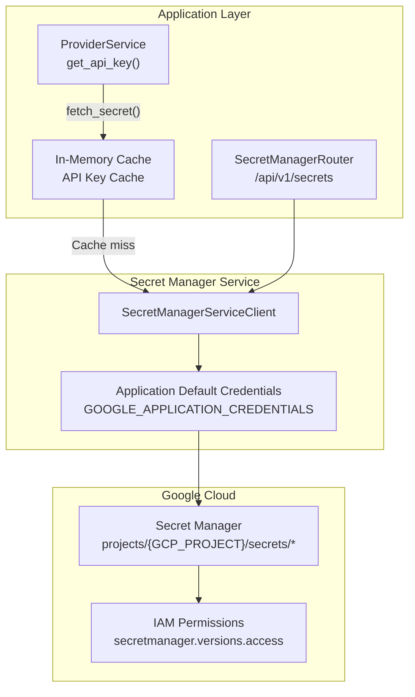
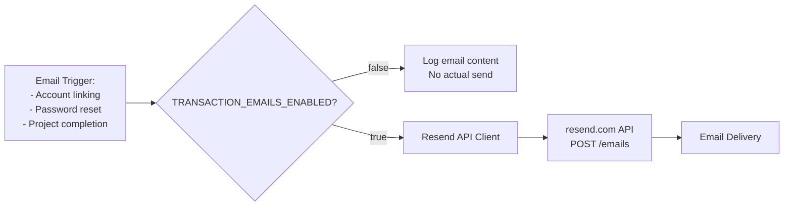

8.5-External Service Integrations

# Page: External Service Integrations

# External Service Integrations

<details>
<summary>Relevant source files</summary>

The following files were used as context for generating this wiki page:

- [.env.template](.env.template)
- [app/main.py](app/main.py)
- [requirements.txt](requirements.txt)

</details>


## Purpose and Scope

This document describes the external service integrations used by Potpie for observability, authentication, analytics, and operational infrastructure. These services provide critical functionality for production deployments including error tracking, user analytics, distributed tracing, secret management, and email notifications.

For LLM provider integrations (OpenAI, Anthropic, etc.), see [Provider Service](#2.1). For GitHub integration, see [GitHub Integration](#6.2). For object storage (GCS/S3/Azure), see [Media Service and Storage](#8.2).

---

## Integration Overview

The system integrates with six primary external services:

| Service | Purpose | Configuration | Required for Production |
|---------|---------|---------------|------------------------|
| **Firebase** | Authentication and user onboarding data | `FIREBASE_SERVICE_ACCOUNT`, `GOOGLE_APPLICATION_CREDENTIALS` | Yes |
| **Sentry** | Error tracking and performance monitoring | `SENTRY_DSN` | Yes |
| **PostHog** | Product analytics and feature tracking | `POSTHOG_API_KEY`, `POSTHOG_HOST` | No |
| **Phoenix** | OpenTelemetry-based distributed tracing | `PHOENIX_COLLECTOR_ENDPOINT`, `PHOENIX_PROJECT_NAME` | No |
| **Google Secret Manager** | Encrypted secret storage for API keys | `GOOGLE_APPLICATION_CREDENTIALS` | Yes (for API keys) |
| **Resend** | Transactional email delivery | `RESEND_API_KEY`, `EMAIL_FROM_ADDRESS` | No |

**Sources:** [.env.template:59-82](), [requirements.txt:60-231]()

---

## System Integration Architecture



**Sources:** [app/main.py:1-217](), [requirements.txt:1-279]()

---

## Firebase Integration

Firebase provides two critical services: authentication token verification and Firestore database for user onboarding data.

### Firebase Admin SDK Setup

The Firebase Admin SDK is initialized during application startup through the `FirebaseSetup` class:



**Sources:** [app/main.py:131-142](), [.env.template:59-60]()

### Configuration Requirements

| Environment Variable | Purpose | Format |
|---------------------|---------|--------|
| `FIREBASE_SERVICE_ACCOUNT` | Firebase service account credentials | JSON string or file path |
| `GOOGLE_APPLICATION_CREDENTIALS` | Fallback to GCP service account | File path to JSON key |

The system prioritizes `FIREBASE_SERVICE_ACCOUNT` and falls back to `GOOGLE_APPLICATION_CREDENTIALS` if not set.

### Authentication Flow Integration

Firebase Auth is used in the authentication middleware to verify JWT tokens from client requests. The `UnifiedAuthService` validates tokens against Firebase:

1. Client sends request with `Authorization: Bearer <firebase_token>`
2. Middleware extracts token and calls Firebase Admin SDK
3. Firebase verifies token signature and expiration
4. User ID is extracted and matched against PostgreSQL `users` table
5. Request proceeds with authenticated user context

### Firestore Usage

Firestore stores user onboarding data that doesn't fit the relational PostgreSQL schema. This includes:
- Multi-step onboarding progress
- User preferences during setup
- Feature flag states per user

**Sources:** [app/main.py:141](), [requirements.txt:60-61]()

---

## Sentry Error Tracking

Sentry provides real-time error tracking, performance monitoring, and release management for production deployments.

### Initialization and Configuration

Sentry is initialized conditionally based on the `ENV` environment variable:



**Sources:** [app/main.py:64-87]()

### Integration Configuration

The Sentry SDK is configured with explicit integrations to avoid auto-enabling problematic integrations (e.g., Strawberry GraphQL which is not installed):

| Integration | Purpose |
|-------------|---------|
| `FastApiIntegration` | Captures FastAPI request/response context, automatic error reporting for unhandled exceptions |
| `LoggingIntegration` | Forwards Python logging to Sentry as breadcrumbs |
| `StdlibIntegration` | Captures standard library errors (threading, subprocess, etc.) |

**Key Configuration Settings:**
- **DSN:** `SENTRY_DSN` environment variable (required)
- **Traces Sample Rate:** `0.25` (25% of transactions tracked for performance monitoring)
- **Profiles Sample Rate:** `1.0` (100% profiling when transaction is sampled)
- **Default Integrations:** `False` (explicit control to prevent conflicts)

### Error Context Enrichment

Sentry automatically captures:
- Request URL, method, headers
- User ID (from authentication context)
- Stack traces with local variables
- Breadcrumbs from logging statements
- Performance metrics for sampled transactions

### Graceful Degradation

The initialization is wrapped in a try-except block to ensure application startup succeeds even if Sentry configuration fails:

**Sources:** [app/main.py:64-87](), [.env.template:1-2]()

---

## PostHog Analytics

PostHog provides product analytics, feature flags, and user behavior tracking.

### Integration Pattern

PostHog telemetry is sent asynchronously throughout the application via the FastAPI middleware layer. The high-level architecture diagram shows telemetry connections:



### Configuration

| Environment Variable | Purpose | Default |
|---------------------|---------|---------|
| `POSTHOG_API_KEY` | Project API key from PostHog | None (disabled if not set) |
| `POSTHOG_HOST` | PostHog instance URL (for self-hosted) | `https://app.posthog.com` |

### Event Tracking Patterns

PostHog is used to track:
- **User Actions:** Message sends, project creation, agent invocations
- **Feature Usage:** Custom agent usage, tool invocations, multimodal uploads
- **System Events:** Repository parsing completion, authentication events
- **Performance Metrics:** Response times, token usage per conversation

Events include user context (user_id, email) and enriched metadata (project_id, conversation_id, agent_type).

**Sources:** [.env.template:71-72](), [requirements.txt:176]()

---

## Phoenix Tracing and Observability

Phoenix provides OpenTelemetry-based distributed tracing for LLM applications, enabling observability into agent execution, tool calls, and LLM interactions.

### Phoenix Architecture



**Sources:** [app/main.py:89-99](), [requirements.txt:16-19]()

### Configuration

Phoenix tracing is controlled by three environment variables:

| Variable | Purpose | Default |
|----------|---------|---------|
| `PHOENIX_ENABLED` | Enable/disable tracing | `true` |
| `PHOENIX_COLLECTOR_ENDPOINT` | Phoenix server URL | `http://localhost:6006` |
| `PHOENIX_PROJECT_NAME` | Project identifier in Phoenix UI | `potpie-ai` |

### Initialization Flow

The Phoenix tracer is initialized during application startup:

1. `MainApp.setup_phoenix_tracing()` calls `initialize_phoenix_tracing()`
2. Checks `PHOENIX_ENABLED` environment variable
3. Configures OpenTelemetry `TracerProvider` with OTLP exporter
4. Registers automatic instrumentation for:
   - **LiteLLM:** Traces all LLM calls through the provider service
   - **OpenAI:** Direct OpenAI SDK calls
   - **Pydantic-AI:** Agent execution traces
   - **HTTPX:** HTTP client instrumentation for external API calls

### Trace Data Structure

Phoenix captures hierarchical trace data:
- **Spans:** Individual operations (LLM call, tool execution, database query)
- **Attributes:** Metadata (model name, token counts, user_id, conversation_id)
- **Events:** Discrete events within a span (streaming chunks, errors)
- **Links:** Connections between related spans across requests

### Graceful Failure

Similar to Sentry, Phoenix initialization is non-fatal. If setup fails (e.g., Phoenix server not running), the application logs a warning and continues without tracing:

**Sources:** [app/main.py:89-99](), [.env.template:75-81](), [requirements.txt:16-19]()

---

## Google Secret Manager Integration

Google Cloud Secret Manager provides secure, encrypted storage for API keys and sensitive credentials.

### Secret Storage Architecture



**Sources:** [.env.template:27](), [requirements.txt:72]()

### Configuration Requirements

| Variable | Purpose | Format |
|----------|---------|--------|
| `GCP_PROJECT` | Google Cloud project ID | String (e.g., `my-project-123`) |
| `GOOGLE_APPLICATION_CREDENTIALS` | Path to service account JSON | File path |

### Secret Naming Convention

Secrets are stored with standardized naming:
- **LLM API Keys:** `{provider}_api_key` (e.g., `openai_api_key`, `anthropic_api_key`)
- **Integration Tokens:** `{service}_token` (e.g., `github_token`, `jira_token`)
- **Database Credentials:** `{db_type}_password` (e.g., `postgres_password`)

### Access Pattern

The `ProviderService` accesses secrets for LLM provider API keys:

1. Check in-memory cache for API key
2. If not cached, call `SecretManagerServiceClient.access_secret_version()`
3. Decrypt secret using service account credentials
4. Cache in memory with configurable TTL
5. Return API key to LLM provider client

### Service Account Requirements

The service account must have the `roles/secretmanager.secretAccessor` IAM role to read secret values.

**Sources:** [.env.template:27](), [.env.template:59](), [requirements.txt:72]()

---

## Resend Email Service

Resend provides transactional email delivery for system notifications and user communications.

### Email Service Integration



### Configuration

| Variable | Purpose | Required |
|----------|---------|----------|
| `TRANSACTION_EMAILS_ENABLED` | Enable/disable email sending | No (defaults to disabled) |
| `RESEND_API_KEY` | Resend API authentication key | Yes (if emails enabled) |
| `EMAIL_FROM_ADDRESS` | Sender email address | Yes (if emails enabled) |

### Email Templates

The system sends transactional emails for:
- **Account Linking Confirmation:** When a user links a new authentication provider
- **Password Reset:** (Email/password authentication flow)
- **Project Processing Notifications:** Repository parsing completion or failure
- **Sharing Notifications:** When a conversation or custom agent is shared

### Development Mode Behavior

When `TRANSACTION_EMAILS_ENABLED` is not set or `isDevelopmentMode=enabled`, emails are logged to console instead of being sent:

```
INFO: Email would be sent to: user@example.com
INFO: Subject: Account Linking Confirmation
INFO: Body: [email content]
```

**Sources:** [.env.template:66-68](), [requirements.txt:221]()

---

## Integration Dependencies and Versions

The following table shows the Python packages required for each external service:

| Service | Package | Version | Purpose |
|---------|---------|---------|---------|
| Firebase | `firebase-admin` | 7.1.0 | Firebase Admin SDK for auth and Firestore |
| Sentry | `sentry-sdk` | 2.47.0 | Error tracking and performance monitoring |
| PostHog | `posthog` | 7.0.1 | Product analytics client |
| Phoenix | `arize-phoenix` | 12.22.0 | Phoenix server SDK |
| Phoenix | `arize-phoenix-otel` | 0.14.0 | OpenTelemetry integration |
| Phoenix | `opentelemetry-instrumentation-litellm` | 0.1.28 | LiteLLM auto-instrumentation |
| Phoenix | `opentelemetry-exporter-otlp` | 1.39.0 | OTLP protocol exporter |
| Secret Manager | `google-cloud-secret-manager` | 2.25.0 | GCP Secret Manager client |
| Email | `resend` | 2.19.0 | Resend email API client |

**Sources:** [requirements.txt:60-221]()

---

## Production vs Development Mode Behavior

The system adapts external service integrations based on the operational mode:

| Service | Production (`ENV=production`) | Development (`isDevelopmentMode=enabled`) |
|---------|------------------------------|------------------------------------------|
| **Firebase** | Required, validates all tokens | Skipped, uses dummy user authentication |
| **Sentry** | Enabled with DSN | Disabled (not initialized) |
| **PostHog** | Enabled if API key present | Optional, can be disabled |
| **Phoenix** | Optional, based on `PHOENIX_ENABLED` | Optional, typically runs local Phoenix server |
| **Secret Manager** | Required for API keys | Optional, uses environment variables |
| **Resend** | Enabled with API key | Disabled, logs emails to console |

### Environment Detection

The application determines mode based on two variables in [.env.template:1-2]():
- `isDevelopmentMode`: When set to `enabled`, bypasses Firebase and other production services
- `ENV`: When set to `production`, enables Sentry and requires production credentials

**Sources:** [app/main.py:49-56](), [.env.template:1-2]()

---

## Service Health and Monitoring

### Connection Resilience

All external service integrations implement graceful degradation:

1. **Sentry:** Non-fatal initialization, logs warning if setup fails
2. **Phoenix:** Non-fatal initialization, application continues without tracing
3. **PostHog:** Optional service, no impact if unavailable
4. **Firebase:** Fatal in production, skipped in development
5. **Secret Manager:** Falls back to environment variables if unavailable
6. **Resend:** Logs emails if service unavailable

### Health Check Endpoint

The `/health` endpoint reports overall system status but does not perform active checks on external services:

```json
{
  "status": "ok",
  "version": "abc1234"
}
```

For detailed service health monitoring, use:
- **Sentry Dashboard:** Error rates, performance metrics
- **Phoenix UI:** Trace latency, LLM call success rates
- **PostHog:** User activity, feature adoption

**Sources:** [app/main.py:173-183]()

---

## Security Considerations

### Credential Management

All external service credentials are managed through environment variables or Secret Manager:

1. **Never commit secrets** to version control
2. **Use Secret Manager** for production API keys
3. **Rotate credentials** regularly through GCP console
4. **Limit IAM permissions** to minimum required scope

### Network Security

External service connections use:
- **TLS/HTTPS** for all API communications
- **Service account authentication** for GCP services
- **API key headers** for third-party services (Resend, PostHog)

### Audit Logging

- **Firebase:** Auth events logged in Firestore
- **Secret Manager:** Access logged in GCP Cloud Audit Logs
- **Sentry:** Captures authentication errors and access violations

**Sources:** [.env.template:1-116]()