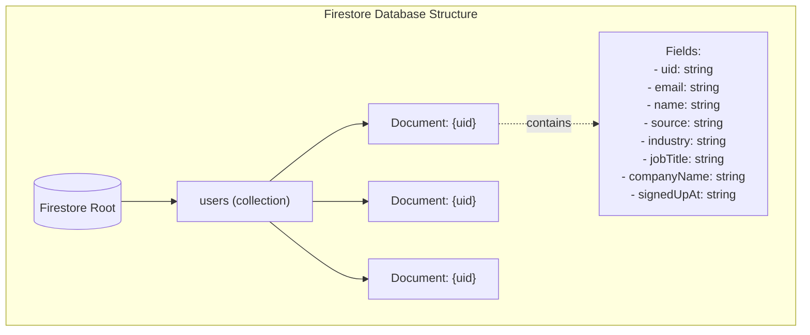
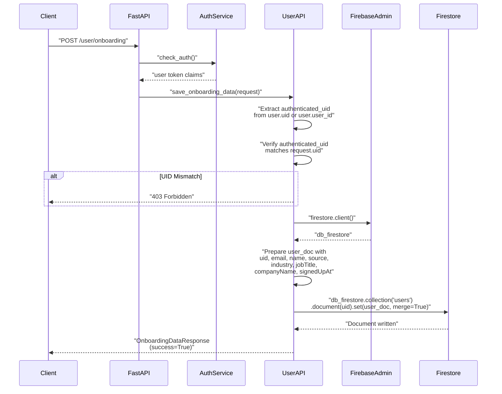
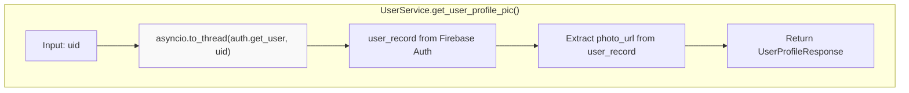
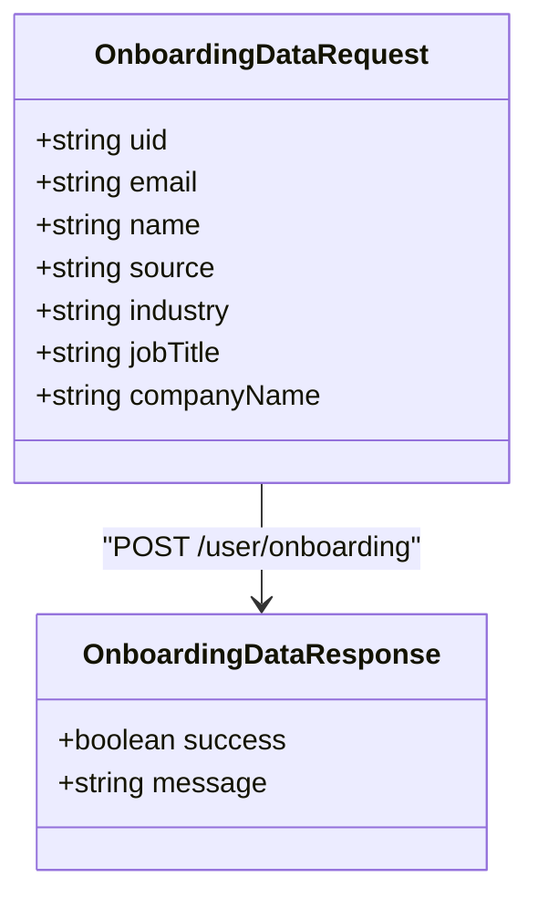
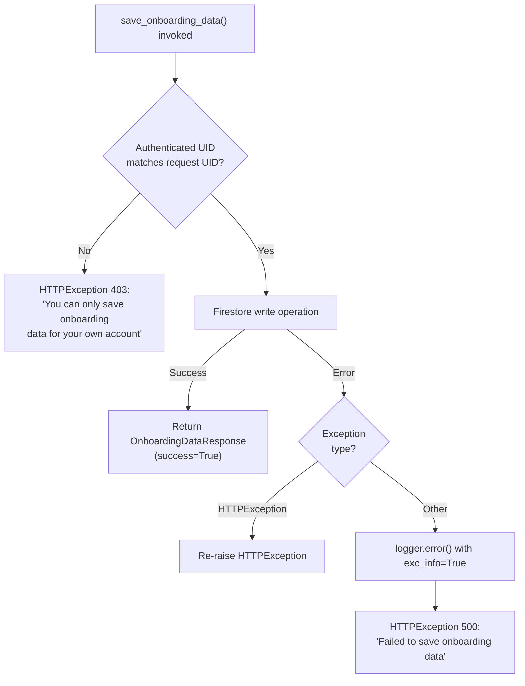
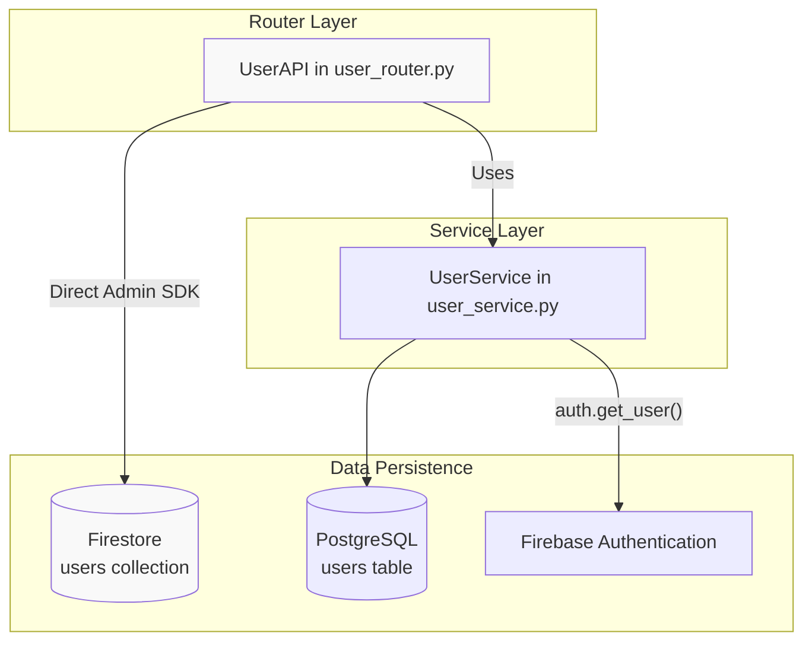

10.4-Firebase Firestore

# Page: Firebase Firestore

# Firebase Firestore

<details>
<summary>Relevant source files</summary>

The following files were used as context for generating this wiki page:

- [app/modules/users/user_controller.py](app/modules/users/user_controller.py)
- [app/modules/users/user_router.py](app/modules/users/user_router.py)
- [app/modules/users/user_service.py](app/modules/users/user_service.py)

</details>


## Purpose and Scope

This document describes the Firebase Firestore integration in the Potpie system, specifically focusing on onboarding data storage. While Firebase also provides authentication services (covered in [Multi-Provider Authentication](#7.1)), this page addresses Firestore's role as a NoSQL document database for storing user onboarding information. For relational user data storage, see [PostgreSQL Schema](#10.1).

Firebase Firestore serves a limited but specific purpose in the Potpie architecture: storing user onboarding metadata collected during the initial signup flow. This data is separate from the core user records in PostgreSQL and is used primarily for analytics and understanding user acquisition channels.

## Firestore Data Model

### Users Collection

Firestore contains a single collection named `users` with documents keyed by Firebase UID. Each document stores onboarding metadata that is not critical for application functionality but useful for product analytics and customer understanding.

**Document Schema:**

| Field | Type | Description |
|-------|------|-------------|
| `uid` | string | Firebase user identifier (document ID) |
| `email` | string | User's email address |
| `name` | string | User's display name |
| `source` | string | Acquisition source (e.g., "product_hunt", "organic") |
| `industry` | string | User's industry vertical |
| `jobTitle` | string | User's job title or role |
| `companyName` | string | User's company/organization name |
| `signedUpAt` | string | ISO 8601 timestamp of signup (UTC) |



**Sources:** [app/modules/users/user_router.py:63-72]()

## Onboarding Data Storage Flow

### API Endpoint and Request Processing

The onboarding data persistence flow is initiated through the `/user/onboarding` POST endpoint, which accepts onboarding information from the client and stores it in Firestore using Firebase Admin SDK privileges.



**Sources:** [app/modules/users/user_router.py:29-90]()

### Authentication and Authorization

The endpoint implements two layers of security:

1. **Request Authentication**: The `AuthService.check_auth` dependency verifies the Firebase token and extracts the authenticated user's UID from the token claims.

2. **UID Verification**: The endpoint ensures that the authenticated UID matches the UID in the request payload, preventing users from writing onboarding data for other accounts.

[app/modules/users/user_router.py:42-53]() implements this verification:

```
authenticated_uid = user.get("uid") or user.get("user_id")

if authenticated_uid != request.uid:
    raise HTTPException(
        status_code=403,
        detail="You can only save onboarding data for your own account"
    )
```

**Sources:** [app/modules/users/user_router.py:42-53]()

### Admin SDK Privileges

The implementation uses Firebase Admin SDK rather than client-side Firestore access. This design decision bypasses Firestore security rules and provides several benefits:

- **Simplified Security Model**: All authorization is handled at the API level through token verification, avoiding complex Firestore security rule configurations
- **Server-Side Control**: The backend has full control over what data is written and validated
- **Consistency**: Onboarding data storage follows the same authentication patterns as other API endpoints

[app/modules/users/user_router.py:36-38]() documents this design rationale in the endpoint docstring.

**Sources:** [app/modules/users/user_router.py:35-39](), [app/modules/users/user_router.py:55-76]()

## Firebase Admin SDK Integration

### Firestore Client Initialization

The Firestore client is obtained through the `firebase_admin.firestore` module, which must be initialized during application startup. The client is created inline within the endpoint handler:

```
from firebase_admin import firestore
db_firestore = firestore.client()
```

This lazy import pattern ([app/modules/users/user_router.py:55-60]()) avoids circular import issues while maintaining access to the global Firebase Admin SDK instance.

### Document Write Operation

The document write uses the `set()` method with `merge=True` to support both creation and updates:

```
doc_ref = db_firestore.collection("users").document(request.uid)
doc_ref.set(user_doc, merge=True)
```

The `merge=True` parameter ensures that if a document already exists for the UID, only the provided fields are updated while preserving any other existing fields. This enables idempotent onboarding data submissions.

**Sources:** [app/modules/users/user_router.py:74-76]()

## Firebase Authentication Integration

### User Profile Retrieval

While Firestore stores onboarding data, Firebase Authentication stores core user identity information including profile pictures. The `UserService.get_user_profile_pic` method demonstrates integration with Firebase Auth:



The implementation uses `asyncio.to_thread` to wrap the synchronous `auth.get_user()` call, maintaining async compatibility in the service layer.

**Sources:** [app/modules/users/user_service.py:169-176]()

### Authentication vs. Onboarding Data Separation

The system maintains a clear separation between authentication data and onboarding data:

| Data Type | Storage Location | Purpose | Access Pattern |
|-----------|-----------------|---------|----------------|
| Authentication credentials | Firebase Authentication | User identity, login verification | Managed by Firebase SDK |
| Core user records | PostgreSQL `users` table | Application user data, relationships | SQL queries |
| Onboarding metadata | Firestore `users` collection | Analytics, user acquisition tracking | Admin SDK |
| Profile pictures | Firebase Authentication | Display in UI | `auth.get_user()` API |

This separation allows the system to leverage Firebase's authentication infrastructure while maintaining relational data in PostgreSQL for core application logic.

**Sources:** [app/modules/users/user_service.py:169-176](), [app/modules/users/user_router.py:29-90]()

## Request and Response Schemas

### OnboardingDataRequest

The request schema defines the structure of onboarding data submitted by clients:



The request model is defined in `app/modules/users/user_schema.py` and validated by FastAPI's Pydantic integration. All fields are required to ensure complete onboarding data capture.

### OnboardingDataResponse

The response is a simple confirmation object with a success flag and message. The implementation always returns `success=True` when the write completes successfully, with the message "Onboarding information saved successfully".

**Sources:** [app/modules/users/user_router.py:7-11](), [app/modules/users/user_router.py:80-82]()

## Error Handling

The onboarding endpoint implements comprehensive error handling:



**Error Scenarios:**

1. **UID Mismatch (403)**: When the authenticated user attempts to save onboarding data for a different UID
2. **HTTPException Re-raise**: Any explicitly raised HTTPException is propagated without modification
3. **Generic Firestore Errors (500)**: All other exceptions are caught, logged with full stack traces, and returned as 500 errors

The error handling preserves `HTTPException` instances to allow explicit status codes while catching all other exceptions to prevent information leakage.

**Sources:** [app/modules/users/user_router.py:84-90](), [app/modules/users/user_router.py:46-53]()

## Security Considerations

### Server-Side Authorization Model

The Firestore integration deliberately uses server-side authorization rather than Firestore security rules:

- **Benefit**: All security logic is centralized in the API layer, making it easier to audit and maintain
- **Benefit**: Reduces attack surface by not exposing Firestore directly to clients
- **Trade-off**: Requires API round-trip for all Firestore operations (acceptable for low-frequency onboarding writes)

### UID Verification

The strict UID verification ([app/modules/users/user_router.py:46-53]()) prevents account takeover scenarios where an attacker with a valid token attempts to write onboarding data for other users. The check compares:

1. `authenticated_uid` extracted from token claims (`user.get("uid") or user.get("user_id")`)
2. `request.uid` from the request payload

This dual-source check provides defense-in-depth against token manipulation or request forgery.

### Logging and Audit Trail

The endpoint logs successful writes and all errors:

- **Success Log**: `logger.info(f"Successfully saved onboarding data for user {request.uid}")`
- **UID Mismatch Warning**: `logger.warning(f"UID mismatch: authenticated={authenticated_uid}, requested={request.uid}")`
- **Error Log**: `logger.error(f"Error saving onboarding data: {str(e)}", exc_info=True)`

These logs enable security monitoring and incident response.

**Sources:** [app/modules/users/user_router.py:46-53](), [app/modules/users/user_router.py:78](), [app/modules/users/user_router.py:87]()

## Integration with User Service Layer

### Service Layer Architecture

The Firestore integration bypasses the typical service layer pattern used elsewhere in the codebase. While `UserService` handles PostgreSQL user operations, Firestore writes are implemented directly in the router:



This architectural decision reflects Firestore's limited scope in the system - it's used only for the single onboarding write operation, making a dedicated service layer unnecessary.

**Sources:** [app/modules/users/user_router.py:29-90](), [app/modules/users/user_service.py:1-177]()

## Timestamp Handling

The `signedUpAt` field uses ISO 8601 format in UTC timezone:

```python
from datetime import datetime, timezone
user_doc["signedUpAt"] = datetime.now(timezone.utc).isoformat()
```

This produces timestamps like `"2024-01-15T14:30:00+00:00"`, which are:
- **Timezone-aware**: Explicitly includes UTC offset
- **Sortable**: Can be compared lexicographically
- **Standard**: ISO 8601 is universally supported

The use of `timezone.utc` ensures all timestamps are normalized to UTC, avoiding timezone conversion issues in analytics.

**Sources:** [app/modules/users/user_router.py:57](), [app/modules/users/user_router.py:71]()

## Usage Pattern Summary

Firestore in Potpie follows a write-heavy, read-light pattern:

| Operation | Frequency | Access Method |
|-----------|-----------|---------------|
| Write onboarding data | Once per user signup | Admin SDK `set(merge=True)` |
| Read onboarding data | Rare (analytics exports) | External tools or scripts |
| Update onboarding data | Possible via re-submission | Same `set(merge=True)` call |
| Delete onboarding data | Manual/rare | Not implemented in API |

The merge write strategy (`set(user_doc, merge=True)`) makes the endpoint idempotent, allowing users to resubmit onboarding information if needed without data loss.

**Sources:** [app/modules/users/user_router.py:74-76]()