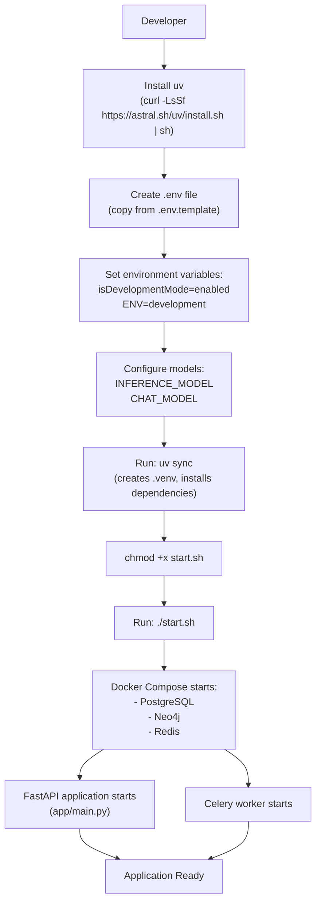
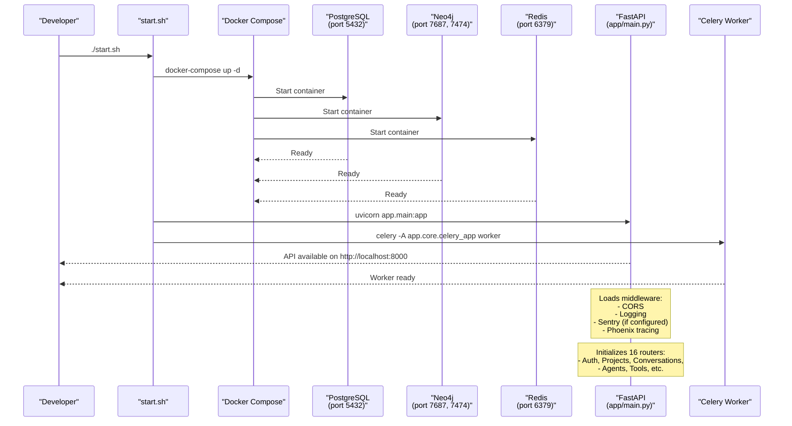
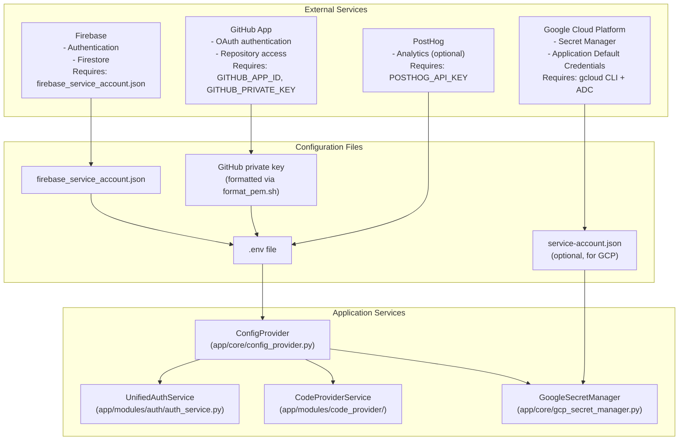
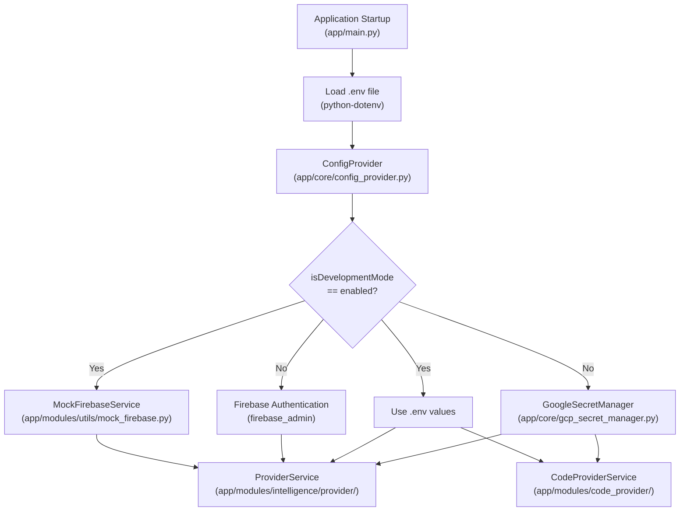

1.1-Getting Started

# Page: Getting Started

# Getting Started

<details>
<summary>Relevant source files</summary>

The following files were used as context for generating this wiki page:

- [GETTING_STARTED.md](GETTING_STARTED.md)
- [LICENSE](LICENSE)
- [contributing.md](contributing.md)

</details>


This document provides step-by-step instructions for setting up and running the Potpie codebase, both in development mode (with minimal dependencies) and production mode (with full external service integrations).

**Scope**: This page covers environment setup, dependency installation, and initial application startup. For detailed information about the system architecture and component interactions, see [Architecture Overview](#1.2). For configuration options and environment variables, see [System Configuration](#1.4).

---

## Prerequisites

Before setting up Potpie, ensure the following software is installed on your system:

| Software | Minimum Version | Installation |
|----------|----------------|--------------|
| **Python** | 3.11+ | [python.org](https://www.python.org/) |
| **uv** | Latest | `curl -LsSf https://astral.sh/uv/install.sh \| sh` |
| **Docker** | Latest | [docker.com](https://www.docker.com/) |
| **Git** | Latest | [git-scm.com](https://git-scm.com/) |

The `uv` package manager is used for fast Python dependency resolution and virtual environment management. After installation, ensure `~/.local/bin` is in your PATH.

**Sources**: [GETTING_STARTED.md:5-11](), [contributing.md:36-41]()

---

## Repository Setup

### Clone the Repository

```bash
git clone https://github.com/potpie-ai/potpie.git
cd potpie
```

For contributors, fork the repository first and add the main repository as an upstream remote:

```bash
git remote add upstream https://github.com/potpie-ai/potpie.git
```

**Sources**: [contributing.md:44-57]()

---

## Development Mode Setup

Development mode (`isDevelopmentMode=enabled`) allows running Potpie with minimal external dependencies. This mode bypasses Firebase authentication, GitHub configuration, and other production services, making it suitable for local development and testing.

### Setup Flow



**Sources**: [GETTING_STARTED.md:3-61]()

### Step 1: Environment Configuration

Create a `.env` file from the template:

```bash
cp .env.template .env
```

Configure the following required variables in `.env`:

```bash
isDevelopmentMode=enabled
ENV=development
```

The `isDevelopmentMode` flag disables external service dependencies (Firebase, GitHub authentication, Google Secret Manager), while `ENV=development` loads development-specific configuration.

**Important distinction**: `ENV=development` indicates the application is running locally but may still require external services. `isDevelopmentMode=enabled` specifically disables those external dependencies. See [Development Mode Authentication](#7.6) for details on mock authentication behavior.

**Sources**: [GETTING_STARTED.md:14-21](), [contributing.md:117-126]()

### Step 2: Model Configuration

Potpie requires two model specifications:

| Variable | Purpose | Example Value |
|----------|---------|---------------|
| `INFERENCE_MODEL` | Used for knowledge graph generation and docstring creation | `ollama_chat/qwen2.5-coder:7b` |
| `CHAT_MODEL` | Used for agent reasoning and conversation | `ollama_chat/qwen2.5-coder:7b` |

#### Option A: Local Models with Ollama

```bash
INFERENCE_MODEL=ollama_chat/qwen2.5-coder:7b
CHAT_MODEL=ollama_chat/qwen2.5-coder:7b
```

#### Option B: Cloud Provider Models

```bash
OPENAI_API_KEY=sk-your-key-here
INFERENCE_MODEL=openai/gpt-4
CHAT_MODEL=openai/gpt-4
```

Or with other providers (Anthropic, DeepSeek, etc.):

```bash
ANTHROPIC_API_KEY=sk-ant-your-key
INFERENCE_MODEL=anthropic/claude-3-5-sonnet-20241022
CHAT_MODEL=anthropic/claude-3-5-sonnet-20241022
```

Model names must follow the LiteLLM provider format: `provider/model_name`. See [Provider Service (LLM Abstraction)](#2.1) for supported providers and configuration details.

**Sources**: [GETTING_STARTED.md:31-47]()

### Step 3: Install Dependencies

```bash
uv sync
```

This command:
1. Creates a `.venv` directory in the project root
2. Resolves dependencies from `pyproject.toml` and `uv.lock`
3. Installs all required Python packages

The `uv` package manager uses a lockfile for reproducible builds. See [Dependency Management](#11.4) for details on package management.

**Sources**: [GETTING_STARTED.md:23-29]()

### Step 4: Run the Application

```bash
chmod +x start.sh
./start.sh
```

The `start.sh` script orchestrates the following startup sequence:



**Sources**: [GETTING_STARTED.md:49-61]()

### Verification

Once started, the application exposes:

- **API**: `http://localhost:8000` (FastAPI with 16 modular routers)
- **API Documentation**: `http://localhost:8000/docs` (Swagger UI)
- **Neo4j Browser**: `http://localhost:7474` (graph database interface)
- **PostgreSQL**: `localhost:5432` (relational database)
- **Redis**: `localhost:6379` (cache and streaming)

You can verify the setup by accessing the API documentation and checking the health endpoints.

**Sources**: Inferred from [GETTING_STARTED.md:49-61]() and system architecture diagrams

---

## Production Mode Setup

Production mode requires configuring external services for authentication, code access, analytics, and secret management. The following sections detail each integration.

### Configuration Overview



**Sources**: [GETTING_STARTED.md:63-172]()

### Firebase Setup

Firebase provides authentication services and Firestore for onboarding data.

#### Steps

1. **Create a Firebase Project**: Navigate to [Firebase Console](https://console.firebase.google.com/) and create a new project.

2. **Generate Service Account Key**:
   - Click **Project Overview Gear ⚙** → **Service Accounts** tab
   - Click **Generate new private key** in Firebase Admin SDK section
   - Download the key and rename it to `firebase_service_account.json`
   - Place it in the project root directory

3. **Create Firebase Web App**:
   - Go to **Project Overview Gear ⚙**
   - Create a Firebase app
   - Copy the configuration keys (API key, auth domain, project ID, etc.)
   - Add these to your `.env` file

4. **Enable GitHub Authentication** (see GitHub setup section below):
   - Navigate to **Authentication** → **Sign-in method**
   - Enable GitHub provider
   - Configure OAuth app credentials
   - Copy the Firebase callback URL to your GitHub OAuth app

The `firebase_service_account.json` is used by the `UnifiedAuthService` for token verification and user management. See [Multi-Provider Authentication](#7.1) for implementation details.

**Sources**: [GETTING_STARTED.md:67-81](), [GETTING_STARTED.md:123-129]()

### GitHub App Setup

A GitHub App is required for:
- OAuth authentication (login via GitHub)
- Repository access (cloning private repositories)
- Pull request operations (read/write)

#### Create the GitHub App

1. Visit [GitHub App Creation](https://github.com/settings/apps/new)

2. **Configure Permissions**:

   | Permission Type | Permission | Access Level |
   |----------------|------------|--------------|
   | Repository | Contents | Read Only |
   | Repository | Metadata | Read Only |
   | Repository | Pull Requests | Read and Write |
   | Repository | Secrets | Read Only |
   | Repository | Webhook | Read Only |
   | Organization | Members | Read Only |
   | Account | Email Address | Read Only |

3. **Basic Settings**:
   - **Name**: Choose a unique name (e.g., `potpie-auth`)
   - **Homepage URL**: `https://potpie.ai`
   - **Webhook**: Inactive

4. **Generate Private Key**:
   - After creating the app, generate a private key
   - Download the `.pem` file
   - Note the App ID (add to `.env` as `GITHUB_APP_ID`)

5. **Format the Private Key**:
   ```bash
   chmod +x format_pem.sh
   ./format_pem.sh your-github-app-key.pem
   ```
   - The script outputs a single-line formatted key
   - Copy this formatted key to `.env` as `GITHUB_PRIVATE_KEY`

6. **Install the App**:
   - In GitHub settings, navigate to **Install App**
   - Install to your organization or user account

7. **Create Personal Access Token**:
   - Go to **Settings** → **Developer Settings** → **Personal Access Tokens** → **Tokens (classic)**
   - Generate a token with `repo` scope
   - Add to `.env` as `GH_TOKEN_LIST` (supports comma-separated list for multiple tokens)

The `CodeProviderService` uses these credentials to authenticate with GitHub for repository operations. See [GitHub Integration](#6.2) and [Multi-Provider Repository Access](#6.3) for authentication chain logic.

**Sources**: [GETTING_STARTED.md:92-120]()

### Google Cloud Setup

Google Cloud Secret Manager stores API keys and sensitive configuration. If you created a Firebase project, a linked Google Cloud project is automatically created.

#### Steps

1. **Install gcloud CLI**:
   ```bash
   # Follow: https://cloud.google.com/sdk/docs/install
   # After installation:
   gcloud init
   ```
   - Select your region when prompted
   - This sets up the default compute region

2. **Enable Secret Manager API**:
   - Navigate to Google Cloud Console
   - Enable the Secret Manager API for your project

3. **Set Up Application Default Credentials (ADC)**:
   ```bash
   gcloud auth application-default login
   ```
   - This creates credentials at `~/.config/gcloud/application_default_credentials.json`
   - The application uses these credentials to access Secret Manager

   **Alternative**: Place a service account JSON file at `service-account.json` in the project root.

4. **Configure `.env`**:
   ```bash
   GCP_PROJECT_ID=your-project-id
   ```

The `GoogleSecretManager` class uses ADC to retrieve secrets at runtime. API keys stored in Secret Manager take precedence over `.env` values. See [Secret Management](#8.4) for implementation details.

**Sources**: [GETTING_STARTED.md:132-153]()

### PostHog Integration (Optional)

PostHog provides analytics and user behavior tracking.

1. Sign up at [PostHog](https://us.posthog.com/signup)
2. Obtain your API key and host URL
3. Add to `.env`:
   ```bash
   POSTHOG_API_KEY=phc_your_key_here
   POSTHOG_HOST=https://us.posthog.com
   ```

The FastAPI application sends telemetry events to PostHog for user action tracking.

**Sources**: [GETTING_STARTED.md:84-89]()

### Running in Production Mode

1. **Ensure Docker is running**

2. **Set up `.env`** with all production values:
   ```bash
   ENV=production
   isDevelopmentMode=disabled
   # ... all Firebase, GitHub, GCP, PostHog configs
   ```

3. **Authenticate with Google Cloud**:
   ```bash
   gcloud auth application-default login
   # OR place service-account.json in project root
   ```

4. **Run the application**:
   ```bash
   chmod +x start.sh
   ./start.sh
   ```

The startup sequence is identical to development mode, but services now require valid authentication credentials.

**Sources**: [GETTING_STARTED.md:156-172]()

---

## Environment Variable Reference

### Core Configuration

| Variable | Required | Default | Description |
|----------|----------|---------|-------------|
| `isDevelopmentMode` | Yes | `disabled` | Enables mock authentication and local-only features |
| `ENV` | Yes | `production` | Environment: `development`, `staging`, or `production` |
| `INFERENCE_MODEL` | Yes | - | LiteLLM model string for knowledge graph generation |
| `CHAT_MODEL` | Yes | - | LiteLLM model string for agent conversations |

### LLM Provider Keys

| Variable | Required When | Example |
|----------|---------------|---------|
| `OPENAI_API_KEY` | Using OpenAI models | `sk-...` |
| `ANTHROPIC_API_KEY` | Using Anthropic models | `sk-ant-...` |
| `GOOGLE_API_KEY` | Using Google models | `...` |
| `COHERE_API_KEY` | Using Cohere models | `...` |

### External Services

| Variable | Required | Description |
|----------|----------|-------------|
| `GITHUB_APP_ID` | Production | GitHub App identifier |
| `GITHUB_PRIVATE_KEY` | Production | Formatted GitHub App private key |
| `GH_TOKEN_LIST` | Production | Comma-separated GitHub personal access tokens |
| `POSTHOG_API_KEY` | Optional | PostHog analytics key |
| `POSTHOG_HOST` | Optional | PostHog instance URL |
| `GCP_PROJECT_ID` | Production | Google Cloud project ID |

### Database Configuration

| Variable | Default | Description |
|----------|---------|-------------|
| `POSTGRES_HOST` | `localhost` | PostgreSQL host |
| `POSTGRES_PORT` | `5432` | PostgreSQL port |
| `POSTGRES_DB` | `potpie` | Database name |
| `NEO4J_URI` | `bolt://localhost:7687` | Neo4j connection URI |
| `NEO4J_USER` | `neo4j` | Neo4j username |
| `NEO4J_PASSWORD` | `neo4jpassword` | Neo4j password |
| `REDIS_HOST` | `localhost` | Redis host |
| `REDIS_PORT` | `6379` | Redis port |

For a complete list of configuration options, see [System Configuration](#1.4) and [Environment Configuration](#8.3).

**Sources**: [GETTING_STARTED.md:14-47](), inferred from system configuration patterns

---

## Configuration Loading Flow



The `ConfigProvider` implements a strategy pattern for configuration sources. In development mode, it uses local `.env` values and mock services. In production mode, it retrieves secrets from Google Secret Manager and uses real Firebase authentication. The Neo4j configuration can be overridden per-project using the `parse_tree_sitter` function parameter.

**Sources**: Inferred from architecture diagrams and [GETTING_STARTED.md:14-21](), [contributing.md:117-126]()

---

## First Steps After Setup

Once the application is running:

1. **Access the API Documentation**: Navigate to `http://localhost:8000/docs` to explore available endpoints

2. **Create a Project**: Use the projects API to submit a repository for parsing:
   - In development mode: Use local filesystem paths
   - In production mode: Use GitHub repository URLs

3. **Monitor Parsing Progress**: Check project status via the `/projects/{id}` endpoint
   - Status progression: `SUBMITTED` → `CLONED` → `PARSED` → `READY`

4. **Start a Conversation**: Create a conversation and send messages to interact with AI agents

5. **Explore the Knowledge Graph**: Access Neo4j browser at `http://localhost:7474` to visualize the code graph

For detailed information about:
- Project lifecycle and parsing: See [Repository Parsing Pipeline](#4.1)
- Conversation management: See [Conversation System](#3)
- Agent capabilities: See [Agent System Architecture](#2.2)
- API endpoints: See [API Reference](#1.3)

**Sources**: Inferred from system architecture and [GETTING_STARTED.md:61]()

---

## Troubleshooting

### Common Issues

**Docker containers fail to start**:
- Verify Docker is running: `docker ps`
- Check port availability: 5432 (PostgreSQL), 7687/7474 (Neo4j), 6379 (Redis)
- Review logs: `docker-compose logs`

**`uv sync` fails**:
- Ensure Python 3.11+ is installed: `python --version`
- Check network connectivity (uv downloads packages)
- Clear cache: `uv cache clean`

**Authentication errors in production**:
- Verify `firebase_service_account.json` exists in project root
- Confirm Application Default Credentials: `gcloud auth application-default print-access-token`
- Check GitHub App is installed on your organization

**Models not loading**:
- For Ollama: Ensure Ollama is running: `ollama list`
- For cloud providers: Verify API keys in `.env`
- Check model name format: `provider/model_name`

**Sources**: Inferred from setup requirements and common deployment issues

---

## Next Steps

- **Architecture Deep Dive**: See [Architecture Overview](#1.2) for system design details
- **Configuration Tuning**: See [System Configuration](#1.4) for advanced options
- **Production Deployment**: See [Production Deployment](#11.2) for scaling considerations
- **Contributing**: See [Development Mode](#11.1) for development workflows