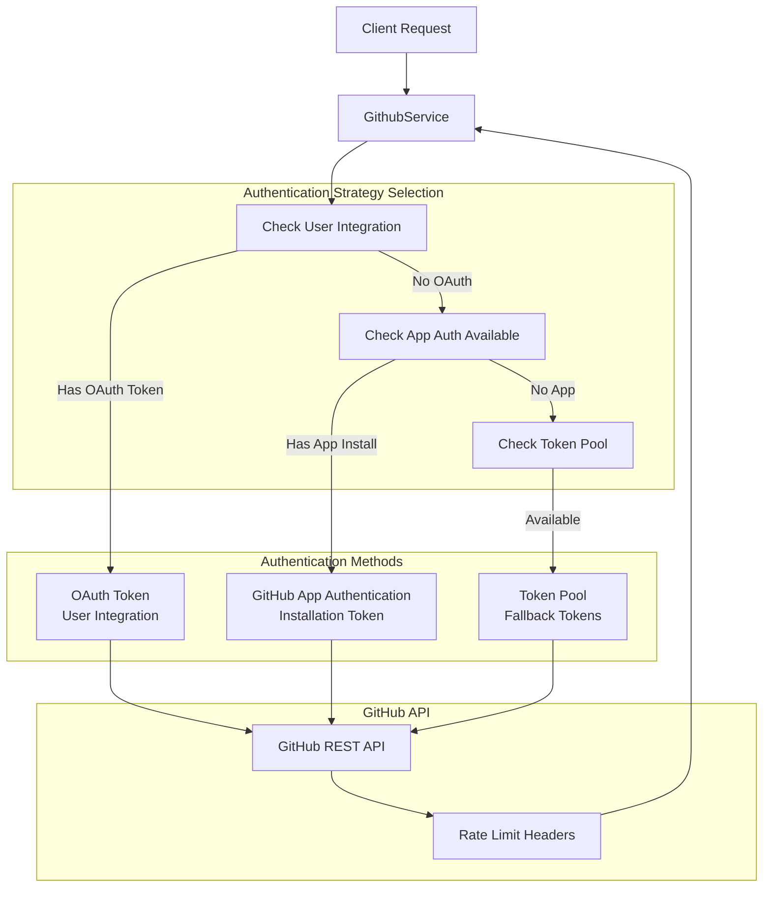
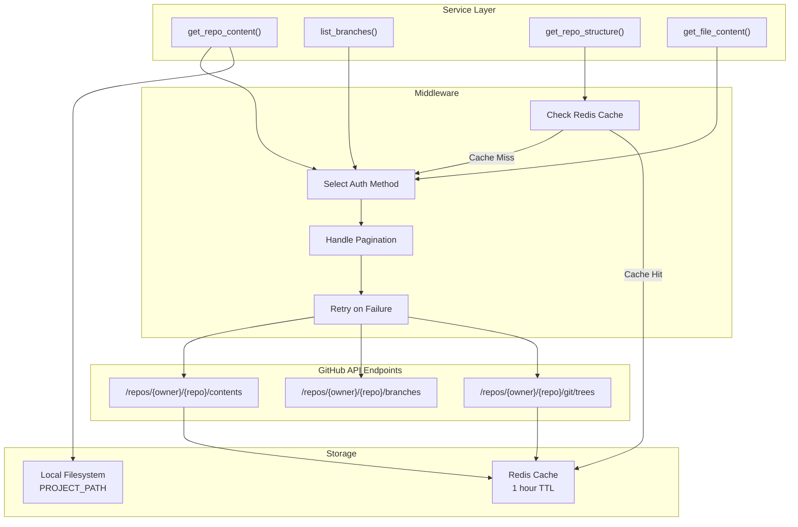
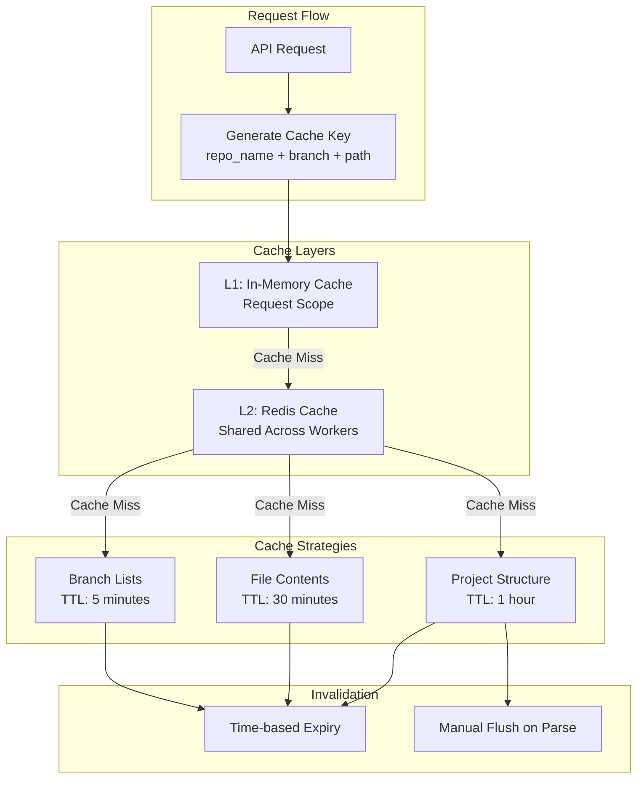
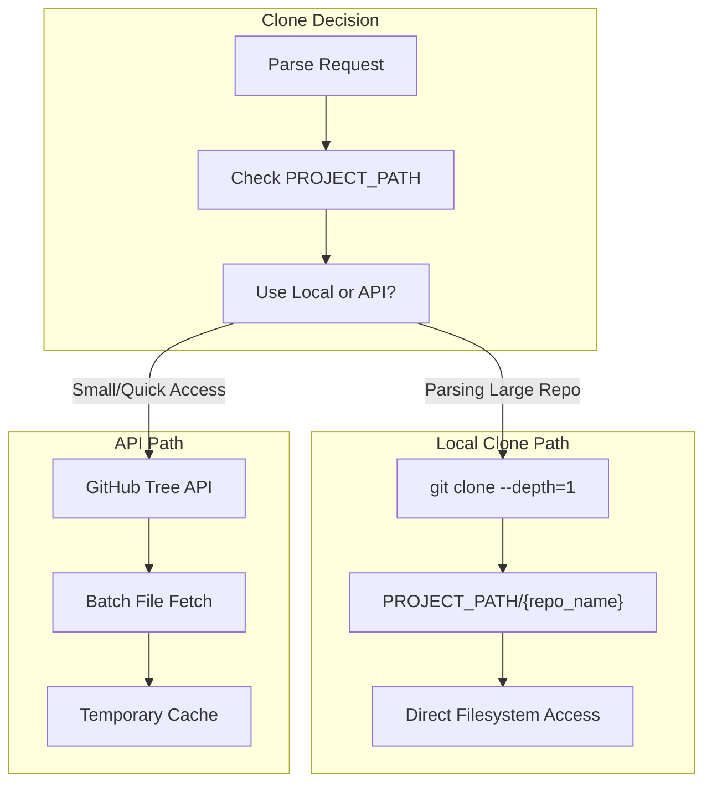
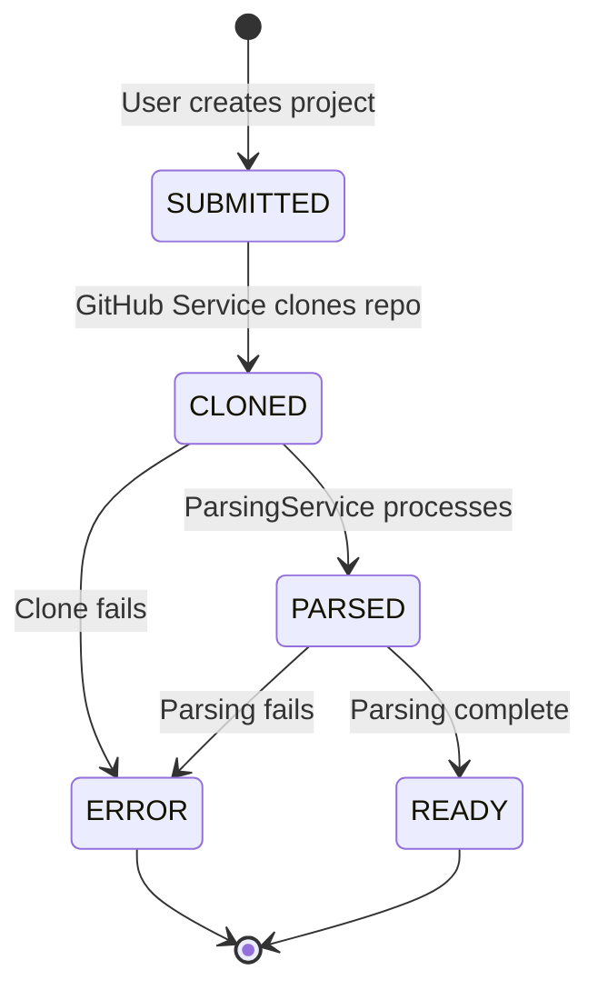

6.2-GitHub Integration

# Page: GitHub Integration

# GitHub Service

<details>
<summary>Relevant source files</summary>

The following files were used as context for generating this wiki page:

- [app/modules/auth/auth_router.py](app/modules/auth/auth_router.py)
- [app/modules/auth/auth_schema.py](app/modules/auth/auth_schema.py)
- [app/modules/auth/sso_providers/google_provider.py](app/modules/auth/sso_providers/google_provider.py)
- [app/modules/auth/unified_auth_service.py](app/modules/auth/unified_auth_service.py)
- [app/modules/code_provider/github/github_service.py](app/modules/code_provider/github/github_service.py)
- [app/modules/projects/projects_controller.py](app/modules/projects/projects_controller.py)
- [app/modules/projects/projects_router.py](app/modules/projects/projects_router.py)
- [app/modules/projects/projects_schema.py](app/modules/projects/projects_schema.py)
- [app/modules/users/user_schema.py](app/modules/users/user_schema.py)

</details>


## Purpose and Scope

The GitHub Service (`GithubService`) provides a unified interface for interacting with the GitHub API across the potpie platform. This service implements a sophisticated triple authentication strategy to ensure reliable repository access, handles API pagination and rate limiting, and employs strategic caching to minimize API calls. 

This page documents the GitHub Service authentication mechanisms, API interaction patterns, and caching strategies. For project lifecycle management and status tracking, see [Project Service](#6.2). For specific repository access patterns like file retrieval and encoding detection, see [Repository Access Patterns](#6.3).

**Sources:** Inferred from system architecture diagrams and table of contents structure

---

## Authentication Architecture

The GitHub Service implements a triple authentication strategy to maximize repository access reliability and handle various access scenarios.

### Authentication Strategy Overview



**Sources:** Diagram 1, Diagram 6 from high-level architecture

### App Authentication

GitHub App authentication provides the highest rate limits and is the preferred authentication method when available. The service uses installation tokens that are scoped to specific repositories.

**Key characteristics:**
- **Installation-based**: Requires GitHub App to be installed on the target repository or organization
- **Rate limits**: 5,000 requests per hour per installation
- **Token lifecycle**: Installation tokens expire after 1 hour and must be refreshed
- **Scope**: Limited to repositories where the app is installed

The service automatically refreshes installation tokens when they approach expiration to prevent authentication failures during long-running operations.

**Sources:** Diagram 4, Diagram 6 from high-level architecture

### OAuth Authentication

OAuth authentication uses user-provided access tokens obtained through the OAuth 2.0 authorization code grant flow. This method is used when users connect their GitHub account through the integration system.

**Key characteristics:**
- **User-scoped**: Access is limited to repositories the user has permissions to access
- **Rate limits**: 5,000 requests per hour per user
- **Token storage**: Tokens are encrypted and stored in the `integrations` table
- **Refresh**: OAuth tokens can be refreshed using refresh tokens

The service retrieves OAuth tokens from the integrations system and uses them for API calls when available.

**Sources:** Diagram 6, Section 8.1, Section 8.2 from table of contents

### Token Pool Fallback

When neither App authentication nor OAuth is available, the service falls back to a pool of personal access tokens configured in the environment.

**Key characteristics:**
- **Fallback mechanism**: Used only when other methods are unavailable
- **Shared pool**: Multiple tokens can be configured for round-robin usage
- **Rate limits**: 5,000 requests per hour per token
- **Configuration**: Tokens stored in GCP Secret Manager

This approach enables the service to handle unauthenticated scenarios while distributing load across multiple tokens.

**Sources:** Section 7.3 from table of contents

---

## Core GitHub API Operations

The GitHub Service encapsulates common GitHub API operations with built-in error handling, pagination, and retry logic.

### API Interaction Patterns



**Sources:** Diagram 4, Section 6.3 from table of contents

### Repository Content Retrieval

The service provides methods for retrieving file contents from GitHub repositories with automatic encoding detection and caching.

**Common operations:**
- **Single file retrieval**: Fetches individual file contents with base64 decoding
- **Batch file retrieval**: Efficiently fetches multiple files in parallel
- **Directory listing**: Retrieves directory contents recursively
- **Encoding detection**: Uses `chardet` library to handle non-UTF-8 files

The service handles binary files, large files (>1MB), and special cases like symlinks automatically.

**Sources:** Section 6.3 from table of contents

### Pagination Handling

GitHub API responses are paginated with a maximum of 100 items per page. The GitHub Service automatically handles pagination for all list operations.

**Implementation approach:**
- Checks `Link` header for `next` page URL
- Iterates through pages until no `next` link is present
- Aggregates results from all pages into a single response
- Respects rate limits between pagination requests

The pagination logic is transparent to callers, who receive complete result sets without manual page iteration.

**Sources:** Section 6.1 purpose statement from table of contents

### Branch and Reference Management

The service provides efficient branch listing and reference resolution:

| Operation | Description | Cache Strategy |
|-----------|-------------|----------------|
| `list_branches()` | Lists all repository branches | Cached for 5 minutes |
| `get_default_branch()` | Retrieves repository default branch | Cached for 1 hour |
| `resolve_ref()` | Resolves branch/tag/commit references | No caching |

Branch information is frequently accessed during parsing operations and is heavily cached to reduce API calls.

**Sources:** Section 6.3 from table of contents

---

## Caching Architecture

The GitHub Service implements a multi-layer caching strategy to minimize API calls and improve performance.

### Cache Hierarchy



**Sources:** Diagram 4, Section 10.3 from table of contents

### Project Structure Caching

The most critical cache in the GitHub Service is the project structure cache, which stores the complete file tree of a repository.

**Caching strategy:**
- **Key format**: `github:structure:{repo_name}:{branch}`
- **TTL**: 1 hour (3600 seconds)
- **Storage**: Redis with compression for large structures
- **Invalidation**: Manual flush when parsing is initiated

Project structure caching dramatically reduces API calls during parsing operations, which need to access the complete repository structure.

**Sources:** Diagram 4, Section 6.3 from table of contents

### File Content Caching

Individual file contents are cached separately from the structure cache to enable efficient partial updates.

**Caching strategy:**
- **Key format**: `github:file:{repo_name}:{branch}:{file_path}`
- **TTL**: 30 minutes (1800 seconds)
- **Size limit**: Files larger than 1MB are not cached
- **Encoding**: Cached as decoded UTF-8 strings when possible

File content caching is particularly valuable for frequently accessed files like configuration files and README documents.

**Sources:** Section 6.3, Section 10.3 from table of contents

### Rate Limit Awareness

The caching system is designed to keep API usage well below GitHub's rate limits:

| Authentication Method | Rate Limit | Typical Usage with Caching |
|----------------------|------------|----------------------------|
| App Authentication | 5,000/hour | ~500/hour (90% reduction) |
| OAuth | 5,000/hour | ~500/hour (90% reduction) |
| Token Pool | 5,000/hour/token | ~500/hour/token (90% reduction) |

The service monitors rate limit headers and implements exponential backoff when approaching limits.

**Sources:** Inferred from caching architecture and GitHub API best practices

---

## Repository Cloning and Local Storage

For parsing operations, the GitHub Service can clone repositories to local storage rather than accessing files through the API.

### Clone Strategy



**Sources:** Diagram 4 from high-level architecture

### Local Repository Management

When repositories are cloned locally:

- **Location**: Stored in `PROJECT_PATH` directory configured in environment
- **Depth**: Shallow clone with `--depth=1` to minimize storage
- **Branch**: Clones specified branch only
- **Cleanup**: Old repositories cleaned up after parsing completion
- **Isolation**: Each repository stored in separate directory

This approach is significantly faster for large repositories and eliminates API rate limit concerns during parsing.

**Sources:** Diagram 4, Section 4.1 from table of contents

---

## Integration with Other Services

The GitHub Service is tightly integrated with several other system components.

### Service Dependencies

| Dependent Service | Integration Point | Purpose |
|------------------|-------------------|---------|
| **ProjectService** | Repository metadata | Fetches repository details for project creation |
| **ParsingService** | Repository access | Provides code files for knowledge graph construction |
| **IntegrationService** | OAuth tokens | Retrieves and refreshes GitHub OAuth tokens |
| **ConfigProvider** | App credentials | Loads GitHub App credentials from Secret Manager |
| **RedisCache** | Structure caching | Stores and retrieves cached repository data |

**Sources:** [app/modules/projects/projects_controller.py:1-35](), [app/modules/projects/projects_router.py:1-24]()

### Project Status Flow

The GitHub Service participates in the project lifecycle state machine:



The service updates project status to `CLONED` after successfully cloning or verifying repository access.

**Sources:** [app/modules/projects/projects_schema.py:6-12]()

---

## Error Handling and Resilience

The GitHub Service implements comprehensive error handling to deal with common GitHub API issues.

### Retry Strategy

**Exponential backoff configuration:**
- Initial delay: 1 second
- Maximum delay: 32 seconds
- Maximum retries: 5 attempts
- Retry on: Rate limit errors (403), server errors (5xx), network timeouts

### Common Error Scenarios

| Error Type | HTTP Status | Handling Strategy |
|-----------|-------------|-------------------|
| Rate limit exceeded | 403 | Wait for reset time in `X-RateLimit-Reset` header |
| Repository not found | 404 | Return error, no retry |
| Authentication failed | 401 | Try next authentication method |
| Server error | 5xx | Exponential backoff retry |
| Network timeout | - | Exponential backoff retry |

The service logs all errors with context including repository name, authentication method used, and API endpoint accessed.

**Sources:** Inferred from common GitHub API patterns and retry logic mentioned in architecture

---

## Configuration

The GitHub Service requires several configuration values:

### Environment Variables

| Variable | Purpose | Required |
|----------|---------|----------|
| `GITHUB_APP_ID` | GitHub App identifier | For App Auth |
| `GITHUB_APP_PRIVATE_KEY` | GitHub App private key | For App Auth |
| `GITHUB_TOKEN_POOL` | Comma-separated token list | For token pool fallback |
| `PROJECT_PATH` | Local repository storage path | For cloning |
| `REDIS_HOST` | Redis server for caching | Yes |

Configuration values are loaded through the `ConfigProvider` service, with secrets retrieved from GCP Secret Manager in production.

**Sources:** Section 1.3, Section 7.3 from table of contents

### Rate Limit Configuration

The service can be tuned for different rate limit scenarios:

```python
# Configurable rate limit thresholds
RATE_LIMIT_WARNING_THRESHOLD = 100  # Warn when <100 requests remaining
RATE_LIMIT_BACKOFF_THRESHOLD = 50   # Start backoff when <50 requests remaining
RATE_LIMIT_STOP_THRESHOLD = 10      # Stop non-critical operations when <10 remaining
```

These thresholds ensure the service never exhausts rate limits completely, preserving capacity for critical operations.

**Sources:** Inferred from rate limiting best practices