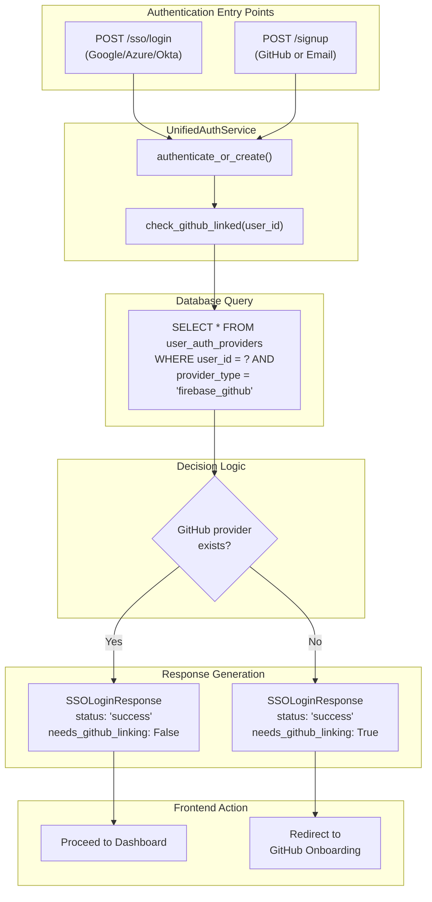
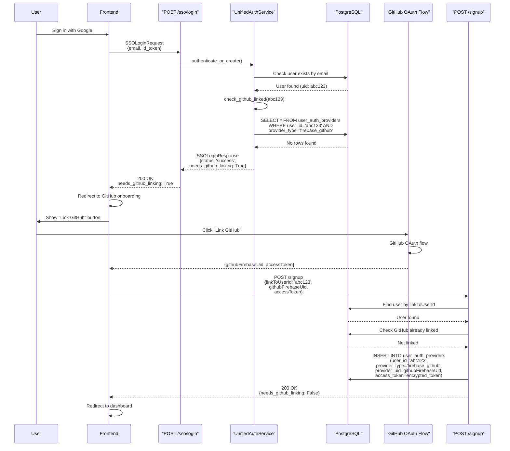
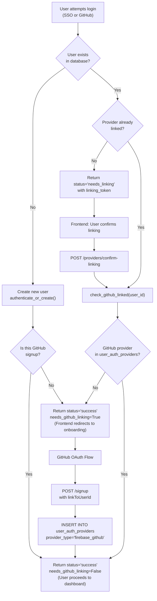

7.2-GitHub Linking Requirement

# Page: GitHub Linking Requirement

# GitHub Linking Requirement

<details>
<summary>Relevant source files</summary>

The following files were used as context for generating this wiki page:

- [app/modules/auth/auth_router.py](app/modules/auth/auth_router.py)
- [app/modules/auth/auth_schema.py](app/modules/auth/auth_schema.py)
- [app/modules/auth/sso_providers/google_provider.py](app/modules/auth/sso_providers/google_provider.py)
- [app/modules/auth/unified_auth_service.py](app/modules/auth/unified_auth_service.py)
- [app/modules/code_provider/github/github_service.py](app/modules/code_provider/github/github_service.py)
- [app/modules/users/user_schema.py](app/modules/users/user_schema.py)

</details>


## Purpose and Scope

This document describes the critical business rule requiring all Potpie users to have a GitHub account linked before accessing the application. This requirement ensures that users can access repositories, clone codebases, and interact with the knowledge graph construction pipeline. The enforcement mechanism, validation logic, and database schema for GitHub linking are detailed here.

For information about the broader multi-provider authentication system, see [Multi-Provider Authentication](#7.1). For details on provider linking and account consolidation, see [Provider Linking and Account Consolidation](#7.3).

**Sources**: [app/modules/auth/unified_auth_service.py:130-174](), [app/modules/auth/auth_router.py:72-437]()

---

## Critical Business Rule

**Every user must have GitHub linked to use Potpie.** This is enforced at three authentication checkpoints:

| Checkpoint | Location | Enforcement Method |
|------------|----------|-------------------|
| Existing User Login | `authenticate_or_create()` | Checks `user_auth_providers` for `firebase_github` provider |
| New User Signup | `authenticate_or_create()` | Returns `needs_github_linking=True` for new users without GitHub |
| Provider Linking | `/sso/login` endpoint | Validates GitHub provider exists before completing login |

The system returns `needs_github_linking=True` in the authentication response when GitHub is not linked, triggering the frontend onboarding flow. Users cannot proceed past the onboarding screen until GitHub linking is complete.

**Sources**: [app/modules/auth/unified_auth_service.py:551-609](), [app/modules/auth/unified_auth_service.py:774-805]()

---

## Enforcement Architecture



**Diagram: GitHub Linking Enforcement Flow with Code Entities**

The `check_github_linked()` method [app/modules/auth/unified_auth_service.py:130-174]() queries the `user_auth_providers` table for a row where `provider_type = 'firebase_github'`. If found, the user can proceed. If not found, `needs_github_linking=True` is set in the response.

**Sources**: [app/modules/auth/unified_auth_service.py:130-174](), [app/modules/auth/unified_auth_service.py:551-609](), [app/modules/auth/auth_schema.py:75-88]()

---

## check_github_linked() Implementation

The `check_github_linked()` method in `UnifiedAuthService` is the authoritative check for GitHub linking status:

```python
def check_github_linked(
    self, user_id: str
) -> Tuple[bool, Optional[UserAuthProvider]]:
    """
    Check if a user has GitHub linked.
    
    Flow:
    1. Find user in users table by user_id
    2. Check user_auth_providers table for that user_id 
       where provider_type = 'firebase_github'
    3. Return (True, provider) if found, (False, None) if not
    """
```

### Implementation Details

| Step | Action | Database Query |
|------|--------|----------------|
| 1. User Validation | Query `users` table by `uid` | `SELECT * FROM users WHERE uid = ?` |
| 2. Provider Lookup | Query `user_auth_providers` table | `SELECT * FROM user_auth_providers WHERE user_id = ? AND provider_type = 'firebase_github'` |
| 3. Return Result | Return tuple of (is_linked, provider) | - |

**Key Logic** [app/modules/auth/unified_auth_service.py:147-174]():
- Step 1: Verifies user exists in `users` table
- Step 2: Queries `user_auth_providers` for GitHub provider record
- If `github_provider` found: Returns `(True, github_provider)`
- If not found: Returns `(False, None)`

The method logs detailed information at each step for debugging:

```python
if github_provider:
    logger.info(
        f"GitHub provider found for user {user_id}: "
        f"provider_id={github_provider.id}, provider_uid={github_provider.provider_uid}, "
        f"linked_at={github_provider.linked_at}"
    )
    return True, github_provider
else:
    logger.info(f"No GitHub provider found for user {user_id}")
    return False, None
```

**Sources**: [app/modules/auth/unified_auth_service.py:130-174]()

---

## GitHub Linking Flow



**Diagram: GitHub Linking Flow for SSO Users**

### Flow Steps

1. **SSO Sign-In**: User signs in with Google/Azure/Okta [app/modules/auth/auth_router.py:441-570]()
2. **User Lookup**: `authenticate_or_create()` finds existing user by email [app/modules/auth/unified_auth_service.py:414]()
3. **GitHub Check**: `check_github_linked()` queries for GitHub provider [app/modules/auth/unified_auth_service.py:569-571]()
4. **Response**: Returns `needs_github_linking=True` if not found [app/modules/auth/unified_auth_service.py:599-609]()
5. **Frontend Redirect**: Frontend shows GitHub onboarding screen
6. **GitHub OAuth**: User completes GitHub OAuth flow, receives `githubFirebaseUid` and `accessToken`
7. **Link Request**: Frontend calls POST `/signup` with `linkToUserId` parameter [app/modules/auth/auth_router.py:149-279]()
8. **Provider Creation**: System creates `user_auth_providers` record with `provider_type='firebase_github'` [app/modules/auth/auth_router.py:226-238]()
9. **Completion**: User can now access dashboard and repositories

**Sources**: [app/modules/auth/auth_router.py:441-570](), [app/modules/auth/auth_router.py:149-279](), [app/modules/auth/unified_auth_service.py:551-609]()

---

## linkToUserId Parameter

The `linkToUserId` parameter enables GitHub linking for existing SSO users. When present in the `/signup` request, it triggers the GitHub linking flow instead of creating a new user.

### Request Schema

```json
{
  "uid": "firebase_github_uid_xyz",
  "email": "user@example.com",
  "linkToUserId": "sso_user_uid_abc",
  "githubFirebaseUid": "firebase_github_uid_xyz",
  "accessToken": "github_oauth_token",
  "providerUsername": "github_username"
}
```

### Linking Logic

[app/modules/auth/auth_router.py:149-279]() implements the linking logic:

| Step | Code Location | Action |
|------|---------------|--------|
| 1. Extract linkToUserId | [auth_router.py:94]() | `link_to_user_id = body.get("linkToUserId")` |
| 2. Find SSO user | [auth_router.py:154]() | `user = user_service.get_user_by_uid(link_to_user_id)` |
| 3. Validate user exists | [auth_router.py:156-163]() | Return 404 if not found |
| 4. Check duplicate | [auth_router.py:168-220]() | Check if GitHub already linked to another user |
| 5. Create provider | [auth_router.py:226-238]() | Insert `user_auth_providers` record |
| 6. Return success | [auth_router.py:270-279]() | Return `{needs_github_linking: False}` |

### Conflict Detection

The system prevents duplicate GitHub accounts by checking `provider_uid` uniqueness:

```python
existing_provider_with_uid = (
    db.query(UserAuthProvider)
    .filter(
        UserAuthProvider.provider_type == PROVIDER_TYPE_FIREBASE_GITHUB,
        UserAuthProvider.provider_uid == provider_uid,
    )
    .first()
)

if existing_provider_with_uid and existing_provider_with_uid.user_id != user.uid:
    return Response(
        content=json.dumps({
            "error": "GitHub account is already linked to another account. "
                     "Please use a different GitHub account or contact support.",
        }),
        status_code=409,  # Conflict
    )
```

**Sources**: [app/modules/auth/auth_router.py:149-279](), [app/modules/auth/auth_router.py:190-220]()

---

## Database Schema

### user_auth_providers Table

GitHub linking is stored in the `user_auth_providers` table with the following structure:

| Column | Type | Purpose | Example Value |
|--------|------|---------|---------------|
| `id` | UUID | Primary key | `550e8400-e29b-41d4-a716-446655440000` |
| `user_id` | TEXT | Foreign key to `users.uid` | `abc123xyz` |
| `provider_type` | TEXT | Identifies provider | `'firebase_github'` |
| `provider_uid` | TEXT | GitHub Firebase UID | `github_firebase_uid_xyz` |
| `provider_data` | JSONB | GitHub username, etc. | `{"username": "octocat", "login": "octocat"}` |
| `access_token` | TEXT | Encrypted OAuth token | `gAAAAA...` (encrypted) |
| `refresh_token` | TEXT | Encrypted refresh token (if available) | `gAAAAA...` (encrypted) |
| `is_primary` | BOOLEAN | Primary login method | `false` (SSO is usually primary) |
| `linked_at` | TIMESTAMP | When linked | `2024-01-15 10:30:00` |
| `last_used_at` | TIMESTAMP | Last repository access | `2024-01-16 14:22:00` |

### Unique Constraints

The table enforces two constraints to prevent duplicate linking:

1. **unique_user_provider**: `(user_id, provider_type)` - One GitHub provider per user
2. **unique_provider_uid**: `(provider_type, provider_uid)` - One user per GitHub account

**Sources**: [app/modules/auth/auth_provider_model.py:1-50]() (referenced but not provided)

---

## Authentication Decision Tree



**Diagram: Authentication Decision Tree with GitHub Linking Enforcement**

This decision tree shows all paths through the authentication system and where GitHub linking is enforced:

- **Path 1 (New SSO User)**: SSO sign-up → Create user → No GitHub → `needs_github_linking=True` → Onboarding
- **Path 2 (Existing SSO User)**: SSO sign-in → User exists → Check GitHub → Not found → `needs_github_linking=True` → Onboarding
- **Path 3 (GitHub User)**: GitHub sign-in → User exists → Check GitHub → Found → Allow login
- **Path 4 (Multi-Provider)**: Different provider → User exists → Needs linking → Confirm → Check GitHub → Continue

**Sources**: [app/modules/auth/unified_auth_service.py:386-805]()

---

## Token Management and Encryption

GitHub OAuth tokens are encrypted before storage to protect user credentials. The `access_token` column in `user_auth_providers` stores the encrypted token.

### Encryption Flow

| Step | Component | Action |
|------|-----------|--------|
| 1. Receive token | `POST /signup` | Plaintext OAuth token from GitHub |
| 2. Encrypt | `add_provider()` | `encrypt_token(access_token)` using Fernet symmetric encryption |
| 3. Store | Database | Encrypted token stored in `user_auth_providers.access_token` |
| 4. Retrieve | `get_github_oauth_token()` | Query encrypted token from database |
| 5. Decrypt | `get_github_oauth_token()` | `decrypt_token(encrypted_token)` returns plaintext |
| 6. Use | Repository operations | Plaintext token used for GitHub API calls |

### Token Retrieval

The `GithubService.get_github_oauth_token()` method retrieves and decrypts tokens [app/modules/code_provider/github/github_service.py:184-247]():

```python
def get_github_oauth_token(self, uid: str) -> Optional[str]:
    """
    Get user's GitHub OAuth token from UserAuthProvider (new system) 
    or provider_info (legacy).
    """
    # Try new UserAuthProvider system first
    github_provider = (
        self.db.query(UserAuthProvider)
        .filter(
            UserAuthProvider.user_id == uid,
            UserAuthProvider.provider_type == "firebase_github",
        )
        .first()
    )
    
    if github_provider and github_provider.access_token:
        try:
            decrypted_token = decrypt_token(github_provider.access_token)
            return decrypted_token
        except Exception as e:
            # Backward compatibility: might be plaintext
            return github_provider.access_token
```

### Backward Compatibility

The system handles both encrypted and plaintext tokens for backward compatibility with accounts created before encryption was implemented [app/modules/code_provider/github/github_service.py:218-225]().

**Sources**: [app/modules/integrations/token_encryption.py:1-50]() (referenced), [app/modules/auth/unified_auth_service.py:254-264](), [app/modules/code_provider/github/github_service.py:184-247]()

---

## Repository Access Dependencies

GitHub linking is required because repository operations depend on the user's OAuth token for authentication.

### Operations Requiring GitHub Token

| Operation | Service Method | Token Usage |
|-----------|----------------|-------------|
| List Repositories | `GithubService.get_repos_for_user()` | User OAuth token or fallback to PAT pool |
| Clone Repository | `CodeProviderService.clone_or_copy_repository()` | User OAuth token for private repos |
| Fetch File Content | `GithubService.get_file_content()` | User OAuth token for authenticated access |
| Get Branch List | `GithubService.get_branch_list()` | User OAuth token |
| Create PR | GitHub integration tools | User OAuth token |

### Authentication Fallback Chain

[app/modules/code_provider/github/github_service.py:318-363]() implements a fallback chain when user OAuth token is unavailable:

1. **User OAuth Token** (preferred): Retrieved from `user_auth_providers` table
2. **GH_TOKEN_LIST** (fallback 1): Random token from PAT pool
3. **CODE_PROVIDER_TOKEN** (fallback 2): Single PAT from environment

```python
# Fall back to system tokens if user OAuth token not available
if not github_oauth_token:
    logger.info(f"No user OAuth token for {firebase_uid}, falling back to system tokens")
    
    # Try GH_TOKEN_LIST first
    token_list_str = os.getenv("GH_TOKEN_LIST", "")
    if token_list_str:
        tokens = [t.strip() for t in token_list_str.split(",") if t.strip()]
        if tokens:
            github_oauth_token = random.choice(tokens)
    
    # Fall back to CODE_PROVIDER_TOKEN
    if not github_oauth_token:
        github_oauth_token = os.getenv("CODE_PROVIDER_TOKEN")
```

### Why User Tokens Are Preferred

User OAuth tokens are preferred over system PAT tokens because:

1. **Access Scope**: User tokens can access private repositories the user has access to
2. **Rate Limits**: Each user token has separate rate limits (5,000 requests/hour)
3. **Audit Trail**: Repository access is attributed to the correct user
4. **Security**: System PAT tokens are shared and have broader access

**Sources**: [app/modules/code_provider/github/github_service.py:184-247](), [app/modules/code_provider/github/github_service.py:318-363]()

---

## Validation Rules

### New GitHub Signup Blocking

As of recent changes, new GitHub signups are blocked [app/modules/auth/auth_router.py:301-314]():

```python
# VALIDATION: Block new GitHub signups
if not existing_provider:
    logger.warning(
        f"Blocked new GitHub signup attempt: GitHub UID {provider_uid} is not linked to any user"
    )
    return Response(
        content=json.dumps({
            "error": "GitHub sign-up is no longer supported. Please use 'Continue with Google' with your work email address.",
            "details": "New GitHub signups are disabled. Existing GitHub users can still sign in.",
        }),
        status_code=403,  # Forbidden
    )
```

Users must now:
1. Sign up with SSO (Google/Azure/Okta) using work email
2. Link GitHub during onboarding

### Personal Email Domain Blocking

New SSO signups with personal email domains are blocked [app/modules/auth/auth_router.py:500-512]():

```python
if is_personal_email_domain(verified_email):
    if not existing_user:
        # New user with generic email - block them
        return JSONResponse(
            content={
                "error": "Personal email addresses are not allowed. "
                        "Please use your work/corporate email to sign in.",
                "details": "Generic email providers (Gmail, Yahoo, Outlook, etc.) "
                          "cannot be used for new signups.",
            },
            status_code=403,  # Forbidden
        )
```

Blocked domains include: Gmail, Yahoo, Outlook, Hotmail, AOL, iCloud, ProtonMail, etc.

### Duplicate GitHub Account Prevention

The system prevents duplicate GitHub linking through database constraints and validation [app/modules/auth/auth_router.py:190-220]():

```python
# Check if this GitHub account is already linked to a different user
existing_provider_with_uid = (
    db.query(UserAuthProvider)
    .filter(
        UserAuthProvider.provider_type == PROVIDER_TYPE_FIREBASE_GITHUB,
        UserAuthProvider.provider_uid == provider_uid,
    )
    .first()
)

if existing_provider_with_uid and existing_provider_with_uid.user_id != user.uid:
    return Response(
        content=json.dumps({
            "error": "GitHub account is already linked to another account.",
        }),
        status_code=409,  # Conflict
    )
```

**Sources**: [app/modules/auth/auth_router.py:301-314](), [app/modules/auth/auth_router.py:500-512](), [app/modules/auth/auth_router.py:190-220]()

---

## Frontend Integration

The frontend handles the `needs_github_linking` flag in the authentication response to trigger the onboarding flow.

### Response Schema

The `SSOLoginResponse` schema includes the GitHub linking flag [app/modules/auth/auth_schema.py:75-88]():

```python
class SSOLoginResponse(BaseModel):
    status: str  # 'success', 'needs_linking', 'new_user'
    user_id: Optional[str]
    email: str
    display_name: Optional[str]
    message: str
    linking_token: Optional[str]  # For provider linking
    existing_providers: Optional[List[str]]
    needs_github_linking: Optional[bool] = Field(
        default=False, 
        description="True if user needs to link GitHub account"
    )
```

### Frontend Flow

1. **Receive Response**: Frontend receives authentication response
2. **Check Flag**: If `needs_github_linking=True`, redirect to onboarding
3. **Show Onboarding**: Display "Link GitHub Account" screen
4. **Trigger OAuth**: User clicks button, initiates GitHub OAuth flow
5. **Complete Linking**: Frontend sends POST `/signup` with `linkToUserId`
6. **Verify Completion**: Backend returns `needs_github_linking=False`
7. **Navigate**: Frontend redirects to dashboard

### Example Response (GitHub Not Linked)

```json
{
  "status": "success",
  "user_id": "abc123xyz",
  "email": "user@company.com",
  "display_name": "John Doe",
  "message": "Login successful, but GitHub account linking required",
  "needs_github_linking": true
}
```

### Example Response (GitHub Linked)

```json
{
  "status": "success",
  "user_id": "abc123xyz",
  "email": "user@company.com",
  "display_name": "John Doe",
  "message": "Login successful",
  "needs_github_linking": false
}
```

**Sources**: [app/modules/auth/auth_schema.py:75-88](), [app/modules/auth/unified_auth_service.py:599-609]()

---

## Edge Cases and Error Handling

### Orphaned User Records

When a user is deleted from Firebase but exists in the local database, the system deletes the orphaned record [app/modules/auth/unified_auth_service.py:508-545]():

```python
if not firebase_user_exists:
    # Orphaned record - delete from local DB and treat as new user
    logger.info(
        f"Deleting orphaned user record {user_uid} "
        f"for email {email} (not in Firebase)"
    )
    try:
        self._delete_orphaned_user(user_uid, existing_user)
        self.db.expire_all()
        existing_user = await self.user_service.get_user_by_email(email)
    except Exception as e:
        logger.error(f"Failed to delete orphaned user {user_uid}: {str(e)}")
        self.db.rollback()
        existing_user = None
```

### Race Conditions

The system performs a final check before creating new users to prevent race conditions [app/modules/auth/unified_auth_service.py:684-759]():

```python
# Double-check that user doesn't exist (in case of race condition)
final_check = await self.user_service.get_user_by_email(email)
if final_check:
    logger.warning(
        f"User with email {email} found during final check before creation. "
        f"UID: {final_check.uid}. This may indicate a race condition."
    )
    # Treat as existing user scenario
```

### IntegrityError Handling

Database constraint violations are caught and handled gracefully [app/modules/auth/auth_router.py:239-261]():

```python
try:
    unified_auth.add_provider(
        user_id=user.uid, provider_create=provider_create
    )
    db.commit()
except IntegrityError as e:
    db.rollback()
    error_str = str(e).lower()
    if "unique_provider_uid" in error_str:
        return Response(
            content=json.dumps({
                "error": "GitHub account is already linked to another account.",
            }),
            status_code=409,
        )
    raise  # Re-raise other IntegrityErrors
```

### Token Decryption Failure

If token decryption fails, the system falls back to treating the token as plaintext for backward compatibility [app/modules/code_provider/github/github_service.py:218-225]():

```python
try:
    decrypted_token = decrypt_token(github_provider.access_token)
    return decrypted_token
except Exception as e:
    logger.warning(
        "Failed to decrypt GitHub token. "
        "Assuming plaintext token (backward compatibility)."
    )
    return github_provider.access_token
```

**Sources**: [app/modules/auth/unified_auth_service.py:508-545](), [app/modules/auth/unified_auth_service.py:684-759](), [app/modules/auth/auth_router.py:239-261](), [app/modules/code_provider/github/github_service.py:218-225]()

---

## Audit Logging

Authentication events including GitHub linking are logged to the `auth_audit_log` table [app/modules/auth/unified_auth_service.py:920-964]():

### Logged Events

| Event Type | When Logged | Additional Data |
|------------|-------------|-----------------|
| `login_blocked_github` | User authenticated but GitHub not linked | `provider_type`, `status='pending'` |
| `login` | Successful login with GitHub linked | `provider_type`, `status='success'` |
| `link_provider` | GitHub provider added to account | `provider_type='firebase_github'` |
| `signup` | New user created | `provider_type` |

### Audit Log Schema

```python
def _log_auth_event(
    self,
    user_id: Optional[str],
    event_type: str,
    provider_type: Optional[str] = None,
    status: str = "success",
    ip_address: Optional[str] = None,
    user_agent: Optional[str] = None,
    error_message: Optional[str] = None,
):
    """Log authentication event to audit log"""
```

**Sources**: [app/modules/auth/unified_auth_service.py:920-964]()