4.2-Inference and Docstring Generation

# Page: Inference and Docstring Generation

# Inference and Docstring Generation

<details>
<summary>Relevant source files</summary>

The following files were used as context for generating this wiki page:

- [app/modules/parsing/graph_construction/code_graph_service.py](app/modules/parsing/graph_construction/code_graph_service.py)
- [app/modules/parsing/graph_construction/parsing_helper.py](app/modules/parsing/graph_construction/parsing_helper.py)
- [app/modules/parsing/graph_construction/parsing_service.py](app/modules/parsing/graph_construction/parsing_service.py)
- [app/modules/parsing/knowledge_graph/inference_service.py](app/modules/parsing/knowledge_graph/inference_service.py)
- [app/modules/projects/projects_service.py](app/modules/projects/projects_service.py)

</details>


The inference system enriches the Neo4j code graph with AI-generated docstrings, tags, and vector embeddings. After [4.1](#4.1) creates the graph structure, `InferenceService` generates semantic documentation for each code node, enabling similarity search and agent queries.

Agents query these docstrings via tools documented in [5.2](#5.2).

---

## Service Architecture

`InferenceService` coordinates LLM calls, caching, embedding generation, and Neo4j updates.

**InferenceService Component Dependencies**

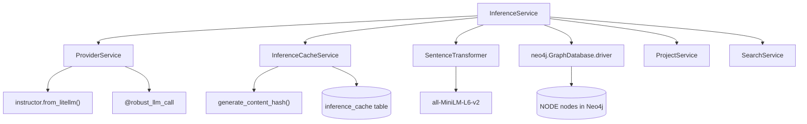

**Sources**: [app/modules/parsing/knowledge_graph/inference_service.py:1-60](), [app/modules/intelligence/provider/provider_service.py:480-509](), [app/modules/parsing/services/inference_cache_service.py]()

### Component Responsibilities

| Class | File | Key Methods | Purpose |
|-------|------|-------------|---------|
| `InferenceService` | [inference_service.py:45-60]() | `run_inference()`, `batch_nodes()`, `generate_response()` | Orchestrates docstring generation pipeline |
| `ProviderService` | [provider_service.py]() | `call_llm_with_structured_output()` | LLM abstraction with retry logic |
| `InferenceCacheService` | [inference_cache_service.py]() | `get_cached_inference()`, `store_inference()` | Content-hash based caching |
| `SearchService` | [search_service.py]() | `bulk_create_search_indices()` | Search index creation |
| `get_embedding_model()` | [inference_service.py:35-42]() | Returns singleton | Loads SentenceTransformer once per process |

---

## Inference Pipeline Flow

`InferenceService.run_inference()` executes after graph construction, transforming raw code nodes into semantically-enriched entities.

**run_inference() Execution Flow**

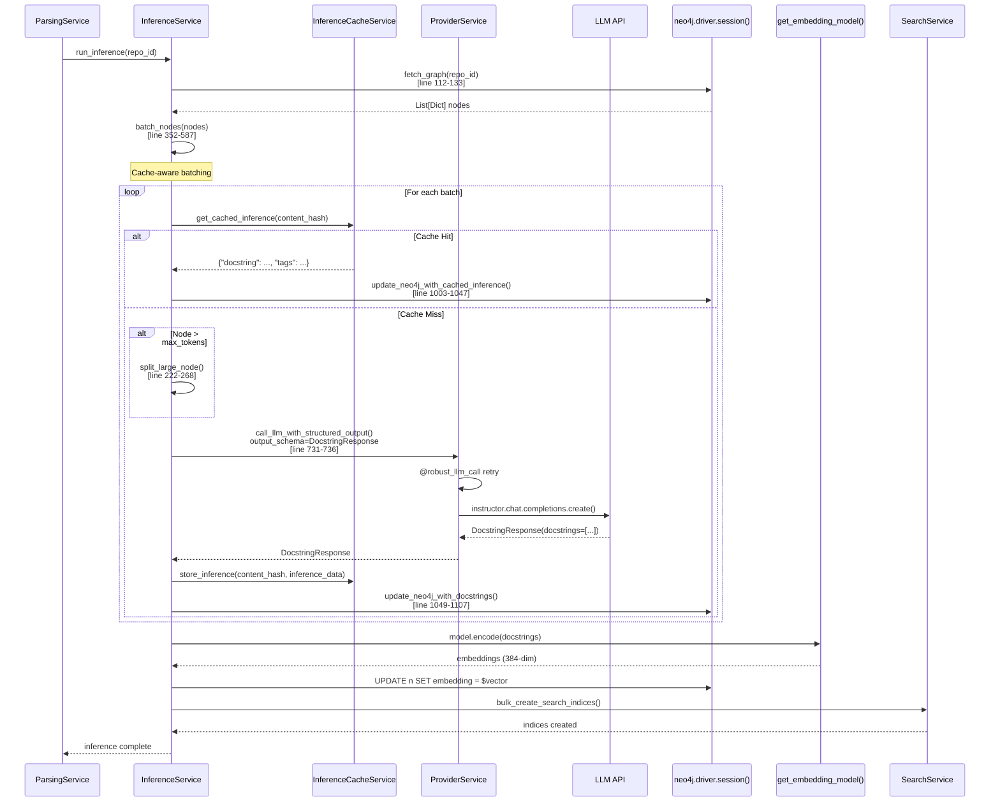

**Sources**: [app/modules/parsing/knowledge_graph/inference_service.py:741-899](), [app/modules/parsing/graph_construction/parsing_service.py:358-359](), [app/modules/intelligence/provider/provider_service.py:936-1001]()

---

## Batching Strategy

`batch_nodes()` [line 352-587]() batches nodes to maximize LLM throughput while respecting token limits.

### Batching Algorithm

**batch_nodes() Logic**

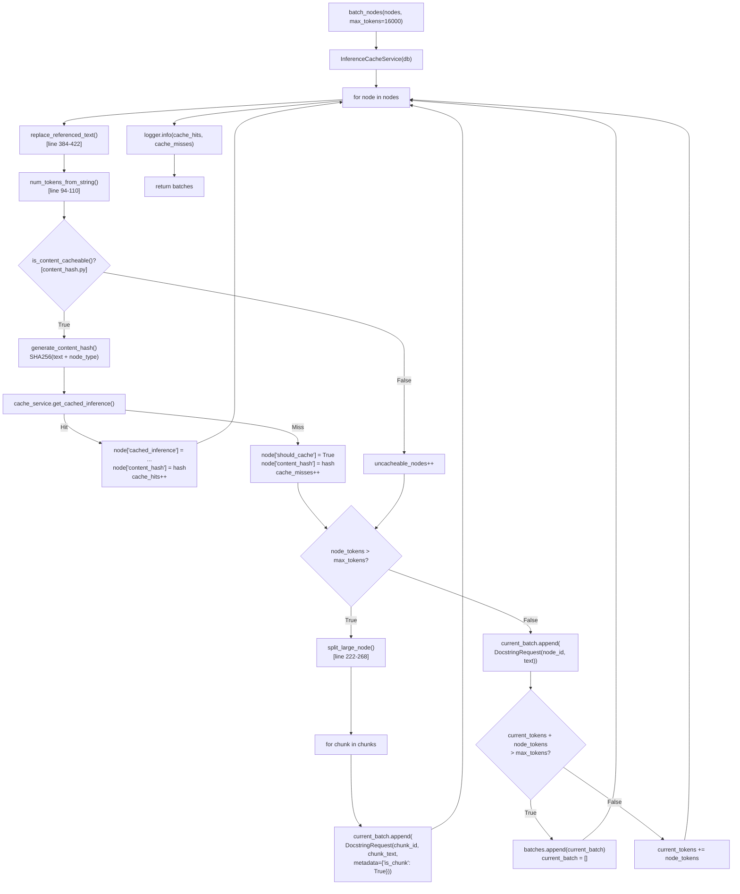

**Sources**: [app/modules/parsing/knowledge_graph/inference_service.py:352-587](), [app/modules/parsing/utils/content_hash.py]()

### Configuration Parameters

| Parameter | Default Value | Line Reference | Purpose |
|-----------|---------------|----------------|---------|
| `max_tokens` | 16000 | [inference_service.py:356]() | Batch token limit (LLM context window) |
| `model` | "gpt-4" | [inference_service.py:356]() | Token counting model for tiktoken |
| `parallel_requests` | 50 (env var) | [inference_service.py:57]() | `asyncio.Semaphore` concurrent limit |
| `batch_size` | 500 | [inference_service.py:113]() | Neo4j `SKIP`/`LIMIT` batch size |

### Reference Resolution

`replace_referenced_text()` [line 384-422]() resolves brevity placeholders before hashing:

**Reference Resolution Process**

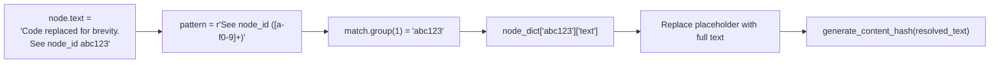

This ensures cache keys are based on complete code. Unresolved references (missing from `node_dict`) skip caching.

**Sources**: [app/modules/parsing/knowledge_graph/inference_service.py:384-422]()

---

## Cache-First Optimization

`InferenceCacheService` provides content-hash based caching to reduce redundant LLM calls.

### Cache Architecture

**Cache Key and Storage**

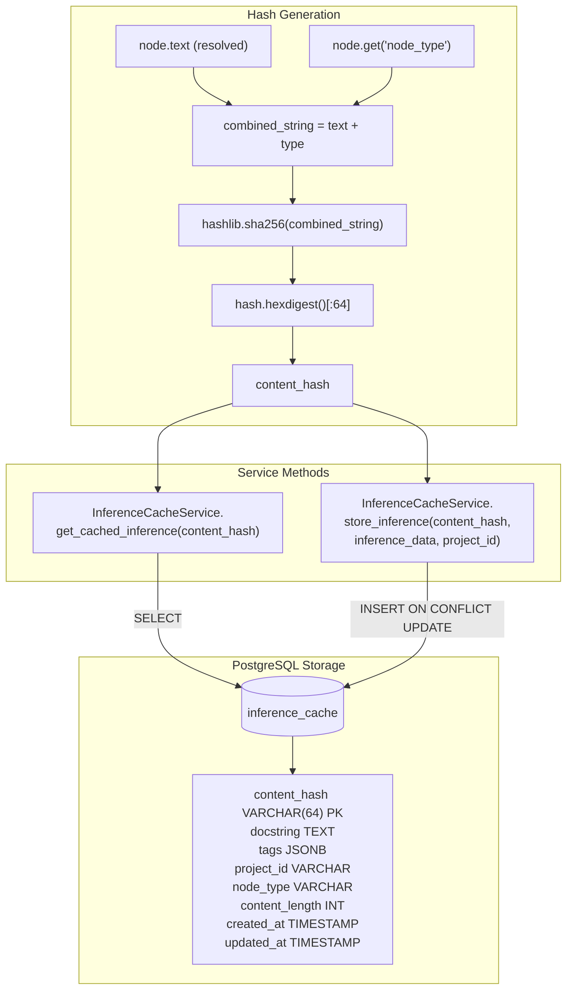

**Sources**: [app/modules/parsing/utils/content_hash.py](), [app/modules/parsing/services/inference_cache_service.py]()

### Cache Metrics

`batch_nodes()` logs cache performance [line 560-582]():

```python
cache_hits = 150           # Nodes from cache
cache_misses = 75          # Nodes needing LLM calls
uncacheable_nodes = 25     # Non-cacheable content
cache_hit_rate = 60.0%     # cache_hits / total_nodes * 100
```

**Log Output**:
```
Cache stats - Hits: 150, Misses: 75, Uncacheable: 25
Cache hit rate: 60.0%
Batched 75 nodes into 3 batches
Large nodes split: 2
Batch sizes: [30, 30, 15]
```

**Sources**: [app/modules/parsing/knowledge_graph/inference_service.py:560-582]()

### Cacheability Rules

| Content Type | Cacheable? | Reason |
|--------------|-----------|---------|
| Static function code | ✅ Yes | Deterministic content with stable hash |
| Resolved references | ✅ Yes | Full text available for hashing |
| Unresolved brevity placeholders | ❌ No | Incomplete content, low reuse value |
| Generated/templated code | ❌ No | May vary per generation |
| Very short code (< 10 chars) | ❌ No | Likely noise or trivial content |

**Sources**: [app/modules/parsing/utils/content_hash.py](), [app/modules/parsing/knowledge_graph/inference_service.py:433-481]()

---

## Node Splitting for Large Code

`split_large_node()` [line 222-268]() divides nodes exceeding the token limit into chunks.

### Splitting Strategy

**split_large_node() Algorithm**

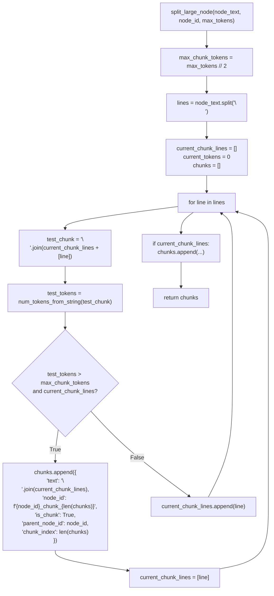

**Sources**: [app/modules/parsing/knowledge_graph/inference_service.py:222-268]()

### Chunk Metadata

Each chunk maintains metadata for later consolidation:

```python
{
    "text": "def process_data():\n    # chunk content...",
    "node_id": "abc123_chunk_0",
    "is_chunk": True,
    "parent_node_id": "abc123",
    "chunk_index": 0
}
```

### Consolidation Process

`consolidate_chunk_responses()` [line 270-303]() merges chunk docstrings:

**Chunk Consolidation**

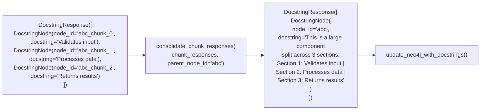

**Sources**: [app/modules/parsing/knowledge_graph/inference_service.py:270-303](), [app/modules/parsing/knowledge_graph/inference_service.py:867-873]()

---

## Docstring Generation with LLMs

`generate_response()` [line 901-997]() uses `instructor` and Pydantic for structured output.

### Schema Definitions

```python
# app/modules/parsing/knowledge_graph/inference_schema.py
class DocstringNode(BaseModel):
    node_id: str
    docstring: str
    tags: Optional[List[str]] = []

class DocstringResponse(BaseModel):
    docstrings: List[DocstringNode]

class DocstringRequest(BaseModel):
    node_id: str
    text: str
    metadata: Optional[Dict] = {}
```

**Sources**: [app/modules/parsing/knowledge_graph/inference_schema.py]()

### LLM Call Flow

**LLM Call Flow with Structured Output**

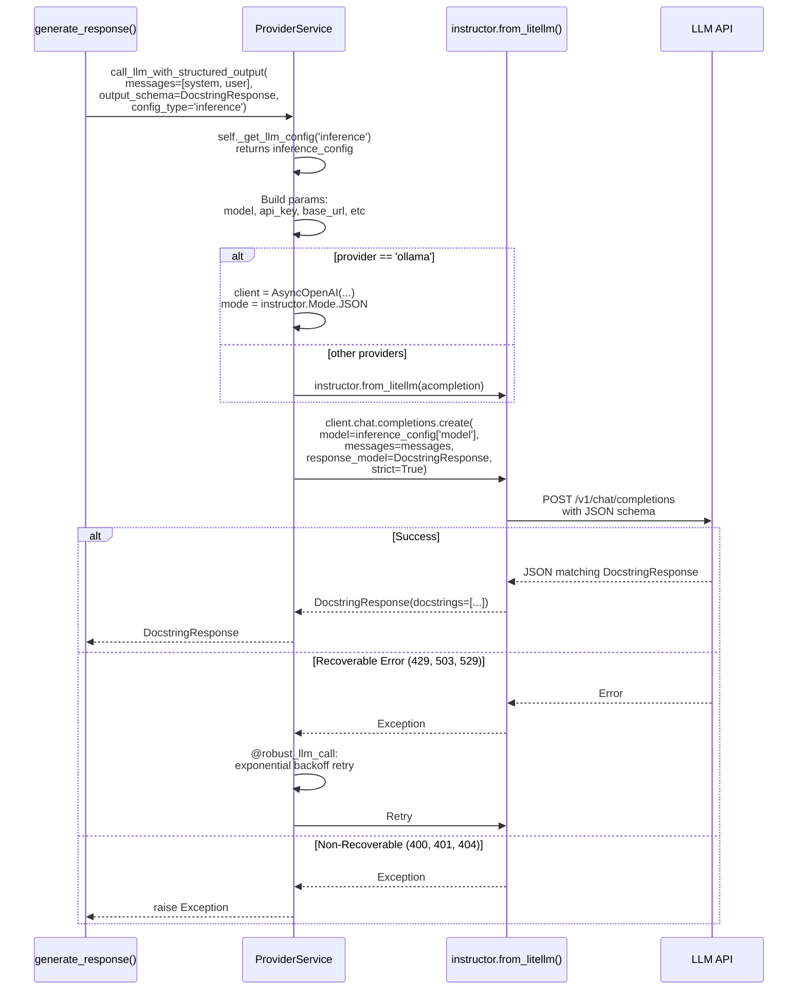

**Sources**: [app/modules/intelligence/provider/provider_service.py:936-1001](), [app/modules/parsing/knowledge_graph/inference_service.py:901-997]()

### Retry Configuration

`@robust_llm_call` [line 116-259]() provides exponential backoff:

| Parameter | Default | Description |
|-----------|---------|-------------|
| `max_retries` | 8 | Maximum attempts |
| `min_delay` | 1.0s | Minimum wait |
| `max_delay` | 120.0s | Maximum wait (cap) |
| `base_delay` | 2.0s | Base multiplier |
| `step_increase` | 1.8 | Exponential factor |
| `jitter_factor` | 0.2 | ±20% random variance |

**Delay Calculation**:
```python
delay = min(max_delay, base_delay * (step_increase ** retry_count))
jittered_delay = delay * random.uniform(1 - jitter_factor, 1 + jitter_factor)
await asyncio.sleep(jittered_delay)
```

**Sources**: [app/modules/intelligence/provider/provider_service.py:116-259]()

### Prompt Construction

`generate_response()` [line 901-997]() builds prompts from batched nodes:

```python
# Prepare code snippets
code_snippets = ""
for request in batch:
    code_snippets += f"node_id: {request.node_id} \n```\n{request.text}\n```\n\n "

messages = [
    {
        "role": "system",
        "content": "You are an expert software documentation assistant. Analyze code and provide structured documentation in JSON format."
    },
    {
        "role": "user",
        "content": base_prompt.format(code_snippets=code_snippets)
    }
]
```

The `base_prompt` [line 904-962]() includes:
- Instructions to identify backend vs frontend code
- Tag categories (AUTH, DATABASE, API, UI_COMPONENT, etc.)
- JSON output format requirements

**Sources**: [app/modules/parsing/knowledge_graph/inference_service.py:901-997]()

---

## Embedding Generation

`generate_embedding()` [line 999-1001]() creates 384-dim vectors using `SentenceTransformer`.

### Embedding Pipeline

**Embedding Generation Flow**

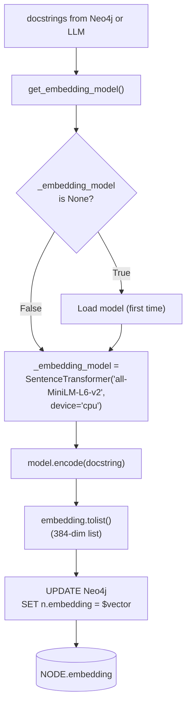

**Sources**: [app/modules/parsing/knowledge_graph/inference_service.py:35-42](), [app/modules/parsing/knowledge_graph/inference_service.py:999-1001]()

### Model Configuration

| Property | Value | Rationale |
|----------|-------|-----------|
| Model | `all-MiniLM-L6-v2` | Fast, lightweight (80MB), good for code |
| Dimensions | 384 | Balance quality and storage |
| Device | `cpu` | No GPU dependency |
| Singleton | Global `_embedding_model` | Load once per process |

**Singleton Implementation** [line 32-42]():
```python
_embedding_model = None

def get_embedding_model():
    global _embedding_model
    if _embedding_model is None:
        logger.info("Loading SentenceTransformer model (first time only)")
        _embedding_model = SentenceTransformer("all-MiniLM-L6-v2", device="cpu")
        logger.info("SentenceTransformer model loaded successfully")
    return _embedding_model
```

**Sources**: [app/modules/parsing/knowledge_graph/inference_service.py:32-42]()

---

## Neo4j Storage and Updates

`update_neo4j_with_docstrings()` [line 1049-1107]() and `update_neo4j_with_cached_inference()` [line 1003-1047]() update nodes in-place.

### Update Operations

**Neo4j Update Queries**

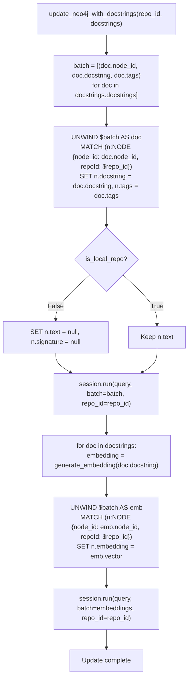

**Sources**: [app/modules/parsing/knowledge_graph/inference_service.py:1049-1107]()

### Node Properties After Inference

| Property | Type | Example | Source |
|----------|------|---------|--------|
| `docstring` | String | "Validates user input..." | LLM-generated |
| `tags` | List[String] | ["API", "VALIDATION"] | LLM-generated |
| `embedding` | List[Float] | [0.12, -0.34, ...] (384-dim) | SentenceTransformer |
| `text` | String (nullable) | Original code | Nulled for remote repos (privacy) |
| `file_path` | String | "src/auth.py" | From parsing phase |
| `start_line` | Integer | 45 | From parsing phase |
| `end_line` | Integer | 67 | From parsing phase |
| `node_id` | String | "abc123..." | MD5 hash |
| `repoId` | String | "12345" | Project ID |

### Search Index Creation

`SearchService.bulk_create_search_indices()` [line 756-777]() creates search structures:

**Search Index Pipeline**

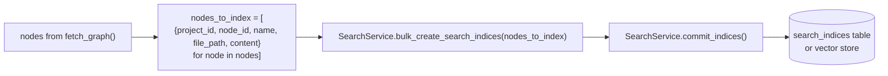

**Sources**: [app/modules/parsing/knowledge_graph/inference_service.py:756-777](), [app/modules/search/search_service.py]()

---

## Configuration and Performance Tuning

### Environment Variables

| Variable | Default | Impact | Line Reference |
|----------|---------|--------|----------------|
| `INFERENCE_MODEL` | `openai/gpt-4o-mini` | Model for docstring generation | [.env.template]() |
| `CHAT_MODEL` | `openai/gpt-4o` | Not used by inference | [.env.template]() |
| `PARALLEL_REQUESTS` | `50` | `asyncio.Semaphore` limit | [inference_service.py:57]() |
| `LLM_API_BASE` | None | API endpoint override | [.env.template]() |
| `LLM_SUPPORTS_PYDANTIC` | Auto | Structured output support | [.env.template]() |

### Model Selection Trade-offs

| Model | Speed | Cost | Quality | Best For |
|-------|-------|------|---------|----------|
| `openai/gpt-4.1-mini` | ⚡⚡⚡ Fast | 💰 Cheap | ⭐⭐⭐ Good | Large repos, cost-sensitive |
| `openai/gpt-4o` | ⚡⚡ Medium | 💰💰 Medium | ⭐⭐⭐⭐ Very Good | Balanced quality/cost |
| `anthropic/claude-haiku-4-5` | ⚡⚡⚡ Fast | 💰 Cheap | ⭐⭐⭐ Good | High-throughput scenarios |
| `anthropic/claude-sonnet-4-5` | ⚡ Slow | 💰💰💰 Expensive | ⭐⭐⭐⭐⭐ Excellent | Critical documentation quality |

**Sources**: [app/modules/intelligence/provider/llm_config.py:4-214](), [.env.template:15-16]()

### Performance Metrics

Typical metrics for 1000-node repository:

| Metric | Value | Notes |
|--------|-------|-------|
| Cache hit rate | 40-60% | On re-parsing same repo |
| Nodes needing LLM | 400-600 | After cache hits |
| Batches created | 15-25 | Based on 16k token limit |
| Parallel requests | 50 | `asyncio.Semaphore` limit |
| LLM API time | 2-5 min | Depends on provider |
| Embedding time | 10-30 sec | CPU-based encoding |
| Total time | 3-6 min | End-to-end |

**Optimization**:
1. Increase `PARALLEL_REQUESTS` if rate limits allow
2. Use faster models (e.g., `gpt-4o-mini`, `claude-haiku`)
3. Larger `max_tokens` reduces API overhead

**Sources**: [app/modules/parsing/knowledge_graph/inference_service.py:560-582]()

### Integration with Parsing Pipeline

`ParsingService.analyze_directory()` [line 299-386]() invokes inference:

**Parsing Pipeline Integration**

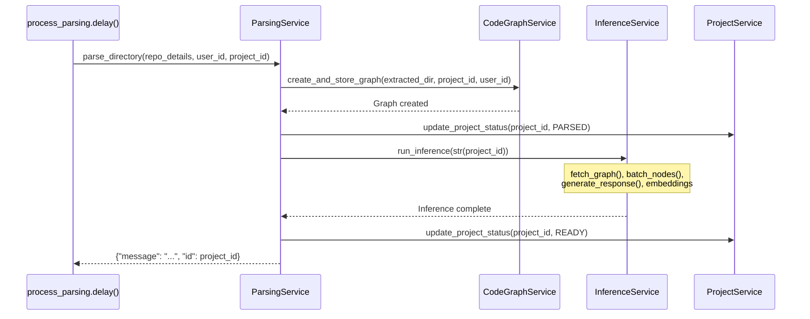

**Sources**: [app/modules/parsing/graph_construction/parsing_service.py:299-386](), [app/celery/tasks/parsing_tasks.py]()

---

## Error Handling and Resilience

### Retry Hierarchy

**@robust_llm_call Retry Logic**

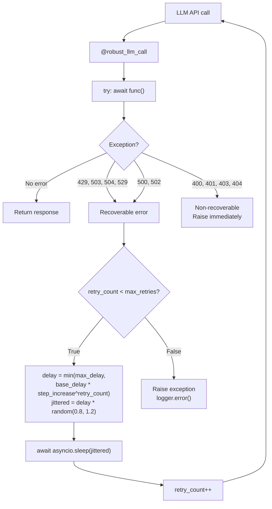

**Sources**: [app/modules/intelligence/provider/provider_service.py:116-259]()

### Batch-Level Error Recovery

`process_batch()` [line 819-880]() handles batch failures:

1. **Logs error** with `project_id` and batch index
2. **Returns empty `DocstringResponse`** for failed batch
3. **Continues with remaining batches** (partial success)
4. **Project status becomes READY** (with partial docstrings)

This prevents infrastructure failures from blocking parsing completely.

**Sources**: [app/modules/parsing/knowledge_graph/inference_service.py:819-880]()

---

## Summary

The inference and docstring generation system transforms raw code graphs into semantically-rich knowledge bases through:

1. **Intelligent batching** with cache-first optimization (40-60% cache hit rates)
2. **Structured LLM calls** via instructor/Pydantic for consistent output
3. **Robust retry logic** with exponential backoff for transient failures
4. **Node splitting** to handle large code files exceeding token limits
5. **Vector embeddings** for semantic search (384-dim SentenceTransformer)
6. **Search index creation** for multi-modal code discovery

This infrastructure enables downstream agents (see [2.3](#2.3) and [5.2](#5.2)) to query the knowledge graph with natural language and receive contextually-aware code recommendations.

**Key files**:
- [app/modules/parsing/knowledge_graph/inference_service.py:45-817]()
- [app/modules/intelligence/provider/provider_service.py:480-1001]()
- [app/modules/parsing/services/inference_cache_service.py]()
- [app/modules/parsing/utils/content_hash.py]()
- [app/modules/parsing/knowledge_graph/inference_schema.py]()