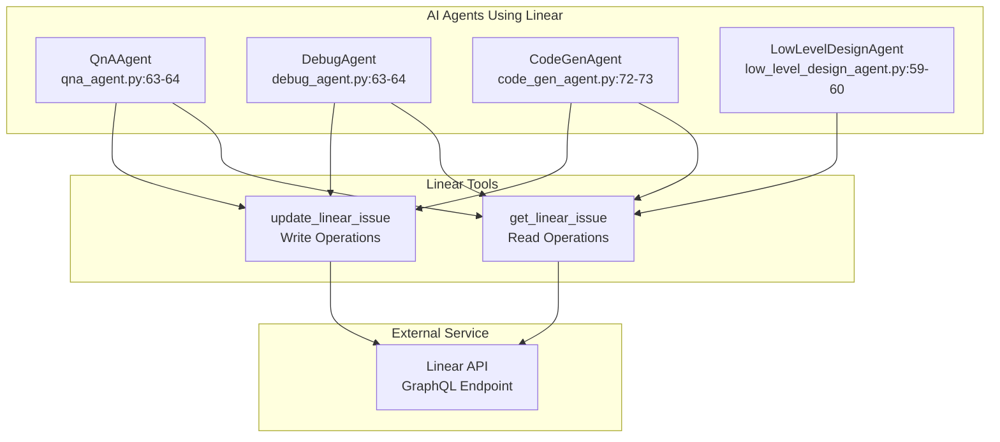
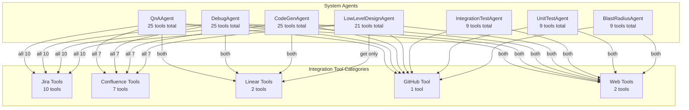
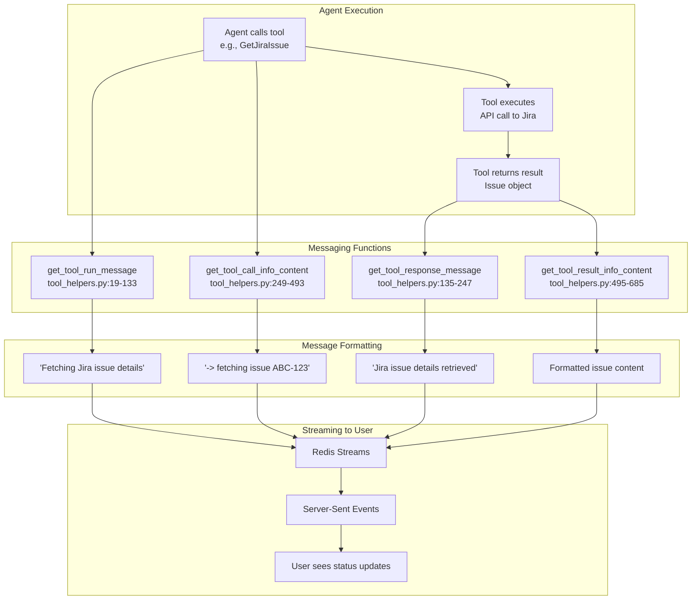

5.6-Integration Tools

# Page: Integration Tools

# Integration Tools

<details>
<summary>Relevant source files</summary>

The following files were used as context for generating this wiki page:

- [app/modules/intelligence/agents/agents_service.py](app/modules/intelligence/agents/agents_service.py)
- [app/modules/intelligence/agents/chat_agents/auto_router_agent.py](app/modules/intelligence/agents/chat_agents/auto_router_agent.py)
- [app/modules/intelligence/agents/chat_agents/system_agents/general_purpose_agent.py](app/modules/intelligence/agents/chat_agents/system_agents/general_purpose_agent.py)

</details>


This document describes the integration tools that enable Potpie's AI agents to interact with external project management and documentation systems. These tools provide read and write capabilities for Jira, Confluence, Linear, GitHub, and web resources.

For information about code-specific tools (knowledge graph queries, code retrieval, file operations), see [Code Analysis Tools](#5.3). For tool registration and management, see [Tool Service and Management](#5.1). For tool messaging and user feedback, see [Tool Helpers and Messaging](#5.5).

## Overview

Integration tools extend AI agents beyond code analysis by providing access to external services used in software development workflows. The system includes **23 integration tools** organized into five categories:

| Category | Tool Count | Purpose | Key Operations |
|----------|------------|---------|----------------|
| **Jira** | 10 | Issue tracking and project management | Create, update, search, transition, link issues |
| **Confluence** | 7 | Documentation and knowledge management | Create, update, search pages and spaces |
| **Linear** | 2 | Issue tracking | Get and update issues |
| **GitHub** | 1 | Pull requests and issues | Fetch PR/issue content from GitHub repositories |
| **Web** | 2 | External information retrieval | Web search and webpage content extraction |

These tools enable agents to answer questions about project management context, create issues from bugs, update documentation, and access external resources during analysis.

**Tool Diagram: Integration Tools Architecture**

```mermaid
graph TB
    subgraph "AI Agents"
        QnAAgent["QnAAgent"]
        DebugAgent["DebugAgent"]
        CodeGenAgent["CodeGenAgent"]
        LLDAgent["LowLevelDesignAgent"]
        IntTestAgent["IntegrationTestAgent"]
        UnitTestAgent["UnitTestAgent"]
        BlastRadiusAgent["BlastRadiusAgent"]
    end
    
    subgraph "ToolService Registry"
        ToolService["ToolService<br/>tool_service.py"]
        GetTools["get_tools(tool_names)"]
    end
    
    subgraph "Integration Tools"
        subgraph "Jira Tools - 10 tools"
            GetJiraIssue["GetJiraIssue"]
            SearchJiraIssues["SearchJiraIssues"]
            CreateJiraIssue["CreateJiraIssue"]
            UpdateJiraIssue["UpdateJiraIssue"]
            AddJiraComment["AddJiraComment"]
            TransitionJiraIssue["TransitionJiraIssue"]
            LinkJiraIssues["LinkJiraIssues"]
            GetJiraProjects["GetJiraProjects"]
            GetJiraProjectDetails["GetJiraProjectDetails"]
            GetJiraProjectUsers["GetJiraProjectUsers"]
        end
        
        subgraph "Confluence Tools - 7 tools"
            GetConfluenceSpaces["GetConfluenceSpaces"]
            GetConfluencePage["GetConfluencePage"]
            SearchConfluencePages["SearchConfluencePages"]
            GetConfluenceSpacePages["GetConfluenceSpacePages"]
            CreateConfluencePage["CreateConfluencePage"]
            UpdateConfluencePage["UpdateConfluencePage"]
            AddConfluenceComment["AddConfluenceComment"]
        end
        
        subgraph "Linear Tools - 2 tools"
            GetLinearIssue["get_linear_issue"]
            UpdateLinearIssue["update_linear_issue"]
        end
        
        subgraph "GitHub Tool"
            GitHubTool["github_tool<br/>GitHubContentFetcher"]
        end
        
        subgraph "Web Tools - 2 tools"
            WebSearchTool["WebSearchTool"]
            WebpageExtractor["WebpageContentExtractor"]
        end
    end
    
    subgraph "External Services"
        JiraAPI["Jira API<br/>REST API"]
        ConfluenceAPI["Confluence API<br/>REST API"]
        LinearAPI["Linear API<br/>GraphQL"]
        GitHubAPI["GitHub API<br/>REST API"]
        WebSearch["Search Engines"]
    end
    
    subgraph "Tool Messaging"
        ToolHelpers["tool_helpers.py"]
        GetToolRunMsg["get_tool_run_message()"]
        GetToolResponseMsg["get_tool_response_message()"]
        GetToolCallInfo["get_tool_call_info_content()"]
        GetToolResultInfo["get_tool_result_info_content()"]
    end
    
    QnAAgent --> GetTools
    DebugAgent --> GetTools
    CodeGenAgent --> GetTools
    LLDAgent --> GetTools
    IntTestAgent --> GetTools
    UnitTestAgent --> GetTools
    BlastRadiusAgent --> GetTools
    
    GetTools --> ToolService
    
    ToolService --> GetJiraIssue
    ToolService --> SearchJiraIssues
    ToolService --> CreateJiraIssue
    ToolService --> UpdateJiraIssue
    ToolService --> AddJiraComment
    ToolService --> TransitionJiraIssue
    ToolService --> LinkJiraIssues
    ToolService --> GetJiraProjects
    ToolService --> GetJiraProjectDetails
    ToolService --> GetJiraProjectUsers
    
    ToolService --> GetConfluenceSpaces
    ToolService --> GetConfluencePage
    ToolService --> SearchConfluencePages
    ToolService --> GetConfluenceSpacePages
    ToolService --> CreateConfluencePage
    ToolService --> UpdateConfluencePage
    ToolService --> AddConfluenceComment
    
    ToolService --> GetLinearIssue
    ToolService --> UpdateLinearIssue
    
    ToolService --> GitHubTool
    
    ToolService --> WebSearchTool
    ToolService --> WebpageExtractor
    
    GetJiraIssue --> JiraAPI
    SearchJiraIssues --> JiraAPI
    CreateJiraIssue --> JiraAPI
    UpdateJiraIssue --> JiraAPI
    AddJiraComment --> JiraAPI
    TransitionJiraIssue --> JiraAPI
    LinkJiraIssues --> JiraAPI
    GetJiraProjects --> JiraAPI
    GetJiraProjectDetails --> JiraAPI
    GetJiraProjectUsers --> JiraAPI
    
    GetConfluenceSpaces --> ConfluenceAPI
    GetConfluencePage --> ConfluenceAPI
    SearchConfluencePages --> ConfluenceAPI
    GetConfluenceSpacePages --> ConfluenceAPI
    CreateConfluencePage --> ConfluenceAPI
    UpdateConfluencePage --> ConfluenceAPI
    AddConfluenceComment --> ConfluenceAPI
    
    GetLinearIssue --> LinearAPI
    UpdateLinearIssue --> LinearAPI
    
    GitHubTool --> GitHubAPI
    
    WebSearchTool --> WebSearch
    WebpageExtractor --> WebSearch
    
    GetJiraIssue -.messaging.-> ToolHelpers
    CreateJiraIssue -.messaging.-> ToolHelpers
    GetConfluencePage -.messaging.-> ToolHelpers
    GitHubTool -.messaging.-> ToolHelpers
    WebSearchTool -.messaging.-> ToolHelpers
    
    ToolHelpers --> GetToolRunMsg
    ToolHelpers --> GetToolResponseMsg
    ToolHelpers --> GetToolCallInfo
    ToolHelpers --> GetToolResultInfo
```



Sources: [app/modules/intelligence/agents/chat_agents/tool_helpers.py:1-781](), [app/modules/intelligence/agents/chat_agents/system_agents/qna_agent.py:52-86](), [app/modules/intelligence/agents/chat_agents/system_agents/debug_agent.py:52-86](), [app/modules/intelligence/agents/chat_agents/system_agents/code_gen_agent.py:61-95]()

## Jira Integration Tools

Potpie provides **10 Jira tools** that enable comprehensive issue tracking and project management operations. These tools allow agents to read issue details, create and update issues, manage workflows, and access project metadata.

### Jira Tool Catalog

| Tool Name | Purpose | Key Parameters | Return Type |
|-----------|---------|----------------|-------------|
| `GetJiraIssue` | Fetch single issue details | `issue_key` | Issue object with fields, comments, attachments |
| `SearchJiraIssues` | Search issues using JQL | `jql`, `max_results`, `fields` | List of matching issues |
| `CreateJiraIssue` | Create new issue | `project_key`, `summary`, `issue_type`, `description`, `priority`, `assignee` | Created issue object |
| `UpdateJiraIssue` | Update issue fields | `issue_key`, `fields` (dict) | Updated issue object |
| `AddJiraComment` | Add comment to issue | `issue_key`, `comment_body` | Comment object |
| `TransitionJiraIssue` | Change issue status | `issue_key`, `transition` | Success status |
| `LinkJiraIssues` | Link two issues | `issue_key`, `linked_issue_key`, `link_type` | Link object |
| `GetJiraProjects` | List accessible projects | None | List of project objects |
| `GetJiraProjectDetails` | Fetch project details | `project_key` | Project object with metadata |
| `GetJiraProjectUsers` | Search project users | `project_key`, `query` | List of user objects |

### Tool Messaging Examples

The tool helper system provides user-friendly messages for Jira operations at different stages:

**Tool Execution Messages** [app/modules/intelligence/agents/chat_agents/tool_helpers.py:97-117]():
- `GetJiraIssue`: "Fetching Jira issue details"
- `SearchJiraIssues`: "Searching Jira issues"
- `CreateJiraIssue`: "Creating new Jira issue"
- `UpdateJiraIssue`: "Updating Jira issue"
- `AddJiraComment`: "Adding comment to Jira issue"
- `TransitionJiraIssue`: "Changing Jira issue status"
- `LinkJiraIssues`: "Linking Jira issues"
- `GetJiraProjects`: "Fetching Jira projects"
- `GetJiraProjectDetails`: "Fetching Jira project details"
- `GetJiraProjectUsers`: "Fetching Jira project users"

**Tool Completion Messages** [app/modules/intelligence/agents/chat_agents/tool_helpers.py:211-230]():
- `GetJiraIssue`: "Jira issue details retrieved"
- `SearchJiraIssues`: "Jira issues search completed"
- `CreateJiraIssue`: "Jira issue created successfully"
- `UpdateJiraIssue`: "Jira issue updated successfully"
- `AddJiraComment`: "Comment added to Jira issue"
- `TransitionJiraIssue`: "Jira issue status changed"
- `LinkJiraIssues`: "Jira issues linked successfully"
- `GetJiraProjects`: "Jira projects retrieved"
- `GetJiraProjectDetails`: "Jira project details retrieved"
- `GetJiraProjectUsers`: "Jira project users retrieved"

**Detailed Tool Call Information** [app/modules/intelligence/agents/chat_agents/tool_helpers.py:393-446]():

The system provides contextual information about tool arguments to help users understand what the agent is doing:

```python
# GetJiraIssue
"-> fetching issue {issue_key}"

# SearchJiraIssues
"-> JQL: {jql}"

# CreateJiraIssue
"-> creating issue in {project_key}: {summary}"

# UpdateJiraIssue
"-> updating issue {issue_key}"

# TransitionJiraIssue
"-> moving {issue_key} to '{transition}'"

# LinkJiraIssues
"-> linking {issue_key} {link_type} {linked_issue_key}"
```

### Agent Usage Patterns

**System agents that use Jira tools**:

1. **QnAAgent** [app/modules/intelligence/agents/chat_agents/system_agents/qna_agent.py:52-86]() - Uses all 10 Jira tools to answer questions about project status, issue details, and create issues from bugs
2. **DebugAgent** [app/modules/intelligence/agents/chat_agents/system_agents/debug_agent.py:52-86]() - Uses Jira tools to link debugging findings to issues
3. **CodeGenAgent** [app/modules/intelligence/agents/chat_agents/system_agents/code_gen_agent.py:61-95]() - Uses Jira tools to create issues for code changes and link to existing tickets
4. **LowLevelDesignAgent** [app/modules/intelligence/agents/chat_agents/system_agents/low_level_design_agent.py:48-81]() - Uses Jira tools to track design decisions and create implementation tasks

Sources: [app/modules/intelligence/agents/chat_agents/tool_helpers.py:97-446](), [app/modules/intelligence/agents/chat_agents/system_agents/qna_agent.py:52-86](), [app/modules/intelligence/agents/chat_agents/system_agents/debug_agent.py:52-86]()

## Confluence Integration Tools

Potpie provides **7 Confluence tools** for documentation management and knowledge base operations. These tools enable agents to read existing documentation, create new pages, and manage comments.

### Confluence Tool Catalog

| Tool Name | Purpose | Key Parameters | Return Type |
|-----------|---------|----------------|-------------|
| `GetConfluenceSpaces` | List accessible spaces | `space_type` (personal/global/all), `limit` | List of space objects |
| `GetConfluencePage` | Fetch page content | `page_id`, `expand` | Page object with content, metadata |
| `SearchConfluencePages` | Search pages using CQL | `cql`, `limit` | List of matching pages |
| `GetConfluenceSpacePages` | List pages in space | `space_id`, `status` (current/draft), `limit` | List of pages in space |
| `CreateConfluencePage` | Create new page | `space_id`, `title`, `body`, `parent_id` | Created page object |
| `UpdateConfluencePage` | Update page content | `page_id`, `title`, `body`, `version_number` | Updated page object |
| `AddConfluenceComment` | Add comment to page | `page_id`, `comment_body`, `parent_comment_id` | Comment object |

### Tool Messaging Examples

**Tool Execution Messages** [app/modules/intelligence/agents/chat_agents/tool_helpers.py:117-131]():
- `GetConfluenceSpaces`: "Fetching Confluence spaces"
- `GetConfluencePage`: "Retrieving Confluence page"
- `SearchConfluencePages`: "Searching Confluence pages"
- `GetConfluenceSpacePages`: "Fetching pages in Confluence space"
- `CreateConfluencePage`: "Creating new Confluence page"
- `UpdateConfluencePage`: "Updating Confluence page"
- `AddConfluenceComment`: "Adding comment to Confluence page"

**Tool Completion Messages** [app/modules/intelligence/agents/chat_agents/tool_helpers.py:231-244]():
- `GetConfluenceSpaces`: "Confluence spaces retrieved"
- `GetConfluencePage`: "Confluence page retrieved"
- `SearchConfluencePages`: "Confluence pages search completed"
- `GetConfluenceSpacePages`: "Confluence space pages retrieved"
- `CreateConfluencePage`: "Confluence page created successfully"
- `UpdateConfluencePage`: "Confluence page updated successfully"
- `AddConfluenceComment`: "Comment added to Confluence page"

**Detailed Tool Call Information** [app/modules/intelligence/agents/chat_agents/tool_helpers.py:447-490]():

```python
# GetConfluenceSpaces
"-> fetching {space_type} spaces (limit: {limit})"

# GetConfluencePage
"-> fetching page {page_id}"

# SearchConfluencePages
"-> CQL: {cql}"

# GetConfluenceSpacePages
"-> fetching pages in space {space_id} ({status} pages)"

# CreateConfluencePage
"-> creating page in space {space_id}: {title}"

# UpdateConfluencePage
"-> updating page {page_id} (version {version_number})"

# AddConfluenceComment
"-> adding {comment_type} to page {page_id}"  # comment_type is "reply" if parent_comment_id exists
```

### Agent Usage Patterns

**System agents that use Confluence tools**:

1. **QnAAgent** [app/modules/intelligence/agents/chat_agents/system_agents/qna_agent.py:75-81]() - Uses all 7 Confluence tools to answer documentation questions and create/update documentation
2. **DebugAgent** [app/modules/intelligence/agents/chat_agents/system_agents/debug_agent.py:75-81]() - Uses Confluence tools to document debugging processes and solutions
3. **CodeGenAgent** [app/modules/intelligence/agents/chat_agents/system_agents/code_gen_agent.py:84-90]() - Uses Confluence tools to create implementation documentation
4. **LowLevelDesignAgent** [app/modules/intelligence/agents/chat_agents/system_agents/low_level_design_agent.py:70-76]() - Uses Confluence tools to document design decisions and architecture

Sources: [app/modules/intelligence/agents/chat_agents/tool_helpers.py:117-490](), [app/modules/intelligence/agents/chat_agents/system_agents/qna_agent.py:75-81](), [app/modules/intelligence/agents/chat_agents/system_agents/code_gen_agent.py:84-90]()

## Linear Integration Tools

Potpie provides **2 Linear tools** for issue tracking in Linear workspaces. These tools support basic read and update operations for Linear issues.

### Linear Tool Catalog

| Tool Name | Purpose | Key Parameters | Return Type |
|-----------|---------|----------------|-------------|
| `get_linear_issue` | Fetch Linear issue details | `issue_id` or `issue_key` | Issue object with details |
| `update_linear_issue` | Update Linear issue | `issue_id`, `fields` (dict) | Updated issue object |

### Agent Usage Patterns

**System agents that use Linear tools**:

1. **QnAAgent** [app/modules/intelligence/agents/chat_agents/system_agents/qna_agent.py:63-64]() - Uses both Linear tools to answer questions about Linear issues
2. **DebugAgent** [app/modules/intelligence/agents/chat_agents/system_agents/debug_agent.py:63-64]() - Uses Linear tools to track debugging progress
3. **CodeGenAgent** [app/modules/intelligence/agents/chat_agents/system_agents/code_gen_agent.py:72-73]() - Uses Linear tools to link code generation to Linear issues
4. **LowLevelDesignAgent** [app/modules/intelligence/agents/chat_agents/system_agents/low_level_design_agent.py:59-60]() - Uses Linear tools to track design tasks

**Tool Diagram: Linear Tool Integration**



Sources: [app/modules/intelligence/agents/chat_agents/system_agents/qna_agent.py:63-64](), [app/modules/intelligence/agents/chat_agents/system_agents/debug_agent.py:63-64](), [app/modules/intelligence/agents/chat_agents/system_agents/code_gen_agent.py:72-73](), [app/modules/intelligence/agents/chat_agents/system_agents/low_level_design_agent.py:59-60]()

## GitHub Integration Tools

Potpie provides **1 GitHub tool** (`github_tool` / `GitHubContentFetcher`) that fetches content from GitHub pull requests and issues. This tool enables agents to analyze external code changes and issue discussions.

### GitHub Tool Specification

**Tool Name**: `github_tool` (also referenced as `GitHubContentFetcher`)

**Purpose**: Fetch pull request or issue content from GitHub repositories

**Key Parameters**:
- `repo_name`: Repository name (e.g., "owner/repo")
- `issue_number`: PR or issue number
- `is_pull_request`: Boolean flag to distinguish between PR and issue

**Return Type**: Dictionary containing:
- `content`: Object with `title`, `state`, `body`, `comments`, `diff` (for PRs)
- Formatted markdown for display

### Tool Messaging

**Tool Execution Message** [app/modules/intelligence/agents/chat_agents/tool_helpers.py:39-40]():
```python
"Fetching content from github"
```

**Tool Completion Message** [app/modules/intelligence/agents/chat_agents/tool_helpers.py:154-155]():
```python
"File contents fetched from github"
```

**Detailed Call Information** [app/modules/intelligence/agents/chat_agents/tool_helpers.py:276-282]():
```python
# Example: "-> fetching PR #123 from github/potpie-ai/potpie"
"-> fetching {'PR' if is_pr else 'Issue'} #{issue_number} from github/{repo_name}"
```

**Result Formatting** [app/modules/intelligence/agents/chat_agents/tool_helpers.py:551-567]():
```python
# Returns formatted content with title, status, and body (truncated to 600 chars)
"""
# ***{title}***

## status: {status}
description:
{body}
"""
```

### Agent Usage Patterns

**All 7 system agents use the GitHub tool**:

1. **QnAAgent** [app/modules/intelligence/agents/chat_agents/system_agents/qna_agent.py:62]() - Fetches PR/issue context for questions
2. **DebugAgent** [app/modules/intelligence/agents/chat_agents/system_agents/debug_agent.py:62]() - Analyzes PR changes for debugging
3. **CodeGenAgent** [app/modules/intelligence/agents/chat_agents/system_agents/code_gen_agent.py:71]() - Reviews PR patterns for code generation
4. **LowLevelDesignAgent** [app/modules/intelligence/agents/chat_agents/system_agents/low_level_design_agent.py:57]() - Analyzes PR structure for design decisions
5. **IntegrationTestAgent** [app/modules/intelligence/agents/chat_agents/system_agents/integration_test_agent.py:52]() - Reviews PR test patterns
6. **UnitTestAgent** [app/modules/intelligence/agents/chat_agents/system_agents/unit_test_agent.py:44]() - Analyzes PR test coverage
7. **BlastRadiusAgent** [app/modules/intelligence/agents/chat_agents/system_agents/blast_radius_agent.py:45]() - Analyzes PR change impact

Sources: [app/modules/intelligence/agents/chat_agents/tool_helpers.py:39-40](), [app/modules/intelligence/agents/chat_agents/tool_helpers.py:154-155](), [app/modules/intelligence/agents/chat_agents/tool_helpers.py:276-282](), [app/modules/intelligence/agents/chat_agents/tool_helpers.py:551-567](), [app/modules/intelligence/agents/chat_agents/system_agents/qna_agent.py:62]()

## Web Tools

Potpie provides **2 web tools** that enable agents to access external information beyond the codebase and project management systems.

### Web Tool Catalog

| Tool Name | Purpose | Key Parameters | Return Type |
|-----------|---------|----------------|-------------|
| `WebSearchTool` | Search the web | `query` | Search results with titles, snippets, URLs |
| `WebpageContentExtractor` | Extract webpage content | `url` | Extracted text content from webpage |

### Tool Messaging

**WebSearchTool Messages** [app/modules/intelligence/agents/chat_agents/tool_helpers.py:43-44]():
- Execution: "Searching the web"
- Completion: "Web search successful"
- Call Info: `"-> searching the web for {query}"`
- Result Info: Truncated content (first 600 chars)

**WebpageContentExtractor Messages** [app/modules/intelligence/agents/chat_agents/tool_helpers.py:38-39]():
- Execution: "Querying information from the web"
- Completion: "Information retrieved from web"
- Call Info: `"fetching -> {url}"`
- Result Info: Truncated content (first 600 chars)

### Agent Usage Patterns

**System agents that use web tools**:

All 7 system agents use both web tools:
1. **QnAAgent** [app/modules/intelligence/agents/chat_agents/system_agents/qna_agent.py:60-61]()
2. **DebugAgent** [app/modules/intelligence/agents/chat_agents/system_agents/debug_agent.py:60-61]()
3. **CodeGenAgent** [app/modules/intelligence/agents/chat_agents/system_agents/code_gen_agent.py:69-70]()
4. **LowLevelDesignAgent** [app/modules/intelligence/agents/chat_agents/system_agents/low_level_design_agent.py:55-56]()
5. **IntegrationTestAgent** [app/modules/intelligence/agents/chat_agents/system_agents/integration_test_agent.py:50-51]()
6. **UnitTestAgent** [app/modules/intelligence/agents/chat_agents/system_agents/unit_test_agent.py:42-43]()
7. **BlastRadiusAgent** [app/modules/intelligence/agents/chat_agents/system_agents/blast_radius_agent.py:44-45]()

**Common use cases**:
- Understanding third-party libraries and frameworks
- Researching API documentation
- Finding best practices and patterns
- Accessing external documentation referenced in code

Sources: [app/modules/intelligence/agents/chat_agents/tool_helpers.py:38-44](), [app/modules/intelligence/agents/chat_agents/tool_helpers.py:274-275](), [app/modules/intelligence/agents/chat_agents/tool_helpers.py:288-289](), [app/modules/intelligence/agents/chat_agents/system_agents/qna_agent.py:60-61]()

## Tool Usage Across Agents

Different system agents leverage integration tools based on their specialized roles. The following diagram maps which agents use which integration tool categories:

**Tool Diagram: Agent-Tool Assignment Matrix**



### Agent Tool Assignment Summary

| Agent | Jira | Confluence | Linear | GitHub | Web | Total Integration Tools |
|-------|------|------------|--------|--------|-----|------------------------|
| **QnAAgent** | All 10 | All 7 | Both 2 | ✓ | Both 2 | 22 |
| **DebugAgent** | All 10 | All 7 | Both 2 | ✓ | Both 2 | 22 |
| **CodeGenAgent** | All 10 | All 7 | Both 2 | ✓ | Both 2 | 22 |
| **LowLevelDesignAgent** | All 10 | All 7 | Get only | ✓ | Both 2 | 21 |
| **IntegrationTestAgent** | - | - | - | ✓ | Both 2 | 3 |
| **UnitTestAgent** | - | - | - | ✓ | Both 2 | 3 |
| **BlastRadiusAgent** | - | - | - | ✓ | Both 2 | 3 |

**Pattern Analysis**:
- **Comprehensive agents** (QnA, Debug, CodeGen, LLD) include all integration tools to provide full context
- **Focused agents** (IntegrationTest, UnitTest, BlastRadius) use only web and GitHub tools for external research
- **GitHub tool** is universal across all 7 agents
- **Web tools** are universal across all 7 agents
- **Project management tools** (Jira, Confluence, Linear) are used by 4 comprehensive agents

Sources: [app/modules/intelligence/agents/chat_agents/system_agents/qna_agent.py:52-86](), [app/modules/intelligence/agents/chat_agents/system_agents/debug_agent.py:52-86](), [app/modules/intelligence/agents/chat_agents/system_agents/code_gen_agent.py:61-95](), [app/modules/intelligence/agents/chat_agents/system_agents/low_level_design_agent.py:48-81](), [app/modules/intelligence/agents/chat_agents/system_agents/integration_test_agent.py:46-56](), [app/modules/intelligence/agents/chat_agents/system_agents/unit_test_agent.py:38-49](), [app/modules/intelligence/agents/chat_agents/system_agents/blast_radius_agent.py:37-50]()

## Tool Messaging System

The `tool_helpers` module provides a consistent messaging interface for all integration tools. This system creates user-friendly status updates that are displayed during agent execution via streaming responses.

### Messaging Functions

The tool helper system implements four primary functions in [app/modules/intelligence/agents/chat_agents/tool_helpers.py]():

| Function | Purpose | Return Value | Lines |
|----------|---------|--------------|-------|
| `get_tool_run_message()` | Short message when tool starts | Simple present tense action (e.g., "Fetching Jira issue details") | 19-133 |
| `get_tool_response_message()` | Short message when tool completes | Past tense confirmation (e.g., "Jira issue details retrieved") | 135-247 |
| `get_tool_call_info_content()` | Detailed info about tool arguments | Formatted string with parameter details | 249-493 |
| `get_tool_result_info_content()` | Formatted tool output | Truncated, formatted content for display | 495-685 |

### Message Flow Architecture

**Tool Diagram: Tool Messaging Flow**



### Message Examples by Stage

**Stage 1: Tool Execution Start**

When a tool begins execution, `get_tool_run_message()` returns a short present-tense action [app/modules/intelligence/agents/chat_agents/tool_helpers.py:97-131]():

```python
case "GetJiraIssue":
    return "Fetching Jira issue details"
case "CreateJiraIssue":
    return "Creating new Jira issue"
case "SearchConfluencePages":
    return "Searching Confluence pages"
case "WebSearchTool":
    return "Searching the web"
```

**Stage 2: Detailed Call Information**

`get_tool_call_info_content()` provides parameter-specific details [app/modules/intelligence/agents/chat_agents/tool_helpers.py:393-490]():

```python
# Jira examples
case "GetJiraIssue":
    return f"-> fetching issue {issue_key}"
case "SearchJiraIssues":
    return f"-> JQL: {jql}"
case "CreateJiraIssue":
    return f"-> creating issue in {project_key}: {summary}"
case "TransitionJiraIssue":
    return f"-> moving {issue_key} to '{transition}'"

# Confluence examples  
case "GetConfluencePage":
    return f"-> fetching page {page_id}"
case "CreateConfluencePage":
    return f"-> creating page in space {space_id}: {title}"

# Web examples
case "WebSearchTool":
    return f"-> searching the web for {query}"
case "WebpageContentExtractor":
    return f"fetching -> {url}"
```

**Stage 3: Tool Completion**

`get_tool_response_message()` confirms successful execution [app/modules/intelligence/agents/chat_agents/tool_helpers.py:211-244]():

```python
case "GetJiraIssue":
    return "Jira issue details retrieved"
case "CreateJiraIssue":
    return "Jira issue created successfully"
case "SearchConfluencePages":
    return "Confluence pages search completed"
case "WebSearchTool":
    return "Web search successful"
```

**Stage 4: Formatted Result**

`get_tool_result_info_content()` formats tool output for display. Most integration tools don't have custom formatting (return empty string), relying on the tool's natural output format. However, GitHub and Web tools have special formatting:

**GitHubContentFetcher formatting** [app/modules/intelligence/agents/chat_agents/tool_helpers.py:551-567]():
```python
# Formats PR/issue content with markdown
f"""
# ***{title}***

## status: {status}
description:
{body}
"""
# Truncated to 600 characters
```

**WebpageContentExtractor formatting** [app/modules/intelligence/agents/chat_agents/tool_helpers.py:546-550]():
```python
# Returns truncated content
res[:min(len(res), 600)] + " ..."
```

### Default Fallback Messages

For tools without specific messages, the system provides defaults [app/modules/intelligence/agents/chat_agents/tool_helpers.py:131-133]():

```python
case _:
    return "Querying data"  # get_tool_run_message default
    
case _:
    return "Data queried successfully"  # get_tool_response_message default
    
case _:
    return ""  # get_tool_call_info_content default (most integration tools)
    
case _:
    return ""  # get_tool_result_info_content default
```

Sources: [app/modules/intelligence/agents/chat_agents/tool_helpers.py:19-685]()

## Integration Tool Authentication

Integration tools require authentication credentials stored in user provider links. The authentication flow follows the pattern established in [Authentication and User Management](#7):

### Credential Storage

Integration tool credentials are stored in the `UserAuthProvider` table with encrypted access tokens:
- **Jira**: OAuth access token or API token
- **Confluence**: OAuth access token or API token
- **Linear**: API key
- **GitHub**: Personal access token (PAT) or OAuth token

### Authentication Flow

1. User authenticates with provider via OAuth or API key
2. Credentials stored in `UserAuthProvider.access_token` (encrypted)
3. Tool retrieves credentials from `UserAuthProvider` table
4. Tool decrypts token and authenticates API calls
5. Tool makes authenticated requests to external service

For detailed information about token encryption and management, see [Token Management and Security](#7.4). For OAuth provider linking, see [OAuth and Provider Linking](#7.3).

Sources: Based on architectural patterns from authentication diagrams and [Authentication and User Management](#7) section structure.