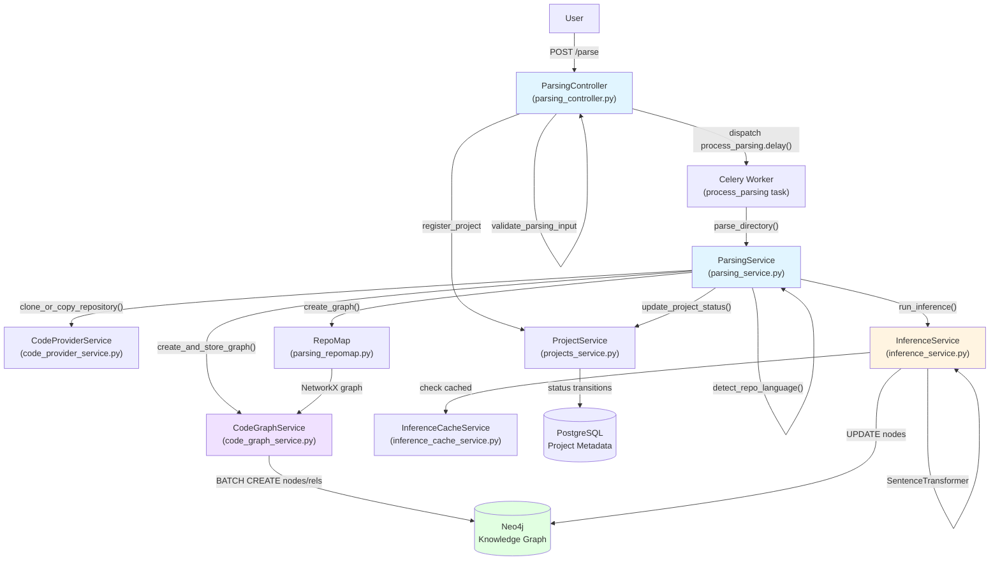
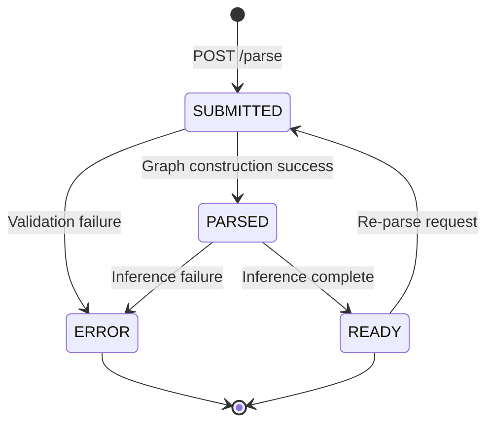
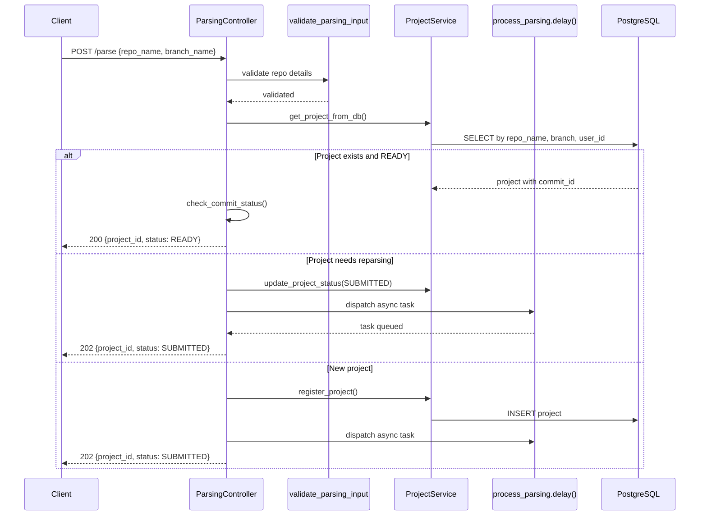
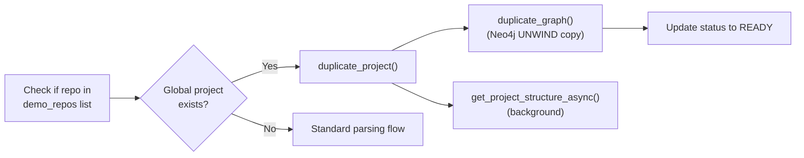
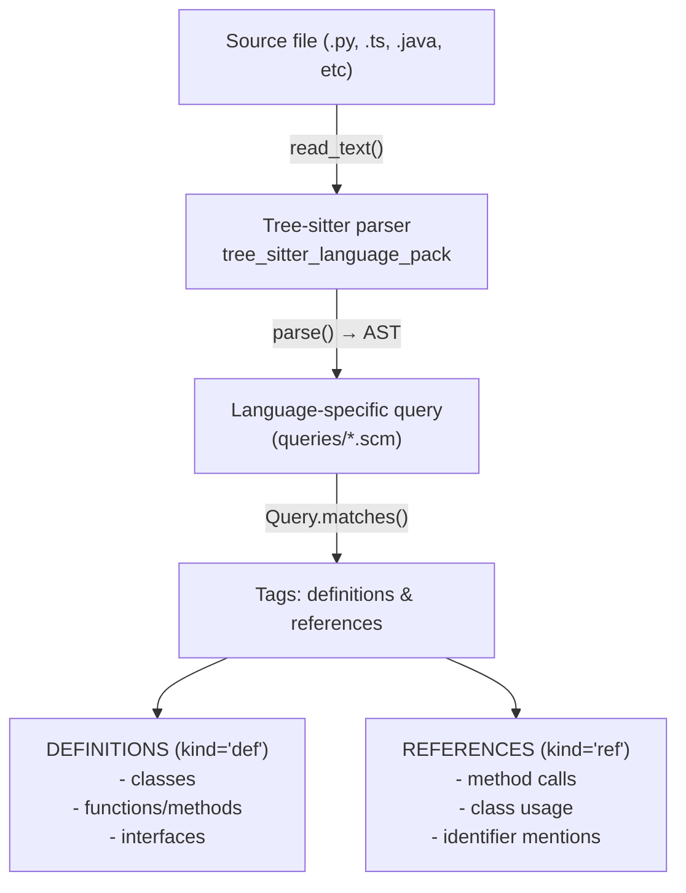
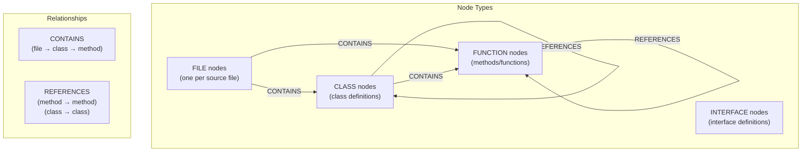
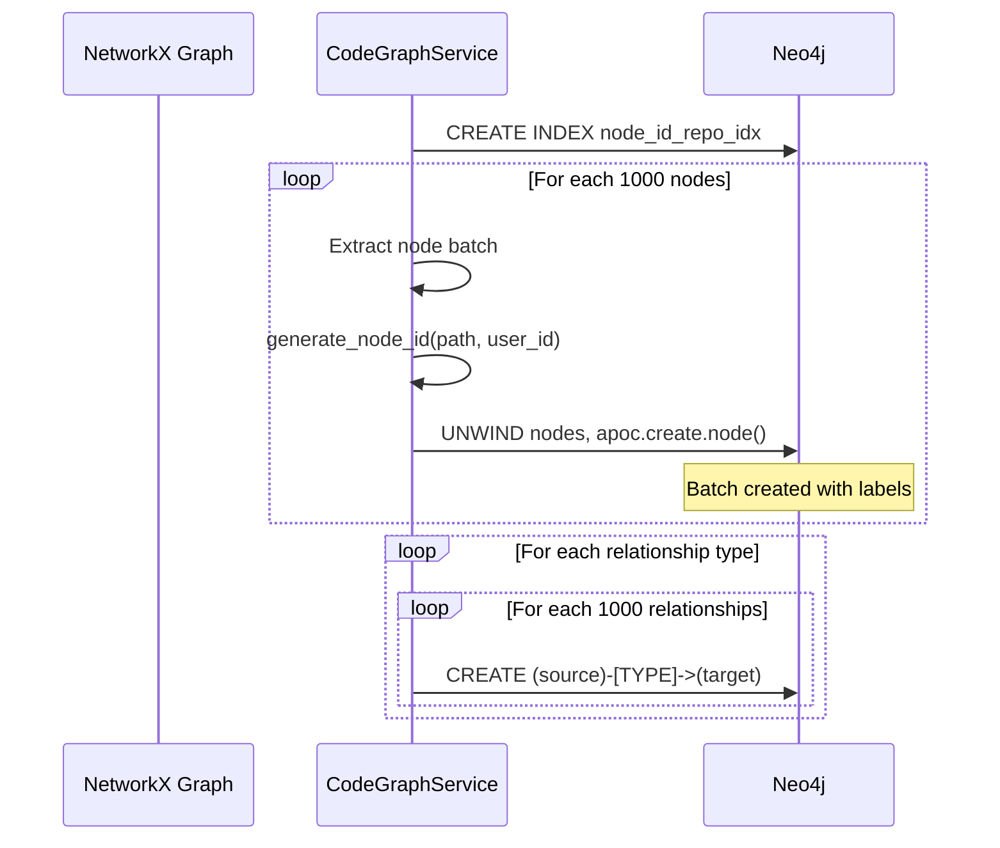
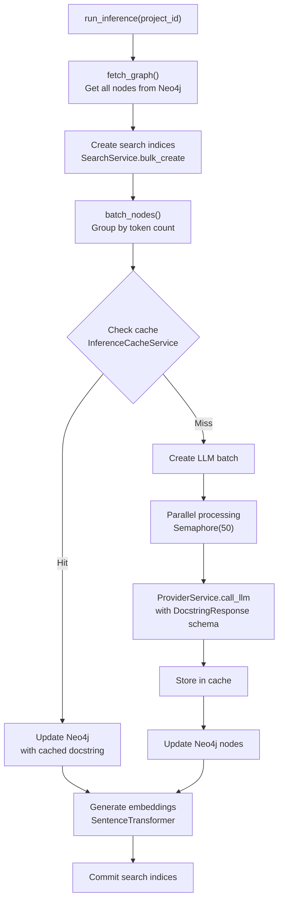
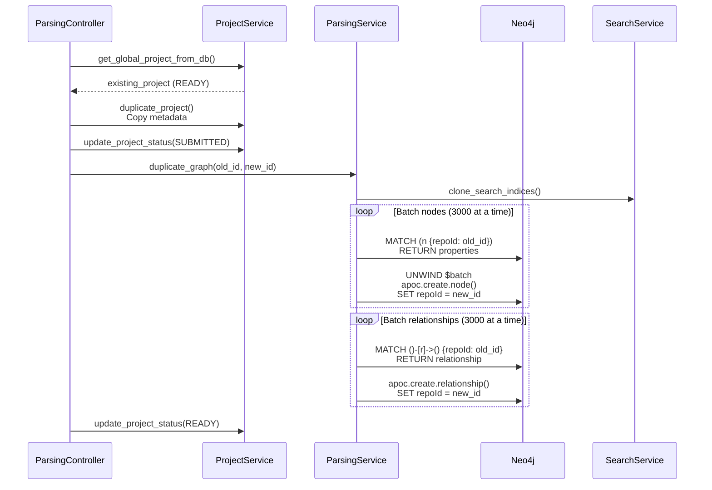
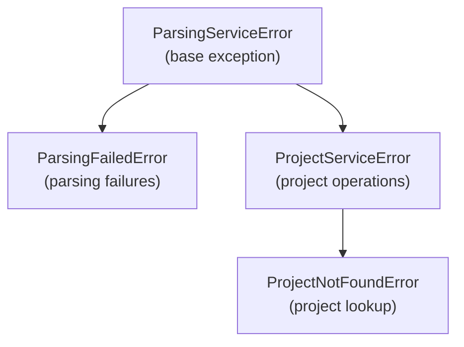

4-Knowledge Graph Construction

# Page: Knowledge Graph Construction

# Knowledge Graph Construction

<details>
<summary>Relevant source files</summary>

The following files were used as context for generating this wiki page:

- [app/modules/parsing/graph_construction/code_graph_service.py](app/modules/parsing/graph_construction/code_graph_service.py)
- [app/modules/parsing/graph_construction/parsing_helper.py](app/modules/parsing/graph_construction/parsing_helper.py)
- [app/modules/parsing/graph_construction/parsing_service.py](app/modules/parsing/graph_construction/parsing_service.py)
- [app/modules/parsing/knowledge_graph/inference_service.py](app/modules/parsing/knowledge_graph/inference_service.py)
- [app/modules/projects/projects_service.py](app/modules/projects/projects_service.py)

</details>


## Purpose and Scope

The Knowledge Graph Construction system transforms source code repositories into queryable Neo4j knowledge graphs. This process extracts code structure (files, classes, functions, interfaces), relationships (CONTAINS, REFERENCES), and AI-generated documentation (docstrings, embeddings) to enable semantic code search and agent-based code analysis.

This page covers the end-to-end parsing pipeline from repository submission to graph availability. For information about querying the constructed graphs, see [Tool System](#5). For agent orchestration that uses these graphs, see [Agent System Architecture](#2.2).

---

## System Architecture

The knowledge graph construction pipeline consists of five major phases: submission, cloning, parsing, inference, and finalization. The system is designed for asynchronous processing with status tracking and supports both remote (GitHub/GitBucket) and local repositories.



**Sources:**
- [app/modules/parsing/graph_construction/parsing_controller.py:39-304]()
- [app/modules/parsing/graph_construction/parsing_service.py:33-477]()
- [app/modules/parsing/knowledge_graph/inference_service.py:45-1437]()

---

## Project Status Lifecycle

Projects transition through a defined status lifecycle stored in PostgreSQL. The `ProjectStatusEnum` defines the valid states:

| Status | Description | Database Update Location |
|--------|-------------|-------------------------|
| `SUBMITTED` | Parsing task queued in Celery | [parsing_controller.py:224-226]() |
| `CLONED` | Repository successfully cloned (optional) | Not explicitly used in current flow |
| `PARSED` | Graph constructed in Neo4j | [parsing_service.py:354-356]() |
| `READY` | Inference complete, graph queryable | [parsing_service.py:361-363]() |
| `ERROR` | Parsing failed | [parsing_service.py:243-245]() |



**Sources:**
- [app/modules/projects/projects_schema.py]() (ProjectStatusEnum definition)
- [app/modules/parsing/graph_construction/parsing_service.py:354-363]()

---

## Entry Point: ParsingController

The `ParsingController` class [parsing_controller.py:39]() exposes the `POST /parse` endpoint and manages three critical concerns: input validation, demo repository optimization, and Celery task dispatch.

### Request Flow



### Demo Repository Optimization

For popular repositories (hardcoded list at [parsing_controller.py:102-110]()), the system checks if a global parsed version exists. If found, it duplicates the Neo4j graph instead of re-parsing:



**Key Methods:**
- `parse_directory()` [parsing_controller.py:41-255]() - Main endpoint handler
- `handle_new_project()` [parsing_controller.py:257-304]() - Creates project and dispatches Celery task
- `fetch_parsing_status()` [parsing_controller.py:306-343]() - Status polling endpoint

**Sources:**
- [app/modules/parsing/graph_construction/parsing_controller.py:39-384]()
- [app/modules/projects/projects_service.py:88-175]()

---

## Repository Cloning and Preparation

The `ParseHelper` class [parsing_helper.py:34]() manages repository acquisition via the `clone_or_copy_repository()` method, which supports three modes:

### Repository Access Modes

| Mode | Detection | Handler | Authentication |
|------|-----------|---------|----------------|
| Local filesystem | `repo_path` provided | Direct path access | Not required |
| GitHub | `repo_name` without `repo_path` | Tarball download | GitHub App or PAT |
| GitBucket | `CODE_PROVIDER=gitbucket` | Tarball or git clone fallback | Token or Basic Auth |

### Tarball Download with Authentication

For remote repositories, the system downloads tarballs rather than performing full git clones for efficiency [parsing_helper.py:203-485]():

```python
# Priority: GitHub App auth > PAT pool > Environment token
tarball_url = repo.get_archive_link("tarball", branch)
headers = {"Authorization": f"token {auth.token}"}
response = requests.get(tarball_url, stream=True, headers=headers)
```

### Language Detection

After extraction, the `detect_repo_language()` method [parsing_helper.py:645-747]() scans file extensions to determine the primary language:

```python
lang_count = {"python": 0, "javascript": 0, "typescript": 0, ...}
# Scan all files, count by extension
predominant_language = max(lang_count, key=lang_count.get)
```

Supported languages include Python, JavaScript/TypeScript, Java, Go, Rust, C/C++/C#, Ruby, PHP, and others mapped to Tree-sitter parsers.

**Sources:**
- [app/modules/parsing/graph_construction/parsing_helper.py:63-747]()
- [app/modules/code_provider/code_provider_service.py]() (CodeProviderService)

---

## AST Parsing with Tree-sitter

The `RepoMap` class [parsing_repomap.py:29]() performs Abstract Syntax Tree (AST) parsing using Tree-sitter to extract code entities and relationships. This is the core of graph construction.

### Tag Extraction Process



### Tag Structure

Each tag is a `namedtuple` [parsing_repomap.py:26]():

```python
Tag = namedtuple("Tag", "rel_fname fname line end_line name kind type".split())
```

Example tags from Java code:
```python
# Class definition
Tag(rel_fname="src/Main.java", fname="/full/path/Main.java", 
    line=10, end_line=50, name="UserService", kind="def", type="class")

# Method call reference
Tag(rel_fname="src/Main.java", fname="/full/path/Main.java",
    line=25, end_line=25, name="findUser", kind="ref", type="method")
```

### NetworkX Graph Construction

The `create_graph()` method [parsing_repomap.py:611-736]() builds a `MultiDiGraph`:



**Node Naming Convention:**
- File: `relative/path/to/file.py`
- Class: `relative/path/to/file.py:ClassName`
- Method in class: `relative/path/to/file.py:ClassName.methodName`
- Top-level function: `relative/path/to/file.py:functionName`

**Sources:**
- [app/modules/parsing/graph_construction/parsing_repomap.py:29-839]()
- [app/modules/parsing/graph_construction/parsing_repomap.py:611-736]() (create_graph method)

---

## Neo4j Graph Persistence

The `CodeGraphService` class [code_graph_service.py:15]() transforms the NetworkX graph into Neo4j nodes and relationships with optimized batching.

### Batch Insert Strategy



### Node Creation with Labels

Each node is created with multiple labels [code_graph_service.py:64-109]():

```cypher
UNWIND $nodes AS node
CALL apoc.create.node(node.labels, node) YIELD node AS n
RETURN count(*) AS created_count
```

Node properties include:
- `repoId`: Project identifier (UUID)
- `node_id`: MD5 hash of `user_id:path` [code_graph_service.py:21-32]()
- `entityId`: User identifier
- `name`: Class/function name
- `file_path`: Relative file path
- `start_line`, `end_line`: Line number boundaries
- `type`: Node type (FILE, CLASS, FUNCTION, INTERFACE)
- `text`: Raw code text (populated later by RepoMap)

### Relationship Types

Relationships are created in type-specific batches [code_graph_service.py:122-159]():

| Type | Direction | Meaning |
|------|-----------|---------|
| `CONTAINS` | File → Class, Class → Method | Structural containment |
| `REFERENCES` | Method → Method | Function calls |
| `REFERENCES` | Class → Class | Class usage/imports |

### Performance Optimization

The system uses several optimizations:
1. **Composite indices** [code_graph_service.py:53-59]() on `(node_id, repoId)` for fast lookups
2. **Batch size of 1000** to balance memory and transaction overhead
3. **Type-specific relationship queries** to avoid dynamic relationship creation

**Sources:**
- [app/modules/parsing/graph_construction/code_graph_service.py:15-240]()
- [app/modules/parsing/graph_construction/code_graph_service.py:37-165]() (create_and_store_graph)

---

## AI-Driven Inference

The `InferenceService` [inference_service.py:45]() enhances the graph with AI-generated docstrings and vector embeddings. This phase transforms raw code into semantically queryable knowledge.

### Inference Pipeline Overview



### Cache-First Strategy

The inference cache [inference_cache_service.py]() stores docstrings by content hash to avoid regenerating identical code:

```python
# Generate hash from resolved code text
content_hash = generate_content_hash(updated_text, node_type)

# Check cache before LLM call
cached_inference = cache_service.get_cached_inference(content_hash)
if cached_inference:
    node["cached_inference"] = cached_inference
    continue  # Skip LLM batch
```

**Cache metrics logged** [inference_service.py:560-578]():
- Cache hits: Direct reuse of existing docstrings
- Cache misses: Requires LLM generation
- Uncacheable nodes: Dynamic or unresolved content

### Intelligent Batching

The `batch_nodes()` method [inference_service.py:352-587]() groups nodes by token count (default 16k tokens per batch) to maximize throughput while respecting LLM context limits:

```python
for node in nodes:
    node_tokens = num_tokens_from_string(node["text"])
    
    if node_tokens > max_tokens:
        # Split large nodes into chunks
        chunks = split_large_node(node["text"], max_tokens)
    
    if current_tokens + node_tokens > max_tokens:
        batches.append(current_batch)
        current_batch = []
```

### Structured LLM Output

Docstrings are generated using structured output schemas [inference_service.py:731-739]():

```python
result = await provider_service.call_llm_with_structured_output(
    messages=messages,
    output_schema=DocstringResponse,
    config_type="inference"
)
```

The `DocstringResponse` schema [inference_schema.py]() ensures parseable JSON:

```python
class DocstringNode(BaseModel):
    node_id: str
    docstring: str
    tags: list[str]  # e.g., ["API", "DATABASE", "AUTHENTICATION"]

class DocstringResponse(BaseModel):
    docstrings: list[DocstringNode]
```

### Embedding Generation

After docstring generation, the system creates vector embeddings [inference_service.py:1178-1220]():

```python
embedding_model = SentenceTransformer("all-MiniLM-L6-v2", device="cpu")

for node in nodes:
    embedding_text = f"{node['name']} {node['docstring']}"
    embedding = embedding_model.encode(embedding_text)
    
    session.run("""
        MATCH (n:NODE {node_id: $node_id, repoId: $repo_id})
        SET n.embedding = $embedding
    """, node_id=node["node_id"], repo_id=repo_id, embedding=embedding)
```

Embeddings enable semantic similarity search via the `ask_knowledge_graph_queries` tool.

### Parallel Processing

The system processes batches concurrently with a semaphore limit [inference_service.py:817-854]():

```python
semaphore = asyncio.Semaphore(PARALLEL_REQUESTS)  # Default: 50

async def process_batch(batch):
    async with semaphore:
        response = await provider_service.call_llm_with_structured_output(...)
        return response

tasks = [process_batch(batch) for batch in batches]
results = await asyncio.gather(*tasks)
```

**Sources:**
- [app/modules/parsing/knowledge_graph/inference_service.py:45-1437]()
- [app/modules/parsing/services/inference_cache_service.py]()
- [app/modules/parsing/utils/content_hash.py]()

---

## Demo Project Duplication

For repositories in the `demo_repos` list [parsing_controller.py:102-110](), the system optimizes by duplicating existing graphs rather than re-parsing.

### Duplication Process



### Implementation Details

The `duplicate_graph()` method [parsing_service.py:387-476]() copies nodes with all properties preserved:

```cypher
-- Copy nodes with docstrings and embeddings
MATCH (n:NODE {repoId: $old_repo_id})
RETURN n.node_id, n.text, n.file_path, n.start_line, n.end_line, 
       n.name, n.docstring, n.embedding, labels(n)

-- Create duplicate nodes
UNWIND $batch AS node
CALL apoc.create.node(node.labels, {
    repoId: $new_repo_id,
    node_id: node.node_id,
    text: node.text,
    file_path: node.file_path,
    start_line: node.start_line,
    end_line: node.end_line,
    name: node.name,
    docstring: node.docstring,
    embedding: node.embedding
}) YIELD node AS new_node
RETURN new_node
```

**Performance:** Duplication is significantly faster than full parsing:
- No code download or extraction
- No Tree-sitter parsing
- No LLM inference calls
- Only database copy operations

**Demo Repositories** [parsing_controller.py:102-110]():
```python
demo_repos = [
    "Portkey-AI/gateway",
    "crewAIInc/crewAI",
    "AgentOps-AI/agentops",
    "calcom/cal.com",
    "langchain-ai/langchain",
    "AgentOps-AI/AgentStack",
    "formbricks/formbricks",
]
```

**Sources:**
- [app/modules/parsing/graph_construction/parsing_service.py:387-476]()
- [app/modules/parsing/graph_construction/parsing_controller.py:127-186]()

---

## Error Handling and Cleanup

The parsing pipeline includes comprehensive error handling and resource cleanup:

### Exception Hierarchy



### Cleanup Behavior

The `parse_directory()` method [parsing_service.py:102-272]() ensures cleanup in a `finally` block:

```python
try:
    # Parsing logic
    ...
except Exception as e:
    # Update status to ERROR
    await project_manager.update_project_status(project_id, ProjectStatusEnum.ERROR)
    # Send Slack notification if enabled
    await ParseWebhookHelper().send_slack_notification(project_id, str(e))
    raise
finally:
    # Remove extracted directory
    if extracted_dir and os.path.exists(extracted_dir):
        shutil.rmtree(extracted_dir, ignore_errors=True)
```

### Graph Cleanup

Before re-parsing, the system deletes existing graph data [code_graph_service.py:166-178]():

```cypher
MATCH (n {repoId: $project_id})
DETACH DELETE n
```

This also triggers search index cleanup via `SearchService.delete_project_index()`.

**Sources:**
- [app/modules/parsing/graph_construction/parsing_helper.py:26-32]()
- [app/modules/parsing/graph_construction/parsing_service.py:213-261]()
- [app/modules/parsing/graph_construction/code_graph_service.py:166-178]()

---

## Configuration and Tuning

### Key Environment Variables

| Variable | Purpose | Default |
|----------|---------|---------|
| `PROJECT_PATH` | Base directory for extracted repos | Required |
| `PARALLEL_REQUESTS` | Concurrent inference batches | 50 |
| `isDevelopmentMode` | Enable local repo parsing | disabled |
| `REPO_MANAGER_ENABLED` | Enable repo caching | false |
| `INFERENCE_MODEL` | Model for docstring generation | From config |

### Batch Size Tuning

The system uses different batch sizes for different operations [code_graph_service.py:62](), [parsing_service.py:389-390]():

| Operation | Batch Size | Rationale |
|-----------|------------|-----------|
| Neo4j node creation | 1000 | Balance memory and transaction overhead |
| Neo4j relationship creation | 1000 | Same as nodes |
| Graph duplication nodes | 3000 | Larger since no parsing involved |
| Graph duplication relationships | 3000 | Same as duplication nodes |
| Inference batching | By token count | Respect LLM context limits (16k tokens) |
| Search index bulk insert | Unbounded | Single transaction for consistency |

### Token Limits

The inference service tracks tokens [inference_service.py:94-110]():

```python
def num_tokens_from_string(self, string: str, model: str = "gpt-4") -> int:
    encoding = tiktoken.encoding_for_model(model)
    return len(encoding.encode(string, disallowed_special=set()))
```

Large nodes exceeding the token limit are split into chunks [inference_service.py:222-268]().

**Sources:**
- [app/modules/parsing/graph_construction/parsing_service.py:33-86]()
- [app/modules/parsing/knowledge_graph/inference_service.py:45-110]()
- [app/core/config_provider.py]()

---

## Status Monitoring and Observability

### Status Endpoints

The system provides two endpoints for monitoring parsing progress:

**By Project ID** [parsing_controller.py:306-343]():
```
GET /parsing/status/{project_id}
Response: {"status": "PARSED", "latest": true}
```

**By Repository Name** [parsing_controller.py:345-383]():
```
POST /parsing/status
Body: {"repo_name": "owner/repo", "branch_name": "main", "commit_id": "abc123"}
Response: {
    "project_id": "uuid",
    "repo_name": "owner/repo",
    "status": "READY",
    "latest": true
}
```

### Commit Status Checking

The `check_commit_status()` method [parsing_helper.py]() determines if a project is at the latest commit:

```python
requested_commit = repo_details.commit_id
stored_commit = project.commit_id

if requested_commit == stored_commit:
    is_latest = True
```

### Debug Logging

The inference service logs graph statistics [inference_service.py:62-92]():

```python
query = """
MATCH (n:NODE {repoId: $repo_id})
OPTIONAL MATCH (n)-[r]-(m:NODE {repoId: $repo_id})
RETURN COUNT(DISTINCT n) AS nodeCount, COUNT(DISTINCT r) AS relationshipCount
"""
logger.info(f"DEBUGNEO4J: Repo ID: {repo_id}, Nodes: {node_count}, Relationships: {relationship_count}")
```

**Sources:**
- [app/modules/parsing/graph_construction/parsing_controller.py:306-383]()
- [app/modules/parsing/knowledge_graph/inference_service.py:62-92]()

---

## Integration with Other Systems

The Knowledge Graph Construction system integrates with multiple downstream components:

### Tool System Integration

Once a project reaches `READY` status, the graph becomes queryable via tools:
- `ask_knowledge_graph_queries` [Tool System](#5.2) - Vector similarity search
- `get_code_from_node_id` [Tool System](#5.2) - Fetch code by node ID
- `get_nodes_from_tags` [Tool System](#5.2) - Filter by AI-generated tags

### Agent System Integration

Agents use the knowledge graph for code understanding:
- QnAAgent queries the graph for codebase questions
- DebugAgent uses embeddings to find relevant code
- CodeGenAgent retrieves context for modifications

### Conversation System Integration

Projects are associated with conversations via the `project_ids` array in the `Conversation` model, enabling multi-project context.

**Sources:**
- [app/modules/intelligence/tools/tool_service.py]()
- [app/modules/agents/system_agents/]()
- [app/modules/conversations/conversation/conversation_model.py]()