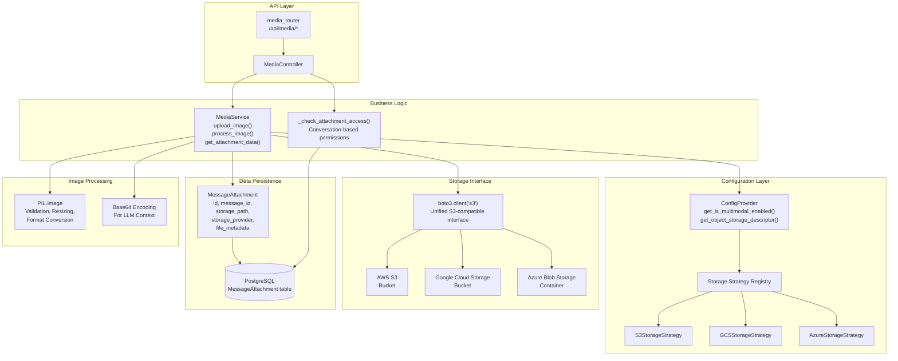
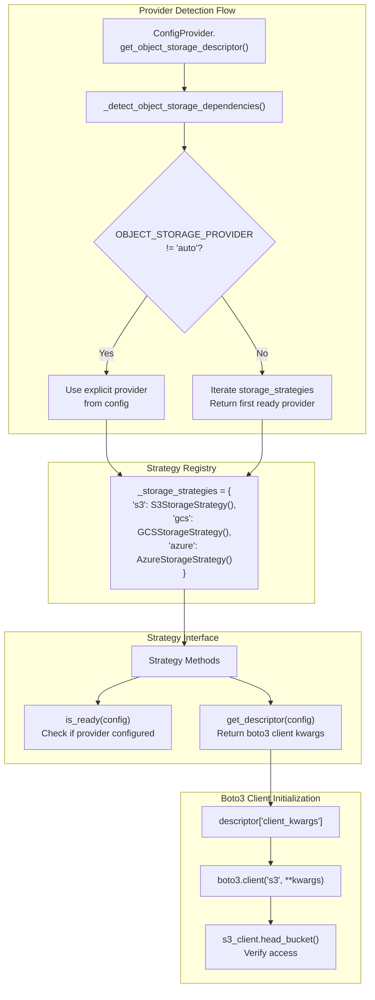
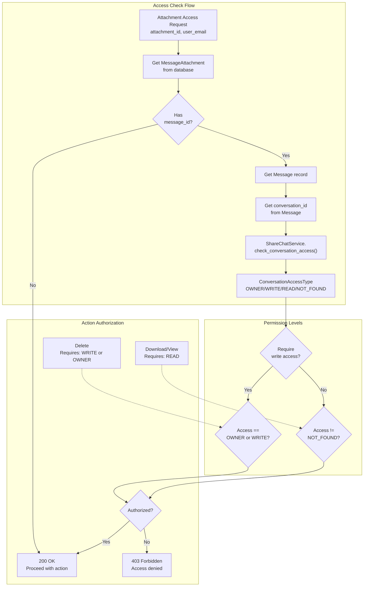

8.2-Media Service and Storage

# Page: Media Service and Storage

# Media Service and Storage

<details>
<summary>Relevant source files</summary>

The following files were used as context for generating this wiki page:

- [app/modules/conversations/conversation/conversation_controller.py](app/modules/conversations/conversation/conversation_controller.py)
- [app/modules/conversations/conversation/conversation_schema.py](app/modules/conversations/conversation/conversation_schema.py)
- [app/modules/conversations/conversation/conversation_service.py](app/modules/conversations/conversation/conversation_service.py)
- [app/modules/conversations/conversations_router.py](app/modules/conversations/conversations_router.py)

</details>


## Purpose and Scope

The Media Service handles image upload, processing, storage, and retrieval for multimodal functionality in Potpie. It provides a unified interface for storing images across multiple cloud providers (S3, GCS, Azure) using boto3, processes images for optimal LLM consumption, and manages access control for attachments.

This document covers image storage and processing. For information about using images in agent execution, see [Agent Execution and Streaming](#2.5). For conversation attachments and messaging, see [Multimodal Support](#3.3).

## Architecture Overview

The media system follows a strategy pattern for storage provider abstraction, with `MediaService` as the core orchestrator and `ConfigProvider` managing multi-provider configuration.



**Architecture: Media Service component relationships**

Sources: [app/modules/media/media_service.py:31-91](), [app/modules/media/media_controller.py:24-31](), [app/core/config_provider.py:19-48]()

## Configuration and Feature Flags

### Multimodal Enablement

The system uses the `isMultimodalEnabled` environment variable to control multimodal functionality:

| Mode | Behavior |
|------|----------|
| `"disabled"` | Multimodal features completely disabled, storage not initialized |
| `"enabled"` | Force-enable multimodal, requires valid storage config (will fail if missing) |
| `"auto"` (default) | Auto-detect based on storage provider configuration availability |

The `ConfigProvider.get_is_multimodal_enabled()` method implements this logic at [app/core/config_provider.py:135-150]().

### Storage Provider Selection

The system supports automatic provider detection via `OBJECT_STORAGE_PROVIDER` environment variable:

| Provider | Environment Variables Required |
|----------|-------------------------------|
| `s3` | `S3_BUCKET_NAME`, `AWS_REGION`, `AWS_ACCESS_KEY_ID`, `AWS_SECRET_ACCESS_KEY` |
| `gcs` | `GCS_BUCKET_NAME`, `GCS_PROJECT_ID`, `GOOGLE_APPLICATION_CREDENTIALS` |
| `azure` | Azure-specific credentials via storage strategy |
| `auto` (default) | Auto-detect first ready provider |

Sources: [app/core/config_provider.py:28-48](), [app/core/config_provider.py:152-183]()

## Storage Provider Architecture

The system implements a strategy pattern for storage provider abstraction, allowing seamless switching between S3, GCS, and Azure.



**Storage Provider Selection and Initialization Flow**

### Storage Strategies

Each storage strategy implements two key methods:

**`is_ready(config_provider) -> bool`**: Checks if required environment variables are present for the provider.

**`get_descriptor(config_provider) -> dict`**: Returns a descriptor containing:
- `provider`: Provider name string
- `bucket_name`: Target bucket/container name
- `client_kwargs`: Dictionary of boto3 client initialization parameters

The strategies are registered in `ConfigProvider.__init__()` at [app/core/config_provider.py:43-48]() and accessed via `get_object_storage_descriptor()` at [app/core/config_provider.py:156-166]().

### Boto3 Unified Interface

All cloud providers use the boto3 S3-compatible interface. The `MediaService` initializes the client at [app/modules/media/media_service.py:77-90]():

```python
client_kwargs = dict(self.object_storage_descriptor["client_kwargs"])
self.s3_client = boto3.client("s3", **client_kwargs)
self.s3_client.head_bucket(Bucket=self.bucket_name)
```

This enables provider-agnostic operations using standard S3 API methods (`put_object`, `get_object`, `delete_object`, `generate_presigned_url`).

Sources: [app/core/config_provider.py:5-10](), [app/core/config_provider.py:43-48](), [app/core/config_provider.py:156-183](), [app/modules/media/media_service.py:77-90]()

## Image Upload and Processing Pipeline

The image upload flow involves validation, processing, storage, and database persistence.

```mermaid
graph TB
    subgraph "API Entry"
        UploadRequest["POST /api/media/upload<br/>UploadFile, message_id"]
        CheckEnabled["_check_multimodal_enabled()"]
    end
    
    subgraph "Validation Phase"
        ReadFile["Read file data as bytes"]
        ValidateImage["_validate_image()<br/>Check MIME type,<br/>file size, image validity"]
        CheckMIME{"MIME in<br/>ALLOWED_IMAGE_TYPES?"}
        CheckSize{"Size <=<br/>MAX_IMAGE_SIZE?"}
        PILVerify["PIL Image.verify()<br/>Check corruption"]
    end
    
    subgraph "Processing Phase"
        ProcessImage["_process_image()"]
        OpenPIL["PIL.Image.open(BytesIO)"]
        CheckResize{"Width or Height ><br/>MAX_DIMENSION (2048)?"}
        ThumbnailResize["img.thumbnail()<br/>LANCZOS resampling"]
        CheckMode{"Mode in<br/>RGB or L?"}
        ConvertRGB["Convert to RGB<br/>Handle RGBA transparency"]
        SaveImage["Save as JPEG/PNG/WEBP<br/>quality=98, optimize=True"]
        GenerateMetadata["Build file_metadata dict<br/>original/processed dimensions,<br/>format, size"]
    end
    
    subgraph "Storage Phase"
        GenerateID["Generate UUID7<br/>attachment_id"]
        GeneratePath["_generate_storage_path()<br/>attachments/YYYY/MM/uuid.ext"]
        UploadCloud["_upload_to_cloud()<br/>s3_client.put_object()"]
        ComputeMD5["Base64-encode MD5<br/>for integrity check"]
    end
    
    subgraph "Persistence Phase"
        CreateRecord["Create MessageAttachment<br/>id, message_id,<br/>storage_path, storage_provider,<br/>file_metadata"]
        DBCommit["db.add() + db.commit()"]
        ReturnResponse["AttachmentUploadResponse<br/>id, type, size, mime_type"]
    end
    
    UploadRequest --> CheckEnabled
    CheckEnabled --> ReadFile
    ReadFile --> ValidateImage
    ValidateImage --> CheckMIME
    CheckMIME -->|No| ErrorResponse["HTTPException 400<br/>Unsupported type"]
    CheckMIME -->|Yes| CheckSize
    CheckSize -->|No| ErrorResponse2["HTTPException 400<br/>File too large"]
    CheckSize -->|Yes| PILVerify
    PILVerify -->|Invalid| ErrorResponse3["HTTPException 400<br/>Corrupted image"]
    PILVerify -->|Valid| ProcessImage
    
    ProcessImage --> OpenPIL
    OpenPIL --> CheckResize
    CheckResize -->|Yes| ThumbnailResize
    CheckResize -->|No| CheckMode
    ThumbnailResize --> CheckMode
    CheckMode -->|No| ConvertRGB
    CheckMode -->|Yes| SaveImage
    ConvertRGB --> SaveImage
    SaveImage --> GenerateMetadata
    
    GenerateMetadata --> GenerateID
    GenerateID --> GeneratePath
    GeneratePath --> ComputeMD5
    ComputeMD5 --> UploadCloud
    
    UploadCloud --> CreateRecord
    CreateRecord --> DBCommit
    DBCommit --> ReturnResponse
```



**Image Upload and Processing Pipeline**

### Validation Rules

The validation phase enforces these constraints at [app/modules/media/media_service.py:186-210]():

| Constraint | Value | Purpose |
|------------|-------|---------|
| `ALLOWED_IMAGE_TYPES` | JPEG, PNG, WEBP, GIF | Supported MIME types |
| `MAX_IMAGE_SIZE` | 10 MB (10,485,760 bytes) | Prevent excessive uploads |
| PIL verification | Image.verify() | Detect corrupted files |

### Processing Pipeline

The `_process_image()` method at [app/modules/media/media_service.py:212-284]() performs:

1. **Dimension Analysis**: Captures original width, height, format, mode, and size
2. **Conditional Resizing**: 
   - Only if `max(width, height) > MIN_DIMENSION_FOR_RESIZE` (1024px)
   - Uses `thumbnail()` with `LANCZOS` resampling to maintain aspect ratio
   - Target: `MAX_DIMENSION = 2048` pixels on longest side
3. **Color Mode Conversion**:
   - RGBA → RGB with white background (handles transparency)
   - Other modes → RGB
4. **Optimization**: JPEG saved at `JPEG_QUALITY = 98` with `optimize=True`

The processing metadata is stored in `file_metadata` JSON field:
```python
{
    "original_width": int,
    "original_height": int,
    "original_format": str,
    "original_mode": str,
    "original_size": int,
    "resized": bool,
    "new_width": int,  # if resized
    "new_height": int,  # if resized
    "mode_converted": bool,
    "processed_size": int
}
```

### Storage Path Generation

Paths use date-based partitioning for organization at [app/modules/media/media_service.py:286-302]():

```
attachments/YYYY/MM/uuid7.extension
```

Example: `attachments/2024/03/018e5b3f-7c8a-7890-a456-123456789abc.jpg`

Sources: [app/modules/media/media_service.py:33-46](), [app/modules/media/media_service.py:101-184](), [app/modules/media/media_service.py:186-210](), [app/modules/media/media_service.py:212-284](), [app/modules/media/media_service.py:286-302]()

## Cloud Storage Operations

The system uses boto3's S3-compatible API for all storage operations.

### Upload to Cloud Storage

The `_upload_to_cloud()` method at [app/modules/media/media_service.py:304-326]() performs:

```python
md5_b64 = base64.b64encode(hashlib.md5(file_data).digest()).decode("utf-8")
self.s3_client.put_object(
    Bucket=self.bucket_name,
    Key=storage_path,
    Body=file_data,
    ContentType=mime_type,
    ContentMD5=md5_b64,
)
```

The MD5 checksum ensures data integrity during upload.

### Download from Cloud Storage

The `get_attachment_data()` method at [app/modules/media/media_service.py:341-371]() retrieves file data:

```python
response = self.s3_client.get_object(
    Bucket=self.bucket_name,
    Key=attachment.storage_path,
)
return response["Body"].read()
```

Handles `NoSuchKey` errors with `HTTPException(404)`.

### Signed URL Generation

The `generate_signed_url()` method at [app/modules/media/media_service.py:373-402]() creates time-limited access URLs:

```python
return self.s3_client.generate_presigned_url(
    "get_object",
    Params={
        "Bucket": self.bucket_name,
        "Key": attachment.storage_path,
    },
    ExpiresIn=expiration_minutes * 60,
)
```

Default expiration: 60 minutes.

### Delete from Cloud Storage

The `delete_attachment()` method at [app/modules/media/media_service.py:404-448]() removes files:

```python
self.s3_client.delete_object(
    Bucket=self.bucket_name,
    Key=attachment.storage_path,
)
```

Gracefully handles `NoSuchKey` errors (logs warning, continues with DB deletion).

Sources: [app/modules/media/media_service.py:304-326](), [app/modules/media/media_service.py:341-371](), [app/modules/media/media_service.py:373-402](), [app/modules/media/media_service.py:404-448]()

## Database Persistence

### MessageAttachment Model

The `MessageAttachment` table stores attachment metadata with these key fields:

| Field | Type | Purpose |
|-------|------|---------|
| `id` | UUID7 | Primary key, unique attachment identifier |
| `message_id` | String (UUID) | Foreign key to Message, nullable for unlinked uploads |
| `attachment_type` | Enum | AttachmentType.IMAGE |
| `file_name` | String | Original filename |
| `file_size` | Integer | Processed file size in bytes |
| `mime_type` | String | Content type (image/jpeg, image/png, etc.) |
| `storage_path` | String | Cloud storage key path |
| `storage_provider` | Enum | StorageProvider (S3/GCS/AZURE/LOCAL) |
| `file_metadata` | JSON | Processing metadata (dimensions, resize info) |
| `created_at` | Timestamp | Upload timestamp |

Sources: [app/modules/media/media_model.py]() (referenced in imports), [app/modules/media/media_service.py:152-165]()

### Message Linking

Attachments can be uploaded before message creation (preview scenario). The linking happens via `update_message_attachments()` at [app/modules/media/media_service.py:450-487]():

1. Update `MessageAttachment.message_id` for specified attachment IDs
2. Set `Message.has_attachments = True` flag
3. Atomic transaction with rollback on error

Sources: [app/modules/media/media_service.py:450-487]()

## Access Control and Security

### Conversation-Based Access

Attachment access is controlled through conversation ownership and sharing permissions.



**Access Control Flow for Attachment Operations**

The `_check_attachment_access()` method in `MediaController` at [app/modules/media/media_controller.py:227-255]() implements this logic:

1. Retrieve `Message` by `message_id`
2. Get `conversation_id` from message
3. Call `ShareChatService.check_conversation_access(conversation_id, user_email)`
4. Return authorization based on access level and required permission

### Permission Matrix

| Operation | Endpoint | Required Access Level |
|-----------|----------|----------------------|
| Upload | `POST /api/media/upload` | Any authenticated user |
| Download | `GET /api/media/{id}/download` | READ or higher |
| Get Info | `GET /api/media/{id}` | READ or higher |
| Get Signed URL | `GET /api/media/{id}/access-url` | READ or higher |
| Delete | `DELETE /api/media/{id}` | WRITE or OWNER |

Sources: [app/modules/media/media_controller.py:76-108](), [app/modules/media/media_controller.py:110-147](), [app/modules/media/media_controller.py:149-179](), [app/modules/media/media_controller.py:181-206](), [app/modules/media/media_controller.py:227-255]()

## Multimodal Context Integration

### Base64 Encoding for LLMs

The `get_image_as_base64()` method at [app/modules/media/media_service.py:542-566]() converts stored images to base64 for LLM consumption:

```python
image_data = await self.get_attachment_data(attachment_id)
base64_string = base64.b64encode(image_data).decode("utf-8")
```

This enables vision-capable models to process images directly.

### Message Image Retrieval

The `get_message_images_as_base64()` method at [app/modules/media/media_service.py:568-611]() returns all images for a message:

```python
{
    "attachment_id_1": {
        "base64": "iVBORw0KGgo...",
        "mime_type": "image/png",
        "file_name": "screenshot.png",
        "file_size": 125436
    },
    # ... more images
}
```

### Conversation Context

The `get_conversation_recent_images()` method at [app/modules/media/media_service.py:613-657]() retrieves recent images from conversation history:

- Queries last `limit` messages (default 10) with `has_attachments=True`
- Only includes `MessageType.HUMAN` messages (user uploads)
- Returns aggregated base64 image dictionary
- Used for providing visual context to agents

Sources: [app/modules/media/media_service.py:542-566](), [app/modules/media/media_service.py:568-611](), [app/modules/media/media_service.py:613-657]()

## API Endpoints

The media router provides these endpoints:

| Method | Endpoint | Handler | Description |
|--------|----------|---------|-------------|
| POST | `/api/media/upload` | `upload_image()` | Upload image with optional message_id |
| GET | `/api/media/{id}` | `get_attachment_info()` | Get attachment metadata |
| GET | `/api/media/{id}/download` | `download_attachment()` | Download file directly |
| GET | `/api/media/{id}/access-url` | `get_attachment_access_url()` | Generate signed URL |
| DELETE | `/api/media/{id}` | `delete_attachment()` | Delete attachment |
| GET | `/api/media/message/{message_id}` | `get_message_attachments()` | List message attachments |

All endpoints require authentication and perform conversation-based access checks.

Sources: [app/modules/media/media_controller.py:43-75](), [app/modules/media/media_controller.py:76-108](), [app/modules/media/media_controller.py:110-147](), [app/modules/media/media_controller.py:149-179](), [app/modules/media/media_controller.py:181-206](), [app/modules/media/media_controller.py:208-225]()

## Error Handling

### MediaServiceError Exception

Custom exception class for media-specific errors at [app/modules/media/media_service.py:25-28](). Raised for:
- Storage initialization failures
- Image processing errors
- Cloud storage operation failures
- Multimodal disabled state

### Common Error Scenarios

| Error | Status Code | Cause |
|-------|-------------|-------|
| Multimodal disabled | 501 | `isMultimodalEnabled != "enabled"` and storage not configured |
| Invalid MIME type | 400 | File type not in `ALLOWED_IMAGE_TYPES` |
| File too large | 400 | Size exceeds `MAX_IMAGE_SIZE` (10MB) |
| Corrupted image | 400 | PIL `Image.verify()` fails |
| Attachment not found | 404 | Invalid `attachment_id` or storage key missing |
| Access denied | 403 | User lacks conversation access |
| Storage unavailable | 500 | boto3 client operation fails |

All errors trigger database rollback and detailed logging.

Sources: [app/modules/media/media_service.py:25-28](), [app/modules/media/media_service.py:92-99](), [app/modules/media/media_service.py:186-210](), [app/modules/media/media_controller.py:32-41]()

## Configuration Summary

### Required Environment Variables by Provider

**AWS S3:**
```
OBJECT_STORAGE_PROVIDER=s3  # or "auto"
S3_BUCKET_NAME=potpie-attachments
AWS_REGION=us-east-1
AWS_ACCESS_KEY_ID=AKIA...
AWS_SECRET_ACCESS_KEY=...
```

**Google Cloud Storage:**
```
OBJECT_STORAGE_PROVIDER=gcs  # or "auto"
GCS_BUCKET_NAME=potpie-attachments
GCS_PROJECT_ID=my-project-id
GOOGLE_APPLICATION_CREDENTIALS=/path/to/service-account.json
```

**Feature Control:**
```
isMultimodalEnabled=auto  # "enabled", "disabled", or "auto"
```

Sources: [app/core/config_provider.py:28-42](), [app/core/config_provider.py:135-150]()