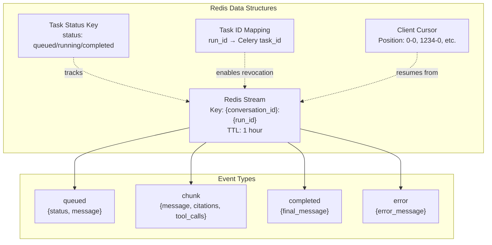
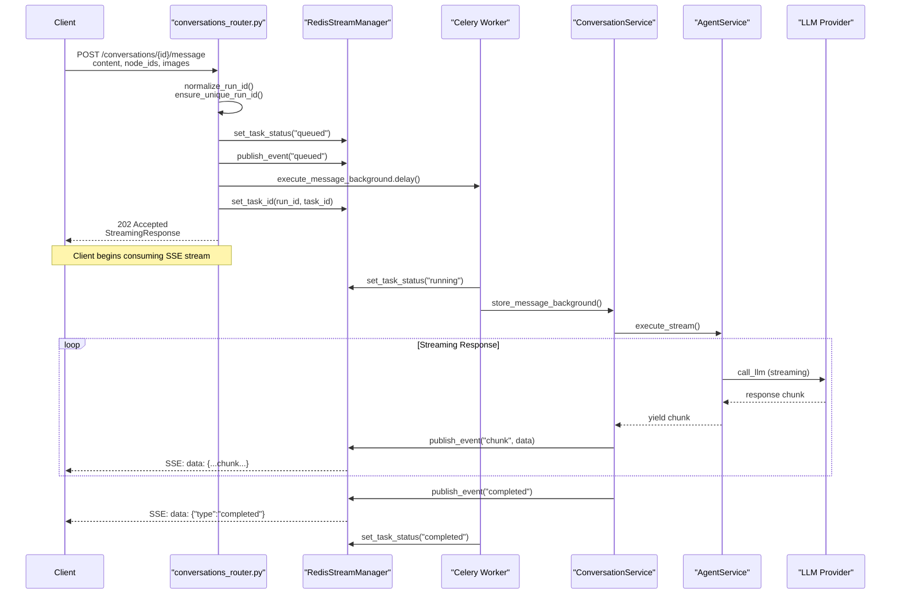
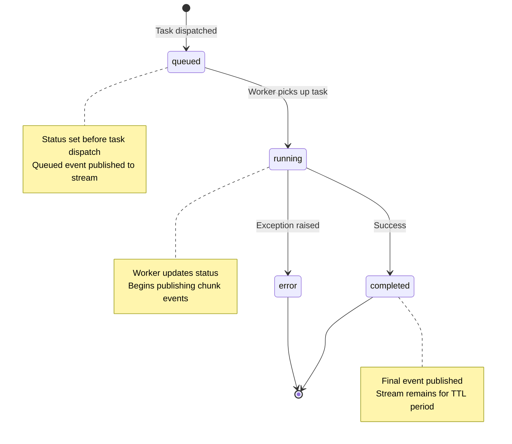
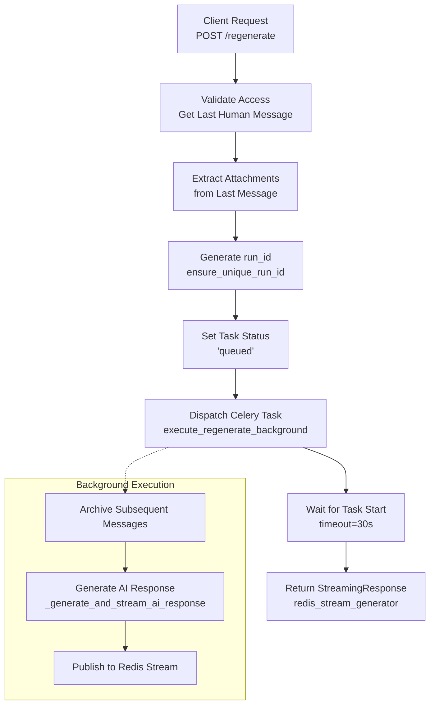

3.2-Message Streaming and Redis Streams

# Page: Message Streaming and Redis Streams

# Message Streaming and Redis Streams

<details>
<summary>Relevant source files</summary>

The following files were used as context for generating this wiki page:

- [app/modules/conversations/conversation/conversation_controller.py](app/modules/conversations/conversation/conversation_controller.py)
- [app/modules/conversations/conversation/conversation_schema.py](app/modules/conversations/conversation/conversation_schema.py)
- [app/modules/conversations/conversation/conversation_service.py](app/modules/conversations/conversation/conversation_service.py)
- [app/modules/conversations/conversations_router.py](app/modules/conversations/conversations_router.py)

</details>


## Purpose and Scope

This document describes the real-time message streaming architecture in Potpie, which enables Server-Sent Events (SSE) delivery of AI-generated responses through Redis Streams. The system provides non-blocking API responses, fault-tolerant reconnection, and cursor-based resumability for long-running AI agent executions.

For information about the background task processing that generates these streams, see [Background Processing](#9). For details on the agent execution pipeline itself, see [Agent Execution Pipeline](#2.5).

---

## Overview

The streaming architecture decouples message generation from message delivery by using Redis Streams as an intermediary buffer. When a client submits a message, the API immediately returns a 202 Accepted response and dispatches a Celery background task. The background task publishes streaming events to a Redis stream, which the client consumes via Server-Sent Events (SSE). This architecture supports:

- **Non-blocking responses**: API endpoints return immediately without waiting for AI processing
- **Real-time streaming**: Clients receive response chunks as they're generated
- **Resumability**: Clients can reconnect and resume from their last cursor position
- **Session isolation**: Multiple concurrent requests are isolated via unique `run_id` identifiers
- **Task lifecycle management**: Track task status (queued, running, completed) independently of stream consumption

**Sources:** [app/modules/conversations/conversation/conversation_service.py:1-108](), [app/modules/conversations/conversations_router.py:45-50]()

---

## Architecture Components

### Core Services

| Service | File Path | Responsibility |
|---------|-----------|----------------|
| `RedisStreamManager` | `app/modules/conversations/utils/redis_streaming.py` | Manages Redis stream operations (publish, consume, cleanup) |
| `SessionService` | `app/modules/conversations/session/session_service.py` | Tracks active sessions and provides session metadata |
| `ConversationService` | `app/modules/conversations/conversation/conversation_service.py` | Orchestrates message storage and AI response generation |
| Celery Tasks | `app/celery/tasks/agent_tasks.py` | Background execution of `execute_message_background` and `execute_regenerate_background` |

### Key Data Structures



**Diagram: Redis Stream Data Structures**

The Redis stream uses a compound key `{conversation_id}:{run_id}` to isolate concurrent sessions. Each event in the stream contains a type (`queued`, `chunk`, `completed`, `error`) and associated payload. The stream has a configurable TTL (default 1 hour) to balance resumability with memory usage.

**Sources:** [app/modules/conversations/conversations_router.py:266-286](), [app/modules/conversations/conversations_router.py:372-396]()

---

## Session Management

### Run ID Generation

The `run_id` is a deterministic identifier that uniquely identifies a streaming session. It is generated from:

```
run_id = normalize_run_id(conversation_id, user_id, session_id, prev_human_message_id)
```

The `normalize_run_id` function creates a consistent identifier that allows multiple clients (or reconnecting clients) to subscribe to the same stream. For fresh requests without a cursor, `ensure_unique_run_id` appends a timestamp to prevent collision with previous streams.

**Sources:** [app/modules/conversations/conversations_router.py:265-271](), [app/modules/conversations/conversations_router.py:335-341]()

### Active Session Tracking

The system provides two endpoints for querying session state:

| Endpoint | Response Schema | Purpose |
|----------|-----------------|---------|
| `GET /conversations/{id}/active-session` | `ActiveSessionResponse` | Returns current active session with cursor position |
| `GET /conversations/{id}/task-status` | `TaskStatusResponse` | Returns background task status and estimated completion |

These endpoints enable clients to:
- Check if a session is still active before resuming
- Retrieve the last known cursor position for reconnection
- Monitor task progress without consuming the stream

**Sources:** [app/modules/conversations/conversations_router.py:461-488](), [app/modules/conversations/conversations_router.py:491-518]()

### Session Response Models

```python
# From conversation_schema.py

class ActiveSessionResponse(BaseModel):
    sessionId: str
    status: str  # "active", "idle", "completed"
    cursor: str
    conversationId: str
    startedAt: int  # Unix timestamp in milliseconds
    lastActivity: int  # Unix timestamp in milliseconds

class TaskStatusResponse(BaseModel):
    isActive: bool
    sessionId: str
    estimatedCompletion: int  # Unix timestamp in milliseconds
    conversationId: str
```

**Sources:** [app/modules/conversations/conversation/conversation_schema.py:69-92]()

---

## Message Streaming Flow

### Request Flow Diagram



**Diagram: Message Streaming Sequence**

This diagram illustrates the complete lifecycle of a streaming message request, from initial POST to final SSE delivery.

**Sources:** [app/modules/conversations/conversations_router.py:161-286](), [app/modules/conversations/conversation/conversation_service.py:544-652]()

### Endpoint: POST /conversations/{conversation_id}/message/

This is the primary endpoint for submitting user messages with streaming support.

**Parameters:**
- `content` (Form): Message content
- `node_ids` (Form, optional): JSON-encoded list of code node IDs for context
- `images` (File, optional): Multimodal image attachments
- `stream` (Query, default=true): Enable streaming response
- `session_id` (Query, optional): Session ID for reconnection
- `prev_human_message_id` (Query, optional): Previous message ID for deterministic run_id
- `cursor` (Query, optional): Stream cursor for replay from specific position

**Request Processing:**

1. **Validation**: Content is validated for non-empty, non-whitespace input
2. **Image Upload**: Images are uploaded to object storage and attachment IDs are returned
3. **Run ID Generation**: 
   - `run_id = normalize_run_id(conversation_id, user_id, session_id, prev_human_message_id)`
   - If no cursor provided: `run_id = ensure_unique_run_id(conversation_id, run_id)`
4. **Task Dispatch**: 
   - `redis_manager.set_task_status(conversation_id, run_id, "queued")`
   - `redis_manager.publish_event(conversation_id, run_id, "queued", {...})`
   - `task_result = execute_message_background.delay(...)`
   - `redis_manager.set_task_id(conversation_id, run_id, task_result.id)`
5. **Stream Response**: `StreamingResponse(redis_stream_generator(conversation_id, run_id, cursor))`

**Sources:** [app/modules/conversations/conversations_router.py:161-286]()

### Streaming vs Non-Streaming Mode

When `stream=false`, the endpoint falls back to direct execution without background tasks:

```python
# Non-streaming path (lines 256-262)
if not stream:
    message_stream = controller.post_message(conversation_id, message, stream)
    async for chunk in message_stream:
        return chunk
```

In non-streaming mode, the API blocks until the full response is generated and returns it as a single JSON object. This is useful for synchronous integrations or testing.

**Sources:** [app/modules/conversations/conversations_router.py:256-262]()

---

## Background Task Integration

### Celery Task Execution

Background tasks are dispatched using Celery's `delay()` method, which immediately returns a task result object:

```python
# From conversations_router.py:387-393
task_result = execute_regenerate_background.delay(
    conversation_id=conversation_id,
    run_id=run_id,
    user_id=user_id,
    node_ids=request.node_ids or [],
    attachment_ids=attachment_ids,
)
```

The task ID is stored in Redis to enable later revocation via the stop endpoint:

```python
redis_manager.set_task_id(conversation_id, run_id, task_result.id)
```

**Sources:** [app/modules/conversations/conversations_router.py:387-396]()

### Task Status Lifecycle



**Diagram: Task Status State Machine**

The task status is tracked independently of the stream events to support:
- Health checks before stream consumption
- Task cancellation via `stop_generation` endpoint
- Diagnostics for stuck or failed tasks

**Sources:** [app/modules/conversations/conversations_router.py:372-411]()

### Wait for Task Start

Before returning the streaming response, the API waits for the background task to start processing:

```python
# From conversations_router.py:403-411
task_started = redis_manager.wait_for_task_start(
    conversation_id, run_id, timeout=30
)

if not task_started:
    logger.warning(
        f"Background regenerate task failed to start within 30s - may still be queued"
    )
    # Don't fail - the stream consumer will wait up to 120 seconds
```

This health check prevents returning a streaming response for a task that never executes. The timeout is set to 30 seconds to accommodate queued tasks, but the stream consumer has a longer 120-second timeout for resilience.

**Sources:** [app/modules/conversations/conversations_router.py:401-411]()

---

## Resumability and Reconnection

### Cursor-Based Stream Replay

Redis Streams use a cursor-based position system where each entry has an ID in the format `{timestamp}-{sequence}`. Clients track their last consumed cursor and can resume from that position.

**Resume Endpoint: POST /conversations/{conversation_id}/resume/{session_id}**

```python
# Parameters
cursor: str = Query("0-0", description="Stream cursor position to resume from")

# Validation
stream_key = redis_manager.stream_key(conversation_id, session_id)
if not redis_manager.redis_client.exists(stream_key):
    raise HTTPException(404, detail=f"Session {session_id} not found or expired")

# Return streaming response from cursor
return StreamingResponse(
    redis_stream_generator(conversation_id, session_id, cursor),
    media_type="text/event-stream"
)
```

The resume endpoint:
1. Verifies the session stream exists in Redis
2. Checks task status for diagnostics
3. Returns `redis_stream_generator` starting from the provided cursor
4. Client receives only events after the cursor position

**Sources:** [app/modules/conversations/conversations_router.py:521-566]()

### Stream TTL and Expiration

Redis streams have a configurable TTL (default 1 hour) to balance resumability with memory usage. After the TTL expires, the stream is automatically deleted and resumption is no longer possible. Clients attempting to resume an expired stream receive a 404 error.

The TTL is sufficient for:
- Temporary network disconnections
- Client-side navigation away and back
- Long-running tasks (up to 1 hour of execution)

For tasks exceeding 1 hour, clients must track completion state and query the database for historical messages.

**Sources:** Based on diagram reference to "TTL: 1 hour" in high-level architecture

---

## Redis Stream Generator

### Implementation Pattern

The `redis_stream_generator` function is the core streaming response generator. While the implementation is not in the provided files, its usage pattern reveals the interface:

```python
# From conversations_router.py:415
return StreamingResponse(
    redis_stream_generator(conversation_id, run_id, cursor),
    media_type="text/event-stream"
)
```

**Function Signature (inferred):**
```python
async def redis_stream_generator(
    conversation_id: str,
    run_id: str,
    cursor: Optional[str] = None
) -> AsyncGenerator[str, None]:
    """
    Consume events from Redis stream and yield SSE-formatted strings.
    
    Args:
        conversation_id: Conversation identifier
        run_id: Session/stream identifier
        cursor: Stream position to start from (default: "0-0" for beginning)
    
    Yields:
        SSE-formatted event strings: "data: {json}\n\n"
    """
```

The generator:
- Reads from Redis stream `{conversation_id}:{run_id}`
- Starts from cursor position (or "0-0" for beginning)
- Yields events in Server-Sent Event format
- Blocks waiting for new events until stream completion or timeout
- Handles stream expiration and error states

**Sources:** [app/modules/conversations/conversations_router.py:48](), [app/modules/conversations/conversations_router.py:415](), [app/modules/conversations/conversations_router.py:564]()

---

## Regenerate Message Flow

The regenerate endpoint follows the same streaming pattern as the message endpoint but operates on the last human message in the conversation:



**Diagram: Regenerate Message Flow**

### Key Differences from New Message

1. **No User Content**: Uses content from last human message instead of new input
2. **Attachment Extraction**: Retrieves attachments from the last human message via `MediaService`
3. **Message Archival**: Archives all AI-generated messages after the last human message timestamp
4. **Access Control**: Only conversation creators can regenerate (WRITE access required)

**Sources:** [app/modules/conversations/conversations_router.py:289-417](), [app/modules/conversations/conversation/conversation_service.py:785-847]()

### Endpoint: POST /conversations/{conversation_id}/regenerate/

**Parameters:**
- `request.node_ids` (Body): Optional list of code node IDs
- `stream` (Query, default=true): Enable streaming
- `session_id` (Query, optional): Session identifier
- `prev_human_message_id` (Query, optional): For deterministic run_id
- `cursor` (Query, optional): Resume from cursor position
- `background` (Query, default=true): Use background execution

**Processing Steps:**

1. **Extract Attachments**: Queries last human message and retrieves attachment IDs
2. **Generate Run ID**: `run_id = normalize_run_id(conversation_id, user_id, session_id, prev_human_message_id)`
3. **Ensure Uniqueness**: If no cursor, `run_id = ensure_unique_run_id(conversation_id, run_id)`
4. **Set Task Status**: `redis_manager.set_task_status(conversation_id, run_id, "queued")`
5. **Dispatch Task**: `execute_regenerate_background.delay(...)`
6. **Wait for Start**: `redis_manager.wait_for_task_start(conversation_id, run_id, timeout=30)`
7. **Stream Response**: `StreamingResponse(redis_stream_generator(conversation_id, run_id, cursor))`

**Sources:** [app/modules/conversations/conversations_router.py:289-417]()

---

## Stop Generation

### Endpoint: POST /conversations/{conversation_id}/stop/

The stop endpoint allows clients to cancel an in-progress streaming task:

```python
async def stop_generation(
    conversation_id: str,
    session_id: Optional[str] = Query(None, description="Session ID to stop"),
    ...
):
    controller = ConversationController(db, async_db, user_id, user_email)
    return await controller.stop_generation(conversation_id, session_id)
```

The implementation (in `ConversationService.stop_generation`, not shown) uses the stored Celery task ID to revoke the background task:

1. Retrieve task ID from `redis_manager.get_task_id(conversation_id, session_id)`
2. Revoke Celery task: `celery_app.control.revoke(task_id, terminate=True)`
3. Publish "stopped" event to Redis stream
4. Update task status to "stopped"

This enables graceful cancellation of long-running agent executions without orphaning resources.

**Sources:** [app/modules/conversations/conversations_router.py:433-444]()

---

## Integration with Conversation Service

### Message Storage and Streaming

The `ConversationService.store_message` method orchestrates the entire message lifecycle:

```python
# From conversation_service.py:544-652
async def store_message(
    self,
    conversation_id: str,
    message: MessageRequest,
    message_type: MessageType,
    user_id: str,
    stream: bool = True,
) -> AsyncGenerator[ChatMessageResponse, None]:
```

**Execution Flow:**

1. **Access Control**: Verify user has WRITE access to conversation
2. **Store Human Message**: Add message to `ChatHistoryService` buffer and flush to database
3. **Link Attachments**: Update attachment records with message ID
4. **Title Generation**: If first human message, generate conversation title
5. **Repository Registration**: Ensure repository is registered in `RepoManager`
6. **Stream AI Response**: Call `_generate_and_stream_ai_response()`

The `_generate_and_stream_ai_response` method yields chunks that are:
- Published to Redis stream (in background task mode)
- Returned directly to client (in non-background mode)
- Stored in message buffer via `history_manager.add_message_chunk()`

**Sources:** [app/modules/conversations/conversation/conversation_service.py:544-652]()

### Background Streaming Method

For Celery tasks, a dedicated background method reuses the streaming logic:

```python
# From conversation_service.py:1030-1044
async def _generate_and_stream_ai_response_background(
    self,
    query: str,
    conversation_id: str,
    user_id: str,
    node_ids: List[NodeContext],
    attachment_ids: Optional[List[str]] = None,
    run_id: str = None,
) -> AsyncGenerator[ChatMessageResponse, None]:
    """Background version for Celery tasks - reuses existing streaming logic"""
    
    async for chunk in self._generate_and_stream_ai_response(
        query, conversation_id, user_id, node_ids, attachment_ids
    ):
        yield chunk
```

This method is invoked from Celery tasks, which publish each yielded chunk to the Redis stream. The separation allows the core streaming logic to remain independent of the transport mechanism (direct SSE vs Redis Streams).

**Sources:** [app/modules/conversations/conversation/conversation_service.py:1030-1044]()

---

## API Response Models

### ChatMessageResponse

The primary response model for streaming chunks:

```python
# From conversation_schema.py:54-58
class ChatMessageResponse(BaseModel):
    message: str
    citations: List[str]
    tool_calls: List[Any]
```

Each SSE event contains a serialized `ChatMessageResponse`:

```
data: {"message": "I found the function...", "citations": ["file:123"], "tool_calls": []}

data: {"message": " in the codebase.", "citations": [], "tool_calls": []}

data: {"message": "", "citations": [], "tool_calls": [], "type": "completed"}
```

**Sources:** [app/modules/conversations/conversation/conversation_schema.py:54-58]()

### Session and Task Status Models

```python
# Active session metadata
class ActiveSessionResponse(BaseModel):
    sessionId: str
    status: str  # "active", "idle", "completed"
    cursor: str
    conversationId: str
    startedAt: int
    lastActivity: int

# Task execution status
class TaskStatusResponse(BaseModel):
    isActive: bool
    sessionId: str
    estimatedCompletion: int
    conversationId: str
```

These models provide frontend-compatible APIs for session management and task monitoring.

**Sources:** [app/modules/conversations/conversation/conversation_schema.py:69-88]()

---

## Error Handling

### Stream Expiration

When a client attempts to resume a stream that has exceeded its TTL:

```python
# From conversations_router.py:550-554
stream_key = redis_manager.stream_key(conversation_id, session_id)
if not redis_manager.redis_client.exists(stream_key):
    raise HTTPException(
        status_code=404, detail=f"Session {session_id} not found or expired"
    )
```

**Client Handling:**
- Poll `/conversations/{id}/messages/` endpoint to retrieve historical messages
- Display error message indicating session expiration
- Do not attempt automatic retry (stream is permanently lost)

### Task Start Timeout

If a background task fails to start within 30 seconds:

```python
# From conversations_router.py:403-411
task_started = redis_manager.wait_for_task_start(
    conversation_id, run_id, timeout=30
)

if not task_started:
    logger.warning(
        f"Background task failed to start within 30s - may still be queued"
    )
    # Don't fail - the stream consumer will wait up to 120 seconds
```

The API proceeds with the stream response because:
- Task may be queued waiting for available worker
- Stream consumer has a longer 120-second timeout
- Prevents false negatives during high load

**Sources:** [app/modules/conversations/conversations_router.py:401-411]()

### Access Control Errors

Access control is enforced at multiple layers:

1. **Router Layer**: `AuthService.check_auth()` dependency validates authentication
2. **Service Layer**: `check_conversation_access()` verifies READ or WRITE access
3. **Background Tasks**: Re-validate access before execution

```python
# From conversation_service.py:166-214
async def check_conversation_access(
    self, conversation_id: str, user_email: str, firebase_user_id: str = None
) -> str:
    # Returns ConversationAccessType.WRITE, READ, or NOT_FOUND
```

**Error Responses:**
- 401 Unauthorized: Authentication failed
- 403 Forbidden: User has READ access but attempted WRITE operation
- 404 Not Found: Conversation doesn't exist or user has no access

**Sources:** [app/modules/conversations/conversation/conversation_service.py:166-214]()

---

## Performance Considerations

### Stream TTL Configuration

The default 1-hour TTL balances:
- **Memory Usage**: Streams accumulate in Redis memory until expiration
- **Resumability Window**: Sufficient for temporary disconnections
- **Large Responses**: Allows storage of extensive AI-generated content

For deployments with memory constraints, reduce TTL to 15-30 minutes.

### Concurrent Session Limits

Each active session maintains:
- Redis stream with all events
- Task status key
- Task ID mapping
- Session metadata

High concurrency requires Redis memory scaling and connection pool tuning.

### Event Size Optimization

Each `ChatMessageResponse` event is JSON-serialized and stored in Redis. Large tool calls or citations increase memory usage. Consider:
- Compressing large tool call payloads
- Deduplicating repeated citations
- Storing large artifacts in object storage with references

**Sources:** Based on architecture understanding and Redis Streams characteristics

---

## Summary

The message streaming architecture provides:

| Feature | Implementation | Benefits |
|---------|---------------|----------|
| **Non-blocking API** | Celery background tasks | Low latency response times |
| **Real-time delivery** | Redis Streams + SSE | Progressive rendering of AI responses |
| **Resumability** | Cursor-based stream replay | Fault-tolerant client connections |
| **Session isolation** | Deterministic run_id generation | Concurrent requests without interference |
| **Task management** | Status tracking + cancellation | Operational visibility and control |

The system uses Redis Streams as a durable, high-performance buffer between AI generation and client consumption, enabling sophisticated streaming semantics while maintaining architectural simplicity.

**Sources:** [app/modules/conversations/conversations_router.py:1-622](), [app/modules/conversations/conversation/conversation_service.py:1-108]()