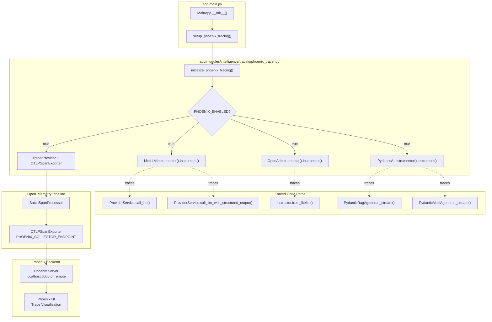
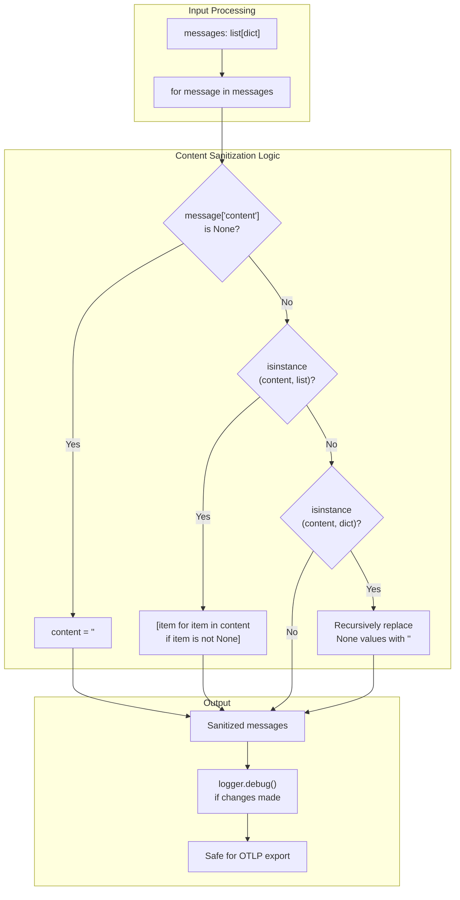
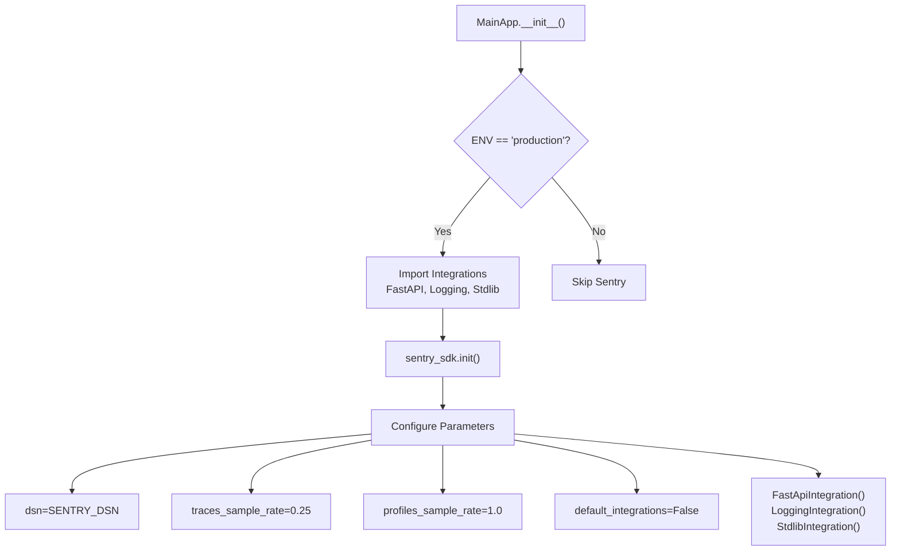
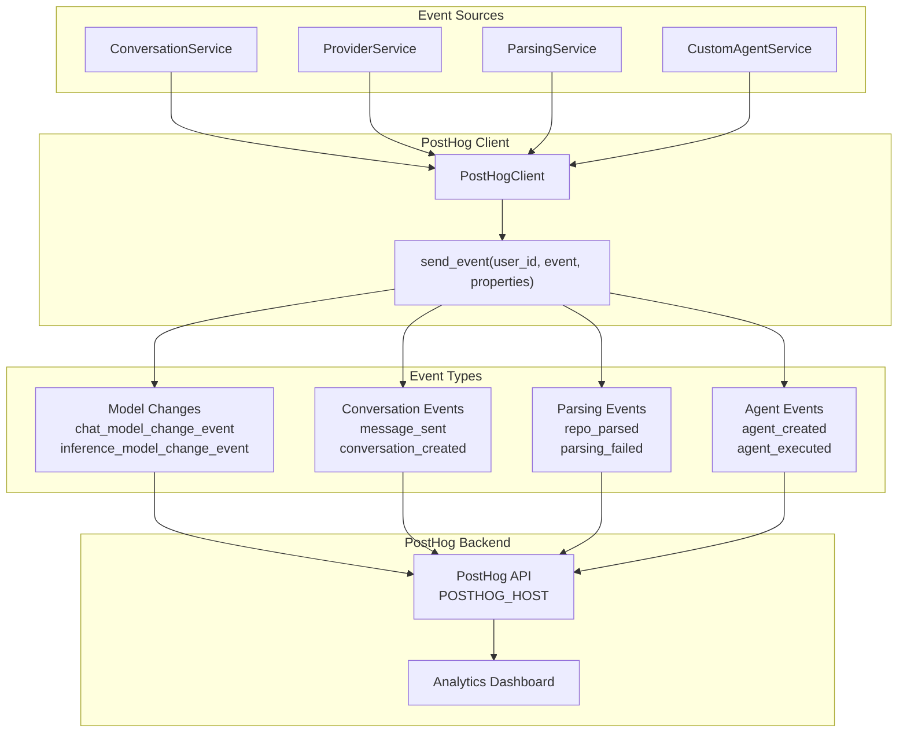
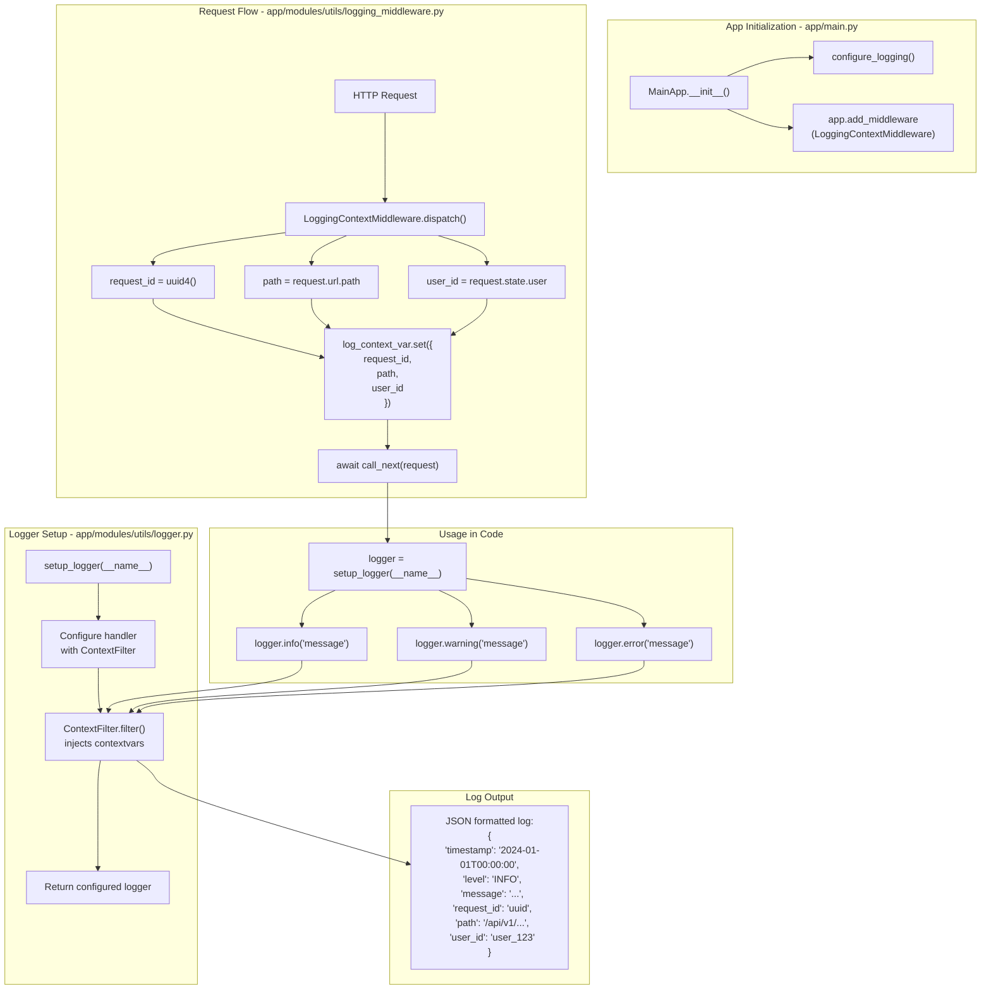
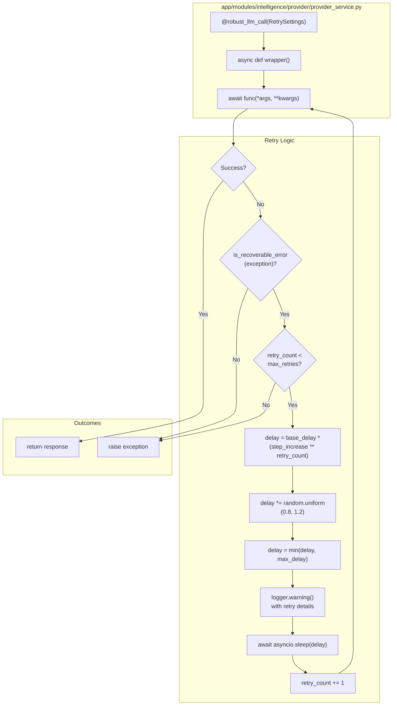
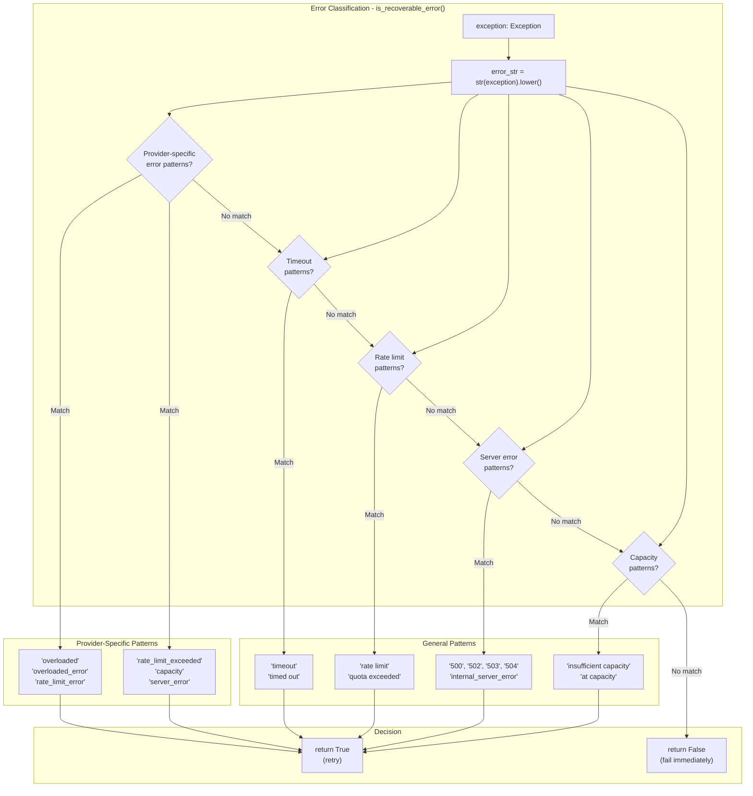
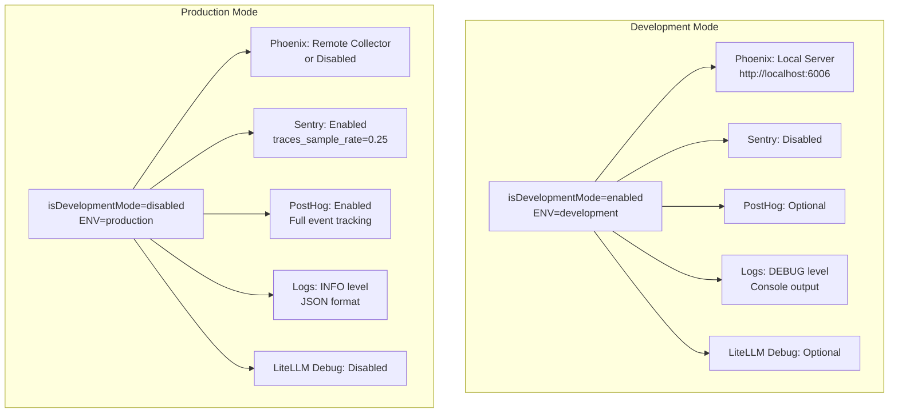

11.3-Monitoring and Observability

# Page: Monitoring and Observability

# Monitoring and Observability

<details>
<summary>Relevant source files</summary>

The following files were used as context for generating this wiki page:

- [.env.template](.env.template)
- [app/main.py](app/main.py)
- [requirements.txt](requirements.txt)

</details>


This document covers the monitoring and observability infrastructure in Potpie, including LLM tracing with Phoenix, error tracking with Sentry, analytics with PostHog, and structured logging. These systems provide visibility into agent execution, API performance, LLM calls, and user behavior.

For production deployment configuration, see [Production Deployment](#11.2). For development mode setup, see [Development Mode](#11.1).

## Overview

Potpie implements a multi-layered observability strategy:

| Layer | Tool | Purpose | Environment |
|-------|------|---------|-------------|
| **LLM Tracing** | Phoenix (Arize) | Trace LLM calls, agent execution, tool usage | Development (local), Production (optional) |
| **Error Tracking** | Sentry | Capture exceptions, performance monitoring | Production only |
| **Analytics** | PostHog | Track user events, feature usage | Production |
| **Application Logging** | Python logging + middleware | Structured logs with context | All |
| **LLM Debug Logs** | LiteLLM verbose mode | Debug LLM API interactions | Development (opt-in) |

Sources: [README.md:278-284](), [app/main.py:64-99](), [requirements.txt:16-19,148-162,176,231]()

## Phoenix Tracing for LLM Observability

### Architecture and Initialization

Phoenix provides distributed tracing for LLM applications using OpenTelemetry standards. Potpie integrates Phoenix to trace all LLM interactions, agent executions, and tool calls through the `initialize_phoenix_tracing()` function in [app/modules/intelligence/tracing/phoenix_tracer.py]().



**Diagram: Phoenix Tracing Initialization and Instrumentation Flow**

The initialization occurs in [app/main.py:89-99]() during application startup:

```python
def setup_phoenix_tracing(self):
    try:
        from app.modules.intelligence.tracing.phoenix_tracer import (
            initialize_phoenix_tracing,
        )
        initialize_phoenix_tracing()
    except Exception:
        logger.exception(
            "Phoenix tracing initialization failed (non-fatal but should be investigated)"
        )
```

The `initialize_phoenix_tracing()` function in [app/modules/intelligence/tracing/phoenix_tracer.py]() performs these steps:

1. Check if `PHOENIX_ENABLED` environment variable is set to `true`
2. Instrument LiteLLM via `LiteLLMInstrumentor().instrument()`
3. Instrument OpenAI SDK via `OpenAIInstrumentor().instrument()`
4. Instrument Pydantic AI agents via `PydanticAIInstrumentor().instrument()`
5. Configure OpenTelemetry `TracerProvider` with `BatchSpanProcessor` and `OTLPSpanExporter`
6. Set collector endpoint to `PHOENIX_COLLECTOR_ENDPOINT` (defaults to `http://localhost:6006`)

Sources: [app/main.py:89-99](), [requirements.txt:16-19,147-162]()

### Configuration

Phoenix tracing is controlled via environment variables in `.env`:

| Variable | Default | Description |
|----------|---------|-------------|
| `PHOENIX_ENABLED` | `true` | Enable/disable tracing |
| `PHOENIX_COLLECTOR_ENDPOINT` | `http://localhost:6006` | Phoenix server endpoint |
| `PHOENIX_PROJECT_NAME` | `potpie-ai` | Project identifier in UI |

**Local Development Setup:**

```bash
# In a separate terminal, start Phoenix server
phoenix serve

# Traces available at http://localhost:6006
```

**Production Setup:**

For production, Phoenix can be deployed as a standalone service or hosted by Arize:

```bash
# Self-hosted Phoenix
PHOENIX_ENABLED=true
PHOENIX_COLLECTOR_ENDPOINT=https://phoenix.yourcompany.com
PHOENIX_PROJECT_NAME=potpie-production
```

Sources: [.env.template:75-81](), [README.md:278-284]()

### Instrumented Components

Phoenix automatically traces three categories of LLM interactions:

**1. LiteLLM Calls** (`LiteLLMInstrumentor`)
- Traces all calls through `litellm.acompletion()`
- Captures model, messages, temperature, max_tokens
- Located in: [app/modules/intelligence/provider/provider_service.py:884-893,922-931]()

**2. OpenAI SDK Calls** (`OpenAIInstrumentor`)
- Traces structured output via `instructor.from_openai()`
- Captures Pydantic schema validation
- Located in: [app/modules/intelligence/provider/provider_service.py:848-864,970-986]()

**3. Pydantic AI Agents** (`PydanticAIInstrumentor`)
- Traces agent execution with tool calls
- Captures tool inputs/outputs, agent reasoning
- Located in agent execution classes

### Message Sanitization for Tracing

Phoenix uses OpenTelemetry for trace export, which has strict type requirements. The `sanitize_messages_for_tracing()` function in [app/modules/intelligence/provider/provider_service.py:262-327]() prevents encoding errors:



**Diagram: Message Sanitization Pipeline for OpenTelemetry Compatibility**

The function handles three sanitization scenarios:

1. **None content**: Converts `message["content"] = None` to `""` (empty string)
2. **None in lists**: Filters out `None` items from multimodal content arrays (e.g., `[{"type": "text"}, None, {"type": "image"}]`)
3. **None in dicts**: Recursively replaces `None` values in nested dictionaries (e.g., image_url structures)

Sanitization is called before every LLM invocation:
- [app/modules/intelligence/provider/provider_service.py:814]() in `call_llm_with_specific_model()`
- [app/modules/intelligence/provider/provider_service.py:908]() in `call_llm()`
- [app/modules/intelligence/provider/provider_service.py:942]() in `call_llm_with_structured_output()`

All sanitization actions are logged at DEBUG level for troubleshooting.

Sources: [app/modules/intelligence/provider/provider_service.py:262-327,814,908,942]()

### Trace Data Captured

Phoenix captures comprehensive trace data for each LLM interaction:

| Attribute | Description | Example |
|-----------|-------------|---------|
| `llm.model_name` | Model identifier | `openai/gpt-4o` |
| `llm.provider` | Provider name | `openai`, `anthropic` |
| `llm.input_messages` | Sanitized messages | Chat history + system prompt |
| `llm.output_messages` | Model response | Assistant message |
| `llm.token_count.prompt` | Input tokens | 1500 |
| `llm.token_count.completion` | Output tokens | 300 |
| `llm.invocation_parameters` | Call parameters | `temperature=0.3, max_tokens=8000` |
| `span.duration` | Latency | 2.5s |

For tool calls, additional attributes:
- `tool.name`: Tool function name (e.g., `ask_knowledge_graph_queries`)
- `tool.input`: Tool parameters
- `tool.output`: Tool result

Sources: [requirements.txt:147-162]()

## Sentry Error Tracking

### Production-Only Configuration

Sentry is initialized only in production environments to capture exceptions and performance data. The setup explicitly disables auto-enabling integrations to prevent crashes:



**Diagram: Sentry Initialization with Explicit Integration Control**

Implementation at [app/main.py:64-87]():

```python
def setup_sentry(self):
    if os.getenv("ENV") == "production":
        try:
            from sentry_sdk.integrations.fastapi import FastApiIntegration
            from sentry_sdk.integrations.logging import LoggingIntegration
            from sentry_sdk.integrations.stdlib import StdlibIntegration

            sentry_sdk.init(
                dsn=os.getenv("SENTRY_DSN"),
                traces_sample_rate=0.25,
                profiles_sample_rate=1.0,
                default_integrations=False,
                integrations=[
                    FastApiIntegration(),
                    LoggingIntegration(),
                    StdlibIntegration(),
                ],
            )
        except Exception:
            logger.exception(
                "Sentry initialization failed (non-fatal but should be investigated)"
            )
```

**Key Configuration Decisions:**

1. **`default_integrations=False`**: Prevents auto-enabling Strawberry GraphQL integration which causes crashes when Strawberry is not installed [app/main.py:77]()

2. **`traces_sample_rate=0.25`**: Samples 25% of transactions for performance monitoring (reduces overhead and cost)

3. **`profiles_sample_rate=1.0`**: Captures 100% of profiling data (more detailed performance insights)

4. **Non-fatal initialization**: Errors in Sentry setup are logged but don't crash the application [app/main.py:84-87]()

Sources: [app/main.py:64-87](), [requirements.txt:231]()

### Integration Behavior

**FastApiIntegration:**
- Captures all FastAPI route exceptions
- Records request details (path, method, headers, query params)
- Tracks response status codes
- Associates errors with specific API endpoints

**LoggingIntegration:**
- Captures log messages at ERROR level
- Includes stack traces for logged exceptions
- Preserves log context (request_id, user_id)

**StdlibIntegration:**
- Captures unhandled exceptions in Python stdlib
- Tracks threading exceptions
- Monitors subprocess errors

Sources: [app/main.py:69-82]()

### Environment Variables

Required for production:

```bash
ENV=production
SENTRY_DSN=https://xxx@xxx.ingest.sentry.io/xxx
```

Without `ENV=production`, Sentry is completely disabled, making development faster and preventing test noise.

Sources: [app/main.py:65]()

## PostHog Analytics

### Event Tracking Architecture

PostHog tracks user behavior and feature usage throughout the application. The `PostHogClient` provides a centralized interface for sending events.



**Diagram: PostHog Event Tracking Flow**

Sources: [app/modules/utils/posthog_helper.py](), [app/modules/intelligence/provider/provider_service.py:640-649]()

### Model Change Events

When users switch LLM models, PostHog tracks the change for usage analytics:

From [app/modules/intelligence/provider/provider_service.py:640-649]():

```python
async def set_global_ai_provider(self, user_id: str, request: SetProviderRequest):
    # ... update preferences ...
    
    # Send analytics event
    if request.chat_model:
        PostHogClient().send_event(
            user_id, "chat_model_change_event", {"model": request.chat_model}
        )
    if request.inference_model:
        PostHogClient().send_event(
            user_id,
            "inference_model_change_event",
            {"model": request.inference_model},
        )
```

This tracks:
- User adoption of different models (GPT-4, Claude, etc.)
- Migration patterns (e.g., users switching from GPT to Claude)
- Model preference by user segment

Sources: [app/modules/intelligence/provider/provider_service.py:640-649]()

### Configuration

PostHog is configured via environment variables:

```bash
POSTHOG_API_KEY=phc_xxxxx
POSTHOG_HOST=https://app.posthog.com
```

If `POSTHOG_API_KEY` is not set, the client silently skips event sending (no-op behavior).

Sources: [.env.template:71-72]()

### Common Event Patterns

PostHog events follow a consistent pattern:

```python
PostHogClient().send_event(
    user_id="user_123",
    event_name="action_performed",
    properties={
        "property1": "value1",
        "property2": "value2"
    }
)
```

Typical properties tracked:
- `project_id`: Repository being analyzed
- `agent_id`: Agent used for the action
- `model`: LLM model involved
- `conversation_id`: Chat context
- `feature_flag`: A/B test variants

Sources: [app/modules/utils/posthog_helper.py]()

## Logging Infrastructure

### Logger Configuration and Context Middleware

Potpie implements structured logging with automatic context injection using `LoggingContextMiddleware` and the `setup_logger()` factory function.



**Diagram: Structured Logging Pipeline with Automatic Context Injection**

Sources: [app/main.py:42,116-129](), [app/modules/utils/logging_middleware.py](), [app/modules/utils/logger.py]()

### LoggingContextMiddleware Implementation

The `LoggingContextMiddleware` class in [app/modules/utils/logging_middleware.py]() automatically injects request-level context into every log message. It is registered in [app/main.py:116-129]():

```python
def setup_logging_middleware(self):
    """
    Add logging context middleware to automatically inject request-level context.

    This ensures all logs within a request automatically include:
    - request_id: Unique identifier for tracing
    - path: API endpoint path
    - user_id: Authenticated user (if available)

    Domain-specific IDs (conversation_id, project_id) should be added
    manually using log_context() in routes where available.
    """
    self.app.add_middleware(LoggingContextMiddleware)
```

**Context Variables Injected Automatically:**

| Variable | Description | Extraction Method |
|----------|-------------|-------------------|
| `request_id` | UUID for request tracing | `str(uuid4())` generated per request |
| `path` | API endpoint path | `request.url.path` |
| `user_id` | Authenticated user ID | `getattr(request.state, "user", None)` from auth middleware |

**Manual Context Addition with `log_context()`:**

For domain-specific IDs, call `log_context()` from [app/modules/utils/logger.py]() in route handlers:

```python
from app.modules.utils.logger import log_context, setup_logger

logger = setup_logger(__name__)

@router.post("/conversations/{conversation_id}/message/")
async def send_message(conversation_id: str):
    log_context(conversation_id=conversation_id)
    logger.info("Processing message")
    # Logs will include: request_id, path, user_id, conversation_id
```

The `log_context()` function updates the thread-local `log_context_var` ContextVar, which the `ContextFilter` automatically includes in all subsequent log records within that request.

Sources: [app/main.py:116-129](), [app/modules/utils/logging_middleware.py](), [app/modules/utils/logger.py]()

### Logger Setup

Every module sets up its logger using:

```python
from app.modules.utils.logger import setup_logger

logger = setup_logger(__name__)
```

This creates a logger with:
- Module name as the logger name (e.g., `app.modules.intelligence.provider.provider_service`)
- JSON formatting (structured logs)
- Context injection from middleware
- Appropriate log level (INFO in production, DEBUG in development)

Example usage in [app/modules/intelligence/provider/provider_service.py:46]():

```python
logger = setup_logger(__name__)

# Later in code:
logger.warning(
    f"{provider.capitalize()} API error: {str(e)}. "
    f"Retry {retry_count}/{settings.max_retries}, "
    f"waiting {delay:.2f}s before next attempt..."
)
```

Sources: [app/modules/intelligence/provider/provider_service.py:46,195-199,242-246](), [app/modules/utils/logger.py]()

### Log Levels and Patterns

Common logging patterns throughout the codebase:

**INFO**: Normal operations
```python
logger.info("Database initialized successfully")
logger.info(f"CORS configured with allowed origins: {origins}")
```

**WARNING**: Recoverable errors, retries
```python
logger.warning(
    f"Anthropic API error: {str(exception)}. "
    f"Retry {retry_count}/{max_retries}, waiting {delay:.2f}s..."
)
```

**ERROR/EXCEPTION**: Failures requiring attention
```python
logger.exception("Error calling LLM", provider=routing_provider)
logger.exception("Phoenix tracing initialization failed (non-fatal)")
```

The `logger.exception()` method automatically includes stack traces.

Sources: [app/main.py:114,129,189,203](), [app/modules/intelligence/provider/provider_service.py:195-246]()

## LiteLLM Debug Mode

For debugging LLM API interactions, LiteLLM provides verbose logging through the `LITELLM_DEBUG` environment variable.

### Activation

Enable in `.env`:

```bash
LITELLM_DEBUG=true
```

Implementation in [app/modules/intelligence/provider/provider_service.py:51-55]():

```python
_litellm_debug = os.getenv("LITELLM_DEBUG", "false").lower() in ("true", "1", "yes")
if _litellm_debug:
    litellm.set_verbose = True
    litellm._turn_on_debug()
    logger.info("LiteLLM debug logging ENABLED (LITELLM_DEBUG=true)")
```

This configuration is checked during `ProviderService` module import and affects all subsequent LiteLLM calls.

### Debug Output Captured

When enabled, LiteLLM logs to stdout/stderr:

| Information | Description |
|------------|-------------|
| **HTTP Requests** | Raw requests to OpenAI/Anthropic/etc APIs |
| **Request Headers** | Authorization headers (API keys redacted) |
| **Request Bodies** | Full JSON payloads including messages, parameters |
| **Response Bodies** | Complete LLM responses (before streaming chunks) |
| **Retry Logic** | Backoff calculations, retry attempt numbers |
| **Token Counts** | Prompt tokens, completion tokens per request |
| **Provider Params** | Model-specific parameters (temperature, max_tokens, top_p) |
| **Streaming Events** | Server-sent event chunks in real-time |

**Use Cases:**
- Debugging authentication failures with LLM providers
- Verifying parameter passing (e.g., temperature, max_tokens) reaches the API
- Troubleshooting rate limit errors and retry behavior
- Understanding streaming response chunking
- Comparing request/response for different providers

**Performance Impact**: Debug mode significantly increases log volume. Only enable during active debugging sessions, not in production.

Sources: [app/modules/intelligence/provider/provider_service.py:51-55]()

## Retry Logic and Error Recovery

### Robust LLM Call Decorator

The `@robust_llm_call()` decorator in [app/modules/intelligence/provider/provider_service.py:75-259]() implements exponential backoff with jitter for recoverable LLM errors:



**Diagram: Exponential Backoff Retry Logic for LLM API Calls**

The decorator wraps all LLM calling methods in `ProviderService`:
- `call_llm_with_specific_model()` at [app/modules/intelligence/provider/provider_service.py:803]()
- `call_llm()` at [app/modules/intelligence/provider/provider_service.py:902]()
- `call_llm_with_structured_output()` at [app/modules/intelligence/provider/provider_service.py:936]()

Sources: [app/modules/intelligence/provider/provider_service.py:75-259,803,902,936]()

### RetrySettings Configuration

Default configuration at [app/modules/intelligence/provider/provider_service.py:502-504]():

```python
self.retry_settings = RetrySettings(
    max_retries=8, base_delay=2.0, max_delay=120.0
)
```

| Setting | Default | Description |
|---------|---------|-------------|
| `max_retries` | 8 | Maximum retry attempts |
| `base_delay` | 2.0s | Initial retry delay |
| `max_delay` | 120.0s | Maximum delay cap |
| `step_increase` | 1.8 | Exponential multiplier |
| `jitter_factor` | 0.2 | Randomization (±20%) |

**Delay Calculation:**

```python
delay = base_delay * (step_increase ** retry_count)
delay = min(max_delay, delay)  # Cap at 120s
delay *= random.uniform(0.8, 1.2)  # Add jitter
```

Retry delays: ~2s, ~3.6s, ~6.5s, ~11.7s, ~21s, ~38s, ~68s, ~120s (capped)

Sources: [app/modules/intelligence/provider/provider_service.py:75-102,163-177]()

### Recoverable Error Detection

The `is_recoverable_error()` function at [app/modules/intelligence/provider/provider_service.py:116-160]() classifies exceptions to determine retry eligibility:



**Diagram: Error Classification for Retry Decision**

**Recoverable Error Patterns by Provider:**

| Provider | Pattern Keywords | Example Errors |
|----------|-----------------|----------------|
| **Anthropic** | `overloaded`, `overloaded_error`, `capacity`, `rate_limit_error` | `AnthropicError: overloaded_error` |
| **OpenAI** | `rate_limit_exceeded`, `capacity`, `overloaded`, `server_error`, `timeout` | `RateLimitError: Rate limit exceeded` |
| **Generic** | `timeout`, `insufficient capacity`, `server_error`, `500-504` | `HTTPError: 503 Service Unavailable` |

**Non-Recoverable Errors** (immediate failure, no retry):
- Authentication errors: `401 Unauthorized`, `invalid_api_key`
- Invalid requests: `400 Bad Request`, `invalid_request_error`
- Content policy: `content_policy_violation`
- Resource errors: `404 Not Found`, `model_not_found`

The function performs case-insensitive string matching on `str(exception)` to detect error patterns.

Sources: [app/modules/intelligence/provider/provider_service.py:57-72,104-160]()

### Applied to All LLM Methods

The `@robust_llm_call()` decorator is applied to all LLM interaction methods:

- [app/modules/intelligence/provider/provider_service.py:803](): `call_llm_with_specific_model()`
- [app/modules/intelligence/provider/provider_service.py:902](): `call_llm()`
- [app/modules/intelligence/provider/provider_service.py:936](): `call_llm_with_structured_output()`

This ensures consistent error handling across all LLM providers and call types.

Sources: [app/modules/intelligence/provider/provider_service.py:803,902,936]()

## Development vs Production Monitoring

### Environment-Specific Configuration



**Diagram: Monitoring Configuration by Environment**

### Development Mode Monitoring

**Primary focus**: Debugging and development velocity

```bash
# .env for development
isDevelopmentMode=enabled
ENV=development

# Optional: Enable Phoenix tracing locally
PHOENIX_ENABLED=true
PHOENIX_COLLECTOR_ENDPOINT=http://localhost:6006

# Optional: Enable LiteLLM debug logs
LITELLM_DEBUG=true

# Not configured (disabled)
# SENTRY_DSN=
# POSTHOG_API_KEY=
```

**Characteristics:**
- Phoenix traces viewable locally at http://localhost:6006
- No Sentry error tracking (faster startup, no noise)
- No PostHog analytics (unless testing)
- Console logs with color formatting
- DEBUG-level logs for detailed troubleshooting

Sources: [.env.template:1-2,75-81](), [README.md:278-284]()

### Production Mode Monitoring

**Primary focus**: Error detection, performance monitoring, user analytics

```bash
# .env for production
isDevelopmentMode=disabled
ENV=production

# Sentry for error tracking
SENTRY_DSN=https://xxx@xxx.ingest.sentry.io/xxx

# PostHog for analytics
POSTHOG_API_KEY=phc_xxxxx
POSTHOG_HOST=https://app.posthog.com

# Phoenix (optional, self-hosted)
PHOENIX_ENABLED=true
PHOENIX_COLLECTOR_ENDPOINT=https://phoenix.yourcompany.com
PHOENIX_PROJECT_NAME=potpie-production

# LiteLLM debug disabled (too verbose)
# LITELLM_DEBUG=false
```

**Characteristics:**
- Sentry captures all errors with 25% transaction sampling
- PostHog tracks all user events and feature usage
- Phoenix traces sent to remote collector (if enabled)
- JSON-formatted logs for log aggregation systems
- INFO-level logs to reduce noise

Sources: [.env.template:26-27,71-72,75-81](), [app/main.py:65]()

### Health Check Endpoint

A basic health check endpoint is available for load balancers and monitoring systems:

From [app/main.py:173-183]():

```python
@self.app.get("/health", tags=["Health"])
def health_check():
    return {
        "status": "ok",
        "version": subprocess.check_output(
            ["git", "rev-parse", "--short", "HEAD"]
        )
        .strip()
        .decode("utf-8"),
    }
```

**Response:**
```json
{
  "status": "ok",
  "version": "a1b2c3d"
}
```

This provides:
- Service availability check (HTTP 200 = healthy)
- Deployment version tracking (Git commit SHA)

Sources: [app/main.py:173-183]()

## Best Practices

### When to Use Each Tool

| Scenario | Tool | Rationale |
|----------|------|-----------|
| LLM not returning expected format | Phoenix | Trace shows exact LLM input/output, schema validation |
| Agent using wrong tools | Phoenix | Tool call trace shows reasoning and execution path |
| API endpoint failing | Sentry | Captures exception with full stack trace and context |
| User reports slow response | Sentry (traces) | 25% sampling captures performance outliers |
| Feature adoption unclear | PostHog | Event tracking shows usage patterns |
| Debugging model switching | PostHog | Model change events show user preferences |
| Request tracing across services | Structured logs | `request_id` links all logs for a single request |
| Debugging retry logic | Logs + LiteLLM debug | Shows backoff calculations and API responses |

### Correlation Across Tools

To debug a complex issue, correlate data across multiple tools:

1. **Start with logs**: Use `request_id` to find all logs for a failing request
2. **Check Phoenix**: Search for the same `request_id` in Phoenix traces to see LLM interactions
3. **View Sentry**: Check if an exception was captured with the same `request_id`
4. **Analyze PostHog**: See if user behavior (events) led to the issue

Example workflow:
```
User reports: "Agent gave incorrect answer"
1. Get request_id from user (shown in UI)
2. Search logs: Filter by request_id
   → See which agent was used, what tools were called
3. Search Phoenix: Filter by request_id
   → See exact LLM prompt and response
4. Identify issue: LLM hallucination vs. wrong tool usage
```

### Performance Considerations

| Tool | Overhead | Mitigation |
|------|----------|-----------|
| Phoenix | Low (async batch export) | None needed in development |
| Phoenix (production) | Medium (network export) | Use remote collector, consider sampling |
| Sentry | Low (25% transaction sampling) | Already sampled, increase if needed |
| PostHog | Low (async event sending) | Events batched automatically |
| Structured logs | Low (JSON formatting) | Disable DEBUG logs in production |
| LiteLLM debug | High (verbose output) | Only enable when debugging specific issues |

**Recommendation**: All tools except LiteLLM debug mode are safe to enable in production.

Sources: [app/main.py:75-76](), [app/modules/intelligence/provider/provider_service.py:51-55]()