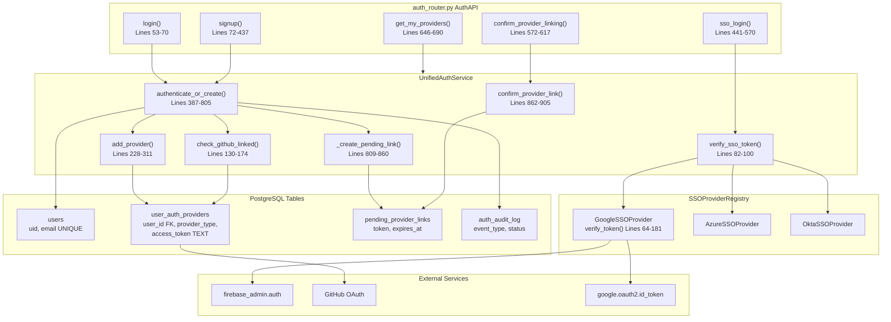
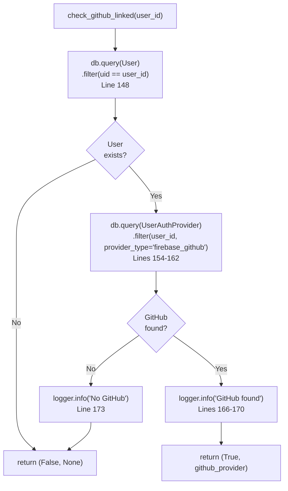
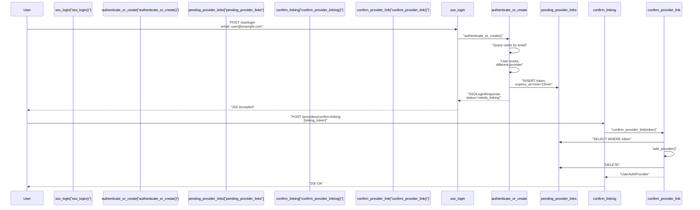
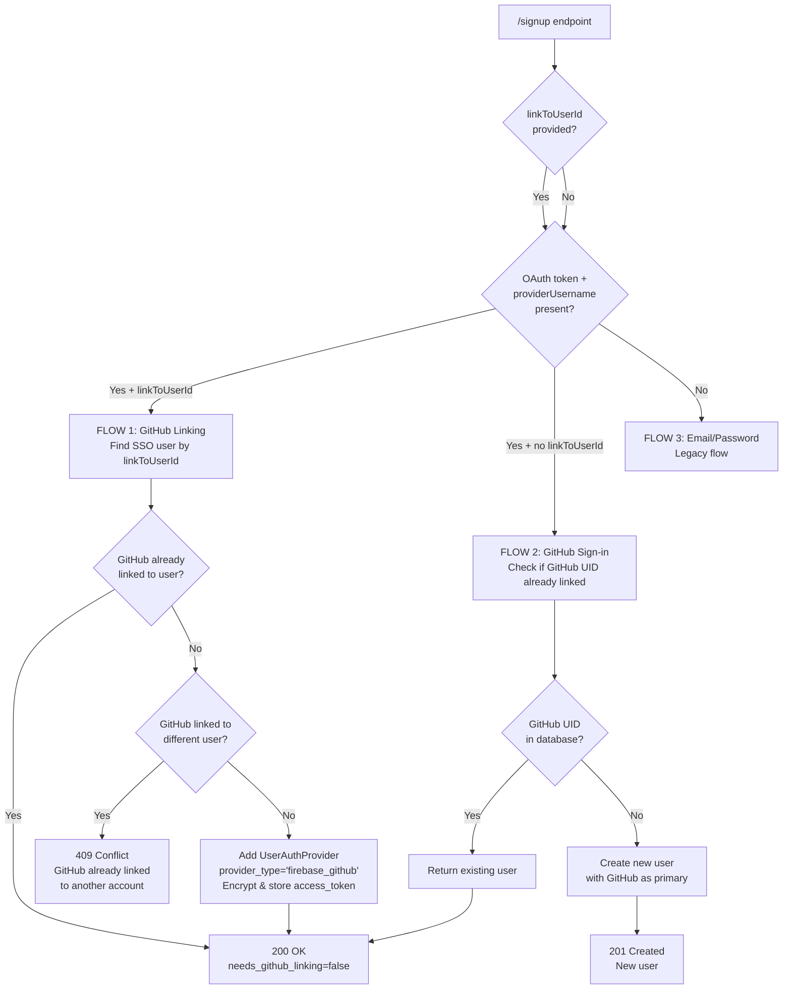
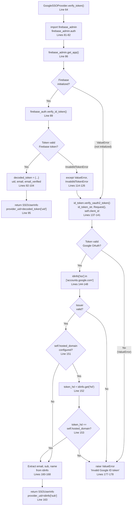
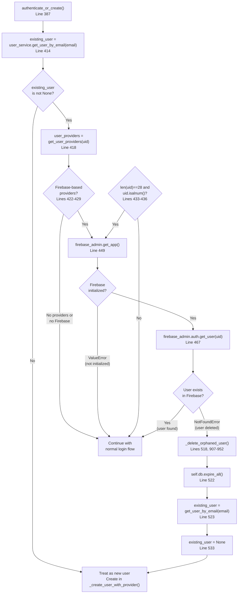
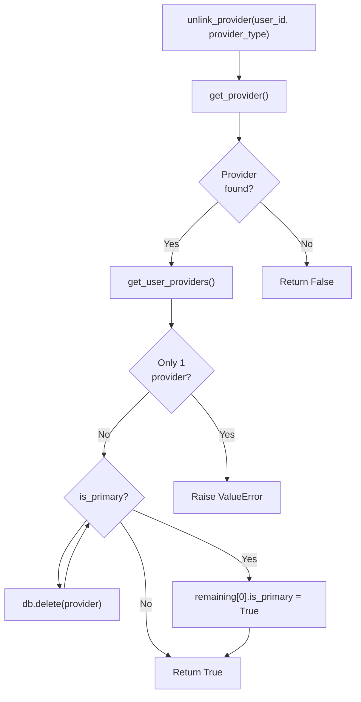

7.1-Multi-Provider Authentication

# Page: Multi-Provider Authentication

# Multi-Provider Authentication

<details>
<summary>Relevant source files</summary>

The following files were used as context for generating this wiki page:

- [app/modules/auth/auth_router.py](app/modules/auth/auth_router.py)
- [app/modules/auth/auth_schema.py](app/modules/auth/auth_schema.py)
- [app/modules/auth/sso_providers/google_provider.py](app/modules/auth/sso_providers/google_provider.py)
- [app/modules/auth/unified_auth_service.py](app/modules/auth/unified_auth_service.py)
- [app/modules/code_provider/github/github_service.py](app/modules/code_provider/github/github_service.py)
- [app/modules/users/user_schema.py](app/modules/users/user_schema.py)

</details>


## Overview

The Multi-Provider Authentication system enables users to authenticate through multiple identity providers while maintaining a single Potpie account. The system is orchestrated by `UnifiedAuthService` [app/modules/auth/unified_auth_service.py:57-1010](), which supports five authentication methods:

1. **Firebase GitHub OAuth** (`PROVIDER_TYPE_FIREBASE_GITHUB`) - Primary developer authentication
2. **Firebase Email/Password** (`PROVIDER_TYPE_FIREBASE_EMAIL`) - Legacy authentication
3. **Google SSO** (`PROVIDER_TYPE_SSO_GOOGLE`) - Google Workspace/Gmail via `GoogleSSOProvider`
4. **Azure SSO** (`PROVIDER_TYPE_SSO_AZURE`) - Microsoft Azure AD
5. **Okta SSO** (`PROVIDER_TYPE_SSO_OKTA`) - Enterprise Okta authentication

All providers use email as the unique identifier for account merging. OAuth tokens are encrypted using Fernet symmetric encryption before storage in the `user_auth_providers` table. The critical business rule enforced by `check_github_linked()` [app/modules/auth/unified_auth_service.py:130-174]() is that all users must link GitHub before accessing repositories.

Sources: [app/modules/auth/unified_auth_service.py:57-76](), [app/modules/auth/unified_auth_service.py:22-27](), [app/modules/auth/unified_auth_service.py:130-174]()

## Architecture

**Multi-Provider Authentication Architecture**



Sources: [app/modules/auth/auth_router.py:52-690](), [app/modules/auth/unified_auth_service.py:57-905](), [app/modules/auth/sso_providers/google_provider.py:23-181]()

## Core Components

### UnifiedAuthService Class

The `UnifiedAuthService` class [app/modules/auth/unified_auth_service.py:57-1010]() orchestrates all authentication flows. It maintains single user identity across providers using email as the unique identifier.

**Core Methods:**

| Method | Lines | Purpose |
|--------|-------|---------|
| `authenticate_or_create()` | 387-805 | Core flow: login existing user, create pending link, or create new user based on email |
| `verify_sso_token()` | 82-100 | Delegates to `GoogleSSOProvider`, `AzureSSOProvider`, etc. for ID token verification |
| `check_github_linked()` | 130-174 | Queries `user_auth_providers` for `provider_type='firebase_github'`. Returns `(bool, Optional[UserAuthProvider])` |
| `add_provider()` | 228-311 | Creates `UserAuthProvider` with encrypted tokens. Sets `is_primary=True` if first provider |
| `unlink_provider()` | 332-376 | Deletes provider record. Raises `ValueError` if last provider. Auto-promotes another to primary |
| `set_primary_provider()` | 313-330 | Updates `is_primary` flag, unsets all others |
| `get_user_providers()` | 104-113 | Returns providers ordered by `is_primary DESC, linked_at DESC` |
| `confirm_provider_link()` | 862-905 | Completes pending link, calls `add_provider()`, deletes `pending_provider_links` record |
| `_create_pending_link()` | 809-860 | Creates pending link with 15-minute TTL using `secrets.token_urlsafe(32)` |

**Provider Type Constants [Lines 22-27]():**

```python
PROVIDER_TYPE_FIREBASE_GITHUB = "firebase_github"
PROVIDER_TYPE_FIREBASE_EMAIL = "firebase_email_password"
PROVIDER_TYPE_SSO_GOOGLE = "sso_google"
PROVIDER_TYPE_SSO_AZURE = "sso_azure"
PROVIDER_TYPE_SSO_OKTA = "sso_okta"
```

The service stores provider data in `user_auth_providers` table with columns: `provider_type`, `provider_uid`, `provider_data` (JSONB), encrypted `access_token` (via `encrypt_token()`), and audit fields (`linked_at`, `last_used_at`, `linked_by_ip`, `linked_by_user_agent`).

Sources: [app/modules/auth/unified_auth_service.py:57-311](), [app/modules/auth/unified_auth_service.py:22-27]()

### SSO Provider Registry

The `SSOProviderRegistry` implements a singleton registry pattern. Each provider implements `BaseSSOProvider` with `verify_token()` method.

**Supported Providers:**

| Provider | Implementation | Verification Method | Lines |
|----------|----------------|---------------------|-------|
| Google | `GoogleSSOProvider` | `firebase_admin.auth.verify_id_token()` or `google.oauth2.id_token.verify_oauth2_token()` | 64-181 |
| Azure | `AzureSSOProvider` | Azure AD ID token verification | - |
| Okta | `OktaSSOProvider` | Okta ID token verification | - |

**BaseSSOProvider Interface:**

```python
class BaseSSOProvider:
    @property
    def provider_name(self) -> str
    
    async def verify_token(self, id_token: str) -> SSOUserInfo
    def get_authorization_url(self, redirect_uri: str, ...) -> str
    def get_required_config_keys(self) -> list
    def validate_config(self) -> bool
```

**SSOUserInfo Dataclass:**

```python
@dataclass
class SSOUserInfo:
    email: str
    email_verified: bool
    provider_uid: str  # Firebase UID or provider sub
    display_name: Optional[str]
    raw_data: Dict[str, Any]
```

Initialized in `UnifiedAuthService.__init__()` [Lines 68-76]() via `SSOProviderRegistry.get_all_providers()`.

Sources: [app/modules/auth/sso_providers/google_provider.py:23-181](), [app/modules/auth/unified_auth_service.py:68-80]()

### GitHub Linking Requirement

All users must link GitHub to access repositories. The `check_github_linked()` method [app/modules/auth/unified_auth_service.py:130-174]() validates this during authentication.

**check_github_linked() Flow:**



**Integration:**

When `check_github_linked()` returns `(False, None)`, `SSOLoginResponse.needs_github_linking` is set to `True` [app/modules/auth/auth_schema.py:86-88](). This occurs at:

1. **Existing user login** [Lines 569-609]() - After provider authentication, before completing login
2. **New user signup** [Lines 774-805]() - New SSO users don't have GitHub by default
3. **Race condition path** [Lines 699-721]() - Double-check during concurrent creation

**signup() Endpoint Flows [app/modules/auth/auth_router.py:72-437]():**

1. **GitHub Linking** (Lines 149-279) - `linkToUserId` provided, links GitHub to existing SSO user
2. **GitHub Sign-in** (Lines 286-381) - No `linkToUserId`, checks if GitHub UID in `user_auth_providers`
3. **Email/Password** (Lines 386-437) - Legacy flow, always sets `needs_github_linking=True`

Sources: [app/modules/auth/unified_auth_service.py:130-174](), [app/modules/auth/unified_auth_service.py:569-805](), [app/modules/auth/auth_router.py:72-437](), [app/modules/auth/auth_schema.py:86-88]()

### Token Encryption

OAuth tokens (`access_token`, `refresh_token`) are encrypted before storage using Fernet symmetric encryption. The `encrypt_token()` and `decrypt_token()` functions use the `ENCRYPTION_KEY` environment variable.

**Encryption in add_provider() [Lines 254-264]():**

```python
# Encrypt tokens before storing
encrypted_access_token = (
    encrypt_token(provider_create.access_token)
    if provider_create.access_token
    else None
)
encrypted_refresh_token = (
    encrypt_token(provider_create.refresh_token)
    if provider_create.refresh_token
    else None
)

# Store in UserAuthProvider
new_provider = UserAuthProvider(
    user_id=user_id,
    access_token=encrypted_access_token,  # Stored as encrypted string
    refresh_token=encrypted_refresh_token,
    # ...
)
```

**Decryption in get_decrypted_access_token() [Lines 176-199]():**

```python
def get_decrypted_access_token(
    self, user_id: str, provider_type: str
) -> Optional[str]:
    provider = self.get_provider(user_id, provider_type)
    if not provider or not provider.access_token:
        return None
    
    try:
        # Try to decrypt (token is encrypted)
        return decrypt_token(provider.access_token)
    except Exception:
        # Token might be plaintext (from before encryption)
        logger.warning(
            f"Failed to decrypt token for user {user_id}, "
            "Assuming plaintext token (backward compatibility)."
        )
        return provider.access_token  # Return plaintext
```

Backward compatibility: If `decrypt_token()` raises exception, returns plaintext token (legacy pre-encryption tokens).

**Token Retrieval Methods:**

| Method | Lines | Purpose |
|--------|-------|---------|
| `get_decrypted_access_token()` | 176-199 | Retrieve and decrypt OAuth access token |
| `get_decrypted_refresh_token()` | 201-226 | Retrieve and decrypt OAuth refresh token |

**GitHub Token Retrieval:**

`GithubService.get_github_oauth_token()` [app/modules/code_provider/github/github_service.py:184-247]() queries `user_auth_providers` for `provider_type='firebase_github'` and decrypts token. Fallback to legacy `user.provider_info` field.

Sources: [app/modules/auth/unified_auth_service.py:176-265](), [app/modules/code_provider/github/github_service.py:184-247]()

### Database Schema

Four PostgreSQL tables support multi-provider authentication:

**users table:**
- Primary key: `uid` (Firebase UID or UUID)
- Columns: `email` (UNIQUE), `display_name`, `email_verified`, `created_at`, `last_login_at`, `provider_info` (legacy JSONB), `provider_username` (legacy)
- Email is the canonical identifier for account merging

**user_auth_providers table:**
- Links users to providers
- Columns: `id` (UUID PK), `user_id` (FK to users.uid), `provider_type` (VARCHAR), `provider_uid` (VARCHAR UNIQUE), `provider_data` (JSONB), `access_token` (TEXT encrypted), `refresh_token` (TEXT encrypted), `token_expires_at`, `is_primary` (BOOLEAN), `linked_at`, `last_used_at`, `linked_by_ip`, `linked_by_user_agent`
- Constraints:
  - UNIQUE `(user_id, provider_type)` - One provider type per user
  - UNIQUE `provider_uid` - Prevents duplicate provider account linking

**pending_provider_links table:**
- Temporary storage for linking confirmation
- Columns: `id` (UUID PK), `user_id` (FK), `provider_type`, `provider_uid`, `provider_data` (JSONB), `token` (VARCHAR via `secrets.token_urlsafe(32)`), `expires_at` (now + 15 min), `ip_address`, `user_agent`, `created_at`
- `LINKING_TOKEN_EXPIRY_MINUTES = 15` [Line 19]()

**auth_audit_log table:**
- Audit trail for auth events
- Columns: `id` (UUID PK), `user_id` (FK), `event_type`, `provider_type`, `status`, `ip_address`, `user_agent`, `error_message`, `created_at`
- Event types: 'login', 'signup', 'link_provider', 'unlink_provider', 'needs_linking', 'login_blocked_github'

Sources: [app/modules/auth/unified_auth_service.py:18-19]()

### Provider Linking Workflow

When a user authenticates with an unlinked provider, the system creates a `PendingProviderLink`:

**Pending Provider Link Flow:**



Token expires after 15 minutes. Cancel via `DELETE /providers/cancel-linking/{linking_token}`.

Sources: [app/modules/auth/unified_auth_service.py:809-905](), [app/modules/auth/auth_router.py:441-617]()

## Authentication Flows

### SSO Authentication Flow

SSO authentication supports Google, Azure, Okta via unified `/sso/login` endpoint.

**SSO Login Sequence**

```mermaid
sequenceDiagram
    participant Client
    participant AuthRouter["auth_router.py<br/>sso_login()"]
    participant UnifiedAuth["UnifiedAuthService<br/>Line 457"]
    participant SSOProvider["GoogleSSOProvider<br/>verify_token()"]
    participant FirebaseAdmin["firebase_admin.auth<br/>verify_id_token()"]
    participant GoogleOAuth["google.oauth2<br/>id_token.verify_oauth2_token()"]
    participant DB["PostgreSQL"]
    
    Client->>sso_login: "POST /sso/login"
    sso_login->>sso_login: "Get IP, User-Agent L460-461"
    sso_login->>sso_login: "provider_type='sso_google' L464"
    sso_login->>verify_sso_token: "verify_sso_token('google') L467"
    verify_sso_token->>GoogleSSOProvider: "verify_token(id_token)"
    
    GoogleSSOProvider->>firebase_admin: "firebase_admin.auth.verify_id_token() L86-112"
    alt "Firebase token"
        firebase_admin-->>GoogleSSOProvider: "decoded_token"
        GoogleSSOProvider-->>verify_sso_token: "SSOUserInfo<br/>provider_uid=Firebase UID L95"
    else "Google OAuth token"
        GoogleSSOProvider->>google_oauth2: "id_token.verify_oauth2_token() L137-141"
        google_oauth2-->>GoogleSSOProvider: "idinfo {sub, email}"
        GoogleSSOProvider->>GoogleSSOProvider: "Verify issuer L144-148"
        GoogleSSOProvider-->>verify_sso_token: "SSOUserInfo<br/>provider_uid=sub L163"
    end
    
    verify_sso_token->>authenticate_or_create: "authenticate_or_create() L519"
    authenticate_or_create->>users: "SELECT WHERE email"
    
    alt "User exists with provider"
        authenticate_or_create->>check_github_linked: "check_github_linked() L569"
        check_github_linked->>user_auth_providers: "SELECT WHERE provider_type='firebase_github'"
        alt "GitHub linked"
            authenticate_or_create->>users: "UPDATE last_login_at L626"
            authenticate_or_create-->>sso_login: "status='success'<br/>needs_github_linking=False"
            sso_login-->>Client: "200 OK"
        else "GitHub NOT linked"
            authenticate_or_create-->>sso_login: "status='success'<br/>needs_github_linking=True L601-608"
            sso_login-->>Client: "202 Accepted"
        end
    else "User exists, different provider"
        authenticate_or_create->>_create_pending_link: "_create_pending_link() L652"
        _create_pending_link->>pending_provider_links: "INSERT token, expires_at"
        authenticate_or_create-->>sso_login: "status='needs_linking' L672-679"
        sso_login-->>Client: "202 Accepted"
    else "New user"
        authenticate_or_create->>_create_user_with_provider: "_create_user_with_provider() L762"
        _create_user_with_provider->>users: "INSERT"
        _create_user_with_provider->>user_auth_providers: "INSERT"
        authenticate_or_create-->>sso_login: "status='new_user'<br/>needs_github_linking=True L798-805"
        sso_login->>sso_login: "Slack, PostHog L531-543"
        sso_login-->>Client: "202 Accepted"
    end
```

The `authenticate_or_create()` method [Lines 387-805]() performs email lookup in `users` table, then: (1) Complete login if provider linked, (2) Create pending link if different provider, (3) Create new user if email not found.

Sources: [app/modules/auth/auth_router.py:441-570](), [app/modules/auth/unified_auth_service.py:82-100](), [app/modules/auth/unified_auth_service.py:387-805](), [app/modules/auth/sso_providers/google_provider.py:64-181]()

### GitHub Signup and Linking

The `signup()` endpoint [Lines 72-437]() handles three flows:

**GitHub Authentication Flow**



**Flow 1 - GitHub Linking (Lines 149-279):**
Links GitHub to existing SSO user. Request includes `linkToUserId` (SSO user UID) and `githubFirebaseUid` (GitHub Firebase UID). Steps:
1. Validate SSO user exists
2. Check if GitHub already linked (returns 200 if yes)
3. Check if GitHub UID linked to different user (returns 409 Conflict)
4. Create `UserAuthProvider` with `provider_type='firebase_github'`
5. Encrypt and store OAuth access token

**Flow 2 - GitHub Sign-in (Lines 286-381):**
Direct GitHub authentication. Queries `user_auth_providers` for GitHub UID. If found, returns user. If not found, creates new user with GitHub as primary.

**Flow 3 - Email/Password (Lines 386-437):**
Legacy authentication. New users have `needs_github_linking=True`.

Sources: [app/modules/auth/auth_router.py:72-437]()

### Google SSO Token Verification

`GoogleSSOProvider.verify_token()` [Lines 64-181]() supports Firebase ID tokens and Google OAuth tokens:

**GoogleSSOProvider.verify_token() Flow**



Two-stage verification:

1. **Firebase ID tokens** (issuer: `securetoken.google.com/{project_id}`)
   - Verified via `firebase_admin.auth.verify_id_token()` [Line 89]()
   - Returns Firebase UID as `provider_uid` [Line 95]()

2. **Google OAuth tokens** (issuer: `accounts.google.com`)
   - Verified via `google.oauth2.id_token.verify_oauth2_token()` [Lines 137-141]()
   - Returns Google `sub` as `provider_uid` [Line 163]()

**Configuration:**
- `client_id`: Google OAuth Client ID (env: `GOOGLE_SSO_CLIENT_ID`) [Lines 54-56]()
- `hosted_domain`: Restrict to Workspace domain (env: `GOOGLE_SSO_HOSTED_DOMAIN`) [Lines 60-62]()

If `hosted_domain` set (e.g., `"acme.com"`), token `hd` claim must match.

Sources: [app/modules/auth/sso_providers/google_provider.py:64-181](), [app/modules/auth/sso_providers/google_provider.py:42-62]()

## API Endpoints

### Authentication Endpoints

| Endpoint | Method | Handler | Lines | Auth |
|----------|--------|---------|-------|------|
| `/login` | POST | `login()` | 53-70 | Public |
| `/signup` | POST | `signup()` | 72-437 | Public |
| `/sso/login` | POST | `sso_login()` | 441-570 | Public |
| `/providers/confirm-linking` | POST | `confirm_provider_linking()` | 572-617 | linking_token |
| `/providers/cancel-linking/{token}` | DELETE | `cancel_provider_linking()` | 619-644 | Public |
| `/providers/me` | GET | `get_my_providers()` | 646-690 | Bearer |
| `/providers/set-primary` | POST | `set_primary_provider()` | 692-731 | Bearer |
| `/providers/unlink` | DELETE | `unlink_provider()` | 733-781 | Bearer |
| `/account/me` | GET | `get_my_account()` | 783-837 | Bearer |

**SSOLoginRequest [app/modules/auth/auth_schema.py:66-73]():**

```json
{
  "email": "user@example.com",
  "sso_provider": "google",
  "id_token": "eyJhbGciOiJSUzI1NiIs...",
  "provider_data": {
    "name": "John Doe",
    "picture": "https://..."
  }
}
```

**SSOLoginResponse (Success) [Lines 75-88]():**

```json
{
  "status": "success",
  "user_id": "uid123",
  "email": "user@example.com",
  "display_name": "John Doe",
  "access_token": null,
  "message": "Login successful",
  "linking_token": null,
  "existing_providers": null,
  "needs_github_linking": false
}
```

**SSOLoginResponse (Needs Linking) [Lines 75-88]():**

```json
{
  "status": "needs_linking",
  "user_id": "uid123",
  "email": "user@example.com",
  "display_name": "John Doe",
  "message": "Account exists with firebase_github. Link this provider?",
  "linking_token": "Xy7k9pL2mN8qR4vT6wZ1aB3cD5eF0gH2iJ4kL6mN8pQ0rS2tU4vW6xY8zA1bC3",
  "existing_providers": ["firebase_github"],
  "needs_github_linking": false
}
```

**SSOLoginResponse (New User) [Lines 75-88]():**

```json
{
  "status": "new_user",
  "user_id": "uid456",
  "email": "newuser@example.com",
  "display_name": "Jane Smith",
  "message": "Account created successfully",
  "linking_token": null,
  "existing_providers": null,
  "needs_github_linking": true
}
```

**Status Codes:**
- `200 OK` - User authenticated successfully with GitHub linked (`status='success'`)
- `202 Accepted` - User needs to link GitHub (`needs_github_linking=true`) or confirm provider linking (`status='needs_linking'`)
- `400 Bad Request` - Invalid request (validation error)
- `401 Unauthorized` - Invalid or expired SSO token
- `403 Forbidden` - Personal email blocked for new signups
- `500 Internal Server Error` - Server error during authentication

Sources: [app/modules/auth/auth_router.py:441-570](), [app/modules/auth/auth_schema.py:66-88]()

### Provider Management

**GET /providers/me:**

Returns all linked providers:

```json
{
  "providers": [
    {
      "id": "uuid",
      "user_id": "uid123",
      "provider_type": "firebase_github",
      "provider_uid": "github_uid",
      "is_primary": true,
      "linked_at": "2024-01-01T00:00:00Z",
      "last_used_at": "2024-01-15T10:30:00Z"
    },
    {
      "id": "uuid",
      "user_id": "uid123",
      "provider_type": "sso_google",
      "provider_uid": "google_sub",
      "is_primary": false,
      "linked_at": "2024-01-10T00:00:00Z"
    }
  ],
  "primary_provider": {
    "id": "uuid",
    "provider_type": "firebase_github",
    "is_primary": true
  }
}
```

**DELETE /providers/unlink [Lines 733-781]():**

Request [app/modules/auth/auth_schema.py:110-114]():
```json
{
  "provider_type": "sso_google"
}
```

**Flow:**

1. Extract user_id from Bearer token via `auth_handler.check_auth()` [Lines 741-748]()
2. Call `unified_auth.unlink_provider()` [Lines 754-757]()
3. Return 200 OK or error

**Constraints in unlink_provider() [Lines 332-376]():**

```python
# Line 345: Check if this is the only provider
all_providers = self.get_user_providers(user_id)
if len(all_providers) <= 1:
    raise ValueError("Cannot unlink the only authentication provider")

# Line 354: Save primary status
was_primary = provider.is_primary

# Line 357: Delete the provider
self.db.delete(provider)

# Lines 361-365: If it was primary, set another as primary
if was_primary:
    remaining = self.get_user_providers(user_id)
    if remaining:
        remaining[0].is_primary = True
        self.db.commit()
```

**Response Codes:**
- `200 OK` - Provider unlinked successfully
- `400 Bad Request` - Cannot unlink last provider (ValueError)
- `401 Unauthorized` - Missing or invalid auth token
- `404 Not Found` - Provider not found for user

Sources: [app/modules/auth/auth_router.py:733-781](), [app/modules/auth/unified_auth_service.py:332-376]()

## Orphaned User Cleanup

Orphaned users (exist in PostgreSQL but not Firebase) are detected and cleaned during authentication [Lines 439-545]().

**Orphaned User Cleanup Flow:**



**Scenarios:**

1. User deleted from Firebase Console, still in PostgreSQL
2. Firebase project reset, database retained
3. Dev/staging DB synced with production Firebase
4. Manual Firebase user deletion without DB cleanup

**_delete_orphaned_user() Implementation [Lines 907-952]():**

```python
```python
# Delete cascade: UserAuthProvider, PendingProviderLink, Project, Conversation
self.db.query(UserAuthProvider).filter(user_id == user_uid).delete()  # L920
self.db.query(PendingProviderLink).filter(user_id == user_uid).delete()  # L925
self.db.query(Project).filter(user_id == user_uid).delete()  # L931
self.db.query(Conversation).filter(user_id == user_uid).delete()  # L936
self.db.delete(user_obj)  # L946
self.db.commit()  # L949
```

**Cleanup Process:**
1. `firebase_admin.auth.get_user()` raises `NotFoundError` [Line 472]()
2. Log warning [Lines 512-515]()
3. Call `_delete_orphaned_user()` [Line 518]()
4. `db.expire_all()` [Line 522]()
5. Re-query to verify deletion [Line 523]()
6. Set `existing_user = None` to trigger new user creation [Line 533]()

Sources: [app/modules/auth/unified_auth_service.py:439-545](), [app/modules/auth/unified_auth_service.py:907-952]()

## Provider Management Operations

### Setting Primary Provider

Only one provider can be primary. Primary provider determines displayed email. When user signs in with non-primary provider, system auto-sets it as primary [Lines 612-622]().

**set_primary_provider() [Lines 313-330]():**

```python
# Unset all other primary providers
db.query(UserAuthProvider).filter(user_id == user_id).update({"is_primary": False})

# Set this as primary
provider.is_primary = True
db.commit()
```

Sources: [app/modules/auth/unified_auth_service.py:313-330](), [app/modules/auth/unified_auth_service.py:612-622]()

### Unlinking Providers

Unlink via `/providers/unlink`. Must keep at least one provider.

**unlink_provider() Validation:**



Sources: [app/modules/auth/unified_auth_service.py:332-376]()

### GitHub Token Retrieval

`GithubService.get_github_oauth_token()` [app/modules/code_provider/github/github_service.py:184-247]() implements two-tier fallback:

**Token Retrieval:**

```python
def get_github_oauth_token(self, uid: str) -> Optional[str]:
    """
    Get user's GitHub OAuth token from UserAuthProvider (new) 
    or provider_info (legacy).
    """
    user = self.db.query(User).filter(User.uid == uid).first()
    if user is None:
        raise HTTPException(status_code=404, detail="User not found")
    
    # Priority 1: Try new UserAuthProvider system (Lines 199-225)
    github_provider = (
        self.db.query(UserAuthProvider)
        .filter(
            UserAuthProvider.user_id == uid,
            UserAuthProvider.provider_type == "firebase_github",
        )
        .first()
    )
    if github_provider and github_provider.access_token:
        logger.info("Found GitHub token in UserAuthProvider for user %s", uid)
        # Decrypt token before returning
        try:
            decrypted_token = decrypt_token(github_provider.access_token)
            return decrypted_token
        except Exception as e:
            logger.warning(
                "Failed to decrypt GitHub token for user %s: %s. "
                "Assuming plaintext token (backward compatibility).",
                uid, str(e),
            )
            # Token might be plaintext (from before encryption)
            return github_provider.access_token
    
    # Priority 2: Fallback to legacy provider_info system (Lines 229-245)
    if user.provider_info is None:
        logger.warning("User %s has no provider_info", uid)
        return None
    
    if not isinstance(user.provider_info, dict):
        logger.warning("User %s provider_info is not a dict", uid)
        return None
    
    access_token = user.provider_info.get("access_token")
    if not access_token:
        logger.warning("User %s has no access_token in provider_info", uid)
        return None
    
    return access_token
```

**Token Usage in Repository Operations:**

The decrypted token is used throughout `GithubService` for:

1. **Repository Listing** [Lines 267-580]() - `get_repos_for_user()` uses token to fetch user's GitHub installations and repositories
2. **File Content Retrieval** [Lines 103-168]() - `get_file_content()` with authenticated access
3. **Branch Operations** [Lines 630-687]() - `get_branch_list()` for repository branches
4. **Commit Operations** - Various Git operations requiring authentication

**Fallback Chain for Repository Access:**

In `get_repos_for_user()` [Lines 267-363](), if no user OAuth token is found:

1. Try `GH_TOKEN_LIST` environment variable (PAT pool) [Lines 345-350]()
2. Fall back to `CODE_PROVIDER_TOKEN` [Lines 353-357]()
3. Raise HTTPException if no auth available [Lines 359-363]()

Sources: [app/modules/code_provider/github/github_service.py:184-247](), [app/modules/code_provider/github/github_service.py:267-363]()

## Error Handling

The authentication service implements comprehensive error handling:

### Login Errors

- **Invalid Credentials**: Returns 401 with "Invalid email or password"
- **Network Errors**: Returns 400 with connection error details
- **Firebase Errors**: Returns specific Firebase error messages

### Authentication Middleware Errors

- **Missing Token**: Returns 401 "Bearer authentication is needed"
- **Invalid Token**: Returns 401 "Invalid authentication from Firebase"
- **Expired Token**: Returns 401 with Firebase verification error

### User Creation Errors

- **Database Errors**: Handled with transaction rollback
- **Duplicate Users**: Managed through `get_user_by_uid()` checks
- **External Service Failures**: Logged but don't block user creation

Sources: [app/modules/auth/auth_router.py:42-51](), [app/modules/auth/auth_service.py:65-81](), [app/modules/users/user_service.py:79-84]()