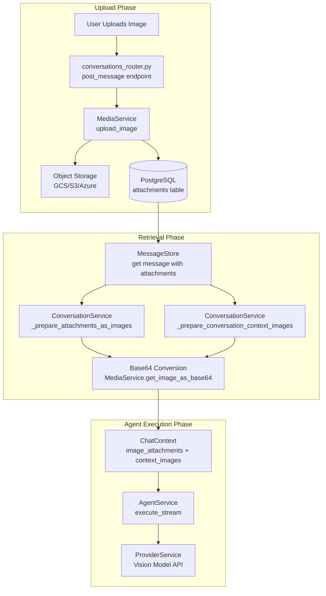
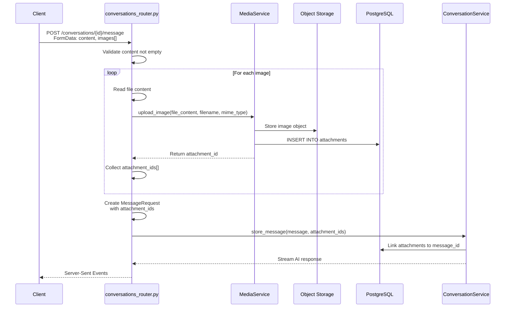
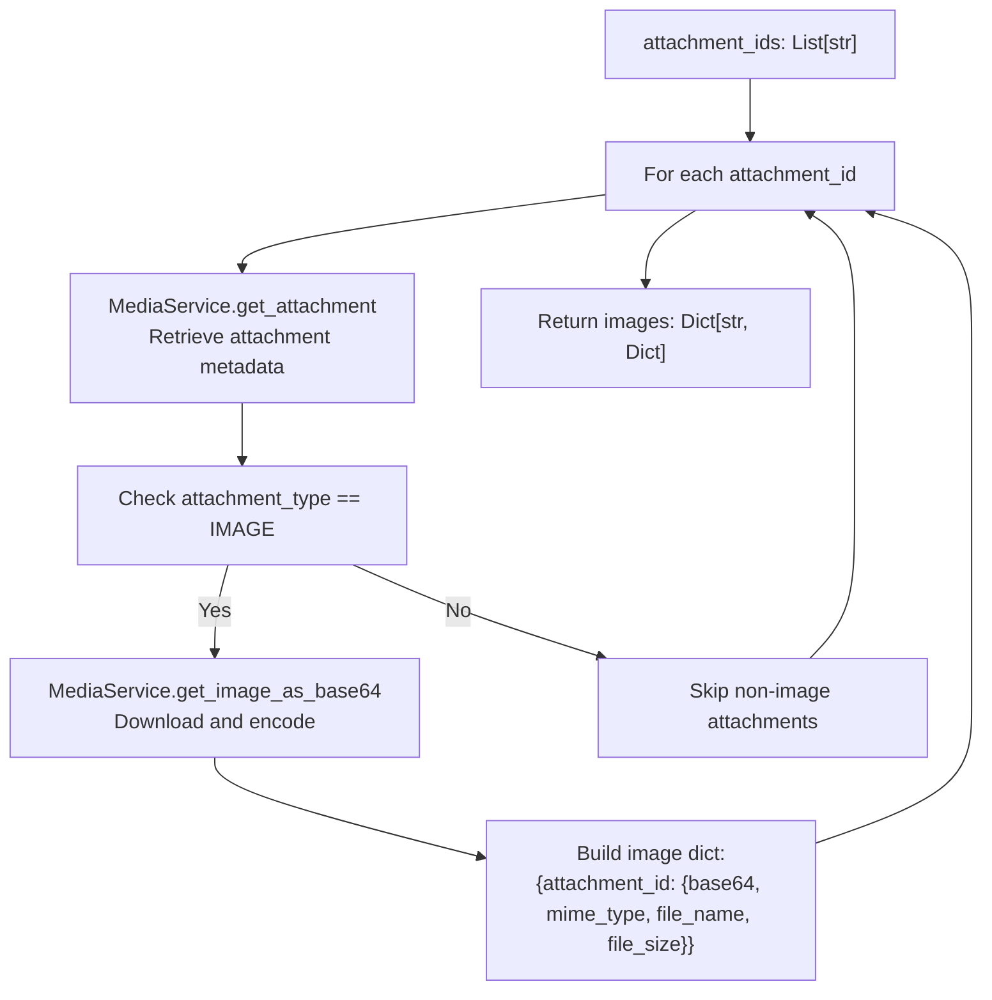
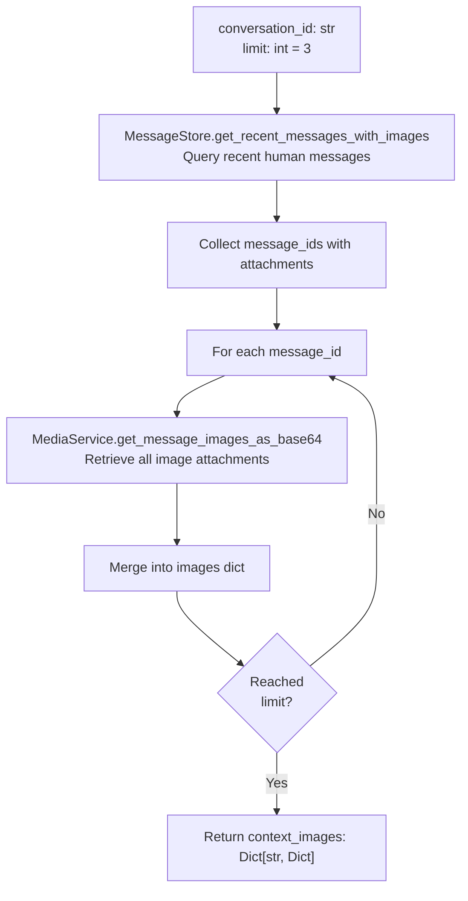
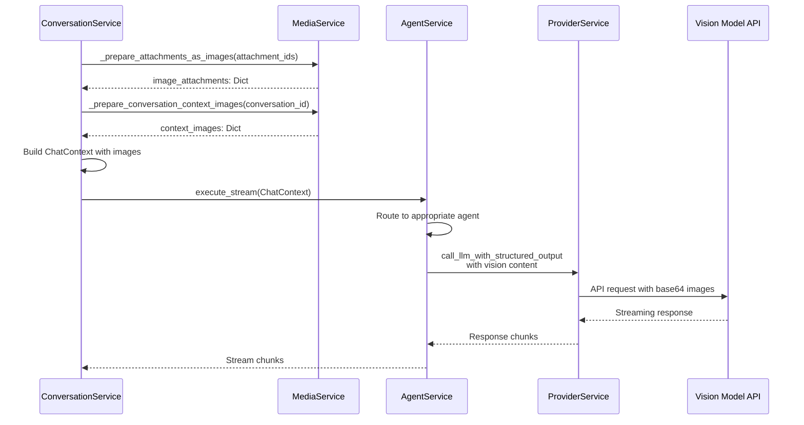
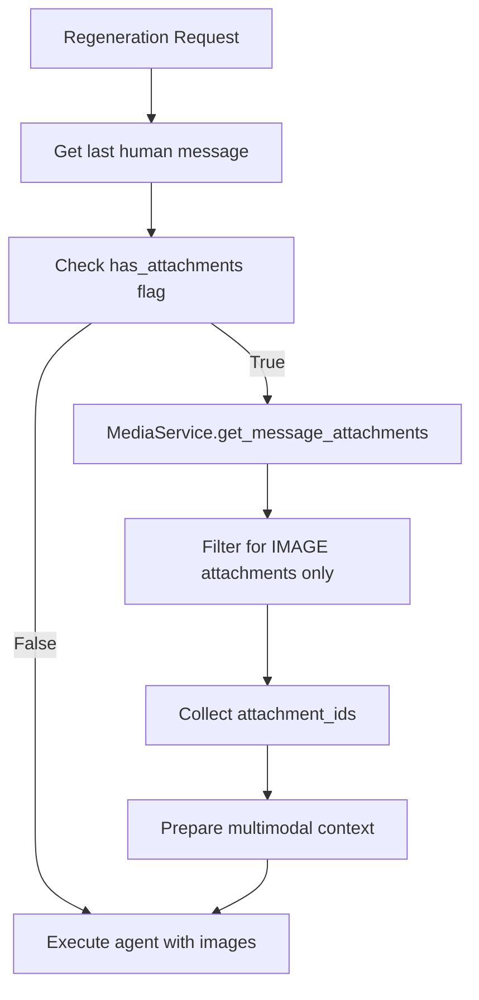

3.3-Multimodal Support

# Page: Multimodal Support

# Multimodal Support

<details>
<summary>Relevant source files</summary>

The following files were used as context for generating this wiki page:

- [app/modules/conversations/conversation/conversation_controller.py](app/modules/conversations/conversation/conversation_controller.py)
- [app/modules/conversations/conversation/conversation_schema.py](app/modules/conversations/conversation/conversation_schema.py)
- [app/modules/conversations/conversation/conversation_service.py](app/modules/conversations/conversation/conversation_service.py)
- [app/modules/conversations/conversations_router.py](app/modules/conversations/conversations_router.py)

</details>


## Purpose and Scope

This document describes the multimodal support system in Potpie's conversation platform, focusing on image attachment handling, vision model integration, and multimodal context preparation. The system enables users to include images in their messages, which are then processed and provided to AI agents for visual analysis alongside text queries.

For information about general conversation management and message handling, see [Conversation Service and Lifecycle](#3.1). For details on agent execution with multimodal inputs, see [Agent Execution Pipeline](#2.5).

## System Overview

The multimodal support system handles three primary workflows:

1. **Image Upload and Storage**: Images uploaded by users are stored via `MediaService` and linked to messages through attachment records
2. **Multimodal Context Preparation**: Attachments are retrieved and converted to base64-encoded images for AI processing
3. **Vision Model Integration**: Prepared images are passed to agents through `ChatContext` for multimodal inference



**Sources**: [app/modules/conversations/conversation/conversation_service.py:1-1323](), [app/modules/conversations/conversations_router.py:160-286]()

## Image Attachment Upload

### Upload Endpoint

The `/conversations/{conversation_id}/message/` endpoint accepts image uploads as multipart form data. Images are processed before the message is stored, and attachment IDs are associated with the message record.

| Parameter | Type | Description |
|-----------|------|-------------|
| `content` | `str` (Form) | Message text content |
| `node_ids` | `Optional[str]` (Form) | JSON array of node IDs for context |
| `images` | `Optional[List[UploadFile]]` (File) | Image files to attach |
| `stream` | `bool` (Query) | Whether to stream the response |



**Sources**: [app/modules/conversations/conversations_router.py:160-286]()

### Error Handling and Cleanup

If image upload fails for any attachment, all previously uploaded attachments for that request are cleaned up to prevent orphaned records.


**Sources**: [app/modules/conversations/conversations_router.py:214-235]()

## Attachment Storage and Retrieval

### Linking Attachments to Messages

After a message is stored, attachments are linked via the `MediaService.update_message_attachments` method. This creates a many-to-many relationship between messages and attachments.

**Sources**: [app/modules/conversations/conversation/conversation_service.py:569-584]()

### Attachment Data Structure

The `MediaService` returns attachment metadata including:

| Field | Type | Description |
|-------|------|-------------|
| `id` | `str` | Unique attachment identifier |
| `attachment_type` | `AttachmentType.IMAGE` | Type of attachment |
| `mime_type` | `str` | Image MIME type (e.g., `image/png`) |
| `file_name` | `str` | Original filename |
| `file_size` | `int` | Size in bytes |
| `message_id` | `str` | Associated message ID |

**Sources**: [app/modules/conversations/conversation/conversation_service.py:1058-1074]()

## Multimodal Context Preparation

The conversation service prepares multimodal context through three primary methods that convert stored attachments into base64-encoded images suitable for vision model APIs.

### Current Message Images

The `_prepare_attachments_as_images` method converts a list of attachment IDs directly to base64 format:



**Implementation Details**:
- Only processes attachments with `attachment_type.value.upper() == "IMAGE"`
- Logs detailed information about processed vs. skipped attachments
- Returns `None` if no valid images are found
- Continues processing remaining attachments if one fails

**Sources**: [app/modules/conversations/conversation/conversation_service.py:1046-1096]()

### Conversation Context Images

The `_prepare_conversation_context_images` method retrieves recent images from conversation history to provide additional visual context:



**Configuration**:
- Default limit: 3 recent messages with images
- Excludes the current message (handled separately)
- Provides chronological context for multi-turn visual conversations

**Sources**: [app/modules/conversations/conversation/conversation_service.py:1126-1148]()

### Context Assembly

During AI response generation, both current and context images are prepared and combined:

| Context Type | Method | Purpose |
|-------------|---------|---------|
| Current Message | `_prepare_attachments_as_images(attachment_ids)` | Images explicitly uploaded with this message |
| Historical Context | `_prepare_conversation_context_images(conversation_id)` | Recent images from conversation history |

**Sources**: [app/modules/conversations/conversation/conversation_service.py:927-947]()

## Vision Model Integration

### ChatContext Structure

Multimodal data is passed to agents through the `ChatContext` object, which includes:

```python
ChatContext(
    project_id=str,
    project_name=str,
    curr_agent_id=str,
    history=List[str],          # Recent conversation history
    node_ids=List[str],         # Code graph nodes for context
    query=str,                  # User's text query
    image_attachments=Dict,     # Current message images
    context_images=Dict,        # Historical conversation images
    conversation_id=str
)
```

**Sources**: [app/modules/conversations/conversation/conversation_service.py:983-994]()

### Agent Execution Flow



**Conditional Processing**:
- If `image_attachments` or `context_images` exist, agents use vision-enabled models
- The `ProviderService` automatically selects compatible vision models (e.g., GPT-4 Vision, Claude 3)
- Non-vision agents ignore image fields and process only text

**Sources**: [app/modules/conversations/conversation/conversation_service.py:891-1028]()

## Regeneration with Multimodal Context

When regenerating the last AI response, the system retrieves attachments from the previous human message to maintain multimodal context.

### Regeneration Flow



**Implementation Notes**:
- Uses `AttachmentType.IMAGE` filter to exclude non-image attachments
- Logs the number of image attachments found
- Continues regeneration even if attachment retrieval fails (logs warning)
- Maintains consistency with original message's visual context

**Sources**: [app/modules/conversations/conversation/conversation_service.py:703-732](), [app/modules/conversations/conversations_router.py:343-366]()

### Background Regeneration

For background regeneration tasks (via Celery), attachment IDs are passed as task parameters:

```python
execute_regenerate_background.delay(
    conversation_id=conversation_id,
    run_id=run_id,
    user_id=user_id,
    node_ids=node_ids,
    attachment_ids=attachment_ids  # Extracted from last human message
)
```

**Sources**: [app/modules/conversations/conversations_router.py:387-393]()

## Data Flow Summary

The complete multimodal data flow from upload to vision model inference:

| Stage | Component | Input | Output |
|-------|-----------|-------|--------|
| 1. Upload | `conversations_router.post_message` | `List[UploadFile]` | `List[attachment_id]` |
| 2. Storage | `MediaService.upload_image` | File bytes, metadata | Attachment record in DB + object storage |
| 3. Linking | `MediaService.update_message_attachments` | `message_id`, `attachment_ids` | Message-attachment relationships |
| 4. Retrieval | `ConversationService._prepare_attachments_as_images` | `attachment_ids` | `Dict[str, Dict[str, Union[str, int]]]` with base64 data |
| 5. Context | `ConversationService._prepare_conversation_context_images` | `conversation_id`, `limit` | Historical images as base64 dict |
| 6. Execution | `AgentService.execute_stream` | `ChatContext` with images | Streaming AI responses with vision analysis |

**Sources**: [app/modules/conversations/conversation/conversation_service.py:1-1323](), [app/modules/conversations/conversations_router.py:1-622](), [app/modules/media/media_service.py]()