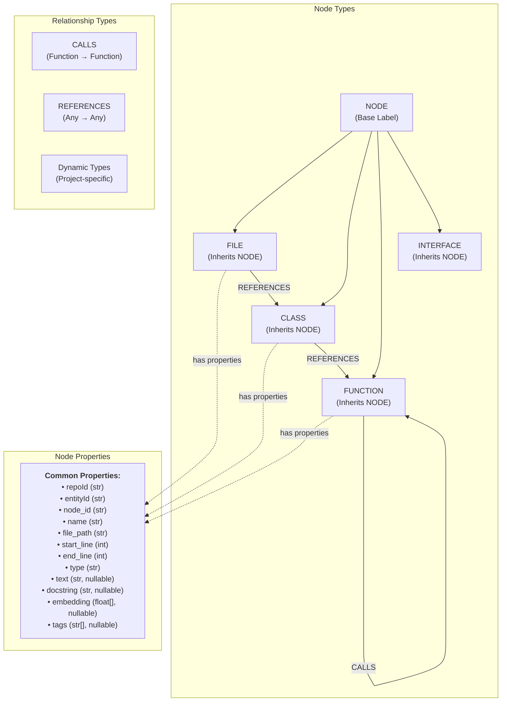
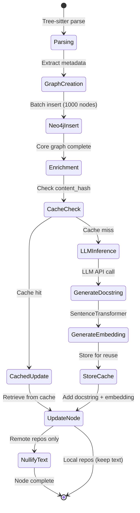
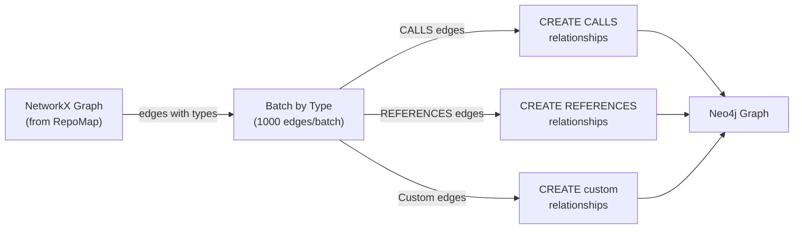
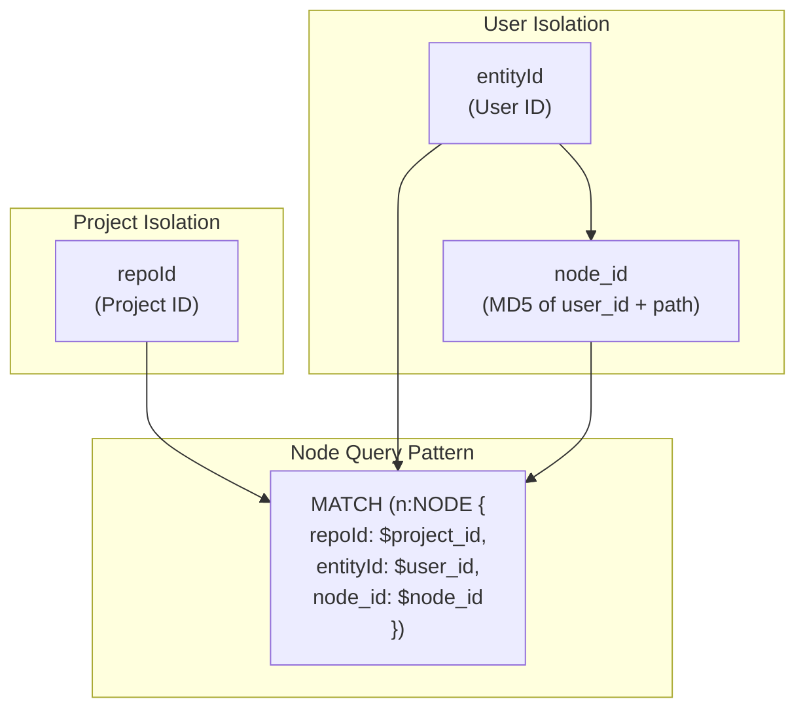
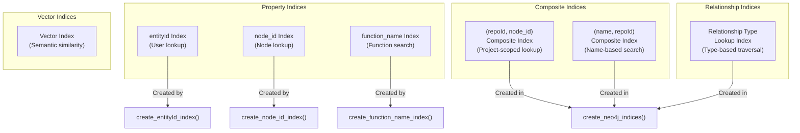
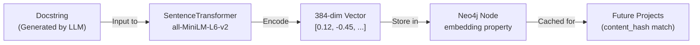
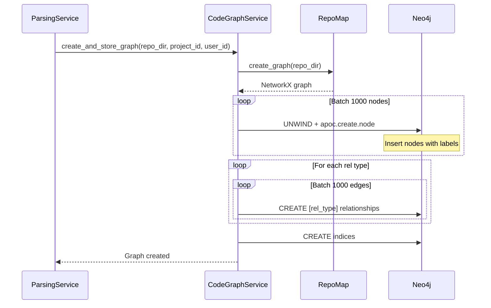
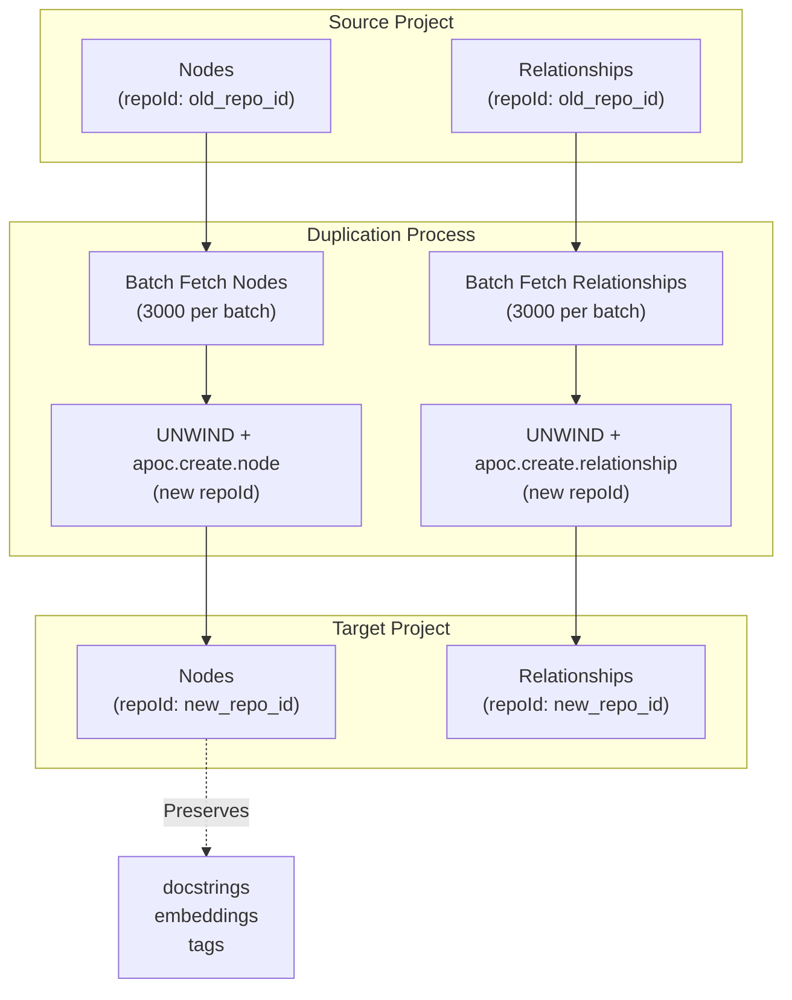

4.3-Neo4j Graph Structure

# Page: Neo4j Graph Structure

# Neo4j Graph Structure

<details>
<summary>Relevant source files</summary>

The following files were used as context for generating this wiki page:

- [app/modules/parsing/graph_construction/code_graph_service.py](app/modules/parsing/graph_construction/code_graph_service.py)
- [app/modules/parsing/graph_construction/parsing_helper.py](app/modules/parsing/graph_construction/parsing_helper.py)
- [app/modules/parsing/graph_construction/parsing_service.py](app/modules/parsing/graph_construction/parsing_service.py)
- [app/modules/parsing/knowledge_graph/inference_service.py](app/modules/parsing/knowledge_graph/inference_service.py)
- [app/modules/projects/projects_service.py](app/modules/projects/projects_service.py)

</details>


## Purpose and Scope

This page documents the Neo4j graph database structure used to store the code knowledge graph in Potpie. It covers node types, relationships, properties, indexing strategy, vector embeddings for semantic search, and the multi-tenant design that enables project isolation.

For information about how the graph is populated, see [Repository Parsing Pipeline](#4.1). For information about AI-powered docstring generation and enrichment, see [Inference and Docstring Generation](#4.2). For tools that query this graph, see [Code Query Tools](#5.2).

---

## Graph Schema Overview

The Neo4j graph represents a parsed codebase as a network of interconnected code entities. Each node represents a code construct (file, class, function), and relationships represent dependencies and references between them.

### Core Schema Diagram



**Sources:** [app/modules/parsing/graph_construction/code_graph_service.py:66-99](), [app/modules/parsing/graph_construction/parsing_service.py:387-466]()

---

## Node Types

The graph uses a hierarchical labeling system where all nodes have the base `NODE` label, plus a specific type label indicating their code construct type.

### Supported Node Types

| Type | Description | Primary Use Case |
|------|-------------|------------------|
| `FILE` | Represents a source code file | Entry point for file-level queries |
| `CLASS` | Represents a class or type definition | Object-oriented structure analysis |
| `FUNCTION` | Represents a function or method | Call graph analysis, entry points |
| `INTERFACE` | Represents an interface definition | Type system analysis |
| `NODE` | Base label for all nodes | Universal node queries |

The type is determined during parsing by Tree-sitter and stored in both the `type` property and as a Neo4j label.

**Sources:** [app/modules/parsing/graph_construction/code_graph_service.py:68-77]()

---

## Node Properties

Each node in the graph contains a standardized set of properties that describe the code entity and enable various query patterns.

### Core Properties

#### Identity Properties

```python
# Generated node_id (MD5 hash)
node_id: str  # CodeGraphService.generate_node_id(path, user_id)
              # Example: "a3f5c8d2e1b4..."

# Multi-tenant identifiers
repoId: str   # Project ID (str(project_id))
entityId: str # User ID for access control
```

The `node_id` is a deterministic MD5 hash of the code entity's path and user ID, ensuring consistent node references across parsing runs. This is generated by `CodeGraphService.generate_node_id()`.

**Sources:** [app/modules/parsing/graph_construction/code_graph_service.py:20-32](), [app/modules/parsing/graph_construction/code_graph_service.py:88-89]()

#### Location Properties

```python
# Code location metadata
name: str           # Symbol name (e.g., "MyClass", "myFunction")
file_path: str      # Relative path from repo root
start_line: int     # Line number where entity starts
end_line: int       # Line number where entity ends
type: str           # Node type ("FILE", "CLASS", "FUNCTION", etc.)
```

**Sources:** [app/modules/parsing/graph_construction/code_graph_service.py:80-92]()

#### Content Properties

```python
# Code content (nullable after enrichment for remote repos)
text: str | None          # Full source code text
                          # Set to null after enrichment for remote repos
                          # to reduce storage
                          
# AI-generated documentation
docstring: str | None     # Generated by InferenceService
                          # Concise description of purpose/functionality
                          
# Semantic search vector
embedding: float[] | None # 384-dimensional vector from SentenceTransformer
                          # Model: "all-MiniLM-L6-v2"
                          
# Categorization tags
tags: str[] | None        # Backend: AUTH, DATABASE, API, etc.
                          # Frontend: UI_COMPONENT, STATE_MANAGEMENT, etc.
```

The `text` property contains the original source code during parsing but is set to `null` for remote repositories after enrichment to save storage space. Local repositories retain the text.

**Sources:** [app/modules/parsing/graph_construction/code_graph_service.py:91-92](), [app/modules/parsing/knowledge_graph/inference_service.py:1032-1045]()

### Property Lifecycle



**Sources:** [app/modules/parsing/graph_construction/code_graph_service.py:37-164](), [app/modules/parsing/knowledge_graph/inference_service.py:741-899](), [app/modules/parsing/knowledge_graph/inference_service.py:1003-1048]()

---

## Relationship Types

Relationships connect nodes to represent code dependencies, calls, and references. The system supports both standard and dynamic relationship types.

### Standard Relationship Types

| Relationship | Source → Target | Description |
|--------------|----------------|-------------|
| `CALLS` | FUNCTION → FUNCTION | Function invocation |
| `REFERENCES` | Any → Any | Generic reference (import, type annotation, etc.) |

### Dynamic Relationship Types

The parsing pipeline detects relationship types dynamically from the code structure and creates typed relationships. Common examples include:

- `IMPORTS` - Module imports
- `INHERITS` - Class inheritance
- `IMPLEMENTS` - Interface implementation
- Custom types based on language-specific constructs

All relationships include a `repoId` property for multi-tenant isolation.

**Sources:** [app/modules/parsing/graph_construction/code_graph_service.py:114-159]()

### Relationship Creation Process



The system groups edges by relationship type and creates them in batches of 1000 for performance. Type-specific queries use static relationship names to avoid dynamic Cypher construction.

**Sources:** [app/modules/parsing/graph_construction/code_graph_service.py:111-159]()

---

## Multi-Tenant Design

The graph supports multiple users and projects through a two-level isolation mechanism.

### Isolation Properties



**Sources:** [app/modules/parsing/graph_construction/code_graph_service.py:88-89]()

### Query Patterns for Isolation

All graph queries must filter by `repoId` to ensure project isolation:

```cypher
// Correct: Query nodes for specific project
MATCH (n:NODE {repoId: $repo_id})
WHERE n.node_id = $node_id
RETURN n

// Incorrect: Missing repoId filter (cross-project leakage)
MATCH (n:NODE)
WHERE n.node_id = $node_id
RETURN n
```

The `entityId` property enables user-level access control, while `repoId` provides project-level isolation. The `node_id` is scoped per user (includes `user_id` in hash), preventing collisions between users parsing the same repository.

**Sources:** [app/modules/parsing/knowledge_graph/inference_service.py:63-69](), [app/modules/parsing/graph_construction/parsing_service.py:396-432]()

---

## Index Strategy

Neo4j indices optimize query performance for common access patterns. The system creates multiple index types during graph construction.

### Index Types and Purposes



**Sources:** [app/modules/parsing/graph_construction/parsing_service.py:274-297]()

### Index Creation Code

The `ParsingService.create_neo4j_indices()` method creates all necessary indices:

```python
# Property indices (delegated to graph_manager)
graph_manager.create_entityId_index()
graph_manager.create_node_id_index()
graph_manager.create_function_name_index()

# Composite index: (repoId, node_id)
CREATE INDEX repo_id_node_id_NODE IF NOT EXISTS 
FOR (n:NODE) ON (n.repoId, n.node_id)

# Composite index: (name, repoId)
CREATE INDEX node_name_repo_id_NODE IF NOT EXISTS 
FOR (n:NODE) ON (n.name, n.repoId)

# Relationship type lookup
CREATE LOOKUP INDEX relationship_type_lookup IF NOT EXISTS 
FOR ()-[r]->() ON EACH type(r)
```

**Sources:** [app/modules/parsing/graph_construction/parsing_service.py:274-297](), [app/modules/parsing/graph_construction/code_graph_service.py:53-59]()

### Performance Considerations

The composite `(repoId, node_id)` index is critical for performance as it:
1. Enables fast lookups of specific nodes within a project
2. Supports relationship creation queries that match source and target nodes
3. Optimizes the multi-tenant isolation queries

The `(name, repoId)` index accelerates name-based searches within a project, used by code analysis tools.

**Sources:** [app/modules/parsing/graph_construction/parsing_service.py:282-291]()

---

## Vector Embeddings and Semantic Search

Each node's `docstring` is converted to a 384-dimensional vector embedding using SentenceTransformer, enabling semantic similarity searches.

### Embedding Generation



The embedding model is loaded once as a singleton to avoid repeated initialization overhead. Embeddings are cached in the PostgreSQL `inference_cache` table indexed by `content_hash`, enabling reuse across projects with identical code.

**Sources:** [app/modules/parsing/knowledge_graph/inference_service.py:34-42](), [app/modules/parsing/knowledge_graph/inference_service.py:999-1001](), [app/modules/parsing/knowledge_graph/inference_service.py:1012-1023]()

### Semantic Search Query Pattern

Vector similarity searches use Neo4j's vector index and cosine similarity:

```cypher
// Find semantically similar nodes
MATCH (n:NODE {repoId: $repo_id})
WHERE n.embedding IS NOT NULL
WITH n, 
     gds.similarity.cosine(n.embedding, $query_embedding) AS similarity
WHERE similarity > $threshold
RETURN n.node_id, n.name, n.file_path, n.docstring, similarity
ORDER BY similarity DESC
LIMIT 10
```

The `SearchService` creates and manages vector indices for each project, enabling fast approximate nearest neighbor searches.

**Sources:** [app/modules/parsing/knowledge_graph/inference_service.py:1049-1071]()

---

## Graph Lifecycle Operations

### Graph Creation Flow



**Sources:** [app/modules/parsing/graph_construction/code_graph_service.py:37-164]()

### Graph Cleanup

When a project is re-parsed or deleted, the existing graph must be cleaned up:

```cypher
// Delete all nodes and relationships for a project
MATCH (n {repoId: $project_id})
DETACH DELETE n
```

The `cleanup_graph()` method also cleans up associated search indices in PostgreSQL.

**Sources:** [app/modules/parsing/graph_construction/code_graph_service.py:166-178](), [app/modules/parsing/graph_construction/parsing_service.py:138-160]()

### Graph Duplication

For demo projects or project forking, the system can duplicate an entire graph without re-parsing:



The duplication process:
1. Fetches all nodes with their properties (including `docstring`, `embedding`, `tags`)
2. Creates new nodes with `new_repo_id` while preserving all enriched data
3. Fetches all relationships
4. Creates new relationships matching the node mappings

This enables fast project setup for demo repositories (see [Demo Project Duplication](#4.5)).

**Sources:** [app/modules/parsing/graph_construction/parsing_service.py:387-476]()

---

## Storage Optimization

### Text Nullification Strategy

After enrichment, the `text` property is set to `null` for remote repositories to reduce storage:

```cypher
// During enrichment update (remote repos only)
MATCH (n:NODE {repoId: $repo_id, node_id: $node_id})
SET n.docstring = $docstring,
    n.embedding = $embedding,
    n.tags = $tags,
    n.text = null,        // Nullify source code
    n.signature = null    // Nullify signature
```

Local repositories retain the `text` property since the source code remains accessible on disk.

**Sources:** [app/modules/parsing/knowledge_graph/inference_service.py:1032-1045]()

### Batch Processing

All graph operations use batching to balance memory usage and performance:

| Operation | Batch Size | Purpose |
|-----------|------------|---------|
| Node insertion | 1000 | Initial graph construction |
| Relationship insertion | 1000 | Initial graph construction |
| Node duplication | 3000 | Graph copying |
| Relationship duplication | 3000 | Graph copying |
| Node fetching for inference | 500 | Memory management during enrichment |

**Sources:** [app/modules/parsing/graph_construction/code_graph_service.py:62-109](), [app/modules/parsing/graph_construction/parsing_service.py:389-465](), [app/modules/parsing/knowledge_graph/inference_service.py:112-132]()

---

## Query Examples

### Find Entry Points (Functions with No Callers)

```cypher
MATCH (f:FUNCTION)
WHERE f.repoId = $repo_id
  AND NOT ()-[:CALLS]->(f)
  AND (f)-[:CALLS]->()
RETURN f.node_id as node_id
```

**Sources:** [app/modules/parsing/knowledge_graph/inference_service.py:135-158]()

### Get Call Graph Neighbors

```cypher
MATCH (start {node_id: $node_id, repoId: $repo_id})
OPTIONAL MATCH (start)-[:CALLS]->(direct_neighbour)
OPTIONAL MATCH (start)-[:CALLS]->()-[:CALLS*0..]->(indirect_neighbour)
WITH start, 
     COLLECT(DISTINCT direct_neighbour) + COLLECT(DISTINCT indirect_neighbour) AS all_neighbours
UNWIND all_neighbours AS neighbour
WHERE neighbour IS NOT NULL AND neighbour <> start
RETURN DISTINCT neighbour.node_id AS node_id, 
                neighbour.name AS function_name, 
                labels(neighbour) AS labels
```

**Sources:** [app/modules/parsing/knowledge_graph/inference_service.py:160-194]()

### Fetch All Nodes for a Project

```cypher
MATCH (n:NODE {repoId: $repo_id})
RETURN n.node_id AS node_id, 
       n.text AS text, 
       n.file_path AS file_path, 
       n.start_line AS start_line, 
       n.end_line AS end_line, 
       n.name AS name
```

**Sources:** [app/modules/parsing/knowledge_graph/inference_service.py:112-133]()

---

## Integration Points

### With Code Query Tools

Tools in the system query the Neo4j graph extensively:
- `fetch_file_tool` - Retrieves nodes by file path
- `analyze_code_tool` - Traverses call graphs
- `get_code_from_probable_node_name` - Searches by node name

See [Code Query Tools](#5.2) for details.

### With Search Service

The `SearchService` creates PostgreSQL-based search indices that complement Neo4j:
- Text search on node names and file paths
- Bulk operations for search index management
- Project-level index isolation

See [Search Service](#10.1) for details.

**Sources:** [app/modules/parsing/knowledge_graph/inference_service.py:755-777]()

### With Inference Cache

The enrichment process stores and retrieves cached docstrings/embeddings by `content_hash`:
- Cache lookups during batching reduce LLM costs
- Embeddings are reused when available in cache
- Cache hit rate typically 20-40% on similar codebases

See [Inference and Docstring Generation](#4.2) for details.

**Sources:** [app/modules/parsing/knowledge_graph/inference_service.py:433-480](), [app/modules/parsing/knowledge_graph/inference_service.py:1012-1023]()

---

## Debugging and Monitoring

### Graph Statistics Query

The `InferenceService.log_graph_stats()` method provides visibility into graph health:

```cypher
MATCH (n:NODE {repoId: $repo_id})
OPTIONAL MATCH (n)-[r]-(m:NODE {repoId: $repo_id})
RETURN COUNT(DISTINCT n) AS nodeCount,
       COUNT(DISTINCT r) AS relationshipCount
```

This query is called at key points during parsing and enrichment to track graph growth.

**Sources:** [app/modules/parsing/knowledge_graph/inference_service.py:62-92]()

### Common Issues

| Issue | Symptom | Debug Query |
|-------|---------|-------------|
| Missing docstrings | `docstring IS NULL` | `MATCH (n:NODE {repoId: $id}) WHERE n.docstring IS NULL RETURN count(n)` |
| Missing embeddings | `embedding IS NULL` | `MATCH (n:NODE {repoId: $id}) WHERE n.embedding IS NULL RETURN count(n)` |
| Orphaned nodes | No relationships | `MATCH (n:NODE {repoId: $id}) WHERE NOT (n)--() RETURN n` |
| Cross-project leakage | Wrong `repoId` | `MATCH (n:NODE) WHERE NOT n.repoId = $id RETURN count(n)` |

**Sources:** [app/modules/parsing/knowledge_graph/inference_service.py:62-92]()