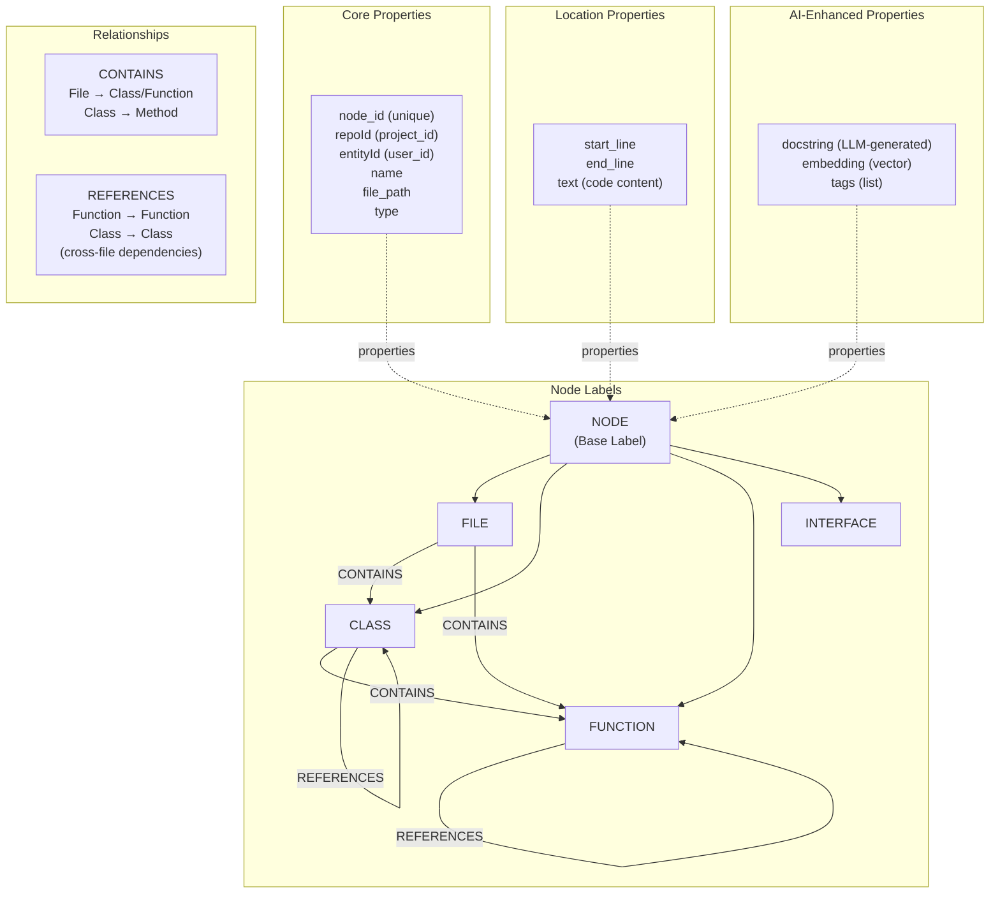
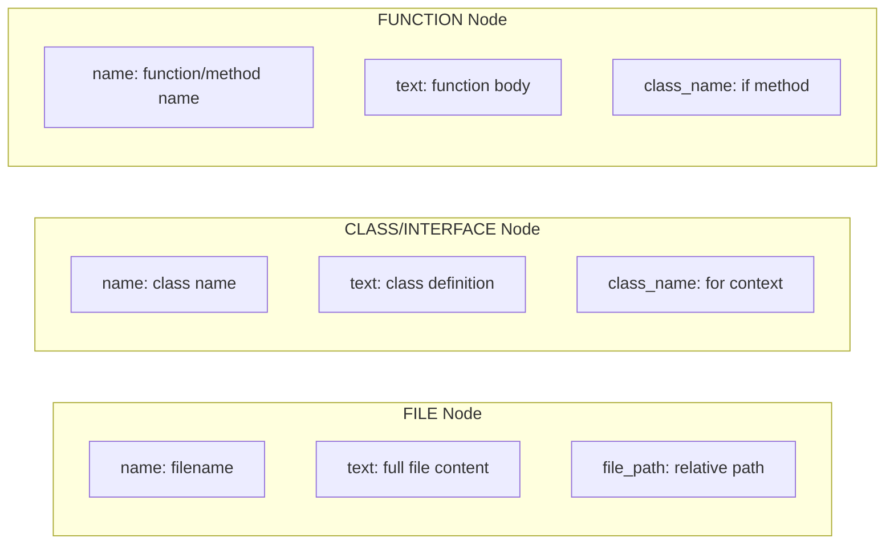
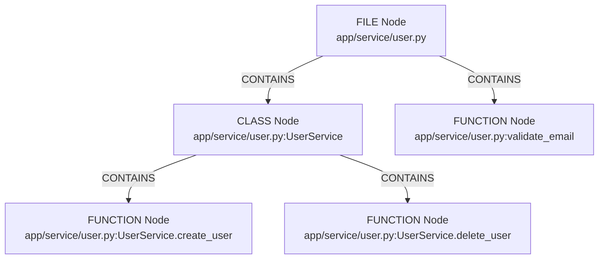
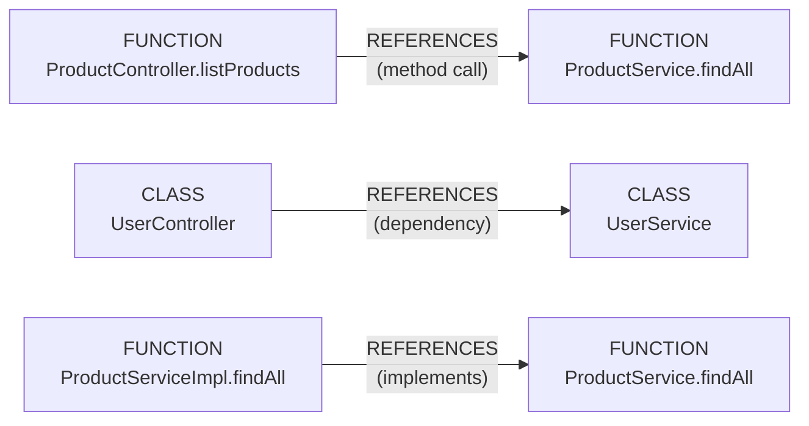
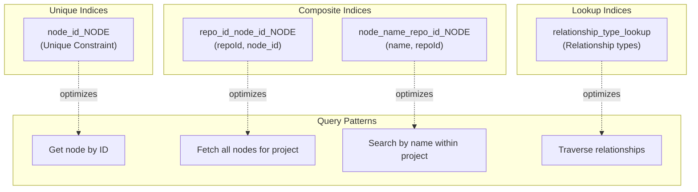
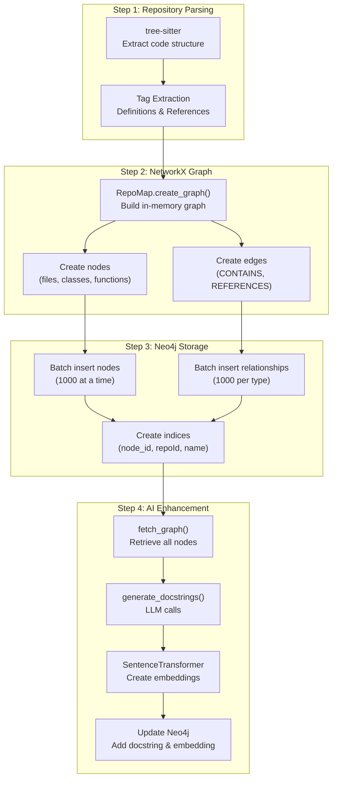
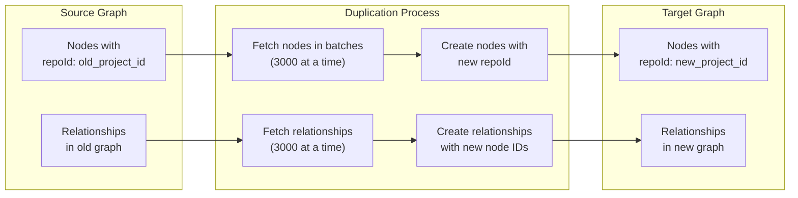

10.2-Neo4j Knowledge Graph

# Page: Neo4j Knowledge Graph

# Neo4j Knowledge Graph

<details>
<summary>Relevant source files</summary>

The following files were used as context for generating this wiki page:

- [app/modules/parsing/graph_construction/code_graph_service.py](app/modules/parsing/graph_construction/code_graph_service.py)
- [app/modules/parsing/graph_construction/parsing_helper.py](app/modules/parsing/graph_construction/parsing_helper.py)
- [app/modules/parsing/graph_construction/parsing_service.py](app/modules/parsing/graph_construction/parsing_service.py)
- [app/modules/parsing/knowledge_graph/inference_service.py](app/modules/parsing/knowledge_graph/inference_service.py)
- [app/modules/projects/projects_service.py](app/modules/projects/projects_service.py)

</details>


## Purpose and Scope

This document describes the Neo4j knowledge graph that stores the semantic representation of parsed codebases. The graph consists of nodes representing code entities (files, classes, functions, interfaces) and relationships representing their structural and reference connections. Each node is enriched with AI-generated docstrings and embeddings to enable semantic search and code understanding.

For information about the parsing pipeline that populates this graph, see [Repository Parsing Pipeline](#4.1). For details on the AI enhancement process that adds docstrings and embeddings, see [Inference and Docstring Generation](#4.2). For information about querying the graph via tools, see [Knowledge Graph Query Tools](#5.2).

---

## Graph Schema Overview

The Neo4j knowledge graph uses a multi-label node structure with two primary relationship types. All code entities share a base `NODE` label with additional type-specific labels (`FILE`, `CLASS`, `FUNCTION`, `INTERFACE`). Relationships capture both structural containment (`CONTAINS`) and cross-reference dependencies (`REFERENCES`).

### Node and Relationship Architecture



**Sources:** [app/modules/parsing/graph_construction/code_graph_service.py:66-110](), [app/modules/parsing/graph_construction/parsing_repomap.py:611-736]()

---

## Node Types and Properties

### Common Properties (All Nodes)

All nodes in the graph share a common set of properties that enable identification, isolation, and querying:

| Property | Type | Description | Generation Method |
|----------|------|-------------|-------------------|
| `node_id` | String | Unique identifier (MD5 hash) | `generate_node_id(path, user_id)` |
| `repoId` | String | Project ID for multi-tenancy | From `project_id` |
| `entityId` | String | User ID for ownership | From `user_id` |
| `name` | String | Display name (e.g., method name) | Extracted by tree-sitter |
| `file_path` | String | Relative path from repo root | Normalized path |
| `type` | String | Node type (FILE/CLASS/FUNCTION/INTERFACE) | Tag classification |
| `text` | String | Code content | Read from file or extracted |
| `start_line` | Integer | Starting line number | From tree-sitter parse |
| `end_line` | Integer | Ending line number | From tree-sitter parse |

**Sources:** [app/modules/parsing/graph_construction/code_graph_service.py:79-93]()

### Node Identification Strategy

Node IDs are generated using MD5 hashing to ensure uniqueness and consistency:

```python
# From CodeGraphService.generate_node_id
combined_string = f"{user_id}:{path}"
hash_object = hashlib.md5()
hash_object.update(combined_string.encode("utf-8"))
node_id = hash_object.hexdigest()
```

The path follows a hierarchical naming convention:
- **Files:** `relative/path/to/file.py`
- **Classes:** `relative/path/to/file.py:ClassName`
- **Methods:** `relative/path/to/file.py:ClassName.methodName`
- **Functions:** `relative/path/to/file.py:functionName`

**Sources:** [app/modules/parsing/graph_construction/code_graph_service.py:20-32](), [app/modules/parsing/graph_construction/parsing_repomap.py:664-668]()

### AI-Enhanced Properties

After initial graph construction, the `InferenceService` enriches nodes with semantic information:

| Property | Type | Description | Source |
|----------|------|-------------|--------|
| `docstring` | String | LLM-generated description | `ProviderService.call_llm_with_structured_output` |
| `embedding` | Float Array | 384-dimensional vector | `SentenceTransformer("all-MiniLM-L6-v2")` |
| `tags` | String Array | Functional categorizations | Extracted from LLM response |

The embedding enables semantic similarity search across the codebase. The docstring provides natural language explanation of the code entity's purpose and behavior.

**Sources:** [app/modules/parsing/knowledge_graph/inference_service.py:35-42](), [app/modules/parsing/knowledge_graph/inference_service.py:824-863]()

### Node Type-Specific Properties



**Sources:** [app/modules/parsing/graph_construction/parsing_repomap.py:630-641](), [app/modules/parsing/graph_construction/parsing_repomap.py:669-680]()

---

## Relationship Types

### CONTAINS Relationships

The `CONTAINS` relationship models hierarchical containment in the codebase structure:



Properties on `CONTAINS` relationships:
- `repoId`: Project identifier for filtering
- `ident`: The name of the contained entity

**Sources:** [app/modules/parsing/graph_construction/parsing_repomap.py:682-690]()

### REFERENCES Relationships

The `REFERENCES` relationship captures cross-references between code entities:



Properties on `REFERENCES` relationships:
- `repoId`: Project identifier
- `ident`: The referenced identifier name
- `ref_line`: Line number where reference occurs
- `end_ref_line`: End line of reference

**Sources:** [app/modules/parsing/graph_construction/parsing_repomap.py:714-734]()

### Relationship Direction and Validation

The system enforces correct relationship directionality:

1. **Implementation → Interface**: Implementation methods reference interface declarations
2. **Caller → Callee**: Method calls point to method definitions
3. **Usage → Definition**: Class references point to class definitions

Duplicate bidirectional relationships are prevented using a `seen_relationships` set that tracks `(source, target, type)` tuples.

**Sources:** [app/modules/parsing/graph_construction/parsing_repomap.py:563-609]()

---

## Indexing Strategy

### Primary Indices

The Neo4j graph maintains several indices for optimized query performance:



**Index Creation Code:**

```cypher
-- From parsing_service.py create_neo4j_indices
CREATE INDEX repo_id_node_id_NODE IF NOT EXISTS 
FOR (n:NODE) ON (n.repoId, n.node_id)

CREATE INDEX node_name_repo_id_NODE IF NOT EXISTS 
FOR (n:NODE) ON (n.name, n.repoId)

CREATE LOOKUP INDEX relationship_type_lookup IF NOT EXISTS 
FOR ()-[r]->() ON EACH type(r)
```

**Sources:** [app/modules/parsing/graph_construction/parsing_service.py:180-203](), [app/modules/parsing/graph_construction/code_graph_service.py:54-59]()

---

## Data Flow into Neo4j

### Graph Construction Pipeline



**Sources:** [app/modules/parsing/graph_construction/parsing_service.py:205-286](), [app/modules/parsing/graph_construction/code_graph_service.py:37-165]()

### Batch Insertion Details

Node insertion uses the APOC library for dynamic label creation:

```cypher
UNWIND $nodes AS node
CALL apoc.create.node(node.labels, node) YIELD node AS n
RETURN count(*) AS created_count
```

Each node includes:
- `labels`: Array like `["NODE", "FUNCTION"]`
- Properties: `node_id`, `repoId`, `name`, `file_path`, `start_line`, `end_line`, `type`, `text`

Relationship insertion is type-specific for performance:

```cypher
UNWIND $edges AS edge
MATCH (source:NODE {node_id: edge.source_id, repoId: edge.repoId})
MATCH (target:NODE {node_id: edge.target_id, repoId: edge.repoId})
CREATE (source)-[r:REFERENCES {repoId: edge.repoId}]->(target)
```

**Batch Size:** 1000 nodes/relationships per transaction to balance memory and performance.

**Sources:** [app/modules/parsing/graph_construction/code_graph_service.py:62-109](), [app/modules/parsing/graph_construction/code_graph_service.py:111-160]()

---

## Querying Patterns

### Fetching Nodes by Project

The most common query pattern retrieves all nodes for a specific project:

```cypher
MATCH (n:NODE {repoId: $repo_id})
RETURN n.node_id AS node_id, 
       n.text AS text, 
       n.file_path AS file_path, 
       n.start_line AS start_line, 
       n.end_line AS end_line, 
       n.name AS name
SKIP $offset LIMIT $limit
```

This query is used during inference to batch-process nodes for docstring generation. The `SKIP`/`LIMIT` pagination prevents memory issues with large repositories.

**Sources:** [app/modules/parsing/knowledge_graph/inference_service.py:112-131]()

### Entry Point Detection

Entry points are functions with outgoing calls but no incoming calls:

```cypher
MATCH (f:FUNCTION)
WHERE f.repoId = $repo_id
  AND NOT ()-[:CALLS]->(f)
  AND (f)-[:CALLS]->()
RETURN f.node_id as node_id
```

Note: The actual implementation uses `REFERENCES` relationships, not `CALLS`.

**Sources:** [app/modules/parsing/knowledge_graph/inference_service.py:135-158]()

### Neighbor Traversal

Finding all functions called by a specific function (direct and indirect):

```cypher
MATCH (start {node_id: $node_id, repoId: $repo_id})
OPTIONAL MATCH (start)-[:CALLS]->(direct_neighbour)
OPTIONAL MATCH (start)-[:CALLS]->()-[:CALLS*0..]->(indirect_neighbour)
WITH start, COLLECT(DISTINCT direct_neighbour) + COLLECT(DISTINCT indirect_neighbour) AS all_neighbours
UNWIND all_neighbours AS neighbour
WITH start, neighbour
WHERE neighbour IS NOT NULL AND neighbour <> start
RETURN DISTINCT neighbour.node_id AS node_id, 
       neighbour.name AS function_name, 
       labels(neighbour) AS labels
```

This query supports code flow analysis and dependency mapping.

**Sources:** [app/modules/parsing/knowledge_graph/inference_service.py:160-194]()

### Updating Nodes with Inference Results

After generating docstrings and embeddings, nodes are updated:

```cypher
MATCH (n:NODE {node_id: $node_id, repoId: $repo_id})
SET n.docstring = $docstring,
    n.embedding = $embedding
```

The update includes both semantic description and vector representation for similarity search.

**Sources:** [app/modules/parsing/knowledge_graph/inference_service.py:824-863]()

---

## Graph Duplication for Demo Projects

### Fast-Path Cloning

For demo repositories, Potpie optimizes user onboarding by duplicating existing parsed graphs instead of re-parsing:



**Duplication Query (Nodes):**

```cypher
MATCH (n:NODE {repoId: $old_repo_id})
RETURN n.node_id AS node_id, 
       n.text AS text, 
       n.file_path AS file_path,
       n.start_line AS start_line, 
       n.end_line AS end_line, 
       n.name AS name,
       COALESCE(n.docstring, '') AS docstring,
       COALESCE(n.embedding, []) AS embedding,
       labels(n) AS labels
SKIP $offset LIMIT 3000
```

Nodes are recreated with preserved labels, docstrings, and embeddings:

```cypher
UNWIND $batch AS node
CALL apoc.create.node(node.labels, {
    repoId: $new_repo_id,
    node_id: node.node_id,
    text: node.text,
    file_path: node.file_path,
    start_line: node.start_line,
    end_line: node.end_line,
    name: node.name,
    docstring: node.docstring,
    embedding: node.embedding
}) YIELD node AS new_node
RETURN new_node
```

**Sources:** [app/modules/parsing/graph_construction/parsing_service.py:287-377]()

---

## Cleanup and Deletion

### Project Graph Cleanup

When re-parsing a project or deleting it, all associated nodes and relationships are removed:

```cypher
MATCH (n {repoId: $project_id})
DETACH DELETE n
```

The `DETACH DELETE` ensures relationships are removed before nodes, preventing orphaned relationships.

This operation also triggers cleanup of associated search indices via `SearchService.delete_project_index()`.

**Sources:** [app/modules/parsing/graph_construction/code_graph_service.py:166-178]()

---

## Performance Characteristics

### Insertion Performance

Graph construction performance metrics for typical projects:

| Repository Size | Node Count | Relationship Count | Insert Time |
|----------------|------------|-------------------|-------------|
| Small (< 100 files) | ~1,000 | ~2,000 | ~5 seconds |
| Medium (100-500 files) | ~5,000 | ~10,000 | ~20 seconds |
| Large (500+ files) | ~20,000 | ~50,000 | ~60 seconds |

**Optimization Strategies:**
1. **Batch Processing**: 1000 nodes/relationships per transaction
2. **Type-Specific Queries**: Separate queries per relationship type to avoid dynamic relationship creation overhead
3. **Index Creation**: Indices created after bulk insert, not during
4. **Parallel Processing**: Uses connection pooling in Neo4j driver

**Sources:** [app/modules/parsing/graph_construction/code_graph_service.py:49-164]()

### Query Performance

Indices enable efficient queries:
- **Node lookup by ID**: O(1) via unique constraint
- **Project nodes fetch**: O(n) with index scan on `repoId`
- **Name search within project**: O(log n) via composite index
- **Relationship traversal**: O(degree) with relationship type index

**Sources:** [app/modules/parsing/graph_construction/parsing_service.py:180-203]()

---

## Integration with Search Service

After graph construction, the `SearchService` creates PostgreSQL-based search indices for fast text search:

```python
nodes_to_index = [
    {
        "project_id": repo_id,
        "node_id": node["node_id"],
        "name": node.get("name", ""),
        "file_path": node.get("file_path", ""),
        "content": f"{node.get('name', '')} {node.get('file_path', '')}",
    }
    for node in nodes
    if node.get("file_path") not in {None, ""}
    and node.get("name") not in {None, ""}
]

await self.search_service.bulk_create_search_indices(nodes_to_index)
```

This dual-database approach combines:
- **Neo4j**: Graph traversal and semantic search via embeddings
- **PostgreSQL**: Fast text search via GIN indices

**Sources:** [app/modules/parsing/knowledge_graph/inference_service.py:756-777]()

---

## Embedding Storage and Vector Search

### Embedding Generation

Embeddings are 384-dimensional vectors created by `SentenceTransformer("all-MiniLM-L6-v2")`:

```python
embedding_model = SentenceTransformer("all-MiniLM-L6-v2", device="cpu")
code_with_docstring = f"{node['text']}\n\nDocumentation: {docstring}"
embedding = embedding_model.encode(code_with_docstring).tolist()
```

The embedding combines both code content and generated docstring to capture semantic meaning.

**Sources:** [app/modules/parsing/knowledge_graph/inference_service.py:35-42]()

### Vector Storage in Neo4j

Embeddings are stored as float arrays on node properties:

```cypher
MATCH (n:NODE {node_id: $node_id, repoId: $repo_id})
SET n.embedding = $embedding
```

Neo4j does not natively support vector similarity search efficiently, so the system uses a hybrid approach:
1. **Initial filtering**: Use indices to narrow down candidate nodes
2. **Vector comparison**: Load embeddings into Python for cosine similarity calculation
3. **Ranking**: Sort by similarity score

For production deployments requiring fast vector search, consider:
- Neo4j Graph Data Science library (requires Enterprise license)
- External vector database (Pinecone, Weaviate, etc.)
- PostgreSQL pgvector extension

**Sources:** [app/modules/parsing/knowledge_graph/inference_service.py:824-863]()

---

## Multi-Tenancy via repoId

All queries filter by `repoId` (project ID) to ensure proper isolation:

```cypher
MATCH (n:NODE {repoId: $repo_id})
-- vs --
MATCH (n:NODE) -- ❌ NEVER query without repoId filter
```

The composite indices `(repoId, node_id)` and `(name, repoId)` are optimized for this access pattern. This design enables:
- **User Isolation**: Different users can parse the same repository without conflicts
- **Project Versioning**: Same user can parse different branches/commits as separate projects
- **Efficient Queries**: Index-based filtering prevents full table scans

**Sources:** [app/modules/parsing/graph_construction/code_graph_service.py:54-59](), [app/modules/parsing/graph_construction/parsing_service.py:186-197]()