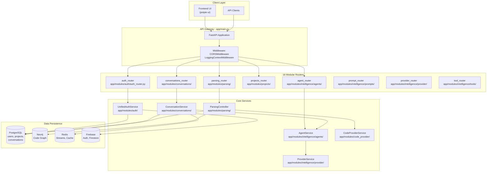
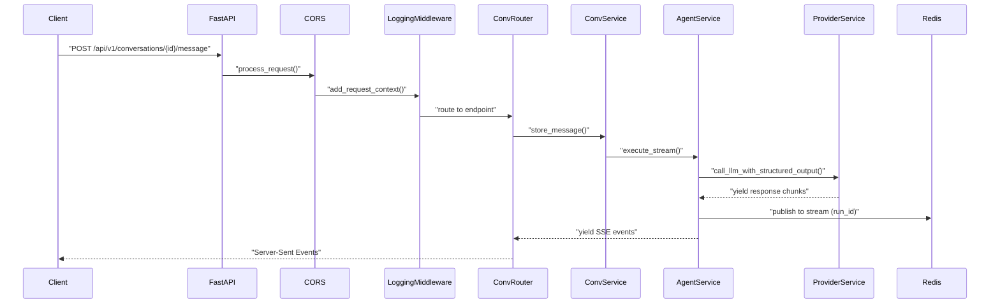
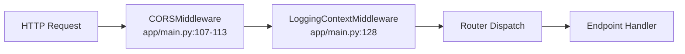
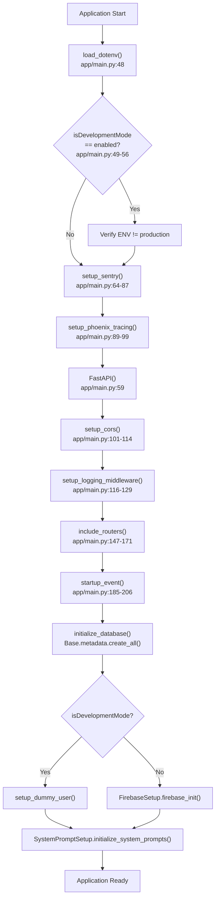

1-Overview

# Page: Overview

# Overview

<details>
<summary>Relevant source files</summary>

The following files were used as context for generating this wiki page:

- [.env.template](.env.template)
- [GETTING_STARTED.md](GETTING_STARTED.md)
- [LICENSE](LICENSE)
- [app/main.py](app/main.py)
- [contributing.md](contributing.md)
- [requirements.txt](requirements.txt)

</details>


This document provides a high-level introduction to Potpie, an AI-powered codebase interaction platform. It covers the system's purpose, core capabilities, architectural components, and technology stack. For detailed information about specific subsystems, refer to the dedicated pages: [Architecture Overview](#1.2), [Getting Started](#1.1), and subsystem-specific documentation starting from section 2 onwards.

## Purpose and Scope

Potpie is a FastAPI-based platform that enables intelligent interaction with codebases through AI agents and knowledge graphs. The system parses code repositories into Neo4j graph structures, enriches them with AI-generated documentation, and provides specialized agents for tasks like code Q&A, debugging, test generation, and code changes analysis. It supports multi-provider authentication (Firebase GitHub, Google SSO, Azure AD, Okta) and integrates with external services (GitHub, LLM providers, storage backends).

**Scope**: This overview covers the system's conceptual architecture, major components, and operational modes. Implementation details for specific modules are documented in their respective sections.

**Sources**: [app/main.py:1-217](), [GETTING_STARTED.md:1-172](), [.env.template:1-116]()

---

## Core Capabilities

Potpie provides the following primary capabilities:

| Capability | Description | Key Components |
|-----------|-------------|----------------|
| **Code Knowledge Graph** | Parses repositories into Neo4j graphs with FILE/CLASS/FUNCTION nodes and semantic relationships | [Parsing Service](#4), [Neo4j Graph](#10.2) |
| **AI-Powered Conversations** | Real-time streaming chat with AI agents for codebase questions | [Conversation Service](#3), [Agent System](#2) |
| **Specialized Agents** | 8+ pre-built agents (QnA, Debug, Unit Test, Integration Test, Code Generation, LLD, Code Changes, General) | [System Agents](#2.3) |
| **Custom Agents** | User-defined agents with natural language configuration | [Custom Agents](#2.4) |
| **Multi-Provider Auth** | Unified authentication across Firebase, Google, Azure AD, Okta, Email/Password | [Authentication](#7) |
| **Repository Management** | Multi-provider support (GitHub, GitBucket, GitLab, Local) with authentication fallback chains | [Project Management](#6) |
| **Tool Ecosystem** | 20+ tools for code analysis, web search, bash execution, external integrations | [Tool System](#5) |
| **Background Processing** | Asynchronous repository parsing and message handling via Celery | [Background Processing](#9) |

**Sources**: [app/main.py:147-171](), [requirements.txt:1-279]()

---

## System Architecture

### Layer-Based Component Organization



**Description**: Potpie follows a layered architecture with clear separation of concerns. The `MainApp` class in [app/main.py:46-216]() initializes the FastAPI application, configures middleware (CORS, logging), and includes 16 modular routers. Each router delegates to service classes that handle business logic and interact with the data persistence layer. The system uses polyglot persistence across four databases optimized for different data models.

**Sources**: [app/main.py:46-216]()

---

### Request Lifecycle: Code Symbol Mapping



**Description**: This diagram shows the actual code flow for a conversation message request. The `MainApp` class initializes middleware in a specific order ([app/main.py:107-129]()), with CORS handling followed by logging context injection. Requests are routed through FastAPI's router system ([app/main.py:147-171]()) to service classes. The conversation service orchestrates agent execution, which streams responses through Redis back to the client via Server-Sent Events.

**Sources**: [app/main.py:46-216]()

---

## Technology Stack

### Primary Technologies

| Category | Technology | Purpose | Configuration Reference |
|----------|-----------|---------|------------------------|
| **Web Framework** | FastAPI | API gateway, routing, dependency injection | [app/main.py:59]() |
| **Databases** | PostgreSQL | Relational data (users, projects, conversations) | `POSTGRES_SERVER` in [.env.template:5]() |
| | Neo4j | Code knowledge graph (nodes, relationships, embeddings) | `NEO4J_URI`, `NEO4J_USERNAME`, `NEO4J_PASSWORD` in [.env.template:6-8]() |
| | Redis | Streaming, caching, Celery broker | `REDISHOST`, `REDISPORT`, `BROKER_URL` in [.env.template:9-11]() |
| | Firebase Firestore | Onboarding data, authentication tokens | `FIREBASE_SERVICE_ACCOUNT` in [.env.template:60]() |
| **Task Queue** | Celery | Background parsing, async message processing | `BROKER_URL`, `CELERY_QUEUE_NAME` in [.env.template:11-12]() |
| **Authentication** | Firebase Admin SDK | Multi-provider auth, token verification | [requirements.txt:60]() |
| **LLM Abstraction** | LiteLLM | Multi-provider LLM support (OpenAI, Anthropic, etc.) | [requirements.txt:125]() |
| **Code Parsing** | Tree-sitter | Language-agnostic AST parsing | [requirements.txt:253-257]() |
| **Embeddings** | sentence-transformers | 384-dim semantic vectors for code search | [requirements.txt:230]() |
| **AI Frameworks** | pydantic-ai, langchain, langgraph | Agent orchestration, tool execution | [requirements.txt:195-122]() |
| **Observability** | Sentry, Phoenix, PostHog | Error tracking, tracing, analytics | [requirements.txt:231,16,176]() |

**Sources**: [requirements.txt:1-279](), [.env.template:1-116]()

### Dependency Management

Potpie uses the **uv** package manager for fast, deterministic dependency resolution:

- **Package Metadata**: [pyproject.toml]() (not shown in files, but referenced in [GETTING_STARTED.md:29]())
- **Lock File**: [uv.lock]() ensures reproducible builds
- **Virtual Environment**: Automatically created in `.venv/` by `uv sync`

**Installation**:
```bash
curl -LsSf https://astral.sh/uv/install.sh | sh
uv sync
```

**Sources**: [GETTING_STARTED.md:5-29](), [contributing.md:40]()

---

## Operational Modes

### Development Mode

Development mode (`isDevelopmentMode=enabled`) allows running Potpie with minimal external dependencies for local development and testing.

**Key Features**:
- **Mock Authentication**: Bypasses Firebase verification, uses dummy user ([app/main.py:132-139]())
- **Local Models**: Supports Ollama for LLM inference ([.env.template:34-36]())
- **Minimal Configuration**: No Firebase, GitHub App, or Secret Manager required
- **Local Repositories**: Supports local filesystem code providers

**Configuration**:
```bash
isDevelopmentMode=enabled
ENV=development
OPENAI_API_KEY=<optional>
INFERENCE_MODEL=ollama_chat/qwen2.5-coder:7b
CHAT_MODEL=ollama_chat/qwen2.5-coder:7b
```

**Startup Guard**: The system prevents accidentally running development mode in production ([app/main.py:49-56]()).

**Sources**: [app/main.py:49-56](), [app/main.py:132-139](), [GETTING_STARTED.md:1-61](), [.env.template:1-2]()

---

### Production Mode

Production mode requires full external service integration for enterprise deployments.

**Required Services**:
- **Firebase**: Authentication, Firestore for onboarding data ([GETTING_STARTED.md:67-81]())
- **Google Cloud**: Secret Manager for API key storage ([GETTING_STARTED.md:132-153]())
- **GitHub App**: Repository access, authentication provider ([GETTING_STARTED.md:92-120]())
- **PostHog**: User analytics ([GETTING_STARTED.md:84-88]())
- **Sentry**: Error tracking and performance monitoring ([app/main.py:64-87]())
- **Object Storage**: GCS/S3/Azure for multimodal content ([.env.template:37-58]())

**Configuration**:
```bash
ENV=production
isDevelopmentMode=<unset or disabled>
GCP_PROJECT=<project-id>
FIREBASE_SERVICE_ACCOUNT=/path/to/firebase_service_account.json
GOOGLE_APPLICATION_CREDENTIALS=/path/to/service-account.json
GITHUB_APP_ID=<app-id>
GITHUB_PRIVATE_KEY=<formatted-pem>
SENTRY_DSN=<sentry-dsn>
POSTHOG_API_KEY=<api-key>
```

**Sources**: [app/main.py:49-56](), [app/main.py:64-87](), [GETTING_STARTED.md:63-172](), [.env.template:26-78]()

---

## Key Architectural Concepts

### Polyglot Persistence Strategy

Potpie uses specialized databases for different data models:

| Database | Data Model | Use Cases | Key Tables/Collections |
|----------|-----------|-----------|----------------------|
| **PostgreSQL** | Relational | User accounts, projects, conversations, messages, prompts, custom agents | `users`, `projects`, `conversations`, `messages`, `custom_agents`, `prompts` |
| **Neo4j** | Graph | Code structure, semantic relationships, vector search | Nodes: `FILE`, `CLASS`, `FUNCTION`<br/>Relationships: `CALLS`, `REFERENCES` |
| **Redis** | Key-Value, Streams | Session caching, SSE streaming, Celery broker, task status | Streams: `conversation:{id}:stream:{run_id}` |
| **Firebase Firestore** | Document | Onboarding data, authentication metadata | Collections: `onboarding`, `users` |

**Sources**: [.env.template:5-11](), Diagram 5 in high-level architecture

---

### Middleware Pipeline

The `MainApp` class configures middleware in a specific order to ensure proper request processing:



1. **CORSMiddleware**: Handles cross-origin requests from the frontend ([app/main.py:107-113]())
   - Origins configured via `CORS_ALLOWED_ORIGINS` environment variable
   - Defaults to `http://localhost:3000` for development
   
2. **LoggingContextMiddleware**: Injects request-level context into all logs ([app/main.py:116-129]())
   - Automatically adds: `request_id`, `path`, `user_id`
   - Domain-specific IDs (e.g., `conversation_id`) added manually in routes

**Sources**: [app/main.py:101-129]()

---

### Modular Router Architecture

Potpie uses 16 specialized routers for clean separation of concerns:

```mermaid
graph TB
    FastAPI["FastAPI Application"] --> Auth["auth_router<br/>/api/v1/auth/*"]
    FastAPI --> User["user_router<br/>/api/v1/users/*"]
    FastAPI --> Parsing["parsing_router<br/>/api/v1/parsing/*"]
    FastAPI --> Conv["conversations_router<br/>/api/v1/conversations/*"]
    FastAPI --> Prompt["prompt_router<br/>/api/v1/prompts/*"]
    FastAPI --> Project["projects_router<br/>/api/v1/projects/*"]
    FastAPI --> Search["search_router<br/>/api/v1/search/*"]
    FastAPI --> GitHub["github_router<br/>/api/v1/github/*"]
    FastAPI --> Agent["agent_router<br/>/api/v1/agents/*"]
    FastAPI --> Provider["provider_router<br/>/api/v1/providers/*"]
    FastAPI --> Tool["tool_router<br/>/api/v1/tools/*"]
    FastAPI --> Usage["usage_router<br/>/api/v1/usage/*"]
    FastAPI --> PotpieAPI["potpie_api_router<br/>/api/v2/*"]
    FastAPI --> SecretMgr["secret_manager_router<br/>/api/v1/secrets/*"]
    FastAPI --> Media["media_router<br/>/api/v1/media/*"]
    FastAPI --> Integrations["integrations_router<br/>/api/v1/integrations/*"]
```



**Router Registration**: All routers are included in [app/main.py:147-171]() with consistent prefixing (`/api/v1` or `/api/v2`) and tagging for OpenAPI documentation.

**Sources**: [app/main.py:147-171]()

---

### Startup Sequence

The application follows a specific initialization sequence to ensure dependencies are available:



**Critical Safety Check**: The system exits if `isDevelopmentMode=enabled` but `ENV != development` to prevent accidental production deployment in development mode ([app/main.py:49-56]()).

**Sources**: [app/main.py:46-216]()

---

## System Entry Points

### Main Application Entry

- **File**: [app/main.py:214-216]()
- **Class**: `MainApp`
- **Instance**: `main_app = MainApp()`
- **ASGI Application**: `app = main_app.run()`

This creates the ASGI application instance that web servers (Gunicorn, Uvicorn) use to run the application.

### Health Check Endpoint

```python
GET /health
```

Returns application status and git commit hash ([app/main.py:173-183]()).

**Sources**: [app/main.py:173-183](), [app/main.py:214-216]()

---

## License and Contribution

- **License**: Apache License 2.0 ([LICENSE:1-193]())
- **Copyright**: 2024 Momenta Softwares Inc.
- **Contributing**: See [contributing.md:1-132]() for development workflow, branch naming, and pull request guidelines

**Sources**: [LICENSE:1-193](), [contributing.md:1-132]()