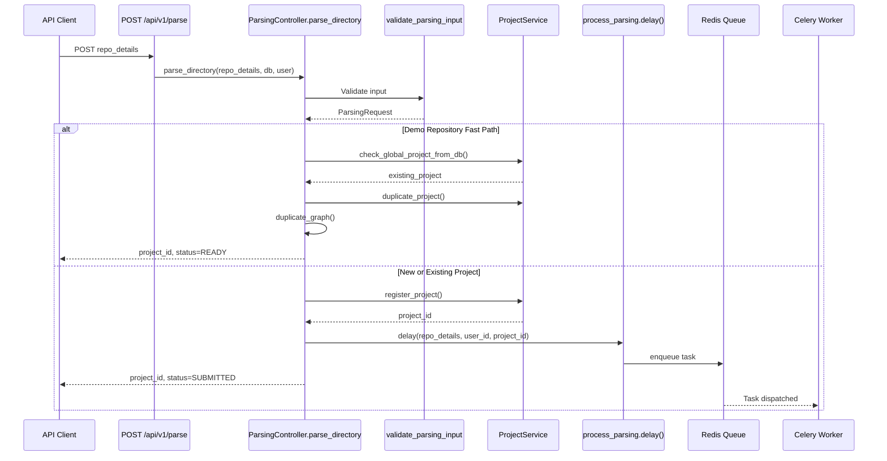
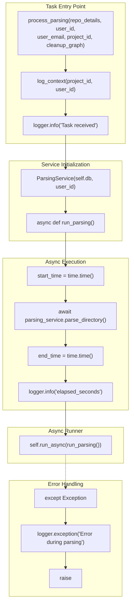
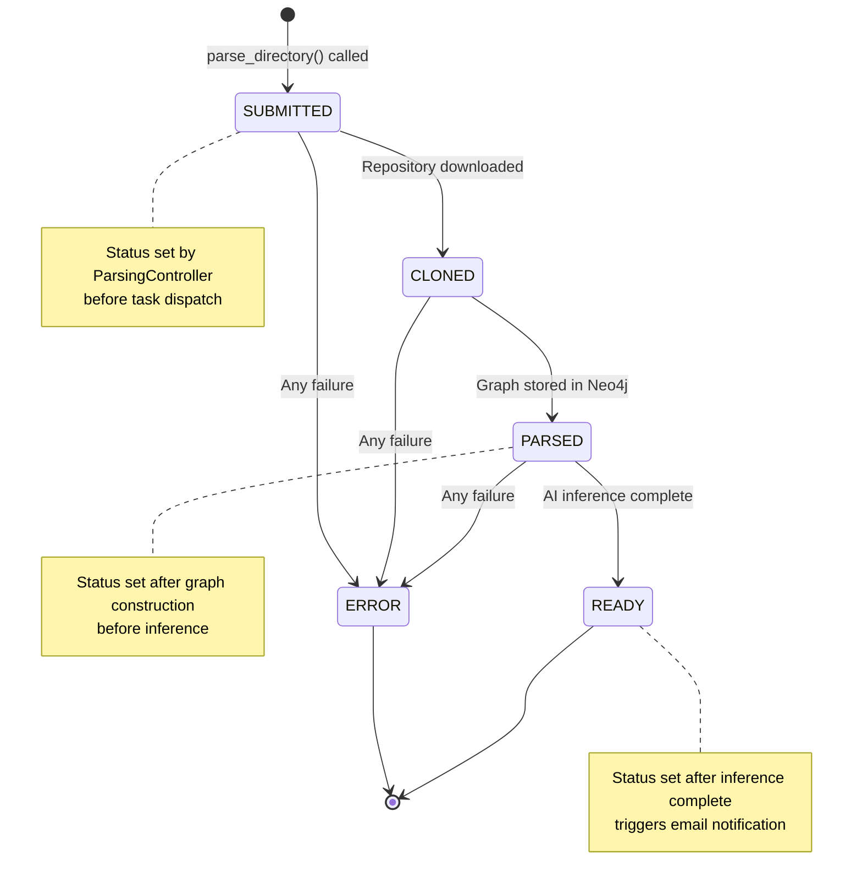
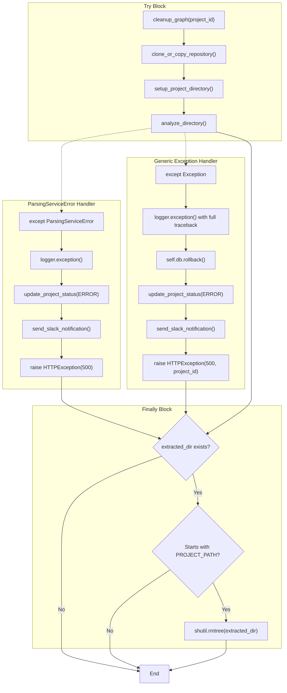
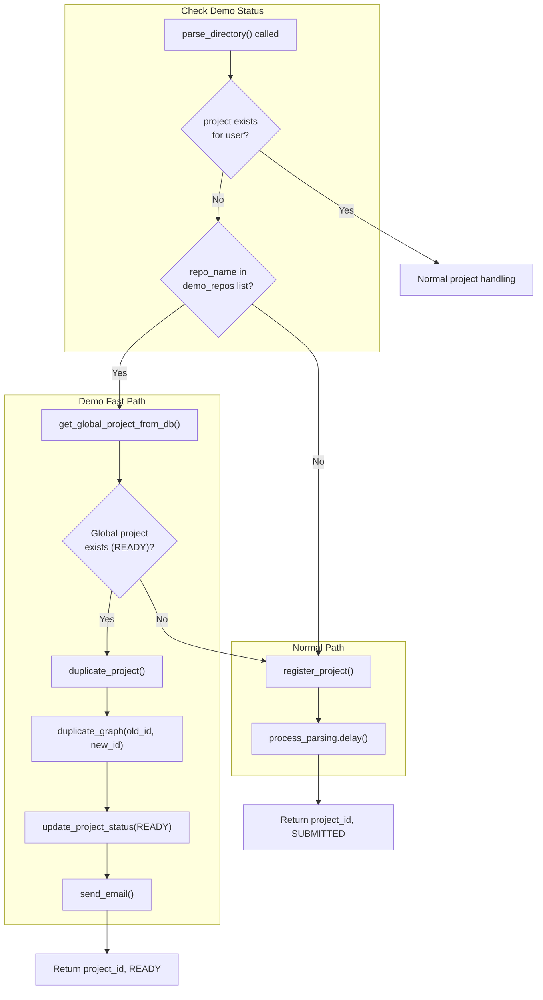
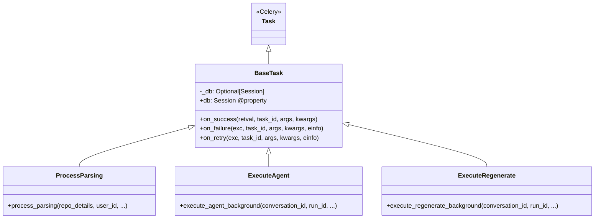
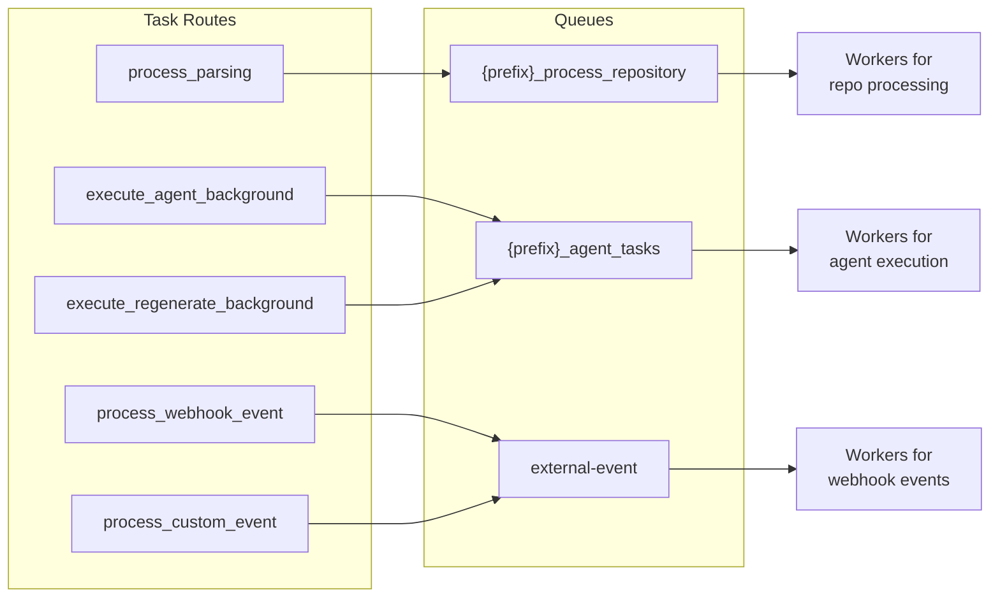

9.2-Parsing Tasks

# Page: Parsing Tasks

# Parsing Tasks

<details>
<summary>Relevant source files</summary>

The following files were used as context for generating this wiki page:

- [app/modules/parsing/graph_construction/code_graph_service.py](app/modules/parsing/graph_construction/code_graph_service.py)
- [app/modules/parsing/graph_construction/parsing_helper.py](app/modules/parsing/graph_construction/parsing_helper.py)
- [app/modules/parsing/graph_construction/parsing_service.py](app/modules/parsing/graph_construction/parsing_service.py)
- [app/modules/parsing/knowledge_graph/inference_service.py](app/modules/parsing/knowledge_graph/inference_service.py)
- [app/modules/projects/projects_service.py](app/modules/projects/projects_service.py)

</details>


## Overview

The `process_parsing` task is a long-running Celery task that handles asynchronous repository parsing and knowledge graph construction. This task is the core of Potpie's codebase analysis pipeline, responsible for transforming raw source code into a structured Neo4j knowledge graph enriched with AI-generated documentation.

**Key Characteristics:**
- **Duration:** Minutes to hours depending on repository size
- **Queue:** `{queue_prefix}_process_repository`
- **Task Name:** `app.celery.tasks.parsing_tasks.process_parsing`
- **Base Class:** `BaseTask` for automatic database session management

For general Celery architecture and configuration, see page 9.1. For agent background execution tasks, see page 9.3.

**Sources:** [app/celery/tasks/parsing_tasks.py:12-58](), [app/celery/celery_app.py:84-86]()

## Task Triggering Architecture

The parsing task is triggered when users submit repositories via the REST API. The flow involves request validation, project registration, and asynchronous task dispatch.

### Triggering Flow Diagram



**Sources:** [app/modules/parsing/graph_construction/parsing_controller.py:37-286]()

## Task Definition and Parameters

The `process_parsing` task is defined in [app/celery/tasks/parsing_tasks.py:12-58]() with specific binding and routing configuration.

### Task Signature

```python
@celery_app.task(
    bind=True,
    base=BaseTask,
    name="app.celery.tasks.parsing_tasks.process_parsing",
)
def process_parsing(
    self,
    repo_details: Dict[str, Any],
    user_id: str,
    user_email: str,
    project_id: str,
    cleanup_graph: bool = True,
) -> None:
```

**Task Configuration:**
- **`bind=True`:** Provides access to task instance via `self` parameter
- **`base=BaseTask`:** Inherits database session management from `BaseTask`
- **`name`:** Fully qualified task name for routing and monitoring

**Parameters:**

| Parameter | Type | Description |
|-----------|------|-------------|
| `repo_details` | `Dict[str, Any]` | Repository configuration (repo_name, branch_name, repo_path, commit_id) |
| `user_id` | `str` | User identifier for graph ownership and logging context |
| `user_email` | `str` | User email for notification emails after parsing completes |
| `project_id` | `str` | UUID7 project identifier stored in PostgreSQL |
| `cleanup_graph` | `bool` | Whether to delete existing graph data before parsing (default: True) |

**Sources:** [app/celery/tasks/parsing_tasks.py:12-24]()

### Queue Routing Configuration

The task is routed to a dedicated parsing queue configured in [app/celery/celery_app.py:84-86]():

```python
task_routes={
    "app.celery.tasks.parsing_tasks.process_parsing": {
        "queue": f"{queue_prefix}_process_repository"
    },
    # ... other routes
}
```

This isolates long-running parsing tasks from faster agent execution tasks, allowing independent worker scaling.

**Queue Names by Environment:**

| Environment Variable | Queue Name |
|---------------------|------------|
| `CELERY_QUEUE_NAME=production` | `production_process_repository` |
| `CELERY_QUEUE_NAME=staging` | `staging_process_repository` |
| `CELERY_QUEUE_NAME=development` | `development_process_repository` |

**Sources:** [app/celery/celery_app.py:22, 84-86]()

## Task Implementation

The `process_parsing` task implementation wraps the asynchronous `ParsingService.parse_directory()` method within Celery's synchronous execution context.

### Execution Flow



**Sources:** [app/celery/tasks/parsing_tasks.py:17-55]()

### Code Implementation

The task implementation at [app/celery/tasks/parsing_tasks.py:26-55]():

1. **Logging Context Setup:**
   ```python
   with log_context(project_id=project_id, user_id=user_id):
       logger.info("Task received: Starting parsing process")
   ```
   Sets up structured logging with domain identifiers for trace correlation.

2. **Service Initialization:**
   ```python
   parsing_service = ParsingService(self.db, user_id)
   ```
   Creates `ParsingService` instance using database session from `BaseTask.db` property.

3. **Async Wrapper Definition:**
   ```python
   async def run_parsing():
       start_time = time.time()
       await parsing_service.parse_directory(
           ParsingRequest(**repo_details),
           user_id,
           user_email,
           project_id,
           cleanup_graph,
       )
       end_time = time.time()
       logger.info("Parsing process completed", elapsed_seconds=round(end_time - start_time, 2))
   ```
   Wraps async `parse_directory()` call with timing instrumentation.

4. **Async Execution:**
   ```python
   self.run_async(run_parsing())
   ```
   Uses `BaseTask.run_async()` method to execute the coroutine within the worker's event loop.

**Database Session Lifecycle:**
- Session created lazily via `BaseTask.db` property on first access
- Shared across all operations within the task
- Automatically closed by `BaseTask.on_success()` or `BaseTask.on_failure()` hooks

**Sources:** [app/celery/tasks/parsing_tasks.py:26-55](), [app/celery/tasks/base_task.py:12-29]()

## Repository Parsing Pipeline

Once the task is executing, it delegates to `ParsingService.parse_directory()` which orchestrates the complete parsing pipeline from repository acquisition to AI-enhanced graph storage.

### Complete Parsing Flow

```mermaid
graph TB
    subgraph "1. Initialization"
        ParseDir["parse_directory(repo_details, user_id,<br/>user_email, project_id, cleanup_graph)"]
        LogCtx["log_context(project_id, user_id)"]
        CreatePM["ProjectService(self.db)"]
    end
    
    subgraph "2. Graph Cleanup (if cleanup_graph=True)"
        GetNeo4jCfg["config_provider.get_neo4j_config()"]
        CreateCGS["CodeGraphService(uri, username, password, db)"]
        CleanupGraph["cleanup_graph(project_id)"]
    end
    
    subgraph "3. Repository Acquisition"
        CloneOrCopy["ParseHelper.clone_or_copy_repository()"]
        CheckPath{Local Path?}
        CopyLocal["Copy local directory"]
        CloneRemote["Download tarball or git clone"]
        SetupDir["setup_project_directory()"]
    end
    
    subgraph "4. Language Detection"
        DetectLang["detect_repo_language(extracted_dir)"]
        CheckSupported{Supported Language?}
    end
    
    subgraph "5. Graph Construction"
        CreateRepoMap["RepoMap.create_graph(extracted_dir)"]
        TreeSitterParse["Parse files with tree-sitter"]
        BuildNetworkX["Build NetworkX graph with nodes/edges"]
        BatchInsert["CodeGraphService.create_and_store_graph()"]
        InsertNodes["Batch insert nodes (1000 at a time)"]
        InsertRels["Batch insert relationships"]
        CreateIndices["Create Neo4j indices"]
    end
    
    subgraph "6. AI Inference"
        UpdateStatus1["update_project_status(PARSED)"]
        RunInference["InferenceService.run_inference()"]
        FetchNodes["Fetch all nodes from Neo4j"]
        BatchNodes["batch_nodes() with cache checks"]
        GenerateDocs["Generate docstrings via LLM"]
        GenerateEmbed["Generate embeddings via SentenceTransformer"]
        UpdateNeo4j["Update nodes with docstrings/embeddings"]
    end
    
    subgraph "7. Completion"
        UpdateStatus2["update_project_status(READY)"]
        SendEmail["EmailHelper.send_email()"]
    end
    
    subgraph "8. Cleanup"
        RemoveDir["shutil.rmtree(extracted_dir)"]
    end
    
    ParseDir --> LogCtx
    LogCtx --> CreatePM
    CreatePM --> GetNeo4jCfg
    GetNeo4jCfg --> CreateCGS
    CreateCGS --> CleanupGraph
    CleanupGraph --> CloneOrCopy
    
    CloneOrCopy --> CheckPath
    CheckPath -->|Yes| CopyLocal
    CheckPath -->|No| CloneRemote
    CopyLocal --> SetupDir
    CloneRemote --> SetupDir
    
    SetupDir --> DetectLang
    DetectLang --> CheckSupported
    CheckSupported -->|No| ErrorStatus["update_project_status(ERROR)"]
    CheckSupported -->|Yes| CreateRepoMap
    
    CreateRepoMap --> TreeSitterParse
    TreeSitterParse --> BuildNetworkX
    BuildNetworkX --> BatchInsert
    BatchInsert --> InsertNodes
    InsertNodes --> InsertRels
    InsertRels --> CreateIndices
    
    CreateIndices --> UpdateStatus1
    UpdateStatus1 --> RunInference
    RunInference --> FetchNodes
    FetchNodes --> BatchNodes
    BatchNodes --> GenerateDocs
    GenerateDocs --> GenerateEmbed
    GenerateEmbed --> UpdateNeo4j
    
    UpdateNeo4j --> UpdateStatus2
    UpdateStatus2 --> SendEmail
    SendEmail --> RemoveDir
```



**Sources:** [app/modules/parsing/graph_construction/parsing_service.py:50-179]()

### Phase 1: Repository Acquisition

The `ParseHelper.clone_or_copy_repository()` method at [app/modules/parsing/graph_construction/parsing_helper.py:63-107]() handles both local and remote repositories.

**Local Repository Path:**
- If `repo_details.repo_path` is provided, creates `Repo` object from path
- Validates path exists with `os.path.exists()` check
- Used in development mode for testing

**Remote Repository Path:**
- Uses `CodeProviderService.get_repo()` to fetch repository via GitHub API
- Extracts authentication from PyGithub client
- Returns `PyGithub.Repository` object and auth token

**Repository Download:**
The `setup_project_directory()` method at [app/modules/parsing/graph_construction/parsing_helper.py:203-485]() downloads repository content:

1. **Tarball Download (Preferred):**
   - Calls `repo.get_archive_link("tarball", branch)` to get download URL
   - Downloads tarball with authentication headers
   - Extracts to temporary directory
   - Filters only text files using `is_text_file()` method
   - Copies text files to final directory

2. **Git Clone Fallback:**
   - If tarball fails (e.g., GitBucket private repos with 401 error)
   - Uses `Repo.clone_from()` with embedded credentials in URL
   - Filters text files during copy to prevent binary parsing errors

**Sources:** [app/modules/parsing/graph_construction/parsing_helper.py:63-643]()

### Phase 2: Language Detection

The `detect_repo_language()` method at [app/modules/parsing/graph_construction/parsing_helper.py:645-766]() analyzes file extensions to determine the primary language.

**Supported Languages:**
- Python, JavaScript, TypeScript, Java, Go, Rust, Ruby, PHP
- C, C++, C#
- Elixir, Elm, Elisp, OCaml
- QL, Markdown, XML

**Detection Algorithm:**
1. Walks directory tree, skipping hidden directories (`.git`, `.venv`, etc.)
2. Counts files by extension
3. Reads file content to calculate character count per language
4. Returns language with highest character count
5. Returns `"other"` if no supported language found

**Sources:** [app/modules/parsing/graph_construction/parsing_helper.py:645-766]()

### Phase 3: Graph Construction

The `CodeGraphService.create_and_store_graph()` method at [app/modules/parsing/graph_construction/code_graph_service.py:37-165]() creates the Neo4j knowledge graph.

**Step 1: Create NetworkX Graph**

Uses `RepoMap.create_graph()` at [app/modules/parsing/graph_construction/parsing_repomap.py:611-736]() to parse code structure:

1. **File Nodes:** One node per source file with full text content
2. **Definition Nodes:** CLASS, FUNCTION, INTERFACE nodes extracted via tree-sitter
3. **CONTAINS Relationships:** File → Class, File → Function, Class → Method
4. **REFERENCES Relationships:** Function → Function (calls), Class → Class (usage)

**Node Naming Convention:**
- File: `relative/path/to/file.py`
- Class: `relative/path/to/file.py:ClassName`
- Method: `relative/path/to/file.py:ClassName.methodName`
- Function: `relative/path/to/file.py:functionName`

**Step 2: Batch Insert Nodes**

Inserts nodes in batches of 1000 at [app/modules/parsing/graph_construction/code_graph_service.py:62-109]():

```python
for i in range(0, node_count, batch_size):
    batch_nodes = list(nx_graph.nodes(data=True))[i : i + batch_size]
    # Process node data
    session.run("""
        UNWIND $nodes AS node
        CALL apoc.create.node(node.labels, node) YIELD node AS n
        RETURN count(*) AS created_count
    """, nodes=nodes_to_create)
```

**Step 3: Batch Insert Relationships**

Groups relationships by type and inserts in batches of 1000 at [app/modules/parsing/graph_construction/code_graph_service.py:111-160]():

```python
for rel_type in rel_types:
    # Filter edges by relationship type
    type_edges = [(s, t, d) for s, t, d in nx_graph.edges(data=True) 
                  if d.get("type", "REFERENCES") == rel_type]
    
    for i in range(0, len(type_edges), batch_size):
        # Create relationships
        query = f"""
            UNWIND $edges AS edge
            MATCH (source:NODE {{node_id: edge.source_id, repoId: edge.repoId}})
            MATCH (target:NODE {{node_id: edge.target_id, repoId: edge.repoId}})
            CREATE (source)-[r:{rel_type} {{repoId: edge.repoId}}]->(target)
        """
        session.run(query, edges=edges_to_create)
```

**Step 4: Create Indices**

Creates specialized indices for query performance at [app/modules/parsing/graph_construction/code_graph_service.py:53-59]():

```python
session.run("""
    CREATE INDEX node_id_repo_idx IF NOT EXISTS
    FOR (n:NODE) ON (n.node_id, n.repoId)
""")
```

Additional indices created via `create_entityId_index()`, `create_node_id_index()`, and `create_function_name_index()` methods.

**Sources:** [app/modules/parsing/graph_construction/code_graph_service.py:37-198](), [app/modules/parsing/graph_construction/parsing_repomap.py:611-736]()

### Phase 4: AI Inference

The `InferenceService.run_inference()` method at [app/modules/parsing/knowledge_graph/inference_service.py:741-1079]() generates AI-powered docstrings and embeddings.

**Inference Pipeline:**

1. **Fetch Nodes:** Retrieves all nodes for project from Neo4j in batches of 500
2. **Create Search Indices:** Bulk inserts nodes into search service for fast lookup
3. **Batch Nodes:** Groups nodes into LLM-compatible batches using `batch_nodes()` method
   - Checks `InferenceCacheService` for cached docstrings by content hash
   - Skips cached nodes (no LLM call needed)
   - Batches uncached nodes by token count (max 16k tokens per batch)
   - Handles large nodes by splitting into chunks
4. **Process Cached Nodes:** Updates Neo4j with cached docstrings/embeddings immediately
5. **Generate Docstrings:** Calls LLM for uncached batches via `ProviderService`
6. **Generate Embeddings:** Uses `SentenceTransformer` to create vector embeddings
7. **Update Neo4j:** Stores docstrings and embeddings in node properties
8. **Cache Results:** Stores new docstrings in cache for future reuse

**Cache Optimization:**

The inference cache at [app/modules/parsing/services/inference_cache_service.py]() provides significant performance benefits:

- **Content Hash:** Generates MD5 hash of node text + node type
- **Cross-Repository Reuse:** Same function in different repos uses cached result
- **Cache Hit Logging:** Tracks cache effectiveness with hit rate metrics
- **Backward Compatibility:** Handles uncached repositories gracefully

Example cache check at [app/modules/parsing/knowledge_graph/inference_service.py:433-455]():

```python
if cache_service and is_content_cacheable(updated_text):
    content_hash = generate_content_hash(updated_text, node.get("node_type"))
    cached_inference = cache_service.get_cached_inference(content_hash)
    
    if cached_inference:
        node["cached_inference"] = cached_inference
        node["content_hash"] = content_hash
        cache_hits += 1
        continue  # Skip adding to LLM batch
```

**Sources:** [app/modules/parsing/knowledge_graph/inference_service.py:741-1079](), [app/modules/parsing/services/inference_cache_service.py]()

## Project Status Lifecycle

The parsing task updates project status throughout execution, allowing clients to poll parsing progress via `GET /api/v1/parse/{project_id}/status` endpoint.

### Status Transition Diagram



**Status Enum Values:**

| Status | Description | Set By |
|--------|-------------|--------|
| `SUBMITTED` | Task queued, not yet processing | `ParsingController.parse_directory()` |
| `CLONED` | Repository downloaded (not actively used) | - |
| `PARSED` | Graph construction complete, inference in progress | `ParsingService.analyze_directory()` |
| `READY` | Parsing complete, project ready for queries | `ParsingService.analyze_directory()` |
| `ERROR` | Parsing failed at any stage | Error handlers |

**Status Update Locations:**

1. **SUBMITTED:** [app/modules/parsing/graph_construction/parsing_controller.py:206, 260]()
2. **PARSED:** [app/modules/parsing/graph_construction/parsing_service.py:257-259]()
3. **READY:** [app/modules/parsing/graph_construction/parsing_service.py:264-266]()
4. **ERROR:** [app/modules/parsing/graph_construction/parsing_service.py:132-134, 277-278]()

**Sources:** [app/modules/projects/projects_schema.py](), [app/modules/parsing/graph_construction/parsing_service.py:50-286]()

## Error Handling and Cleanup

The parsing task implements comprehensive error handling with proper resource cleanup and status reporting.

### Error Handling Flow



**Sources:** [app/modules/parsing/graph_construction/parsing_service.py:130-179]()

### Error Categories

**1. ParsingServiceError:**
- Custom exception for known parsing failures
- Examples: unsupported language, repository not found
- Logged with structured message
- Status updated to ERROR
- Slack notification sent
- Raised as HTTPException with 500 status

**2. Generic Exceptions:**
- Catches all unexpected errors
- Logs full stack trace with `traceback.format_exception()`
- Performs database rollback to clear pending transactions
- Updates project status to ERROR
- Includes project ID in error message for support correlation

**3. Database Transaction Failures:**
Special handling for status update failures at [app/modules/parsing/graph_construction/parsing_service.py:154-163]():

```python
try:
    await project_manager.update_project_status(project_id, ProjectStatusEnum.ERROR)
except Exception:
    logger.exception("Failed to update project status after error", 
                     project_id=project_id, user_id=user_id)
```

Prevents cascading failures if status update itself fails.

**Sources:** [app/modules/parsing/graph_construction/parsing_service.py:130-169]()

### Resource Cleanup

The finally block at [app/modules/parsing/graph_construction/parsing_service.py:171-178]() ensures temporary directories are removed:

```python
finally:
    if (extracted_dir 
        and isinstance(extracted_dir, str)
        and os.path.exists(extracted_dir)
        and extracted_dir.startswith(os.getenv("PROJECT_PATH"))):
        shutil.rmtree(extracted_dir, ignore_errors=True)
```

**Safety Checks:**
1. **Type Check:** Ensures `extracted_dir` is a string (not exception object)
2. **Existence Check:** Verifies directory exists before deletion
3. **Path Validation:** Confirms path starts with `PROJECT_PATH` to prevent accidental deletion
4. **Ignore Errors:** Uses `ignore_errors=True` to prevent cleanup failures from masking original error

**Sources:** [app/modules/parsing/graph_construction/parsing_service.py:171-178]()

## Demo Repository Optimization

The system includes a fast-path optimization for demo repositories that avoids re-parsing common examples.

### Demo Repository Flow



**Sources:** [app/modules/parsing/graph_construction/parsing_controller.py:99-183]()

### Demo Repository List

Configured at [app/modules/parsing/graph_construction/parsing_controller.py:99-107]():

```python
demo_repos = [
    "Portkey-AI/gateway",
    "crewAIInc/crewAI",
    "AgentOps-AI/agentops",
    "calcom/cal.com",
    "langchain-ai/langchain",
    "AgentOps-AI/AgentStack",
    "formbricks/formbricks",
]
```

**Fast Path Benefits:**
- Instant project creation (no parsing delay)
- Reduced computational load
- Consistent demo experience
- Lower infrastructure costs

**Graph Duplication:**
The `duplicate_graph()` method at [app/modules/parsing/graph_construction/parsing_service.py:287-377]() copies nodes and relationships:

1. Fetches nodes from source project in batches of 3000
2. Creates new nodes under new `repoId` with APOC procedures
3. Preserves node labels, docstrings, and embeddings
4. Copies relationships in batches of 3000
5. Updates search indices via `SearchService.clone_search_indices()`

**Sources:** [app/modules/parsing/graph_construction/parsing_controller.py:99-183](), [app/modules/parsing/graph_construction/parsing_service.py:287-377]()

## Notification System

The parsing task sends email notifications and Slack webhooks to inform users about parsing completion or failures.

### Email Notifications

Upon successful parsing, the task sends an email via `EmailHelper` at [app/modules/parsing/graph_construction/parsing_service.py:364-366]():

```python
if not self._raise_library_exceptions and user_email:
    create_task(EmailHelper().send_email(user_email, repo_name, branch_name))
```

**Email Trigger Conditions:**
- Project status successfully updated to `READY`
- `user_email` parameter is provided
- Not running in library mode (`_raise_library_exceptions=False`)

The email is sent asynchronously using `asyncio.create_task()` to avoid blocking the parsing completion.

**Sources:** [app/modules/parsing/graph_construction/parsing_service.py:364-366](), [app/modules/utils/email_helper.py]()

### Slack Webhook Integration

Parsing failures trigger Slack notifications via `ParseWebhookHelper` at multiple points:

**1. Known Parsing Errors** [app/modules/parsing/graph_construction/parsing_service.py:220-222]():
```python
if not self._raise_library_exceptions:
    await ParseWebhookHelper().send_slack_notification(project_id, message)
```

**2. Generic Exceptions** [app/modules/parsing/graph_construction/parsing_service.py:256]():
```python
await ParseWebhookHelper().send_slack_notification(project_id, str(e))
```

**3. Unsupported Languages** [app/modules/parsing/graph_construction/parsing_service.py:380]():
```python
if not self._raise_library_exceptions:
    await ParseWebhookHelper().send_slack_notification(project_id, "Other")
```

**Slack Notification Content:**
- Project ID for correlation
- Error message or exception details
- Sent only in non-library mode

**Sources:** [app/modules/parsing/graph_construction/parsing_service.py:220-222, 256, 380](), [app/modules/utils/parse_webhook_helper.py]()

## Task Execution Lifecycle

All tasks inherit from `BaseTask` which provides automatic database session management and lifecycle hooks.

### BaseTask Architecture



**Sources:** [app/celery/tasks/base_task.py:1-34]()

### Database Session Management

The `BaseTask.db` property provides lazy session initialization [app/celery/tasks/base_task.py:12-15]():

```python
@property
def db(self):
    if self._db is None:
        self._db = SessionLocal()
    return self._db
```

**Session Lifecycle:**

1. **Creation:** Session created on first access to `self.db`
2. **Usage:** Shared across all service calls within task execution
3. **Cleanup:** Automatically closed in `on_success()` or `on_failure()`

### Lifecycle Hooks

**Success Handler** [app/celery/tasks/base_task.py:17-22]():
```python
def on_success(self, retval, task_id, args, kwargs):
    logger.info(f"Task {task_id} completed successfully")
    if self._db:
        self._db.close()
        self._db = None
```

**Failure Handler** [app/celery/tasks/base_task.py:24-29]():
```python
def on_failure(self, exc, task_id, args, kwargs, einfo):
    logger.error(f"Task {task_id} failed: {exc}")
    if self._db:
        self._db.close()
        self._db = None
```

**Retry Handler** [app/celery/tasks/base_task.py:31-33]():
```python
def on_retry(self, exc, task_id, args, kwargs, einfo):
    logger.warning(f"Task {task_id} retrying: {exc}")
```

Note: The retry handler does NOT close the session, allowing retry to reuse the existing connection.

**Sources:** [app/celery/tasks/base_task.py:8-34]()

## Task Registration

The `process_parsing` task is registered in [app/celery/worker.py:17-30]() when the worker starts:

```python
def register_tasks():
    logger.info("Registering tasks")
    
    # Register parsing tasks
    celery_app.tasks.register(process_parsing)
    
    # ... other task registrations
    
    logger.info("Tasks registered successfully")
```

Registration occurs immediately at module import via `register_tasks()` call [app/celery/worker.py:34]().

**Sources:** [app/celery/worker.py:17-34]()

## Queue Routing and Task Distribution

Task routing is configured in [app/celery/celery_app.py:47-64]() with queue prefix support for environment isolation.

### Queue Configuration



**Sources:** [app/celery/celery_app.py:47-64]()

### Queue Prefix

The queue prefix is determined by environment variable [app/celery/celery_app.py:16]():

```python
queue_name = os.getenv("CELERY_QUEUE_NAME", "staging")
```

This allows multiple environments (production, staging, development) to coexist on the same Redis instance without task interference.

**Repository Queue Names by Environment:**

| Environment | Queue Name |
|-------------|------------|
| Production | `production_process_repository` |
| Staging | `staging_process_repository` |
| Development | `development_process_repository` |

**Sources:** [app/celery/celery_app.py:16, 47-64]()

### Task Distribution Settings

Worker optimization is configured in [app/celery/celery_app.py:65-78]():

```python
worker_prefetch_multiplier=1,              # Fetch one task at a time
task_acks_late=True,                       # Acknowledge after completion
task_track_started=True,                   # Track task start time
task_time_limit=5400,                      # 90 minutes timeout
worker_max_tasks_per_child=200,            # Restart after 200 tasks
worker_max_memory_per_child=2000000,       # Restart if using > 2GB
task_default_rate_limit="10/m",            # 10 tasks per minute per worker
task_reject_on_worker_lost=True,           # Requeue if worker dies
broker_transport_options={
    "visibility_timeout": 5400             # 90 minutes visibility
},
```

**Key Performance Settings:**

| Setting | Value | Purpose |
|---------|-------|---------|
| `worker_prefetch_multiplier` | 1 | Fair distribution, one task per worker |
| `task_acks_late` | True | Reliability, requeue on crash |
| `task_time_limit` | 5400s | Prevent hung tasks (90 min) |
| `worker_max_tasks_per_child` | 200 | Prevent memory leaks |
| `worker_max_memory_per_child` | 2000000KB | Hard memory limit (2GB) |
| `task_default_rate_limit` | 10/m | Prevent resource exhaustion |

**Sources:** [app/celery/celery_app.py:65-78]()