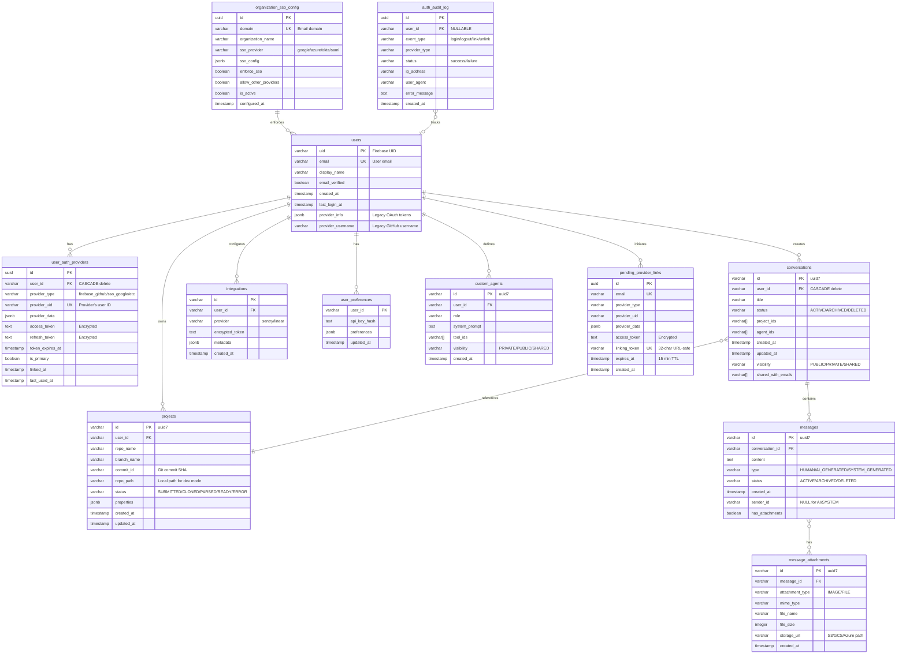
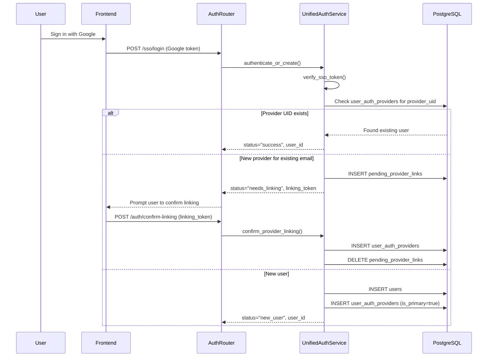
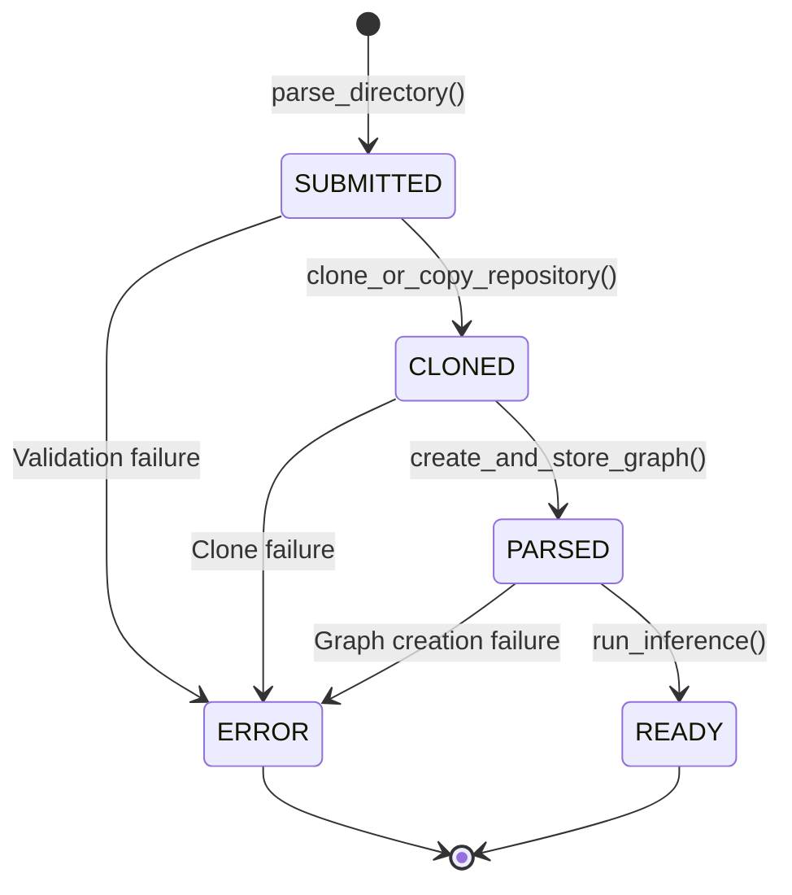
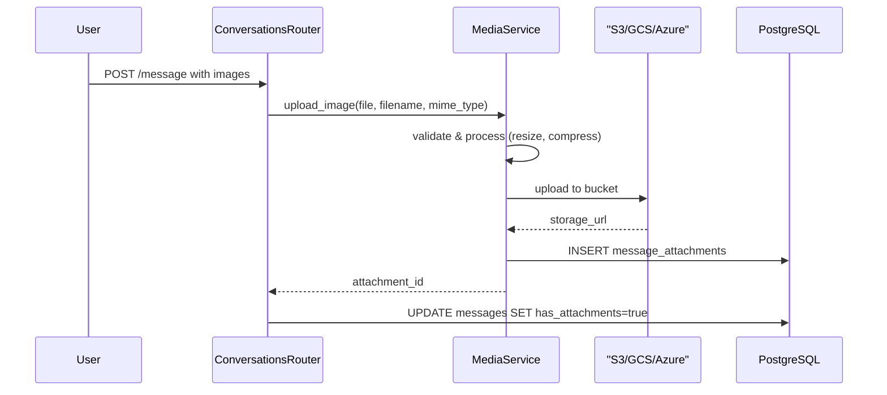
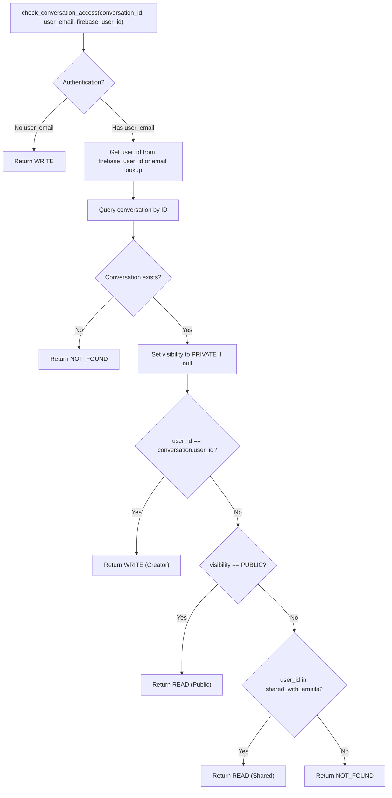
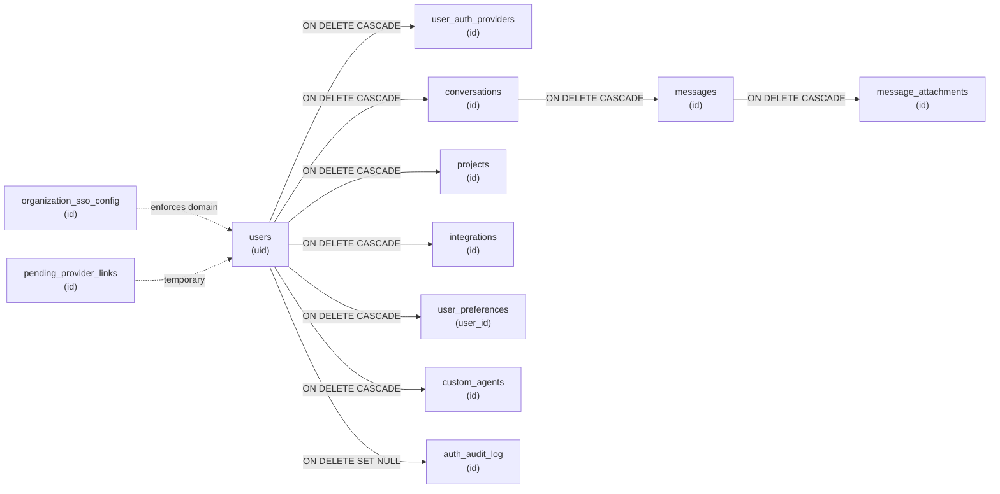
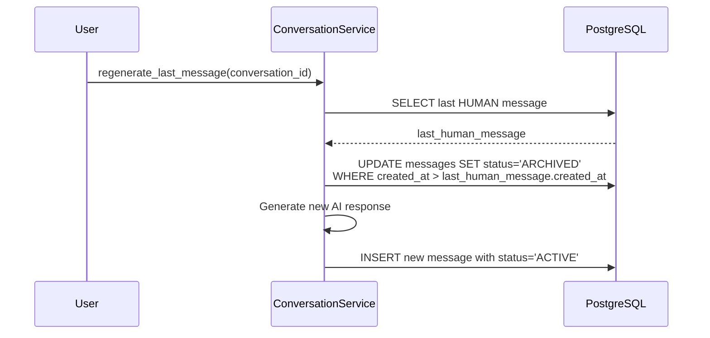
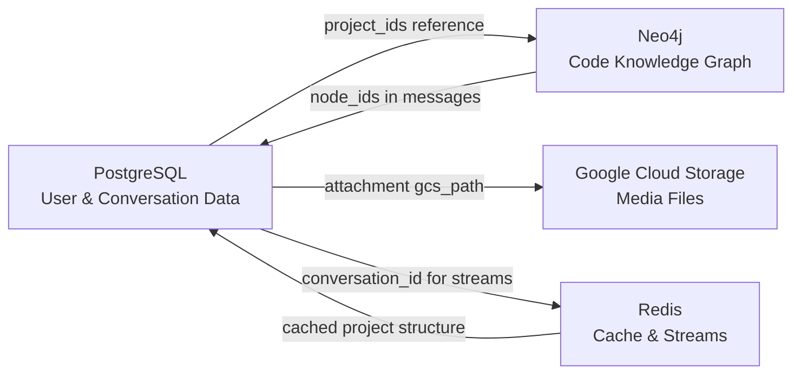

10.1-PostgreSQL Schema

# Page: PostgreSQL Schema

# PostgreSQL Schema

<details>
<summary>Relevant source files</summary>

The following files were used as context for generating this wiki page:

- [app/modules/auth/auth_router.py](app/modules/auth/auth_router.py)
- [app/modules/auth/auth_schema.py](app/modules/auth/auth_schema.py)
- [app/modules/auth/sso_providers/google_provider.py](app/modules/auth/sso_providers/google_provider.py)
- [app/modules/auth/unified_auth_service.py](app/modules/auth/unified_auth_service.py)
- [app/modules/code_provider/github/github_service.py](app/modules/code_provider/github/github_service.py)
- [app/modules/users/user_controller.py](app/modules/users/user_controller.py)
- [app/modules/users/user_router.py](app/modules/users/user_router.py)
- [app/modules/users/user_schema.py](app/modules/users/user_schema.py)
- [app/modules/users/user_service.py](app/modules/users/user_service.py)

</details>


## Purpose and Scope

This document describes the PostgreSQL relational database schema used in the potpie system. PostgreSQL stores user accounts, conversation metadata, messages, project information, integrations, and user preferences. For information about the knowledge graph schema, see [Neo4j Knowledge Graph](#10.2). For caching and streaming patterns, see [Redis Architecture](#10.3).

The PostgreSQL database serves as the primary source of truth for user-facing data, supporting authentication, conversation management, and access control. All tables use UUID version 7 (`uuid7()`) for primary keys to ensure time-ordered identifiers.

## Schema Overview

The following diagram shows the main tables and their relationships:



**Sources:** 
- [app/modules/conversations/conversation/conversation_service.py:12-48]()
- [app/modules/auth/unified_auth_service.py:41-46]()
- [app/modules/auth/auth_router.py:23-34]()
- [app/modules/projects/projects_service.py:88-152]()
- [app/modules/parsing/graph_construction/parsing_controller.py:39-104]()

## Core Tables

### Users Table

The `users` table stores user account information synchronized from Firebase Authentication. The `uid` field corresponds to the Firebase user ID and serves as the primary key throughout the system.

| Column | Type | Constraints | Description |
|--------|------|-------------|-------------|
| `uid` | VARCHAR | PRIMARY KEY | Firebase authentication UID |
| `email` | VARCHAR | UNIQUE, NOT NULL | User email address |
| `display_name` | VARCHAR | | User's display name |
| `email_verified` | BOOLEAN | | Email verification status |
| `created_at` | TIMESTAMP | | Account creation timestamp |
| `last_login_at` | TIMESTAMP(TZ) | | Last successful login |
| `provider_info` | JSONB | | **Legacy:** OAuth tokens (deprecated) |
| `provider_username` | VARCHAR | | **Legacy:** GitHub username (deprecated) |

**Migration Note:** The `provider_info` and `provider_username` fields are deprecated in favor of the `user_auth_providers` table for multi-provider authentication. These fields are maintained for backward compatibility with existing users.

**Sources:** [app/modules/auth/auth_router.py:86-437](), [app/modules/auth/unified_auth_service.py:57-76]()

### User Auth Providers Table

The `user_auth_providers` table implements the multi-provider authentication system, allowing users to link multiple authentication providers (GitHub, Google, Azure, Okta, SAML) to a single account.

| Column | Type | Constraints | Description |
|--------|------|-------------|-------------|
| `id` | UUID | PRIMARY KEY | Provider link identifier |
| `user_id` | VARCHAR | FK(users.uid) ON DELETE CASCADE, UNIQUE(user_id, provider_type) | User identifier |
| `provider_type` | VARCHAR | NOT NULL | Provider type constant |
| `provider_uid` | VARCHAR | UNIQUE, NOT NULL | Provider's unique ID for user |
| `provider_data` | JSONB | | Provider-specific metadata (username, email, etc.) |
| `access_token` | TEXT | | **Encrypted** OAuth access token |
| `refresh_token` | TEXT | | **Encrypted** OAuth refresh token |
| `token_expires_at` | TIMESTAMP(TZ) | | Token expiration time |
| `is_primary` | BOOLEAN | DEFAULT FALSE | Primary authentication provider flag |
| `linked_at` | TIMESTAMP(TZ) | DEFAULT NOW() | Provider linking timestamp |
| `last_used_at` | TIMESTAMP(TZ) | | Last authentication timestamp |

**Provider Type Constants:**
- `firebase_github` - GitHub OAuth via Firebase
- `firebase_email_password` - Email/password via Firebase
- `sso_google` - Google Workspace/Gmail SSO
- `sso_azure` - Azure Active Directory SSO
- `sso_okta` - Okta SSO
- `sso_saml` - Generic SAML SSO

**Unique Constraints:**
1. `UNIQUE(user_id, provider_type)` - One provider type per user
2. `UNIQUE(provider_uid)` - Provider UIDs are globally unique across all users

**Token Encryption:** Access and refresh tokens are encrypted using Fernet symmetric encryption before storage. The `encrypt_token()` and `decrypt_token()` functions handle encryption/decryption transparently.

**Multi-Provider Linking Flow:**


**Sources:** 
- [app/modules/auth/unified_auth_service.py:22-27]()
- [app/modules/auth/unified_auth_service.py:228-306]()
- [app/modules/auth/auth_router.py:440-614]()

### Pending Provider Links Table

The `pending_provider_links` table stores temporary provider linking tokens to prevent account duplication when a user attempts to sign in with a new provider using an email that already exists in the system.

| Column | Type | Constraints | Description |
|--------|------|-------------|-------------|
| `id` | UUID | PRIMARY KEY | Link request identifier |
| `email` | VARCHAR | UNIQUE, NOT NULL | User email address |
| `provider_type` | VARCHAR | NOT NULL | New provider type |
| `provider_uid` | VARCHAR | NOT NULL | Provider's user ID |
| `provider_data` | JSONB | | Provider-specific data |
| `access_token` | TEXT | | **Encrypted** OAuth token |
| `linking_token` | VARCHAR(32) | UNIQUE, NOT NULL | URL-safe confirmation token |
| `expires_at` | TIMESTAMP(TZ) | NOT NULL | Expiration time (15 minutes) |
| `created_at` | TIMESTAMP(TZ) | DEFAULT NOW() | Creation timestamp |

**Flow:**
1. User signs in with new provider (e.g., Google) using email that already exists
2. `UnifiedAuthService.authenticate_or_create()` detects existing email with different provider
3. Creates `pending_provider_links` entry with 15-minute expiration
4. Returns `linking_token` to frontend
5. User confirms linking via `POST /auth/confirm-linking`
6. `confirm_provider_linking()` validates token and creates `user_auth_providers` entry
7. Deletes `pending_provider_links` entry

**Automatic Cleanup:** Expired entries (older than 15 minutes) are cleaned up during the confirmation flow.

**Sources:** 
- [app/modules/auth/unified_auth_service.py:18-19]()
- [app/modules/auth/unified_auth_service.py:345-442]()

### Organization SSO Config Table

The `organization_sso_config` table stores SSO configuration for organizations, allowing domain-based SSO enforcement.

| Column | Type | Constraints | Description |
|--------|------|-------------|-------------|
| `id` | UUID | PRIMARY KEY | Configuration identifier |
| `domain` | VARCHAR | UNIQUE, NOT NULL | Email domain (e.g., "acme.com") |
| `organization_name` | VARCHAR | | Organization display name |
| `sso_provider` | VARCHAR | NOT NULL | SSO provider (google/azure/okta/saml) |
| `sso_config` | JSONB | NOT NULL | Provider-specific configuration |
| `enforce_sso` | BOOLEAN | DEFAULT FALSE | Require SSO for this domain |
| `allow_other_providers` | BOOLEAN | DEFAULT TRUE | Allow non-SSO providers |
| `is_active` | BOOLEAN | DEFAULT TRUE | Configuration active status |
| `configured_at` | TIMESTAMP(TZ) | DEFAULT NOW() | Configuration creation time |

**SSO Config Examples:**

**Google:**
```json
{
  "hosted_domain": "acme.com",
  "client_id": "...",
  "client_secret": "..."
}
```

**Azure:**
```json
{
  "tenant_id": "...",
  "client_id": "...",
  "client_secret": "..."
}
```

**SAML:**
```json
{
  "entity_id": "https://acme.okta.com/...",
  "sso_url": "https://acme.okta.com/app/.../sso/saml",
  "x509_cert": "..."
}
```

**Enforcement Logic:**

When `enforce_sso = true` and `allow_other_providers = false`:
- Users with email domain matching the organization must use the configured SSO provider
- Attempts to sign in with other providers (e.g., GitHub) are blocked

**Sources:** [app/modules/auth/unified_auth_service.py:42-45]()

### Auth Audit Log Table

The `auth_audit_log` table tracks all authentication events for security auditing and debugging.

| Column | Type | Constraints | Description |
|--------|------|-------------|-------------|
| `id` | UUID | PRIMARY KEY | Audit entry identifier |
| `user_id` | VARCHAR | FK(users.uid), NULLABLE | User involved (NULL for failed logins) |
| `event_type` | VARCHAR | NOT NULL | Event type |
| `provider_type` | VARCHAR | | Authentication provider |
| `status` | VARCHAR | NOT NULL | success/failure |
| `ip_address` | VARCHAR | | Client IP address |
| `user_agent` | VARCHAR | | Client user agent |
| `error_message` | TEXT | | Error details for failures |
| `created_at` | TIMESTAMP(TZ) | DEFAULT NOW() | Event timestamp |

**Event Types:**
- `login` - Successful authentication
- `login_failed` - Failed authentication attempt
- `logout` - User logout
- `provider_linked` - New provider linked to account
- `provider_unlinked` - Provider removed from account
- `token_refresh` - OAuth token refresh

**Audit Query Example:**
```python
# Get failed login attempts for security monitoring
failed_logins = db.query(AuthAuditLog).filter(
    AuthAuditLog.event_type == "login_failed",
    AuthAuditLog.created_at >= datetime.now() - timedelta(hours=24)
).all()
```

**Sources:** [app/modules/auth/unified_auth_service.py:46]()

### Conversations Table

The `conversations` table stores conversation metadata. Each conversation is associated with a single user (creator) but can be shared with multiple users via `shared_with_emails`.

| Column | Type | Constraints | Description |
|--------|------|-------------|-------------|
| `id` | VARCHAR | PRIMARY KEY | UUID v7 identifier |
| `user_id` | VARCHAR | FK(users.uid) ON DELETE CASCADE | Conversation creator |
| `title` | VARCHAR | | Conversation title (auto-generated) |
| `status` | VARCHAR | | ConversationStatus enum |
| `project_ids` | VARCHAR[] | | Array of project IDs (typically 1) |
| `agent_ids` | VARCHAR[] | | Array of agent IDs (typically 1) |
| `created_at` | TIMESTAMP | | Creation timestamp |
| `updated_at` | TIMESTAMP | | Last modification timestamp |
| `visibility` | VARCHAR | | Visibility enum: PUBLIC/PRIVATE |
| `shared_with_emails` | VARCHAR[] | | Emails with read access |

**Conversation Status Enum:** `ACTIVE`, `ARCHIVED`, `DELETED`

**Visibility Enum:** `PUBLIC`, `PRIVATE`

The foreign key constraint includes `ON DELETE CASCADE`, ensuring that when a user is deleted, all their conversations are automatically removed.

**Sources:** 
- [app/modules/conversations/conversation/conversation_service.py:232-255]()
- [app/alembic/versions/20240820182032_d3f532773223_changes_for_implementation_of_.py:36-41]()
- [app/modules/conversations/conversation/conversation_schema.py:13-51]()

### Messages Table

The `messages` table stores individual messages within conversations. Messages can be of three types: `HUMAN` (user input), `AI_GENERATED` (agent responses), or `SYSTEM_GENERATED` (system notifications).

| Column | Type | Constraints | Description |
|--------|------|-------------|-------------|
| `id` | VARCHAR | PRIMARY KEY | UUID v7 identifier |
| `conversation_id` | VARCHAR | FK(conversations.id) | Parent conversation |
| `content` | TEXT | | Message text content |
| `type` | VARCHAR | | MessageType enum |
| `status` | VARCHAR | DEFAULT 'ACTIVE' | MessageStatus enum |
| `created_at` | TIMESTAMP | | Creation timestamp |
| `sender_id` | VARCHAR | NULLABLE | User ID for HUMAN messages only |
| `has_attachments` | BOOLEAN | | Flag for multimodal messages |

**MessageType Enum:** `HUMAN`, `AI_GENERATED`, `SYSTEM_GENERATED`

**MessageStatus Enum:** `ACTIVE`, `ARCHIVED`, `DELETED`

**Check Constraint:**
```sql
CHECK (
  (type = 'HUMAN' AND sender_id IS NOT NULL) OR 
  (type IN ('AI_GENERATED', 'SYSTEM_GENERATED') AND sender_id IS NULL)
)
```

This constraint ensures that human messages always have a `sender_id` while AI and system messages do not.

**Sources:** 
- [app/modules/conversations/message/message_service.py:35-68]()
- [app/alembic/versions/20240820182032_d3f532773223_changes_for_implementation_of_.py:46-55]()
- [app/alembic/versions/20240820182032_d3f532773223_changes_for_implementation_of_.py:72-81]()

### Projects Table

The `projects` table tracks parsed code repositories and their processing status.

| Column | Type | Constraints | Description |
|--------|------|-------------|-------------|
| `id` | VARCHAR | PRIMARY KEY | UUID v7 identifier |
| `user_id` | VARCHAR | FK(users.uid) | Project owner |
| `repo_name` | VARCHAR | | Repository name (normalized) |
| `branch_name` | VARCHAR | | Git branch name |
| `commit_id` | VARCHAR | | Git commit SHA (optional) |
| `repo_path` | VARCHAR | | Local filesystem path (dev mode) |
| `status` | VARCHAR | | ProjectStatusEnum |
| `properties` | JSONB | | Additional metadata |
| `created_at` | TIMESTAMP | | Project creation timestamp |
| `updated_at` | TIMESTAMP(TZ) | | Last status update |

**ProjectStatusEnum:** `SUBMITTED` → `CLONED` → `PARSED` → `READY` or `ERROR`

The status follows a state machine pattern as the repository is cloned and parsed into the Neo4j knowledge graph:



**Commit ID Deduplication:**

The `commit_id` field enables deduplication of demo repositories. When a user requests parsing of a demo repo, the system:
1. Checks if a project exists with matching `repo_name` and `commit_id`
2. If found, duplicates the Neo4j graph instead of re-parsing
3. This optimization is used for popular repositories to save processing time

**Lookup Behavior:**
- If `commit_id` is provided, lookup uses `(repo_name, commit_id, user_id, repo_path)`
- If `commit_id` is NULL, lookup uses `(repo_name, branch_name, user_id, repo_path)`
- This prevents conflicts when the same branch has different commits

**Sources:** 
- [app/modules/projects/projects_service.py:88-152]()
- [app/modules/projects/projects_service.py:200-254]()
- [app/modules/parsing/graph_construction/parsing_controller.py:112-186]()
- [app/modules/parsing/graph_construction/parsing_service.py:102-273]()

### Integrations Table

The `integrations` table stores OAuth connections to external services like Sentry and Linear.

| Column | Type | Constraints | Description |
|--------|------|-------------|-------------|
| `id` | VARCHAR | PRIMARY KEY | Integration identifier |
| `user_id` | VARCHAR | FK(users.uid) | Integration owner |
| `provider` | VARCHAR | | Provider name (sentry/linear) |
| `encrypted_token` | TEXT | | Encrypted OAuth access token |
| `metadata` | JSONB | | Provider-specific metadata |
| `created_at` | TIMESTAMP | | Integration creation time |

Tokens are encrypted before storage and decrypted on retrieval by the IntegrationsService. See [Integration Service Architecture](#8.1) for encryption details.

**Sources:** Inferred from system architecture diagrams and integration service references

### User Preferences Table

The `user_preferences` table stores user-specific configuration and API keys.

| Column | Type | Constraints | Description |
|--------|------|-------------|-------------|
| `user_id` | VARCHAR | PRIMARY KEY, FK(users.uid) | User identifier |
| `api_key_hash` | TEXT | | Hashed API key for authentication |
| `preferences` | JSONB | | User preferences and settings |
| `updated_at` | TIMESTAMP | | Last modification time |

The `api_key_hash` field stores bcrypt-hashed API keys used for the `X-API-Key` authentication mechanism. See [API Key Management](#7.4) for the hashing and validation flow.

**Sources:** Referenced in system architecture documentation

### Custom Agents Table

The `custom_agents` table stores user-defined custom agents created via natural language prompts.

| Column | Type | Constraints | Description |
|--------|------|-------------|-------------|
| `id` | VARCHAR | PRIMARY KEY | UUID v7 identifier |
| `user_id` | VARCHAR | FK(users.uid) | Agent creator |
| `role` | VARCHAR | | Agent role/name |
| `system_prompt` | TEXT | | Custom system instructions |
| `tool_ids` | VARCHAR[] | | Array of enabled tool IDs |
| `created_at` | TIMESTAMP | | Agent creation timestamp |

Custom agents allow users to define specialized agents with specific tool configurations. See [Custom Agents](#2.4) for creation workflow.

**Sources:** 
- [app/modules/conversations/conversation/conversation_service.py:28]()
- [app/modules/users/user_controller.py:38-43]()

### Message Attachments Table

The `message_attachments` table stores metadata for multimodal content (images) uploaded to conversations.

| Column | Type | Constraints | Description |
|--------|------|-------------|-------------|
| `id` | VARCHAR | PRIMARY KEY | UUID v7 identifier |
| `message_id` | VARCHAR | FK(messages.id) ON DELETE CASCADE | Associated message |
| `attachment_type` | VARCHAR | | AttachmentType enum |
| `mime_type` | VARCHAR | | Content MIME type |
| `file_name` | VARCHAR | | Original filename |
| `file_size` | INTEGER | | File size in bytes |
| `storage_url` | VARCHAR | | Cloud storage path (S3/GCS/Azure) |
| `created_at` | TIMESTAMP | | Upload timestamp |

**AttachmentType Enum:** `IMAGE`, `FILE`

The `storage_url` field contains the full path to the object in cloud storage (S3, Google Cloud Storage, or Azure Blob Storage), determined by the `MediaService` based on environment configuration. The multimodal processing flow is documented in [Multimodal Support](#3.3).

**Image Upload Flow:**


**Sources:** 
- [app/modules/conversations/conversations_router.py:197-235]()
- [app/modules/conversations/conversation/conversation_service.py:569-584]()

## Access Control Pattern

The conversation access control system uses a three-tier model implemented in `check_conversation_access()`:



**Access Type Enum Values:**
- `WRITE`: Full access (creator only) - can modify, delete, regenerate
- `READ`: Read-only access (public or shared users) - can view but not modify
- `NOT_FOUND`: No access (unauthorized users)

**Key Implementation Details:**

1. **Creator Check:** The user who created the conversation (`conversation.user_id`) always receives `WRITE` access regardless of visibility settings.

2. **Public Conversations:** When `visibility = PUBLIC`, all authenticated users receive `READ` access.

3. **Shared Access:** Users listed in `shared_with_emails[]` receive `READ` access even for private conversations.

4. **Email Lookup:** The system converts emails to user IDs via `get_user_ids_by_emails()` to check shared access.

**Sources:** [app/modules/conversations/conversation/conversation_service.py:128-180]()

## Foreign Key Relationships and Cascade Behavior

The following diagram shows foreign key relationships with their cascade rules:



**Cascade Deletion Rules:**

1. **User Deletion:** When a user is deleted from the `users` table, all associated records are automatically deleted:
   - All authentication providers (`user_auth_providers`)
   - All conversations created by the user
   - All projects owned by the user
   - All integrations configured by the user
   - User preferences
   - Custom agents defined by the user
   - Audit log entries have `user_id` set to NULL (preserved for security auditing)

2. **Conversation Deletion:** When a conversation is deleted, all its messages are automatically deleted.

3. **Message Deletion:** When a message is deleted, all its attachments are automatically deleted.

The cascade behavior is implemented at the database level via foreign key constraints, ensuring referential integrity even if application-level deletion logic fails.

**Provider Unlinking Constraint:**

The system prevents unlinking the last authentication provider for a user:

```python
# In UnifiedAuthService.unlink_provider()
providers = self.get_user_providers(user_id)
if len(providers) == 1:
    raise ValueError("Cannot unlink the only authentication provider")
```

This ensures users always have at least one way to authenticate.

**Sources:** 
- [app/modules/auth/unified_auth_service.py:445-521]()
- [app/modules/conversations/conversation/conversation_service.py:1001-1062]()

## Query Patterns and Pagination

### Conversation Listing

The `get_conversations_with_projects_for_user()` method demonstrates the standard pagination and sorting pattern:

```python
query = self.db.query(Conversation).filter(Conversation.user_id == user_id)

# Sorting
sort_column = getattr(Conversation, sort)  # "updated_at" or "created_at"
if order.lower() == "asc":
    query = query.order_by(sort_column)
else:
    query = query.order_by(desc(sort_column))

# Pagination
conversations = query.offset(start).limit(limit).all()
```

**Default Sort:** `ORDER BY updated_at DESC`

This ensures the most recently active conversations appear first in user conversation lists.

**Sources:** [app/modules/users/user_service.py:118-154]()

### Message Retrieval with Count

The conversation info query uses an aggregation to count human messages:

```python
result = (
    self.sql_db.query(
        Conversation,
        func.count(Message.id)
        .filter(Message.type == MessageType.HUMAN)
        .label("human_message_count"),
    )
    .outerjoin(Message, Conversation.id == Message.conversation_id)
    .filter(Conversation.id == conversation_id)
    .group_by(Conversation.id)
    .first()
)
```

This query is used to determine if title generation should occur (only on the first human message).

**Sources:** [app/modules/conversations/conversation/conversation_service.py:381-401]()

### User Lookup Queries

Two common patterns for user lookups:

1. **Single User by Email:**
```python
user = self.db.query(User).filter(User.email == email).first()
```

2. **Multiple Users by Emails (Bulk):**
```python
users = self.db.query(User).filter(User.email.in_(emails)).all()
user_ids = [user.uid for user in users]
```

The bulk query is used for checking shared conversation access when `shared_with_emails` contains multiple entries.

**Sources:** [app/modules/users/user_service.py:176-221]()

## Message Archival Pattern

Messages use a soft-delete pattern via the `status` field rather than physical deletion. The `regenerate_last_message()` flow demonstrates this:



**Archive Query:**
```python
self.sql_db.query(Message).filter(
    Message.conversation_id == conversation_id,
    Message.created_at > timestamp,
).update(
    {Message.status: MessageStatus.ARCHIVED}, 
    synchronize_session="fetch"
)
```

This preserves message history for potential recovery while hiding archived messages from normal queries. Queries typically filter by `status = 'ACTIVE'`.

**Sources:** [app/modules/conversations/conversation/conversation_service.py:603-625]()

## UUID Version 7 Strategy

All primary keys use UUID version 7 (`uuid7()`) which embeds a timestamp in the UUID structure:

```python
conversation_id = str(uuid7())
message_id = str(uuid7())
```

**Benefits of UUID v7:**

1. **Time-Ordered:** UUIDs are naturally ordered by creation time, improving B-tree index performance
2. **Globally Unique:** No coordination needed between application instances
3. **Information Leakage:** Timestamp component allows determining creation time without separate column
4. **Distributed System Ready:** Safe for multi-instance deployments without central ID generation

The `created_at` columns are still maintained for explicit timestamp tracking and timezone handling.

**Sources:** 
- [app/modules/conversations/conversation/conversation_service.py:239]()
- [app/modules/conversations/message/message_service.py:51]()

## Integration with Other Data Stores

The PostgreSQL schema integrates with other data stores in the system:



**Key Integration Points:**

1. **Neo4j Linkage:** The `conversations.project_ids[]` array references repositories stored in Neo4j. Tools query Neo4j using these IDs.

2. **Redis Caching:** Project structure queries are cached in Redis to avoid repeated PostgreSQL lookups.

3. **GCS Storage:** The `attachments.gcs_path` field stores the Cloud Storage location while metadata remains in PostgreSQL.

4. **Node Context:** User messages can include `node_ids[]` referencing Neo4j graph nodes for context-aware queries.

**Sources:** System architecture diagrams and integration patterns

---

## Summary Table: PostgreSQL Tables

| Table | Primary Key | Purpose | Key Relationships |
|-------|-------------|---------|-------------------|
| `users` | `uid` | User accounts from Firebase | Parent to all user-owned entities |
| `conversations` | `id` (uuid7) | Conversation metadata | FK to users, contains messages |
| `messages` | `id` (uuid7) | Individual messages | FK to conversations, has attachments |
| `projects` | `id` (uuid7) | Parsed repositories | FK to users, referenced by conversations |
| `integrations` | `id` | OAuth connections | FK to users |
| `user_preferences` | `user_id` | User settings & API keys | FK to users (1-to-1) |
| `custom_agents` | `id` (uuid7) | User-defined agents | FK to users, referenced by conversations |
| `attachments` | `id` (uuid7) | Media metadata | FK to messages |

**Sources:** All tables documented in this page