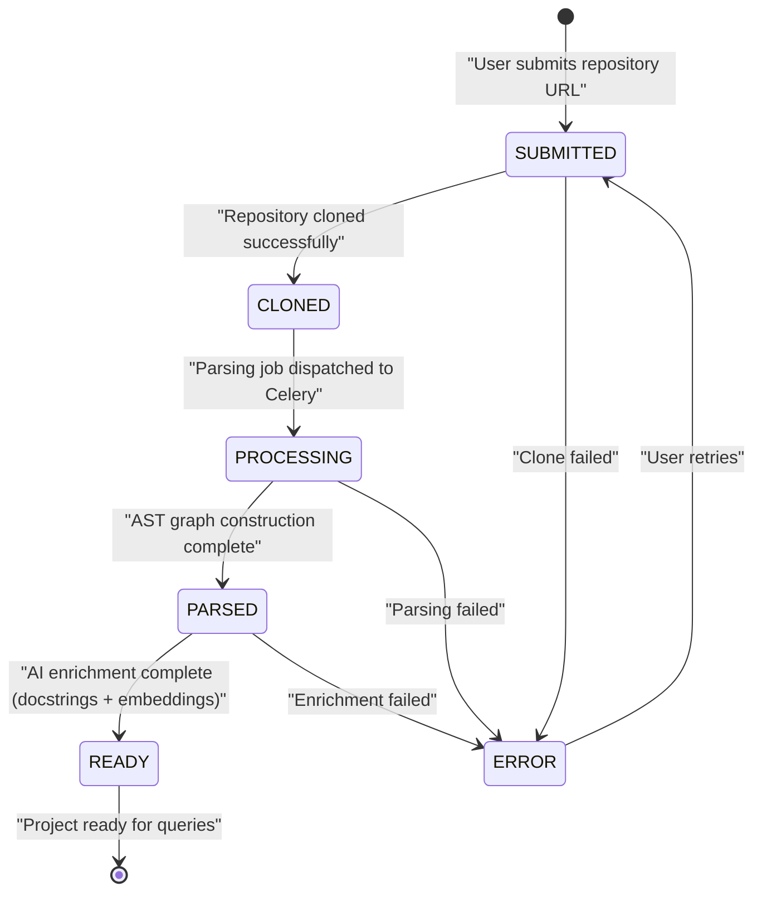
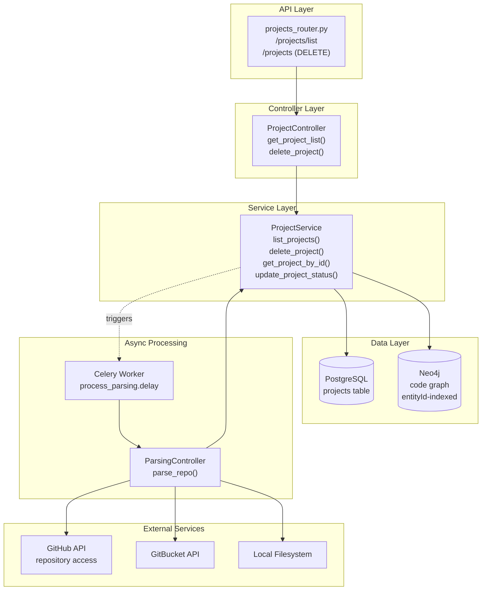
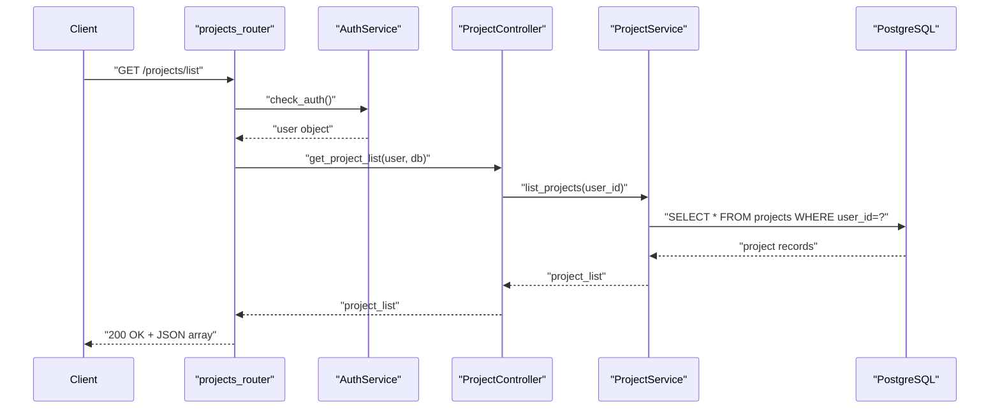
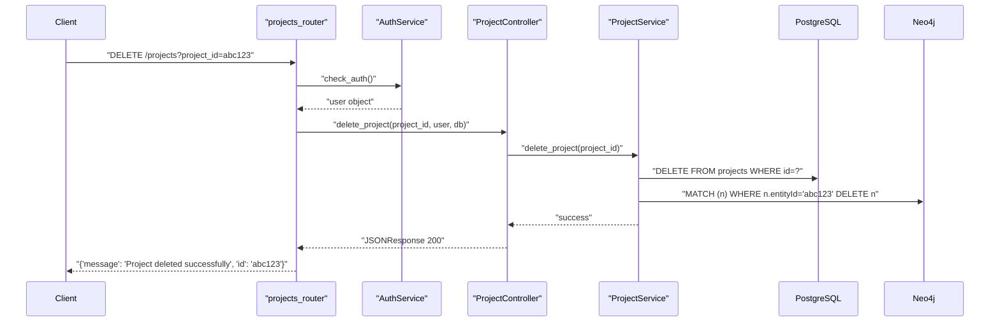
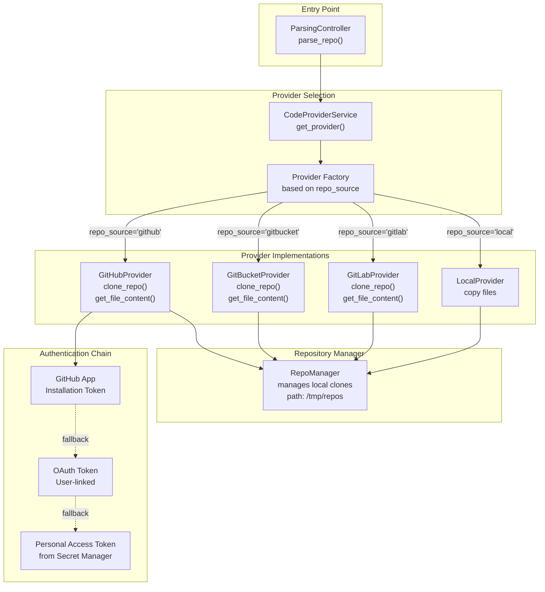
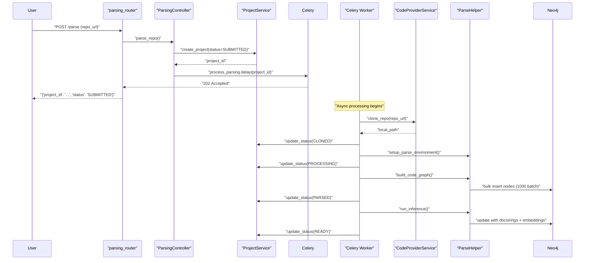
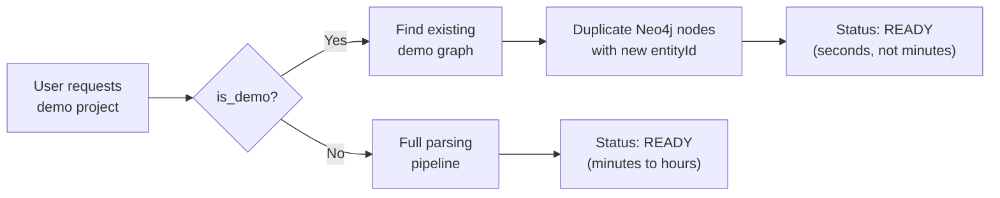

6-Project and Repository Management

# Page: Project and Repository Management

# Project and Repository Management

<details>
<summary>Relevant source files</summary>

The following files were used as context for generating this wiki page:

- [app/modules/projects/projects_controller.py](app/modules/projects/projects_controller.py)
- [app/modules/projects/projects_router.py](app/modules/projects/projects_router.py)
- [app/modules/projects/projects_schema.py](app/modules/projects/projects_schema.py)

</details>


## Purpose and Scope

This document covers the project and repository management subsystem, which handles the lifecycle of code repositories within the Potpie system. A **project** represents a code repository (from GitHub, GitBucket, GitLab, or local filesystem) that has been ingested and analyzed to build a knowledge graph.

This page provides an overview of project lifecycle management, API endpoints, and the multi-provider repository access architecture. For detailed information about:
- Code parsing pipeline and graph construction, see [Repository Parsing Pipeline](#4.1)
- Project CRUD operations and status management, see [Project Service](#6.1)  
- GitHub-specific integration details, see [GitHub Integration](#6.2)
- Multi-provider repository access patterns, see [Multi-Provider Repository Access](#6.3)

---

## Project Lifecycle

Projects progress through a well-defined state machine as they are ingested and processed. The system tracks project status using `ProjectStatusEnum`, which defines six possible states.

### Status Transition Diagram



**Sources:** [app/modules/projects/projects_schema.py:6-12]()

### Status Definitions

| Status | Description | Database State | Next Actions |
|--------|-------------|----------------|--------------|
| `SUBMITTED` | Repository URL submitted by user | Project record created in PostgreSQL | Code provider clones repository |
| `CLONED` | Repository successfully downloaded | Code stored locally/cached | Celery task dispatches parsing job |
| `PROCESSING` | AST parsing in progress | Parser building Neo4j graph | Tree-sitter creates code nodes |
| `PARSED` | Graph construction complete | Neo4j contains FILE/CLASS/FUNCTION nodes | AI enrichment begins (docstrings/embeddings) |
| `READY` | Fully processed and queryable | Graph enriched with docstrings + vectors | Available for agent queries |
| `ERROR` | Processing failed at any stage | Error details logged | User can retry or delete |

**Sources:** [app/modules/projects/projects_schema.py:6-12]()

---

## System Architecture

Projects sit at the intersection of three major subsystems: authentication (ownership), parsing (knowledge graph construction), and conversation (query context).

### Project Module Architecture



**Sources:** [app/modules/projects/projects_router.py:1-24](), [app/modules/projects/projects_controller.py:1-35]()

### Integration with Core Systems

Projects are created when users submit repository URLs for analysis. The workflow integrates with multiple subsystems:

1. **Authentication Service**: Validates user ownership via `AuthService.check_auth` before allowing project operations
2. **Parsing Service**: Celery background tasks clone repositories and build knowledge graphs (see [Repository Parsing Pipeline](#4.1))
3. **Neo4j Service**: Stores code graphs with `entityId` property mapping to `project_id` for multi-tenant isolation
4. **Conversation Service**: Uses `project_id` to scope queries to specific codebases
5. **Code Provider Service**: Abstracts GitHub/GitBucket/Local access for repository cloning

**Sources:** [app/modules/projects/projects_router.py:12-24](), [app/modules/projects/projects_controller.py:9-35]()

---

## API Endpoints

The projects router exposes two primary endpoints for project management.

### GET /projects/list

Retrieves all projects owned by the authenticated user.



**Request:**
- Method: `GET`
- Path: `/projects/list`
- Auth: Required (JWT token or session)

**Response:**
- Returns array of project objects with fields: `id`, `name`, `repo_url`, `status`, `created_at`, etc.

**Sources:** [app/modules/projects/projects_router.py:12-14](), [app/modules/projects/projects_controller.py:10-20]()

### DELETE /projects

Deletes a project and its associated data.



**Request:**
- Method: `DELETE`
- Path: `/projects`
- Query Param: `project_id` (string)
- Auth: Required

**Response:**
- Status: `200 OK`
- Body: `{"message": "Project deleted successfully.", "id": "<project_id>"}`

**Error Handling:**
- Returns `500` with error details if deletion fails
- Cascades deletion to Neo4j graph nodes via `entityId` property

**Sources:** [app/modules/projects/projects_router.py:17-24](), [app/modules/projects/projects_controller.py:22-34]()

---

## Repository Provider Architecture

The system supports multiple code hosting platforms through a provider abstraction layer. This enables users to connect repositories from GitHub, GitBucket, GitLab, or local filesystems.

### Multi-Provider Access Flow



**Sources:** Referenced from [Diagram 3: Code Analysis Pipeline]() in system architecture

### Authentication Fallback Chain

For GitHub repositories, the system attempts authentication in the following order:

1. **GitHub App Installation Token**: Preferred method for organizations with the GitHub App installed
2. **User OAuth Token**: Uses token from user's linked GitHub account (see [GitHub Linking Requirement](#7.2))
3. **Fallback PAT**: System-level Personal Access Token from Google Secret Manager

This three-tier fallback ensures maximum compatibility across different deployment scenarios and user authentication states.

**Sources:** Referenced from [Multi-Provider Repository Access](#6.3) and [GitHub Integration](#6.2)

---

## Project Service Layer

The `ProjectService` class provides core business logic for project operations. While the service implementation is not shown in the provided files, the controller layer reveals its interface.

### Key Operations

**Project Listing**
```
ProjectService.list_projects(user_id: str) -> List[Project]
```
- Queries PostgreSQL for all projects owned by `user_id`
- Returns projects with all status fields populated
- Used by: [app/modules/projects/projects_controller.py:16-17]()

**Project Deletion**
```
ProjectService.delete_project(project_id: str) -> None
```
- Deletes project record from PostgreSQL
- Cascades deletion to Neo4j code graph nodes (where `entityId == project_id`)
- May trigger cleanup of cached repository files
- Used by: [app/modules/projects/projects_controller.py:28]()

**Status Management** (not shown but referenced in diagrams)
```
ProjectService.update_project_status(project_id: str, status: ProjectStatusEnum) -> None
```
- Updates project status during parsing pipeline
- Called by Celery workers at each pipeline stage
- Enables UI polling for progress updates

**Sources:** [app/modules/projects/projects_controller.py:16-17](), [app/modules/projects/projects_controller.py:28]()

---

## Data Model

Projects are stored in PostgreSQL with references to Neo4j graph data.

### Projects Table Schema

| Column | Type | Description |
|--------|------|-------------|
| `id` | UUID | Primary key, also used as Neo4j `entityId` |
| `user_id` | UUID | Foreign key to `users` table |
| `name` | String | Repository display name |
| `repo_url` | String | Full repository URL |
| `repo_source` | String | Provider type: `github`, `gitbucket`, `gitlab`, `local` |
| `status` | Enum | Current processing status (see `ProjectStatusEnum`) |
| `created_at` | Timestamp | Project creation time |
| `updated_at` | Timestamp | Last status update time |
| `branch` | String | Repository branch (default: `main`) |
| `is_demo` | Boolean | Whether this is a demo project (enables fast-path duplication) |

### Multi-Tenant Isolation

Neo4j code graph nodes are scoped to projects using the `entityId` property:

```cypher
MATCH (n)
WHERE n.entityId = '<project_id>'
RETURN n
```

This design enables:
- Multiple users to parse the same repository without conflicts
- Efficient cleanup when projects are deleted
- Query scoping for agent tools (see [Code Query Tools](#5.2))

**Sources:** Referenced from [Diagram 5: Data Storage Architecture]() and [Neo4j Graph Structure](#4.3)

---

## Integration with Parsing Pipeline

Project status transitions are driven by the asynchronous parsing pipeline. When a user submits a repository URL, the following workflow executes:

### Parsing Workflow



**Sources:** Referenced from [Diagram 3: Code Analysis Pipeline]() and [Repository Parsing Pipeline](#4.1)

### Error Handling

If any stage fails, the project status transitions to `ERROR`:

- **Clone failures**: Network issues, invalid credentials, repository not found
- **Parsing failures**: Unsupported languages, corrupt files, syntax errors
- **Enrichment failures**: LLM rate limits, embedding service unavailable

Users can retry parsing by re-submitting the repository URL, which resets status to `SUBMITTED`.

**Sources:** [app/modules/projects/projects_schema.py:6-12]()

---

## Demo Project Optimization

The system includes a fast-path optimization for demo repositories. When `is_demo = true`, the system duplicates an existing Neo4j graph instead of re-parsing:



This optimization reduces demo project setup from minutes to seconds, improving onboarding experience. See [Demo Project Duplication](#4.5) for implementation details.

**Sources:** Referenced from [Demo Project Duplication](#4.5)

---

## Summary

The Project and Repository Management subsystem provides:

1. **Lifecycle Management**: Six-state status machine tracking project ingestion and processing
2. **Multi-Provider Support**: Abstracted repository access across GitHub, GitBucket, GitLab, and local filesystems
3. **RESTful API**: Simple endpoints for listing and deleting projects
4. **Multi-Tenant Isolation**: PostgreSQL for metadata, Neo4j with `entityId` scoping for code graphs
5. **Async Processing**: Celery-based pipeline with status updates for long-running operations
6. **Authentication Integration**: User-scoped project ownership with provider-specific auth chains

Projects serve as the foundational entity that ties together repository source code, knowledge graph construction, and user queries through the conversation system.

**Sources:** [app/modules/projects/projects_router.py:1-24](), [app/modules/projects/projects_controller.py:1-35](), [app/modules/projects/projects_schema.py:1-17]()