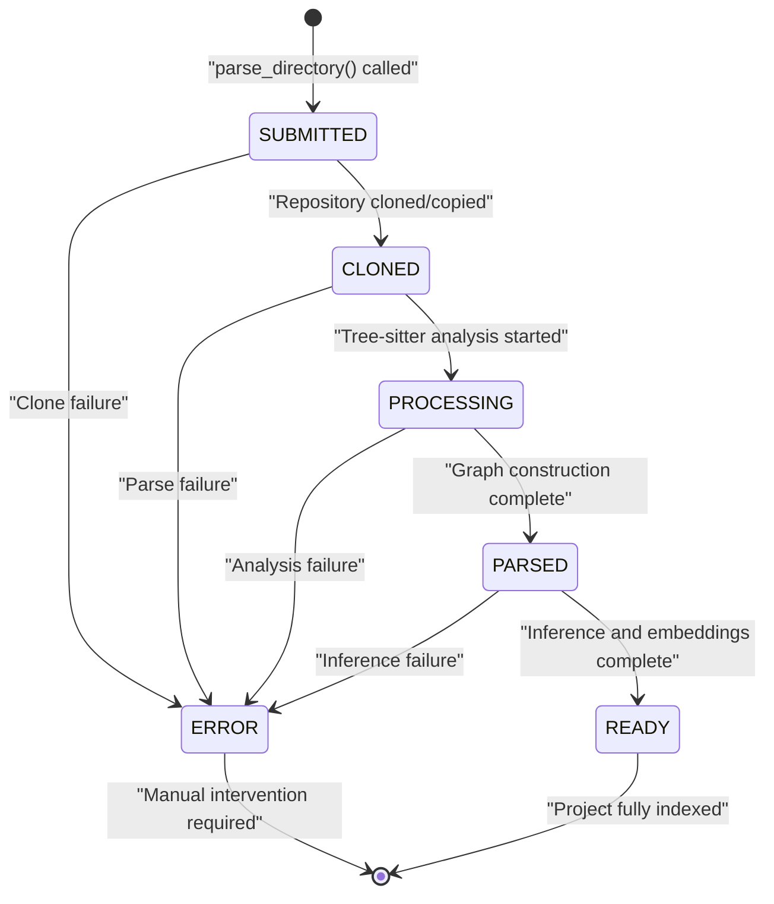
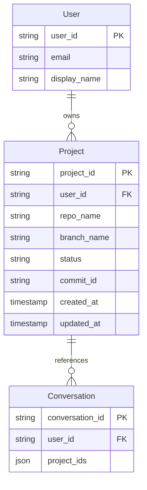
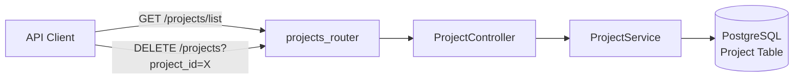
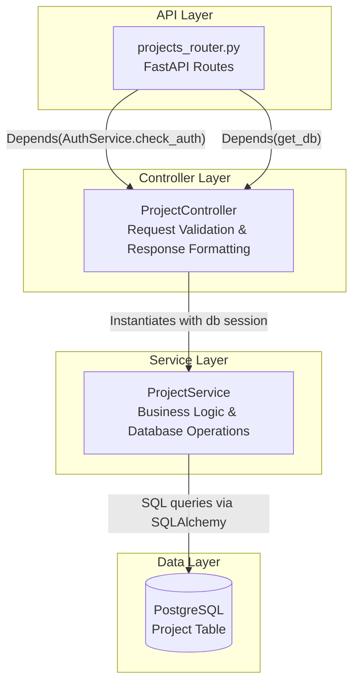
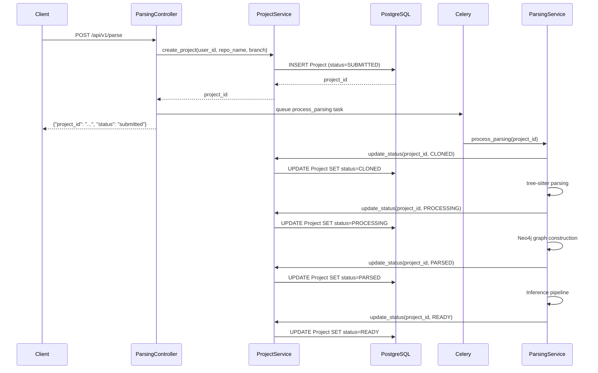
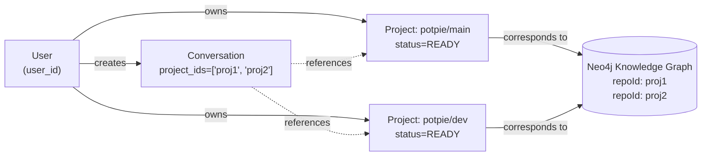

6.1-Project Service

# Page: Project Service

# Project Service

<details>
<summary>Relevant source files</summary>

The following files were used as context for generating this wiki page:

- [app/modules/projects/projects_controller.py](app/modules/projects/projects_controller.py)
- [app/modules/projects/projects_router.py](app/modules/projects/projects_router.py)
- [app/modules/projects/projects_schema.py](app/modules/projects/projects_schema.py)

</details>


## Purpose and Scope

The **Project Service** manages project metadata, lifecycle tracking, and CRUD operations for code repositories ingested into Potpie. It maintains the canonical record of all parsed repositories in PostgreSQL, tracking their ingestion status from initial submission through successful parsing completion or error states.

This service is responsible for:
- Creating and storing project records when repositories are submitted for parsing
- Tracking project status through six lifecycle states: `SUBMITTED`, `CLONED`, `PARSED`, `PROCESSING`, `READY`, and `ERROR`
- Listing user projects with their current status
- Deleting projects and their associated metadata

For information about the repository parsing pipeline that updates project status, see [Repository Parsing Pipeline](#4.1). For Neo4j knowledge graph management, see [Neo4j Graph Structure](#4.3). For user authentication and ownership, see [Multi-Provider Authentication](#7.1).

---

## Project Lifecycle and Status States

Projects progress through a six-state lifecycle managed by the `ProjectStatusEnum`. Each state represents a milestone in the repository ingestion and analysis pipeline.



### Status Definitions

| Status | Description | Database State | Next Actions |
|--------|-------------|----------------|--------------|
| `SUBMITTED` | Initial state when project creation request received | Project record created | Celery task queued for cloning |
| `CLONED` | Repository successfully cloned or copied to local filesystem | Source code available | Begin tree-sitter parsing |
| `PROCESSING` | Tree-sitter analysis in progress, building NetworkX graph | Temporary graph in memory | Convert to Neo4j nodes/relationships |
| `PARSED` | Code graph successfully persisted to Neo4j | Neo4j nodes created | Begin inference pipeline |
| `READY` | AI-generated docstrings and embeddings complete | Fully indexed and searchable | Available for agent queries |
| `ERROR` | Failure at any stage, with error details in project metadata | Requires investigation | Manual intervention or retry |

**Sources:** [app/modules/projects/projects_schema.py:6-12]()

---

## Database Schema

The Project Service manages records in the PostgreSQL `Project` table. While the full schema definition is maintained in the data layer, the key fields tracked by this service include:

| Field | Type | Description |
|-------|------|-------------|
| `project_id` | String (UUID) | Primary key, unique identifier |
| `user_id` | String | Foreign key to User table (tenant isolation) |
| `repo_name` | String | Repository name (e.g., "potpie-ai/potpie") |
| `branch_name` | String | Git branch being indexed (e.g., "main") |
| `status` | Enum | Current lifecycle state (see `ProjectStatusEnum`) |
| `commit_id` | String | Git commit SHA at time of parsing |
| `created_at` | Timestamp | Project creation time |
| `updated_at` | Timestamp | Last status update time |

### Project Identification Pattern

Projects are uniquely identified by the combination of `repo_name`, `branch_name`, and `commit_id`. This allows multiple branches of the same repository to be indexed independently, and enables tracking of changes across commits.



**Sources:** Inferred from [app/modules/projects/projects_schema.py]() and architecture diagrams

---

## API Interface

The Project Service exposes two REST API endpoints through the FastAPI router for project management operations.

### Route Definitions



### GET /projects/list

Returns all projects owned by the authenticated user.

**Authentication:** Required (Bearer token via `AuthService.check_auth`)

**Request Parameters:** None (user ID extracted from auth token)

**Response Format:**
```json
[
  {
    "project_id": "uuid-here",
    "repo_name": "potpie-ai/potpie",
    "branch_name": "main",
    "status": "ready",
    "commit_id": "abc123...",
    "created_at": "2024-01-15T10:30:00Z",
    "updated_at": "2024-01-15T11:00:00Z"
  }
]
```

**Implementation Flow:**
1. `projects_router.get_project_list()` validates authentication
2. Extracts `user_id` from authenticated user context
3. Delegates to `ProjectController.get_project_list()`
4. Controller instantiates `ProjectService(db)` with database session
5. Calls `project_service.list_projects(user_id)`
6. Returns list of project dictionaries

**Sources:** [app/modules/projects/projects_router.py:12-14](), [app/modules/projects/projects_controller.py:10-20]()

### DELETE /projects

Deletes a project and its associated metadata. Note that this operation does **not** automatically delete the Neo4j knowledge graph nodes; that cleanup must be handled separately.

**Authentication:** Required

**Request Parameters:**
- `project_id` (query parameter, string, required): UUID of project to delete

**Response Format:**
```json
{
  "message": "Project deleted successfully.",
  "id": "uuid-here"
}
```

**Error Handling:**
- Returns HTTP 500 with error details if deletion fails
- Common failures: project not found, foreign key constraints, database connection issues

**Implementation Flow:**
1. `projects_router.delete_project()` validates authentication and extracts `project_id`
2. Delegates to `ProjectController.delete_project()`
3. Controller instantiates `ProjectService(db)`
4. Calls `project_service.delete_project(project_id)`
5. Returns success JSON response or raises HTTPException

**Sources:** [app/modules/projects/projects_router.py:17-23](), [app/modules/projects/projects_controller.py:22-34]()

---

## Service Layer Architecture

The Project Service follows a three-layer architecture pattern common throughout Potpie:



### Layer Responsibilities

**Router Layer** ([app/modules/projects/projects_router.py]())
- Defines FastAPI routes with HTTP method decorators
- Injects dependencies: authentication (`AuthService.check_auth`) and database session (`get_db`)
- Routes requests to controller methods
- Does **not** contain business logic

**Controller Layer** ([app/modules/projects/projects_controller.py]())
- Extracts and validates request parameters (e.g., `user_id` from auth context)
- Instantiates `ProjectService` with database session
- Handles exceptions and converts to HTTP responses
- Formats success responses as JSON
- Acts as a thin translation layer between HTTP and business logic

**Service Layer** (not shown in provided files, but referenced)
- Contains core business logic for project operations
- Implements methods: `list_projects(user_id)`, `delete_project(project_id)`, `create_project()`, `update_status()`
- Executes database queries via SQLAlchemy ORM
- Enforces tenant isolation (user can only access their own projects)
- Manages transactional consistency

**Sources:** [app/modules/projects/projects_router.py](), [app/modules/projects/projects_controller.py]()

---

## Integration with Parsing Pipeline

The Project Service plays a critical role in the repository parsing pipeline by maintaining status records throughout the ingestion process.



### Status Update Checkpoints

The parsing pipeline updates project status at five critical checkpoints:

1. **Initial Creation** (`SUBMITTED`): When `parse_directory()` is called, before queueing Celery task
2. **After Cloning** (`CLONED`): When repository is successfully downloaded to local filesystem
3. **During Analysis** (`PROCESSING`): When tree-sitter parsing begins building the code graph
4. **After Graph Persistence** (`PARSED`): When Neo4j nodes and relationships are successfully created
5. **Inference Complete** (`READY`): When AI-generated docstrings and embeddings are added to all nodes

### Error Handling

If any stage fails, the status is set to `ERROR` and error details are stored in the project metadata. The client can poll the project status endpoint to track progress or detect failures.

**Sources:** Inferred from architecture diagrams and [app/modules/projects/projects_schema.py]()

---

## Project-Conversation Relationship

Projects are referenced by conversations to provide context for AI agent queries. The `Conversation` table stores a JSON array of `project_ids` that the conversation has access to.



### Multi-Project Conversations

Agents can query across multiple projects simultaneously when a conversation references multiple `project_ids`. The tool layer filters Neo4j queries by `repoId` to restrict results to the relevant projects.

**Key Pattern:**
- PostgreSQL `Project.project_id` maps to Neo4j `Node.repoId`
- This enables cross-database joins during agent execution
- Agent tools receive `project_ids` from conversation context and use them to filter graph queries

**Sources:** Inferred from architecture diagrams and conversation system context

---

## Project Deletion Behavior

The `delete_project()` operation removes the PostgreSQL project record but has important implications:

### What Gets Deleted
- PostgreSQL `Project` table row
- Project metadata (branch, commit, status)

### What Does NOT Get Deleted
- Neo4j knowledge graph nodes (must be deleted separately via `CodeGraphService`)
- Cached project structure data in Redis
- Conversations that reference the project (foreign key remains, but queries will fail)

### Recommended Deletion Flow
For complete project removal, the following sequence should be executed:

1. Delete Neo4j nodes: `MATCH (n {repoId: $project_id}) DETACH DELETE n`
2. Clear Redis cache: `redis.delete(f"project_structure:{project_id}")`
3. Remove project record: `project_service.delete_project(project_id)`
4. Update conversations: Remove `project_id` from `project_ids` arrays

**Note:** The current API implementation only performs step 3. Full cleanup requires additional operations not exposed via the public API.

**Sources:** [app/modules/projects/projects_controller.py:22-34]()

---

## Status Polling Pattern

Since repository parsing is asynchronous (handled by Celery workers), clients must poll the project status to track progress:

### Polling Implementation Example

```
Client Behavior:
1. POST /api/v1/parse → receives {"project_id": "uuid", "status": "submitted"}
2. Wait 2 seconds
3. GET /projects/list → find project by ID, check status
4. If status === "ready" → parsing complete
5. If status === "error" → parsing failed
6. Otherwise → repeat from step 2
```

### Typical Parsing Timeline

| Repository Size | CLONED | PARSED | READY |
|-----------------|--------|--------|-------|
| Small (<100 files) | 5s | 15s | 30s |
| Medium (100-1000 files) | 10s | 45s | 2min |
| Large (1000+ files) | 30s | 3min | 10min |

**Note:** The `PROCESSING` state is often brief (< 1 second) as it represents the transition between tree-sitter analysis and Neo4j batch insertion.

**Sources:** Inferred from system behavior and [app/modules/projects/projects_schema.py]()

---

## Summary

The Project Service provides a simple but critical layer for managing project metadata and tracking the lifecycle of repository ingestion. Its six-state status model (`SUBMITTED` → `CLONED` → `PROCESSING` → `PARSED` → `READY` / `ERROR`) enables asynchronous parsing with clear progress visibility.

**Key Characteristics:**
- **Stateful Tracking:** Each project maintains current status in PostgreSQL
- **Tenant Isolation:** Users can only access their own projects via `user_id` filtering
- **Async-Friendly:** Status polling pattern supports long-running Celery tasks
- **Thin API Layer:** Two simple endpoints (list, delete) with clear responsibilities
- **Cross-Database Bridge:** `project_id` links PostgreSQL metadata to Neo4j graph nodes via `repoId`

**Integration Points:**
- Called by Parsing Pipeline to create and update project records
- Queried by Conversation System to validate project access
- Referenced by Agent Tools to filter knowledge graph queries
- Used by Frontend to display parsing progress and project lists

**Sources:** All files in [app/modules/projects/]()