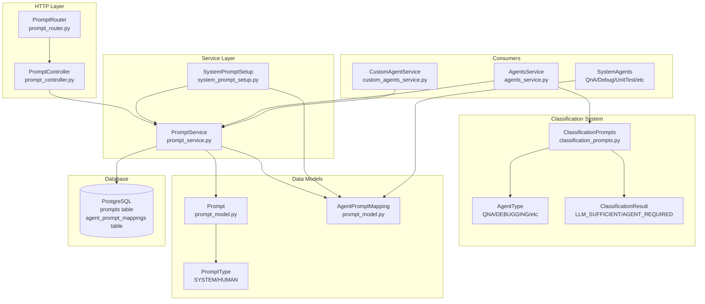
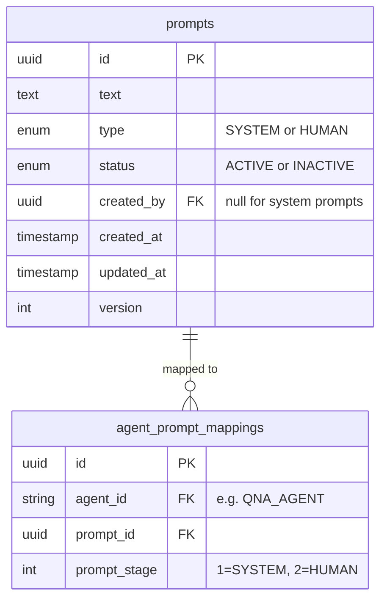
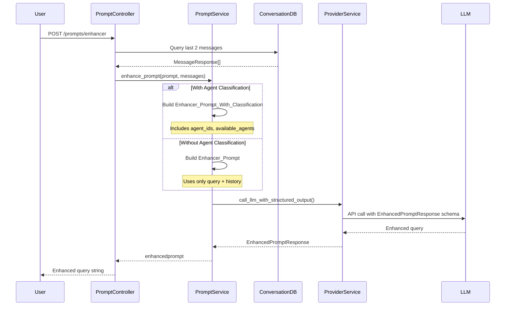
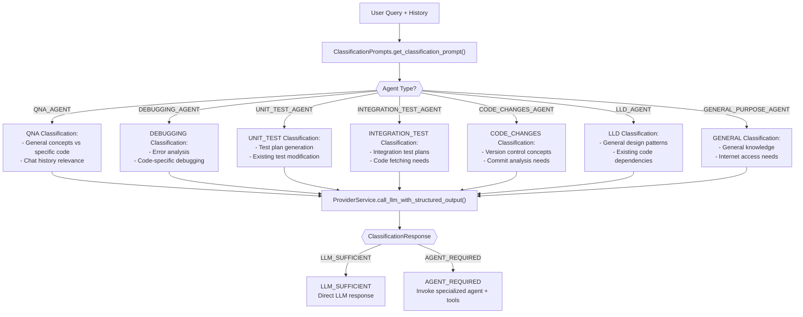
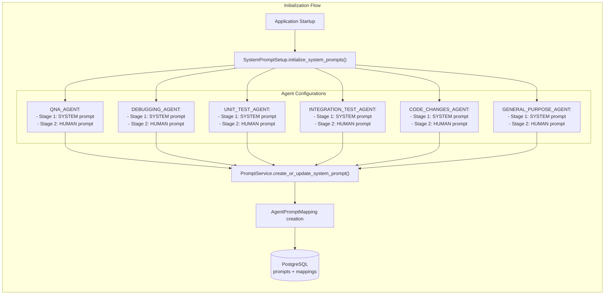
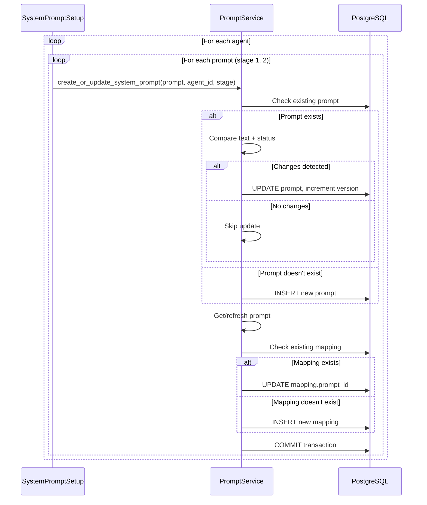
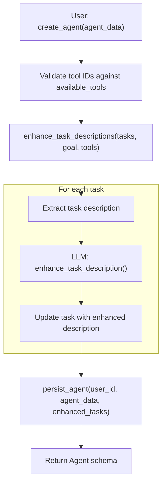
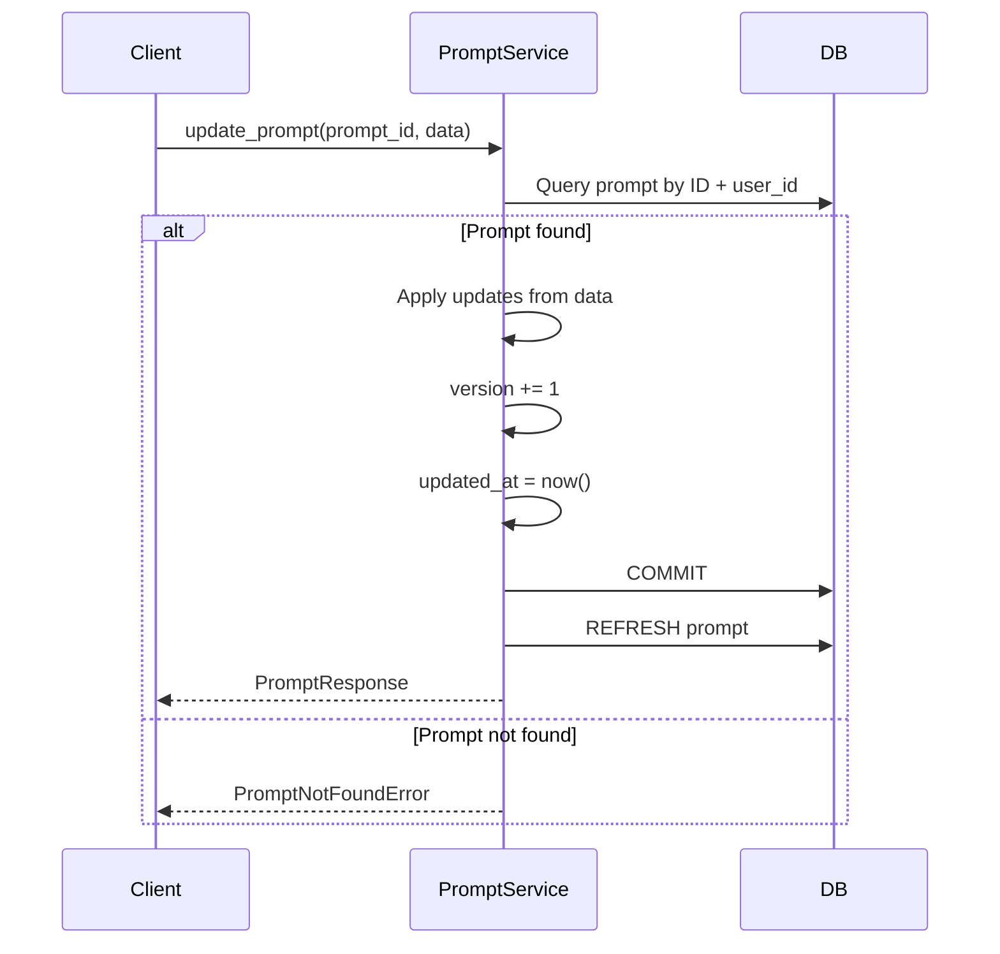
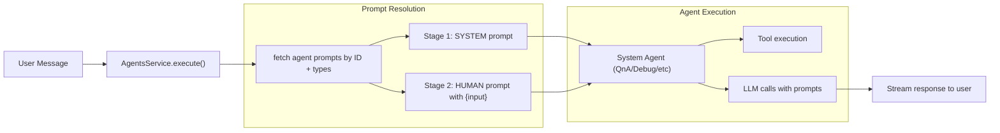

2.6-Prompt Management

# Page: Prompt Management

# Prompt Management

<details>
<summary>Relevant source files</summary>

The following files were used as context for generating this wiki page:

- [app/modules/conversations/conversation/conversation_store.py](app/modules/conversations/conversation/conversation_store.py)
- [app/modules/intelligence/agents/custom_agents/custom_agents_service.py](app/modules/intelligence/agents/custom_agents/custom_agents_service.py)
- [app/modules/intelligence/prompts/classification_prompts.py](app/modules/intelligence/prompts/classification_prompts.py)
- [app/modules/intelligence/prompts/prompt_controller.py](app/modules/intelligence/prompts/prompt_controller.py)
- [app/modules/intelligence/prompts/prompt_router.py](app/modules/intelligence/prompts/prompt_router.py)
- [app/modules/intelligence/prompts/prompt_service.py](app/modules/intelligence/prompts/prompt_service.py)
- [app/modules/intelligence/prompts/system_prompt_setup.py](app/modules/intelligence/prompts/system_prompt_setup.py)
- [app/modules/intelligence/tools/code_query_tools/bash_command_tool.py](app/modules/intelligence/tools/code_query_tools/bash_command_tool.py)

</details>


## Purpose and Scope

This document covers the prompt management system within Potpie's AI/Intelligence layer, which handles the creation, storage, enhancement, and classification of prompts used by AI agents. The system manages both user-defined prompts and system prompts, implements prompt enhancement to add conversational context, and provides classification logic to route queries appropriately. For information about how agents consume these prompts during execution, see [Agent Execution Pipeline](#2.5). For details on the agents themselves, see [System Agents](#2.3) and [Custom Agents](#2.4).

---

## System Architecture

The prompt management system consists of three primary components: the `PromptService` for CRUD operations, classification logic for query routing decisions, and system prompt initialization for agent setup.



**Sources:** [app/modules/intelligence/prompts/prompt_service.py:1-503](), [app/modules/intelligence/prompts/classification_prompts.py:1-538](), [app/modules/intelligence/prompts/system_prompt_setup.py:1-428]()

---

## Core Service: PromptService

The `PromptService` class provides comprehensive CRUD operations for prompts and implements prompt enhancement functionality. It maintains prompts in PostgreSQL with versioning support and manages agent-prompt mappings.

### Key Responsibilities

| Responsibility | Method | Description |
|---------------|---------|-------------|
| **Create Prompt** | `create_prompt()` | Creates new user-defined prompts with versioning |
| **Update Prompt** | `update_prompt()` | Updates existing prompts, increments version |
| **Delete Prompt** | `delete_prompt()` | Removes prompts from database |
| **Fetch Prompt** | `fetch_prompt()` | Retrieves single prompt by ID |
| **List Prompts** | `list_prompts()` | Paginated listing with search |
| **Enhance Prompt** | `enhance_prompt()` | Adds conversational context to queries |
| **Map Agent-Prompt** | `map_agent_to_prompt()` | Links agents to prompts at stages |
| **System Prompt Setup** | `create_or_update_system_prompt()` | Manages system prompts for agents |

**Sources:** [app/modules/intelligence/prompts/prompt_service.py:59-426]()

### Database Schema

The prompt system uses two primary tables in PostgreSQL:



**Sources:** [app/modules/intelligence/prompts/prompt_model.py](), [app/modules/intelligence/prompts/prompt_service.py:63-98]()

---

## Prompt Types and Stages

Prompts are categorized by type and stage to support multi-step agent interactions.

### Prompt Types

| Type | Usage | Created By | Example |
|------|-------|------------|---------|
| **SYSTEM** | Agent personality and instructions | System or user | "You are an AI assistant specializing in debugging..." |
| **HUMAN** | User input templates | System or user | "Analyze the following code: {input}" |

### Prompt Stages

Agents use a two-stage prompt system:

1. **Stage 1 (SYSTEM)**: Establishes agent persona, capabilities, and guidelines
2. **Stage 2 (HUMAN)**: Formats user input with context and instructions

**Sources:** [app/modules/intelligence/prompts/prompt_schema.py](), [app/modules/intelligence/prompts/system_prompt_setup.py:16-413]()

---

## Prompt Enhancement

Prompt enhancement adds conversational context to user queries, resolving ambiguous references and incorporating chat history.



**Sources:** [app/modules/intelligence/prompts/prompt_service.py:372-426](), [app/modules/intelligence/prompts/prompt_controller.py:90-154]()

### Enhancement Templates

The system uses two enhancement templates stored in the `PROMPTS` dictionary:

#### Enhancer_Prompt_With_Classification

Used when agent classification is needed. Includes:
- Current agent ID context
- Available agents descriptions
- Agent selection confidence scoring
- Contextual weighting rules

#### Enhancer_Prompt

Used for simple enhancement without agent routing. Focuses on:
- Resolving ambiguous references
- Incorporating chat history
- Maintaining factual integrity

**Sources:** [app/modules/intelligence/prompts/prompt_service.py:432-502]()

### Enhancement Guidelines

The enhancement process follows strict rules:

1. **Resolve Ambiguities**: Use chat history to clarify pronoun references and implicit context
2. **Maintain Integrity**: Never fabricate information not present in history
3. **Preserve Intent**: Restructure for clarity without changing user intent
4. **No Direct Response**: Return only enhanced query, not answers
5. **Conditional Enhancement**: If insufficient context, return unchanged or use general knowledge

**Example:**
```
History: "I've been working on a React app that fetches data from an API."
Query: "How can I make it faster?"
Enhanced: "What techniques could I use to improve performance in my React app when fetching large datasets from an API?"
```

**Sources:** [app/modules/intelligence/prompts/prompt_service.py:473-501]()

---

## Classification Logic

Classification determines whether a query can be answered directly by the LLM (`LLM_SUFFICIENT`) or requires specialized agent tools (`AGENT_REQUIRED`).



**Sources:** [app/modules/intelligence/prompts/classification_prompts.py:1-538]()

### Classification Criteria by Agent Type

#### QNA_AGENT Classification

**LLM_SUFFICIENT:**
- General programming concepts
- Widely known information
- Information clearly in chat history
- No specific code/project context needed

**AGENT_REQUIRED:**
- Specific functions/files/project structure queries
- Current code implementation analysis
- Recent changes or project state information
- Debugging without full context

**Sources:** [app/modules/intelligence/prompts/classification_prompts.py:28-73]()

#### DEBUGGING_AGENT Classification

**LLM_SUFFICIENT:**
- General debugging concepts/practices
- Common errors with general solutions
- Chat history contains relevant debugging info
- No code examination required

**AGENT_REQUIRED:**
- Project-specific files/functions mentioned
- Actual code analysis needed
- Unique project-specific errors
- Complex codebase interactions

**Sources:** [app/modules/intelligence/prompts/classification_prompts.py:74-140]()

#### UNIT_TEST_AGENT Classification

**LLM_SUFFICIENT:**
- General testing concepts/best practices
- Test plan updates from chat history
- Debugging existing tests in history
- Editing provided test code
- Regenerating tests from existing plans

**AGENT_REQUIRED:**
- Generating tests for unavailable code
- Analyzing code not in chat history
- Creating new test plans from scratch
- Project-specific code/structure access

**Sources:** [app/modules/intelligence/prompts/classification_prompts.py:141-253]()

#### INTEGRATION_TEST_AGENT Classification

**LLM_SUFFICIENT:**
- General integration testing concepts
- Modifications to tests in chat history
- Debugging with available error messages
- Explanations of existing content

**AGENT_REQUIRED:**
- New test plans for unavailable code
- Fetching latest code versions
- Project-specific code analysis
- Regenerating after hallucination detection

**Sources:** [app/modules/intelligence/prompts/classification_prompts.py:254-364]()

### Classification Response Format

All classification prompts return structured JSON:

```json
{
  "classification": "LLM_SUFFICIENT" | "AGENT_REQUIRED"
}
```

The `REDUNDANT_INHIBITION_TAIL` is appended to all prompts to enforce this format:

```
Return ONLY JSON content, and nothing else. Don't provide reason or any other text in the response.
```

**Sources:** [app/modules/intelligence/prompts/classification_prompts.py:530-537]()

---

## System Prompt Initialization

System prompts define agent personalities and capabilities. The `SystemPromptSetup` class initializes prompts for all system agents during application startup.



**Sources:** [app/modules/intelligence/prompts/system_prompt_setup.py:11-428]()

### System Prompt Structure

Each agent configuration in `system_prompts` array contains:

| Field | Type | Description |
|-------|------|-------------|
| `agent_id` | `str` | Agent identifier (e.g., "QNA_AGENT") |
| `prompts` | `List[dict]` | List of prompt configurations |
| `prompts[].text` | `str` | Prompt template text |
| `prompts[].type` | `PromptType` | SYSTEM or HUMAN |
| `prompts[].stage` | `int` | 1 for SYSTEM, 2 for HUMAN |

**Sources:** [app/modules/intelligence/prompts/system_prompt_setup.py:17-413]()

### Create or Update Logic

The `create_or_update_system_prompt()` method implements idempotent prompt management:

1. **Check for Existing**: Query for existing prompt with matching `type`, `created_by=None` (system), `agent_id`, and `prompt_stage`
2. **Update if Changed**: Compare text and status; update if different, increment version
3. **Create if New**: Insert new prompt record with version 1
4. **Commit Changes**: Single transaction for prompt + mapping

**Sources:** [app/modules/intelligence/prompts/prompt_service.py:282-351]()

---

## Agent-Prompt Mapping

The `AgentPromptMapping` table links agents to their prompts at specific execution stages.

### Mapping Lifecycle



**Sources:** [app/modules/intelligence/prompts/prompt_service.py:234-280](), [app/modules/intelligence/prompts/system_prompt_setup.py:414-428]()

### Mapping Operations

The `map_agent_to_prompt()` method manages agent-prompt associations:

- **Upsert Logic**: Updates existing mapping or creates new
- **Stage Uniqueness**: One prompt per agent per stage
- **Returns**: `AgentPromptMappingResponse` with mapping details

**Sources:** [app/modules/intelligence/prompts/prompt_service.py:234-280]()

### Retrieving Agent Prompts

Prompts for agents are retrieved using:

```python
prompts = await prompt_service.get_prompts_by_agent_id_and_types(
    agent_id="QNA_AGENT",
    prompt_types=[PromptType.SYSTEM, PromptType.HUMAN]
)
```

**Sources:** [app/modules/intelligence/prompts/prompt_service.py:352-370]()

---

## API Endpoints

The prompt management system exposes REST endpoints through `PromptRouter`.

### Endpoint Summary

| Method | Path | Purpose | Auth Required |
|--------|------|---------|---------------|
| `POST` | `/prompts/` | Create new prompt | Yes |
| `GET` | `/prompts/{prompt_id}` | Fetch single prompt | Yes |
| `GET` | `/prompts/` | List prompts (paginated) | Yes |
| `PUT` | `/prompts/{prompt_id}` | Update existing prompt | Yes |
| `DELETE` | `/prompts/{prompt_id}` | Delete prompt | Yes |
| `POST` | `/prompts/enhancer` | Enhance user query | Yes |

**Sources:** [app/modules/intelligence/prompts/prompt_router.py:1-95]()

### Create Prompt

**Endpoint:** `POST /prompts/`

**Request Body:**
```json
{
  "text": "You are a helpful assistant...",
  "type": "SYSTEM",
  "status": "ACTIVE"
}
```

**Response:**
```json
{
  "id": "uuid-v7",
  "text": "You are a helpful assistant...",
  "type": "SYSTEM",
  "status": "ACTIVE",
  "created_by": "user-id",
  "created_at": "2024-01-01T00:00:00Z",
  "updated_at": "2024-01-01T00:00:00Z",
  "version": 1
}
```

**Sources:** [app/modules/intelligence/prompts/prompt_router.py:24-34](), [app/modules/intelligence/prompts/prompt_controller.py:31-38]()

### List Prompts

**Endpoint:** `GET /prompts/?query=search&skip=0&limit=10`

**Query Parameters:**
- `query` (optional): Search term for filtering by text
- `skip` (default: 0): Pagination offset
- `limit` (default: 10, max: 100): Results per page

**Response:**
```json
{
  "prompts": [
    {
      "id": "uuid",
      "text": "...",
      "type": "SYSTEM",
      "status": "ACTIVE",
      "created_by": "user-id",
      "created_at": "...",
      "updated_at": "...",
      "version": 1
    }
  ],
  "total": 42
}
```

**Sources:** [app/modules/intelligence/prompts/prompt_router.py:73-85](), [app/modules/intelligence/prompts/prompt_service.py:202-232]()

### Enhance Prompt

**Endpoint:** `POST /prompts/enhancer`

**Request Body:**
```json
{
  "conversation_id": "uuid",
  "prompt": "How can I make it faster?"
}
```

**Response:** `"What techniques could I use to improve performance in my React app when fetching large datasets from an API?"`

**Implementation Details:**
1. Fetches last 2 messages from conversation (reversed to chronological order)
2. Checks if conversation uses custom agent (affects enhancement template)
3. For system agents: includes agent classification in enhancement
4. For custom agents: uses simple enhancement without classification
5. Calls LLM with structured output schema `EnhancedPromptResponse`

**Sources:** [app/modules/intelligence/prompts/prompt_router.py:87-94](), [app/modules/intelligence/prompts/prompt_controller.py:90-154]()

---

## Custom Agent Prompt Integration

Custom agents use prompts for task descriptions and can enhance them during creation.

### Task Description Enhancement

When creating custom agents, task descriptions are enhanced to provide more detailed instructions:



**Sources:** [app/modules/intelligence/agents/custom_agents/custom_agents_service.py:367-413](), [app/modules/intelligence/agents/custom_agents/custom_agents_service.py:799-822]()

### Task Enhancement Template

The `TASK_ENHANCEMENT_PROMPT` in custom agents provides detailed guidance for creating comprehensive task descriptions:

```
Enhance the following task description to be more comprehensive and actionable.
Task: {description}
Goal: {goal}
Available Tools: {tools}
```

Key enhancement aspects:
1. **Explicit Objectives**: Clear task goals
2. **Reasoning Prompts**: "Let's think through..." patterns
3. **Step-by-step Instructions**: Detailed execution steps
4. **Tool Usage Guidance**: When and how to use specific tools
5. **Validation Steps**: Success criteria
6. **Output Format**: Expected result structure

**Sources:** [app/modules/intelligence/agents/custom_agents/custom_agents_service.py:708-822]()

### Agent Plan Creation from Prompt

The `create_agent_from_prompt()` method generates complete agent configurations from natural language:

1. **Fetch Available Tools**: List all tools accessible to user
2. **Call LLM**: Use `CREATE_AGENT_FROM_PROMPT` template with tools list
3. **Parse Response**: Extract JSON with role, goal, backstory, system_prompt, tasks
4. **Validate Structure**: Ensure required fields present
5. **Create Agent**: Persist using `persist_agent()`

**Sources:** [app/modules/intelligence/agents/custom_agents/custom_agents_service.py:721-797](), [app/modules/intelligence/agents/custom_agents/custom_agents_service.py:898-1251]()

---

## Error Handling

The prompt system defines custom exceptions for different failure scenarios:

| Exception | Raised When | HTTP Status |
|-----------|-------------|-------------|
| `PromptNotFoundError` | Prompt ID doesn't exist | 404 |
| `PromptCreationError` | Database integrity error during creation | 500 |
| `PromptUpdateError` | Database error during update | 500 |
| `PromptDeletionError` | Database error during deletion | 500 |
| `PromptFetchError` | Database error during retrieval | 500 |
| `PromptListError` | Database error during listing | 500 |

All controllers catch these exceptions and convert them to appropriate HTTP responses.

**Sources:** [app/modules/intelligence/prompts/prompt_service.py:31-57](), [app/modules/intelligence/prompts/prompt_controller.py:30-88]()

---

## Prompt Versioning

Prompts maintain version history to track changes over time.

### Version Management

- **Initial Creation**: Version starts at 1
- **Updates**: Version increments on each update
- **Timestamp Tracking**: `updated_at` refreshed on every change
- **Immutable System Prompts**: System prompts (`created_by=None`) managed by setup process

### Version Update Flow



**Sources:** [app/modules/intelligence/prompts/prompt_service.py:100-143]()

---

## Integration with Agent System

Prompts are consumed during agent execution through the agent service layer.

### Agent Execution with Prompts



**Sources:** [app/modules/intelligence/agents/agents_service.py](), [app/modules/intelligence/prompts/prompt_service.py:352-370]()

### Custom Agent Runtime Execution

Custom agents retrieve their prompts from the `custom_agents` table, not from the prompts system:

```python
agent_config = {
    "user_id": agent_model.user_id,
    "role": agent_model.role,
    "goal": agent_model.goal,
    "backstory": agent_model.backstory,
    "system_prompt": agent_model.system_prompt,  # Stored in custom_agents table
    "tasks": agent_model.tasks,
}
```

**Sources:** [app/modules/intelligence/agents/custom_agents/custom_agents_service.py:670-681]()