7.3-Provider Linking and Account Consolidation

# Page: Provider Linking and Account Consolidation

# Provider Linking and Account Consolidation

<details>
<summary>Relevant source files</summary>

The following files were used as context for generating this wiki page:

- [app/modules/auth/auth_router.py](app/modules/auth/auth_router.py)
- [app/modules/auth/auth_schema.py](app/modules/auth/auth_schema.py)
- [app/modules/auth/sso_providers/google_provider.py](app/modules/auth/sso_providers/google_provider.py)
- [app/modules/auth/unified_auth_service.py](app/modules/auth/unified_auth_service.py)
- [app/modules/code_provider/github/github_service.py](app/modules/code_provider/github/github_service.py)
- [app/modules/users/user_schema.py](app/modules/users/user_schema.py)

</details>


## Purpose and Scope

This document explains Potpie's account consolidation mechanism that prevents duplicate user accounts when users authenticate with multiple identity providers (GitHub OAuth, Google SSO, Azure, Okta, SAML). The system ensures one email address maps to exactly one user account, regardless of how many authentication providers are linked.

**Core consolidation features:**
- Email-based user identity (single user per email)
- Pending provider link workflow with 15-minute token expiration
- Confirmation/cancellation flows for linking new providers
- Provider precedence via `is_primary` flag

For the higher-level authentication flow and provider verification, see [Multi-Provider Authentication](#7.1). For token encryption details, see [Token Management and Security](#7.4).
</thinking>

## Account Consolidation Mechanism

Potpie prevents duplicate accounts by using email as the canonical user identity. When a user attempts to sign in with a new provider, the system checks if an account with that email already exists and offers to link the new provider rather than creating a duplicate account.

### Email-Based Identity Resolution

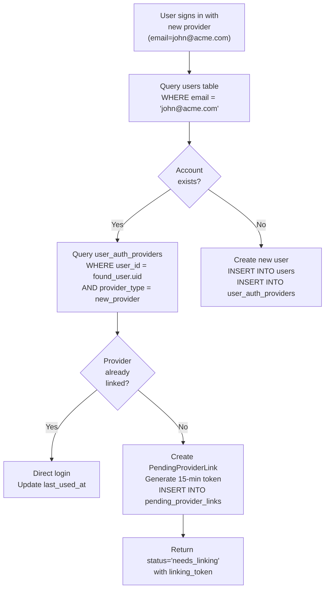

**Implementation:**
The `authenticate_or_create` method in `UnifiedAuthService` implements this resolution logic [app/modules/auth/unified_auth_service.py:387-805](). It queries the database by email first [app/modules/auth/unified_auth_service.py:414](), then determines which consolidation path to take.

**Database queries:**
1. Check user existence: `db.query(User).filter(User.email == email.lower().strip())`
2. Check provider linkage: `db.query(UserAuthProvider).filter(UserAuthProvider.user_id == user_id, UserAuthProvider.provider_type == provider_type)`

Sources: [app/modules/auth/unified_auth_service.py:387-805]()

### PendingProviderLink Workflow

When a user with an existing account attempts to sign in with a new provider, the system creates a `PendingProviderLink` record rather than immediately linking the provider. This gives users the opportunity to confirm or cancel the linkage.

**Token Generation:**

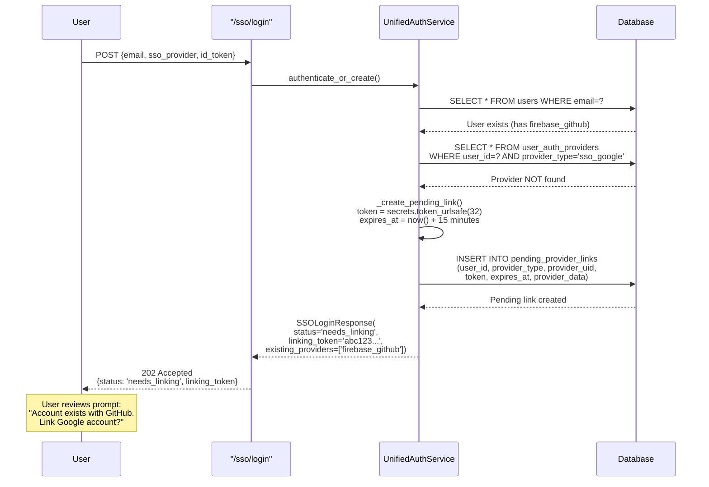

**Token properties:**
- **Length:** 32 bytes (256 bits) via `secrets.token_urlsafe(LINKING_TOKEN_LENGTH)` [app/modules/auth/unified_auth_service.py:822]()
- **Expiration:** 15 minutes (`LINKING_TOKEN_EXPIRY_MINUTES = 15`) [app/modules/auth/unified_auth_service.py:19]()
- **Single-use:** Deleted after confirmation [app/modules/auth/unified_auth_service.py:887]()
- **Expiry cleanup:** Automatically rejected if expired [app/modules/auth/unified_auth_service.py:878-883]()

**Database storage:**
The `pending_provider_links` table stores:
- `user_id` - User to link to
- `provider_type` - Provider being linked (e.g., `sso_google`)
- `provider_uid` - Provider's unique identifier
- `provider_data` - Metadata from provider
- `token` - Confirmation token (unique)
- `expires_at` - Expiration timestamp
- `ip_address`, `user_agent` - Audit trail

[app/modules/auth/unified_auth_service.py:827-836]()

Sources: [app/modules/auth/unified_auth_service.py:809-860](), [app/modules/auth/auth_router.py:422-570]()

### Confirmation Flow

After receiving a pending link, users can confirm to complete the linkage:

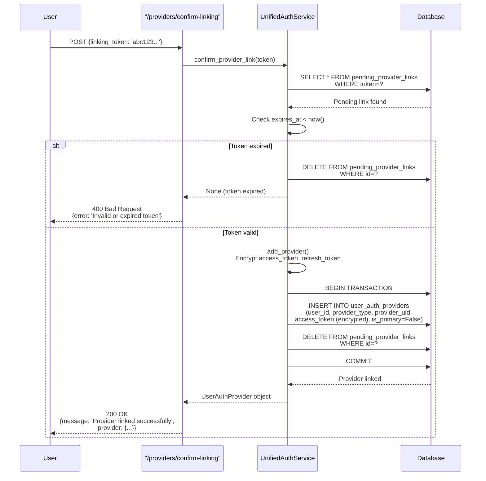

**Expiration check:**
```python
if pending.expires_at < utc_now():
    logger.warning("Linking token expired: %s", linking_token)
    self.db.delete(pending)
    self.db.commit()
    return None
```
[app/modules/auth/unified_auth_service.py:878-883]()

**Atomic linkage:**
The confirmation process is transactional - if the provider addition fails, the pending link is not deleted, allowing retry [app/modules/auth/unified_auth_service.py:885-897]().

Sources: [app/modules/auth/unified_auth_service.py:862-899](), [app/modules/auth/auth_router.py:572-617]()

### Cancellation Flow

Users can cancel a pending link before confirmation:

**Endpoint:** `DELETE /providers/cancel-linking/{linking_token}`

**Implementation:**
```python
def cancel_pending_link(self, linking_token: str) -> bool:
    pending = (
        self.db.query(PendingProviderLink)
        .filter(PendingProviderLink.token == linking_token)
        .first()
    )
    
    if pending:
        self.db.delete(pending)
        self.db.commit()
        logger.info("Cancelled pending link for user %s", pending.user_id)
        return True
    
    return False
```
[app/modules/auth/unified_auth_service.py:901-922]()

**Effect:** Simply deletes the pending link record. User can attempt login again to regenerate the pending link if desired.

Sources: [app/modules/auth/unified_auth_service.py:901-922](), [app/modules/auth/auth_router.py:619-644]()

## Provider Precedence with is_primary Flag

The `is_primary` flag determines which provider's information is displayed in the UI and which email address is shown to the user.

### Primary Provider Rules

| Scenario | is_primary Behavior |
|----------|---------------------|
| First provider added | Automatically set to `is_primary=True` [app/modules/auth/unified_auth_service.py:275]() |
| User signs in with provider | That provider becomes primary [app/modules/auth/unified_auth_service.py:615-622]() |
| User explicitly sets primary | Update via `set_primary_provider()` [app/modules/auth/unified_auth_service.py:313-330]() |
| Primary provider unlinked | First remaining provider becomes primary [app/modules/auth/unified_auth_service.py:361-365]() |

### is_primary Flag Implementation

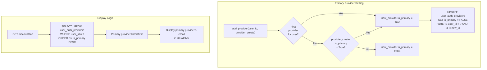

**Automatic primary assignment on sign-in:**

When a user signs in with a provider, that provider is automatically set as primary [app/modules/auth/unified_auth_service.py:615-622]():

```python
if not existing_provider.is_primary:
    logger.info(
        "Setting %s as primary provider for user %s (user signed in with this provider)",
        provider_type,
        existing_user.uid,
    )
    self.set_primary_provider(existing_user.uid, provider_type)
```

This ensures the email shown in the UI matches the provider the user just used to sign in.

**Atomic primary reassignment:**

The `set_primary_provider` method uses two database operations [app/modules/auth/unified_auth_service.py:313-330]():

1. Unset all providers: `UPDATE user_auth_providers SET is_primary = FALSE WHERE user_id = ?`
2. Set target provider: `UPDATE user_auth_providers SET is_primary = TRUE WHERE user_id = ? AND provider_type = ?`

This guarantees exactly one primary provider per user.

Sources: [app/modules/auth/unified_auth_service.py:228-311](), [app/modules/auth/unified_auth_service.py:313-330](), [app/modules/auth/unified_auth_service.py:615-622]()

### Primary Provider in UI

The primary provider's email is displayed in the user interface:

**Query pattern:**
```sql
SELECT * FROM user_auth_providers 
WHERE user_id = ? 
ORDER BY is_primary DESC, linked_at DESC
```
[app/modules/auth/unified_auth_service.py:106-112]()

**API response:**
```json
{
  "providers": [
    {
      "provider_type": "sso_google",
      "provider_data": {"email": "user@company.com"},
      "is_primary": true
    },
    {
      "provider_type": "firebase_github",
      "is_primary": false
    }
  ],
  "primary_provider": {
    "provider_type": "sso_google",
    "is_primary": true
  }
}
```

The frontend reads `primary_provider.provider_data.email` to display in the sidebar.

Sources: [app/modules/auth/unified_auth_service.py:104-113](), [app/modules/auth/auth_router.py:646-690]()

## Duplicate Prevention Mechanisms

### Email Uniqueness Enforcement

**User table constraint:** One user per email address (case-insensitive)

The system normalizes email before database operations [app/modules/auth/unified_auth_service.py:411]():
```python
email = email.lower().strip()
```

**Duplicate detection flow:**
1. Query `users` table by normalized email
2. If user exists, branch to consolidation flow (create pending link)
3. If user doesn't exist, create new user

[app/modules/auth/unified_auth_service.py:414-805]()

### Provider UID Uniqueness

**Database constraint:** `unique_provider_uid` on `user_auth_providers.provider_uid`

This prevents the same OAuth account (e.g., same GitHub account) from being linked to multiple Potpie users.

**Enforcement in code:**

During GitHub linking in `/signup` endpoint [app/modules/auth/auth_router.py:189-220]():

```python
existing_provider_with_uid = (
    db.query(UserAuthProvider)
    .filter(
        UserAuthProvider.provider_type == PROVIDER_TYPE_FIREBASE_GITHUB,
        UserAuthProvider.provider_uid == provider_uid,
    )
    .first()
)

if existing_provider_with_uid and existing_provider_with_uid.user_id != user.uid:
    error_message = (
        "GitHub account is already linked to another account. "
        "Please use a different GitHub account or contact support."
    )
    return Response(
        content=json.dumps({"error": error_message}),
        status_code=409,  # Conflict
    )
```

**IntegrityError handling:**

The system also catches database-level constraint violations [app/modules/auth/auth_router.py:239-261]():

```python
try:
    unified_auth.add_provider(user_id=user.uid, provider_create=provider_create)
    db.commit()
except IntegrityError as e:
    db.rollback()
    error_str = str(e).lower()
    if "unique_provider_uid" in error_str or "uniqueviolation" in error_str:
        error_message = "GitHub account is already linked to another account."
        return Response(
            content=json.dumps({"error": error_message}),
            status_code=409,
        )
    raise
```

Sources: [app/modules/auth/auth_router.py:189-267]()

### User-Provider Type Uniqueness

**Database constraint:** `unique_user_provider` on `(user_id, provider_type)`

This ensures one provider type per user - a user can't have two Google accounts linked, for example.

**Check before adding:**

The `add_provider` method checks for existing provider [app/modules/auth/unified_auth_service.py:240-248]():

```python
existing = self.get_provider(user_id, provider_create.provider_type)
if existing:
    logger.warning(
        "Provider %s already exists for user %s",
        provider_create.provider_type,
        user_id,
    )
    return existing
```

Sources: [app/modules/auth/unified_auth_service.py:228-311]()

## System Architecture

The account consolidation system is implemented through three core components:

| Component | Purpose | Key Files |
|-----------|---------|-----------|
| `UnifiedAuthService` | Orchestrates consolidation logic | [app/modules/auth/unified_auth_service.py]() |
| `UserAuthProvider` model | Stores provider links per user | [app/modules/auth/auth_provider_model.py]() |
| `PendingProviderLink` model | Manages 15-minute linking confirmations | [app/modules/auth/auth_provider_model.py]() |

**Key methods:**
- `authenticate_or_create()` - Main consolidation entry point [app/modules/auth/unified_auth_service.py:387-805]()
- `_create_pending_link()` - Generate 15-minute token [app/modules/auth/unified_auth_service.py:809-860]()
- `confirm_provider_link()` - Complete linkage [app/modules/auth/unified_auth_service.py:862-899]()
- `cancel_pending_link()` - Abort linkage [app/modules/auth/unified_auth_service.py:901-922]()

Sources: [app/modules/auth/unified_auth_service.py:57-922]()

### Provider Linking Flow Diagram

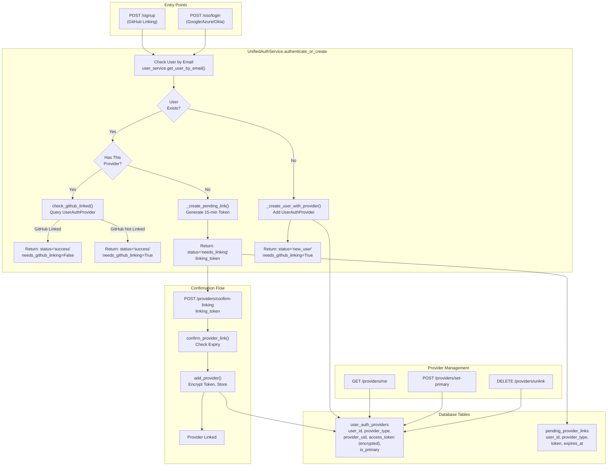

Sources: [app/modules/auth/unified_auth_service.py:387-805](), [app/modules/auth/auth_router.py:422-528](), [app/modules/auth/auth_router.py:530-575]()

## Account Linking Scenarios

The `authenticate_or_create` method in `UnifiedAuthService` handles three distinct scenarios when a user attempts to sign in.

### Scenario 1: User Exists with Same Provider (Login)

When a user signs in with a provider already linked to their account:

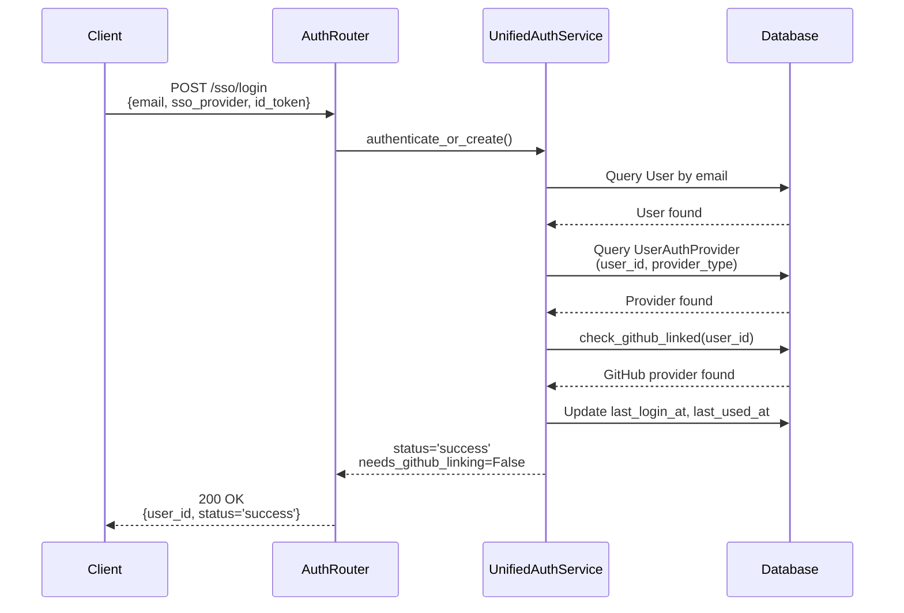

**Code Path:**
1. Check if user exists by email [unified_auth_service.py:414]()
2. Get provider for user [unified_auth_service.py:549]()
3. Check GitHub linking [unified_auth_service.py:569-571]()
4. Update last login [unified_auth_service.py:625-626]()
5. Return success response [unified_auth_service.py:638-645]()

**Important Logic:** If GitHub is not linked, the response sets `needs_github_linking=True`, preventing full platform access [unified_auth_service.py:599-609]().

Sources: [app/modules/auth/unified_auth_service.py:547-645](), [app/modules/auth/auth_router.py:422-528]()

### Scenario 2: User Exists with Different Provider (Pending Link)

When a user with an existing account tries to sign in with a new provider:

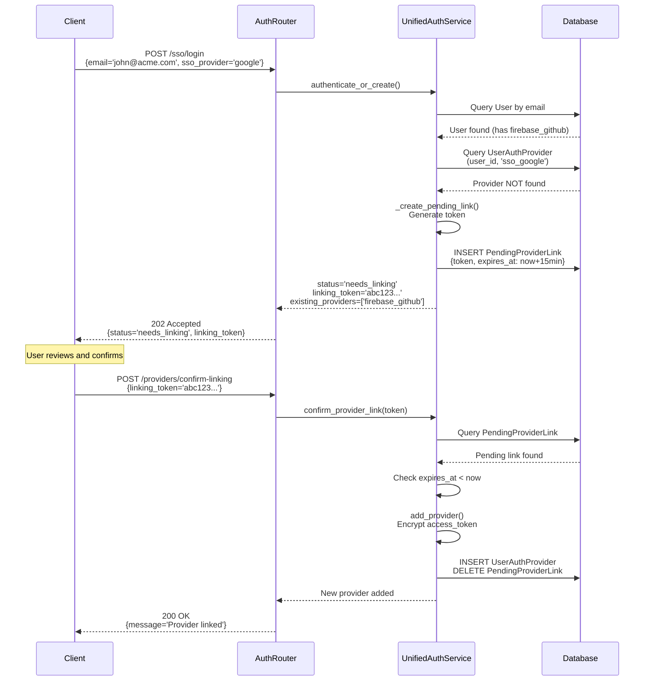

**Pending Link Token Generation:**
- Uses `secrets.token_urlsafe(32)` for cryptographically secure token [unified_auth_service.py:819]()
- Expires in 15 minutes (`LINKING_TOKEN_EXPIRY_MINUTES`) [unified_auth_service.py:19]()
- Stored in `pending_provider_links` table [unified_auth_service.py:824-836]()

**Confirmation Logic:**
1. Query pending link by token [unified_auth_service.py:851-855]()
2. Verify expiration [unified_auth_service.py:862-884]()
3. Add provider with encrypted token [unified_auth_service.py:887-897]()
4. Delete pending link [unified_auth_service.py:887]()

Sources: [app/modules/auth/unified_auth_service.py:646-680](), [app/modules/auth/unified_auth_service.py:809-899](), [app/modules/auth/auth_router.py:530-575]()

### Scenario 3: New User Creation

When a user with no existing account signs up:

**Code Path:**
1. Check user existence [unified_auth_service.py:684]()
2. Create user with `_create_user_with_provider` [unified_auth_service.py:762-772]()
3. Add first provider (automatically primary) [unified_auth_service.py:228-311]()
4. Return `status='new_user'` with `needs_github_linking=True` (unless signing up with GitHub) [unified_auth_service.py:798-805]()

Sources: [app/modules/auth/unified_auth_service.py:681-805]()

## GitHub Linking Requirement

Potpie requires all users to link a GitHub account to access repository features. This is enforced through the `check_github_linked` method.

### GitHub Linking Check Flow

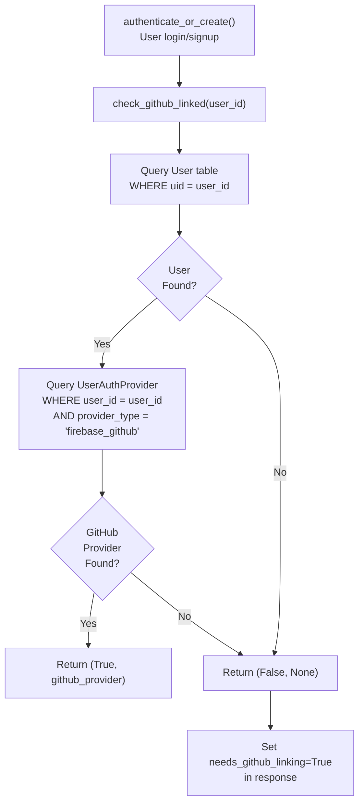

**Implementation Details:**

The `check_github_linked` method implements a systematic two-step check [unified_auth_service.py:130-174]():

1. **Verify user exists:** Query `User` table by `uid`
2. **Check provider table:** Query `UserAuthProvider` where `provider_type = 'firebase_github'`

**Provider Type Constant:**
```python
PROVIDER_TYPE_FIREBASE_GITHUB = "firebase_github"
```
[unified_auth_service.py:22]()

**Database Query:**
The method queries the `user_auth_providers` table with these filters:
- `UserAuthProvider.user_id == user_id`
- `UserAuthProvider.provider_type == PROVIDER_TYPE_FIREBASE_GITHUB`

[unified_auth_service.py:154-162]()

**GitHub Linking During Signup:**

The `/signup` endpoint handles GitHub linking in two flows [auth_router.py:71-418]():

| Flow | Condition | Action |
|------|-----------|--------|
| **Linking to Existing SSO User** | `linkToUserId` provided | Add GitHub provider to existing user [auth_router.py:148-278]() |
| **Direct GitHub Signup** | No `linkToUserId` | Create new user with GitHub as primary [auth_router.py:284-363]() |

**GitHub Duplicate Prevention:**

Before linking GitHub, the system checks:
1. GitHub not already linked to this user [auth_router.py:167-187]()
2. GitHub UID not linked to different user [auth_router.py:189-219]()
3. Database constraint enforcement via `unique_provider_uid` [auth_router.py:242-258]()

Sources: [app/modules/auth/unified_auth_service.py:130-174](), [app/modules/auth/auth_router.py:71-418]()

## Provider Management Operations

### Retrieving User's Providers

**Endpoint:** `GET /providers/me`

Returns all authentication providers linked to the authenticated user.

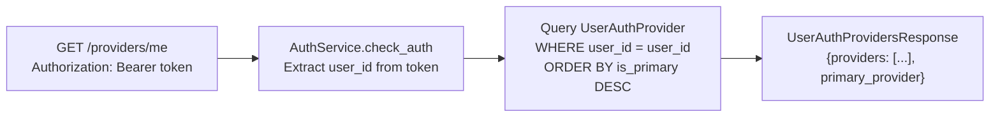

**Response Structure:**

```json
{
  "providers": [
    {
      "id": "uuid",
      "user_id": "firebase_uid",
      "provider_type": "sso_google",
      "provider_uid": "google_sub_id",
      "provider_data": {"email": "user@company.com"},
      "is_primary": true,
      "linked_at": "2024-01-15T10:30:00Z",
      "last_used_at": "2024-01-20T14:22:00Z"
    },
    {
      "provider_type": "firebase_github",
      "is_primary": false,
      "linked_at": "2024-01-16T09:15:00Z"
    }
  ],
  "primary_provider": {
    "provider_type": "sso_google",
    "is_primary": true
  }
}
```

**Implementation:** [auth_router.py:604-646](), [unified_auth_service.py:104-113]()

Sources: [app/modules/auth/auth_router.py:604-646](), [app/modules/auth/unified_auth_service.py:104-113]()

### Setting Primary Provider

**Endpoint:** `POST /providers/set-primary`

Designates which provider should be used for user display preferences (email shown in UI, primary authentication method).

**Request Body:**
```json
{
  "provider_type": "sso_google"
}
```

**Logic:**
1. Unset `is_primary=False` for all user's providers [unified_auth_service.py:321-323]()
2. Set `is_primary=True` for specified provider [unified_auth_service.py:326-327]()
3. Commit transaction [unified_auth_service.py:327]()

**Automatic Primary Setting:**
- First provider added to account becomes primary [unified_auth_service.py:251-252]()
- Provider used for sign-in becomes primary [unified_auth_service.py:615-622]()

Sources: [app/modules/auth/auth_router.py:648-687](), [app/modules/auth/unified_auth_service.py:313-330]()

### Unlinking Providers

**Endpoint:** `DELETE /providers/unlink`

Removes a provider from the user's account with safeguards.

**Request Body:**
```json
{
  "provider_type": "sso_azure"
}
```

**Safeguards:**

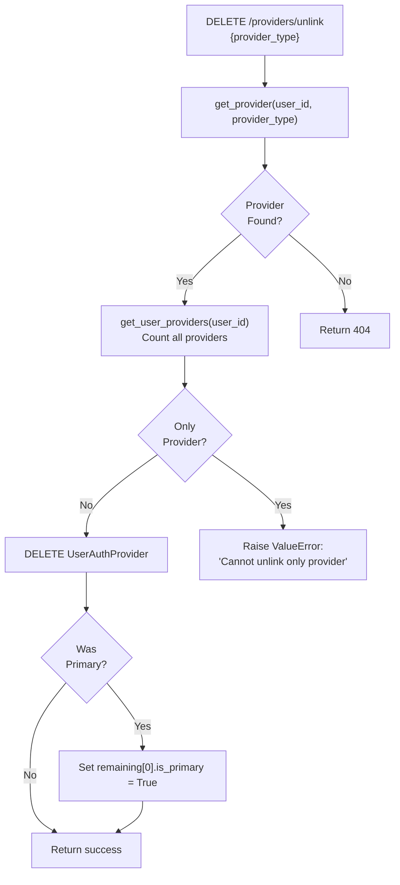

**Prevention of Account Lockout:**
- Cannot unlink if it's the only provider [unified_auth_service.py:346-352]()
- Raises `ValueError` exception [unified_auth_service.py:352]()
- Returns 400 error to client [auth_router.py:726-731]()

**Automatic Primary Reassignment:**
If unlinking the primary provider, the system automatically sets the first remaining provider as primary [unified_auth_service.py:361-365]().

Sources: [app/modules/auth/auth_router.py:689-737](), [app/modules/auth/unified_auth_service.py:332-376]()

## OAuth Token Management

OAuth tokens are stored encrypted in the `UserAuthProvider` table and decrypted on-demand for API calls.

### Token Storage Architecture

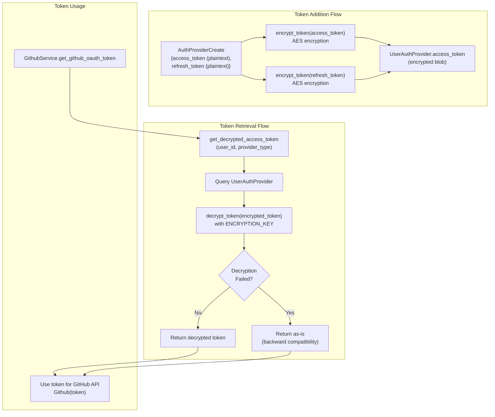

### Token Encryption on Storage

When adding a provider, tokens are encrypted before database insertion [unified_auth_service.py:254-264]():

```python
encrypted_access_token = (
    encrypt_token(provider_create.access_token)
    if provider_create.access_token
    else None
)
encrypted_refresh_token = (
    encrypt_token(provider_create.refresh_token)
    if provider_create.refresh_token
    else None
)
```

The `UserAuthProvider` model stores encrypted tokens:
- `access_token` (LargeBinary)
- `refresh_token` (LargeBinary)

[unified_auth_service.py:267-274]()

### Token Retrieval with Decryption

**Method: `get_decrypted_access_token`**

Retrieves and decrypts a user's OAuth token [unified_auth_service.py:176-199]():

1. Query provider by `(user_id, provider_type)`
2. Attempt decryption using `decrypt_token`
3. Fallback to plaintext for backward compatibility (tokens stored before encryption was added)

**Backward Compatibility:**
The system handles tokens stored before encryption was implemented by catching decryption failures and returning the token as-is [unified_auth_service.py:191-199]().

### GitHub Token Retrieval in Practice

`GithubService.get_github_oauth_token` demonstrates token retrieval [github_service.py:184-247]():

**Flow:**
1. Query user by UID
2. Check `UserAuthProvider` for `firebase_github` provider [github_service.py:203-210]()
3. Decrypt token [github_service.py:214-216]()
4. Fallback to plaintext on decryption failure [github_service.py:217-225]()
5. Legacy fallback: check `user.provider_info` dict [github_service.py:229-246]()

**Usage Pattern:**
```python
github_oauth_token = self.get_github_oauth_token(firebase_uid)
user_github = Github(github_oauth_token)
repo = user_github.get_repo(repo_name)
```

Sources: [app/modules/auth/unified_auth_service.py:176-226](), [app/modules/code_provider/github/github_service.py:184-247]()

## API Reference

### Provider Linking Endpoints

| Endpoint | Method | Purpose | Authentication |
|----------|--------|---------|----------------|
| `/signup` | POST | GitHub linking during signup | Optional (Firebase token) |
| `/sso/login` | POST | SSO login with auto-linking | None (public) |
| `/providers/confirm-linking` | POST | Confirm pending provider link | Public (uses linking_token) |
| `/providers/cancel-linking/{token}` | DELETE | Cancel pending link | None |
| `/providers/me` | GET | List user's providers | Required |
| `/providers/set-primary` | POST | Set primary provider | Required |
| `/providers/unlink` | DELETE | Unlink provider | Required |
| `/account/me` | GET | Complete account info | Required |

### POST /signup - GitHub Linking

**Purpose:** Link GitHub account during user signup or to existing SSO user.

**Request Body:**
```json
{
  "uid": "firebase_uid",
  "email": "user@example.com",
  "displayName": "John Doe",
  "emailVerified": true,
  "linkToUserId": "existing_sso_user_uid",  // Optional: for linking to SSO user
  "githubFirebaseUid": "github_firebase_uid",
  "accessToken": "github_oauth_token",
  "providerUsername": "github_username",
  "providerData": [{"providerId": "github.com"}]
}
```

**Response - Linking to Existing User:**
```json
{
  "uid": "existing_sso_user_uid",
  "exists": true,
  "needs_github_linking": false
}
```

**Response - New User:**
```json
{
  "uid": "new_user_uid",
  "exists": false,
  "needs_github_linking": false
}
```

**Error Cases:**
- GitHub already linked to different user: 409 Conflict [auth_router.py:199-219]()
- User not found (for linking): 404 [auth_router.py:154-162]()

Sources: [app/modules/auth/auth_router.py:71-418]()

### POST /sso/login - SSO Login with Auto-Linking

**Request Body:**
```json
{
  "email": "user@company.com",
  "sso_provider": "google",
  "id_token": "eyJhbGciOiJSUzI1NiIs...",
  "provider_data": {
    "sub": "google_sub_id",
    "name": "John Doe"
  }
}
```

**Response - Success (Existing User):**
```json
{
  "status": "success",
  "user_id": "firebase_uid",
  "email": "user@company.com",
  "display_name": "John Doe",
  "message": "Login successful",
  "needs_github_linking": false
}
```

**Response - Needs Linking:**
```json
{
  "status": "needs_linking",
  "user_id": "firebase_uid",
  "email": "user@company.com",
  "display_name": "John Doe",
  "message": "Account exists with firebase_github. Link this provider?",
  "linking_token": "abc123def456...",
  "existing_providers": ["firebase_github"]
}
```

**HTTP Status:**
- 200: Success or existing user
- 202: Needs linking
- 400: Invalid request
- 401: Invalid token

Sources: [app/modules/auth/auth_router.py:422-528]()

### POST /providers/confirm-linking - Confirm Provider Link

**Request Body:**
```json
{
  "linking_token": "abc123def456..."
}
```

**Response - Success:**
```json
{
  "message": "Provider linked successfully",
  "provider": {
    "id": "uuid",
    "user_id": "firebase_uid",
    "provider_type": "sso_google",
    "provider_uid": "google_sub_id",
    "is_primary": false,
    "linked_at": "2024-01-15T10:30:00Z"
  }
}
```

**Error Cases:**
- Invalid/expired token: 400
- Token not found: 400

**Token Expiration:** 15 minutes from creation [unified_auth_service.py:820-822]()

Sources: [app/modules/auth/auth_router.py:530-575](), [app/modules/auth/unified_auth_service.py:845-899]()

### DELETE /providers/cancel-linking/{linking_token}

**Purpose:** Cancel a pending provider link before confirmation.

**Response - Success:**
```json
{
  "message": "Linking cancelled"
}
```

**Response - Not Found:**
```json
{
  "error": "Linking token not found"
}
```

Sources: [app/modules/auth/auth_router.py:577-602](), [app/modules/auth/unified_auth_service.py:901-922]()

### GET /providers/me - List User's Providers

**Authentication:** Required (Bearer token)

**Response:**
```json
{
  "providers": [
    {
      "id": "uuid",
      "user_id": "firebase_uid",
      "provider_type": "sso_google",
      "provider_uid": "google_sub_id",
      "provider_data": {"email": "user@company.com"},
      "is_primary": true,
      "linked_at": "2024-01-15T10:30:00Z",
      "last_used_at": "2024-01-20T14:22:00Z"
    },
    {
      "id": "uuid2",
      "user_id": "firebase_uid",
      "provider_type": "firebase_github",
      "provider_uid": "github_firebase_uid",
      "is_primary": false,
      "linked_at": "2024-01-16T09:15:00Z"
    }
  ],
  "primary_provider": {
    "id": "uuid",
    "provider_type": "sso_google",
    "is_primary": true
  }
}
```

**Ordering:** Providers are ordered by `is_primary DESC, linked_at DESC` [unified_auth_service.py:109-111]()

Sources: [app/modules/auth/auth_router.py:604-646]()

### POST /providers/set-primary - Set Primary Provider

**Authentication:** Required

**Request Body:**
```json
{
  "provider_type": "sso_google"
}
```

**Response - Success:**
```json
{
  "message": "Primary provider updated"
}
```

**Response - Provider Not Found:**
```json
{
  "error": "Provider not found"
}
```

Sources: [app/modules/auth/auth_router.py:648-687]()

### DELETE /providers/unlink - Unlink Provider

**Authentication:** Required

**Request Body:**
```json
{
  "provider_type": "sso_azure"
}
```

**Response - Success:**
```json
{
  "message": "Provider unlinked"
}
```

**Error - Last Provider:**
```json
{
  "error": "Cannot unlink the only authentication provider"
}
```

**HTTP Status:**
- 200: Success
- 400: Cannot unlink last provider
- 404: Provider not found

Sources: [app/modules/auth/auth_router.py:689-737]()

### GET /account/me - Complete Account Information

**Authentication:** Required

**Response:**
```json
{
  "user_id": "firebase_uid",
  "email": "user@company.com",
  "display_name": "John Doe",
  "organization": "acme",
  "organization_name": "Acme Corporation",
  "email_verified": true,
  "created_at": "2024-01-10T08:00:00Z",
  "providers": [
    {
      "id": "uuid",
      "provider_type": "sso_google",
      "is_primary": true,
      "linked_at": "2024-01-10T08:00:00Z"
    },
    {
      "id": "uuid2",
      "provider_type": "firebase_github",
      "is_primary": false,
      "linked_at": "2024-01-11T10:30:00Z"
    }
  ],
  "primary_provider": "sso_google"
}
```

Sources: [app/modules/auth/auth_router.py:739-793]()

## Database Schema

### user_auth_providers Table

Stores all authentication providers linked to users.

| Column | Type | Purpose |
|--------|------|---------|
| `id` | UUID | Primary key |
| `user_id` | String | Foreign key to `users.uid` |
| `provider_type` | String | Provider identifier (e.g., `firebase_github`, `sso_google`) |
| `provider_uid` | String | Provider's unique ID for this user (unique constraint) |
| `provider_data` | JSON | Provider-specific metadata |
| `access_token` | LargeBinary | Encrypted OAuth access token |
| `refresh_token` | LargeBinary | Encrypted OAuth refresh token |
| `token_expires_at` | DateTime | Token expiration timestamp |
| `is_primary` | Boolean | Whether this is the primary provider |
| `linked_at` | DateTime | When provider was linked |
| `last_used_at` | DateTime | Last authentication with this provider |
| `linked_by_ip` | String | IP address used for linking |
| `linked_by_user_agent` | String | User agent used for linking |

**Constraints:**
- Unique: `(user_id, provider_type)` - One provider type per user
- Unique: `provider_uid` - Each provider UID can only be linked once

Sources: Database model references from [app/modules/auth/auth_provider_model.py]()

### pending_provider_links Table

Stores temporary provider links awaiting user confirmation.

| Column | Type | Purpose |
|--------|------|---------|
| `id` | UUID | Primary key |
| `user_id` | String | User to link provider to |
| `provider_type` | String | Provider being linked |
| `provider_uid` | String | Provider's user ID |
| `provider_data` | JSON | Provider metadata |
| `token` | String | URL-safe confirmation token (unique) |
| `expires_at` | DateTime | Expiration timestamp (15 minutes) |
| `ip_address` | String | IP address of linking request |
| `user_agent` | String | User agent of linking request |
| `created_at` | DateTime | When pending link was created |

**Lifecycle:**
- Created when user attempts login with new provider [unified_auth_service.py:824-836]()
- Expires after 15 minutes [unified_auth_service.py:820-822]()
- Deleted after confirmation [unified_auth_service.py:887]()
- Deleted after expiry check [unified_auth_service.py:882-883]()

Sources: [app/modules/auth/unified_auth_service.py:809-899]()

## Security Considerations

### Token Encryption

All OAuth tokens are encrypted at rest using AES encryption with a system-wide `ENCRYPTION_KEY` environment variable. See [Token Management and Security](#7.4) for encryption details.

### Pending Link Token Security

- Uses `secrets.token_urlsafe(32)` for cryptographic randomness (256 bits) [unified_auth_service.py:819]()
- 15-minute expiration window limits attack surface [unified_auth_service.py:820-822]()
- Tokens are single-use (deleted after confirmation) [unified_auth_service.py:887]()

### Provider UID Uniqueness

Database constraints prevent duplicate provider linking:
- Unique constraint on `provider_uid` prevents same OAuth account linking to multiple Potpie users
- Unique constraint on `(user_id, provider_type)` prevents duplicate provider types per user

[auth_router.py:242-258]() shows duplicate detection with user-friendly error messages.

### Account Lockout Prevention

The system prevents users from unlinking their last authentication provider [unified_auth_service.py:346-352](), ensuring users always have a way to log in.

Sources: [app/modules/auth/unified_auth_service.py:228-311](), [app/modules/auth/auth_router.py:189-219]()