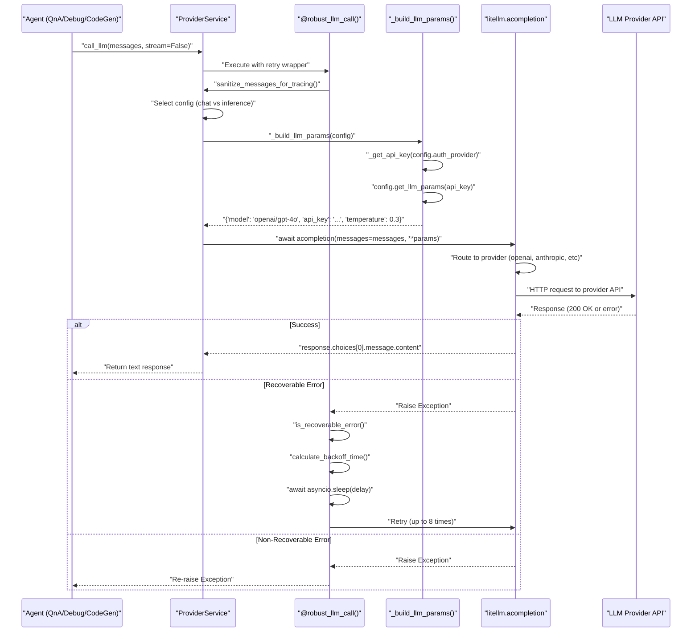
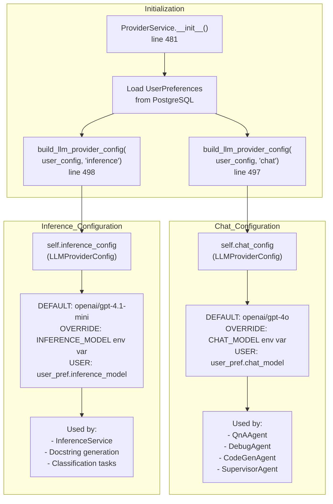
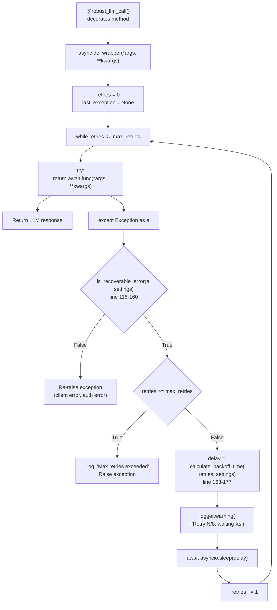
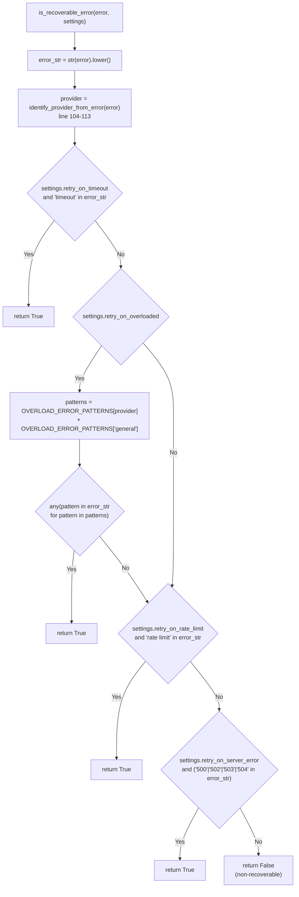
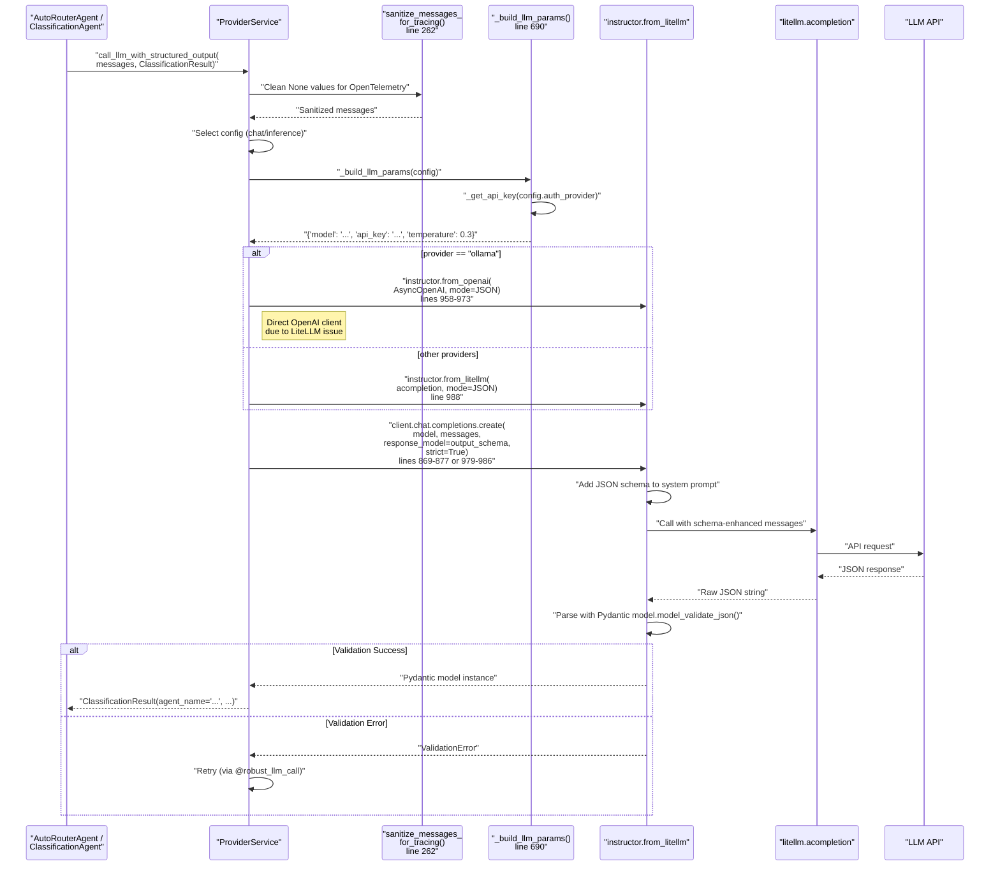
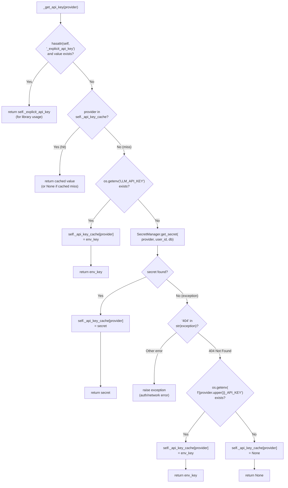
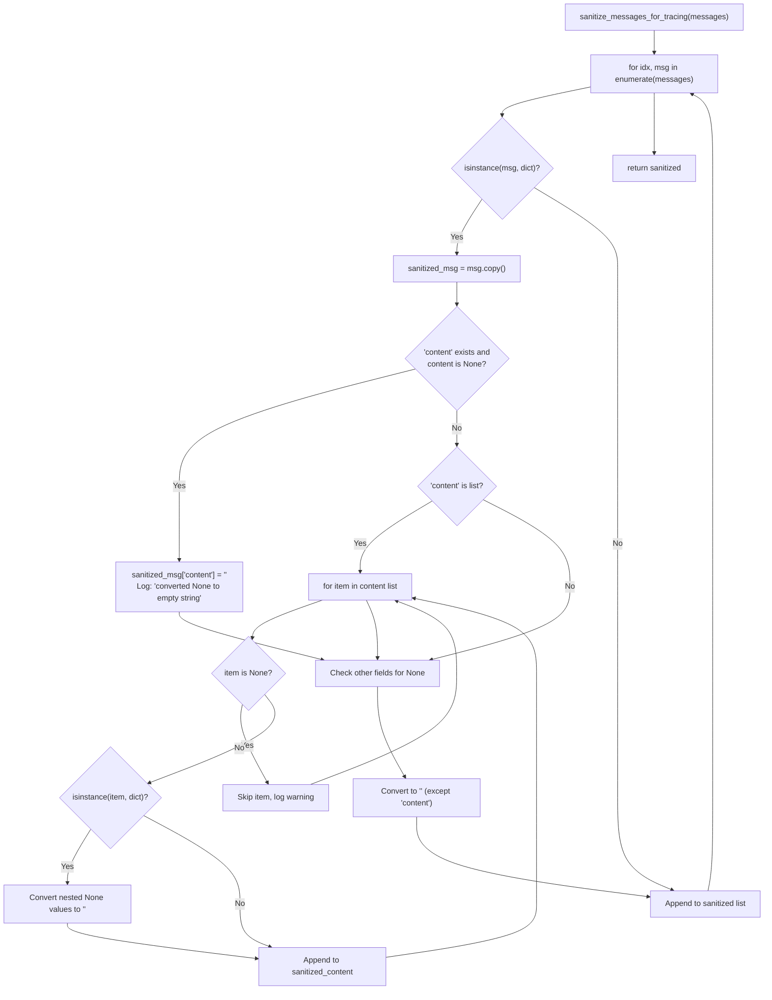

2.1-Provider Service (LLM Abstraction)

# Page: Provider Service (LLM Abstraction)

# Provider Service (LLM Abstraction)

<details>
<summary>Relevant source files</summary>

The following files were used as context for generating this wiki page:

- [app/modules/intelligence/provider/anthropic_caching_model.py](app/modules/intelligence/provider/anthropic_caching_model.py)
- [app/modules/intelligence/provider/llm_config.py](app/modules/intelligence/provider/llm_config.py)
- [app/modules/intelligence/provider/provider_service.py](app/modules/intelligence/provider/provider_service.py)

</details>


The `ProviderService` class (importance: 103.30) is the most critical subsystem in Potpie, providing a unified abstraction layer for all Large Language Model (LLM) interactions. It handles communication with multiple LLM providers (OpenAI, Anthropic, DeepSeek, Gemini, etc.) while implementing sophisticated retry logic, streaming support, multimodal capabilities, structured output parsing, and Portkey gateway integration for observability.

This service ensures reliable LLM communication across the entire system. All agent interactions flow through this service (see [Agent System](#2)), making it the foundation of Potpie's intelligence layer. API keys are managed through [Secret Management](#7.3).

**Sources:** [app/modules/intelligence/provider/provider_service.py:1-1068]()
</thinking>

## Service Architecture

The `ProviderService` class at [app/modules/intelligence/provider/provider_service.py:480-509]() serves as the central abstraction layer for all LLM interactions in Potpie. It sits between the agent execution layer and external LLM providers, handling provider-specific differences, API key management, retry logic, and structured output parsing.

### Class Structure and Dependencies

```mermaid
graph TB
    subgraph "Agent_Execution_Layer"
        SupervisorAgent["SupervisorAgent"]
        QnAAgent["QnAAgent"]
        DebugAgent["DebugAgent"]
        CodeGenAgent["CodeGenAgent"]
        RuntimeCustomAgent["RuntimeCustomAgent"]
        InferenceService["InferenceService"]
    end
    
    subgraph "ProviderService_Class"
        PS["ProviderService<br/>provider_service.py:480"]
        
        subgraph "Instance_Variables"
            db["self.db<br/>(SQLAlchemy session)"]
            user_id["self.user_id"]
            chat_config["self.chat_config<br/>(LLMProviderConfig)"]
            inference_config["self.inference_config<br/>(LLMProviderConfig)"]
            retry_settings["self.retry_settings<br/>(RetrySettings)"]
            api_key_cache["self._api_key_cache<br/>(Dict[str, Optional[str]])"]
        end
        
        subgraph "Core_Methods"
            call_llm["call_llm()<br/>lines 902-935"]
            call_llm_structured["call_llm_with_structured_output()<br/>lines 936-987"]
            call_llm_specific["call_llm_with_specific_model()<br/>lines 803-901"]
            get_api_key["_get_api_key()<br/>lines 653-689"]
            build_llm_params["_build_llm_params()<br/>lines 690-716"]
        end
    end
    
    subgraph "Integration_Libraries"
        litellm["litellm.acompletion<br/>requirements.txt:125"]
        instructor["instructor.from_litellm<br/>requirements.txt:102"]
        pydantic_ai["pydantic_ai.Model<br/>requirements.txt:195"]
    end
    
    subgraph "Configuration"
        LLMProviderConfig["LLMProviderConfig<br/>llm_config.py:217"]
        MODEL_CONFIG_MAP["MODEL_CONFIG_MAP<br/>llm_config.py:9-214"]
        AVAILABLE_MODELS["AVAILABLE_MODELS<br/>provider_service.py:331-468"]
        UserPreferences["UserPreferences table"]
    end
    
    subgraph "External_APIs"
        OpenAI["OpenAI API<br/>(gpt-4o, gpt-4.1-mini)"]
        Anthropic["Anthropic API<br/>(claude-sonnet, claude-haiku)"]
        OpenRouter["OpenRouter API<br/>(deepseek, gemini, llama)"]
        Ollama["Ollama<br/>(local models)"]
    end
    
    SupervisorAgent --> PS
    QnAAgent --> PS
    DebugAgent --> PS
    CodeGenAgent --> PS
    RuntimeCustomAgent --> PS
    InferenceService --> PS
    
    PS --> db
    PS --> user_id
    PS --> chat_config
    PS --> inference_config
    PS --> retry_settings
    PS --> api_key_cache
    
    PS --> call_llm
    PS --> call_llm_structured
    PS --> call_llm_specific
    PS --> get_api_key
    PS --> build_llm_params
    
    call_llm --> litellm
    call_llm_structured --> instructor
    call_llm_specific --> litellm
    
    chat_config --> LLMProviderConfig
    inference_config --> LLMProviderConfig
    LLMProviderConfig --> MODEL_CONFIG_MAP
    PS --> AVAILABLE_MODELS
    PS --> UserPreferences
    
    litellm --> OpenAI
    litellm --> Anthropic
    litellm --> OpenRouter
    litellm --> Ollama
```



**Sources:** [app/modules/intelligence/provider/provider_service.py:480-509](), [app/modules/intelligence/provider/llm_config.py:217-264]()

## Core Methods

The `ProviderService` class at [app/modules/intelligence/provider/provider_service.py:480]() exposes several key methods for LLM interaction:

### Primary LLM Call Methods

| Method | Purpose | Signature | Returns |
|--------|---------|-----------|---------|
| `call_llm()` | Execute LLM call with retry logic, supports streaming | `(messages: list, stream: bool = False, config_type: str = "chat")` | `str` or `AsyncGenerator[str, None]` |
| `call_llm_with_structured_output()` | Parse LLM response into Pydantic model using instructor | `(messages: list, output_schema: BaseModel, config_type: str = "chat")` | `BaseModel` instance |
| `call_llm_with_specific_model()` | Call with explicit model override | `(model_identifier: str, messages: list, output_schema: Optional[BaseModel], stream: bool, **kwargs)` | `str`, `AsyncGenerator`, or `BaseModel` |

All three methods are decorated with `@robust_llm_call()` at lines [902](), [936](), and [803]() respectively, providing automatic retry with exponential backoff.

**Sources:** [app/modules/intelligence/provider/provider_service.py:902-935](), [app/modules/intelligence/provider/provider_service.py:936-987](), [app/modules/intelligence/provider/provider_service.py:803-901]()

### Configuration and Model Management

| Method | Purpose | Signature | Returns |
|--------|---------|-----------|---------|
| `list_available_llms()` | List supported providers | `()` | `List[ProviderInfo]` |
| `list_available_models()` | List all available models | `()` | `AvailableModelsResponse` |
| `set_global_ai_provider()` | Update user model preferences | `(user_id: str, request: SetProviderRequest)` | `dict` |
| `get_global_ai_provider()` | Get current configuration | `(user_id: str)` | `GetProviderResponse` |
| `supports_pydantic()` | Check if model supports pydantic-ai | `(config_type: str = "chat")` | `bool` |

**Sources:** [app/modules/intelligence/provider/provider_service.py:589-602](), [app/modules/intelligence/provider/provider_service.py:604-651](), [app/modules/intelligence/provider/provider_service.py:734-797](), [app/modules/intelligence/provider/provider_service.py:798-801]()

### Factory Methods

Two factory methods support different initialization patterns:

```python
# Standard initialization from user preferences
ProviderService.create(db, user_id)  # Line 506-508

# Library usage with explicit configuration (bypasses env vars)
ProviderService.create_from_config(
    db, user_id,
    provider="openai",
    api_key="sk-...",
    chat_model="openai/gpt-4o",
    inference_model="openai/gpt-4.1-mini",
    base_url=None  # Optional for self-hosted
)  # Lines 510-587
```

The `create_from_config()` method at [app/modules/intelligence/provider/provider_service.py:510-587]() stores the API key in `self._explicit_api_key` and is used by Potpie's library interface for programmatic access.

**Sources:** [app/modules/intelligence/provider/provider_service.py:506-587]()

## LiteLLM Integration

The `ProviderService` uses [litellm](https://github.com/BerriAI/litellm) as the universal LLM adapter, imported at [app/modules/intelligence/provider/provider_service.py:5](). LiteLLM provides a unified interface across 100+ LLM providers through its `acompletion()` function.

### Configuration and Initialization

LiteLLM is configured globally at module import:

```python
litellm.num_retries = 5  # Line 48
litellm.modify_params = True  # Line 482

# Optional debug logging
if os.getenv("LITELLM_DEBUG", "false").lower() in ("true", "1", "yes"):
    litellm.set_verbose = True
    litellm._turn_on_debug()  # Lines 51-55
```

The `LITELLM_DEBUG` environment variable enables detailed request/response logging for troubleshooting API issues.

**Sources:** [app/modules/intelligence/provider/provider_service.py:48-55](), [app/modules/intelligence/provider/provider_service.py:482]()

### LLM Call Execution Flow



**Sources:** [app/modules/intelligence/provider/provider_service.py:902-935](), [app/modules/intelligence/provider/provider_service.py:690-716]()

### Streaming Support

When `stream=True`, the method returns an `AsyncGenerator` that yields chunks:

```python
async def generator() -> AsyncGenerator[str, None]:
    response = await acompletion(
        messages=messages, stream=True, **params
    )  # Line 922-924
    async for chunk in response:
        yield chunk.choices[0].delta.content or ""  # Line 926
```

The generator is consumed by `ConversationService.generate_and_stream_ai_response()` which publishes chunks to Redis Streams for real-time delivery to clients via Server-Sent Events.

**Sources:** [app/modules/intelligence/provider/provider_service.py:920-929](), [app/modules/conversations/conversation_service.py]()

## Configuration System

### LLMProviderConfig Class

The `LLMProviderConfig` class at [app/modules/intelligence/provider/llm_config.py:217-264]() encapsulates provider-specific settings:

| Field | Type | Purpose |
|-------|------|---------|
| `provider` | `str` | Provider routing key (`openai`, `anthropic`, `ollama`) |
| `auth_provider` | `str` | API key lookup key (may differ from provider, e.g., `openrouter`) |
| `model` | `str` | Full model identifier (e.g., `openai/gpt-4o`) |
| `default_params` | `Dict[str, Any]` | Temperature, max_tokens, etc. |
| `capabilities` | `Dict[str, bool]` | `supports_pydantic`, `supports_streaming`, `supports_vision`, `supports_tool_parallelism` |
| `base_url` | `Optional[str]` | Custom API endpoint (for Azure, Ollama, self-hosted) |
| `api_version` | `Optional[str]` | API version string (for Azure) |

Environment variables can override capabilities:

```python
# Override capability detection
LLM_SUPPORTS_PYDANTIC=true
LLM_SUPPORTS_STREAMING=true
LLM_SUPPORTS_VISION=false
LLM_SUPPORTS_TOOL_PARALLELISM=true
```

These overrides are applied in `LLMProviderConfig.__init__()` at [app/modules/intelligence/provider/llm_config.py:240-250]().

**Sources:** [app/modules/intelligence/provider/llm_config.py:217-264]()

### Dual Configuration System

The service maintains separate configurations optimized for different workloads:



Configuration priority order (highest to lowest):
1. Environment variables (`CHAT_MODEL`, `INFERENCE_MODEL`)
2. User preferences in database (`UserPreferences.preferences`)
3. System defaults (`DEFAULT_CHAT_MODEL`, `DEFAULT_INFERENCE_MODEL`)

This is implemented in `build_llm_provider_config()` at [app/modules/intelligence/provider/llm_config.py:320-358]().

**Sources:** [app/modules/intelligence/provider/provider_service.py:481-500](), [app/modules/intelligence/provider/llm_config.py:320-358](), [app/modules/intelligence/provider/llm_config.py:5-6]()

### Model Configuration Map

The `MODEL_CONFIG_MAP` at [app/modules/intelligence/provider/llm_config.py:9-214]() defines provider-specific settings for each supported model:

```python
# Example entry for Claude Sonnet 4.5
"anthropic/claude-sonnet-4-5-20250929": {
    "provider": "anthropic",
    "default_params": {"temperature": 0.3, "max_tokens": 8000},
    "capabilities": {
        "supports_pydantic": True,
        "supports_streaming": True,
        "supports_vision": True,
        "supports_tool_parallelism": True,
    },
    "base_url": None,
    "api_version": None,
}
```

For models routed through OpenRouter (DeepSeek, Gemini, Llama), `auth_provider` differs from `provider`:

```python
"openrouter/deepseek/deepseek-chat-v3-0324": {
    "provider": "deepseek",
    "auth_provider": "openrouter",  # API key lookup uses "openrouter"
    "base_url": "https://openrouter.ai/api/v1",
    ...
}
```

**Sources:** [app/modules/intelligence/provider/llm_config.py:9-214]()

## Retry Logic and Error Handling

### RetrySettings Configuration

The `RetrySettings` dataclass at [app/modules/intelligence/provider/provider_service.py:75-102]() configures exponential backoff:

| Parameter | Default | Purpose |
|-----------|---------|---------|
| `max_retries` | 8 | Maximum retry attempts before failure |
| `min_delay` | 1.0s | Minimum wait between retries |
| `max_delay` | 120.0s | Maximum wait between retries (2 minutes) |
| `base_delay` | 2.0s | Base delay for exponential calculation |
| `step_increase` | 1.8 | Exponential growth factor |
| `jitter_factor` | 0.2 | Random variance (±20%) to prevent thundering herd |
| `retry_on_timeout` | `True` | Retry on connection/request timeouts |
| `retry_on_overloaded` | `True` | Retry on provider capacity errors |
| `retry_on_rate_limit` | `True` | Retry on rate limit errors (429) |
| `retry_on_server_error` | `True` | Retry on server errors (5xx) |

Delay calculation at [app/modules/intelligence/provider/provider_service.py:163-177]():

```
delay = min(max_delay, base_delay * (step_increase ^ retry_count) * random_jitter)
```

Example delays: 2s → 3.6s → 6.5s → 11.7s → 21s → 38s → 68s → 120s (capped)

**Sources:** [app/modules/intelligence/provider/provider_service.py:75-102](), [app/modules/intelligence/provider/provider_service.py:163-177]()

### robust_llm_call Decorator

The `@robust_llm_call()` decorator at [app/modules/intelligence/provider/provider_service.py:206-259]() wraps all LLM call methods:



The decorator is applied to:
- `call_llm()` at line [902]()
- `call_llm_with_structured_output()` at line [936]()
- `call_llm_with_specific_model()` at line [803]()

**Sources:** [app/modules/intelligence/provider/provider_service.py:206-259](), [app/modules/intelligence/provider/provider_service.py:803](), [app/modules/intelligence/provider/provider_service.py:902](), [app/modules/intelligence/provider/provider_service.py:936]()

### Error Classification

The `is_recoverable_error()` function at [app/modules/intelligence/provider/provider_service.py:116-160]() determines retry eligibility:



**Error Pattern Map** at [app/modules/intelligence/provider/provider_service.py:57-72]():

| Provider | Patterns |
|----------|----------|
| `anthropic` | `"overloaded"`, `"overloaded_error"`, `"capacity"`, `"rate limit exceeded"` |
| `openai` | `"rate_limit_exceeded"`, `"capacity"`, `"overloaded"`, `"server_error"`, `"timeout"` |
| `general` | `"timeout"`, `"insufficient capacity"`, `"server_error"`, `"internal_server_error"` |

**Non-recoverable errors** (no retry):
- Authentication errors (`401`)
- Invalid request errors (`400`)
- Not found errors (`404`)
- Model not available errors
- JSON parsing errors in application code

**Sources:** [app/modules/intelligence/provider/provider_service.py:57-72](), [app/modules/intelligence/provider/provider_service.py:104-160]()

## Structured Output with Instructor

### Instructor Integration

The `call_llm_with_structured_output()` method at [app/modules/intelligence/provider/provider_service.py:936-987]() uses the `instructor` library (v1.13.0, [requirements.txt:102]()) to parse LLM responses into Pydantic models:



**Sources:** [app/modules/intelligence/provider/provider_service.py:936-987](), [app/modules/intelligence/provider/provider_service.py:958-973]()

### Ollama Special Handling

Ollama requires special handling due to LiteLLM issue #7355. The service bypasses LiteLLM and uses the OpenAI client directly:

```python
# Lines 958-973
if config.provider == "ollama":
    ollama_base_root = (
        params.get("base_url")
        or config.base_url
        or os.environ.get("LLM_API_BASE")
        or "http://localhost:11434"
    )
    ollama_base_url = ollama_base_root.rstrip("/") + "/v1"
    ollama_api_key = params.get("api_key") or os.environ.get(
        "OLLAMA_API_KEY", "ollama"
    )
    client = instructor.from_openai(
        AsyncOpenAI(base_url=ollama_base_url, api_key=ollama_api_key),
        mode=instructor.Mode.JSON,
    )
```

The Ollama API endpoint `/v1` suffix is required for OpenAI-compatible interface.

**Sources:** [app/modules/intelligence/provider/provider_service.py:958-973]()

### Structured Output Usage

Structured output is used throughout the system for reliable parsing:

| Component | Schema | Purpose |
|-----------|--------|---------|
| `AutoRouterAgent` | `ClassificationResult` | Parse agent routing decision |
| `InferenceService` | `DocstringResponse` | Parse generated docstrings + tags |
| `CustomAgentService` | `AgentGenerationResult` | Parse custom agent configuration |
| `ToolService` | Various tool schemas | Parse tool results |

All schemas extend `pydantic.BaseModel` and benefit from automatic validation, type coercion, and error messages.

**Sources:** [app/modules/intelligence/agents/auto_router_agent.py](), [app/modules/intelligence/inference/inference_service.py](), [app/modules/intelligence/agents/custom_agent_service.py]()


## API Key Management

### Multi-Tier Key Retrieval

The `_get_api_key()` method at [app/modules/intelligence/provider/provider_service.py:653-689]() implements a four-tier fallback strategy:



**Priority Order (highest to lowest):**
1. **Explicit API key** (`self._explicit_api_key`) - Set by `create_from_config()` for library usage
2. **Cache** (`self._api_key_cache`) - Avoids repeated SecretManager/env lookups per session
3. **Universal env var** (`LLM_API_KEY`) - Single key for all providers (development)
4. **SecretManager** - User-specific keys from Google Cloud Secret Manager or encrypted DB
5. **Provider-specific env var** (e.g., `OPENAI_API_KEY`, `ANTHROPIC_API_KEY`)
6. **None** - Triggers authentication error in LiteLLM

**Sources:** [app/modules/intelligence/provider/provider_service.py:653-689](), [app/modules/intelligence/provider/provider_service.py:486-489]()

### Caching Strategy

The `_api_key_cache` dictionary at [app/modules/intelligence/provider/provider_service.py:488]() prevents redundant lookups:

```python
# Instance variable initialized in __init__
self._api_key_cache: Dict[str, Optional[str]] = {}

# Cache hit - return immediately
if provider in self._api_key_cache:
    cached_key = self._api_key_cache[provider]
    if cached_key is not None:
        return cached_key
    # Cached None means we already checked and it doesn't exist
    return None
```

The cache persists for the lifetime of the `ProviderService` instance (typically one request or conversation). This optimization is critical for agents making dozens of LLM calls per conversation.

**Sources:** [app/modules/intelligence/provider/provider_service.py:488](), [app/modules/intelligence/provider/provider_service.py:659-665]()

### SecretManager Integration

The service integrates with `SecretManager.get_secret()` at [app/modules/key_management/secret_manager.py]() which:

1. Attempts to retrieve from Google Cloud Secret Manager (production)
2. Falls back to encrypted `user_auth_providers` table
3. Decrypts using Fernet symmetric encryption
4. Returns decrypted API key

If the secret is not found (404 error), the method continues to provider-specific environment variables. Other exceptions (network errors, permission errors) are re-raised.

**Sources:** [app/modules/intelligence/provider/provider_service.py:674-688](), [app/modules/key_management/secret_manager.py]()

## Available Models

### Model Registry

The `AVAILABLE_MODELS` list at [app/modules/intelligence/provider/provider_service.py:331-468]() defines all supported models with their metadata:

```python
AVAILABLE_MODELS = [
    AvailableModelOption(
        id="openai/gpt-4.1",
        name="GPT-4.1",
        description="OpenAI's latest model for complex tasks",
        provider="openai",
        is_chat_model=True,
        is_inference_model=False,
    ),
    # ... 17 total models
]
```

**Model Categories:**

| Category | Purpose | Model Examples |
|----------|---------|----------------|
| **Chat Models** | Conversational agents, complex reasoning, code generation | `gpt-4o`, `claude-sonnet-4-5`, `gemini-2.5-pro` |
| **Inference Models** | Fast structured extraction, classification, batch processing | `gpt-4.1-mini`, `claude-haiku-4-5`, `gemini-2.0-flash` |
| **Both** | Versatile models suitable for either use case | `o4-mini`, `deepseek-chat-v3`, `llama-3.3-70b` |

**Sources:** [app/modules/intelligence/provider/provider_service.py:331-468]()

### Provider Distribution

Models are distributed across multiple providers for redundancy and cost optimization:

| Provider | Model Count | Routing | API Base URL |
|----------|-------------|---------|--------------|
| **openai** | 4 | Direct | `https://api.openai.com/v1` |
| **anthropic** | 7 | Direct | `https://api.anthropic.com/v1` |
| **openrouter** | 6 (deepseek, gemini, llama, z-ai) | Proxy | `https://openrouter.ai/api/v1` |

OpenRouter models require a single `OPENROUTER_API_KEY` but provide access to multiple underlying providers (DeepSeek, Google Gemini, Meta Llama).

**Sources:** [app/modules/intelligence/provider/provider_service.py:421-467](), [app/modules/intelligence/provider/llm_config.py:133-213]()

### Model Selection Logic

Default models are defined at [app/modules/intelligence/provider/llm_config.py:5-6]():

```python
DEFAULT_CHAT_MODEL = "openai/gpt-4o"
DEFAULT_INFERENCE_MODEL = "openai/gpt-4.1-mini"
```

Users can override these via:
1. Environment variables (`CHAT_MODEL`, `INFERENCE_MODEL`)
2. Database preferences (`UserPreferences.preferences`)
3. API calls (`POST /api/v1/set-global-ai-provider`)

The `list_available_models()` method at [app/modules/intelligence/provider/provider_service.py:601-602]() returns all models for UI display:

```python
async def list_available_models(self) -> AvailableModelsResponse:
    return AvailableModelsResponse(models=AVAILABLE_MODELS)
```

**Sources:** [app/modules/intelligence/provider/provider_service.py:601-602](), [app/modules/intelligence/provider/llm_config.py:5-6]()

## Message Sanitization

### OpenTelemetry Compatibility

The `sanitize_messages_for_tracing()` function at [app/modules/intelligence/provider/provider_service.py:262-328]() prevents OpenTelemetry encoding errors:



**Problem:** OpenTelemetry's span recording fails with `Invalid type <class 'NoneType'> of value None` when messages contain `None` content or nested `None` values in multimodal content arrays.

**Solution:** Convert all `None` values to empty strings (`""`) before LLM calls. This occurs in three method entry points:
- `call_llm()` at line [908]()
- `call_llm_with_structured_output()` at line [942]()
- `call_llm_with_specific_model()` at line [814]()

**Sources:** [app/modules/intelligence/provider/provider_service.py:262-328](), [app/modules/intelligence/provider/provider_service.py:814](), [app/modules/intelligence/provider/provider_service.py:908](), [app/modules/intelligence/provider/provider_service.py:942]()

## Configuration and Initialization

### Service Initialization

The `ProviderService` is initialized with database connection and user ID:

```python
def __init__(self, db, user_id: str):
    # Load user preferences and create configurations
    self.chat_config = build_llm_provider_config(user_config, config_type="chat")
    self.inference_config = build_llm_provider_config(user_config, config_type="inference")
```

**Sources:** [app/modules/intelligence/provider/provider_service.py:346-368]()

### Environment Configuration

The service reads configuration from environment variables and user preferences:

| Variable | Purpose | Default |
|----------|---------|---------|
| `CHAT_MODEL` | Default chat model | `openai/gpt-4o` |
| `INFERENCE_MODEL` | Default inference model | `openai/gpt-4.1-mini` |
| `PORTKEY_API_KEY` | Portkey gateway API key | None |
| `LLM_API_KEY` | Universal LLM API key | None |
| `LLM_API_BASE` | Custom API base URL | None |
| `LLM_API_VERSION` | API version | None |

**Sources:** [app/modules/intelligence/provider/provider_service.py:351](), [app/modules/intelligence/provider/provider_service.py:439-451]()