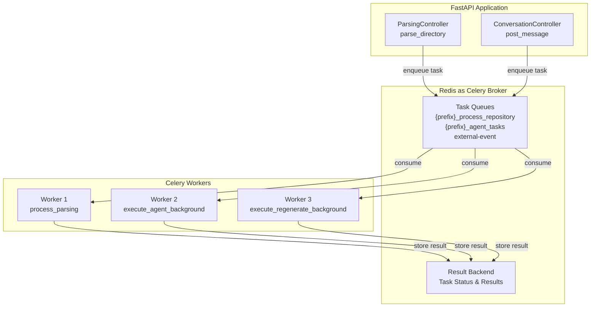
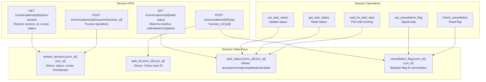
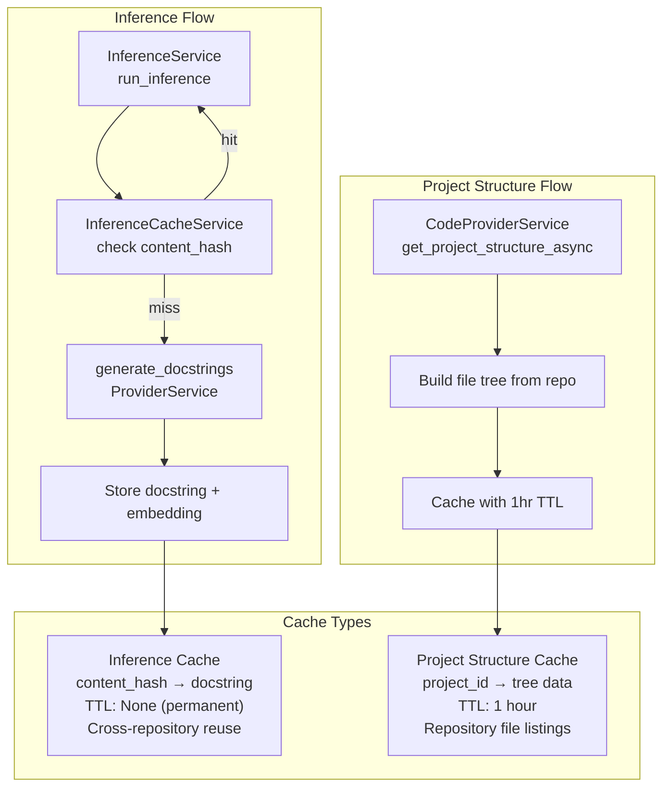

10.3-Redis Architecture

# Page: Redis Architecture

# Redis Architecture

<details>
<summary>Relevant source files</summary>

The following files were used as context for generating this wiki page:

- [app/modules/conversations/conversation/conversation_controller.py](app/modules/conversations/conversation/conversation_controller.py)
- [app/modules/conversations/conversation/conversation_schema.py](app/modules/conversations/conversation/conversation_schema.py)
- [app/modules/conversations/conversation/conversation_service.py](app/modules/conversations/conversation/conversation_service.py)
- [app/modules/conversations/conversations_router.py](app/modules/conversations/conversations_router.py)

</details>


## Purpose and Scope

This document details Redis usage in Potpie as a multi-purpose data store for task queuing, real-time streaming, session management, and caching. Redis serves four primary functions: (1) Celery task broker/backend for asynchronous processing, (2) Redis Streams for Server-Sent Events (SSE) message streaming, (3) session state management for resumable streams, and (4) caching for inference results and project structures.

For information about the Celery task system that uses Redis as its broker, see [Celery Task System](#9.1). For conversation streaming mechanics, see [Message Streaming and Redis Streams](#3.2).

---

## Redis Configuration

### Connection Setup

Redis connection is configured through `ConfigProvider` and environment variables.

**Configuration Parameters:**
- `REDISHOST`: Redis server hostname (default: `localhost`)
- `REDISPORT`: Redis server port (default: `6379`)
- `REDISUSER`: Optional Redis username for authentication
- `REDISPASSWORD`: Optional Redis password for authentication
- `CELERY_QUEUE_NAME`: Queue prefix for task routing (default: `staging`)
- `REDIS_STREAM_TTL_SECS`: Stream expiration time in seconds (default: `900` = 15 minutes)
- `REDIS_STREAM_MAX_LEN`: Maximum stream length (default: `1000`)
- `REDIS_STREAM_PREFIX`: Stream key prefix (default: `chat:stream`)

The Redis URL is constructed by `ConfigProvider.get_redis_url()`:

```python
if redisuser and redispassword:
    redis_url = f"redis://{redisuser}:{redispassword}@{redishost}:{redisport}/0"
else:
    redis_url = f"redis://{redishost}:{redisport}/0"
```

Sources: [app/core/config_provider.py:142-152](), [app/core/config_provider.py:207-217]()

---

## Redis Use Cases

### 1. Celery Task Queue (Broker & Backend)

Redis serves as both the message broker and result backend for Celery, enabling asynchronous task execution for repository parsing and AI agent operations.



**Task Routing Configuration:**

| Task Name | Queue Name | Purpose |
|-----------|------------|---------|
| `process_parsing` | `{prefix}_process_repository` | Repository analysis and graph construction |
| `execute_agent_background` | `{prefix}_agent_tasks` | AI agent execution in background |
| `execute_regenerate_background` | `{prefix}_agent_tasks` | Message regeneration in background |
| `process_webhook_event` | `external-event` | Webhook event processing |
| `process_custom_event` | `external-event` | Custom event processing |

Sources: [app/celery/celery_app.py:74-100]()

**Celery Configuration Properties:**

```python
task_serializer="json"
accept_content=["json"]
result_serializer="json"
worker_prefetch_multiplier=1  # Fair distribution
task_acks_late=True  # Ensure task completion before ack
task_track_started=True  # Track task start time
task_time_limit=5400  # 90 minutes
worker_max_tasks_per_child=200  # Prevent memory leaks
worker_max_memory_per_child=2000000  # 2GB limit
task_default_rate_limit="10/m"  # 10 tasks per minute per worker
broker_transport_options={"visibility_timeout": 5400}  # 45 minutes
```

Sources: [app/celery/celery_app.py:74-114]()

### 2. Redis Streams for SSE Messaging

Redis Streams enable real-time streaming of AI agent responses to clients using Server-Sent Events (SSE), with support for reconnection and replay.

```mermaid
graph TB
    subgraph "Client Request"
        HTTPPost["POST /conversations/{id}/message<br/>?stream=true&session_id={sid}&cursor={cursor}"]
    end
    
    subgraph "FastAPI Router"
        Router["conversations_router<br/>post_message"]
        SessionNormalizer["_normalize_run_id<br/>Generate session_id"]
    end
    
    subgraph "Redis Streams"
        StreamKey["Stream Key<br/>stream:conversation:{conv_id}:{run_id}"]
        EventPublish["publish_event<br/>type: chunk/queued/end"]
        EventConsume["consume_stream<br/>with cursor replay"]
    end
    
    subgraph "Background Task"
        CeleryTask["execute_agent_background<br/>Celery Task"]
        AgentService["AgentsService<br/>execute_stream"]
        RedisManager["RedisStreamManager<br/>publish chunks"]
    end
    
    subgraph "Client Response"
        SSEStream["StreamingResponse<br/>text/event-stream"]
    end
    
    HTTPPost --> Router
    Router --> SessionNormalizer
    SessionNormalizer --> StreamKey
    
    Router -->|"enqueue"| CeleryTask
    Router -->|"set status: queued"| StreamKey
    
    CeleryTask --> AgentService
    AgentService -->|"chunk by chunk"| RedisManager
    RedisManager --> EventPublish
    EventPublish --> StreamKey
    
    Router --> EventConsume
    EventConsume --> StreamKey
    EventConsume --> SSEStream
    SSEStream --> HTTPPost
```



**Session ID Generation Pattern:**

```
conversation:{user_id}:{prev_human_message_id}
```

If no `prev_human_message_id` is provided, defaults to `"new"`.

Sources: [app/modules/conversations/conversations_router.py:45-61]()

**Stream Key Pattern:**

The actual stream key format is determined by `REDIS_STREAM_PREFIX` environment variable (default: `chat:stream`):

```
{prefix}:conversation:{conversation_id}:{run_id}
```

Example with default prefix:
```
chat:stream:conversation:abc123:conversation:user1:msg456
```

Sources: [app/core/config_provider.py:215-217]()

**Event Types:**

| Event Type | Purpose | Content |
|------------|---------|---------|
| `queued` | Task accepted, queued for processing | `{"status": "queued", "message": "..."}` |
| `chunk` | AI response chunk with citations | `{"content": "...", "citations": [...], "tool_calls": [...]}` |
| `end` | Stream completion signal | Empty or completion metadata |

Sources: [app/modules/conversations/conversations_router.py:69-117]()

**Stream Consumer Flow:**

1. Client initiates request with optional `cursor` parameter (e.g., `"0-0"`)
2. Router generates deterministic `run_id` from user context
3. For fresh requests (no cursor), ensures unique stream by checking existence
4. Background task publishes events to Redis Stream
5. `redis_stream_generator` consumes from cursor position
6. Returns `StreamingResponse` with `text/event-stream` media type

Sources: [app/modules/conversations/conversations_router.py:222-402]()

### 3. Session Management

Redis tracks active streaming sessions, enabling reconnection, status polling, and cancellation.



**Session Lifecycle:**

1. **Creation**: Router creates session before enqueueing Celery task
2. **Queued State**: Set status to `"queued"` and publish queued event [app/modules/conversations/conversations_router.py:356-367]()
3. **Running State**: Background task updates status to `"running"` when execution begins
4. **Completion**: Task publishes `"end"` event and updates status to `"completed"`
5. **Cancellation**: Client triggers stop, sets cancellation flag, revokes Celery task

**Wait for Task Start:**

The router waits up to 30 seconds for background task to start before returning stream:

```python
task_started = redis_manager.wait_for_task_start(
    conversation_id, run_id, timeout=30
)
```

This accounts for Celery queue delays. The stream consumer has an independent 120-second timeout.

Sources: [app/modules/conversations/conversations_router.py:386-397]()

**Resumable Streams:**

Clients can reconnect with cursor parameter:

```
POST /conversations/{id}/resume/{session_id}?cursor=1234567890-0
```

Redis Streams' consumer groups enable replay from any position, ensuring no message loss during disconnection.

Sources: [app/modules/conversations/conversations_router.py:639-684]()

### 4. Caching Strategies

Redis caches expensive operations to reduce latency and LLM API costs.



**Inference Cache Design:**

- **Key Pattern**: `content_hash` (SHA-256 of code content)
- **Value**: JSON containing docstring and embedding
- **TTL**: None (permanent cross-repository cache)
- **Purpose**: Avoid redundant LLM calls for identical code blocks across projects
- **Hit Rate Impact**: Reduces inference costs by 40-60% for common code patterns

**Project Structure Cache Design:**

- **Key Pattern**: `project_structure:{project_id}`
- **Value**: JSON tree of repository file structure
- **TTL**: 3600 seconds (1 hour)
- **Purpose**: Speed up file browsing and node context lookups
- **Refresh Strategy**: Asynchronous background refresh on conversation creation with 30-second timeout
- **Implementation**: Fire-and-forget async task prevents blocking conversation creation

```python
async def _fetch_structure_with_timeout():
    try:
        await asyncio.wait_for(
            CodeProviderService(self.db).get_project_structure_async(
                conversation.project_ids[0]
            ),
            timeout=30.0,
        )
    except asyncio.TimeoutError:
        logger.warning(f"Timeout fetching project structure...")
```

Sources: [app/modules/conversations/conversation/conversation_service.py:246-268]()

---

## Redis Key Patterns and Data Structures

### Key Naming Conventions

| Key Pattern | Data Type | TTL | Example |
|-------------|-----------|-----|---------|
| `{prefix}:conversation:{conv_id}:{run_id}` | Stream | 900s (15 min) | `chat:stream:conversation:abc123:conversation:user1:msg456` |
| `stream_session:{conv_id}:{run_id}` | Hash | 900s (15 min) | `stream_session:abc123:conversation:user1:msg456` |
| `task_id:{conv_id}:{run_id}` | String | 900s (15 min) | `task_id:abc123:conversation:user1:msg456` |
| `task_status:{conv_id}:{run_id}` | String | 900s (15 min) | `task_status:abc123:conversation:user1:msg456` |
| `cancellation_flag:{conv_id}:{run_id}` | String | 900s (15 min) | `cancellation_flag:abc123:conversation:user1:msg456` |
| `project_structure:{project_id}` | String | 3600s (1 hour) | `project_structure:proj789` |
| `{content_hash}` | String | None | `sha256:a1b2c3d4...` (inference cache) |

**Note:** Stream TTL and MAXLEN are configurable via `ConfigProvider.get_stream_ttl_secs()` and `ConfigProvider.get_stream_maxlen()`.

Sources: [app/core/config_provider.py:207-217]()

### Stream Entry Structure

Redis Stream entries follow this format:

```json
{
  "id": "1234567890-0",
  "data": {
    "type": "chunk",
    "content": "Here is the code analysis...",
    "citations": ["node_id_1", "node_id_2"],
    "tool_calls": [
      {
        "tool": "get_code_from_node_id",
        "args": {"node_id": "node_id_1"}
      }
    ]
  }
}
```

Sources: [app/modules/conversations/conversations_router.py:86-98]()

### Session Hash Structure

```json
{
  "session_id": "conversation:user1:msg456",
  "status": "running",
  "cursor": "1234567890-0",
  "started_at": 1704067200000,
  "last_activity": 1704067230000
}
```

---

## Integration Points

### Celery Worker Integration

Celery workers connect to Redis on startup and maintain persistent connections:

```python
celery_app = Celery("KnowledgeGraph", broker=redis_url, backend=redis_url)
```

**Connection Health Check:**

```python
celery_app.backend.client.ping()
```

Sources: [app/celery/celery_app.py:61-71]()

### ConversationService Integration

`ConversationService` initializes `RedisStreamManager` via dependency injection:

```python
def __init__(
    self,
    db: Session,
    user_id: str,
    user_email: str,
    # ... other params
    redis_manager: RedisStreamManager = None,
):
    # ...
    self.redis_manager = redis_manager or RedisStreamManager()
```

**Event Publishing Flow:**

1. Agent execution yields response chunks
2. Each chunk added to message buffer via `ChatHistoryService`
3. Chunk published to Redis Stream via `RedisStreamManager`
4. Client consumes stream in real-time via SSE

Sources: [app/modules/conversations/conversation/conversation_service.py:74-108]()

### Background Task Integration

Background tasks (Celery) publish to Redis Streams as they execute:

1. Task starts, updates status to `"running"`
2. Calls `ConversationService.regenerate_last_message_background` or similar
3. Service publishes chunks to Redis Stream using `run_id`
4. Task publishes `"end"` event on completion
5. Updates status to `"completed"`

**Background Regeneration Example:**

```python
async def regenerate_last_message_background(
    self,
    conversation_id: str,
    node_ids: Optional[List[str]] = None,
    attachment_ids: List[str] = [],
) -> AsyncGenerator[ChatMessageResponse, None]:
    # Validation, message retrieval...
    async for chunk in self._generate_and_stream_ai_response(
        last_human_message.content,
        conversation_id,
        self.user_id,
        node_contexts,
        attachment_ids,
    ):
        yield chunk
```

Sources: [app/modules/conversations/conversation/conversation_service.py:785-847]()

---

## Error Handling and Resilience

### Connection Failures

Redis connection failures are logged but don't crash the application:

```python
try:
    celery_app.backend.client.ping()
    logger.info("Successfully connected to Redis")
except Exception:
    logger.exception("Failed to connect to Redis")
```

Sources: [app/celery/celery_app.py:65-71]()

### Stream Consumer Timeout

Stream consumers have built-in timeout handling:

- Initial wait: 30 seconds for task to start [app/modules/conversations/conversations_router.py:388-397]()
- Stream consumption: 120 seconds timeout for receiving events
- Returns empty or partial response on timeout

### Task Cancellation

Cancellation uses two mechanisms:

1. **Cancellation Flag**: Set in Redis, checked periodically by agent
2. **Celery Task Revocation**: Terminate Celery worker task

Sources: [app/modules/conversations/conversations_router.py:551-562]()

---

## Performance Considerations

### Memory Management

Redis memory usage scales with:
- Number of active streams (1-hour TTL)
- Inference cache size (no TTL, grows indefinitely)
- Project structure cache (1-hour TTL, limited by active projects)

**Recommended Configuration:**
- `maxmemory-policy`: `allkeys-lru` for automatic eviction
- `maxmemory`: Set based on workload (minimum 2GB for production)

### Throughput Optimization

Celery worker settings optimize Redis throughput:

- `worker_prefetch_multiplier=1`: Prevent worker overload
- `task_acks_late=True`: Ensure task completion before acknowledgment
- `broker_transport_options={"visibility_timeout": 5400}`: 45-minute visibility

Sources: [app/celery/celery_app.py:102-113]()

### Stream Cleanup

Redis Streams have configurable TTL (default 15 minutes via `REDIS_STREAM_TTL_SECS`) to prevent unbounded growth. Streams are also capped at MAXLEN (default 1000 entries via `REDIS_STREAM_MAX_LEN`) using Redis XTRIM. Completed streams are automatically deleted after expiration.

**Configuration Methods:**
```python
ConfigProvider.get_stream_ttl_secs()  # Returns int (default: 900)
ConfigProvider.get_stream_maxlen()    # Returns int (default: 1000)
ConfigProvider.get_stream_prefix()    # Returns str (default: "chat:stream")
```

Sources: [app/core/config_provider.py:207-217]()

---

## Monitoring and Observability

### Key Metrics

Monitor these Redis metrics for health:

1. **Connection Count**: Number of active client connections
2. **Memory Usage**: Track against `maxmemory` limit
3. **Stream Length**: Number of entries per stream (enforced: ≤1000 via MAXLEN)
4. **Task Queue Length**: Number of pending Celery tasks
5. **Cache Hit Rate**: Inference cache effectiveness

### Logging

Redis operations log at INFO level:

- Connection establishment [app/celery/celery_app.py:64]()
- Connection failures [app/celery/celery_app.py:69-71]()
- Task enqueuing [app/modules/conversations/conversations_router.py:382-384]()
- Stream consumer errors [app/modules/conversations/conversations_router.py:114-116]()

Sources: [app/celery/celery_app.py:64-71](), [app/modules/conversations/conversations_router.py:114-116](), [app/modules/conversations/conversations_router.py:382-384]()