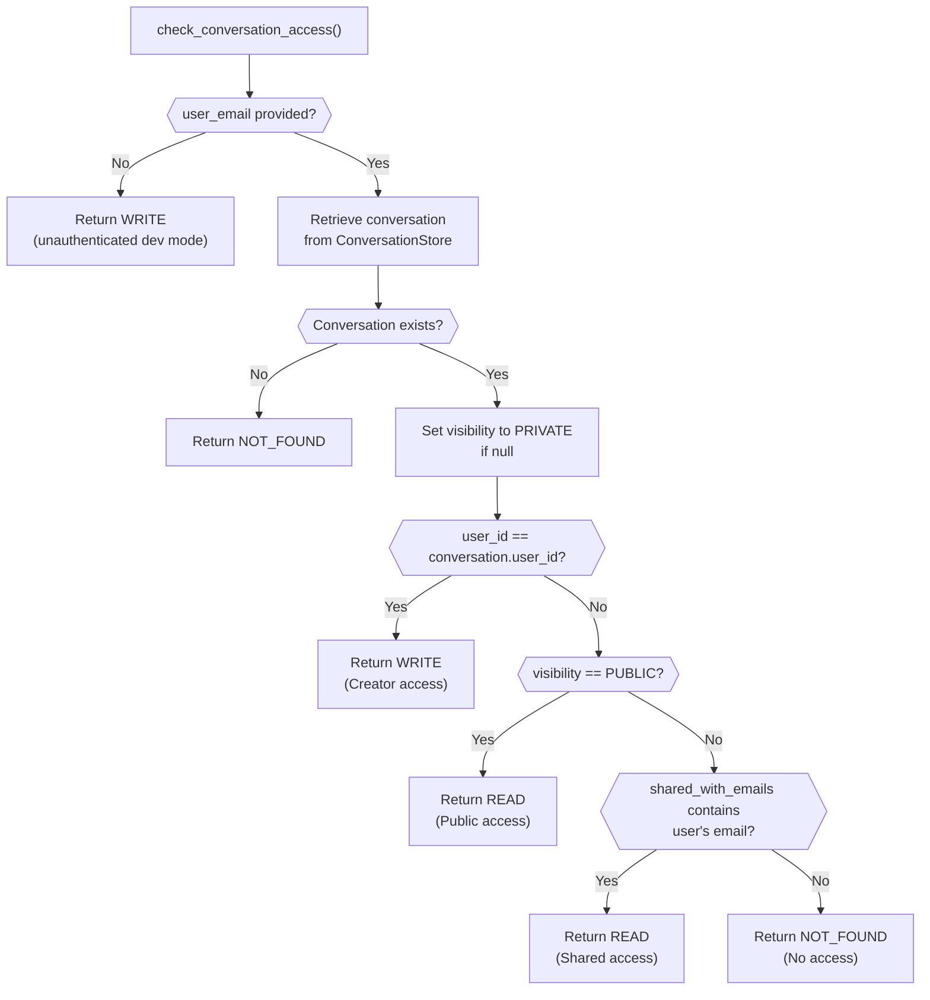
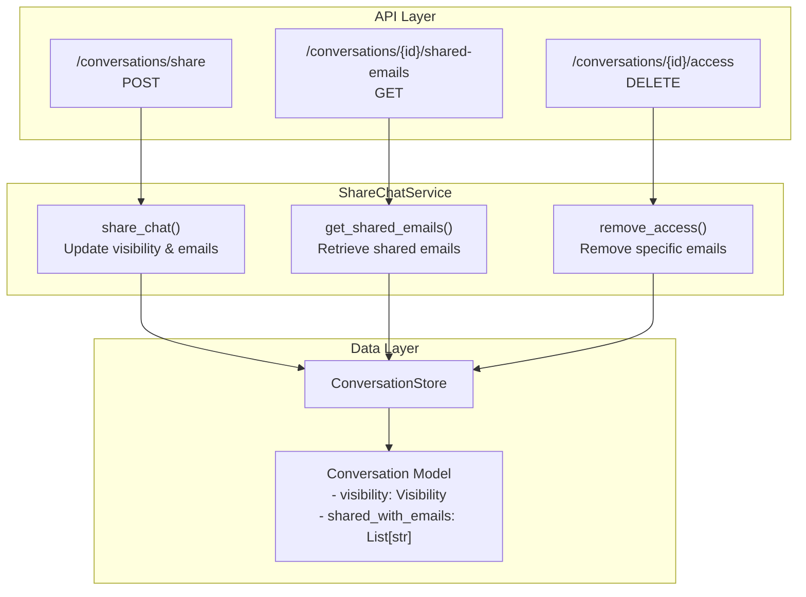
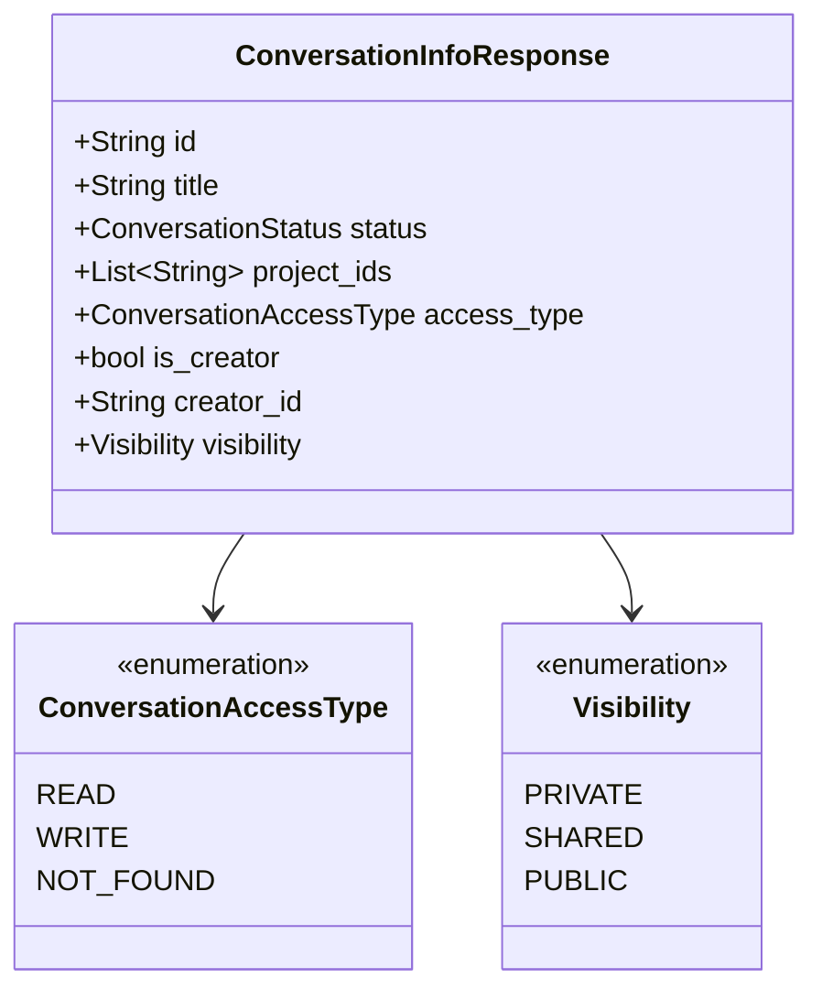
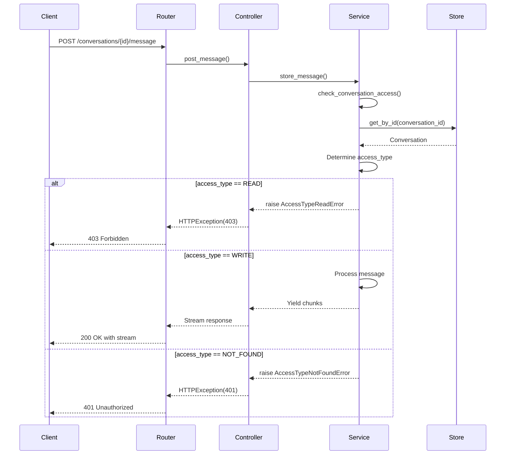

3.4-Sharing and Access Control

# Page: Sharing and Access Control

# Sharing and Access Control

<details>
<summary>Relevant source files</summary>

The following files were used as context for generating this wiki page:

- [app/modules/conversations/conversation/conversation_controller.py](app/modules/conversations/conversation/conversation_controller.py)
- [app/modules/conversations/conversation/conversation_schema.py](app/modules/conversations/conversation/conversation_schema.py)
- [app/modules/conversations/conversation/conversation_service.py](app/modules/conversations/conversation/conversation_service.py)
- [app/modules/conversations/conversations_router.py](app/modules/conversations/conversations_router.py)

</details>


## Purpose and Scope

This document describes the conversation sharing and access control system in Potpie. It covers the three-tier visibility model (PRIVATE/SHARED/PUBLIC), access type determination (READ/WRITE), and the API endpoints for managing conversation sharing. 

For information about conversation lifecycle and message management, see [Conversation Service and Lifecycle](#3.1). For conversation creation and storage, see [Conversation Service and Lifecycle](#3.1).

---

## Access Control Model

The system implements a three-tier access control model with two distinct access types. Every conversation has a visibility level that determines who can access it, and each user accessing a conversation is assigned an access type that determines what operations they can perform.

### Access Type Enumeration

The `ConversationAccessType` enum defines three possible access levels:

| Access Type | Description | Allowed Operations |
|------------|-------------|-------------------|
| `WRITE` | Full access to conversation | Create messages, regenerate responses, rename, delete, share |
| `READ` | Read-only access | View conversation info and messages only |
| `NOT_FOUND` | No access or conversation doesn't exist | None |

**Sources:** [app/modules/conversations/conversation/conversation_schema.py:21-28]()

### Visibility Levels

The `Visibility` enum defines three visibility modes for conversations:

| Visibility | Access Scope | Use Case |
|-----------|-------------|----------|
| `PRIVATE` | Creator only | Default; personal conversations |
| `SHARED` | Creator + specified email addresses | Team collaboration |
| `PUBLIC` | Anyone with the conversation ID | Public demonstrations, sharing with broad audience |

**Sources:** [app/modules/conversations/conversation/conversation_model.py:15](), [app/modules/conversations/conversation/conversation_schema.py:8-9]()

---

## Access Determination Logic

### Access Check Flow

The `check_conversation_access` method in `ConversationService` implements the access control logic:



**Sources:** [app/modules/conversations/conversation/conversation_service.py:166-214]()

### Access Check Implementation

The access determination follows this priority order:

1. **Creator Check**: If `user_id == conversation.user_id`, return `WRITE`
2. **Public Check**: If `visibility == Visibility.PUBLIC`, return `READ`
3. **Shared Check**: If user's email is in `shared_with_emails` array, return `READ`
4. **Default**: Return `NOT_FOUND`

The system converts email addresses to user IDs for shared access verification using `UserService.get_user_ids_by_emails()`.

**Sources:** [app/modules/conversations/conversation/conversation_service.py:191-214]()

---

## Sharing Service Architecture

### ShareChatService Components

The `ShareChatService` manages conversation sharing operations through three primary methods:



**Sources:** [app/modules/conversations/conversations_router.py:569-621](), [app/modules/conversations/access/access_service.py:18-19]()

---

## Sharing Operations

### Share Conversation

The share conversation endpoint accepts a `ShareChatRequest` and updates the conversation's visibility and shared email list:

**Endpoint**: `POST /conversations/share`

**Request Schema**:
```json
{
  "conversation_id": "string",
  "visibility": "PRIVATE | SHARED | PUBLIC",
  "recipientEmails": ["email1@example.com", "email2@example.com"]
}
```

**Workflow**:
1. Verify requester is conversation creator
2. Update `conversation.visibility` to requested level
3. Update `conversation.shared_with_emails` with recipient list
4. Persist changes to database

**Sources:** [app/modules/conversations/conversations_router.py:569-588](), [app/modules/conversations/access/access_schema.py:14]()

### Get Shared Emails

Retrieves the list of email addresses that have access to a conversation:

**Endpoint**: `GET /conversations/{conversation_id}/shared-emails`

**Response**: `List[str]` of email addresses

**Access Control**: Only the conversation creator can retrieve the shared emails list.

**Sources:** [app/modules/conversations/conversations_router.py:591-600]()

### Remove Access

Removes specific email addresses from a conversation's shared access list:

**Endpoint**: `DELETE /conversations/{conversation_id}/access`

**Request Schema**:
```json
{
  "emails": ["email1@example.com", "email2@example.com"]
}
```

**Workflow**:
1. Verify requester is conversation creator
2. Remove specified emails from `shared_with_emails` array
3. Persist changes

**Sources:** [app/modules/conversations/conversations_router.py:603-621](), [app/modules/conversations/access/access_schema.py:7-8]()

---

## Access Control Enforcement

### Service Layer Enforcement

The `ConversationService` enforces access control at multiple operation points:

| Operation | Required Access | Error on Violation |
|-----------|----------------|-------------------|
| Store message | `WRITE` | `AccessTypeReadError` |
| Regenerate message | `WRITE` | `AccessTypeReadError` |
| Delete conversation | `WRITE` | `AccessTypeReadError` |
| Rename conversation | `WRITE` | `AccessTypeReadError` |
| Get conversation info | `READ` or `WRITE` | `AccessTypeNotFoundError` |
| Get messages | `READ` or `WRITE` | `AccessTypeNotFoundError` |

**Example - Message Storage Access Check**:
```python
# Line 556-560 in conversation_service.py
access_level = await self.check_conversation_access(
    conversation_id, self.user_email, user_id
)
if access_level == ConversationAccessType.READ:
    raise AccessTypeReadError("Access denied.")
```

**Sources:** [app/modules/conversations/conversation/conversation_service.py:556-560](), [app/modules/conversations/conversation/conversation_service.py:696-702](), [app/modules/conversations/conversation/conversation_service.py:794-800]()

### Controller Layer Exception Mapping

The `ConversationController` maps service exceptions to HTTP status codes:

| Exception | HTTP Status | Description |
|-----------|------------|-------------|
| `AccessTypeReadError` | 403 Forbidden | User has read-only access |
| `AccessTypeNotFoundError` | 401 Unauthorized | User has no access |
| `ConversationNotFoundError` | 404 Not Found | Conversation doesn't exist |

**Sources:** [app/modules/conversations/conversation/conversation_controller.py:116-119](), [app/modules/conversations/conversation/conversation_controller.py:134-137]()

---

## Database Schema

### Conversation Model Fields

The `Conversation` model includes these access control fields:

| Field | Type | Description |
|-------|------|-------------|
| `user_id` | String | Creator's user ID (determines WRITE access) |
| `visibility` | Visibility enum | PRIVATE/SHARED/PUBLIC visibility level |
| `shared_with_emails` | List[String] | Email addresses with READ access |

**Default Behavior**:
- Conversations default to `PRIVATE` visibility if not specified
- `shared_with_emails` is an empty list by default
- Null visibility is normalized to `PRIVATE` during access checks

**Sources:** [app/modules/conversations/conversation/conversation_model.py:15](), [app/modules/conversations/conversation/conversation_service.py:188-189]()

---

## Access Control Integration Points

### Conversation Info Response

The `ConversationInfoResponse` schema includes access control metadata:



The `access_type` field in the response indicates the current user's access level, while `is_creator` provides a boolean flag for UI rendering decisions.

**Sources:** [app/modules/conversations/conversation/conversation_schema.py:36-49]()

### Message Operations Flow

All message operations flow through the access control system:



**Sources:** [app/modules/conversations/conversations_router.py:161-286](), [app/modules/conversations/conversation/conversation_controller.py:106-119](), [app/modules/conversations/conversation/conversation_service.py:544-652]()

---

## Security Considerations

### Email-to-User ID Mapping

The system uses email addresses for sharing but performs access checks using user IDs:

1. **Sharing**: Stores email addresses in `shared_with_emails`
2. **Access Check**: Converts emails to user IDs via `UserService.get_user_ids_by_emails()`
3. **Validation**: Checks if current user's ID is in the converted ID list

This approach allows for flexible sharing while maintaining security through ID-based checks.

**Sources:** [app/modules/conversations/conversation/conversation_service.py:199-212]()

### Creator-Only Operations

Certain operations are restricted to conversation creators only:

- **Sharing configuration**: Only creators can modify `visibility` and `shared_with_emails`
- **Deletion**: Only creators can delete conversations
- **Regeneration**: Only creators can regenerate AI responses

The `ShareChatService` enforces creator verification before allowing sharing modifications.

**Sources:** [app/modules/conversations/access/access_service.py:18-19](), [app/modules/conversations/conversation/conversation_service.py:696-702]()

### Public Conversation Access

Public conversations (`visibility == PUBLIC`) grant READ access to anyone with the conversation ID. Key security implications:

- No authentication required for READ operations on public conversations
- Creator retains exclusive WRITE access
- Public conversations are discoverable only through direct ID sharing (not listed publicly)

**Sources:** [app/modules/conversations/conversation/conversation_service.py:194-195]()