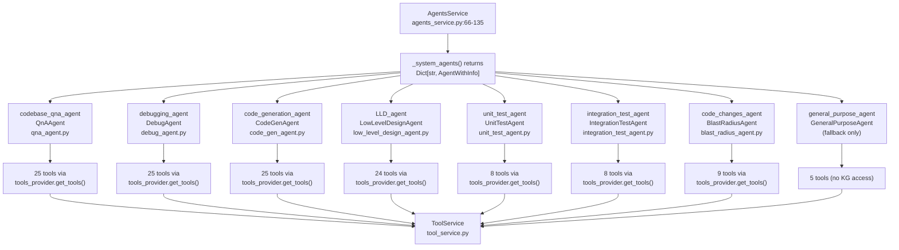
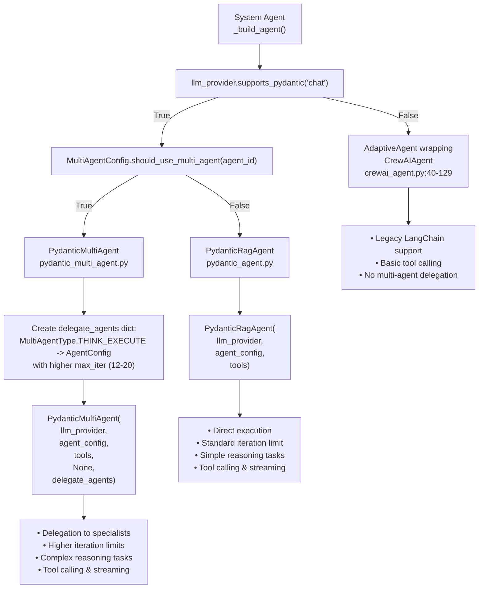
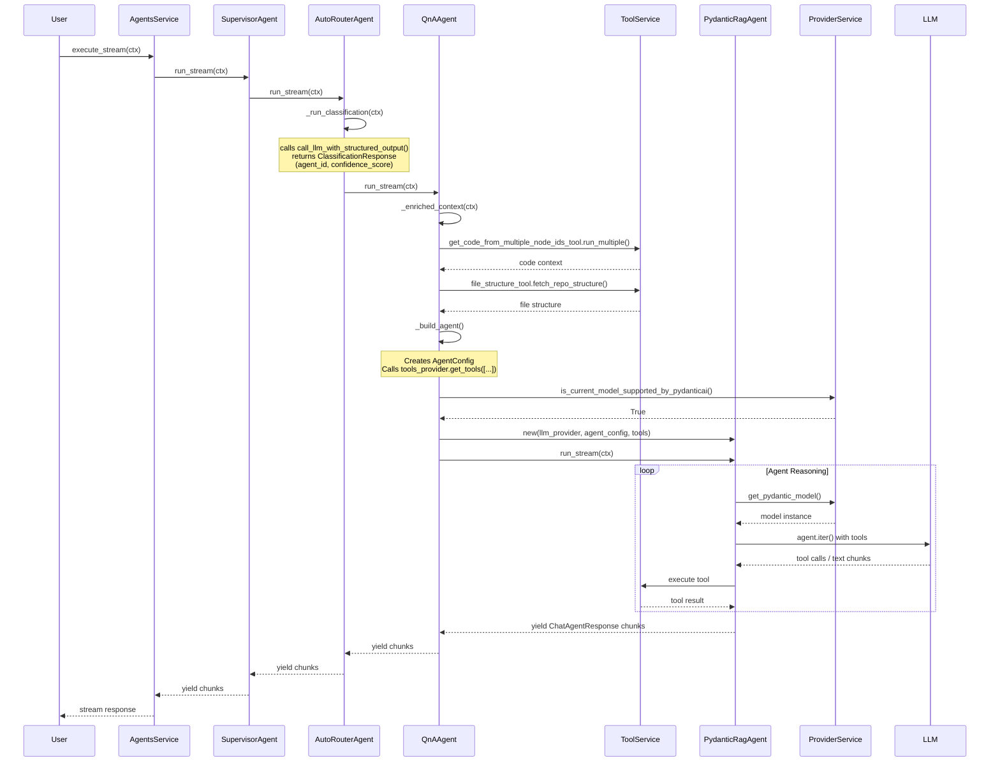
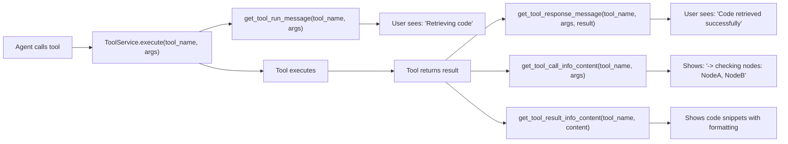
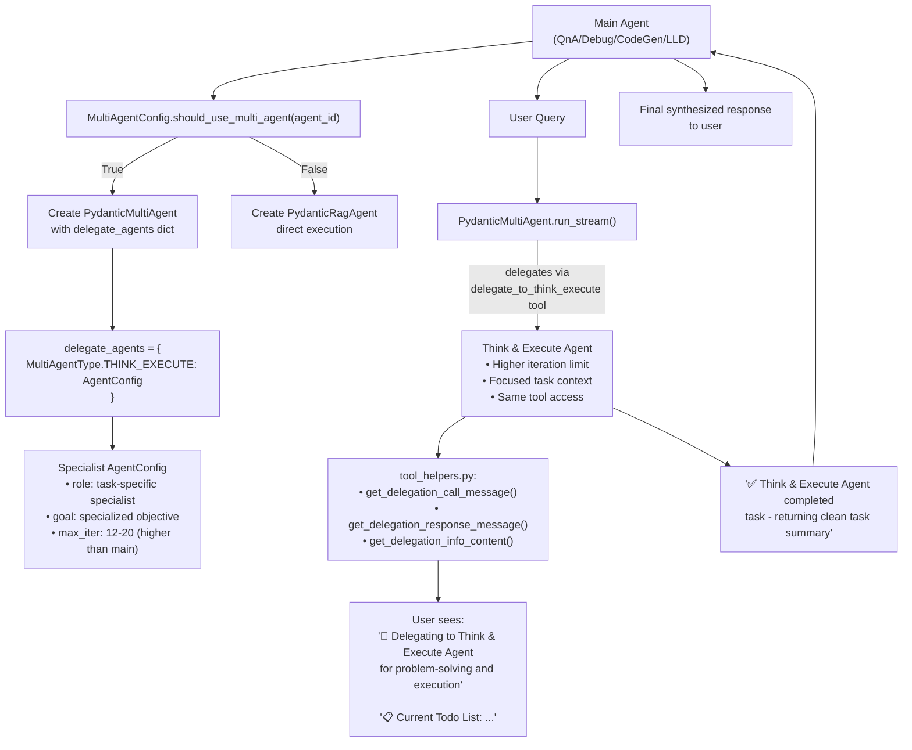
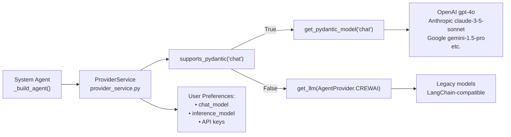

2.3-System Agents

# Page: System Agents

# System Agents

<details>
<summary>Relevant source files</summary>

The following files were used as context for generating this wiki page:

- [app/modules/intelligence/agents/agents_service.py](app/modules/intelligence/agents/agents_service.py)
- [app/modules/intelligence/agents/chat_agents/auto_router_agent.py](app/modules/intelligence/agents/chat_agents/auto_router_agent.py)
- [app/modules/intelligence/agents/chat_agents/system_agents/general_purpose_agent.py](app/modules/intelligence/agents/chat_agents/system_agents/general_purpose_agent.py)
- [app/modules/intelligence/prompts/system_prompt_setup.py](app/modules/intelligence/prompts/system_prompt_setup.py)

</details>


System Agents are the 7 specialized prebuilt agents in Potpie designed for specific codebase analysis and code generation tasks. Each agent is configured with:
- An `AgentConfig` defining role, goal, backstory, and task descriptions
- A curated subset of tools from `ToolService` (ranging from 8-25 tools depending on agent purpose)
- Task-specific prompts that guide the agent's behavior and output format
- Optional multi-agent delegation capabilities for complex reasoning

The `AgentsService` ([app/modules/intelligence/agents/agents_service.py:66-135]()) manages these agents and routes queries to them via `SupervisorAgent` and `AutoRouterAgent`.

For information about creating custom agents, see page 2.4. For details on agent routing and orchestration, see page 2.2.

## Available System Agents

Potpie includes 7 core system agents plus 1 general-purpose fallback agent, each registered in `AgentsService._system_agents()`:

| Agent | Agent ID | Implementation Class | Tool Count | Primary Purpose |
|-------|----------|---------------------|-----------|-----------------|
| **QnA Agent** | `codebase_qna_agent` | `QnAAgent` | 25 tools | Answers questions about codebase using knowledge graph queries and code traversal |
| **Debug Agent** | `debugging_agent` | `DebugAgent` | 25 tools | Root cause analysis and debugging via knowledge graph context |
| **Code Generation Agent** | `code_generation_agent` | `CodeGenAgent` | 25 tools | Generates production-ready, copy-paste code modifications |
| **Low-Level Design Agent** | `LLD_agent` | `LowLevelDesignAgent` | 24 tools | Creates detailed implementation plans for new features |
| **Unit Test Agent** | `unit_test_agent` | `UnitTestAgent` | 8 tools | Generates isolated unit tests with test plans |
| **Integration Test Agent** | `integration_test_agent` | `IntegrationTestAgent` | 8 tools | Generates integration tests covering component interactions |
| **Blast Radius Agent** | `code_changes_agent` | `BlastRadiusAgent` | 9 tools | Analyzes impact of code changes between branches |
| *General Purpose Agent* | `general_purpose_agent` | `GeneralPurposeAgent` | 5 tools | Fallback for queries not requiring codebase access |

**Note:** The General Purpose Agent is a fallback agent used only when queries don't require codebase access. The 7 core agents listed above handle all code-related tasks.

**Diagram: System Agent Registration and Tool Assignment in AgentsService**



Sources: 
- [app/modules/intelligence/agents/agents_service.py:66-135]()
- [app/modules/intelligence/agents/chat_agents/system_agents/qna_agent.py:1-207]()
- [app/modules/intelligence/agents/chat_agents/system_agents/debug_agent.py:1-194]()
- [app/modules/intelligence/agents/chat_agents/system_agents/code_gen_agent.py:1-299]()
- [app/modules/intelligence/agents/chat_agents/system_agents/low_level_design_agent.py:1-179]()
- [app/modules/intelligence/agents/chat_agents/system_agents/unit_test_agent.py:1-128]()
- [app/modules/intelligence/agents/chat_agents/system_agents/integration_test_agent.py:1-196]()
- [app/modules/intelligence/agents/chat_agents/system_agents/blast_radius_agent.py:1-120]()

## Agent Architecture and Implementation

Each system agent follows a consistent architecture pattern defined in their respective files under `app/modules/intelligence/agents/chat_agents/system_agents/`. All agents:

1. **Inherit from `ChatAgent`** - The base interface requiring `run()` and `run_stream()` methods
2. **Receive three services in `__init__`**:
   - `llm_provider: ProviderService` - LLM interaction and model selection
   - `tools_provider: ToolService` - Access to 18+ tools for code/web/external services
   - `prompt_provider: PromptService` - Prompt template management
3. **Implement standard methods**:
   - `_build_agent()` - Creates the appropriate agent implementation
   - `_enriched_context(ctx)` - Adds relevant context to queries (optional)
   - `run(ctx)` and `run_stream(ctx)` - Execute synchronously or stream responses

### Implementation Selection Strategy

The `_build_agent()` method in each agent dynamically selects between two implementation approaches based on LLM provider capabilities and multi-agent configuration:

**Implementation 1: PydanticMultiAgent** (Advanced Multi-Agent Mode)
- Used when: `llm_provider.supports_pydantic("chat")` returns `True` AND `MultiAgentConfig.should_use_multi_agent(agent_id)` returns `True`
- Capabilities: Delegation to specialized "Think & Execute" sub-agents with higher iteration limits
- Available for: QnA, Debug, Code Generation, and Low-Level Design agents
- Example configuration: QnA Agent creates a "Q&A Synthesis Specialist" delegate with 12 max iterations
- Implementation: [app/modules/intelligence/agents/chat_agents/pydantic_multi_agent.py]()

**Implementation 2: PydanticRagAgent** (Standard Pydantic Mode)
- Used when: `llm_provider.supports_pydantic("chat")` returns `True` but multi-agent is disabled
- Supports: OpenAI, Anthropic, Gemini, and other providers with pydantic_ai SDK support
- Features: Native tool calling, structured output, streaming responses
- Default for: Unit Test, Integration Test, and Blast Radius agents (no multi-agent support)
- Implementation: [app/modules/intelligence/agents/chat_agents/pydantic_agent.py]()

**Implementation 3: AdaptiveAgent with CrewAIAgent** (Legacy Fallback)
- Used when: Model doesn't support pydantic_ai
- Implementation: Wraps a `CrewAIAgent` inside an `AdaptiveAgent`
- Supports: Any LLM with LangChain integration
- Rarely used: Most modern models support pydantic_ai
- Implementation: [app/modules/intelligence/agents/chat_agents/crewai_agent.py:40-129]()

**Diagram: Agent Implementation Selection Flow with Multi-Agent Support**



Sources: 
- [app/modules/intelligence/agents/chat_agents/system_agents/qna_agent.py:88-126]()
- [app/modules/intelligence/agents/chat_agents/system_agents/debug_agent.py:88-123]()
- [app/modules/intelligence/agents/chat_agents/system_agents/code_gen_agent.py:96-136]()
- [app/modules/intelligence/agents/chat_agents/system_agents/low_level_design_agent.py:83-121]()
- [app/modules/intelligence/agents/chat_agents/pydantic_multi_agent.py]()
- [app/modules/intelligence/agents/chat_agents/pydantic_agent.py]()
- [app/modules/intelligence/agents/chat_agents/crewai_agent.py:40-129]()
- [app/modules/intelligence/agents/multi_agent_config.py]()

## Agent Execution Process

All system agents follow a three-phase execution pattern:

**Phase 1: Context Enrichment**
Most agents implement `_enriched_context(ctx: ChatContext) -> ChatContext` to augment the query with relevant information before execution. This typically includes:
- Fetching code for specified `node_ids` using `get_code_from_multiple_node_ids_tool.run_multiple()`
- Adding file structure via `file_structure_tool.fetch_repo_structure()`
- Extracting code graphs for component analysis (Integration Test Agent)

**Phase 2: Agent Building**
The `_build_agent()` method:
1. Creates an `AgentConfig` with role, goal, backstory, and task descriptions
2. Calls `tools_provider.get_tools(tool_names)` to fetch the agent's tool set
3. Checks LLM model compatibility and instantiates either `PydanticRagAgent` or `AdaptiveAgent`

**Phase 3: Execution**
- `run(ctx)` - Synchronous execution returning `ChatAgentResponse`
- `run_stream(ctx)` - Asynchronous generator yielding `ChatAgentResponse` chunks for streaming

**Diagram: System Agent Execution Sequence**



Sources:
- [app/modules/intelligence/agents/agents_service.py:137-142]()
- [app/modules/intelligence/agents/chat_agents/auto_router_agent.py:34-83]()
- [app/modules/intelligence/agents/chat_agents/system_agents/qna_agent.py:74-100]()
- [app/modules/intelligence/agents/chat_agents/pydantic_agent.py:506-630]()

## Agent Configuration Pattern

Each system agent constructs an `AgentConfig` object in its `_build_agent()` method. The `AgentConfig` class (defined in [app/modules/intelligence/agents/chat_agents/crewai_agent.py:16-32]()) specifies:

| Field | Type | Purpose |
|-------|------|---------|
| `role` | `str` | Agent's identity (e.g., "QNA Agent", "Code Generation Agent") |
| `goal` | `str` | Primary objective (e.g., "Answer queries of the repo") |
| `backstory` | `str` | Context and capabilities description for the agent persona |
| `tasks` | `List[TaskConfig]` | Task descriptions with expected outputs |
| `max_iter` | `int` | Maximum reasoning iterations (default: 25) |

**TaskConfig Structure:**
```python
TaskConfig(
    description=qna_task_prompt,  # Detailed task instructions
    expected_output="Markdown formatted chat response to user's query"
)
```

**Example: QnA Agent Configuration**
```python
agent_config = AgentConfig(
    role="Codebase Q&A Specialist",
    goal="Provide comprehensive, well-structured answers to questions about the codebase by systematically exploring code, understanding context, and delivering thorough explanations grounded in actual code.",
    backstory="""
        You are an expert codebase analyst and Q&A specialist with deep expertise in systematically exploring and understanding codebases. You excel at:
        1. Structured question analysis - breaking down complex questions into manageable exploration tasks
        2. Systematic code navigation - methodically traversing knowledge graphs, code structures, and relationships
        3. Context building - assembling comprehensive understanding from multiple code locations and perspectives
        4. Clear communication - presenting technical information in an organized, accessible manner
        5. Thorough verification - ensuring answers are complete, accurate, and well-supported by code evidence
        
        You use todo and requirements tools to track complex multi-step questions, ensuring no aspect is missed. You maintain a conversational tone while being methodical and thorough.
    """,
    tasks=[
        TaskConfig(
            description=qna_task_prompt,  # 324-line detailed prompt with 5-step workflow
            expected_output="Markdown formatted chat response to user's query grounded in provided code context and tool results, with clear structure, citations, and comprehensive explanations"
        )
    ],
)
```

Sources:
- [app/modules/intelligence/agents/chat_agents/crewai_agent.py:16-32]()
- [app/modules/intelligence/agents/chat_agents/system_agents/qna_agent.py:36-54]()
- [app/modules/intelligence/agents/chat_agents/system_agents/code_gen_agent.py:38-62]()

## Tool Selection Strategy by Agent

Each system agent selects a curated subset of the 70+ available tools from `ToolService` based on its specific purpose. The tool selection happens in `_build_agent()` via `tools_provider.get_tools(tool_names)`.

### Tool Categories

**Knowledge Graph Tools (KG-based):**
- `ask_knowledge_graph_queries` - Natural language queries to Neo4j knowledge graph
- `get_code_from_node_id` - Fetch code for a single node
- `get_code_from_multiple_node_ids` - Fetch code for multiple nodes
- `get_code_from_probable_node_name` - Find code by partial class/function name
- `get_nodes_from_tags` - Search nodes by AI-generated tags
- `get_node_neighbours_from_node_id` - Get immediate neighbors

**Code Query Tools:**
- `fetch_file` - Retrieve file content by path
- `analyze_code_structure` - Parse file to extract classes/functions
- `get_code_file_structure` - Get directory structure of project
- `get_code_graph_from_node_id` - Get node with relationships

**Code Changes Management Tools:**
- `add_file_to_changes` - Create new files in Code Changes Manager
- `update_file_in_changes` - Replace entire file content
- `update_file_lines` - Update specific lines by line number
- `replace_in_file` - Replace text patterns using regex
- `insert_lines` - Insert content at a specific line
- `delete_lines` - Delete specific lines
- `delete_file_in_changes` - Mark a file for deletion
- `get_file_from_changes` - Get file content with line numbers
- `list_files_in_changes` - List all tracked files
- `show_diff` - Display unified diffs of all changes
- `show_updated_file` - Display updated file content
- `clear_file_from_changes` / `clear_all_changes` - Clear changes
- `get_changes_summary` / `export_changes` - Get overview/export

**Planning and Todo Tools:**
- `create_todo` - Create todo items for task tracking
- `update_todo_status` - Update todo status (pending/in_progress/completed)
- `add_todo_note` - Add notes to todos
- `get_todo` / `list_todos` - Retrieve todo details/list
- `get_todo_summary` - Get summary of all todos
- `add_requirements` - Update requirements document
- `get_requirements` / `delete_requirements` - Manage requirements

**Execution Tools:**
- `bash_command` - Execute sandboxed bash commands on codebase

**Web and External Tools:**
- `webpage_extractor` - Scrape and extract web content
- `web_search_tool` - Perform web searches

**Integration Tools:**
- Jira: `get_jira_issue`, `search_jira_issues`, `create_jira_issue`, `update_jira_issue`, `add_jira_comment`, `transition_jira_issue`, `link_jira_issues`, `get_jira_projects`, `get_jira_project_details`, `get_jira_project_users`
- Confluence: `get_confluence_spaces`, `get_confluence_page`, `search_confluence_pages`, `get_confluence_space_pages`, `create_confluence_page`, `update_confluence_page`, `add_confluence_comment`
- GitHub: `github_content_fetcher` - Fetch issues/PRs from GitHub repos

**Specialized Tools:**
- `change_detection` - Analyze code changes between branches
- `think` - Internal reasoning tool for planning

### Agent-Specific Tool Configurations

**QnA Agent** (17 tools) - [app/modules/intelligence/agents/chat_agents/system_agents/qna_agent.py:56-78]()
```python
tools = self.tools_provider.get_tools([
    # Knowledge Graph & Code Query Tools
    "get_code_from_multiple_node_ids",
    "get_node_neighbours_from_node_id",
    "get_code_from_probable_node_name",
    "ask_knowledge_graph_queries",
    "get_nodes_from_tags",
    "get_code_file_structure",
    
    # Web & External Tools
    "webpage_extractor",
    "web_search_tool",
    
    # Code Analysis Tools
    "fetch_file",
    "analyze_code_structure",
    "bash_command",
    
    # Planning and Todo Tools
    "create_todo",
    "update_todo_status",
    "get_todo",
    "list_todos",
    "add_todo_note",
    "get_todo_summary",
    "add_requirements",
    "get_requirements",
])
```
**Tool Selection Rationale:** QnA focuses on systematic codebase exploration with todo tracking for complex multi-step questions. Includes requirements management to ensure all aspects of questions are addressed.

**Debug Agent** (17 tools) - [app/modules/intelligence/agents/chat_agents/system_agents/debug_agent.py:56-78]()
- Same 17 tools as QnA Agent
- Optimized for debugging workflows (error tracing, execution path analysis, root cause tracking)
- Todo tools used for tracking hypothesis verification and generalization steps

**Code Generation Agent** (25 tools) - [app/modules/intelligence/agents/chat_agents/system_agents/code_gen_agent.py:64-104]()
```python
tools = self.tools_provider.get_tools([
    # Knowledge Graph & Code Query Tools (same as QnA)
    "get_code_from_multiple_node_ids",
    "get_node_neighbours_from_node_id",
    "get_code_from_probable_node_name",
    "ask_knowledge_graph_queries",
    "get_nodes_from_tags",
    "get_code_file_structure",
    
    # Web & External Tools
    "webpage_extractor",
    "web_search_tool",
    
    # Code Analysis Tools
    "fetch_file",
    "analyze_code_structure",
    "bash_command",
    
    # Planning and Todo Tools
    "create_todo",
    "update_todo_status",
    "add_todo_note",
    "get_todo",
    "list_todos",
    "get_todo_summary",
    "add_requirements",
    "get_requirements",
    "delete_requirements",
    
    # Code Changes Management Tools (unique to CodeGen)
    "add_file_to_changes",
    "update_file_in_changes",
    "update_file_lines",
    "replace_in_file",
    "insert_lines",
    "delete_lines",
    "delete_file_in_changes",
    "get_file_from_changes",
    "list_files_in_changes",
    "search_content_in_changes",
    "clear_file_from_changes",
    "clear_all_changes",
    "get_changes_summary",
    "export_changes",
    "show_updated_file",
    "show_diff",
    "get_file_diff",
    "get_session_metadata",
])
```
**Tool Selection Rationale:** Code Generation Agent has the most extensive tool set with 25 tools. It includes all Code Changes Manager tools for writing and tracking code modifications, plus planning tools for managing complex multi-file changes. The `show_diff` tool is critical for displaying final changes to users.

**Low-Level Design Agent** (13 tools) - [app/modules/intelligence/agents/chat_agents/system_agents/low_level_design_agent.py:51-64]()
```python
tools = self.tools_provider.get_tools([
    # Knowledge Graph & Code Query Tools
    "get_code_from_multiple_node_ids",
    "get_node_neighbours_from_node_id",
    "get_code_from_probable_node_name",
    "ask_knowledge_graph_queries",
    "get_nodes_from_tags",
    
    # Web & External Tools
    "webpage_extractor",
    "web_search_tool",
    
    # Planning Tool (unique to LLD)
    "think",
    
    # Code Analysis Tools
    "fetch_file",
    "analyze_code_structure",
    "bash_command",
])
```
**Tool Selection Rationale:** LLD Agent focuses on design planning rather than implementation. The `think` tool enables internal reasoning for architectural decisions. No todo or code changes tools since this agent creates plans, not code.

**Unit Test Agent** (8 tools) - [app/modules/intelligence/agents/chat_agents/system_agents/unit_test_agent.py:38-48]()
```python
tools = self.tools_provider.get_tools([
    "get_code_from_node_id",               # Single node focus
    "get_code_from_probable_node_name",
    "webpage_extractor",                   # Research testing frameworks
    "web_search_tool",
    "github_tool",
    "fetch_file",
    "analyze_code_structure",
    "bash_command",
])
```
**Tool Selection Rationale:** Limited to 8 tools because unit testing focuses on isolated functions, not graph traversal or integrations.

**Integration Test Agent** (8 tools) - [app/modules/intelligence/agents/chat_agents/system_agents/integration_test_agent.py:46-57]()
```python
tools = self.tools_provider.get_tools([
    "get_code_from_multiple_node_ids",     # Component relationships
    "get_code_from_probable_node_name",
    "webpage_extractor",
    "web_search_tool",
    "github_tool",
    "fetch_file",
    "analyze_code_structure",
    "bash_command",
])
```
**Tool Selection Rationale:** Focuses on multi-node code fetching to understand component interactions, but excludes integration tools.

**Blast Radius Agent** (9 tools) - [app/modules/intelligence/agents/chat_agents/system_agents/blast_radius_agent.py:37-50]()
```python
tools = self.tools_provider.get_tools([
    "get_nodes_from_tags",
    "ask_knowledge_graph_queries",
    "get_code_from_multiple_node_ids",
    "change_detection",                    # Unique to this agent
    "webpage_extractor",
    "web_search_tool",
    "github_tool",
    "fetch_file",
    "analyze_code_structure",
    "bash_command",
])
```
**Tool Selection Rationale:** `change_detection` tool is unique to this agent for analyzing git diffs and identifying changed functions.

**General Purpose Agent** (5 tools - NO codebase access) - [app/modules/intelligence/agents/chat_agents/system_agents/general_purpose_agent.py]()
```python
tools = self.tools_provider.get_tools([
    "webpage_extractor",
    "github_tool",
    "get_linear_issue",
    "update_linear_issue",
    "web_search_tool",
])
```
**Tool Selection Rationale:** Intentionally excludes ALL KG-based and code query tools as this agent handles queries that don't require codebase access (greetings, general questions).

Sources:
- [app/modules/intelligence/agents/chat_agents/tool_helpers.py:1-1559]()
- [app/modules/intelligence/agents/chat_agents/system_agents/qna_agent.py:56-78]()
- [app/modules/intelligence/agents/chat_agents/system_agents/debug_agent.py:56-78]()
- [app/modules/intelligence/agents/chat_agents/system_agents/code_gen_agent.py:64-104]()
- [app/modules/intelligence/agents/chat_agents/system_agents/low_level_design_agent.py:51-64]()
- [app/modules/intelligence/agents/chat_agents/system_agents/unit_test_agent.py:38-48]()
- [app/modules/intelligence/agents/chat_agents/system_agents/integration_test_agent.py:46-56]()
- [app/modules/intelligence/agents/chat_agents/system_agents/blast_radius_agent.py:37-49]()

## Agent Response Format and Tool Messaging

All system agents return `ChatAgentResponse` objects (defined in [app/modules/intelligence/agents/chat_agent.py]()) containing:

| Field | Type | Description |
|-------|------|-------------|
| `response` | `str` | Main text response (supports markdown formatting) |
| `tool_calls` | `List[ToolCallResponse]` | Tool execution events with call_id, event_type (CALL/RESULT), tool_name, and details |
| `citations` | `List[str]` | References to code entities (file paths, function names, node IDs) |

**ToolCallResponse Structure:**
```python
ToolCallResponse(
    call_id: str,                    # Unique identifier for tool invocation
    event_type: ToolCallEventType,   # CALL or RESULT
    tool_name: str,                  # e.g., "ask_knowledge_graph_queries"
    tool_response: str,              # User-friendly message about execution
    tool_call_details: dict          # Summary of arguments/results
)
```

The streaming interface (`run_stream()`) yields these responses incrementally, allowing real-time display of:
- Text chunks as they're generated
- Tool execution notifications (when agent calls a tool)
- Tool result notifications (when tool returns data)

### Tool Helper Integration

The `tool_helpers.py` module ([app/modules/intelligence/agents/chat_agents/tool_helpers.py]()) provides standardized messaging for tool execution across all agents. This creates a consistent user experience regardless of which agent is running.

**Tool Messaging Functions:**

| Function | Purpose | Example Output |
|----------|---------|----------------|
| `get_tool_run_message(tool_name, args)` | Message when tool starts | "Retrieving code", "Executing bash command" |
| `get_tool_response_message(tool_name, args, result)` | Message when tool completes | "Code retrieved successfully", "File content fetched: path/to/file.py" |
| `get_tool_call_info_content(tool_name, args)` | Detailed tool call info | "-> checking following nodes:\n- NodeA\n- NodeB" |
| `get_tool_result_info_content(tool_name, content)` | Detailed tool result info | "-> retrieved code snippets:\n```python\n...\n```" |

**Example Tool Execution Flow:**



**Special Tool Messages:**

**Code Changes Manager Tools** (CodeGen Agent):
- `add_file_to_changes`: "Adding file: path/to/file.py"
- `update_file_lines`: "Updating lines in: path/to/file.py"
- `show_diff`: "Displaying code diff"

**Planning Tools** (QnA, Debug, CodeGen Agents):
- `create_todo`: "Creating todo item"
- `update_todo_status`: "Updating todo status: {todo_id} -> {status}"
- `add_requirements`: "Updating requirements document"

**Delegation Tools** (Multi-Agent Mode):
- `delegate_to_think_execute`: "🧠 Delegating to Think & Execute Agent for problem-solving and execution"
- Completion: "✅ Think & Execute Agent completed task - returning clean task summary"

**Bash Command Execution:**
- Start: "Running: {command}" (truncated to 80 chars)
- Complete: "Bash command executed successfully: {command}" (with small result preview)

**Integration Tools** (Jira/Confluence/GitHub):
- `get_jira_issue`: "Fetching Jira issue details" → "Jira issue details retrieved: PROJ-123"
- `create_confluence_page`: "Creating new Confluence page" → "Confluence page created successfully: Space - Title"

**Todo List Streaming:**

When using planning tools, agents automatically stream the current todo list state to users. The `_format_current_todo_list()` function ([tool_helpers.py:13-16]()) is imported from `todo_management_tool` to display real-time progress:

```
📋 **Current Todo List:**
• [pending] Trace execution path for method reset issue
• [in_progress] Identify all locations where method could be modified
• [completed] Verify fix covers all affected components
```

This todo list is automatically included in delegation messages, helping users track complex multi-step agent operations.

Sources:
- [app/modules/intelligence/agents/chat_agent.py:1-50]()
- [app/modules/intelligence/agents/chat_agents/pydantic_agent.py:573-620]()
- [app/modules/intelligence/agents/chat_agents/tool_helpers.py:19-823]()
- [app/modules/intelligence/tools/todo_management_tool.py]()

## Agent-Specific Implementation Details

### QnA Agent (`codebase_qna_agent`)

**Class:** `QnAAgent` in [app/modules/intelligence/agents/chat_agents/system_agents/qna_agent.py:24-153]()

**Purpose:** Comprehensive codebase question answering using knowledge graph traversal and code analysis

**Multi-Agent Support:** ✅ Yes - Creates "Q&A Synthesis Specialist" delegate when multi-agent mode is enabled ([qna_agent.py:89-116]())

**Context Enrichment:** [app/modules/intelligence/agents/chat_agents/system_agents/qna_agent.py:126-142]()
```python
async def _enriched_context(self, ctx: ChatContext) -> ChatContext:
    # Fetch code for specified node_ids
    if ctx.node_ids and len(ctx.node_ids) > 0:
        code_results = await self.tools_provider.get_code_from_multiple_node_ids_tool.run_multiple(
            ctx.project_id, ctx.node_ids
        )
        ctx.additional_context += f"Code context of the node_ids in query:\n {code_results}"
    
    # Add complete file structure for navigation
    file_structure = await self.tools_provider.file_structure_tool.fetch_repo_structure(
        ctx.project_id
    )
    ctx.additional_context += f"File Structure of the project:\n {file_structure}"
    
    return ctx
```

**Specialized Workflow:** The QnA Agent follows a structured 5-step methodology defined in its 324-line task prompt ([qna_agent.py:155-479]()):

**Diagram: QnA Agent 5-Step Workflow**

```mermaid
graph TB
    Query["User Question"] --> Step1["Step 1: Understand the Question"]
    
    Step1 --> Analyze["1a. Analyze Question Type:<br/>What/How/Where/Why/Multi-part"]
    Analyze --> Extract["1b. Extract Key Information:<br/>entities, scope, context clues"]
    Extract --> Plan["1c. Plan Approach:<br/>Use add_requirements() and create_todo()<br/>for complex questions"]
    
    Plan --> Step2["Step 2: Systematic Code Navigation"]
    
    Step2 --> BuildContext["2a. Build Contextual Understanding:<br/>web_search, docstrings, README<br/>ask_knowledge_graph_queries<br/>get_code_file_structure"]
    BuildContext --> FetchCode["2b. Fetch Specific Code:<br/>get_code_from_probable_node_name<br/>get_code_from_multiple_node_ids<br/>get_node_neighbours_from_node_id"]
    FetchCode --> DeepContext["2c. Deep Context Gathering:<br/>fetch_file with line ranges<br/>trace control flow<br/>update_todo_status as tasks complete"]
    
    DeepContext --> Step3["Step 3: Analyze and Synthesize"]
    
    Step3 --> Evaluate["3a. Evaluate Information Quality:<br/>relevance, completeness, accuracy"]
    Evaluate --> Mental["3b. Build Mental Model:<br/>how components fit together"]
    Mental --> Identify["3c. Identify Answer Components:<br/>use add_todo_note for key findings"]
    
    Identify --> Step4["Step 4: Structure Response"]
    
    Step4 --> Organize["4a. Organize Logically:<br/>clear headings, sections"]
    Organize --> Evidence["4b. Include Evidence:<br/>cite files, line numbers, code snippets"]
    Evidence --> Format["4c. Provide Code Snippets:<br/>markdown code blocks with language tags"]
    
    Format --> Step5["Step 5: Quality Assurance"]
    
    Step5 --> Verify["5a. Verify Completeness:<br/>call get_requirements()<br/>check all aspects answered"]
    Verify --> Review["5b. Review Structure:<br/>logical flow, clear headings<br/>proper citations"]
    Review --> Final["5c. Final Checks:<br/>call list_todos()<br/>ensure all exploration complete"]
    
    Final --> Response["Comprehensive Answer<br/>with citations and code examples"]
```



**Key Workflow Characteristics:**

**Question Analysis:**
- Identifies question type (What/How/Where/Why/Multi-part)
- Extracts entities (classes, functions, modules)
- Uses `add_requirements()` to document question aspects
- Uses `create_todo()` to break down complex exploration tasks

**Code Navigation Strategy:**
1. Start broad with `get_code_file_structure` to understand layout
2. Use `ask_knowledge_graph_queries` with keywords to locate relevant code
3. Use `get_code_from_probable_node_name` for specific entities
4. Use `get_node_neighbours_from_node_id` to explore relationships
5. Use `fetch_file` for complete context
6. Call `update_todo_status()` as exploration tasks complete

**Synthesis and Response:**
- Evaluates information quality (relevance, completeness, accuracy)
- Uses `add_todo_note()` to document key findings
- Structures response with clear headings and sections
- Includes code snippets with markdown formatting
- Calls `get_requirements()` to verify all aspects covered
- Calls `list_todos()` to ensure all exploration tasks complete

**Response Guidelines:**
- Organize results logically with citations
- Format file paths: strip project details, show only `path/to/file.py`
- Use markdown code blocks with language specification
- Adapt to question type (new/follow-up/clarification/feedback)
- Provide comprehensive response with deep context and code examples

**Tool Usage Patterns:**
- **For simple questions:** Direct code fetching without tool tracking
- **For complex questions:** Full todo/requirements workflow with 10+ tool calls
- **Average tool calls per query:** 8-15 (varies by question complexity)

### Debug Agent (`debugging_agent`)

**Class:** `DebugAgent` in [app/modules/intelligence/agents/chat_agents/system_agents/debug_agent.py:24-143]()

**Purpose:** Root cause analysis and debugging using systematic debugging methodology and knowledge graph context

**Multi-Agent Support:** ✅ Yes - Creates "Debug Solution Specialist" delegate when enabled ([debug_agent.py:87-114]())

**Context Enrichment:** [app/modules/intelligence/agents/chat_agents/system_agents/debug_agent.py:124-132]()
- Fetches code for specified `node_ids` only (no file structure to reduce token usage)
- Focuses on code directly referenced in the query
```python
async def _enriched_context(self, ctx: ChatContext) -> ChatContext:
    if ctx.node_ids and len(ctx.node_ids) > 0:
        code_results = await self.tools_provider.get_code_from_multiple_node_ids_tool.run_multiple(
            ctx.project_id, ctx.node_ids
        )
        ctx.additional_context += f"Code referred to in the query:\n {code_results}\n"
    return ctx
```

**Specialized Workflow:** The Debug Agent implements a rigorous 8-step debugging process defined in its 486-line task prompt ([debug_agent.py:146-632]()):

**Diagram: Debug Agent 8-Step Debugging Process**

```mermaid
graph TB
    Task["User reports bug/issue"] --> Detect["Task Detection:<br/>Is this debugging or general query?"]
    
    Detect --> |"Debugging Task"| Principles["Core Principles:<br/>Extract problem (ignore suggested fix)<br/>Verify don't trust<br/>Think in categories<br/>Strategic over tactical<br/>Fix at source not downstream<br/>Preserve patterns<br/>Trace before fixing<br/>Exhaustive verification"]
    
    Principles --> Step1["Step 1: Understand & Validate Problem"]
    
    Step1 --> Separate["1a. Separate Problem from Suggested Fix:<br/>Users suggest fixes - IGNORE THESE<br/>Extract only the problem"]
    Separate --> Gather["1b. Gather Context & Setup Tracking:<br/>add_requirements(problem, principles, criteria)<br/>create_todo(hypotheses to verify)<br/>fetch relevant code/data"]
    Gather --> Validate["1c. Validate Problem Statement:<br/>trace what ACTUALLY happens"]
    
    Validate --> Step2["Step 2: Explore & Hypothesize"]
    
    Step2 --> Formulate["Formulate hypotheses about root causes<br/>create_todo() for each hypothesis<br/>update_todo_status() as verified"]
    
    Formulate --> Step3["Step 3: Identify Root Cause"]
    
    Step3 --> TraceUpstream["3a. Trace COMPLETE Code Flow:<br/>UPSTREAM: Where does bad state originate?<br/>DOWNSTREAM: What consumes this?<br/>Map contract boundaries"]
    TraceUpstream --> CheckLogic["3b. If Logic Exists, Ask WHY Failing:<br/>trace data format<br/>check normalization<br/>compare both sides"]
    CheckLogic --> Enumerate["3c. Systematic Enumeration:<br/>identify category<br/>list all members<br/>gap analysis"]
    Enumerate --> ConfirmRoot["3d. Confirm Root Cause:<br/>state exact bug explicitly"]
    
    ConfirmRoot --> Step4["Step 4: Generalize the Issue (REQUIRED)"]
    
    Step4 --> General["4a. Generalize:<br/>What is the general pattern?<br/>What else is affected?<br/>What is the design-level fix?"]
    General --> Location["4b. Determine Optimal Fix Location:<br/>List ALL candidate locations<br/>Evaluate each (prevents vs handles)<br/>Maintainer mindset evaluation<br/>Document fix location decision"]
    Location --> UpdateReq["4c. Update Requirements & TODO:<br/>add_requirements(GENERALIZED ISSUE, AFFECTED, FIX LOCATION)<br/>create_todo() for implementation"]
    
    UpdateReq --> Step5["Step 5: Design Solution"]
    
    Step5 --> ValidateLoc["5a. Validate Against Location Decision:<br/>Am I still fixing at chosen location?<br/>Does it PREVENT or HANDLE?<br/>Spreading knowledge test<br/>Future bug test"]
    ValidateLoc --> FixSource["5b. Fix at Source, Not Downstream:<br/>prevent over handle<br/>eliminate at origin"]
    FixSource --> MinePatterns["5c. Mine Existing Patterns:<br/>search for EXACT patterns<br/>look for similar implementations<br/>reuse utilities"]
    MinePatterns --> Completeness["5d. Completeness Check:<br/>identify paired/symmetric methods<br/>check sibling implementations"]
    
    Completeness --> Step6["Step 6: Scrutinize & Refine"]
    
    Step6 --> KeepExploring["6a. Keep Exploring:<br/>reuse utils and patterns<br/>fix in context of codebase"]
    KeepExploring --> Challenge["6b. Challenge Your Solution:<br/>addresses ALL affected components?<br/>null/empty/boundary cases?<br/>concurrency issues?"]
    Challenge --> ValidateCases["6c. Validate All Cases:<br/>map normal/edge/error/boundary<br/>trace each through fix<br/>refine until all pass"]
    
    ValidateCases --> Checklist["Pre-Implementation Checklist:<br/>call get_requirements()<br/>verify generalized issue addressed<br/>verify fix location justified<br/>verify not spreading knowledge<br/>call list_todos()"]
    
    Checklist --> Step7["Step 7: Implement"]
    
    Step7 --> Precise["Make precise, surgical changes<br/>explain fix and provide guidance"]
    
    Precise --> Step8["Step 8: Final Verification"]
    
    Step8 --> FinalCheck["call get_requirements()<br/>verify GENERALIZED ISSUE addressed<br/>call list_todos()<br/>call get_todo_summary()"]
    
    FinalCheck --> Solution["Complete debugging solution<br/>with root cause, generalization,<br/>and strategic fix"]
    
    Detect --> |"General Query"| Conversational["CONVERSATIONAL MODE:<br/>Natural dialogue<br/>Thorough code exploration<br/>Helpful and build on context"]
    
    Conversational --> Response["Organized response<br/>with code citations"]
```



**Critical Debugging Principles:**

The Debug Agent enforces strict principles via `add_requirements()` at the start of every debugging task:

1. **Extract problem, ignore suggested fix**: Users often suggest tactical fixes. Extract only the problem statement and find the real solution.
2. **Verify, don't trust**: User-reported symptoms are hypotheses. Trace actual execution paths.
3. **Think in categories**: One instance often indicates a broader pattern. Fix the category, not just the example.
4. **Strategic over tactical**: Find the design flaw, not just the symptom. Ask "why does this bug exist?"
5. **Fix at source, not downstream**: Prevent bad state where it originates, don't handle it where consumed.
6. **Preserve patterns**: Match existing code style. Reuse functions, classes, utilities.
7. **Trace before fixing**: Map complete upstream (origin) and downstream (consumers) flow before choosing fix location.
8. **Exhaustive verification**: Assume there's always one more case you haven't considered.

**Fix Location Decision Framework:**

The agent uses a structured evaluation to choose the optimal fix location:

| Question | Origin Fix | Symptom Fix | Guard Fix |
|----------|-----------|-------------|-----------|
| Prevents or handles? | Prevents | Handles | Handles |
| Code paths protected | All downstream | Just this path | Just this consumer |
| Where would devs look? | ✓ Natural place | Surprising | Surprising |
| Matches patterns? | Check codebase | Check codebase | Check codebase |

**Preferred order:**
1. Origin fix - Prevent bad state from being created
2. Transformation fix - Correct during natural data transformation
3. Boundary fix - Validate at API/module boundaries
4. Avoid: Symptom fix, Consumer guards (spreading knowledge is a red flag)

**Key Differences from QnA Agent:**
- No file structure pre-loading (reduces token usage for focused debugging)
- Enforces 8-step structured debugging methodology with explicit step announcements
- Uses `add_requirements()` to document core principles, generalized issue, and fix location rationale
- Uses `create_todo()` to track hypothesis verification and generalization tasks
- Specialized delegate with 12 max iterations for creating debugging strategies
- Emphasizes tracing complete pipelines (upstream origins → downstream consumers)

**Tool Usage Patterns:**
- **Simple bugs:** 5-10 tool calls (direct code fetching + fix)
- **Complex bugs:** 20-30 tool calls (extensive tracing + hypothesis verification + pattern mining)
- **Generalization phase:** Additional 5-10 tool calls to identify all affected components

Sources: [app/modules/intelligence/agents/chat_agents/system_agents/debug_agent.py:24-632]()

### Unit Test Agent (`unit_test_agent`)

**Class:** `UnitTestAgent` in [app/modules/intelligence/agents/chat_agents/system_agents/unit_test_agent.py:14-75]()

**Purpose:** Generate isolated unit tests for individual functions/methods

**Multi-Agent Support:** ❌ No - Uses `PydanticRagAgent` only (no multi-agent delegation)

**Context Enrichment:** [app/modules/intelligence/agents/chat_agents/system_agents/unit_test_agent.py:56-64]()
- Fetches code graph context for specified node_ids
- Does NOT fetch file structure (focused on single function testing)
```python
async def _enriched_context(self, ctx: ChatContext) -> ChatContext:
    if ctx.node_ids and len(ctx.node_ids) > 0:
        code_results = await self.tools_provider.get_code_from_multiple_node_ids_tool.run_multiple(
            ctx.project_id, ctx.node_ids
        )
        ctx.additional_context += f"Code Graph context of the node_ids in query:\n {code_results}"
    return ctx
```

**Tool Selection:** Only 8 tools - excludes KG query tools and neighbor traversal (not needed for isolated unit tests)

**Task Prompt:** [unit_test_agent.py:77-127]()

**Task Approach:**
1. **Analysis**: Analyze fetched code to understand functionality, purpose, inputs, outputs, side effects
2. **Decision Making**: Check chat history for existing test plans to avoid regeneration
3. **Test Plan Generation** (only if not in chat history):
   - Happy path scenarios
   - Edge cases (empty inputs, maximum values, type mismatches)
   - Error handling
   - Performance or security considerations
   - Format: Two sections "Happy Path" and "Edge Cases" as neat bullet points
4. **Unit Test Writing**: Write complete unit tests with appropriate framework, clear test names, and explanatory comments
5. **Reflection and Iteration**: Review for comprehensive coverage and correctness

Sources: [app/modules/intelligence/agents/chat_agents/system_agents/unit_test_agent.py:14-128]()

### Integration Test Agent (`integration_test_agent`)

**Class:** `IntegrationTestAgent` in [app/modules/intelligence/agents/chat_agents/system_agents/integration_test_agent.py:21-136]()

**Purpose:** Generate integration tests covering component interactions and integration points

**Multi-Agent Support:** ❌ No - Uses `PydanticRagAgent` only (no multi-agent delegation)

**Unique Context Enrichment:** [app/modules/intelligence/agents/chat_agents/system_agents/integration_test_agent.py:65-126]()
```python
def _enriched_context(self, ctx: ChatContext) -> ChatContext:
    if not ctx.node_ids or len(ctx.node_ids) == 0:
        return ctx
    
    graphs = {}
    all_node_contexts: List[NodeContext] = []
    
    # Get code graph for each node to understand relationships
    for node_id in ctx.node_ids:
        graph = self.tools_provider.get_code_graph_from_node_id_tool.run(
            ctx.project_id, node_id
        )
        graphs[node_id] = graph
        
        # Extract unique nodes from graph traversal (includes children)
        def extract_unique_node_contexts(node, visited=None):
            if visited is None:
                visited = set()
            node_contexts: List[NodeContext] = []
            if node["id"] not in visited:
                visited.add(node["id"])
                node_contexts.append(NodeContext(node_id=node["id"], name=node["name"]))
                for child in node.get("children", []):
                    node_contexts.extend(extract_unique_node_contexts(child, visited))
            return node_contexts
        
        node_contexts = extract_unique_node_contexts(graph["graph"]["root_node"])
        all_node_contexts.extend(node_contexts)
    
    # Remove duplicates and format graphs
    unique_node_contexts = [remove duplicates logic]
    ctx.additional_context += f"Code structure defined in multiple graphs: {formatted_graphs}"
    ctx.node_ids = [node.node_id for node in unique_node_contexts]
    return ctx
```

**Key Feature:** Analyzes component relationships via recursive graph traversal to identify ALL integration points and dependencies

**Task Prompt:** [integration_test_agent.py:138-195]()

**Process:**
1. **Detailed Component Analysis**:
   - Functionality understanding (purpose, inputs, outputs, side effects)
   - Import resolution using graph structure and `get_code_from_probable_node_name`
2. **Test Plan Generation** (only if not in chat history):
   - Happy path scenarios for interactions
   - Edge cases (empty inputs, max values, type mismatches)
   - Error handling in component interactions
   - Performance considerations
   - Integration points between components
3. **Integration Test Writing**:
   - Setup and teardown procedures
   - Mocking external dependencies
   - Accurate imports from graph structure
   - Descriptive test names
   - Assertions for expected outcomes
   - Comments for complex logic

Sources: [app/modules/intelligence/agents/chat_agents/system_agents/integration_test_agent.py:21-196]()

### Low-Level Design Agent (`LLD_agent`)

**Class:** `LowLevelDesignAgent` in [app/modules/intelligence/agents/chat_agents/system_agents/low_level_design_agent.py:21-149]()

**Purpose:** Create detailed implementation plans for new features with architectural guidance

**Multi-Agent Support:** ✅ Yes - Creates "Design Planning Specialist" delegate with 20 max iterations ([low_level_design_agent.py:93-112]())

**Context Enrichment:** [app/modules/intelligence/agents/chat_agents/system_agents/low_level_design_agent.py:122-138]()
- Fetches code for relevant node_ids
- Includes complete file structure for understanding project organization
```python
async def _enriched_context(self, ctx: ChatContext) -> ChatContext:
    if ctx.node_ids and len(ctx.node_ids) > 0:
        code_results = await self.tools_provider.get_code_from_multiple_node_ids_tool.run_multiple(
            ctx.project_id, ctx.node_ids
        )
        ctx.additional_context += f"Code Graph context of the node_ids in query:\n {code_results}"
    
    file_structure = await self.tools_provider.file_structure_tool.fetch_repo_structure(
        ctx.project_id
    )
    ctx.additional_context += f"File Structure of the project:\n {file_structure}"
    return ctx
```

**Special Tools:**
- `think` tool for internal reasoning and planning (unique to LLD agent)
- Full Jira and Confluence integration for feature requirements

**Task Prompt:** [low_level_design_agent.py:151-178]() - Includes same codebase traversal steps as other agents

**Task Output Requirements:**
1. High-level overview of implementation approach
2. Detailed steps for implementing the feature including:
   - Specific files that need to be modified or created
   - Proposed code changes or additions for each file
   - Any new classes, methods, or functions that need to be implemented
3. Potential challenges or considerations for implementation
4. Suggestions for maintaining code consistency with existing codebase

Sources: [app/modules/intelligence/agents/chat_agents/system_agents/low_level_design_agent.py:24-169]()

### Blast Radius Agent (`code_changes_agent`)

**Class:** `BlastRadiusAgent` in [app/modules/intelligence/agents/chat_agents/system_agents/blast_radius_agent.py:14-65]()

**Purpose:** Analyze impact of code changes between branches/commits

**Multi-Agent Support:** ❌ No - Uses `PydanticRagAgent` only

**Unique Tool:** `change_detection` - Fetches git diffs between branches and identifies changed functions/classes

**No Context Enrichment:** Does not implement `_enriched_context()` - relies entirely on tools to fetch change information

**Task Prompt:** [blast_radius_agent.py:67-119]()

**Task Workflow:**
1. Use `change_detection` tool to get:
   - File patches for the changes
   - List of changes with updated code and entry point code
   - Citations of file names referenced in changed code
2. Query knowledge graph using `ask_knowledge_graph_queries` to understand changed elements:
   - Identify key concepts and code elements from changed code
   - Use keyword phrases matching docstrings
   - Generate multiple keyword variations for better matching
3. Analyze changes and explain impact:
   - Which functions or classes have been directly modified?
   - What are the potential side effects?
   - Are there any dependencies that might be affected?
   - How might changes impact overall system behavior?
   - Based on entry point code, which APIs or consumers are impacted?
4. Provide structured inference:
   - Summarize direct changes
   - List potential indirect effects
   - Identify critical areas requiring testing
   - Suggest refactoring or additional changes to mitigate risks
   - Flag if changes impact multiple APIs/Consumers

Sources: [app/modules/intelligence/agents/chat_agents/system_agents/blast_radius_agent.py:14-118]()

### Code Generation Agent (`code_generation_agent`)

**Class:** `CodeGenAgent` in [app/modules/intelligence/agents/chat_agents/system_agents/code_gen_agent.py:26-172]()

**Purpose:** Generate production-ready code modifications using Code Changes Manager to track all modifications and display unified diffs

**Multi-Agent Support:** ✅ Yes - Creates "Code Implementation and Review Specialist" delegate with 20 max iterations ([code_gen_agent.py:106-136]())

**Context Enrichment:** [app/modules/intelligence/agents/chat_agents/system_agents/code_gen_agent.py:154-162]()
- Fetches code for specified node_ids only
```python
async def _enriched_context(self, ctx: ChatContext) -> ChatContext:
    if ctx.node_ids and len(ctx.node_ids) > 0:
        code_results = await self.tools_provider.get_code_from_multiple_node_ids_tool.run_multiple(
            ctx.project_id, ctx.node_ids
        )
        ctx.additional_context += f"Code referred to in the query:\n {code_results}\n"
    return ctx
```

**Specialized Workflow:** The Code Generation Agent follows a 7-step process defined in its 486-line task prompt ([code_gen_agent.py:175-661]()):

**Diagram: Code Generation Agent 7-Step Workflow with Code Changes Manager**

```mermaid
graph TB
    Request["User code request"] --> Step1["Step 1: Understand the Task"]
    
    Step1 --> AnalyzeType["1a. Analyze Request Type:<br/>New feature / Modification<br/>Refactoring / Bug fix<br/>Multi-file changes"]
    AnalyzeType --> ExtractInfo["1b. Extract Key Information:<br/>target entities, scope<br/>dependencies, complexity"]
    ExtractInfo --> PlanApproach["1c. Plan Approach:<br/>break into components<br/>identify impacted files<br/>determine order of changes"]
    
    PlanApproach --> Step2["Step 2: Systematic Codebase Navigation"]
    
    Step2 --> BuildCtx["2a. Build Contextual Understanding:<br/>web_search for best practices<br/>read docstrings/README<br/>ask_knowledge_graph_queries<br/>get_code_file_structure"]
    BuildCtx --> FetchSpecific["2b. Fetch Specific Code:<br/>get_code_from_probable_node_name<br/>get_code_from_multiple_node_ids<br/>analyze_code_structure"]
    FetchSpecific --> DeepCtx["2c. Deep Context Gathering:<br/>fetch_file for complete files<br/>trace control flow<br/>fetch imports, helpers, utilities"]
    
    DeepCtx --> Step3["Step 3: Context Analysis & Pattern Recognition"]
    
    Step3 --> ReviewPatterns["3a. Review Existing Code Patterns:<br/>exact indentation<br/>naming conventions<br/>function/class structure<br/>documentation style"]
    ReviewPatterns --> DepAnalysis["3b. Dependency Analysis:<br/>import organization<br/>ensure ALL required files fetched<br/>check external dependencies"]
    DepAnalysis --> BuildUnderstanding["3c. Build Complete Understanding:<br/>verify sufficient context<br/>identify all impacted files<br/>map database schema updates"]
    
    BuildUnderstanding --> Step4["Step 4: Implementation Planning"]
    
    Step4 --> PlanChanges["4a. Plan Changes Systematically:<br/>maintain exact formatting<br/>identify required imports<br/>plan ALL impacted files"]
    PlanChanges --> ComprehensivePlan["4b. Create Comprehensive Change Plan:<br/>concrete changes for EVERY file<br/>map database schema updates<br/>detail API changes"]
    ComprehensivePlan --> OrderChanges["4c. Organize Implementation Order:<br/>dependencies between changes<br/>intermediate states<br/>rollback scenarios"]
    
    OrderChanges --> Step5["Step 5: Code Generation Using Code Changes Manager"]
    
    Step5 --> UseTools["5a. Use Code Changes Manager Tools:<br/>add_file_to_changes (new files)<br/>update_file_lines (targeted changes)<br/>replace_in_file (pattern replacements)<br/>insert_lines / delete_lines<br/>get_file_from_changes (with line numbers)<br/>CRITICAL: provide project_id"]
    UseTools --> BestPractices["5b. Best Practices:<br/>Always fetch before modifying<br/>Verify after each change<br/>Handle sequential operations carefully<br/>Preserve indentation<br/>Match surrounding line patterns"]
    BestPractices --> Structure["5c. Structure Response:<br/>📝 Overview<br/>🔍 Dependency Analysis<br/>📦 Implementing Changes<br/>⚠️ Important Notes<br/>🔄 Verification Steps"]
    
    Structure --> Step6["Step 6: Display Changes with show_diff"]
    
    Step6 --> CallShowDiff["6a. ALWAYS Call show_diff:<br/>show_diff(project_id, context_lines=3)<br/>Displays unified diffs<br/>Streamed directly to user<br/>Does not consume LLM tokens"]
    CallShowDiff --> WhyImportant["6b. Why show_diff is Important:<br/>Shows exactly what was modified<br/>Git-style diff format<br/>Easy to review<br/>All files in one view"]
    
    WhyImportant --> Step7["Step 7: Quality Assurance"]
    
    Step7 --> VerifyCompleteness["7a. Verify Completeness:<br/>All files addressed?<br/>Dependencies covered?<br/>Formatting preserved?<br/>Imports complete?<br/>Breaking changes documented?"]
    VerifyCompleteness --> ReviewQuality["7b. Review Code Quality:<br/>Pattern consistency<br/>Error handling<br/>Documentation<br/>Code correctness<br/>No hypothetical files"]
    ReviewQuality --> FinalSteps["7c. Final Steps:<br/>get_changes_summary()<br/>verify each file<br/>CALL show_diff()"]
    
    FinalSteps --> CompleteResponse["Complete code generation<br/>with unified diffs displayed<br/>and verification steps"]
```



**Key Principles:** ([code_gen_agent.py:38-56]())
- Analyze existing codebase context and dependencies
- Plan code changes that maintain exact project patterns
- Use Code Changes Manager tools for ALL code modifications (not inline code blocks)
- Follow existing code conventions exactly
- Never modify string literals, escape characters, or formatting unless requested
- Provide required new imports in separate explanations
- Include clear section markers in response text
- ALWAYS call `show_diff` at the end to display unified diffs

**Code Changes Manager Workflow:**

The agent uses specialized tools for writing code:

**File Creation/Modification Tools:**
- `add_file_to_changes(file_path, content, description, project_id)` - Create new files
- `update_file_in_changes(file_path, content, project_id)` - Replace entire file
- `update_file_lines(file_path, start_line, end_line, content, project_id)` - Update specific lines
- `replace_in_file(file_path, pattern, replacement, project_id)` - Regex replacements
- `insert_lines(file_path, line_number, content, project_id)` - Insert at position
- `delete_lines(file_path, start_line, end_line, project_id)` - Delete lines
- `delete_file_in_changes(file_path, project_id)` - Mark for deletion

**Helper Tools:**
- `get_file_from_changes(file_path, with_line_numbers=True, project_id)` - View current state with line numbers
- `list_files_in_changes(project_id)` - List all tracked files
- `show_diff(project_id, context_lines=3)` - **CRITICAL: Display unified diffs to user**

**Example Tool Usage Sequence:**

```
1. get_file_from_changes(file_path, with_line_numbers=True, project_id)
   → See current file with line numbers
   
2. update_file_lines(file_path, start_line=45, end_line=52, content="...", project_id)
   → Modify specific lines
   
3. get_file_from_changes(file_path, with_line_numbers=True, project_id)
   → Verify changes applied correctly
   
4. insert_lines(file_path, line_number=60, content="...", project_id)
   → Add new code at specific location
   
5. show_diff(project_id, context_lines=5)
   → Display all changes to user in unified diff format
```

**Response Format:**

The agent structures its response with clear emoji-based sections:

- 📝 **Overview**: 2-3 line summary of changes
- 🔍 **Dependency Analysis**: Primary changes, required dependency updates, database changes
- 📦 **Implementing Changes**: Brief explanation, then uses Code Changes Manager tools (NOT inline code)
- ⚠️ **Important Notes**: Breaking changes, required manual steps, testing recommendations, database migrations, API changes
- 🔄 **Verification Steps**: Step-by-step verification process with expected outcomes

**Critical Rules:**

1. **Use Code Changes Manager for ALL code** - Never include full code blocks in response text
2. **ALWAYS call show_diff at the end** - This displays unified diffs to the user
3. **NEVER skip dependent file changes** - Must provide concrete changes for ALL impacted files
4. **NEVER create hypothetical files** - If required file is missing, stop and request via `@filename`
5. **Always include database migration steps** when relevant
6. **Detail API versioning requirements** and migration paths
7. **Provide project_id** for all Code Changes Manager tools

**Tool Usage Patterns:**
- **Simple changes (1-2 files):** 5-10 tool calls + show_diff
- **Medium changes (3-5 files):** 15-25 tool calls + show_diff
- **Complex changes (5+ files):** 30-50 tool calls + show_diff
- **Every task MUST end with show_diff call**

Sources: [app/modules/intelligence/agents/chat_agents/system_agents/code_gen_agent.py:26-661]()

### General Purpose Agent (`general_purpose_agent`) - Fallback Agent

**Class:** `GeneralPurposeAgent` in [app/modules/intelligence/agents/chat_agents/system_agents/general_purpose_agent.py]()

**Purpose:** Handle non-codebase queries (greetings, general questions, web lookups, follow-ups)

**Multi-Agent Support:** ❌ No - Uses `PydanticRagAgent` only

**No Context Enrichment:** Does not implement `_enriched_context()`

**Tool Restriction:** Only 5 tools - ALL external (no KG or code query tools):
- `webpage_extractor` - Web content extraction
- `github_tool` - GitHub API queries (not codebase-specific)
- `web_search_tool` - General web search
- `get_linear_issue`, `update_linear_issue` - Linear integration

**Use Case:** Fallback agent selected by `AutoRouterAgent` only when query doesn't require codebase access

**Routing Instructions:**
```
- Select general purpose agent only if the agent doesn't need to go through 
  the repository to answer query
- Don't choose general purpose agent if the agent has to access user repository 
  since general purpose agent doesn't have tools that have access to the codebase
```

**Examples of Queries Handled:**
- Greetings and conversational responses
- General programming questions not specific to codebase
- Web research queries
- Linear issue management not requiring code context

Sources: [app/modules/intelligence/agents/chat_agents/system_agents/general_purpose_agent.py]()

## Agent Registration and Lifecycle Management

The `AgentsService` ([app/modules/intelligence/agents/agents_service.py:45-189]()) manages all system agents through a centralized registry pattern.

### AgentWithInfo Structure

Each agent is wrapped in an `AgentWithInfo` object containing:
- `id` - Unique agent identifier (used for routing)
- `name` - Human-readable name
- `description` - Agent capabilities description
- `agent` - The actual agent implementation instance

### Registration in _system_agents()

The `_system_agents()` method ([agents_service.py:66-135]()) creates and returns a dictionary of all system agents:

```python
def _system_agents(
    self, 
    llm_provider: ProviderService,
    prompt_provider: PromptService,
    tools_provider: ToolService,
):
    return {
        "codebase_qna_agent": AgentWithInfo(
            id="codebase_qna_agent",
            name="Codebase Q&A Agent",
            description="An agent specialized in answering questions about the codebase using the knowledge graph and code analysis tools.",
            agent=qna_agent.QnAAgent(llm_provider, tools_provider, prompt_provider),
        ),
        "debugging_agent": AgentWithInfo(
            id="debugging_agent",
            name="Debugging with Knowledge Graph Agent",
            description="An agent specialized in debugging using knowledge graphs.",
            agent=debug_agent.DebugAgent(llm_provider, tools_provider, prompt_provider),
        ),
        # ... 6 more agents
    }
```

### Agent Discovery and Validation

**List Available Agents:** [agents_service.py:144-180]()
```python
async def list_available_agents(
    self, 
    current_user: dict, 
    list_system_agents: bool
) -> List[AgentInfo]:
    system_agents = [
        AgentInfo(
            id=id,
            name=self.system_agents[id].name,
            description=self.system_agents[id].description,
            status="SYSTEM",
        )
        for id in self.system_agents
    ]
    # Fetch custom agents and combine
    return system_agents + agent_info_list
```

**Validate Agent ID:** [agents_service.py:182-188]()
```python
async def validate_agent_id(self, user_id: str, agent_id: str) -> str | None:
    if agent_id in self.system_agents:
        return "SYSTEM_AGENT"
    if await self.custom_agent_service.get_custom_agent(self.db, user_id, agent_id):
        return "CUSTOM_AGENT"
    return None
```

### Integration with SupervisorAgent

The `AgentsService` passes the system agents dictionary to `SupervisorAgent` during initialization:

```python
self.supervisor_agent = SupervisorAgent(llm_provider, self.system_agents)
```

The `SupervisorAgent` then uses `AutoRouterAgent` to classify queries and route to the appropriate system agent based on the agent ID.

Sources:
- [app/modules/intelligence/agents/agents_service.py:45-188]()
- [app/modules/intelligence/agents/chat_agents/supervisor_agent.py:1-50]()

## Multi-Agent Delegation System

The multi-agent delegation system allows complex agents (QnA, Debug, Code Gen, LLD) to delegate subtasks to specialized "Think & Execute" sub-agents when enabled.

**Configuration:** Controlled by `MultiAgentConfig.should_use_multi_agent(agent_id)` in [app/modules/intelligence/agents/multi_agent_config.py]()

**Delegation Pattern:**



**Delegation Examples:**

**QnA Agent Delegate** ([qna_agent.py:94-107]()):
```python
delegate_agents = {
    MultiAgentType.THINK_EXECUTE: AgentConfig(
        role="Q&A Synthesis Specialist",
        goal="Synthesize findings and provide comprehensive answers to codebase questions",
        backstory="You are skilled at combining technical analysis with clear communication...",
        tasks=[TaskConfig(
            description="Synthesize code analysis and location findings into comprehensive answers",
            expected_output="Clear, comprehensive answers with code examples and context"
        )],
        max_iter=12,  # Higher than main agent's iteration limit for deep reasoning
    ),
}
```

**Debug Agent Delegate** ([debug_agent.py:92-105]()):
```python
delegate_agents = {
    MultiAgentType.THINK_EXECUTE: AgentConfig(
        role="Debug Solution Specialist",
        goal="Provide comprehensive debugging solutions",
        backstory="Expert at creating debugging strategies and solutions.",
        tasks=[TaskConfig(
            description="Create debugging solutions and strategies",
            expected_output="Debugging solution plan"
        )],
        max_iter=12,  # Enables deeper root cause analysis
    ),
}
```

**Code Gen Agent Delegate** ([code_gen_agent.py:122-135]()):
```python
delegate_agents = {
    MultiAgentType.THINK_EXECUTE: AgentConfig(
        role="Code Implementation and Review Specialist",
        goal="Implement code solutions and review them for quality",
        backstory="You are a skilled developer who excels at writing clean, efficient code...",
        tasks=[TaskConfig(
            description="Implement code solutions following best practices, then review for quality",
            expected_output="Production-ready code implementation with proper error handling"
        )],
        max_iter=20,  # Highest iteration limit for complex code generation
    ),
}
```

**LLD Agent Delegate** ([low_level_design_agent.py:82-95]()):
```python
delegate_agents = {
    MultiAgentType.THINK_EXECUTE: AgentConfig(
        role="Design Planning Specialist",
        goal="Create comprehensive low-level design plans based on analysis",
        backstory="You are a senior architect who excels at creating detailed, actionable design plans...",
        tasks=[TaskConfig(
            description="Create detailed low-level design plans with clear implementation steps...",
            expected_output="Comprehensive low-level design document with implementation roadmap"
        )],
        max_iter=20,  # Highest iteration limit for comprehensive design planning
    ),
}
```

**Integration Agents:**

When multi-agent mode is enabled, agents also create specialized integration agents via `create_integration_agents()` ([app/modules/intelligence/agents/chat_agents/multi_agent/agent_factory.py]()):

- **Jira Integration Agent**: Manages Jira issues, comments, transitions
- **Confluence Integration Agent**: Creates/updates Confluence pages
- **GitHub Integration Agent**: Handles GitHub issues/PRs

These integration agents are delegated to via `delegate_to_jira`, `delegate_to_confluence`, `delegate_to_github` tools.

**Tool Helper Messages:** [app/modules/intelligence/agents/chat_agents/tool_helpers.py:176-179]() and [tool_helpers.py:460-463]()

Delegation messages are generated by specialized functions:
- `get_delegation_call_message(agent_type)` - Shows when delegation starts
- `get_delegation_response_message(agent_type)` - Shows when delegation completes  
- `get_delegation_info_content(agent_type, task_description, context)` - Shows task details

**Example Delegation Messages:**

```
# When delegating starts:
"🧠 Delegating to Think & Execute Agent for problem-solving and execution

📋 Current Todo List:
• [pending] Analyze code structure
• [in_progress] Identify fix location
• [completed] Trace execution flow"

# When delegation completes:
"✅ Think & Execute Agent completed task - returning clean task summary

📋 Current Todo List:
• [completed] Analyze code structure  
• [completed] Identify fix location
• [completed] Trace execution flow"
```

The todo list integration ensures users can track progress during complex multi-agent operations.

Sources:
- [app/modules/intelligence/agents/chat_agents/pydantic_multi_agent.py]()
- [app/modules/intelligence/agents/multi_agent_config.py]()
- [app/modules/intelligence/agents/chat_agents/multi_agent/agent_factory.py]()
- [app/modules/intelligence/agents/chat_agents/tool_helpers.py:176-179]()
- [app/modules/intelligence/agents/chat_agents/tool_helpers.py:460-463]()
- [app/modules/intelligence/agents/chat_agents/system_agents/qna_agent.py:89-116]()
- [app/modules/intelligence/agents/chat_agents/system_agents/debug_agent.py:87-114]()
- [app/modules/intelligence/agents/chat_agents/system_agents/code_gen_agent.py:106-144]()
- [app/modules/intelligence/agents/chat_agents/system_agents/low_level_design_agent.py:76-103]()

## Integration with Provider Service

System agents rely on `ProviderService` ([app/modules/intelligence/provider/provider_service.py]()) for all LLM interactions:

**Key Provider Service Methods:**
- `supports_pydantic(config_type)` - Check if model supports pydantic_ai for agent selection
- `get_pydantic_model(config_type)` - Get pydantic_ai model instance for PydanticRagAgent/PydanticMultiAgent
- `get_llm(provider_enum)` - Get LangChain LLM instance for CrewAIAgent fallback
- `call_llm()` - Direct LLM calls for simple text generation
- `call_llm_with_structured_output()` - Structured output parsing for classification

**Configuration Flow:**



Sources: [app/modules/intelligence/provider/provider_service.py]()

## Summary

System Agents form the foundation of Potpie's intelligent code analysis capabilities. Each agent specializes in a particular task while sharing a common implementation architecture. The agents work together through the Supervisor and Router agents to process user queries efficiently and provide relevant, accurate responses.